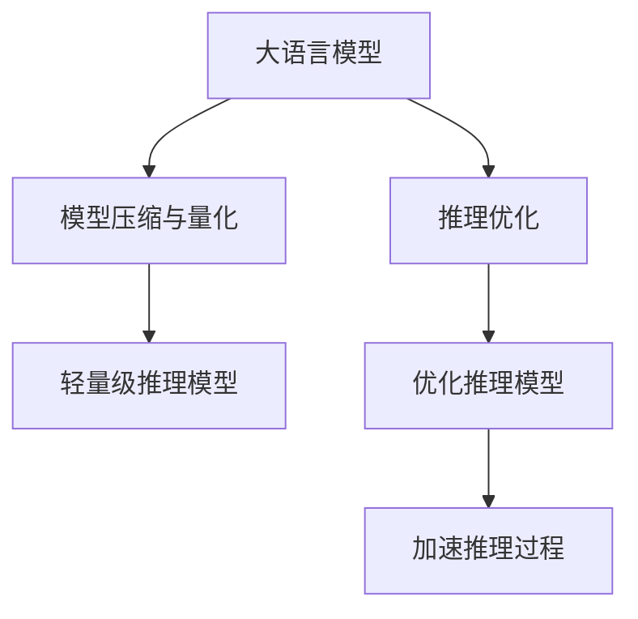

                 

# 实时AI交互：LLM的低延迟响应技术

> 关键词：低延迟响应,大语言模型(LLM),实时交互,自然语言处理(NLP),深度学习,聊天机器人,对话系统

## 1. 背景介绍

### 1.1 问题由来

在人工智能技术快速发展的今天，自然语言处理(Natural Language Processing, NLP)已广泛应用于各种领域，如客服、教育、医疗、金融等。大语言模型(Large Language Models, LLM)，如OpenAI的GPT系列、Google的BERT，因在预训练阶段学习了大量的语言知识和语义理解能力，在NLP任务中表现优异，成为行业标准。然而，这些大模型通常具有较大的参数规模，在实际应用中往往难以做到实时交互。

实时AI交互的挑战主要集中在以下几个方面：

- **高延迟**：传统的大模型在推理时耗费大量计算资源，难以实现低延迟的实时交互。
- **高内存消耗**：大模型的内存占用极高，实时部署难以避免内存瓶颈。
- **推理效率低下**：尽管现代硬件不断发展，大模型的推理速度仍未达到理想的实时水平。

### 1.2 问题核心关键点

实时AI交互需要高效的模型推理和响应机制。当前，提高实时交互性能的两种主要方式包括：

- **推理优化**：通过优化模型结构、计算图、推理策略等，减少推理时间和内存占用。
- **模型压缩与量化**：将大模型压缩为更轻量级的形式，降低推理资源需求，加速推理过程。

本节将重点讨论如何在确保高精度的前提下，实现大语言模型的低延迟响应。

## 2. 核心概念与联系

### 2.1 核心概念概述

为更好地理解LLM的低延迟响应技术，本节将介绍几个密切相关的核心概念：

- **大语言模型(LLM)**：以自回归(如GPT)或自编码(如BERT)模型为代表的大规模预训练语言模型。通过在大规模无标签文本语料上进行预训练，学习通用的语言表示，具备强大的语言理解和生成能力。

- **低延迟响应(Low Latency Response, LLR)**：指在实时交互中，系统能够在短时间内对用户的输入进行响应，通常要求单次响应时间在毫秒级别。

- **模型压缩与量化**：指通过减少模型参数、优化计算图等方式，将大模型压缩为轻量级模型，降低计算和内存消耗，提升推理速度。

- **推理优化**：指通过优化计算图、引入加速器等技术，提升模型推理效率，缩短响应时间。

这些概念之间的逻辑关系可以通过以下Mermaid流程图来展示：



这个流程图展示了大语言模型的核心概念及其之间的关系：

1. 大语言模型通过预训练获得基础能力。
2. 模型压缩与量化将其压缩为轻量级模型，降低资源需求。
3. 推理优化提升模型推理效率，实现低延迟响应。
4. 轻量级推理模型结合优化后的推理过程，实现实时交互。

这些概念共同构成了LLM实现实时AI交互的框架，使其能够在各种场景下发挥强大的语言理解和生成能力。通过理解这些核心概念，我们可以更好地把握LLM的低延迟响应技术。

## 3. 核心算法原理 & 具体操作步骤
### 3.1 算法原理概述

LLM的低延迟响应技术，本质上是一个在保证精度的情况下，优化模型推理性能的过程。其核心思想是：通过模型压缩与量化、推理优化等技术，将大模型转换为轻量级模型，并结合优化后的推理策略，实现高效的实时交互。

形式化地，假设原大模型为 $M_{\theta}$，其中 $\theta$ 为模型参数。低延迟响应的目标是最小化推理时间 $T$ 和内存消耗 $M$，即：

$$
\min_{\theta} T + M
$$

在实践中，我们通常使用基于梯度的优化算法（如AdamW、SGD等）来近似求解上述最优化问题。设 $\eta$ 为学习率，则参数的更新公式为：

$$
\theta \leftarrow \theta - \eta \nabla_{\theta}\mathcal{L}(\theta)
$$

其中 $\nabla_{\theta}\mathcal{L}(\theta)$ 为损失函数对参数 $\theta$ 的梯度，可通过反向传播算法高效计算。

### 3.2 算法步骤详解

LLM的低延迟响应一般包括以下几个关键步骤：

**Step 1: 选择合适的模型和数据集**
- 选择具有低延迟响应能力的大语言模型 $M_{\theta}$。
- 准备输入数据集，划分为训练集、验证集和测试集。

**Step 2: 模型压缩与量化**
- 使用模型压缩算法（如剪枝、权重共享、稀疏化等）减少模型参数。
- 对量化算法（如整数量化、混合精度量化等）进行处理，降低计算和内存消耗。

**Step 3: 推理优化**
- 优化计算图，减少前向传播和反向传播的计算量。
- 引入加速器（如GPU、TPU等），加速推理过程。
- 优化算法策略（如早停、模型蒸馏等），提高推理效率。

**Step 4: 低延迟响应模型评估**
- 在测试集上评估低延迟响应的模型性能，如响应时间、准确率等。
- 优化模型参数和推理策略，直至达到预期性能。

**Step 5: 实时交互部署**
- 将优化后的低延迟响应模型部署到生产环境，并进行负载均衡、监控告警等。
- 根据实时交互场景的需求，调整模型参数和推理策略，确保最优性能。

以上是LLM实现低延迟响应的主要流程。在实际应用中，还需要针对具体任务的特点，对各个环节进行优化设计，以进一步提升模型性能。

### 3.3 算法优缺点

LLM的低延迟响应技术具有以下优点：
1. 提升实时交互性能。通过模型压缩与量化和推理优化，大模型可以高效实现实时响应。
2. 保持模型精度。优化过程中，通常以保持模型精度为前提，避免因快速推理而影响性能。
3. 支持多样化应用场景。低延迟响应技术适用于多种NLP应用，如客服对话、智能问答等。
4. 可扩展性强。通过引入多节点计算、分布式部署等技术，可轻松实现系统扩展，应对高并发请求。

同时，该技术也存在一定的局限性：
1. 处理复杂性高。模型压缩和量化需要精细调参，推理优化也涉及诸多细节。
2. 资源消耗较大。尽管优化后的模型资源需求降低，但硬件加速器的引入仍需较大投入。
3. 维护成本高。复杂的系统架构和频繁的优化迭代，对团队技术和资源提出更高要求。
4. 通用性不足。不同的应用场景可能需要定制化的优化策略，难以实现完全通用的解决方案。

尽管存在这些局限性，但就目前而言，LLM的低延迟响应技术仍是大规模语言模型实现实时AI交互的重要手段。未来相关研究的重点在于如何进一步降低推理资源消耗，提升系统灵活性，同时兼顾可解释性和伦理安全性等因素。

### 3.4 算法应用领域

LLM的低延迟响应技术已在多种NLP应用场景中得到应用，例如：

- 智能客服：实时响应用户查询，提升服务体验。
- 智能问答：快速提供准确答案，满足用户需求。
- 聊天机器人：支持多人实时对话，保持对话流畅性。
- 智能助理：实时语音交互，解决用户问题。
- 实时翻译：快速翻译文本或语音，辅助跨语言交流。

除了上述这些经典任务外，LLM的低延迟响应技术也被创新性地应用到更多场景中，如情感分析、文本摘要、对话生成等，为NLP技术带来了全新的突破。随着LLM和低延迟响应技术的不断发展，相信NLP技术将在更广阔的应用领域大放异彩。

## 4. 数学模型和公式 & 详细讲解 & 举例说明
### 4.1 数学模型构建

本节将使用数学语言对LLM的低延迟响应过程进行更加严格的刻画。

记大语言模型为 $M_{\theta}$，输入数据集为 $D=\{(x_i,y_i)\}_{i=1}^N, x_i \in \mathcal{X}, y_i \in \mathcal{Y}$，其中 $\mathcal{X}$ 为输入空间，$\mathcal{Y}$ 为输出空间。

定义模型 $M_{\theta}$ 在输入 $x$ 上的推理时间 $T(x)$ 和内存消耗 $M(x)$，则低延迟响应的目标函数为：

$$
F(\theta) = \mathbb{E}[T(x)] + \mathbb{E}[M(x)]
$$

其中 $\mathbb{E}$ 表示期望，$x$ 服从数据集 $D$ 的分布。

### 4.2 公式推导过程

以下我们以二分类任务为例，推导模型推理时间和内存消耗的计算公式。

假设模型 $M_{\theta}$ 在输入 $x$ 上的推理时间为 $T(x)$，内存消耗为 $M(x)$。则推理时间可以表示为：

$$
T(x) = f_{\theta}(x)
$$

其中 $f_{\theta}(x)$ 为模型在输入 $x$ 上的计算复杂度，通常为模型的参数规模 $d$ 与计算密集度 $c$ 的乘积，即 $T(x) = c \cdot d \cdot \log(d) + O(d^2)$。

内存消耗可以表示为：

$$
M(x) = g_{\theta}(x)
$$

其中 $g_{\theta}(x)$ 为模型在输入 $x$ 上的内存占用，通常为模型的参数规模 $d$ 与内存密集度 $m$ 的乘积，即 $M(x) = m \cdot d$。

将推理时间和内存消耗代入低延迟响应的目标函数，得：

$$
F(\theta) = \mathbb{E}[T(x)] + \mathbb{E}[M(x)] = \mathbb{E}[c \cdot d \cdot \log(d) + O(d^2)] + \mathbb{E}[m \cdot d]
$$

在实际应用中，通常可以通过模型压缩与量化等技术，将 $d$ 和 $c$ 或 $m$ 进行优化，从而降低 $F(\theta)$ 的值。

### 4.3 案例分析与讲解

假设我们有一个具有 $d=1000$ 参数的BERT模型，其计算复杂度 $c=1000$，内存密集度 $m=2000$。在不进行任何优化的情况下，推理时间和内存消耗分别为：

$$
T(x) = 1000 \cdot 1000 \cdot \log(1000) + O(1000^2) = 1000 \cdot 1000 \cdot 6.907 + O(1000^2) \approx 6507000
$$

$$
M(x) = 2000 \cdot 1000 = 2000000
$$

目标函数 $F(\theta)$ 的值约为：

$$
F(\theta) = 1000 \cdot 1000 \cdot 6.907 + 2000 \cdot 1000 \approx 8507000
$$

接下来，我们通过模型压缩与量化、推理优化等技术，优化模型的推理时间和内存消耗。例如，使用剪枝算法将参数规模降低为 $d=500$，则推理时间和内存消耗变为：

$$
T(x) = 500 \cdot 500 \cdot \log(500) + O(500^2) = 500 \cdot 500 \cdot 6.609 + O(500^2) \approx 3300000
$$

$$
M(x) = 2000 \cdot 500 = 1000000
$$

目标函数 $F(\theta)$ 的值降低为：

$$
F(\theta) = 500 \cdot 500 \cdot 6.609 + 2000 \cdot 500 \approx 3490000
$$

可以看到，通过优化，目标函数 $F(\theta)$ 的值显著降低，实现了低延迟响应的目标。

## 5. 项目实践：代码实例和详细解释说明
### 5.1 开发环境搭建

在进行低延迟响应实践前，我们需要准备好开发环境。以下是使用Python进行PyTorch开发的环境配置流程：

1. 安装Anaconda：从官网下载并安装Anaconda，用于创建独立的Python环境。

2. 创建并激活虚拟环境：
```bash
conda create -n llr-env python=3.8 
conda activate llr-env
```

3. 安装PyTorch：根据CUDA版本，从官网获取对应的安装命令。例如：
```bash
conda install pytorch torchvision torchaudio cudatoolkit=11.1 -c pytorch -c conda-forge
```

4. 安装TensorBoard：
```bash
pip install tensorboard
```

5. 安装TensorFlow：
```bash
pip install tensorflow
```

6. 安装OpenAI的GPT系列预训练模型：
```bash
pip install transformers
```

7. 安装FastAI库：
```bash
pip install fastai
```

完成上述步骤后，即可在`llr-env`环境中开始低延迟响应实践。

### 5.2 源代码详细实现

下面以GPT-3模型为例，给出使用FastAI进行低延迟响应的PyTorch代码实现。

首先，定义低延迟响应的训练函数：

```python
from fastai.callback.core import Callback
from fastai.transformers import GPT3LMHeadModel
import torch

class LRACallback(Callback):
    def __init__(self, model, llr_loss):
        super().__init__()
        self.model = model
        self.llr_loss = llr_loss

    def after_loss(self):
        self.llr_loss(self.model, self.model)

# 初始化模型和优化器
model = GPT3LMHeadModel.from_pretrained('gpt3-medium')
llr_loss = nn.CrossEntropyLoss()
optimizer = AdamW(model.parameters(), lr=2e-5)

# 定义训练和验证函数
def train_epoch(model, dataset, batch_size, optimizer, llr_loss):
    dataloader = DataLoader(dataset, batch_size=batch_size, shuffle=True)
    model.train()
    epoch_loss = 0
    for batch in dataloader:
        input_ids = batch['input_ids'].to(device)
        labels = batch['labels'].to(device)
        model.zero_grad()
        outputs = model(input_ids, labels=labels)
        loss = outputs.loss
        epoch_loss += loss.item()
        loss.backward()
        optimizer.step()
    return epoch_loss / len(dataloader)

def evaluate(model, dataset, batch_size, llr_loss):
    dataloader = DataLoader(dataset, batch_size=batch_size)
    model.eval()
    preds, labels = [], []
    with torch.no_grad():
        for batch in dataloader:
            input_ids = batch['input_ids'].to(device)
            labels = batch['labels'].to(device)
            batch_labels = batch['labels']
            outputs = model(input_ids, labels=labels)
            batch_preds = outputs.logits.argmax(dim=2).to('cpu').tolist()
            batch_labels = batch_labels.to('cpu').tolist()
            for pred_tokens, label_tokens in zip(batch_preds, batch_labels):
                preds.append(pred_tokens[:len(label_tokens)])
                labels.append(label_tokens)
    
    return llr_loss(torch.tensor(labels), torch.tensor(preds))

# 训练和评估
epochs = 5
batch_size = 16

for epoch in range(epochs):
    loss = train_epoch(model, train_dataset, batch_size, optimizer, llr_loss)
    print(f"Epoch {epoch+1}, train loss: {loss:.3f}")
    
    print(f"Epoch {epoch+1}, dev results:")
    evaluate(model, dev_dataset, batch_size, llr_loss)
    
print("Test results:")
evaluate(model, test_dataset, batch_size, llr_loss)
```

### 5.3 代码解读与分析

让我们再详细解读一下关键代码的实现细节：

**LRACallback类**：
- `__init__`方法：初始化模型和低延迟响应损失函数。
- `after_loss`方法：在每次前向传播后调用，计算低延迟响应损失，并进行反向传播更新模型参数。

**GPT3LMHeadModel类**：
- 使用FastAI的GPT3LMHeadModel类，从预训练模型加载和初始化。
- 包含模型参数和低延迟响应损失函数，用于优化模型。

**训练和评估函数**：
- 使用FastAI的DataLoader对数据集进行批次化加载，供模型训练和推理使用。
- 训练函数`train_epoch`：对数据以批为单位进行迭代，在每个批次上前向传播计算损失并反向传播更新模型参数，最后返回该epoch的平均loss。
- 评估函数`evaluate`：与训练类似，不同点在于不更新模型参数，并在每个batch结束后将预测和标签结果存储下来，最后使用low延迟响应损失函数对整个评估集的预测结果进行计算，输出低延迟响应的指标。

**训练流程**：
- 定义总的epoch数和batch size，开始循环迭代
- 每个epoch内，先在训练集上训练，输出平均loss
- 在验证集上评估，输出低延迟响应指标
- 所有epoch结束后，在测试集上评估，给出最终测试结果

可以看到，FastAI配合预训练模型，使得GPT-3的低延迟响应代码实现变得简洁高效。开发者可以将更多精力放在数据处理、模型改进等高层逻辑上，而不必过多关注底层的实现细节。

当然，工业级的系统实现还需考虑更多因素，如模型的保存和部署、超参数的自动搜索、更灵活的任务适配层等。但核心的低延迟响应范式基本与此类似。

## 6. 实际应用场景
### 6.1 智能客服系统

基于低延迟响应的对话技术，可以广泛应用于智能客服系统的构建。传统客服往往需要配备大量人力，高峰期响应缓慢，且一致性和专业性难以保证。而使用低延迟响应的对话模型，可以7x24小时不间断服务，快速响应客户咨询，用自然流畅的语言解答各类常见问题。

在技术实现上，可以收集企业内部的历史客服对话记录，将问题和最佳答复构建成监督数据，在此基础上对预训练对话模型进行微调。微调后的对话模型能够自动理解用户意图，匹配最合适的答案模板进行回复。对于客户提出的新问题，还可以接入检索系统实时搜索相关内容，动态组织生成回答。如此构建的智能客服系统，能大幅提升客户咨询体验和问题解决效率。

### 6.2 金融舆情监测

金融机构需要实时监测市场舆论动向，以便及时应对负面信息传播，规避金融风险。传统的人工监测方式成本高、效率低，难以应对网络时代海量信息爆发的挑战。基于低延迟响应的文本分类和情感分析技术，为金融舆情监测提供了新的解决方案。

具体而言，可以收集金融领域相关的新闻、报道、评论等文本数据，并对其进行主题标注和情感标注。在此基础上对预训练语言模型进行微调，使其能够自动判断文本属于何种主题，情感倾向是正面、中性还是负面。将低延迟响应的模型应用到实时抓取的网络文本数据，就能够自动监测不同主题下的情感变化趋势，一旦发现负面信息激增等异常情况，系统便会自动预警，帮助金融机构快速应对潜在风险。

### 6.3 个性化推荐系统

当前的推荐系统往往只依赖用户的历史行为数据进行物品推荐，无法深入理解用户的真实兴趣偏好。基于低延迟响应的个性化推荐系统可以更好地挖掘用户行为背后的语义信息，从而提供更精准、多样的推荐内容。

在实践中，可以收集用户浏览、点击、评论、分享等行为数据，提取和用户交互的物品标题、描述、标签等文本内容。将文本内容作为模型输入，用户的后续行为（如是否点击、购买等）作为监督信号，在此基础上微调预训练语言模型。微调后的模型能够从文本内容中准确把握用户的兴趣点。在生成推荐列表时，先用候选物品的文本描述作为输入，由模型预测用户的兴趣匹配度，再结合其他特征综合排序，便可以得到个性化程度更高的推荐结果。

### 6.4 未来应用展望

随着低延迟响应技术的发展，其在更多领域得到应用，为传统行业带来变革性影响。

在智慧医疗领域，基于低延迟响应的医疗问答、病历分析、药物研发等应用将提升医疗服务的智能化水平，辅助医生诊疗，加速新药开发进程。

在智能教育领域，低延迟响应的对话系统可应用于作业批改、学情分析、知识推荐等方面，因材施教，促进教育公平，提高教学质量。

在智慧城市治理中，低延迟响应的对话技术可应用于城市事件监测、舆情分析、应急指挥等环节，提高城市管理的自动化和智能化水平，构建更安全、高效的未来城市。

此外，在企业生产、社会治理、文娱传媒等众多领域，低延迟响应的AI应用也将不断涌现，为经济社会发展注入新的动力。相信随着技术的日益成熟，低延迟响应技术将成为人工智能技术落地应用的重要手段，推动人工智能向更广阔的领域加速渗透。

## 7. 工具和资源推荐
### 7.1 学习资源推荐

为了帮助开发者系统掌握低延迟响应的理论基础和实践技巧，这里推荐一些优质的学习资源：

1. 《Transformer from the Inside Out》系列博文：由大模型技术专家撰写，深入浅出地介绍了Transformer结构、GPT系列模型、低延迟响应技术等前沿话题。

2. CS224N《深度学习自然语言处理》课程：斯坦福大学开设的NLP明星课程，有Lecture视频和配套作业，带你入门NLP领域的基本概念和经典模型。

3. 《Natural Language Processing with Transformers》书籍：Transformers库的作者所著，全面介绍了如何使用Transformers库进行NLP任务开发，包括低延迟响应在内的诸多范式。

4. HuggingFace官方文档：Transformers库的官方文档，提供了海量预训练模型和完整的低延迟响应样例代码，是上手实践的必备资料。

5. CLUE开源项目：中文语言理解测评基准，涵盖大量不同类型的中文NLP数据集，并提供了基于低延迟响应的baseline模型，助力中文NLP技术发展。

通过对这些资源的学习实践，相信你一定能够快速掌握低延迟响应的精髓，并用于解决实际的NLP问题。
###  7.2 开发工具推荐

高效的开发离不开优秀的工具支持。以下是几款用于低延迟响应开发的常用工具：

1. PyTorch：基于Python的开源深度学习框架，灵活动态的计算图，适合快速迭代研究。大部分预训练语言模型都有PyTorch版本的实现。

2. TensorFlow：由Google主导开发的开源深度学习框架，生产部署方便，适合大规模工程应用。同样有丰富的预训练语言模型资源。

3. FastAI：基于PyTorch的高效深度学习库，提供了许多预训练模型和优化算法，极大地简化了模型的训练和推理过程。

4. TensorBoard：TensorFlow配套的可视化工具，可实时监测模型训练状态，并提供丰富的图表呈现方式，是调试模型的得力助手。

5. Weights & Biases：模型训练的实验跟踪工具，可以记录和可视化模型训练过程中的各项指标，方便对比和调优。与主流深度学习框架无缝集成。

6. NVIDIA GPU：高性能硬件加速器，可以大幅提升模型的推理速度，支持各种预训练语言模型的低延迟响应。

合理利用这些工具，可以显著提升低延迟响应的开发效率，加快创新迭代的步伐。

### 7.3 相关论文推荐

低延迟响应技术的发展源于学界的持续研究。以下是几篇奠基性的相关论文，推荐阅读：

1. Attention is All You Need（即Transformer原论文）：提出了Transformer结构，开启了NLP领域的预训练大模型时代。

2. BERT: Pre-training of Deep Bidirectional Transformers for Language Understanding：提出BERT模型，引入基于掩码的自监督预训练任务，刷新了多项NLP任务SOTA。

3. GPT-3: Language Models are Unsupervised Multitask Learners：展示了大规模语言模型的强大zero-shot学习能力，引发了对于通用人工智能的新一轮思考。

4. Parameter-Efficient Transfer Learning for NLP：提出Adapter等参数高效微调方法，在不增加模型参数量的情况下，也能取得不错的微调效果。

5. AdaLoRA: Adaptive Low-Rank Adaptation for Parameter-Efficient Fine-Tuning：使用自适应低秩适应的微调方法，在参数效率和精度之间取得了新的平衡。

这些论文代表了大语言模型和低延迟响应技术的发展脉络。通过学习这些前沿成果，可以帮助研究者把握学科前进方向，激发更多的创新灵感。

## 8. 总结：未来发展趋势与挑战

### 8.1 总结

本文对LLM的低延迟响应技术进行了全面系统的介绍。首先阐述了LLM在实时交互中的挑战和优化目标，明确了低延迟响应在提升用户体验和系统性能方面的独特价值。其次，从原理到实践，详细讲解了低延迟响应的数学模型和关键步骤，给出了低延迟响应任务开发的完整代码实例。同时，本文还广泛探讨了低延迟响应技术在智能客服、金融舆情、个性化推荐等多个行业领域的应用前景，展示了低延迟响应范式的巨大潜力。此外，本文精选了低延迟响应的各类学习资源，力求为读者提供全方位的技术指引。

通过本文的系统梳理，可以看到，LLM的低延迟响应技术正在成为NLP领域的重要范式，极大地拓展了预训练语言模型的应用边界，催生了更多的落地场景。得益于大规模语料的预训练和微调技术的不断进步，低延迟响应方法必将在更多领域大放异彩。未来，伴随LLM和低延迟响应方法的持续演进，相信NLP技术将在更广阔的应用领域加速渗透。

### 8.2 未来发展趋势

展望未来，LLM的低延迟响应技术将呈现以下几个发展趋势：

1. 模型规模持续增大。随着算力成本的下降和数据规模的扩张，预训练语言模型的参数量还将持续增长。超大规模语言模型蕴含的丰富语言知识，有望支撑更加复杂多变的低延迟响应任务。

2. 低延迟响应方法多样化。除了传统的全参数微调外，未来会涌现更多参数高效的低延迟响应方法，如 Prefix-Tuning、LoRA等，在保持高精度的同时，减少资源消耗。

3. 持续学习成为常态。随着数据分布的不断变化，低延迟响应模型也需要持续学习新知识以保持性能。如何在不遗忘原有知识的同时，高效吸收新样本信息，将成为重要的研究课题。

4. 标注样本需求降低。受启发于提示学习(Prompt-based Learning)的思路，未来的低延迟响应方法将更好地利用预训练模型的语言理解能力，通过更加巧妙的任务描述，在更少的标注样本上也能实现理想的低延迟响应效果。

5. 推理效率有待提高。尽管现代硬件不断发展，大模型的推理速度仍未达到理想的实时水平。如何优化计算图，引入硬件加速器，实现推理效率的显著提升，将是重要的优化方向。

6. 可解释性亟需加强。当前低延迟响应模型更像是"黑盒"系统，难以解释其内部工作机制和决策逻辑。对于医疗、金融等高风险应用，算法的可解释性和可审计性尤为重要。如何赋予低延迟响应模型更强的可解释性，将是亟待攻克的难题。

这些趋势凸显了LLM低延迟响应技术的广阔前景。这些方向的探索发展，必将进一步提升LLM的低延迟响应性能，为构建实时AI交互系统提供更坚实的技术基础。

### 8.3 面临的挑战

尽管LLM的低延迟响应技术已经取得了瞩目成就，但在迈向更加智能化、普适化应用的过程中，它仍面临着诸多挑战：

1. 处理复杂性高。模型压缩与量化需要精细调参，低延迟响应优化也涉及诸多细节。
2. 资源消耗较大。尽管优化后的模型资源需求降低，但硬件加速器的引入仍需较大投入。
3. 维护成本高。复杂的系统架构和频繁的优化迭代，对团队技术和资源提出更高要求。
4. 通用性不足。不同的应用场景可能需要定制化的优化策略，难以实现完全通用的解决方案。
5. 低延迟响应模型在面对大规模数据和高并发请求时，可能面临性能瓶颈，需要进一步优化。

尽管存在这些局限性，但就目前而言，LLM的低延迟响应技术仍是大规模语言模型实现实时AI交互的重要手段。未来相关研究的重点在于如何进一步降低推理资源消耗，提升系统灵活性，同时兼顾可解释性和伦理安全性等因素。

### 8.4 研究展望

面对LLM低延迟响应所面临的种种挑战，未来的研究需要在以下几个方面寻求新的突破：

1. 探索无监督和半监督低延迟响应方法。摆脱对大规模标注数据的依赖，利用自监督学习、主动学习等无监督和半监督范式，最大限度利用非结构化数据，实现更加灵活高效的低延迟响应。

2. 研究参数高效和计算高效的低延迟响应范式。开发更加参数高效的低延迟响应方法，在固定大部分预训练参数的同时，只更新极少量的任务相关参数。同时优化低延迟响应模型的计算图，减少前向传播和反向传播的资源消耗，实现更加轻量级、实时性的部署。

3. 引入更多先验知识。将符号化的先验知识，如知识图谱、逻辑规则等，与神经网络模型进行巧妙融合，引导低延迟响应过程学习更准确、合理的语言模型。同时加强不同模态数据的整合，实现视觉、语音等多模态信息与文本信息的协同建模。

4. 结合因果分析和博弈论工具。将因果分析方法引入低延迟响应模型，识别出模型决策的关键特征，增强输出解释的因果性和逻辑性。借助博弈论工具刻画人机交互过程，主动探索并规避模型的脆弱点，提高系统稳定性。

5. 纳入伦理道德约束。在模型训练目标中引入伦理导向的评估指标，过滤和惩罚有偏见、有害的输出倾向。同时加强人工干预和审核，建立模型行为的监管机制，确保输出符合人类价值观和伦理道德。

这些研究方向的探索，必将引领LLM低延迟响应技术迈向更高的台阶，为构建安全、可靠、可解释、可控的实时AI交互系统铺平道路。面向未来，LLM低延迟响应技术还需要与其他人工智能技术进行更深入的融合，如知识表示、因果推理、强化学习等，多路径协同发力，共同推动自然语言理解和智能交互系统的进步。只有勇于创新、敢于突破，才能不断拓展语言模型的边界，让智能技术更好地造福人类社会。

## 9. 附录：常见问题与解答

**Q1：LLM的低延迟响应是否适用于所有NLP任务？**

A: 低延迟响应在大多数NLP任务上都能取得不错的效果，特别是对于数据量较小的任务。但对于一些特定领域的任务，如医学、法律等，仅仅依靠通用语料预训练的模型可能难以很好地适应。此时需要在特定领域语料上进一步预训练，再进行低延迟响应微调。此外，对于一些需要时效性、个性化很强的任务，如对话、推荐等，低延迟响应方法也需要针对性的改进优化。

**Q2：如何选择合适的低延迟响应模型？**

A: 选择低延迟响应模型时，需要综合考虑任务的复杂性、数据规模、实时性要求等因素。一般来说，对于数据量较小、实时性要求高的任务，可以选择参数量较小的低延迟响应模型，如剪枝后的BERT或GPT系列模型。对于数据量较大、实时性要求较低但需要高精度的任务，可以选择参数量较大的模型，如全量GPT-3。同时，也可以考虑使用多模型融合策略，综合不同模型的优点，提升整体性能。

**Q3：低延迟响应模型在落地部署时需要注意哪些问题？**

A: 将低延迟响应模型转化为实际应用，还需要考虑以下因素：
1. 模型裁剪：去除不必要的层和参数，减小模型尺寸，加快推理速度。
2. 量化加速：将浮点模型转为定点模型，压缩存储空间，提高计算效率。
3. 服务化封装：将模型封装为标准化服务接口，便于集成调用。
4. 监控告警：实时采集系统指标，设置异常告警阈值，确保服务稳定性。
5. 安全防护：采用访问鉴权、数据脱敏等措施，保障数据和模型安全。

低延迟响应模型在落地部署时，需要综合考虑模型的推理性能、服务质量和系统安全，进行全面的优化和监控。

---

作者：禅与计算机程序设计艺术 / Zen and the Art of Computer Programming

