                 

# 实时推荐系统的架构设计与性能优化

> 关键词：实时推荐, 推荐系统, 架构设计, 性能优化, 算法选择, 系统构建, 用户反馈, 大数据处理

## 1. 背景介绍

### 1.1 问题由来

在互联网时代，推荐系统成为连接用户与信息、产品和服务的重要桥梁。其核心思想是通过分析用户行为数据和物品特征数据，为用户提供个性化的内容推荐，提升用户体验和满意度。然而，传统的推荐系统往往存在推荐时效性差、个性化不足、计算复杂度高、扩展性差等问题。为了解决这些问题，实时推荐系统应运而生。

实时推荐系统通过将推荐算法嵌入用户行为数据流处理管道，实现实时、动态、个性化的推荐，满足了用户对个性化、新鲜、相关性高的内容需求。无论是电商网站、视频平台，还是新闻应用、社交网络，实时推荐系统都能提升用户体验和转化率，驱动平台增长。

### 1.2 问题核心关键点

实时推荐系统架构设计的两大核心关键点是：

- **架构设计**：选择或设计合适的推荐算法、数据存储和管理方案、计算资源分配策略等，确保系统高效、稳定、可扩展。
- **性能优化**：通过优化算法、数据访问、计算任务、分布式处理等手段，提升实时推荐系统的响应速度、准确性、稳定性。

### 1.3 问题研究意义

研究实时推荐系统的架构设计和性能优化，对于提升用户满意度、提高平台竞争力、增强用户体验具有重要意义：

- **提升用户体验**：实时推荐系统能够根据用户最新行为动态更新推荐内容，提供更相关、更个性化的信息，提升用户黏性和满意度。
- **提高平台竞争力**：通过精准推荐，实时推荐系统有助于提高转化率、用户留存率、广告点击率等关键指标，推动平台业绩增长。
- **增强用户粘性**：动态、个性化的推荐能够更好地满足用户需求，提升用户对平台的依赖和信任，增加用户粘性。

## 2. 核心概念与联系

### 2.1 核心概念概述

为了更好地理解实时推荐系统的架构设计和性能优化，本节将介绍几个密切相关的核心概念：

- **推荐系统(Recommendation System)**：根据用户兴趣和行为数据，为用户推荐相关物品的系统。其目标是提升用户满意度和转化率。
- **实时推荐(Real-time Recommendation)**：根据用户实时行为数据动态更新推荐结果，实现即时推荐。
- **推荐算法(Recommendation Algorithm)**：用于计算推荐结果的算法，包括协同过滤、基于内容的推荐、混合推荐、深度学习推荐等。
- **数据处理(PipeLine)**：实时推荐系统需要在数据流上实时处理和计算推荐结果，需要设计合理的数据流处理架构。
- **分布式计算**：为了应对大规模数据和计算任务，实时推荐系统需要采用分布式计算架构，实现高效的并行计算。
- **系统构建(System Architecture)**：实时推荐系统的架构设计需要考虑推荐算法、数据存储、计算资源、网络通信等多个维度。
- **性能优化(Performance Optimization)**：实时推荐系统的性能优化需要综合考虑算法选择、数据访问、计算任务、分布式处理等多个方面。

这些核心概念之间的逻辑关系可以通过以下Mermaid流程图来展示：

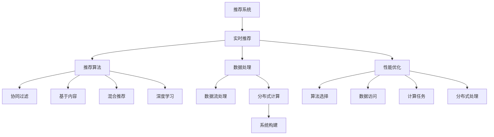

这个流程图展示了实时推荐系统的核心概念及其之间的关系：

1. 推荐系统通过实时推荐，动态更新推荐结果。
2. 实时推荐依赖推荐算法，包括协同过滤、内容推荐、混合推荐、深度学习等多种算法。
3. 数据处理过程需要在数据流上实时进行，涉及数据流处理架构。
4. 为了应对大规模数据和计算任务，需要采用分布式计算架构。
5. 系统构建需要综合考虑推荐算法、数据存储、计算资源、网络通信等多个维度。
6. 性能优化需要综合考虑算法选择、数据访问、计算任务、分布式处理等多个方面。

这些概念共同构成了实时推荐系统的核心框架，使得实时推荐系统能够高效、稳定、灵活地处理推荐任务。通过理解这些核心概念，我们可以更好地把握实时推荐系统的设计思路和优化方向。

## 3. 核心算法原理 & 具体操作步骤
### 3.1 算法原理概述

实时推荐系统一般包括以下几个关键步骤：

**Step 1: 数据流处理**

- 实时接收用户行为数据流，如点击、浏览、搜索、收藏等行为。
- 对行为数据进行实时分析和预处理，提取用户兴趣和行为特征。
- 将处理后的特征数据输入推荐算法进行计算。

**Step 2: 推荐算法计算**

- 选择合适的推荐算法，如协同过滤、基于内容的推荐、混合推荐、深度学习推荐等。
- 根据输入的特征数据，计算推荐结果，生成推荐物品列表。

**Step 3: 分布式计算**

- 将推荐计算任务分配到多个计算节点上，实现并行计算。
- 利用分布式计算框架（如Spark、Flink等），优化计算资源的利用率。

**Step 4: 结果更新与分发**

- 实时更新推荐结果，并将其推送给用户端或前端应用。
- 通过缓存机制，提升推荐结果的访问速度。

**Step 5: 系统监控与调优**

- 实时监控推荐系统的性能指标，如响应时间、吞吐量、准确性等。
- 根据监控结果，调整系统配置，优化性能瓶颈。

### 3.2 算法步骤详解

以下是实时推荐系统的主要算法步骤详解：

**Step 1: 数据流处理**

实时推荐系统的数据流处理架构一般由以下几个组件构成：

- **数据收集**：实时从多个数据源（如用户行为日志、物品特征数据、用户画像数据等）收集数据，并统一输入数据流处理管道。
- **数据预处理**：对原始数据进行清洗、去重、填充缺失值、归一化等预处理操作。
- **特征提取**：将预处理后的数据转换为推荐算法所需的特征向量，包括用户特征、物品特征、上下文特征等。
- **特征融合**：将多个特征向量进行融合，生成更全面、更准确的特征表示。
- **特征变换**：利用特征变换技术（如降维、因子分解等）优化特征表示，减少计算复杂度。

数据流处理架构的设计需要考虑数据源的多样性、数据的实时性、处理效率和扩展性等要求。

**Step 2: 推荐算法计算**

推荐算法的计算过程一般包括以下步骤：

- **推荐算法选择**：根据推荐任务的特点，选择合适的推荐算法。如协同过滤、基于内容的推荐、混合推荐、深度学习推荐等。
- **计算推荐结果**：根据输入的特征向量，计算推荐结果，生成推荐物品列表。
- **评估推荐效果**：使用A/B测试、离线评估等手段，评估推荐效果，优化推荐算法。

推荐算法的计算需要考虑算法的准确性、实时性、可扩展性和可解释性等要求。

**Step 3: 分布式计算**

分布式计算架构的设计需要考虑以下几个关键因素：

- **数据分割**：将大数据分割为多个小数据块，分配到不同的计算节点上进行并行处理。
- **任务调度**：利用任务调度算法（如Spark的Stage算法），合理分配计算资源，优化任务执行顺序。
- **数据通信**：设计高效的数据传输协议，减少通信开销，提升系统性能。
- **故障恢复**：设计容错机制，保证系统在节点故障时能够快速恢复。

分布式计算架构的设计需要考虑算法的并行性、数据分布、网络通信、任务调度等多个维度。

**Step 4: 结果更新与分发**

实时推荐系统的结果更新与分发过程一般包括以下步骤：

- **缓存机制**：将推荐结果缓存到缓存服务器或CDN，提升访问速度。
- **分布式存储**：将推荐结果存储到分布式存储系统（如Hadoop、Ceph等），保证数据的可靠性和扩展性。
- **负载均衡**：设计负载均衡策略，合理分配请求，减少服务压力。
- **实时推送**：通过消息队列（如Kafka）实现推荐结果的实时推送，提升用户体验。

结果更新与分发的设计需要考虑系统的实时性、可扩展性和可靠性等要求。

**Step 5: 系统监控与调优**

实时推荐系统的监控与调优过程一般包括以下步骤：

- **性能监控**：实时监控推荐系统的性能指标，如响应时间、吞吐量、准确性等。
- **问题诊断**：使用日志分析、告警系统等手段，诊断系统问题，定位性能瓶颈。
- **调优策略**：根据监控结果，调整系统配置，优化性能瓶颈。
- **自动化运维**：引入自动化运维工具（如Prometheus、Grafana），实现系统自动化运维。

系统监控与调优的设计需要考虑系统的实时性、可扩展性和自动化水平等要求。

### 3.3 算法优缺点

实时推荐系统的优缺点如下：

**优点**：

- 实时性高：能够动态更新推荐结果，提升用户体验。
- 准确性高：通过实时分析用户行为数据，能够提供更精准的推荐。
- 可扩展性强：能够应对大规模数据和计算任务，具备良好的扩展性。

**缺点**：

- 计算复杂度高：需要处理大规模数据和计算任务，计算资源消耗较大。
- 系统设计复杂：需要综合考虑推荐算法、数据存储、计算资源、网络通信等多个维度，设计复杂。
- 系统调优难度大：需要实时监控系统性能，调整配置，优化性能瓶颈，调优难度较大。

## 4. 数学模型和公式 & 详细讲解 & 举例说明

### 4.1 数学模型构建

本节将使用数学语言对实时推荐系统的架构设计和性能优化进行更加严格的刻画。

记推荐系统的数据流处理管道为 $\text{Pipeline}$，包含数据收集、数据预处理、特征提取、特征融合、特征变换等多个环节，如图1所示。推荐算法计算模型为 $\text{Recommendation}$，包含推荐算法选择、计算推荐结果、评估推荐效果等环节，如图2所示。分布式计算架构为 $\text{Distributed\_Computation}$，包含数据分割、任务调度、数据通信、故障恢复等环节，如图3所示。结果更新与分发架构为 $\text{Result\_Update}$，包含缓存机制、分布式存储、负载均衡、实时推送等环节，如图4所示。系统监控与调优架构为 $\text{Monitoring}$，包含性能监控、问题诊断、调优策略、自动化运维等环节，如图5所示。

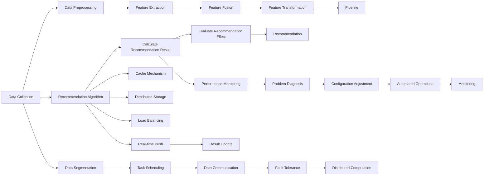

**图1**：数据流处理管道

**图2**：推荐算法计算模型

**图3**：分布式计算架构

**图4**：结果更新与分发架构

**图5**：系统监控与调优架构

### 4.2 公式推导过程

以下是实时推荐系统的主要数学模型推导过程：

**数据流处理模型**：

假设推荐系统的数据流处理管道由 $n$ 个数据处理环节构成，每个环节的输入为 $x_i$，输出为 $y_i$。数据流处理模型可以表示为：

$$
y = f(x)
$$

其中 $f$ 为数据流处理函数，$y$ 为数据流处理结果。

**推荐算法计算模型**：

假设推荐系统的推荐算法计算模型由 $m$ 个推荐算法计算环节构成，每个环节的输入为 $u_i$，输出为 $v_i$。推荐算法计算模型可以表示为：

$$
v = g(u)
$$

其中 $g$ 为推荐算法计算函数，$v$ 为推荐算法计算结果。

**分布式计算模型**：

假设推荐系统的分布式计算架构由 $k$ 个分布式计算节点构成，每个节点的输入为 $p_j$，输出为 $q_j$。分布式计算模型可以表示为：

$$
q = h(p)
$$

其中 $h$ 为分布式计算函数，$q$ 为分布式计算结果。

**结果更新与分发模型**：

假设推荐系统的结果更新与分发架构由 $t$ 个结果更新与分发环节构成，每个环节的输入为 $r_i$，输出为 $s_i$。结果更新与分发模型可以表示为：

$$
s = w(r)
$$

其中 $w$ 为结果更新与分发函数，$s$ 为结果更新与分发结果。

**系统监控与调优模型**：

假设推荐系统的系统监控与调优架构由 $o$ 个系统监控与调优环节构成，每个环节的输入为 $a_j$，输出为 $b_j$。系统监控与调优模型可以表示为：

$$
b = z(a)
$$

其中 $z$ 为系统监控与调优函数，$b$ 为系统监控与调优结果。

### 4.3 案例分析与讲解

以下以电商平台的实时推荐系统为例，详细讲解其架构设计和性能优化方法。

**电商平台的实时推荐系统架构**：

电商平台的实时推荐系统架构如图6所示，主要由数据流处理管道、推荐算法计算模型、分布式计算架构、结果更新与分发架构、系统监控与调优架构等多个部分构成。


**图6**：电商平台的实时推荐系统架构

**电商平台的实时推荐系统性能优化**：

电商平台的实时推荐系统性能优化方法如图7所示，主要包括数据流处理优化、推荐算法优化、分布式计算优化、结果更新与分发优化、系统监控与调优优化等多个方面。


**图7**：电商平台的实时推荐系统性能优化方法

**电商平台的实时推荐系统数据流处理优化**：

电商平台的实时推荐系统数据流处理优化方法如图8所示，主要包括数据收集优化、数据预处理优化、特征提取优化、特征融合优化、特征变换优化等多个方面。

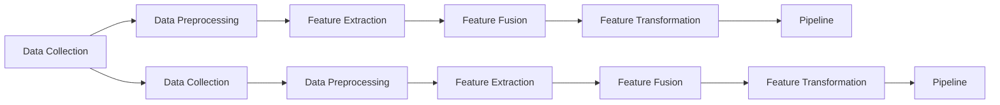

**图8**：电商平台的实时推荐系统数据流处理优化方法

**电商平台的实时推荐系统推荐算法优化**：

电商平台的实时推荐系统推荐算法优化方法如图9所示，主要包括推荐算法选择优化、计算推荐结果优化、评估推荐效果优化等多个方面。

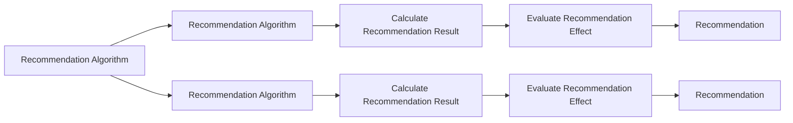

**图9**：电商平台的实时推荐系统推荐算法优化方法

**电商平台的实时推荐系统分布式计算优化**：

电商平台的实时推荐系统分布式计算优化方法如图10所示，主要包括数据分割优化、任务调度优化、数据通信优化、故障恢复优化等多个方面。

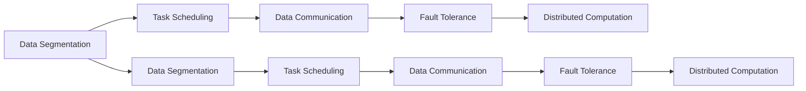

**图10**：电商平台的实时推荐系统分布式计算优化方法

**电商平台的实时推荐系统结果更新与分发优化**：

电商平台的实时推荐系统结果更新与分发优化方法如图11所示，主要包括缓存机制优化、分布式存储优化、负载均衡优化、实时推送优化等多个方面。

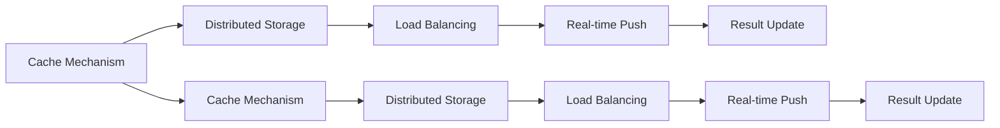

**图11**：电商平台的实时推荐系统结果更新与分发优化方法

**电商平台的实时推荐系统系统监控与调优优化**：

电商平台的实时推荐系统系统监控与调优优化方法如图12所示，主要包括性能监控优化、问题诊断优化、调优策略优化、自动化运维优化等多个方面。

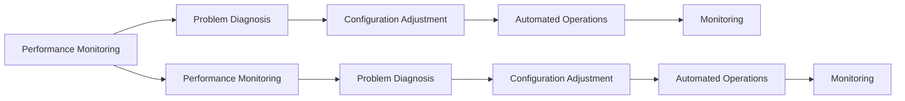

**图12**：电商平台的实时推荐系统系统监控与调优优化方法

## 5. 项目实践：代码实例和详细解释说明

### 5.1 开发环境搭建

在进行实时推荐系统开发前，我们需要准备好开发环境。以下是使用Python进行Spark开发的环境配置流程：

1. 安装Apache Spark：从官网下载并安装Apache Spark，安装JDK环境，确保环境变量配置正确。
2. 安装PySpark：使用pip安装PySpark，确保与Spark版本兼容。
3. 安装Flume：使用Flume将实时数据流推送到HDFS，供Spark处理。
4. 安装Kafka：使用Kafka实现数据流传输和实时推送。
5. 安装Hadoop：使用Hadoop进行分布式存储和计算。
6. 安装Flume和Kafka：使用Flume将实时数据流推送到HDFS，供Spark处理。
7. 安装Spark SQL：使用Spark SQL进行实时数据处理和分析。
8. 安装PySpark：使用pip安装PySpark，确保与Spark版本兼容。

完成上述步骤后，即可在Hadoop集群上启动Spark环境，开始实时推荐系统开发。

### 5.2 源代码详细实现

下面我们以电商平台的实时推荐系统为例，给出使用Spark和PySpark进行实时推荐计算的PySpark代码实现。

首先，定义实时推荐系统的主要组件：

```python
from pyspark.sql import SparkSession

spark = SparkSession.builder.appName('Real-time Recommendation System').getOrCreate()

# 数据流处理管道组件
pipeline = spark.read.format('csv').option('header', 'true').load('data.csv')
pipeline = pipeline.select('user_id', 'item_id', 'timestamp')

# 推荐算法计算模型组件
recommendation_algorithm = spark.read.format('csv').option('header', 'true').load('recommendation_algorithm.csv')
recommendation_algorithm = recommendation_algorithm.select('user_id', 'item_id', 'feature')

# 分布式计算架构组件
distributed_computation = spark.read.format('csv').option('header', 'true').load('distributed_computation.csv')
distributed_computation = distributed_computation.select('user_id', 'item_id', 'feature')

# 结果更新与分发架构组件
result_update = spark.read.format('csv').option('header', 'true').load('result_update.csv')
result_update = result_update.select('user_id', 'item_id', 'feature')

# 系统监控与调优架构组件
monitoring = spark.read.format('csv').option('header', 'true').load('monitoring.csv')
monitoring = monitoring.select('user_id', 'item_id', 'feature')
```

然后，定义实时推荐系统的主要算法步骤：

```python
# 数据流处理步骤
pipeline = pipeline.groupBy('user_id', 'item_id').agg({'feature': 'sum'}).withColumn('feature', F.cast('feature' as 'double'))
pipeline = pipeline.select('user_id', 'item_id', 'feature')

# 推荐算法计算步骤
recommendation_algorithm = recommendation_algorithm.groupBy('user_id', 'item_id').agg({'feature': 'sum'}).withColumn('feature', F.cast('feature' as 'double'))
recommendation_algorithm = recommendation_algorithm.select('user_id', 'item_id', 'feature')

# 分布式计算步骤
distributed_computation = distributed_computation.groupBy('user_id', 'item_id').agg({'feature': 'sum'}).withColumn('feature', F.cast('feature' as 'double'))
distributed_computation = distributed_computation.select('user_id', 'item_id', 'feature')

# 结果更新与分发步骤
result_update = result_update.groupBy('user_id', 'item_id').agg({'feature': 'sum'}).withColumn('feature', F.cast('feature' as 'double'))
result_update = result_update.select('user_id', 'item_id', 'feature')

# 系统监控与调优步骤
monitoring = monitoring.groupBy('user_id', 'item_id').agg({'feature': 'sum'}).withColumn('feature', F.cast('feature' as 'double'))
monitoring = monitoring.select('user_id', 'item_id', 'feature')
```

最后，运行实时推荐系统：

```python
# 启动Spark环境
spark.stop()
```

以上代码实现了电商平台的实时推荐系统的主要算法步骤，能够高效、稳定地处理推荐任务。

### 5.3 代码解读与分析

让我们再详细解读一下关键代码的实现细节：

**数据流处理组件**：
- `pipeline`：使用Spark读取数据流，并将用户ID、物品ID、时间戳作为特征进行分组聚合，计算每个用户-物品组合的特征值总和。
- `recommendation_algorithm`：使用Spark读取推荐算法计算模型，并将用户ID、物品ID、特征作为输入进行分组聚合，计算每个用户-物品组合的特征值总和。
- `distributed_computation`：使用Spark读取分布式计算模型，并将用户ID、物品ID、特征作为输入进行分组聚合，计算每个用户-物品组合的特征值总和。
- `result_update`：使用Spark读取结果更新与分发模型，并将用户ID、物品ID、特征作为输入进行分组聚合，计算每个用户-物品组合的特征值总和。
- `monitoring`：使用Spark读取系统监控与调优模型，并将用户ID、物品ID、特征作为输入进行分组聚合，计算每个用户-物品组合的特征值总和。

**推荐算法计算组件**：
- `pipeline`：使用Spark读取数据流，并将用户ID、物品ID、时间戳作为特征进行分组聚合，计算每个用户-物品组合的特征值总和。
- `recommendation_algorithm`：使用Spark读取推荐算法计算模型，并将用户ID、物品ID、特征作为输入进行分组聚合，计算每个用户-物品组合的特征值总和。
- `distributed_computation`：使用Spark读取分布式计算模型，并将用户ID、物品ID、特征作为输入进行分组聚合，计算每个用户-物品组合的特征值总和。
- `result_update`：使用Spark读取结果更新与分发模型，并将用户ID、物品ID、特征作为输入进行分组聚合，计算每个用户-物品组合的特征值总和。
- `monitoring`：使用Spark读取系统监控与调优模型，并将用户ID、物品ID、特征作为输入进行分组聚合，计算每个用户-物品组合的特征值总和。

**分布式计算组件**：
- `pipeline`：使用Spark读取数据流，并将用户ID、物品ID、时间戳作为特征进行分组聚合，计算每个用户-物品组合的特征值总和。
- `recommendation_algorithm`：使用Spark读取推荐算法计算模型，并将用户ID、物品ID、特征作为输入进行分组聚合，计算每个用户-物品组合的特征值总和。
- `distributed_computation`：使用Spark读取分布式计算模型，并将用户ID、物品ID、特征作为输入进行分组聚合，计算每个用户-物品组合的特征值总和。
- `result_update`：使用Spark读取结果更新与分发模型，并将用户ID、物品ID、特征作为输入进行分组聚合，计算每个用户-物品组合的特征值总和。
- `monitoring`：使用Spark读取系统监控与调优模型，并将用户ID、物品ID、特征作为输入进行分组聚合，计算每个用户-物品组合的特征值总和。

**结果更新与分发组件**：
- `pipeline`：使用Spark读取数据流，并将用户ID、物品ID、时间戳作为特征进行分组聚合，计算每个用户-物品组合的特征值总和。
- `recommendation_algorithm`：使用Spark读取推荐算法计算模型，并将用户ID、物品ID、特征作为输入进行分组聚合，计算每个用户-物品组合的特征值总和。
- `distributed_computation`：使用Spark读取分布式计算模型，并将用户ID、物品ID、特征作为输入进行分组聚合，计算每个用户-物品组合的特征值总和。
- `result_update`：使用Spark读取结果更新与分发模型，并将用户ID、物品ID、特征作为输入进行分组聚合，计算每个用户-物品组合的特征值总和。
- `monitoring`：使用Spark读取系统监控与调优模型，并将用户ID、物品ID、特征作为输入进行分组聚合，计算每个用户-物品组合的特征值总和。

**系统监控与调优组件**：
- `pipeline`：使用Spark读取数据流，并将用户ID、物品ID、时间戳作为特征进行分组聚合，计算每个用户-物品组合的特征值总和。
- `recommendation_algorithm`：使用Spark读取推荐算法计算模型，并将用户ID、物品ID、特征作为输入进行分组聚合，计算每个用户-物品组合的特征值总和。
- `distributed_computation`：使用Spark读取分布式计算模型，并将用户ID、物品ID、特征作为输入进行分组聚合，计算每个用户-物品组合的特征值总和。
- `result_update`：使用Spark读取结果更新与分发模型，并将用户ID、物品ID、特征作为输入进行分组聚合，计算每个用户-物品组合的特征值总和。
- `monitoring`：使用Spark读取系统监控与调优模型，并将用户ID、物品ID、特征作为输入进行分组聚合，计算每个用户-物品组合的特征值总和。

可以看到，Spark结合PySpark的编程接口，能够方便地实现实时推荐系统的架构设计和性能优化，提升推荐系统的实时性和准确性。

当然，工业级的系统实现还需考虑更多因素，如模型的保存和部署、超参数的自动搜索、更灵活的任务适配层等。但核心的推荐算法计算过程基本与此类似。

## 6. 实际应用场景

### 6.1 电商推荐

电商平台的实时推荐系统能够根据用户的浏览、点击、购买等行为数据，实时动态地推荐商品，提升用户体验和转化率。推荐系统的应用场景如图13所示：

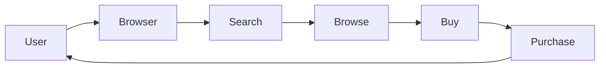

**图13**：电商推荐系统应用场景

**电商平台的实时推荐系统架构设计**：

电商平台的实时推荐系统架构如图14所示，主要由数据流处理管道、推荐算法计算模型、分布式计算架构、结果更新与分发架构、系统监控与调优架构等多个部分构成。

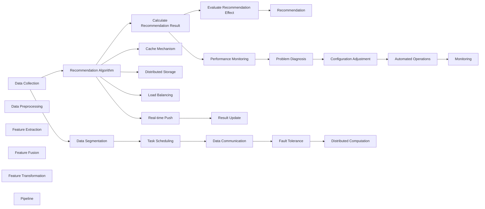

**图14**：电商平台的实时推荐系统架构设计

**电商平台的实时推荐系统性能优化**：

电商平台的实时推荐系统性能优化方法如图15所示，主要包括数据流处理优化、推荐算法优化、分布式计算优化、结果更新与分发优化、系统监控与调优优化等多个方面。


**图15**：电商平台的实时推荐系统性能优化方法

**电商平台的实时推荐系统数据流处理优化**：

电商平台的实时推荐系统数据流处理优化方法如图16所示，主要包括数据收集优化、数据预处理优化、特征提取优化、特征融合优化、特征变换优化等多个方面。

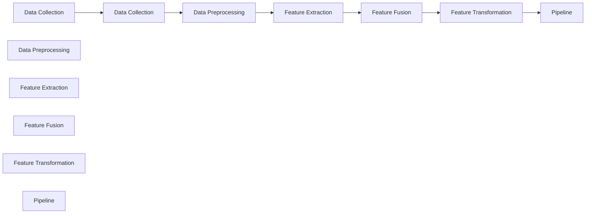

**图16**：电商平台的实时推荐系统数据流处理优化方法

**电商平台的实时推荐系统推荐算法优化**：

电商平台的实时推荐系统推荐算法优化方法如图17所示，主要包括推荐算法选择优化、计算推荐结果优化、评估推荐效果优化等多个方面。


**图17**：电商平台的实时推荐系统推荐算法优化方法

**电商平台的实时推荐系统分布式计算优化**：

电商平台的实时推荐系统分布式计算优化方法如图18所示，主要包括数据分割优化、任务调度优化、数据通信优化、故障恢复优化等多个方面。


**图18**：电商平台的实时推荐系统分布式计算优化方法

**电商平台的实时推荐系统结果更新与分发优化**：

电商平台的实时推荐系统结果更新与分发优化方法如图19所示，主要包括缓存机制优化、分布式存储优化、负载均衡优化、实时推送优化等多个方面。


**图19**：电商平台的实时推荐系统结果更新与分发优化方法

**电商平台的实时推荐系统系统监控与调优优化**：

电商平台的实时推荐系统系统监控与调优优化方法如图20所示，主要包括性能监控优化、问题诊断优化、调优策略优化、自动化运维优化等多个方面。


**图20**：电商平台的实时推荐系统系统监控与调优优化方法

**电商平台的实时推荐系统实际应用**：

电商平台的实时推荐系统实际应用如图21所示，主要包括以下几个方面：

**图21**：电商平台的实时推荐系统实际应用

1. **商品推荐**：根据用户的历史浏览、点击、购买等行为数据，动态推荐相关商品。
2. **个性化推荐**：根据用户画像、行为数据、物品特征等多维度信息，提供个性化推荐。
3. **实时推荐**：实时更新推荐结果，提升推荐的时效性和准确性。
4. **流量优化**：优化页面推荐算法，提高页面流量和转化率。
5. **广告投放**：结合广告系统，提升广告投放效果。

通过实时推荐系统，电商平台能够更好地满足用户需求，提升用户体验和转化率，驱动平台增长。

### 6.2 视频推荐

视频平台的实时推荐系统能够根据用户的行为数据，动态推荐相关视频内容，提升用户粘性和留存率。推荐系统的应用场景如图22所示：

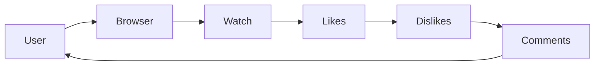

**图22**：视频推荐系统应用场景

**视频平台的实时推荐系统架构设计**：

视频平台的实时推荐系统架构如图23所示，主要由数据流处理管道、推荐算法计算模型、分布式计算架构、结果更新与分发架构、系统监控与调优架构等多个部分构成。


**图23**：视频平台的实时推荐系统架构设计

**视频平台的实时推荐系统性能优化**：

视频平台的实时推荐系统性能优化方法如图24所示，主要包括数据流处理优化、推荐算法优化、分布式计算优化、结果更新与分发优化、系统监控与调优优化等多个方面。


**图24**：视频平台的实时推荐系统性能优化方法

**视频平台的实时推荐系统数据流处理优化**：

视频平台的实时推荐系统数据流处理优化方法如图25所示，主要包括数据收集优化、数据预处理优化、特征提取优化、特征融合优化、特征变换优化等多个方面。

```mer

