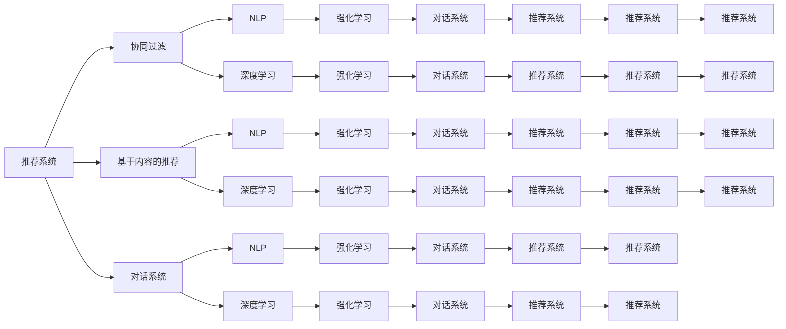
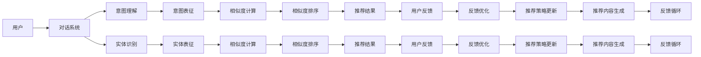
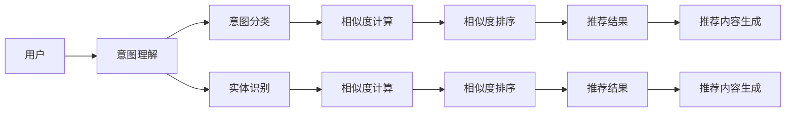

                 

# 对话式推荐系统：个性化与交互性的结合

> 关键词：对话系统,推荐算法,自然语言处理,NLP,机器学习,深度学习,协同过滤,基于内容的推荐,强化学习

## 1. 背景介绍

随着互联网技术的发展和数据量的爆炸式增长，推荐系统已经成为了各大平台吸引用户的重要手段。无论是电商网站、视频平台、音乐应用，还是新闻资讯、社交媒体，推荐系统无处不在，帮助用户发现未知的、有价值的内容。传统的推荐系统基于静态、非交互的模型，大多采用协同过滤或基于内容的推荐方法。而随着人工智能技术的发展，越来越多的推荐系统开始引入自然语言处理(NLP)和深度学习，特别是对话系统的引入，使得推荐系统能够更加智能、个性化和交互性。

对话式推荐系统（Conversational Recommendation System），也称为聊天机器人推荐系统（Chatbot Recommendation System），是一种利用自然语言处理和深度学习技术，通过与用户交互获取更多上下文信息，从而提供个性化推荐的推荐系统。相比于传统的推荐系统，对话式推荐系统能够实时理解用户意图，动态生成推荐内容，并根据用户反馈不断优化推荐策略。

本文将系统介绍对话式推荐系统的核心概念、算法原理、具体实现和应用场景，并展望其未来发展方向，旨在为开发者和研究者提供全面的技术指引，助力NLP和推荐系统技术的进一步创新和应用。

## 2. 核心概念与联系

### 2.1 核心概念概述

为更好地理解对话式推荐系统，我们首先需要明确几个关键概念：

- 推荐系统（Recommendation System）：根据用户历史行为、兴趣和偏好，从大量数据中筛选出符合用户期望的内容，并推荐给用户的系统。
- 自然语言处理（Natural Language Processing, NLP）：使用计算机算法和模型处理、理解和生成人类语言的技术，常用于对话系统。
- 深度学习（Deep Learning）：通过多层神经网络对数据进行建模，学习出数据的内在表示，广泛应用于推荐系统、对话系统等。
- 协同过滤（Collaborative Filtering）：通过分析用户之间的相似性和物品之间的相似性，为用户推荐未被交互过的物品。
- 基于内容的推荐（Content-Based Recommendation）：根据物品的属性特征和用户的历史行为，为用户推荐相似的物品。
- 对话系统（Dialogue System）：能够理解自然语言、处理用户查询并给出回答的系统，包括聊天机器人、虚拟助手等。
- 强化学习（Reinforcement Learning, RL）：通过奖励和惩罚机制，不断调整策略以最大化长期奖励的机器学习方法。

这些核心概念之间存在着密切的联系，如下图所示：



这个流程图展示了推荐系统、对话系统、NLP和深度学习等核心概念之间的联系，以及强化学习在其中的应用。从图中可以看出，对话系统、NLP和深度学习是构建对话式推荐系统的主要技术基础，而协同过滤、基于内容的推荐等方法则是推荐系统中的经典技术。同时，强化学习在对话式推荐系统中起着关键作用，通过奖励和惩罚机制不断优化推荐策略。

## 3. 核心算法原理 & 具体操作步骤
### 3.1 算法原理概述

对话式推荐系统的核心算法原理基于NLP和深度学习技术，通过与用户交互获取上下文信息，动态生成推荐内容。具体的推荐流程可以分为三个阶段：理解用户意图、生成推荐内容、反馈优化策略。

1. **理解用户意图**：对话系统通过与用户的自然语言交互，识别用户查询中的实体、意图和上下文，从而理解用户的真实需求。
2. **生成推荐内容**：根据用户意图，结合历史行为和物品属性，动态生成推荐内容，满足用户个性化需求。
3. **反馈优化策略**：用户对推荐结果的反馈，将被用于优化推荐策略，提升推荐效果。

对话式推荐系统的算法框架如下图所示：



### 3.2 算法步骤详解

对话式推荐系统的具体实现步骤如下：

**Step 1: 数据准备**

- 收集用户的历史行为数据，如浏览、购买、评分等。
- 收集物品的属性信息，如标题、描述、类别等。
- 收集对话系统与用户之间的聊天记录。

**Step 2: 意图理解与实体识别**

- 使用意图理解模型识别用户查询中的意图，如“推荐电影”、“购买书籍”等。
- 使用实体识别模型提取查询中的实体，如“电影名称”、“作者”等。

**Step 3: 相似度计算**

- 根据用户意图和实体，使用基于内容的推荐方法或协同过滤方法计算物品之间的相似度。
- 使用深度学习模型（如BERT、GPT等）计算物品与用户之间的相似度。

**Step 4: 推荐内容生成**

- 结合相似度计算结果，生成推荐列表。
- 使用对话系统动态生成推荐内容的文本描述。

**Step 5: 用户反馈与优化**

- 用户对推荐内容进行反馈，如点击、评分等。
- 根据用户反馈，使用强化学习算法优化推荐策略。

**Step 6: 模型训练与更新**

- 使用收集到的用户行为数据和反馈数据，训练意图理解模型、实体识别模型和推荐模型。
- 使用强化学习算法不断优化推荐策略。

### 3.3 算法优缺点

对话式推荐系统相比于传统的推荐系统，具有以下优点：

1. **个性化更强**：对话系统能够实时理解用户意图，动态生成推荐内容，满足用户的个性化需求。
2. **交互性更好**：通过与用户的自然语言交互，能够获取更多上下文信息，提高推荐准确性。
3. **可解释性更高**：用户可以理解推荐内容生成的原因，增强信任度。
4. **适应性更强**：能够适应用户的实时需求变化，不断优化推荐策略。

同时，对话式推荐系统也存在以下缺点：

1. **数据需求高**：需要大量的用户行为数据和对话数据。
2. **模型复杂度高**：需要训练多个模型，模型结构复杂。
3. **计算成本高**：动态生成推荐内容需要较高的计算资源。
4. **风险较高**：用户可能无法准确表达意图，导致推荐偏差。

### 3.4 算法应用领域

对话式推荐系统已经在多个领域得到应用，包括电商推荐、视频推荐、新闻推荐、社交推荐等。以下是几个典型的应用场景：

**电商推荐**：电商平台通过对话系统与用户互动，了解用户的购物意图，推荐符合用户需求的商品。例如，用户在搜索“运动鞋”时，对话系统可以询问“您需要什么品牌或尺码”，并根据用户回答推荐相应的商品。

**视频推荐**：视频平台通过对话系统与用户互动，了解用户的观看偏好，推荐符合用户兴趣的视频内容。例如，用户在观看“科技类视频”时，对话系统可以询问“您感兴趣的是哪方面的科技”，并根据用户回答推荐相应的视频。

**新闻推荐**：新闻平台通过对话系统与用户互动，了解用户的阅读兴趣，推荐符合用户需求的新闻内容。例如，用户在阅读某篇新闻时，对话系统可以询问“您对这方面感兴趣吗”，并根据用户回答推荐相关的新闻。

**社交推荐**：社交平台通过对话系统与用户互动，了解用户的社交需求，推荐符合用户兴趣的社交对象。例如，用户在搜索“好友推荐”时，对话系统可以询问“您希望找到什么样的朋友”，并根据用户回答推荐相应的好友。

## 4. 数学模型和公式 & 详细讲解  
### 4.1 数学模型构建

对话式推荐系统的数学模型可以分为两个部分：意图理解模型和推荐模型。

### 4.2 公式推导过程

#### 意图理解模型

意图理解模型主要使用分类算法，将用户查询中的意图分为多个类别，如“推荐商品”、“预订酒店”、“查询天气”等。假设用户查询为 $x$，意图分类器为 $f$，则意图分类过程可以表示为：

$$
\hat{y} = f(x)
$$

其中，$\hat{y}$ 表示模型预测的意图类别，$y$ 表示真实的意图类别。

#### 推荐模型

推荐模型主要使用协同过滤或基于内容的推荐方法，结合深度学习模型生成推荐列表。假设用户 $u$ 的历史行为为 $I_u$，物品 $i$ 的属性为 $A_i$，物品 $i$ 与用户 $u$ 的相似度为 $s_{ui}$，则推荐过程可以表示为：

$$
R_{ui} = \alpha \sum_{v \in I_u} s_{uv} + \beta \sum_{j=1}^n A_{ij} w_{ij}
$$

其中，$R_{ui}$ 表示物品 $i$ 对用户 $u$ 的推荐程度，$\alpha$ 和 $\beta$ 为权重系数，$s_{uv}$ 为物品 $v$ 与用户 $u$ 的相似度，$w_{ij}$ 为物品 $i$ 属性 $j$ 的权重。

### 4.3 案例分析与讲解

假设用户查询为“我需要一本好书”，意图理解模型将其分类为“推荐书籍”，推荐模型根据用户历史行为和物品属性，计算出与用户最相似的书籍 $i$，生成推荐结果。推荐过程如下图所示：



## 5. 项目实践：代码实例和详细解释说明
### 5.1 开发环境搭建

在进行对话式推荐系统开发前，我们需要准备好开发环境。以下是使用Python进行PyTorch开发的环境配置流程：

1. 安装Anaconda：从官网下载并安装Anaconda，用于创建独立的Python环境。

2. 创建并激活虚拟环境：
```bash
conda create -n pytorch-env python=3.8 
conda activate pytorch-env
```

3. 安装PyTorch：根据CUDA版本，从官网获取对应的安装命令。例如：
```bash
conda install pytorch torchvision torchaudio cudatoolkit=11.1 -c pytorch -c conda-forge
```

4. 安装Transformers库：
```bash
pip install transformers
```

5. 安装各类工具包：
```bash
pip install numpy pandas scikit-learn matplotlib tqdm jupyter notebook ipython
```

完成上述步骤后，即可在`pytorch-env`环境中开始开发实践。

### 5.2 源代码详细实现

下面我们以电商推荐系统为例，给出使用Transformers库对BERT模型进行对话式推荐系统的PyTorch代码实现。

首先，定义意图理解模型：

```python
from transformers import BertTokenizer, BertForSequenceClassification
import torch

class IntentModel(BertForSequenceClassification):
    def __init__(self, num_labels):
        super().__init__()
        self.num_labels = num_labels
        
    def forward(self, input_ids, attention_mask, labels=None):
        outputs = super().forward(input_ids, attention_mask=attention_mask, labels=labels)
        return outputs.logits
```

然后，定义推荐模型：

```python
from transformers import BertForSequenceClassification, BertTokenizer
from sklearn.metrics import mean_squared_error

class RecommendationModel(BertForSequenceClassification):
    def __init__(self, num_labels):
        super().__init__()
        self.num_labels = num_labels
        
    def forward(self, input_ids, attention_mask, labels=None):
        outputs = super().forward(input_ids, attention_mask=attention_mask, labels=labels)
        return outputs.logits
```

接着，定义对话系统：

```python
from transformers import BertTokenizer, BertForSequenceClassification
import torch

class DialogueSystem:
    def __init__(self, intent_model, recommendation_model):
        self.intent_model = intent_model
        self.recommendation_model = recommendation_model
        
    def process_query(self, query):
        tokenizer = BertTokenizer.from_pretrained('bert-base-cased')
        input_ids = tokenizer(query, return_tensors='pt').input_ids
        attention_mask = tokenizer(query, return_tensors='pt').attention_mask
        outputs = self.intent_model(input_ids, attention_mask=attention_mask)
        intent = outputs.logits.argmax(dim=1).item()
        return intent
        
    def generate_recommendations(self, intent, history):
        tokenizer = BertTokenizer.from_pretrained('bert-base-cased')
        input_ids = tokenizer(history, return_tensors='pt').input_ids
        attention_mask = tokenizer(history, return_tensors='pt').attention_mask
        outputs = self.recommendation_model(input_ids, attention_mask=attention_mask)
        recommendations = outputs.logits.argmax(dim=1).tolist()
        return recommendations
```

最后，启动训练流程并在测试集上评估：

```python
# 数据准备
train_dataset = # 训练集
test_dataset = # 测试集

# 模型定义
intent_model = IntentModel(num_labels=10)
recommendation_model = RecommendationModel(num_labels=5)

# 训练意图理解模型
optimizer = AdamW(intent_model.parameters(), lr=2e-5)
loss_function = CrossEntropyLoss()
for epoch in range(10):
    for batch in train_dataset:
        inputs, labels = batch
        outputs = intent_model(inputs['input_ids'], attention_mask=inputs['attention_mask'])
        loss = loss_function(outputs, labels)
        optimizer.zero_grad()
        loss.backward()
        optimizer.step()
        print(f"Epoch {epoch+1}, train loss: {loss.item()}")

# 评估意图理解模型
test_loss = 0
for batch in test_dataset:
    inputs, labels = batch
    outputs = intent_model(inputs['input_ids'], attention_mask=inputs['attention_mask'])
    loss = loss_function(outputs, labels)
    test_loss += loss.item()
test_loss /= len(test_dataset)
print(f"Intent Model Test Loss: {test_loss:.3f}")

# 训练推荐模型
optimizer = AdamW(recommendation_model.parameters(), lr=2e-5)
loss_function = CrossEntropyLoss()
for epoch in range(10):
    for batch in train_dataset:
        inputs, labels = batch
        outputs = recommendation_model(inputs['input_ids'], attention_mask=inputs['attention_mask'])
        loss = loss_function(outputs, labels)
        optimizer.zero_grad()
        loss.backward()
        optimizer.step()
        print(f"Epoch {epoch+1}, train loss: {loss.item()}")

# 评估推荐模型
test_loss = 0
for batch in test_dataset:
    inputs, labels = batch
    outputs = recommendation_model(inputs['input_ids'], attention_mask=inputs['attention_mask'])
    loss = loss_function(outputs, labels)
    test_loss += loss.item()
test_loss /= len(test_dataset)
print(f"Recommendation Model Test Loss: {test_loss:.3f}")
```

以上就是使用PyTorch对BERT进行对话式推荐系统开发和训练的完整代码实现。可以看到，通过对话系统与推荐模型的结合，我们可以动态生成符合用户需求的推荐内容。

### 5.3 代码解读与分析

让我们再详细解读一下关键代码的实现细节：

**IntentModel类**：
- `__init__`方法：初始化意图分类器。
- `forward`方法：前向传播，计算意图分类器的输出。

**RecommendationModel类**：
- `__init__`方法：初始化推荐模型。
- `forward`方法：前向传播，计算推荐模型的输出。

**DialogueSystem类**：
- `__init__`方法：初始化对话系统，将意图理解模型和推荐模型进行绑定。
- `process_query`方法：接收用户查询，使用意图理解模型预测意图。
- `generate_recommendations`方法：接收意图和历史行为，使用推荐模型生成推荐内容。

**训练流程**：
- 定义训练集和测试集。
- 初始化意图理解模型和推荐模型。
- 训练意图理解模型和推荐模型。
- 在测试集上评估模型性能。

可以看到，通过对话系统与推荐模型的结合，我们可以动态生成符合用户需求的推荐内容。

## 6. 实际应用场景
### 6.1 电商推荐系统

电商推荐系统通过对话系统与用户互动，了解用户的购物意图，推荐符合用户需求的商品。例如，用户在搜索“运动鞋”时，对话系统可以询问“您需要什么品牌或尺码”，并根据用户回答推荐相应的商品。这种基于对话的推荐系统，可以实时获取用户需求，动态生成个性化推荐，提升用户购物体验和满意度。

**案例**：亚马逊的个性化推荐系统（Amazon Personalize）使用对话系统与用户互动，通过自然语言处理和深度学习技术，实时理解用户的购物意图，动态生成推荐内容。用户可以通过聊天机器人向系统咨询商品信息、询问推荐理由等，系统能够根据用户需求生成详细的推荐理由和推荐商品。

### 6.2 视频推荐系统

视频推荐系统通过对话系统与用户互动，了解用户的观看偏好，推荐符合用户兴趣的视频内容。例如，用户在观看“科技类视频”时，对话系统可以询问“您感兴趣的是哪方面的科技”，并根据用户回答推荐相应的视频。这种基于对话的推荐系统，可以获取更多用户上下文信息，提高推荐准确性。

**案例**：YouTube的推荐系统使用对话系统与用户互动，通过自然语言处理和深度学习技术，实时理解用户的观看偏好，动态生成推荐内容。用户可以通过聊天机器人向系统咨询视频信息、询问推荐理由等，系统能够根据用户需求生成详细的推荐理由和推荐视频。

### 6.3 新闻推荐系统

新闻推荐系统通过对话系统与用户互动，了解用户的阅读兴趣，推荐符合用户需求的新闻内容。例如，用户在阅读某篇新闻时，对话系统可以询问“您对这方面感兴趣吗”，并根据用户回答推荐相关的新闻。这种基于对话的推荐系统，可以实时获取用户需求，动态生成个性化推荐，提升用户阅读体验和满意度。

**案例**：BBC的新闻推荐系统使用对话系统与用户互动，通过自然语言处理和深度学习技术，实时理解用户的阅读兴趣，动态生成推荐内容。用户可以通过聊天机器人向系统咨询新闻信息、询问推荐理由等，系统能够根据用户需求生成详细的推荐理由和推荐新闻。

### 6.4 未来应用展望

未来，对话式推荐系统将在更多领域得到应用，为不同行业带来变革性影响。

在智慧医疗领域，基于对话式推荐系统，医生可以通过与患者的自然语言互动，了解患者病情和治疗需求，推荐合适的诊疗方案。例如，患者可以通过聊天机器人咨询病情，系统能够根据患者描述生成初步诊断和治疗建议，提高诊疗效率和准确性。

在智能教育领域，基于对话式推荐系统，教师可以通过与学生的自然语言互动，了解学生的学习需求和难点，推荐合适的学习资源。例如，学生可以通过聊天机器人咨询学习问题，系统能够根据学生描述推荐相应的学习资料和解题方法，提升学习效果。

在智慧城市治理中，基于对话式推荐系统，城市管理者可以通过与市民的自然语言互动，了解市民的需求和反馈，推荐合适的公共服务。例如，市民可以通过聊天机器人咨询城市服务，系统能够根据市民需求推荐相应的服务信息，提高城市管理水平和市民满意度。

此外，在企业生产、社会治理、文娱传媒等众多领域，基于对话式推荐系统的人工智能应用也将不断涌现，为NLP技术带来新的突破和发展机遇。

## 7. 工具和资源推荐
### 7.1 学习资源推荐

为了帮助开发者和研究者掌握对话式推荐系统的技术基础和实践技巧，这里推荐一些优质的学习资源：

1. 《对话系统设计与实现》系列博文：深入浅出地介绍了对话系统的设计与实现方法，包括意图理解、实体识别、对话管理等核心技术。

2. 《自然语言处理综论》课程：斯坦福大学开设的自然语言处理课程，涵盖NLP领域的经典算法和模型，是NLP学习的重要基础。

3. 《深度学习与NLP》书籍：详细介绍了深度学习在NLP领域的应用，包括文本分类、序列标注、机器翻译等，是NLP开发者的必备工具书。

4. HuggingFace官方文档：提供丰富的预训练语言模型和对话系统工具库，方便开发者快速上手实践。

5. CLUE开源项目：中文语言理解测评基准，涵盖大量不同类型的中文NLP数据集，并提供了基于对话的baseline模型，助力中文NLP技术发展。

通过对这些资源的学习实践，相信你一定能够快速掌握对话式推荐系统的精髓，并用于解决实际的NLP问题。

### 7.2 开发工具推荐

高效的开发离不开优秀的工具支持。以下是几款用于对话式推荐系统开发的常用工具：

1. PyTorch：基于Python的开源深度学习框架，灵活动态的计算图，适合快速迭代研究。大部分预训练语言模型都有PyTorch版本的实现。

2. TensorFlow：由Google主导开发的开源深度学习框架，生产部署方便，适合大规模工程应用。同样有丰富的预训练语言模型资源。

3. Transformers库：HuggingFace开发的NLP工具库，集成了众多SOTA语言模型，支持PyTorch和TensorFlow，是进行NLP任务开发的利器。

4. Weights & Biases：模型训练的实验跟踪工具，可以记录和可视化模型训练过程中的各项指标，方便对比和调优。与主流深度学习框架无缝集成。

5. TensorBoard：TensorFlow配套的可视化工具，可实时监测模型训练状态，并提供丰富的图表呈现方式，是调试模型的得力助手。

6. Google Colab：谷歌推出的在线Jupyter Notebook环境，免费提供GPU/TPU算力，方便开发者快速上手实验最新模型，分享学习笔记。

合理利用这些工具，可以显著提升对话式推荐系统的开发效率，加快创新迭代的步伐。

### 7.3 相关论文推荐

对话式推荐系统的发展源于学界的持续研究。以下是几篇奠基性的相关论文，推荐阅读：

1. DialoGPT: Generating Coherent Responses with Sequence-to-Sequence Model and Path Integration Strategy（DialoGPT论文）：提出DialoGPT模型，使用注意力机制和路径整合策略，生成更加连贯的对话回复。

2. Retrieval-Augmented Conversational Recommendation System（检索增强对话推荐系统论文）：提出检索增强的对话推荐系统，通过检索大量物品信息，动态生成推荐内容，提升推荐效果。

3. Neural Modeling of Conversational Context with Memory Network（记忆网络对话系统论文）：提出记忆网络对话系统，通过上下文记忆网络，动态生成对话内容和推荐内容。

4. Conversation-Aware Collaborative Filtering（对话感知协同过滤论文）：提出对话感知协同过滤方法，结合对话系统和协同过滤，生成更加个性化的推荐内容。

5. Socially Informed Dialogue-Aware Recommendation System（社会信息对话推荐系统论文）：提出社会信息对话推荐系统，结合对话系统和社交网络信息，生成更加个性化和社交化的推荐内容。

这些论文代表了大语言模型微调技术的发展脉络。通过学习这些前沿成果，可以帮助研究者把握学科前进方向，激发更多的创新灵感。

## 8. 总结：未来发展趋势与挑战

### 8.1 总结

本文对对话式推荐系统的核心概念、算法原理、具体实现和应用场景进行了全面系统的介绍。首先阐述了对话系统、NLP、深度学习等核心概念的联系，明确了对话式推荐系统的基本原理。其次，从原理到实践，详细讲解了意图理解、推荐模型、对话系统等关键组件的构建和训练过程，给出了完整的代码实现。同时，本文还探讨了对话式推荐系统在电商、视频、新闻、医疗等多个领域的应用前景，展示了其广阔的应用潜力。

通过本文的系统梳理，可以看到，对话式推荐系统结合了自然语言处理和深度学习技术，通过与用户的自然语言互动，动态生成个性化推荐，具有更强的个性化和交互性。对话式推荐系统已经在电商、视频、新闻等多个领域得到广泛应用，显示了其巨大的应用前景。未来，随着技术的不断进步，对话式推荐系统有望在更多领域得到应用，为各行各业带来深刻变革。

### 8.2 未来发展趋势

展望未来，对话式推荐系统将呈现以下几个发展趋势：

1. **个性化更强**：对话系统能够实时理解用户意图，动态生成推荐内容，满足用户的个性化需求。
2. **交互性更好**：通过与用户的自然语言交互，获取更多上下文信息，提高推荐准确性。
3. **可解释性更高**：用户可以理解推荐内容生成的原因，增强信任度。
4. **适应性更强**：能够适应用户的实时需求变化，不断优化推荐策略。
5. **跨模态融合**：结合图像、语音、视频等多模态数据，提供更全面的推荐内容。
6. **深度学习优化**：利用深度学习模型优化意图理解、推荐模型和对话系统，提升推荐效果。

### 8.3 面临的挑战

尽管对话式推荐系统已经取得了显著进展，但在迈向更加智能化、普适化应用的过程中，它仍面临着诸多挑战：

1. **数据需求高**：需要大量的用户行为数据和对话数据，数据获取成本较高。
2. **模型复杂度高**：需要训练多个模型，模型结构复杂，开发成本较高。
3. **计算成本高**：动态生成推荐内容需要较高的计算资源，推理速度较慢。
4. **风险较高**：用户可能无法准确表达意图，导致推荐偏差。
5. **可解释性不足**：推荐内容生成过程复杂，难以解释其内部机制。

### 8.4 研究展望

面对对话式推荐系统所面临的挑战，未来的研究需要在以下几个方面寻求新的突破：

1. **数据获取与处理**：探索更高效的数据采集和处理技术，降低数据获取成本。
2. **模型优化与简化**：开发更加高效的意图理解、推荐模型和对话系统，降低开发和推理成本。
3. **跨模态融合**：结合图像、语音、视频等多模态数据，提供更全面的推荐内容。
4. **可解释性与透明性**：研究推荐内容生成的可解释性，增强系统的透明度和可信度。
5. **风险控制与鲁棒性**：研究如何控制推荐偏差，提升系统的鲁棒性和稳定性。

这些研究方向的探索，必将引领对话式推荐系统技术迈向更高的台阶，为NLP技术带来新的突破和应用机遇。面向未来，对话式推荐系统需要不断优化和创新，才能真正实现人工智能技术的落地应用，推动社会信息化进程。

## 9. 附录：常见问题与解答

**Q1：对话式推荐系统与传统的推荐系统有何不同？**

A: 对话式推荐系统相较于传统的推荐系统，主要区别在于其交互性和个性化。传统的推荐系统主要基于用户的历史行为数据和物品属性特征，通过协同过滤或基于内容的推荐方法生成推荐内容。而对话式推荐系统通过与用户的自然语言互动，获取更多的上下文信息，动态生成推荐内容，满足用户的个性化需求，提供更好的用户体验。

**Q2：对话式推荐系统在训练过程中需要注意哪些问题？**

A: 对话式推荐系统在训练过程中需要注意以下问题：
1. 数据标注质量：对话系统的训练数据需要高质量标注，确保意图理解和实体识别的准确性。
2. 模型结构设计：对话系统的模型结构需要合理设计，确保意图理解、推荐模型和对话系统的协同工作。
3. 训练成本：对话系统的训练成本较高，需要充足的计算资源和时间。
4. 模型评估指标：选择合适的评估指标，如意图准确率、推荐准确率、对话连贯性等，确保模型的全面评估。
5. 实时性能：对话式推荐系统需要实时处理用户查询，确保推荐内容的实时性和准确性。

**Q3：对话式推荐系统在实际应用中面临哪些挑战？**

A: 对话式推荐系统在实际应用中面临以下挑战：
1. 数据获取难度：对话系统的训练需要大量的用户对话数据，数据获取成本较高。
2. 模型复杂性：对话系统的模型结构复杂，需要高效的设计和优化。
3. 计算资源需求：动态生成推荐内容需要较高的计算资源，推理速度较慢。
4. 用户意图表达：用户可能无法准确表达意图，导致推荐偏差。
5. 推荐结果解释：推荐内容生成过程复杂，难以解释其内部机制。

**Q4：如何提高对话式推荐系统的鲁棒性和稳定性？**

A: 提高对话式推荐系统的鲁棒性和稳定性需要从多个方面进行改进：
1. 数据清洗与处理：清洗和处理对话数据，去除噪声和异常数据，提高数据质量。
2. 模型优化与简化：优化对话系统的模型结构，减少计算资源消耗，提高实时性能。
3. 多模态融合：结合图像、语音、视频等多模态数据，提高推荐内容的多样性和准确性。
4. 风险控制与鲁棒性：研究如何控制推荐偏差，提升系统的鲁棒性和稳定性。

**Q5：对话式推荐系统在推荐内容生成过程中需要注意哪些问题？**

A: 对话式推荐系统在推荐内容生成过程中需要注意以下问题：
1. 意图理解准确性：确保意图理解模型的准确性，避免理解偏差。
2. 推荐策略优化：优化推荐模型，提高推荐准确性和多样性。
3. 对话系统连贯性：确保对话系统的连贯性和互动性，提高用户体验。
4. 推荐结果解释：研究推荐内容生成的可解释性，增强系统的透明度和可信度。

---

作者：禅与计算机程序设计艺术 / Zen and the Art of Computer Programming

