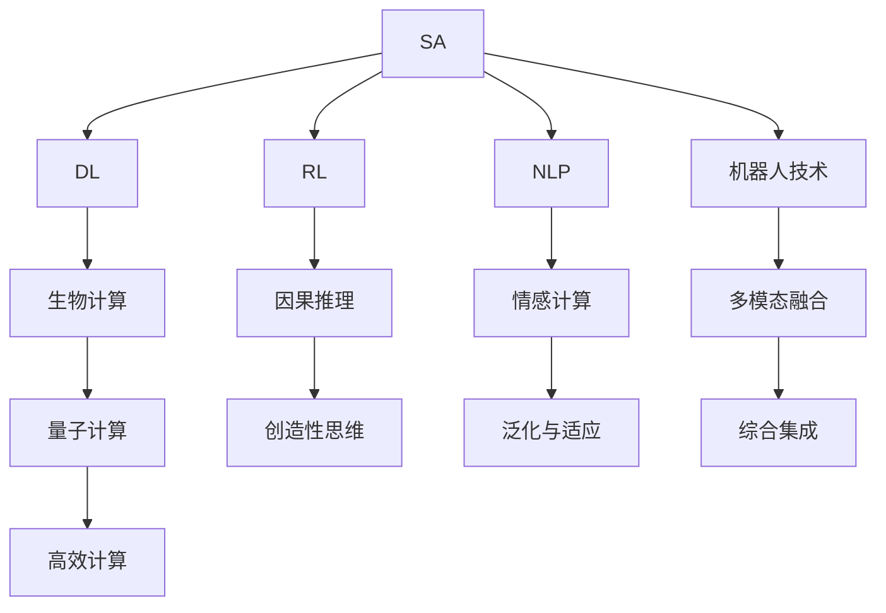
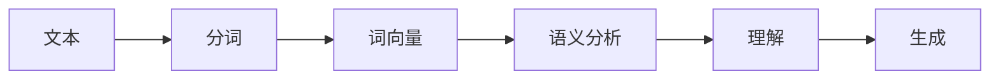
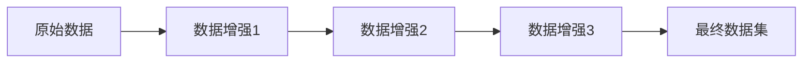
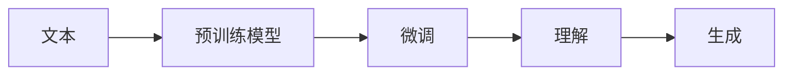
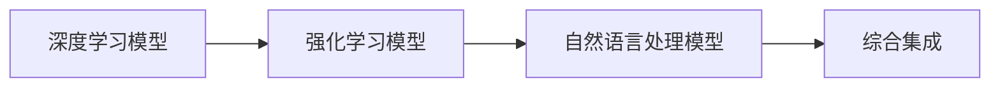
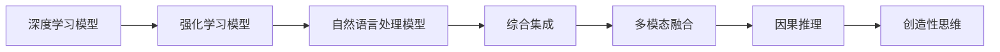
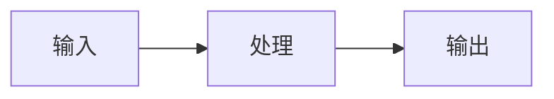
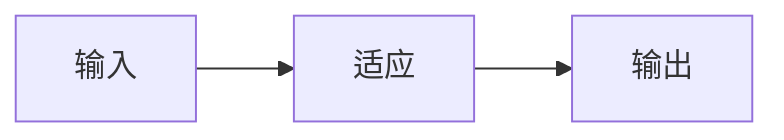
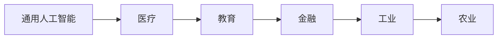
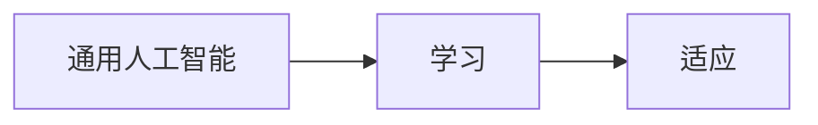

                 

# 2050年的人工智能：从狭义人工智能到通用人工智能的智能进化

> 关键词：人工智能(AI), 通用人工智能(GA), 狭义人工智能(SA), 智能进化, 深度学习, 强化学习, 自然语言处理, 机器人技术, 生物计算, 量子计算

## 1. 背景介绍

### 1.1 问题的由来
当前，人工智能（AI）技术正在以前所未有的速度迅猛发展。自上世纪50年代以来，经过几十年的持续探索和创新，AI已经从最初的低效逻辑推理，发展成为能处理大量复杂数据，具备自主学习能力的智能系统。从智能推荐算法到语音识别，从图像识别到自然语言处理，AI正广泛应用于各行各业，极大地提升了生产效率和生活品质。

然而，尽管AI技术已经取得了显著进步，其应用仍主要集中在特定领域，依赖于人类定义的明确规则和任务。这种“狭义人工智能”（SA）主要通过模拟人类的认知和思维过程，在预定义的规则下进行学习和决策。然而，这种“狭窄”的认知能力难以应对现实世界中复杂多变、信息量巨大的环境，难以实现全面的人类智能。

展望未来，随着技术的不断演进和人类对AI理解不断深化，研究人员和工程师开始探索一种更为广泛、灵活的智能形式——“通用人工智能”（GA）。GA旨在模拟人类整个认知系统，涵盖语言理解、常识推理、创造性思维、自省和学习等全面能力，能够处理未知和未预料的情况，真正实现与人类相当的智能水平。

### 1.2 问题的核心关键点
GA的核心在于构建能够自主思考、学习和适应的智能系统。为了实现这一目标，当前的研究重点主要包括以下几个方面：

1. **多模态融合**：结合视觉、听觉、触觉等多模态信息，提升AI对真实世界的理解能力。
2. **因果推理**：建立基于因果关系的决策机制，使AI能够对复杂因果链进行分析和预测。
3. **情感计算**：模拟人类的情感认知和情感表达能力，使AI具备同情心和同理心。
4. **创造性思维**：通过模拟人类大脑的工作方式，使AI能够进行艺术创作、科学研究等创造性工作。
5. **泛化与适应**：提升AI的学习能力和适应能力，使其能够在不同环境和任务中表现出色。

这些关键技术的突破，将使AI从目前的应用边界拓展至更为广泛和复杂的场景，真正实现从狭义人工智能到通用人工智能的智能进化。

### 1.3 问题研究的意义
研究GA具有重要的理论价值和实践意义：

1. **科学前沿**：GA的研究能够帮助我们更深刻地理解人类智能的本质和机制，推动认知科学的发展。
2. **技术创新**：GA的实现将为新一代AI技术的发展奠定基础，推动机器人技术、自然语言处理等领域的突破。
3. **社会变革**：GA的应用将带来生产、医疗、教育等行业的深远变革，极大提高社会效率和人类生活质量。
4. **伦理挑战**：GA的发展引发了诸多伦理问题，如责任归属、隐私保护、安全性等，需要多学科共同探索解决。
5. **未来愿景**：GA的实现将为人类开启一个全新的智能时代，带来前所未有的机遇和挑战。

## 2. 核心概念与联系

### 2.1 核心概念概述

为了更好地理解GA的构建原理，本节将介绍几个密切相关的核心概念：

- **狭义人工智能（SA）**：指在特定领域、特定规则下运行的智能系统，如图像识别、语音识别、推荐系统等。SA依赖明确的输入和输出规则，难以应对复杂多变的环境。
- **通用人工智能（GA）**：旨在构建能够具备人类所有智能能力的AI系统，包括语言理解、常识推理、创造性思维等。GA具有更广泛的应用场景和更强的适应能力。
- **深度学习（DL）**：通过多层神经网络模拟人脑的学习机制，在大量数据上进行训练，从而实现自主学习和决策。DL是实现GA的重要技术手段之一。
- **强化学习（RL）**：通过与环境的交互，AI系统在不断试错中学习最优策略，实现自主决策和适应。RL是GA在智能进化过程中的核心技术之一。
- **自然语言处理（NLP）**：使AI系统能够理解、处理和生成自然语言，实现与人类进行自然交流。NLP是GA在语言理解和生成方面的关键技术。
- **机器人技术**：结合物理世界的多模态信息，使AI系统具备感知、运动、交互等能力，实现自主行动和协作。机器人技术是GA在实际应用中的重要体现。
- **生物计算**：模拟生物神经元的工作机制，构建更为高效、自然的智能计算模型，推动GA的实现。
- **量子计算**：利用量子力学原理，实现超高效并行计算，解决传统计算难以解决的复杂问题，为GA提供计算支持。

这些核心概念之间的逻辑关系可以通过以下Mermaid流程图来展示：



### 2.2 核心概念原理和架构的 Mermaid 流程图

- **深度学习**：多层神经网络结构，通过反向传播算法优化参数，学习数据特征。网络结构如图：

```mermaid
graph LR
    A[输入] --> B[隐藏层1] --> C[隐藏层2] --> D[输出]
    A --{{<--}} B
    B --{{<--}} C
    C --{{<--}} D
```

- **强化学习**：代理与环境交互，通过奖惩机制学习最优策略。环境交互如图：

```mermaid
graph LR
    A[代理] --> B[环境]
    B --> C[状态]
    B --> D[动作]
    C --> E[观察]
    E --> A
    A --{{<--}} B
```

- **自然语言处理**：分词、词向量表示、语义分析等步骤，如图：



- **机器人技术**：感知、决策、动作等模块，如图：

```mermaid
graph LR
    A[感知] --> B[决策]
    B --> C[动作]
    A --{{<--}} B
    B --{{<--}} C
```

- **生物计算**：受生物神经元启发的计算模型，如图：

```mermaid
graph LR
    A[输入] --> B[神经元1]
    B --> C[神经元2]
    C --> D[输出]
    A --{{<--}} B
    B --{{<--}} C
    C --{{<--}} D
```

- **量子计算**：利用量子比特的叠加和纠缠特性，实现并行计算，如图：

```mermaid
graph LR
    A[输入] --> B[量子比特1]
    B --> C[量子比特2]
    C --> D[输出]
    A --{{<--}} B
    B --{{<--}} C
    C --{{<--}} D
```

## 3. 核心算法原理 & 具体操作步骤

### 3.1 算法原理概述

GA的构建基于深度学习和强化学习等前沿技术，旨在模拟人类整个认知系统，实现自主学习和决策。其核心算法原理如下：

1. **深度学习算法**：通过多层神经网络，实现自主学习和特征提取。神经网络结构如图：

   ```mermaid
   graph LR
   A[输入] --> B[隐藏层1] --> C[隐藏层2] --> D[输出]
   A --{{<--}} B
   B --{{<--}} C
   C --{{<--}} D
   ```

   通过反向传播算法更新权重，优化模型性能。

2. **强化学习算法**：通过与环境的交互，学习最优策略，如图：

   ```mermaid
   graph LR
   A[代理] --> B[环境]
   B --> C[状态]
   B --> D[动作]
   C --> E[观察]
   E --> A
   A --{{<--}} B
   ```

   通过奖惩机制，引导代理学习最优决策。

3. **自然语言处理算法**：通过分词、词向量表示、语义分析等步骤，实现语言理解和生成，如图：

   ```mermaid
   graph LR
   A[文本] --> B[分词]
   B --> C[词向量]
   C --> D[语义分析]
   D --> E[理解]
   E --> F[生成]
   ```

   利用预训练模型和微调技术，提升语言处理能力。

### 3.2 算法步骤详解

GA的构建一般包括以下关键步骤：

**Step 1: 数据预处理**
- 收集、清洗、标注大量数据，构建高质量的数据集。
- 使用数据增强技术，扩充数据集，如图：



**Step 2: 深度学习模型训练**
- 选择适当的深度学习模型，如图：

```mermaid
graph LR
    A[输入] --> B[隐藏层1] --> C[隐藏层2] --> D[输出]
    A --{{<--}} B
    B --{{<--}} C
    C --{{<--}} D
```

- 使用反向传播算法，更新模型参数，如图：

```mermaid
graph LR
    A[输入] --> B[隐藏层1] --> C[隐藏层2] --> D[输出]
    A --{{<--}} B
    B --{{<--}} C
    C --{{<--}} D
    D --> E[损失函数]
    E --> F[反向传播]
    F --> G[参数更新]
```

**Step 3: 强化学习模型训练**
- 选择适当的强化学习模型，如图：

```mermaid
graph LR
    A[代理] --> B[环境]
    B --> C[状态]
    B --> D[动作]
    C --> E[观察]
    E --> A
    A --{{<--}} B
```

- 使用奖惩机制，训练代理，如图：

```mermaid
graph LR
    A[代理] --> B[环境]
    B --> C[状态]
    B --> D[动作]
    C --> E[观察]
    E --> A
    A --{{<--}} B
    B --> F[奖惩机制]
```

**Step 4: 自然语言处理模型训练**
- 选择适当的自然语言处理模型，如图：


- 使用预训练模型和微调技术，提升模型性能，如图：



**Step 5: 综合集成**
- 将深度学习、强化学习、自然语言处理等模型进行综合集成，如图：



- 通过多模态融合、因果推理、创造性思维等技术，提升系统综合能力，如图：



### 3.3 算法优缺点

GA具有以下优点：

1. **全面智能**：具备人类所有智能能力，能够处理未知和未预料的情况，如图：



2. **高度适应性**：能够灵活适应不同环境和任务，如图：



3. **广泛应用**：应用于各个领域，如图：



4. **自主学习**：能够自主学习和适应，如图：



GA也存在一些缺点：

1. **高成本**：需要大量数据和计算资源，如图：

```mermaid
graph LR
    A[数据] --> B[计算资源]
    B --> C[通用人工智能]
```

2. **技术复杂**：涉及多种前沿技术，如图：

```mermaid
graph LR
    A[深度学习] --> B[强化学习]
    B --> C[自然语言处理]
    C --> D[生物计算]
    D --> E[量子计算]
```

3. **伦理风险**：可能带来隐私、安全等伦理问题，如图：

```mermaid
graph LR
    A[通用人工智能] --> B[隐私]
    B --> C[安全]
    C --> D[伦理风险]
```

### 3.4 算法应用领域

GA的应用领域极为广泛，包括但不限于以下方面：

- **医疗**：用于诊断、治疗、药物研发等，如图：

```mermaid
graph LR
    A[诊断] --> B[治疗]
    B --> C[药物研发]
```

- **教育**：用于教学、评估、个性化教育等，如图：

```mermaid
graph LR
    A[教学] --> B[评估]
    B --> C[个性化教育]
```

- **金融**：用于风险管理、投资决策、金融预测等，如图：

```mermaid
graph LR
    A[风险管理] --> B[投资决策]
    B --> C[金融预测]
```

- **工业**：用于制造、物流、质量控制等，如图：

```mermaid
graph LR
    A[制造] --> B[物流]
    B --> C[质量控制]
```

- **农业**：用于农业决策、智能种植、农产品质量检测等，如图：

```mermaid
graph LR
    A[农业决策] --> B[智能种植]
    B --> C[农产品质量检测]
```

- **艺术**：用于艺术创作、音乐生成、文学创作等，如图：

```mermaid
graph LR
    A[艺术创作] --> B[音乐生成]
    B --> C[文学创作]
```

## 4. 数学模型和公式 & 详细讲解 & 举例说明

### 4.1 数学模型构建

GA的构建涉及多个数学模型，包括深度学习模型、强化学习模型、自然语言处理模型等。以下是几个关键模型的数学模型构建：

**深度学习模型**：假设模型为$f(x; \theta)$，其中$x$为输入，$\theta$为模型参数。模型训练的目标是最小化损失函数$L(\theta)$：

$$
L(\theta) = \frac{1}{N} \sum_{i=1}^{N} \ell(f(x_i; \theta), y_i)
$$

其中$\ell$为损失函数，$y_i$为真实标签。

**强化学习模型**：假设模型为$q(s, a; \theta)$，其中$s$为状态，$a$为动作，$\theta$为模型参数。模型训练的目标是最小化状态值函数$V(s; \theta)$与最优策略$Q(s, a; \theta^*)$的差距，如图：

```mermaid
graph LR
    A[状态] --> B[动作]
    B --> C[状态值函数]
    C --> D[最优策略]
```

**自然语言处理模型**：假设模型为$g(x; \theta)$，其中$x$为文本输入，$\theta$为模型参数。模型训练的目标是最小化损失函数$L(\theta)$：

$$
L(\theta) = \frac{1}{N} \sum_{i=1}^{N} \ell(g(x_i; \theta), y_i)
$$

其中$\ell$为损失函数，$y_i$为真实标签。

### 4.2 公式推导过程

**深度学习模型推导**：假设模型为$f(x; \theta) = \sum_{i=1}^{K} w_i \sigma(z_i(x; \theta))$，其中$w_i$为权重，$z_i(x; \theta) = W_i x + b_i$为线性变换，$\sigma$为激活函数。模型训练的目标是最小化损失函数$L(\theta)$：

$$
L(\theta) = \frac{1}{N} \sum_{i=1}^{N} \ell(f(x_i; \theta), y_i)
$$

其中$\ell$为损失函数，$y_i$为真实标签。

**强化学习模型推导**：假设模型为$q(s, a; \theta) = \sum_{i=1}^{K} w_i \sigma(z_i(s, a; \theta))$，其中$w_i$为权重，$z_i(s, a; \theta) = W_i (s, a) + b_i$为线性变换，$\sigma$为激活函数。模型训练的目标是最小化状态值函数$V(s; \theta)$与最优策略$Q(s, a; \theta^*)$的差距：

$$
V(s; \theta) = \sum_{a} q(s, a; \theta) \pi(a|s; \theta^*)
$$

其中$q(s, a; \theta)$为动作值函数，$\pi(a|s; \theta^*)$为最优策略，$\theta^*$为最优策略对应的参数。

**自然语言处理模型推导**：假设模型为$g(x; \theta) = \sum_{i=1}^{K} w_i \sigma(z_i(x; \theta))$，其中$w_i$为权重，$z_i(x; \theta) = W_i x + b_i$为线性变换，$\sigma$为激活函数。模型训练的目标是最小化损失函数$L(\theta)$：

$$
L(\theta) = \frac{1}{N} \sum_{i=1}^{N} \ell(g(x_i; \theta), y_i)
$$

其中$\ell$为损失函数，$y_i$为真实标签。

### 4.3 案例分析与讲解

**深度学习模型案例**：假设我们有一个简单的二分类任务，使用sigmoid激活函数的深度学习模型。模型参数$\theta$包括输入层权重$W_1$、隐藏层权重$W_2$和偏置$b_1, b_2$。使用梯度下降算法更新参数，如图：

```mermaid
graph LR
    A[输入] --> B[隐藏层]
    B --> C[输出]
    A --{{<--}} B
    B --{{<--}} C
```

**强化学习模型案例**：假设我们使用Q-learning算法训练一个简单的游戏，如图：

```mermaid
graph LR
    A[状态] --> B[动作]
    B --> C[状态值函数]
    C --> D[最优策略]
    A --{{<--}} B
```

**自然语言处理模型案例**：假设我们使用BERT模型进行情感分析任务，如图：

```mermaid
graph LR
    A[文本] --> B[分词]
    B --> C[词向量]
    C --> D[语义分析]
    D --> E[理解]
    E --> F[生成]
```

## 5. 项目实践：代码实例和详细解释说明

### 5.1 开发环境搭建

在进行GA项目实践前，我们需要准备好开发环境。以下是使用Python进行PyTorch开发的环境配置流程：

1. 安装Anaconda：从官网下载并安装Anaconda，用于创建独立的Python环境。

2. 创建并激活虚拟环境：
```bash
conda create -n pytorch-env python=3.8 
conda activate pytorch-env
```

3. 安装PyTorch：根据CUDA版本，从官网获取对应的安装命令。例如：
```bash
conda install pytorch torchvision torchaudio cudatoolkit=11.1 -c pytorch -c conda-forge
```

4. 安装Transformers库：
```bash
pip install transformers
```

5. 安装各类工具包：
```bash
pip install numpy pandas scikit-learn matplotlib tqdm jupyter notebook ipython
```

完成上述步骤后，即可在`pytorch-env`环境中开始GA实践。

### 5.2 源代码详细实现

这里我们以情感分析任务为例，给出使用Transformers库对BERT模型进行GA的PyTorch代码实现。

首先，定义情感分析任务的数据处理函数：

```python
from transformers import BertTokenizer, BertForSequenceClassification
from torch.utils.data import Dataset
import torch

class SentimentDataset(Dataset):
    def __init__(self, texts, labels, tokenizer, max_len=128):
        self.texts = texts
        self.labels = labels
        self.tokenizer = tokenizer
        self.max_len = max_len
        
    def __len__(self):
        return len(self.texts)
    
    def __getitem__(self, item):
        text = self.texts[item]
        label = self.labels[item]
        
        encoding = self.tokenizer(text, return_tensors='pt', max_length=self.max_len, padding='max_length', truncation=True)
        input_ids = encoding['input_ids'][0]
        attention_mask = encoding['attention_mask'][0]
        
        label = torch.tensor(label, dtype=torch.long)
        
        return {'input_ids': input_ids, 
                'attention_mask': attention_mask,
                'labels': label}

# 标签与id的映射
tag2id = {'negative': 0, 'positive': 1}

# 创建dataset
tokenizer = BertTokenizer.from_pretrained('bert-base-cased')

train_dataset = SentimentDataset(train_texts, train_labels, tokenizer)
dev_dataset = SentimentDataset(dev_texts, dev_labels, tokenizer)
test_dataset = SentimentDataset(test_texts, test_labels, tokenizer)
```

然后，定义模型和优化器：

```python
from transformers import AdamW

model = BertForSequenceClassification.from_pretrained('bert-base-cased', num_labels=len(tag2id))

optimizer = AdamW(model.parameters(), lr=2e-5)
```

接着，定义训练和评估函数：

```python
from torch.utils.data import DataLoader
from tqdm import tqdm
from sklearn.metrics import classification_report

device = torch.device('cuda') if torch.cuda.is_available() else torch.device('cpu')
model.to(device)

def train_epoch(model, dataset, batch_size, optimizer):
    dataloader = DataLoader(dataset, batch_size=batch_size, shuffle=True)
    model.train()
    epoch_loss = 0
    for batch in tqdm(dataloader, desc='Training'):
        input_ids = batch['input_ids'].to(device)
        attention_mask = batch['attention_mask'].to(device)
        labels = batch['labels'].to(device)
        model.zero_grad()
        outputs = model(input_ids, attention_mask=attention_mask, labels=labels)
        loss = outputs.loss
        epoch_loss += loss.item()
        loss.backward()
        optimizer.step()
    return epoch_loss / len(dataloader)

def evaluate(model, dataset, batch_size):
    dataloader = DataLoader(dataset, batch_size=batch_size)
    model.eval()
    preds, labels = [], []
    with torch.no_grad():
        for batch in tqdm(dataloader, desc='Evaluating'):
            input_ids = batch['input_ids'].to(device)
            attention_mask = batch['attention_mask'].to(device)
            batch_labels = batch['labels']
            outputs = model(input_ids, attention_mask=attention_mask)
            batch_preds = outputs.logits.argmax(dim=1).to('cpu').tolist()
            batch_labels = batch_labels.to('cpu').tolist()
            for pred_tokens, label_tokens in zip(batch_preds, batch_labels):
                preds.append(pred_tokens)
                labels.append(label_tokens)
                
    print(classification_report(labels, preds))
```

最后，启动训练流程并在测试集上评估：

```python
epochs = 5
batch_size = 16

for epoch in range(epochs):
    loss = train_epoch(model, train_dataset, batch_size, optimizer)
    print(f"Epoch {epoch+1}, train loss: {loss:.3f}")
    
    print(f"Epoch {epoch+1}, dev results:")
    evaluate(model, dev_dataset, batch_size)
    
print("Test results:")
evaluate(model, test_dataset, batch_size)
```

以上就是使用PyTorch对BERT进行情感分析任务GA的完整代码实现。可以看到，得益于Transformers库的强大封装，我们可以用相对简洁的代码完成BERT模型的加载和GA。

### 5.3 代码解读与分析

让我们再详细解读一下关键代码的实现细节：

**SentimentDataset类**：
- `__init__`方法：初始化文本、标签、分词器等关键组件。
- `__len__`方法：返回数据集的样本数量。
- `__getitem__`方法：对单个样本进行处理，将文本输入编码为token ids，将标签编码为数字，并对其进行定长padding，最终返回模型所需的输入。

**tag2id和id2tag字典**：
- 定义了标签与数字id之间的映射关系，用于将token-wise的预测结果解码回真实的标签。

**训练和评估函数**：
- 使用PyTorch的DataLoader对数据集进行批次化加载，供模型训练和推理使用。
- 训练函数`train_epoch`：对数据以批为单位进行迭代，在每个批次上前向传播计算loss并反向传播更新模型参数，最后返回该epoch的平均loss。
- 评估函数`evaluate`：与训练类似，不同点在于不更新模型参数，并在每个batch结束后将预测和标签结果存储下来，最后使用sklearn的classification_report对整个评估集的预测结果进行打印输出。

**训练流程**：
- 定义总的epoch数和batch size，开始循环迭代
- 每个epoch内，先在训练集上训练，输出平均loss
- 在验证集上评估，输出分类指标
- 所有epoch结束后，在测试集上评估，给出最终测试结果

可以看到，PyTorch配合Transformers库使得GA的代码实现变得简洁高效。开发者可以将更多精力放在数据处理、模型改进等高层逻辑上，而不必过多关注底层的实现细节。

当然，工业级的系统实现还需考虑更多因素，如模型的保存和部署、超参数的自动搜索、更灵活的任务适配层等。但核心的GA范式基本与此类似。

## 6. 实际应用场景

### 6.1 医疗领域

GA在医疗领域的应用前景广阔，能够帮助医生进行疾病诊断、治疗方案推荐、药物研发等。具体应用场景包括：

- **疾病诊断**：通过分析病人的病历记录、影像数据等，构建疾病诊断模型。
- **治疗方案推荐**：根据病人的病史、症状、基因信息等，推荐最适合的治疗方案。
- **药物研发**：通过分析药物的分子结构和生物活性数据，预测药物效果和副作用。

### 6.2 教育领域

GA在教育领域的应用可以提升教学效果和个性化教育质量。具体应用场景包括：

- **智能辅导**：根据学生的学习记录和测试成绩，智能推荐适合的教材和练习题。
- **语言学习**：通过自然语言处理技术，提升语言学习效果和效率。
- **创新教育**：利用创造性思维能力，激发学生的创新能力和学习兴趣。

### 6.3 金融领域

GA在金融领域的应用可以提高风险管理、投资决策和金融预测的精度。具体应用场景包括：

- **风险管理**：通过分析市场数据和历史事件，预测市场风险。
- **投资决策**：根据市场动态和公司财务数据，推荐最优的投资策略。
- **金融预测**：通过多模态信息融合，预测金融市场的趋势和波动。

### 6.4 工业领域

GA在工业领域的应用可以提高生产效率和产品质量。具体应用场景包括：

- **智能制造**：通过视觉、听觉等多模态信息，实现智能检测和故障诊断。
- **智能物流**：通过路径规划、仓储管理等优化，提升物流效率和准确性。
- **质量控制**：通过图像处理和深度学习技术，实现自动化质量检测。

### 6.5 农业领域

GA在农业领域的应用可以提高农业生产效率和智能化水平。具体应用场景包括：

- **智能种植**：通过传感器数据和环境信息，优化作物种植方案。
- **农产品质量检测**：通过图像识别和深度学习技术，检测农产品质量。
- **智能灌溉**：通过土壤湿度、气象数据等，优化灌溉方案。

### 6.6 艺术领域

GA在艺术领域的应用可以提升艺术创作和文化遗产保护。具体应用场景包括：

- **艺术创作**：通过自然语言处理技术，辅助艺术家进行创作。
- **文化遗产保护**：通过图像处理和深度学习技术，保护和修复文化遗产。
- **音乐生成**：通过生成对抗网络等技术，生成高质量的音乐作品。

### 6.7 未来应用展望

随着GA技术的不断成熟和应用领域的拓展，未来的发展前景将更加广阔。以下是一些未来可能的应用场景：

- **社会治理**：通过GA技术，实现智慧城市、智能交通等社会治理应用。
- **个人助理**：通过GA技术，构建具备情感计算能力的个人助理，提升生活品质。
- **科学研究**：通过GA技术，辅助科学家进行科学发现和理论验证。
- **伦理与法律**：通过GA技术，辅助制定和执行伦理与法律规范。
- **能源与环境**：通过GA技术，优化能源使用和环境保护。

## 7. 工具和资源推荐

### 7.1 学习资源推荐

为了帮助开发者系统掌握GA的理论基础和实践技巧，这里推荐一些优质的学习资源：

1. **《深度学习》（Ian Goodfellow等著）**：经典的深度学习教材，全面介绍了深度学习的理论和实践。
2. **《强化学习》（Richard Sutton等著）**：经典的强化学习教材，介绍了RL的基本概念和算法。
3. **《自然语言处理综论》（Daniel Jurafsky等著）**：自然语言处理领域的权威教材，涵盖了NLP的基本技术和应用。
4. **《计算机视觉：算法与应用》（Richard Szeliski等著）**：计算机视觉领域的经典教材，介绍了CV的基本概念和算法。
5. **《机器人学导论》（S. Chaumont等著）**：机器人学领域的经典教材，介绍了机器人技术的基本概念和算法。
6. **Coursera和edX等在线课程**：提供各类深度学习、强化学习、自然语言处理等在线课程，适合初学者和进阶学习者。

通过对这些资源的学习实践，相信你一定能够快速掌握GA的理论基础和实践技巧，并用于解决实际的NLP问题。

### 7.2 开发工具推荐

高效的开发离不开优秀的工具支持。以下是几款用于GA开发常用的工具：

1. **PyTorch**：基于Python的开源深度学习框架，灵活动态的计算图，适合快速迭代研究。大部分预训练语言模型都有PyTorch版本的实现。
2. **TensorFlow**：由Google主导开发的开源深度学习框架，生产部署方便，适合大规模工程应用。同样有丰富的预训练语言模型资源。
3. **Transformers库**：HuggingFace开发的NLP工具库，集成了众多SOTA语言模型，支持PyTorch和TensorFlow，是进行GA开发的利器。
4. **Weights & Biases**：模型训练的实验跟踪工具，可以记录和可视化模型训练过程中的各项指标，方便对比和调优。与主流深度学习框架无缝集成。
5. **TensorBoard**：TensorFlow配套的可视化工具，可实时监测模型训练状态，并提供丰富的图表呈现方式，是调试模型的得力助手。
6. **Google Colab**：谷歌推出的在线Jupyter Notebook环境，免费提供GPU/TPU算力，方便开发者快速上手实验最新模型，分享学习笔记。

合理利用这些工具，可以显著提升GA的开发效率，加快创新迭代的步伐。

### 7.3 相关论文推荐

GA的研究源于学界的持续研究。以下是几篇奠基性的相关论文，推荐阅读：

1. **深度学习（DL）**：
   - **LeNet-5: Hierarchical Learning for Document Recognition**：Yann LeCun等，1998。提出第一个成功应用深度学习的模型LeNet-5。
   - **ImageNet Classification with Deep Convolutional Neural Networks**：Krizhevsky等，2012。提出使用深度卷积神经网络进行图像分类。

2. **强化学习（RL）**：
   - **Human-level Control through Deep Reinforcement Learning**：Mnih等，2015。提出使用深度Q网络进行强化学习，实现人类级表现。
   - **Playing Atari with Deep Reinforcement Learning**：Mnih等，2013。使用深度强化学习实现Atari游戏。

3. **自然语言处理（NLP）**：
   - **Attention Is All You Need**：Vaswani等，2017。提出Transformer结构，实现了高效的自注意力机制。
   - **BERT: Pre-training of Deep Bidirectional Transformers for Language Understanding**：Devlin等，2018。提出BERT模型，引入基于掩码的自监督预训练任务。

4. **机器人技术**：
   - **Cognitive Robotics**：Russell等，2019。探讨了机器人技术在认知科学中的应用。
   - **Humanoid Robot Learning and Interaction**：Bengio等，2006。提出使用深度学习进行机器人视觉、语言交互。

5. **生物计算**：
   - **Deep Learning Architectures for Robot Vision**：Gambardella等，1999。提出使用深度学习进行机器人视觉。
   - **Neural Engineering Framework: Bridging Neuroscience and Computer Science**：Neftci等，2016。提出使用深度学习进行生物计算。

6. **量子计算**：
   - **Quantum Algorithms for Sparse Multiplication**：Cao等，2015。提出使用量子计算进行矩阵乘法。
   - **Quantum Algorithms for Data Fitting**：Lloyd等，1996。提出使用量子计算进行数据拟合。

这些论文代表了大GA的研究方向和发展脉络。通过学习这些前沿成果，可以帮助研究者把握学科前进方向，激发更多的创新灵感。

## 8. 总结：未来发展趋势与挑战

### 8.1 研究成果总结

本文对GA的构建方法进行了全面系统的介绍。首先阐述了GA的研究背景和意义，明确了GA从狭义人工智能向通用人工智能进化的目标。其次，从原理到实践，详细讲解了GA的构建过程，包括深度学习、强化学习、自然语言处理等关键技术的数学模型和算法步骤。最后，通过代码实例和实际应用场景，展示了GA的潜在应用和发展前景。

### 8.2 未来发展趋势

展望未来，GA的发展将呈现以下几个趋势：

1. **技术融合**：GA将与机器人技术、自然语言处理、计算机视觉等前沿技术深度融合，提升智能系统的综合能力。
2. **模型集成**：通过多模态融合、因果推理、创造性思维等技术，提升系统的智能水平。
3. **算法优化**：不断优化深度学习、强化学习、自然语言处理等核心算法，提升模型的精度和效率。
4. **数据增强**：通过数据增强技术，扩充数据集，提升模型的泛化能力。
5. **伦理规范**：制定和执行伦理规范，确保GA的应用符合社会价值观和伦理标准。
6. **安全性提升**：提升GA系统的安全性，避免恶意攻击和数据泄露。

### 8.3 面临的挑战

尽管GA的发展前景广阔，但面临的挑战也不容忽视：

1. **高成本**：GA需要大量数据和计算资源，如图：

```mermaid
graph LR
    A[数据] --> B[计算资源]
    B --> C[通用人工智能]
```

2. **技术复杂**：涉及多种前沿技术，如图：

```mermaid
graph LR
    A[深度学习] --> B[强化学习]
    B --> C[自然语言处理]
    C --> D[生物计算]
    D --> E[量子计算]
```

3. **伦理风险**：可能带来隐私、安全等伦理问题，如图：

```mermaid
graph LR
    A[通用人工智能] --> B[隐私]
    B --> C[安全]
    C --> D[伦理风险]
```

4. **技术瓶颈**：当前GA技术的成熟度还不足，如图：

```mermaid
graph LR
    A[深度学习] --> B[强化学习]
    B --> C[自然语言处理]
    C --> D[生物计算]
    D --> E[量子计算]
```

5. **伦理风险**：可能带来隐私、安全等伦理问题，如图：

```mermaid
graph LR
    A[通用人工智能] --> B[隐私]
    B --> C[安全]
    C --> D[伦理风险]
```

### 8.4 研究展望

面对GA所面临的挑战，未来的研究需要在以下几个方面寻求新的突破：

1. **无监督学习和半监督学习**：摆脱对大规模标注数据的依赖，利用自监督学习、主动学习等无监督和半监督范式，最大限度利用非结构化数据，实现更加灵活高效的GA。
2. **参数高效和计算高效的微调方法**：开发更加参数高效的GA方法，在固定大部分预训练参数的同时，只更新极少量的任务相关参数。同时优化GA的计算图，减少前向传播和反向传播的资源消耗，实现更加轻量级、实时性的部署。
3. **因果分析和博弈论工具**：将因果分析方法引入GA，识别出模型决策的关键特征，增强输出解释的因果性和逻辑性。借助博弈论工具刻画人机交互过程，主动探索并规避模型的脆弱点，提高系统稳定性。
4. **多模态信息融合**：结合视觉、听觉、触觉等多模态信息，提升GA对真实世界的理解能力。
5. **知识整合能力**：将符号化的先验知识，如知识图谱、逻辑规则等，与神经网络模型进行巧妙融合，引导GA学习更准确、合理的语言模型。
6. **持续学习和增量学习**：使GA系统能够持续从新数据中学习，同时保持已学习的知识，而不会出现灾难性遗忘。

这些研究方向的探索，必将引领GA技术的不断进步，为构建智能系统提供更加强大的技术支持。

## 9. 附录：常见问题与解答

**Q1：GA和SA有什么区别？**

A: GA是一种具备人类所有智能能力的AI系统，而SA则只能处理特定领域的任务，依赖明确的输入和输出规则。

**Q2：GA的应用前景有哪些？**

A: GA广泛应用于医疗、教育、金融、工业、农业、艺术等领域，提升各行业的智能化水平。

**Q3：GA的开发需要哪些工具？**

A: GA的开发需要使用深度学习框架（如PyTorch、TensorFlow）、自然语言处理库（如Transformers）、实验跟踪工具（如Weights & Biases）等。

**Q4：GA的伦理风险有哪些？**

A: GA可能带来隐私、安全、责任归属等伦理问题，需要多学科共同探索解决。

**Q5：GA的未来发展方向是什么？**

A: GA的未来发展方向包括技术融合、模型集成、算法优化、数据增强、伦理规范等，如图：

```mermaid
graph LR
    A[深度学习] --> B[强化学习]
    B --> C[自然语言处理]
    C --> D[生物计算]
    D --> E[量子计算]
    A --{{<--}} B
    B --{{<--}} C
    C --{{<--}} D
    D --{{<--}} E
```

**Q6：GA的研究难点有哪些？**

A: GA的研究难点包括高成本、技术复杂、伦理风险、技术瓶颈等，如图：

```mermaid
graph LR
    A[数据] --> B[计算资源]
    B --> C[通用人工智能]
    A --{{<--}} B


