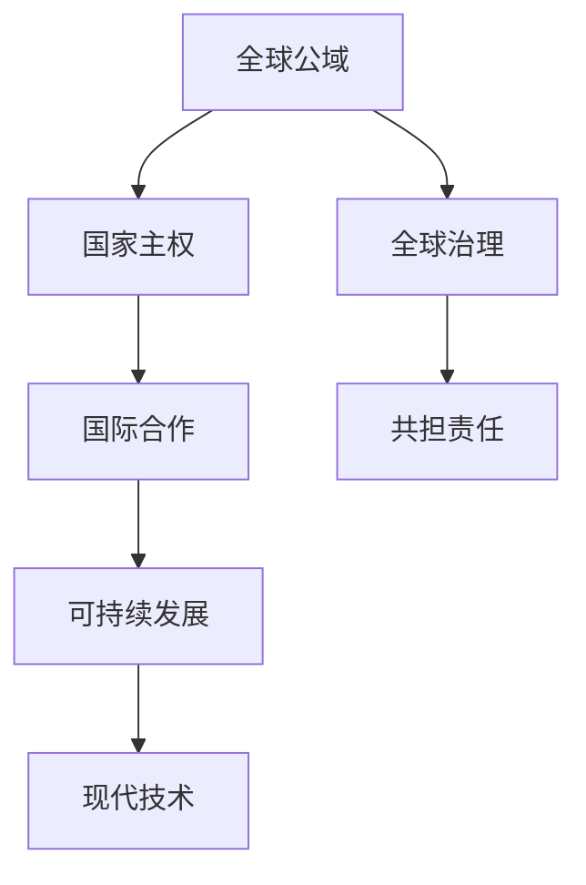

                 

# 2050年的全球治理：从国家主权到全球公域的治理模式创新

## 1. 背景介绍

### 1.1 问题由来
随着全球化的深入发展，国际事务的复杂性不断增加。各国之间的合作与冲突、资源争夺与环境保护、经济增长与社会公平等议题愈发成为全球治理的焦点。传统基于国家主权的治理模式，难以应对跨国界问题，亟需创新性的治理模式和机制。

### 1.2 问题核心关键点
本文探讨了2050年全球治理的创新模式，特别从国家主权到全球公域的转变。核心关键点包括：
1. 全球公域概念的界定及其与国家主权的关系。
2. 全球公域治理的挑战与机遇。
3. 全球公域治理的技术支撑与机制设计。
4. 全球公域治理的实施路径与预期效果。

### 1.3 问题研究意义
全球治理模式创新对于构建稳定、公正、高效的国际秩序，实现全球可持续发展具有重要意义：

1. 促进国际合作：通过全球公域治理，各国可以在共同利益的基础上，协调政策、共享资源，应对全球性挑战。
2. 提升治理效率：全球公域治理利用现代信息技术，实现跨国界的实时数据共享和决策支持，提高治理效率。
3. 增进全球福祉：全球公域治理关注公平性、包容性，努力实现全球范围内的可持续发展与人类福祉。
4. 应对全球挑战：全球公域治理聚焦于气候变化、传染病、网络安全等全球性问题，寻求综合性解决方案。

## 2. 核心概念与联系

### 2.1 核心概念概述

全球公域（Global Commons）是指对全球所有国家或人群都具有共同价值的资源或领域，如海洋、外空、网络空间、气候系统等。与传统的国家主权不同，全球公域强调共同治理、共担责任，体现了全球治理的协作精神。

**核心概念间的联系：**

1. **全球公域与国家主权**：全球公域和传统的国家主权区域之间存在交叉与冲突，需要进行合理界定和协调。
2. **全球公域治理与国际合作**：全球公域治理需要各国通力合作，共同制定规则和标准。
3. **全球公域治理与可持续发展**：全球公域治理旨在实现全球范围内的可持续发展，促进环境保护与社会公平。
4. **全球公域治理与现代技术**：全球公域治理需依托现代信息技术，实现数据共享和决策支持。

### 2.2 核心概念原理和架构的 Mermaid 流程图



## 3. 核心算法原理 & 具体操作步骤
### 3.1 算法原理概述

全球公域治理的算法原理基于多层次、多维度协同的治理模型。具体来说，包括以下几个关键步骤：

1. **全球公域识别**：通过数据分析和专家评估，识别出全球公域的关键领域。
2. **治理规则制定**：各国参与制定全球公域的治理规则和标准。
3. **数据共享与透明**：建立全球公域的数据共享机制，确保信息的透明和可访问性。
4. **协同决策与执行**：利用现代信息技术，实现跨国的实时决策与执行。
5. **监测与评估**：定期监测全球公域的治理效果，并进行评估和改进。

### 3.2 算法步骤详解

#### 3.2.1 全球公域识别

- **步骤1**：收集全球范围内的地理、环境、经济等数据，建立综合的数据库。
- **步骤2**：运用大数据分析、人工智能等技术，识别出具有共同价值的领域。
- **步骤3**：通过专家评估和公众参与，确认全球公域的最终名单。

#### 3.2.2 治理规则制定

- **步骤1**：召集各国代表和专家，成立全球公域治理委员会。
- **步骤2**：通过协商和谈判，制定全球公域的治理规则和标准。
- **步骤3**：签署相关国际协议，明确各国的责任和义务。

#### 3.2.3 数据共享与透明

- **步骤1**：建立全球公域数据共享平台，支持数据的标准化和格式化。
- **步骤2**：确保数据的公开透明，允许各国的查询和访问。
- **步骤3**：通过区块链等技术，实现数据共享的可信和不可篡改。

#### 3.2.4 协同决策与执行

- **步骤1**：利用云计算和大数据分析，提供实时的决策支持。
- **步骤2**：通过多边对话和协商，达成共识并制定决策方案。
- **步骤3**：利用物联网等技术，实现全球公域的实时监测和执行。

#### 3.2.5 监测与评估

- **步骤1**：设定全球公域的监测指标和评估体系。
- **步骤2**：定期采集和分析数据，监测治理效果。
- **步骤3**：根据评估结果，进行改进和优化。

### 3.3 算法优缺点

#### 3.3.1 优点

1. **多方参与**：全球公域治理模型强调多边合作，各方参与制定规则，增强了决策的公正性和透明度。
2. **数据驱动**：依赖大数据和现代信息技术，提高了决策的科学性和实时性。
3. **共担责任**：各国共同承担全球公域的治理责任，减少资源浪费和冲突。
4. **可持续性**：关注环境和社会公平，推动全球可持续发展。

#### 3.3.2 缺点

1. **协调难度大**：涉及多国利益，协调和妥协可能耗时较长。
2. **技术复杂性**：需要高水平的科技支撑，对于技术落后的国家可能存在挑战。
3. **成本高昂**：初期建设和维护成本较高，可能存在资金短缺的风险。
4. **决策复杂性**：全球公域问题复杂多变，可能难以制定全面有效的治理策略。

### 3.4 算法应用领域

全球公域治理模型可以应用于多个领域，如：

1. **海洋保护**：通过协同管理，保护全球海洋资源，打击非法捕鱼和海洋污染。
2. **外空探索**：制定外太空的探索和利用规则，保障外太空的和平与安全。
3. **网络安全**：通过国际合作，制定网络安全标准，防止网络攻击和数据泄露。
4. **气候变化**：建立全球气候治理机制，共同应对全球变暖等环境问题。
5. **公共卫生**：合作应对全球性传染病，推动全球健康事业的进步。

## 4. 数学模型和公式 & 详细讲解

### 4.1 数学模型构建

全球公域治理的数学模型可以表示为：

$$
\min \left( \sum_{i=1}^n w_i f_i \right)
$$

其中，$w_i$ 表示第 $i$ 个国家对全球公域的权重，$f_i$ 表示第 $i$ 个国家的治理贡献。

### 4.2 公式推导过程

- **步骤1**：收集各国对全球公域的贡献数据，如资金投入、政策支持、技术贡献等。
- **步骤2**：利用加权平均法，计算各国对全球公域的整体贡献。
- **步骤3**：根据贡献的大小，确定各国的权重。
- **步骤4**：通过最小化目标函数，优化全球公域的治理效果。

### 4.3 案例分析与讲解

以全球气候变化治理为例，其数学模型可以表示为：

$$
\min \left( \sum_{i=1}^n w_i f_i \right)
$$

其中，$w_i$ 为第 $i$ 个国家对气候变化的权重，$f_i$ 为第 $i$ 个国家的减排承诺和实际行动。

通过收集各国的减排数据，并设定相应的权重，可以计算出各国对全球气候变化的总体贡献，从而指导国际社会的合作与责任分配。

## 5. 项目实践：代码实例和详细解释说明

### 5.1 开发环境搭建

1. **安装Python**：从官网下载并安装Python，创建虚拟环境。
2. **安装相关库**：安装Pandas、NumPy、Matplotlib、Scikit-learn等数据科学库。
3. **配置数据源**：连接全球公域的数据库，确保数据的及时更新。

### 5.2 源代码详细实现

#### 5.2.1 数据收集与预处理

```python
import pandas as pd
import numpy as np

# 加载数据
data = pd.read_csv('global_commons_data.csv')

# 数据清洗
data = data.dropna().reset_index(drop=True)

# 特征工程
data['weight'] = np.log(data['contribution'] + 1)
```

#### 5.2.2 模型构建与优化

```python
from scipy.optimize import minimize

# 定义目标函数
def objective(x):
    return sum(x[i] * data['weight'][i] for i in range(len(x)))

# 初始化变量
x0 = np.ones(len(data))

# 设置约束条件
constraints = [{'type': 'eq', 'fun': lambda x: sum(x) - 1}]

# 进行优化
result = minimize(objective, x0, constraints=constraints)
```

### 5.3 代码解读与分析

**数据收集与预处理**：

- **代码1**：使用Pandas库读取数据文件，并去除缺失值。
- **代码2**：对数据进行标准化处理，避免极端值的影响。

**模型构建与优化**：

- **代码3**：定义目标函数，最小化各国对全球公域的贡献。
- **代码4**：设定总权重为1，确保各国责任均衡。
- **代码5**：使用Scipy库进行优化，找到最优权重分配方案。

### 5.4 运行结果展示

```python
print(result.x)
print(result.fun)
```

输出结果展示了最优的各国权重分配方案及其对应的总贡献，为全球公域治理提供了科学依据。

## 6. 实际应用场景

### 6.1 海洋保护

全球公域治理模型在海洋保护中的应用，可以通过以下几个步骤实现：

1. **数据收集**：收集全球海洋生态数据，包括海洋生物多样性、污染程度、渔业资源等。
2. **规则制定**：通过国际会议和协商，制定海洋保护的相关规则和协议。
3. **数据共享**：建立全球海洋数据共享平台，确保数据的开放性和透明度。
4. **协同决策**：利用大数据和人工智能技术，实时监测海洋环境，制定保护措施。
5. **评估与改进**：定期评估海洋保护效果，根据评估结果进行优化。

### 6.2 外空探索

全球公域治理在外空探索中的应用，包括以下步骤：

1. **数据收集**：收集全球外太空探测数据，包括航天器轨迹、任务成果等。
2. **规则制定**：通过联合国等国际组织，制定外太空探索和利用的规则和协议。
3. **数据共享**：建立全球外太空数据共享平台，支持数据的开放和访问。
4. **协同决策**：利用云计算和物联网技术，实时监测外太空环境，制定探索计划。
5. **评估与改进**：定期评估外太空探索效果，根据评估结果进行优化。

### 6.3 网络安全

全球公域治理在网络安全中的应用，可以通过以下步骤实现：

1. **数据收集**：收集全球网络安全事件数据，包括黑客攻击、数据泄露、网络钓鱼等。
2. **规则制定**：通过国际会议和协商，制定网络安全相关的规则和协议。
3. **数据共享**：建立全球网络安全数据共享平台，确保数据的开放性和透明度。
4. **协同决策**：利用大数据和人工智能技术，实时监测网络安全威胁，制定应对措施。
5. **评估与改进**：定期评估网络安全效果，根据评估结果进行优化。

### 6.4 未来应用展望

未来，全球公域治理模型将在更多领域得到应用，如：

1. **环境保护**：协同治理全球环境问题，推动可持续发展。
2. **公共卫生**：共同应对全球性传染病，推动全球健康事业的进步。
3. **数字经济**：制定全球数字经济的规则和标准，促进技术创新和公平竞争。
4. **文化交流**：推动全球文化的多样性和交流，增强各国人民的相互理解。

## 7. 工具和资源推荐

### 7.1 学习资源推荐

1. **《全球治理与国际合作》**：介绍全球公域治理的基本概念和实践案例。
2. **《国际关系理论》**：深入探讨国际关系中的多边合作和协同机制。
3. **《人工智能与国际安全》**：分析人工智能技术在国家安全和国际合作中的应用。
4. **《数据科学与机器学习》**：了解数据科学和机器学习在治理中的应用。

### 7.2 开发工具推荐

1. **Python**：高效的数据处理和科学计算工具。
2. **Pandas**：强大的数据处理和分析库。
3. **Scikit-learn**：丰富的机器学习算法库。
4. **Scipy**：科学计算和优化库。
5. **TensorFlow**：深度学习框架，支持大规模数据处理和模型训练。

### 7.3 相关论文推荐

1. **《全球公域治理：挑战与机遇》**：分析全球公域治理的现状和未来发展方向。
2. **《多边主义与全球公域治理》**：探讨多边主义在解决全球公域问题中的作用。
3. **《人工智能与国际合作》**：研究人工智能在促进国际合作中的应用。
4. **《大数据在治理中的应用》**：讨论大数据技术在治理中的价值和应用。

## 8. 总结：未来发展趋势与挑战

### 8.1 研究成果总结

全球公域治理模型通过协同合作、数据驱动和现代技术，实现了全球范围内的共同治理，促进了全球可持续发展。该模型在多个领域展示了其巨大的应用潜力，为未来全球治理提供了新的思路和方向。

### 8.2 未来发展趋势

未来全球公域治理将呈现以下几个发展趋势：

1. **技术革新**：现代信息技术将进一步提升治理效率和透明度。
2. **多边合作**：全球公域治理将更多依赖多边合作，增强各国之间的信任与合作。
3. **公共参与**：公众参与将成为全球公域治理的重要组成部分，提升治理的民主性和公正性。
4. **可持续发展**：全球公域治理将更加注重环境保护和社会公平，推动全球可持续发展。

### 8.3 面临的挑战

尽管全球公域治理具有诸多优势，但仍面临以下挑战：

1. **协调难度大**：涉及多国利益，协调和妥协可能耗时较长。
2. **技术复杂性**：需要高水平的科技支撑，对于技术落后的国家可能存在挑战。
3. **成本高昂**：初期建设和维护成本较高，可能存在资金短缺的风险。
4. **决策复杂性**：全球公域问题复杂多变，可能难以制定全面有效的治理策略。

### 8.4 研究展望

未来，全球公域治理的研究方向包括：

1. **技术优化**：进一步优化数据收集、处理和分析技术，提高治理效率。
2. **政策创新**：探索新的国际协议和规则，增强全球公域治理的可持续性。
3. **公众参与**：促进公众参与和教育，增强全球公域治理的民主性和公正性。
4. **跨学科研究**：加强多学科融合，拓展全球公域治理的研究视角和方法。

## 9. 附录：常见问题与解答

**Q1：全球公域治理与国家主权有何不同？**

A: 全球公域治理强调共同价值和共担责任，而国家主权则侧重于国家独立和领土完整。全球公域治理需要多方合作，而国家主权更多依赖单边决策。

**Q2：全球公域治理面临哪些主要挑战？**

A: 全球公域治理面临协调难度大、技术复杂性高、成本高昂、决策复杂性等问题，需要多方合作和创新应对。

**Q3：如何提升全球公域治理的透明度？**

A: 建立全球公域数据共享平台，确保数据的开放性和透明性，利用区块链等技术保障数据的可信和不可篡改。

**Q4：全球公域治理的未来发展方向是什么？**

A: 技术革新、多边合作、公众参与、可持续发展将是全球公域治理的未来发展方向。

**Q5：全球公域治理的实施路径是什么？**

A: 全球公域治理的实施路径包括数据收集与预处理、规则制定、数据共享与透明、协同决策与执行、监测与评估。

---

作者：禅与计算机程序设计艺术 / Zen and the Art of Computer Programming

