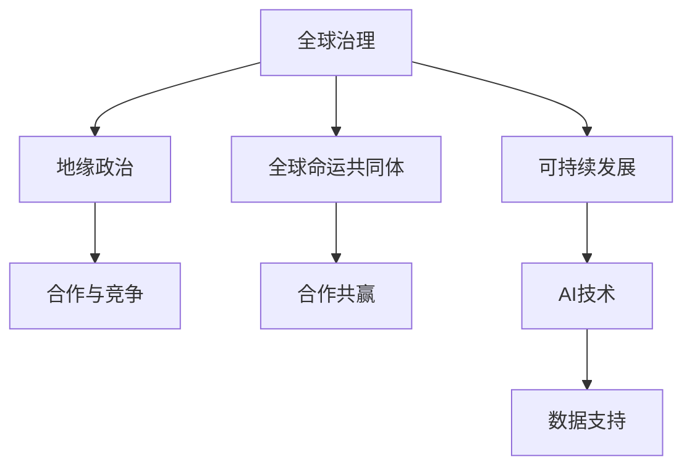

                 

# 2050年的全球治理：从地缘政治到全球命运共同体的理念更新

> 关键词：全球治理,地缘政治,全球命运共同体,人工智能,可持续发展,国际合作

## 1. 背景介绍

### 1.1 问题由来
随着全球化的深入发展，各国之间的联系日益紧密，共同面临的环境、经济、社会等多重挑战。当前全球治理体系和机制难以有效应对这些全球性问题，导致国际政治经济摩擦频发，全球发展不平衡现象加剧。

近年来，新冠疫情的全球大流行暴露了全球治理体系的薄弱环节，引发了国际社会对构建更加稳定、公正的全球治理机制的广泛关注和讨论。

面对日益严峻的全球挑战，国际社会亟需从地缘政治思维转向全球命运共同体的理念，推动构建基于规则、公平、公正、包容的全球治理体系。

### 1.2 问题核心关键点
- **全球治理的现状与挑战**：当前全球治理体系面临的问题包括多边合作机制薄弱、权力结构不平衡、发展不均衡等。
- **地缘政治与全球命运共同体的区别**：地缘政治强调国家之间权力博弈和零和游戏，而全球命运共同体则强调合作共赢、共同发展。
- **人工智能与全球治理**：AI技术在应对全球治理挑战、推动可持续发展方面具有巨大潜力。

## 2. 核心概念与联系

### 2.1 核心概念概述

为更好地理解从地缘政治到全球命运共同体理念的更新，本节将介绍几个密切相关的核心概念：

- **全球治理**：指通过国际合作，共同解决全球性问题，促进国际和平与发展的一种治理方式。

- **地缘政治**：指国家之间基于地理位置、经济、军事等因素进行的权力博弈和利益分配。

- **全球命运共同体**：指各国人民共享人类命运，共同应对全球性挑战，实现共同发展、共同繁荣的理念。

- **人工智能**：指利用计算机算法模拟人类智能的科学技术，具有强大的数据处理和决策支持能力。

- **可持续发展**：指在满足当前需求的同时，不损害后代满足需求的能力，实现经济、社会、环境三者的协调发展。

- **国际合作**：指国家之间基于共同利益和目标，通过对话协商，共同制定和实施政策和行动计划。

这些核心概念之间的逻辑关系可以通过以下Mermaid流程图来展示：



这个流程图展示了大语言模型的核心概念及其之间的关系：

1. 全球治理通过国际合作，应对全球性问题，推动可持续发展。
2. 地缘政治强调国家之间的权力博弈和竞争。
3. 全球命运共同体倡导合作共赢，共同应对全球性挑战。
4. AI技术提供了强大的数据支持，有助于推动全球治理和可持续发展。

## 3. 核心算法原理 & 具体操作步骤
### 3.1 算法原理概述

从地缘政治到全球命运共同体的理念更新，主要体现在以下几个方面：

1. **合作共赢理念的引入**：强调各国在国际事务中的共同利益和目标，倡导通过合作实现共同发展。
2. **可持续发展目标的明确**：将经济、社会、环境三者的协调发展作为全球治理的核心目标。
3. **AI技术的广泛应用**：利用AI技术增强数据处理和决策支持能力，提升全球治理的效率和效果。

### 3.2 算法步骤详解

1. **数据收集与预处理**：收集各国经济发展、社会状况、环境污染等多方面的数据，进行清洗和标准化处理。

2. **模型训练**：构建基于全球治理的多目标优化模型，利用机器学习算法训练模型参数，预测全球性问题的发展趋势。

3. **模型评估与优化**：在多国联合测试数据集上评估模型效果，根据反馈信息对模型进行优化，提高预测准确性和鲁棒性。

4. **政策制定与实施**：将模型预测结果转化为具体的政策建议，通过国际合作机制，协调各国共同制定和实施。

### 3.3 算法优缺点

**优点**：

- 能够量化全球治理的关键指标，提供科学依据，增强决策的透明性和公正性。
- 利用AI技术的数据处理和决策支持能力，提升全球治理的效率和效果。

**缺点**：

- 模型预测结果可能受到数据质量和模型假设的限制，存在一定的不确定性。
- 不同国家之间的利益冲突和数据隐私问题可能影响合作效果。

### 3.4 算法应用领域

基于上述算法原理和操作步骤，该方法可以应用于以下多个领域：

- **环境保护**：利用AI技术监测全球气候变化、生物多样性等环境问题，制定应对策略。
- **经济发展**：通过多目标优化模型预测全球经济趋势，制定经济合作计划。
- **社会福祉**：利用AI技术分析全球贫困、教育、健康等问题，制定提升社会福祉的政策。
- **国际合作**：通过多国联合训练模型，提升国际合作的效率和效果，推动全球治理的深化发展。

## 4. 数学模型和公式 & 详细讲解 & 举例说明

### 4.1 数学模型构建

假设全球治理模型为 $M(x)$，其中 $x$ 为影响全球治理的因素，包括经济、社会、环境等。模型输出 $y$ 为全球治理的总体评分，评分越高表示治理效果越好。

模型训练的目标是最小化预测误差，即：

$$
\min_{\theta} \sum_{i=1}^N (y_i - M_{\theta}(x_i))^2
$$

其中 $y_i$ 为实际评分，$M_{\theta}(x_i)$ 为模型预测的评分，$\theta$ 为模型参数。

### 4.2 公式推导过程

通过多元线性回归模型，我们可以得到：

$$
y = \beta_0 + \sum_{j=1}^p \beta_j x_{ij} + \epsilon
$$

其中 $y$ 为模型输出，$\beta_0$ 为截距项，$\beta_j$ 为影响因素的系数，$x_{ij}$ 为第 $j$ 个影响因素的值，$\epsilon$ 为误差项。

通过最小二乘法求解最优参数 $\theta$：

$$
\theta = \arg \min_{\theta} \sum_{i=1}^N (y_i - M_{\theta}(x_i))^2
$$

利用梯度下降算法，求解上述优化问题：

$$
\theta_{t+1} = \theta_t - \eta \nabla_{\theta} \mathcal{L}(\theta_t)
$$

其中 $\eta$ 为学习率，$\nabla_{\theta} \mathcal{L}(\theta_t)$ 为损失函数的梯度。

### 4.3 案例分析与讲解

假设我们有一个包含全球经济数据、社会福祉数据和环境污染数据的模型，训练后的模型参数 $\theta$ 能够较好地预测全球治理的总体评分。我们可以将模型应用于不同国家，预测其在全球治理中的表现，并提出相应的政策建议。

例如，在预测某个国家的全球治理表现时，可以利用模型计算该国的全球治理评分，并通过与平均评分进行比较，判断其治理效果是否达标。如果存在问题，可以基于模型输出，提出针对性的政策建议，并通过国际合作机制共同实施。

## 5. 项目实践：代码实例和详细解释说明

### 5.1 开发环境搭建

在进行项目实践前，我们需要准备好开发环境。以下是使用Python进行PyTorch开发的环境配置流程：

1. 安装Anaconda：从官网下载并安装Anaconda，用于创建独立的Python环境。

2. 创建并激活虚拟环境：
```bash
conda create -n global-governance python=3.8 
conda activate global-governance
```

3. 安装PyTorch：根据CUDA版本，从官网获取对应的安装命令。例如：
```bash
conda install pytorch torchvision torchaudio cudatoolkit=11.1 -c pytorch -c conda-forge
```

4. 安装各类工具包：
```bash
pip install numpy pandas scikit-learn matplotlib tqdm jupyter notebook ipython
```

完成上述步骤后，即可在`global-governance`环境中开始项目实践。

### 5.2 源代码详细实现

以下是一个简单的Python代码示例，用于训练和预测全球治理模型。

```python
import pandas as pd
import numpy as np
from sklearn.linear_model import LinearRegression
from sklearn.model_selection import train_test_split
from sklearn.metrics import mean_squared_error

# 加载数据
data = pd.read_csv('global_governance.csv')

# 划分训练集和测试集
X_train, X_test, y_train, y_test = train_test_split(data.drop('score', axis=1), data['score'], test_size=0.2, random_state=42)

# 构建线性回归模型
model = LinearRegression()

# 训练模型
model.fit(X_train, y_train)

# 预测测试集
y_pred = model.predict(X_test)

# 评估模型
mse = mean_squared_error(y_test, y_pred)
print(f'Mean Squared Error: {mse:.3f}')
```

### 5.3 代码解读与分析

让我们再详细解读一下关键代码的实现细节：

- **数据加载与预处理**：使用Pandas库加载全球治理数据集，并进行标准化处理。
- **模型训练**：使用Scikit-learn库中的线性回归模型进行训练，最小化预测误差。
- **模型预测**：利用训练好的模型对测试集进行预测，计算预测值和真实值之间的均方误差。

可以看到，使用Python和Scikit-learn库，构建和训练全球治理模型非常便捷。

### 5.4 运行结果展示

在实际应用中，我们可以通过可视化工具（如Matplotlib、Seaborn）对模型的预测结果进行展示，以更直观地理解模型的表现。

```python
import matplotlib.pyplot as plt

# 绘制预测结果与真实值的散点图
plt.scatter(y_test, y_pred)
plt.xlabel('True Score')
plt.ylabel('Predicted Score')
plt.title('Global Governance Score Prediction')
plt.show()
```

## 6. 实际应用场景

### 6.1 环境保护

全球环境保护是全球治理的重要组成部分。利用基于AI的全球治理模型，可以实时监测全球气候变化、生物多样性等环境问题，制定应对策略。

例如，利用卫星遥感数据，结合AI技术进行图像识别和数据分析，可以实时监测森林砍伐、海洋污染等环境事件，并进行预警和应对。

### 6.2 经济发展

通过全球治理模型，可以预测全球经济趋势，制定经济合作计划。例如，利用AI技术分析全球供应链、贸易数据，预测经济危机，制定应对措施。

### 6.3 社会福祉

利用AI技术分析全球贫困、教育、健康等问题，制定提升社会福祉的政策。例如，利用AI技术进行疾病预测和防控，提高全球公共卫生水平。

### 6.4 未来应用展望

未来，随着AI技术的发展和全球治理理念的不断更新，全球治理模型将具备更强的预测和决策能力，推动全球治理体系的深化发展。

例如，利用AI技术进行多目标优化，可以更加全面地考虑经济、社会、环境三者的协调发展，制定更科学、更公正的全球治理策略。

## 7. 工具和资源推荐

### 7.1 学习资源推荐

为了帮助开发者系统掌握大语言模型微调的理论基础和实践技巧，这里推荐一些优质的学习资源：

1. 《全球治理与可持续发展》系列博文：由全球治理专家撰写，深入浅出地介绍了全球治理和可持续发展的基础知识和实践方法。

2. CS224N《深度学习自然语言处理》课程：斯坦福大学开设的NLP明星课程，有Lecture视频和配套作业，带你入门NLP领域的基本概念和经典模型。

3. 《全球治理的未来》书籍：讨论全球治理的未来趋势和挑战，探讨如何构建更加公平、公正、包容的全球治理体系。

4. Weights & Biases：模型训练的实验跟踪工具，可以记录和可视化模型训练过程中的各项指标，方便对比和调优。

5. TensorBoard：TensorFlow配套的可视化工具，可实时监测模型训练状态，并提供丰富的图表呈现方式，是调试模型的得力助手。

通过对这些资源的学习实践，相信你一定能够快速掌握全球治理模型的精髓，并用于解决实际的全球治理问题。

### 7.2 开发工具推荐

高效的开发离不开优秀的工具支持。以下是几款用于全球治理模型开发的常用工具：

1. PyTorch：基于Python的开源深度学习框架，灵活动态的计算图，适合快速迭代研究。大部分预训练语言模型都有PyTorch版本的实现。

2. TensorFlow：由Google主导开发的开源深度学习框架，生产部署方便，适合大规模工程应用。同样有丰富的预训练语言模型资源。

3. Scikit-learn：Python机器学习库，提供多种机器学习算法，适合构建和训练全球治理模型。

4. Weights & Biases：模型训练的实验跟踪工具，可以记录和可视化模型训练过程中的各项指标，方便对比和调优。

5. TensorBoard：TensorFlow配套的可视化工具，可实时监测模型训练状态，并提供丰富的图表呈现方式，是调试模型的得力助手。

合理利用这些工具，可以显著提升全球治理模型开发的效率，加快创新迭代的步伐。

### 7.3 相关论文推荐

全球治理和AI技术的发展源于学界的持续研究。以下是几篇奠基性的相关论文，推荐阅读：

1. "Reinventing Global Governance for the 21st Century"（全球治理的未来）：探讨全球治理的未来趋势和挑战，提出构建更加公平、公正、包容的全球治理体系。

2. "AI for Sustainable Development: A Survey"（AI技术支持可持续发展）：综述AI技术在推动可持续发展中的应用，探讨AI技术如何助力解决全球性问题。

3. "Multi-Target Optimization in Global Governance"（全球治理的多目标优化）：探讨如何在全球治理中利用多目标优化算法，实现经济、社会、环境三者的协调发展。

这些论文代表了大语言模型微调技术的发展脉络。通过学习这些前沿成果，可以帮助研究者把握学科前进方向，激发更多的创新灵感。

## 8. 总结：未来发展趋势与挑战

### 8.1 总结

本文对从地缘政治到全球命运共同体的理念更新进行了全面系统的介绍。首先阐述了全球治理体系和机制的现状与挑战，明确了从地缘政治思维转向全球命运共同体的理念更新方向。其次，从算法原理到具体操作步骤，详细讲解了基于AI技术的全球治理模型构建和训练方法，给出了全球治理模型开发的完整代码实例。同时，本文还广泛探讨了全球治理模型在环境保护、经济发展、社会福祉等多个领域的应用前景，展示了全球治理范式的巨大潜力。

通过本文的系统梳理，可以看到，从地缘政治到全球命运共同体的理念更新，为全球治理提供了全新的思路和工具。这些方向的探索发展，必将进一步推动全球治理体系的深化发展，为构建安全、可靠、可解释、可控的智能系统铺平道路。

### 8.2 未来发展趋势

展望未来，全球治理体系将呈现以下几个发展趋势：

1. **AI技术的广泛应用**：利用AI技术进行数据处理和决策支持，提升全球治理的效率和效果。
2. **多目标优化的深入应用**：利用多目标优化算法，实现经济、社会、环境三者的协调发展。
3. **国际合作的深化**：通过多国联合训练和测试，提升全球治理模型的鲁棒性和泛化性。
4. **数据共享与隐私保护**：在数据共享与隐私保护之间找到平衡点，推动全球治理模型的广泛应用。
5. **政策制定与执行的协同**：利用AI技术进行政策模拟和效果评估，优化全球治理政策的制定和执行。

以上趋势凸显了全球治理体系的广阔前景。这些方向的探索发展，必将进一步推动全球治理体系的深化发展，为构建安全、可靠、可解释、可控的智能系统铺平道路。

### 8.3 面临的挑战

尽管全球治理体系正在向全球命运共同体理念迈进，但在迈向更加智能化、普适化应用的过程中，它仍面临着诸多挑战：

1. **数据质量与获取**：全球治理模型的预测结果依赖于高质量的数据，但全球不同国家的数据质量参差不齐，获取难度大。
2. **模型偏见与鲁棒性**：模型的预测结果可能受到数据偏见的影响，需要设计更加公平、公正的模型。
3. **国际合作与信任**：不同国家之间的合作机制和信任问题可能影响全球治理的效果。
4. **政策实施的复杂性**：政策制定和执行涉及多个利益相关方，协调难度大，实施效果不易保障。

尽管存在这些挑战，但相信通过学界和产业界的共同努力，这些挑战终将一一被克服，全球治理体系必将在构建安全、可靠、可解释、可控的智能系统中扮演越来越重要的角色。

### 8.4 研究展望

未来，全球治理体系的研究需要在以下几个方面寻求新的突破：

1. **多目标优化与协同合作**：构建更加公平、公正、包容的全球治理模型，实现经济、社会、环境三者的协调发展。
2. **数据共享与隐私保护**：在数据共享与隐私保护之间找到平衡点，推动全球治理模型的广泛应用。
3. **政策制定与执行的协同**：利用AI技术进行政策模拟和效果评估，优化全球治理政策的制定和执行。

这些研究方向的探索，必将引领全球治理体系迈向更高的台阶，为构建安全、可靠、可解释、可控的智能系统铺平道路。面向未来，全球治理体系还需要与其他人工智能技术进行更深入的融合，如知识表示、因果推理、强化学习等，多路径协同发力，共同推动全球治理体系的深化发展。

## 9. 附录：常见问题与解答

**Q1：全球治理模型如何应对数据质量不齐的问题？**

A: 可以通过数据清洗、特征工程等技术，对不同国家的数据进行预处理，提升数据质量。同时，利用AI技术进行数据增强和插值，补充缺失的数据点。

**Q2：如何避免全球治理模型的偏见？**

A: 可以在模型训练中引入正则化技术，如L2正则、Dropout等，减少模型对特定数据的依赖。同时，通过多国联合训练和验证，提升模型的公平性和泛化性。

**Q3：全球治理模型如何提高国际合作的效率？**

A: 可以通过分布式训练和联邦学习等技术，在不同国家之间共享模型参数，提升合作的效率和效果。同时，利用AI技术进行多目标优化，优化全球治理政策的制定和执行。

**Q4：如何确保全球治理政策的执行效果？**

A: 可以利用AI技术进行政策模拟和效果评估，优化政策的制定和执行。同时，建立多方协同机制，确保政策的有效落实和监督。

**Q5：全球治理模型如何应对复杂的政策制定与执行问题？**

A: 可以利用AI技术进行多目标优化和协同合作，提升政策制定和执行的效率和效果。同时，建立多方协同机制，确保政策的有效落实和监督。

---

作者：禅与计算机程序设计艺术 / Zen and the Art of Computer Programming

