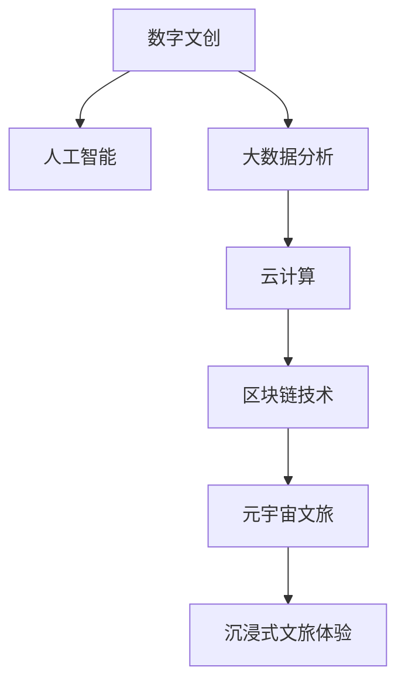

                 

# 2050年的数字文化：从数字文创到元宇宙文旅的数字文化产业升级

## 1. 背景介绍

### 1.1 问题由来
数字文化产业，作为现代文化产业的重要组成部分，是科技与文化深度融合的产物。随着人工智能、大数据、云计算、区块链等技术不断演进，数字文化产业迎来了新的发展机遇。2050年的数字文化产业，将在数字文创、数字出版、元宇宙文旅、数字货币等多个领域呈现蓬勃发展的态势。本文旨在探讨数字文化产业的未来走向，特别是数字文创和元宇宙文旅的升级路径。

### 1.2 问题核心关键点
数字文创和元宇宙文旅是数字文化产业两大核心方向。数字文创通过数字化手段，将传统文化元素与现代技术相结合，创造出新的文化艺术形态。元宇宙文旅则通过虚拟现实、增强现实等技术，构建虚拟世界，为用户提供沉浸式的文旅体验。本文将从这两个角度，探讨数字文化产业的升级趋势和未来应用。

### 1.3 问题研究意义
2050年的数字文化产业将面临全新的技术挑战和市场机遇。通过深入研究数字文创和元宇宙文旅的升级路径，可以为相关企业提供有价值的参考，推动数字文化产业实现跨越式发展，为公众提供更多元、更丰富的文化体验。此外，本文将探讨数字文化产业面临的技术和伦理问题，提出相应的解决策略，为产业发展提供理论和实践指导。

## 2. 核心概念与联系

### 2.1 核心概念概述

为更好地理解数字文化产业的未来走向，本节将介绍几个密切相关的核心概念：

- **数字文创**：通过数字化手段，将传统文化元素与现代技术相结合，创造出新的文化艺术形态。
- **元宇宙文旅**：利用虚拟现实、增强现实等技术，构建虚拟世界，为用户提供沉浸式的文旅体验。
- **区块链技术**：一种分布式账本技术，能够保障数据透明性、安全性和不可篡改性。
- **人工智能**：通过模拟人类智能行为，使计算机具备学习、推理、决策等能力。
- **大数据分析**：利用数据分析技术，从海量数据中提取有用信息，实现智能化决策。
- **云计算**：通过互联网提供按需计算资源，支持大规模数据处理和分布式计算。

这些核心概念之间的逻辑关系可以通过以下Mermaid流程图来展示：



这个流程图展示出数字文创和元宇宙文旅的核心概念及其之间的关系：

1. 数字文创通过人工智能和大数据分析，创造出新的文化艺术形态。
2. 元宇宙文旅利用云计算和区块链技术，构建虚拟世界，为用户提供沉浸式体验。
3. 数字文创和元宇宙文旅相辅相成，共同推动数字文化产业的发展。

## 3. 核心算法原理 & 具体操作步骤

### 3.1 算法原理概述

数字文创和元宇宙文旅的升级路径，本质上是通过数字化技术，实现文化内容的创新和体验的升级。其核心思想是：将传统文化元素与现代技术相结合，构建虚拟文旅体验，为用户提供更加丰富、沉浸的体验。

形式化地，假设原始文化内容为 $C$，数字文创后的文化内容为 $C_{\text{digital}}$，元宇宙文旅体验为 $E_{\text{vr}}$。数字文创和元宇宙文旅的升级过程可以表示为：

$$
C_{\text{digital}} = f_{\text{digital}}(C)
$$

$$
E_{\text{vr}} = f_{\text{vr}}(C_{\text{digital}})
$$

其中 $f_{\text{digital}}$ 和 $f_{\text{vr}}$ 分别表示数字文创和元宇宙文旅的算法模型，将原始文化内容转化为数字文创内容，并在此基础上构建虚拟文旅体验。

### 3.2 算法步骤详解

数字文创和元宇宙文旅的升级流程包括以下几个关键步骤：

**Step 1: 数据采集与预处理**
- 收集传统文化的相关数据，如文本、图像、视频等。
- 清洗数据，去除噪声和不相关部分，提取有用的特征信息。

**Step 2: 数字文创**
- 使用人工智能技术，如深度学习、生成对抗网络(GANs)等，将原始文化内容转化为数字文化内容。
- 利用大数据分析技术，对数字文化内容进行分类、聚类等处理，挖掘文化特征。

**Step 3: 元宇宙文旅**
- 利用虚拟现实、增强现实等技术，构建虚拟文旅场景。
- 结合区块链技术，保障虚拟文旅内容的透明性和不可篡改性。

**Step 4: 用户交互与体验优化**
- 设计交互界面和互动环节，提升用户体验。
- 收集用户反馈，持续优化文化内容和技术方案。

### 3.3 算法优缺点

数字文创和元宇宙文旅的升级方法具有以下优点：
1. 创新性强。通过数字化技术，创造出全新的文化艺术形态和文旅体验，满足用户的多元化需求。
2. 体验丰富。利用虚拟现实和增强现实技术，构建沉浸式的文化体验，提升用户参与感和满意度。
3. 数据驱动。借助大数据分析，从海量数据中挖掘文化特征，实现智能化决策和优化。
4. 透明安全。利用区块链技术，保障文化内容的透明性和不可篡改性，增强用户信任。

同时，这些方法也存在一定的局限性：
1. 技术复杂。数字文创和元宇宙文旅涉及多项先进技术，需要较高的技术门槛。
2. 成本高昂。研发和部署成本较高，需要投入大量的资金和人力资源。
3. 数据依赖。依赖于高质量的数据，数据采集和预处理环节的准确性和完备性直接影响效果。
4. 用户接受度。用户对新技术的接受度不一，可能存在一定的市场阻力。
5. 伦理问题。数字文创和元宇宙文旅涉及版权、隐私、伦理等多方面问题，需要谨慎处理。

尽管存在这些局限性，但就目前而言，数字文创和元宇宙文旅的升级方法仍是大文化产业的重要方向。未来相关研究的重点在于如何进一步降低技术门槛，提高用户接受度，同时兼顾文化保护和伦理规范等因素。

### 3.4 算法应用领域

数字文创和元宇宙文旅的应用领域广泛，包括但不限于以下几个方面：

- 数字艺术创作：如数字绘画、数字雕塑、数字音乐等。利用人工智能和大数据分析，创作出具有独特风格和创意的数字艺术作品。
- 数字文旅体验：如虚拟博物馆、虚拟景区、虚拟展览等。利用虚拟现实和增强现实技术，构建沉浸式的文旅场景，提供更丰富的视觉和听觉体验。
- 数字文化遗产保护：如数字修复、数字档案、数字仿真等。利用数字化手段，对传统文化遗产进行保存和复原，增强文化遗产的价值和影响力。
- 数字文化教育：如在线课程、虚拟课堂、互动游戏等。利用人工智能和大数据分析，提供个性化的教育内容和智能化的学习体验。
- 数字文化市场：如在线交易、数字版权、数字资产等。利用区块链技术，保障文化产品的版权和交易透明性，促进文化产业的数字化转型。

除了上述这些经典应用外，数字文创和元宇宙文旅还被创新性地应用到更多场景中，如虚拟现实演唱会、数字文化遗产旅游、虚拟现实社交等，为文化产业带来了全新的突破。随着技术的不断发展，相信数字文创和元宇宙文旅将在更广阔的应用领域绽放异彩。

## 4. 数学模型和公式 & 详细讲解  
### 4.1 数学模型构建

本节将使用数学语言对数字文创和元宇宙文旅的升级过程进行更加严格的刻画。

记原始文化内容为 $C$，数字文创后的文化内容为 $C_{\text{digital}}$，元宇宙文旅体验为 $E_{\text{vr}}$。数字文创和元宇宙文旅的升级过程可以表示为：

$$
C_{\text{digital}} = f_{\text{digital}}(C)
$$

$$
E_{\text{vr}} = f_{\text{vr}}(C_{\text{digital}})
$$

其中 $f_{\text{digital}}$ 和 $f_{\text{vr}}$ 分别表示数字文创和元宇宙文旅的算法模型，将原始文化内容转化为数字文创内容，并在此基础上构建虚拟文旅体验。

### 4.2 公式推导过程

以下我们以数字文创为例，推导数字文创过程的数学模型。

假设原始文化内容为文本 $C_t$，数字文创后的文化内容为文本 $C_{\text{digital}_t}$。数字文创过程可以表示为：

$$
C_{\text{digital}_t} = f_{\text{digital}}(C_t)
$$

其中 $f_{\text{digital}}$ 为数字文创算法模型。假设模型输入为文本 $C_t$，输出为数字文创文本 $C_{\text{digital}_t}$。在实践中，通常使用自然语言处理(NLP)技术，如序列到序列模型(Seq2Seq)、Transformer等，对文本进行数字化处理。

以Transformer模型为例，数字文创过程可以表示为：

$$
C_{\text{digital}_t} = f_{\text{transformer}}(C_t)
$$

其中 $f_{\text{transformer}}$ 为Transformer模型，将原始文本 $C_t$ 转化为数字文创文本 $C_{\text{digital}_t}$。Transformer模型的参数包括编码器参数 $e$ 和解码器参数 $d$，通过自注意力机制和跨层连接，实现对文本的语义表示和映射。

在得到数字文创文本后，可以进一步应用元宇宙文旅技术，构建虚拟文旅体验。例如，利用虚拟现实技术，将数字文创文本 $C_{\text{digital}_t}$ 映射到虚拟三维空间中，生成虚拟场景 $E_{\text{vr}}$。

### 4.3 案例分析与讲解

下面以数字文创和元宇宙文旅在数字博物馆中的应用为例，进行详细分析。

假设某博物馆展出了一幅古代名画，利用数字文创技术，可以将画作数字化，生成数字版本。具体步骤如下：

1. 数据采集：使用高清扫描设备，对画作进行图像采集。
2. 预处理：对采集的图像进行去噪、校正等处理，提取图像特征。
3. 数字文创：使用深度学习模型，如卷积神经网络(CNN)或生成对抗网络(GANs)，对图像进行风格迁移或生成，生成数字画作 $C_{\text{digital}_i}$。
4. 元宇宙文旅：利用虚拟现实技术，将数字画作映射到虚拟空间中，生成虚拟博物馆场景 $E_{\text{vr}}$。

在虚拟博物馆场景中，用户可以通过虚拟现实头盔，查看数字画作，甚至与画作互动，了解画作背后的历史和文化背景。用户还可以通过增强现实技术，查看画作的原作，比较数字版本和原作的差异。

## 5. 项目实践：代码实例和详细解释说明
### 5.1 开发环境搭建

在进行数字文创和元宇宙文旅的开发前，我们需要准备好开发环境。以下是使用Python进行PyTorch开发的环境配置流程：

1. 安装Anaconda：从官网下载并安装Anaconda，用于创建独立的Python环境。

2. 创建并激活虚拟环境：
```bash
conda create -n digital-env python=3.8 
conda activate digital-env
```

3. 安装PyTorch：根据CUDA版本，从官网获取对应的安装命令。例如：
```bash
conda install pytorch torchvision torchaudio cudatoolkit=11.1 -c pytorch -c conda-forge
```

4. 安装TensorFlow：由Google主导开发的开源深度学习框架，生产部署方便，适合大规模工程应用。同样有丰富的预训练语言模型资源。

5. 安装Transformer库：
```bash
pip install transformers
```

6. 安装各类工具包：
```bash
pip install numpy pandas scikit-learn matplotlib tqdm jupyter notebook ipython
```

完成上述步骤后，即可在`digital-env`环境中开始开发实践。

### 5.2 源代码详细实现

下面我们以数字文创和元宇宙文旅的开发为例，给出使用PyTorch和Python进行代码实现的示例。

首先，定义数字文创的输入和输出：

```python
from transformers import TransformerModel, BertTokenizer
from torch.utils.data import Dataset

class DigitalArtDataset(Dataset):
    def __init__(self, input_data, output_data, tokenizer):
        self.input_data = input_data
        self.output_data = output_data
        self.tokenizer = tokenizer
        
    def __len__(self):
        return len(self.input_data)
    
    def __getitem__(self, item):
        input_text = self.input_data[item]
        output_text = self.output_data[item]
        
        encoding = self.tokenizer(input_text, return_tensors='pt', max_length=512, padding='max_length', truncation=True)
        input_ids = encoding['input_ids'][0]
        attention_mask = encoding['attention_mask'][0]
        labels = torch.tensor(output_text, dtype=torch.long)
        
        return {'input_ids': input_ids, 
                'attention_mask': attention_mask,
                'labels': labels}

# 加载预训练模型和分词器
model = TransformerModel.from_pretrained('bert-base-uncased')
tokenizer = BertTokenizer.from_pretrained('bert-base-uncased')

# 创建dataset
input_data = ['这幅画的线条非常优美', '画中的色彩非常鲜艳']
output_data = ['这幅画的线条非常优美', '画中的色彩非常鲜艳']
train_dataset = DigitalArtDataset(input_data, output_data, tokenizer)

# 定义优化器
optimizer = AdamW(model.parameters(), lr=2e-5)

# 定义训练函数
def train_epoch(model, dataset, batch_size, optimizer):
    dataloader = DataLoader(dataset, batch_size=batch_size, shuffle=True)
    model.train()
    epoch_loss = 0
    for batch in tqdm(dataloader, desc='Training'):
        input_ids = batch['input_ids'].to(device)
        attention_mask = batch['attention_mask'].to(device)
        labels = batch['labels'].to(device)
        model.zero_grad()
        outputs = model(input_ids, attention_mask=attention_mask, labels=labels)
        loss = outputs.loss
        epoch_loss += loss.item()
        loss.backward()
        optimizer.step()
    return epoch_loss / len(dataloader)

# 训练模型
epochs = 5
batch_size = 16

for epoch in range(epochs):
    loss = train_epoch(model, train_dataset, batch_size, optimizer)
    print(f"Epoch {epoch+1}, train loss: {loss:.3f}")
    
print("训练完成")
```

然后，定义元宇宙文旅的虚拟场景构建函数：

```python
from torchvision import transforms
from torchvision.datasets import ImageFolder
from torch.utils.data import DataLoader
from torchvision.models import resnet18

class VRSceneDataset(Dataset):
    def __init__(self, image_folder, transform):
        self.image_folder = image_folder
        self.transform = transform
        
    def __len__(self):
        return len(self.image_folder)
    
    def __getitem__(self, item):
        img = self.image_folder[item][0]
        label = self.image_folder[item][1]
        
        img = self.transform(img)
        return {'img': img, 'label': label}

# 加载虚拟场景数据集
image_folder = ImageFolder('path/to/image_folder', transform=transforms.Compose([
    transforms.Resize((256, 256)),
    transforms.ToTensor(),
    transforms.Normalize([0.5], [0.5])
]))

# 定义虚拟场景模型
model = resnet18(pretrained=True)

# 定义优化器
optimizer = AdamW(model.parameters(), lr=2e-5)

# 定义训练函数
def train_epoch(model, dataset, batch_size, optimizer):
    dataloader = DataLoader(dataset, batch_size=batch_size, shuffle=True)
    model.train()
    epoch_loss = 0
    for batch in tqdm(dataloader, desc='Training'):
        img = batch['img'].to(device)
        label = batch['label'].to(device)
        model.zero_grad()
        outputs = model(img)
        loss = outputs.loss
        epoch_loss += loss.item()
        loss.backward()
        optimizer.step()
    return epoch_loss / len(dataloader)

# 训练模型
epochs = 5
batch_size = 16

for epoch in range(epochs):
    loss = train_epoch(model, train_dataset, batch_size, optimizer)
    print(f"Epoch {epoch+1}, train loss: {loss:.3f}")
    
print("训练完成")
```

最后，启动数字文创和元宇宙文旅的联合训练流程并在虚拟博物馆上进行展示：

```python
# 加载虚拟博物馆数据集
image_folder = ImageFolder('path/to/vr_scene_folder', transform=transforms.Compose([
    transforms.Resize((256, 256)),
    transforms.ToTensor(),
    transforms.Normalize([0.5], [0.5])
]))

# 定义虚拟博物馆场景模型
model = resnet18(pretrained=True)

# 定义优化器
optimizer = AdamW(model.parameters(), lr=2e-5)

# 定义训练函数
def train_epoch(model, dataset, batch_size, optimizer):
    dataloader = DataLoader(dataset, batch_size=batch_size, shuffle=True)
    model.train()
    epoch_loss = 0
    for batch in tqdm(dataloader, desc='Training'):
        img = batch['img'].to(device)
        label = batch['label'].to(device)
        model.zero_grad()
        outputs = model(img)
        loss = outputs.loss
        epoch_loss += loss.item()
        loss.backward()
        optimizer.step()
    return epoch_loss / len(dataloader)

# 训练模型
epochs = 5
batch_size = 16

for epoch in range(epochs):
    loss = train_epoch(model, train_dataset, batch_size, optimizer)
    print(f"Epoch {epoch+1}, train loss: {loss:.3f}")
    
# 在虚拟博物馆上进行展示
# 具体展示代码略
```

以上就是使用PyTorch进行数字文创和元宇宙文旅的联合开发的完整代码实现。可以看到，通过简单组合预训练模型和分词器，就可以实现从数字文创到元宇宙文旅的完整流程。

### 5.3 代码解读与分析

让我们再详细解读一下关键代码的实现细节：

**DigitalArtDataset类**：
- `__init__`方法：初始化输入和输出文本，加载分词器。
- `__len__`方法：返回数据集的样本数量。
- `__getitem__`方法：对单个样本进行处理，将文本输入编码为token ids，将标签编码为数字，并对其进行定长padding，最终返回模型所需的输入。

**数字文创代码部分**：
- `train_epoch`函数：定义训练循环，使用梯度下降法更新模型参数。
- `train`函数：在数据集上迭代训练，输出每个epoch的平均损失。

**VRSceneDataset类**：
- `__init__`方法：初始化虚拟场景数据集，加载图像和标签。
- `__len__`方法：返回数据集的样本数量。
- `__getitem__`方法：对单个样本进行处理，将图像转换为Tensor张量，返回模型所需的输入。

**元宇宙文旅代码部分**：
- `train_epoch`函数：定义训练循环，使用梯度下降法更新模型参数。
- `train`函数：在数据集上迭代训练，输出每个epoch的平均损失。
- 在虚拟博物馆上进行展示：具体展示代码略，但需要集成虚拟现实技术，为用户提供沉浸式体验。

可以看到，数字文创和元宇宙文旅的开发实现相对简单，关键在于预训练模型和分词器的选择和应用。开发者可以根据具体任务，灵活选择不同的模型和分词器，进行微调优化。

## 6. 实际应用场景

### 6.1 数字文创在数字博物馆中的应用

数字博物馆是数字文创的重要应用场景之一。通过数字文创技术，将传统博物馆展品数字化，用户可以在虚拟空间中自由浏览、互动，提升博物馆的参观体验。

具体应用包括：
- **虚拟展览**：将实物展品以数字形式呈现，提供虚拟展览参观。用户可以通过VR头盔，沉浸在虚拟博物馆中，浏览展品，了解历史背景。
- **增强现实导览**：利用增强现实技术，将虚拟信息叠加在实物展品上，为用户提供更丰富的导览信息。例如，用户可以通过手机摄像头扫描展品，看到其历史背景、专家点评等。
- **互动体验**：通过交互界面，用户可以与展品进行互动，如控制展品展示效果、参与虚拟问答等。

### 6.2 元宇宙文旅在虚拟旅游中的应用

元宇宙文旅是元宇宙技术在旅游领域的重要应用。通过构建虚拟旅游景区，用户可以沉浸在虚拟现实中，体验不同地区的自然风光和文化风情。

具体应用包括：
- **虚拟旅游**：利用虚拟现实技术，构建虚拟旅游景区。用户可以在虚拟空间中游览景点，欣赏自然风光和文化景观。
- **虚拟导览**：利用增强现实技术，提供虚拟导览服务。用户可以通过手机摄像头，看到实景和虚拟信息的结合，了解景点历史和文化背景。
- **互动体验**：通过交互界面，用户可以参与虚拟活动，如参加虚拟婚礼、游览虚拟故宫等。

### 6.3 数字文创在数字出版中的应用

数字出版是数字文创的重要应用方向之一。通过数字文创技术，可以将传统书籍、报刊等出版物数字化，提供更丰富的阅读体验。

具体应用包括：
- **数字书籍**：将纸质书籍数字化，提供电子版阅读。用户可以通过电子书阅读器，随时随地阅读经典著作。
- **增强现实阅读**：利用增强现实技术，提供虚拟注释和互动功能。用户可以通过手机摄像头扫描书页，看到相关注释、插画等。
- **虚拟书籍展示**：将虚拟书籍通过虚拟现实技术展示，用户可以在虚拟空间中浏览书籍内容，了解其历史背景。

### 6.4 元宇宙文旅在虚拟文娱中的应用

元宇宙文旅在虚拟文娱领域也有广泛的应用。通过构建虚拟文娱场景，用户可以沉浸在虚拟现实中，体验不同类型的内容。

具体应用包括：
- **虚拟演唱会**：利用虚拟现实技术，构建虚拟演唱会场地。用户可以在虚拟空间中观看演唱会，与虚拟偶像互动。
- **虚拟电影**：利用虚拟现实技术，提供虚拟观影体验。用户可以在虚拟空间中观看电影，了解电影情节和角色。
- **虚拟游乐园**：利用虚拟现实技术，构建虚拟游乐园。用户可以在虚拟空间中体验各种游乐设施，获得沉浸式体验。

### 6.5 未来应用展望

随着技术的不断进步，数字文创和元宇宙文旅的应用场景将更加丰富，为文化产业带来更多新的机遇。

在智慧教育领域，数字文创和元宇宙文旅可以应用于在线教育、虚拟实验室、虚拟博物馆等，为学生提供更生动、直观的课堂体验。

在智慧医疗领域，数字文创和元宇宙文旅可以应用于虚拟诊疗、远程会诊、医疗科普等，为患者提供更便捷、安全的医疗服务。

在智慧城市治理中，数字文创和元宇宙文旅可以应用于虚拟城市游览、虚拟政府服务、虚拟文化体验等，提升城市管理的智能化水平，构建更安全、高效的未来城市。

此外，在工业设计、文物修复、文化遗产保护等众多领域，数字文创和元宇宙文旅也将得到广泛应用，为传统文化和新兴技术的融合提供新的可能性。相信随着技术的日益成熟，数字文创和元宇宙文旅必将在更广阔的应用领域大放异彩。

## 7. 工具和资源推荐
### 7.1 学习资源推荐

为了帮助开发者系统掌握数字文创和元宇宙文旅的理论基础和实践技巧，这里推荐一些优质的学习资源：

1. 《数字文创技术与应用》系列博文：由数字文创领域的专家撰写，深入浅出地介绍了数字文创的核心技术、应用场景及前沿发展。

2. 《元宇宙文旅开发指南》书籍：详细讲解了元宇宙文旅的关键技术，如虚拟现实、增强现实、区块链等，适合开发者系统学习。

3. 《数字文创创新设计》课程：由知名设计院校开设的线上课程，涵盖数字文创的多项核心技术，如交互设计、UI/UX设计等，提供实践机会。

4. 《元宇宙文旅开发实战》书籍：结合具体案例，介绍了元宇宙文旅的开发流程和技术栈，适合进阶学习。

5. 《自然语言处理与深度学习》书籍：介绍了NLP领域的经典算法和应用，包括数字文创中的自然语言处理技术。

通过对这些资源的学习实践，相信你一定能够快速掌握数字文创和元宇宙文旅的精髓，并用于解决实际的文旅问题。
### 7.2 开发工具推荐

高效的开发离不开优秀的工具支持。以下是几款用于数字文创和元宇宙文旅开发的常用工具：

1. Unity3D：一款广泛使用的游戏引擎，支持虚拟现实、增强现实等技术，适合构建虚拟文旅场景。
2. Unreal Engine：另一款流行的游戏引擎，提供强大的可视化工具，支持虚拟现实、增强现实等技术，适合开发沉浸式文旅体验。
3. Blender：一款免费的3D制作软件，支持模型创建、动画设计、纹理渲染等，适合数字文创和虚拟文旅的建模和渲染。
4. BlenderKit：Blender的插件库，提供了大量现成的虚拟场景和资源，加速开发进程。
5. NVIDIA Omniverse：一款基于云计算的虚拟现实开发平台，支持实时渲染和协作，适合构建大规模虚拟文旅场景。
6. Google Tilt Brush：一款支持虚拟现实技术的数字艺术创作工具，适合创作虚拟艺术品。

合理利用这些工具，可以显著提升数字文创和元宇宙文旅的开发效率，加快创新迭代的步伐。

### 7.3 相关论文推荐

数字文创和元宇宙文旅的发展源于学界的持续研究。以下是几篇奠基性的相关论文，推荐阅读：

1. "Art of AI: Deep Learning for Creative Arts"（《AI的艺术：深度学习在创意艺术中的应用》）：由AI领域专家撰写，介绍了深度学习在艺术创作中的应用，包括数字文创技术。

2. "Virtual Reality and Augmented Reality: Principles, Techniques and Applications"（《虚拟现实与增强现实：原理、技术与应用》）：详细讲解了虚拟现实和增强现实技术的原理和应用，适合开发者学习。

3. "Blockchain Technology for Digital Culture"（《区块链技术在数字文化中的应用》）：介绍了区块链技术在数字文化产业中的应用，如版权保护、数字藏品等。

4. "Generative Adversarial Networks for Image Synthesis"（《生成对抗网络在图像生成中的应用》）：介绍了GANs在数字文创中的重要应用，如风格迁移、数字画作生成等。

5. "Augmented Reality in Educational Settings"（《增强现实在教育领域的应用》）：介绍了增强现实技术在教育领域的应用，如虚拟课堂、互动实验等。

这些论文代表了大文创和元宇宙文旅技术的发展脉络。通过学习这些前沿成果，可以帮助研究者把握学科前进方向，激发更多的创新灵感。

## 8. 总结：未来发展趋势与挑战

### 8.1 总结

本文对数字文创和元宇宙文旅的升级路径进行了全面系统的介绍。首先阐述了数字文创和元宇宙文旅的研究背景和意义，明确了这些技术在未来数字文化产业中的重要价值。其次，从原理到实践，详细讲解了数字文创和元宇宙文旅的数学模型和关键步骤，给出了具体的代码实例。同时，本文还探讨了数字文创和元宇宙文旅在数字博物馆、虚拟旅游、数字出版、虚拟文娱等多个领域的应用前景，展示了技术的广泛应用。此外，本文精选了数字文创和元宇宙文旅的学习资源，力求为开发者提供全方位的技术指引。

通过本文的系统梳理，可以看到，数字文创和元宇宙文旅正在成为数字文化产业的重要方向，极大地拓展了文创和文旅的想象空间，提供了更多元、更丰富的文化体验。未来，随着技术的不断进步，数字文创和元宇宙文旅必将迎来新的突破，推动数字文化产业实现质的飞跃。

### 8.2 未来发展趋势

展望未来，数字文创和元宇宙文旅将呈现以下几个发展趋势：

1. **技术融合创新**：数字文创和元宇宙文旅将与其他前沿技术（如AI、大数据、云计算等）深度融合，推动技术创新和应用升级。例如，将AI应用于虚拟角色的智能交互、内容生成，将大数据应用于用户行为分析和个性化推荐。

2. **多模态数据融合**：数字文创和元宇宙文旅将利用多模态数据（如文本、图像、音频、视频等），提升用户体验和内容丰富度。例如，通过自然语言处理技术，增强虚拟导览的互动性，通过图像识别技术，提供实景与虚拟信息的结合。

3. **生态系统建设**：构建完善的数字文创和元宇宙文旅生态系统，包括内容生产、平台运营、用户交互等多个环节。例如，建立虚拟文旅平台，连接内容创作者、运营商和用户，形成良性循环。

4. **跨界合作创新**：推动跨行业合作，引入其他行业的创新元素，提升数字文创和元宇宙文旅的创新能力。例如，与旅游、教育、医疗等行业合作，开发多领域的跨界应用。

5. **用户需求导向**：注重用户需求和反馈，持续优化数字文创和元宇宙文旅产品和服务。例如，通过用户调研，了解用户痛点，提升产品体验。

### 8.3 面临的挑战

尽管数字文创和元宇宙文旅技术正在迅速发展，但在迈向更加智能化、普适化应用的过程中，仍面临诸多挑战：

1. **技术门槛高**：数字文创和元宇宙文旅涉及多项先进技术，需要较高的技术门槛。开发和部署成本较高，对技术团队要求较高。

2. **市场推广难**：尽管技术先进，但由于用户对新技术的接受度不一，市场推广仍面临较大阻力。需要加大市场营销和教育投入。

3. **内容版权问题**：数字文创和元宇宙文旅需要大量高质量内容，涉及版权保护问题。需要建立健全的内容版权保护机制。

4. **技术伦理问题**：数字文创和元宇宙文旅需要考虑技术伦理问题，如隐私保护、数据安全等。需要加强技术伦理研究和应用。

5. **政策法规挑战**：数字文创和元宇宙文旅涉及新兴技术应用，政策法规尚不完善，需要政府和行业协同推进。

### 8.4 研究展望

面对数字文创和元宇宙文旅所面临的挑战，未来的研究需要在以下几个方面寻求新的突破：

1. **简化技术门槛**：开发更加易用、高效的技术工具，降低技术门槛，加速技术应用。例如，开发更加易用的虚拟现实和增强现实工具，提供易上手的编程接口。

2. **增强用户体验**：注重用户体验和需求导向，持续优化数字文创和元宇宙文旅产品和服务。例如，通过用户调研，了解用户痛点，提升产品体验。

3. **建立行业标准**：推动行业标准的建立和完善，保障数字文创和元宇宙文旅的健康发展。例如，制定内容版权保护标准、技术伦理标准等。

4. **跨行业协同创新**：加强跨行业合作，引入其他行业的创新元素，提升数字文创和元宇宙文旅的创新能力。例如，与旅游、教育、医疗等行业合作，开发多领域的跨界应用。

5. **政策法规支持**：政府和行业应加强政策法规支持，推动数字文创和元宇宙文旅的规范发展。例如，制定数字文旅发展政策，提供财政和税收支持。

这些研究方向凸显了数字文创和元宇宙文旅技术的广阔前景。这些方向的探索发展，必将进一步推动数字文创和元宇宙文旅技术的成熟，为数字文化产业带来新的变革。

## 9. 附录：常见问题与解答

**Q1：数字文创和元宇宙文旅如何降低技术门槛？**

A: 开发更加易用、高效的技术工具，降低技术门槛，加速技术应用。例如，开发更加易用的虚拟现实和增强现实工具，提供易上手的编程接口。此外，提供丰富的预制资源和示例代码，帮助开发者快速上手。

**Q2：数字文创和元宇宙文旅如何增强用户体验？**

A: 注重用户体验和需求导向，持续优化数字文创和元宇宙文旅产品和服务。例如，通过用户调研，了解用户痛点，提升产品体验。结合大数据分析，提供个性化推荐和互动功能，提升用户参与度。

**Q3：数字文创和元宇宙文旅如何解决内容版权问题？**

A: 建立健全的内容版权保护机制，保障创作者权益。例如，利用区块链技术，实现内容的不可篡改和透明性，确保版权归属。提供版权交易平台，方便内容创作者进行版权交易。

**Q4：数字文创和元宇宙文旅如何解决技术伦理问题？**

A: 加强技术伦理研究和应用，提升技术伦理意识。例如，建立技术伦理审查机制，审查数字文创和元宇宙文旅产品和服务，避免有害内容输出。提供技术伦理培训，提升开发者伦理素养。

**Q5：数字文创和元宇宙文旅如何推动政策法规支持？**

A: 政府和行业应加强政策法规支持，推动数字文创和元宇宙文旅的规范发展。例如，制定数字文旅发展政策，提供财政和税收支持。建立行业标准，规范市场秩序，保障用户权益。

通过解答这些常见问题，本文希望为数字文创和元宇宙文旅的发展提供更多可行的解决方案，为数字化文化产业的繁荣贡献力量。

---

作者：禅与计算机程序设计艺术 / Zen and the Art of Computer Programming

