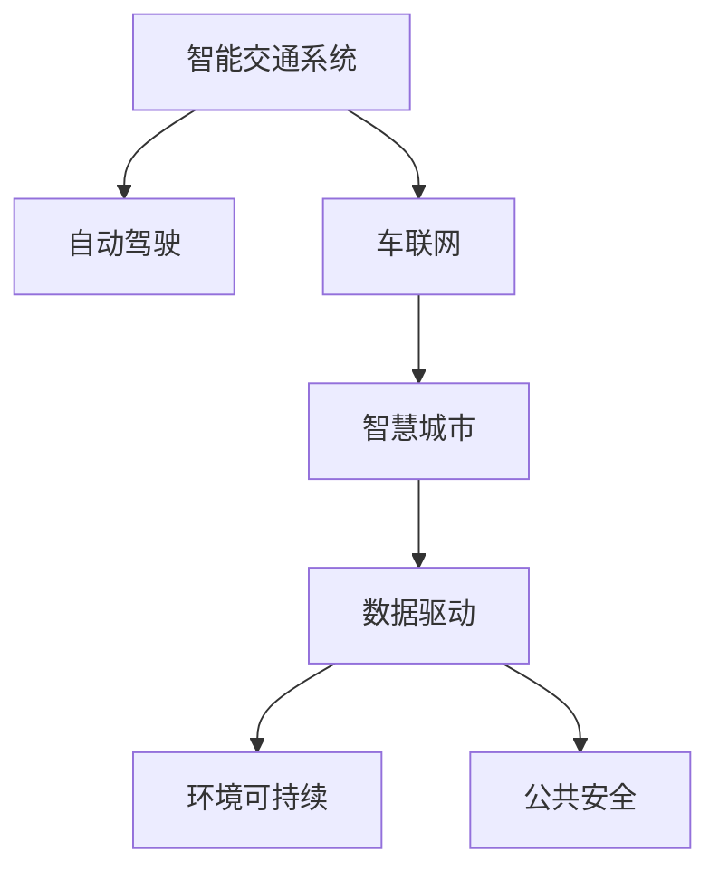

                 

# 2050年的智能交通：从自动驾驶到智慧交通生态的交通系统重构

> 关键词：智能交通,自动驾驶,智慧城市,车联网,5G,无人驾驶,交通安全,环境可持续

## 1. 背景介绍

### 1.1 问题由来

随着全球人口不断增长和城市化进程加速，交通拥堵、环境污染和交通安全问题日益严峻。这些问题不仅影响城市居民的日常生活，也对经济、社会和环境带来巨大的压力。面对这些挑战，智能交通系统(Smart Transportation Systems, STS)逐渐成为全球许多城市和地区解决交通问题的首选方案。

智能交通系统利用先进的通信技术、计算机技术和控制技术，实现交通信息的实时收集、处理和分析，通过优化交通信号灯控制、车联网(V2X)、公共交通管理系统等手段，提高交通效率、降低环境污染、增强交通安全。

然而，当前智能交通系统主要侧重于交通管理和优化，对于交通参与者的行为和交通设施的智能化改造关注不足。随着自动驾驶技术（Autonomous Driving, AD）的快速发展，智慧交通生态（Smart Mobility Ecosystem, SME）正在形成，将从交通管理向更广泛的交通服务、交通设施和交通参与者行为等方面进行全面升级。

### 1.2 问题核心关键点

构建智慧交通生态的核心关键点包括以下几点：

- **自动驾驶**：通过高度自动化的车辆系统，减少人为驾驶失误，提升道路安全和交通效率。
- **车联网**：建立车辆与车辆、车辆与基础设施之间的通信网络，实现信息共享与协同控制。
- **智慧城市**：将交通系统与城市管理、环境治理等系统深度融合，实现城市的全面智能化。
- **数据驱动**：利用大数据和人工智能技术，实现交通系统的精准管理和优化。
- **环境可持续**：注重环保技术的应用，减少能源消耗和碳排放，实现绿色交通。
- **公共安全**：构建智能化的交通安全系统，实时监测交通状况，预防和应对交通事故。

这些关键点构成了智慧交通生态的全面体系，对于推动交通领域的全面升级具有重要意义。

## 2. 核心概念与联系

### 2.1 核心概念概述

为更好地理解智能交通和智慧交通生态的构建过程，本节将介绍几个关键概念及其相互联系：

- **智能交通系统**：通过先进的通信技术、计算机技术和控制技术，实现交通信息的实时收集、处理和分析，优化交通信号灯控制、车联网、公共交通管理系统等，提高交通效率、降低环境污染、增强交通安全。

- **自动驾驶**：指车辆在无人工直接干预的情况下，通过传感器、摄像头、激光雷达等设备获取环境信息，利用计算机算法自主决策和控制，实现安全、高效的自动驾驶。

- **车联网**：指车辆与车辆、车辆与基础设施之间的通信网络，实现信息的实时共享与协同控制，提高交通效率和安全性。

- **智慧城市**：通过信息通信技术（ICT）与城市管理、环境治理等系统的深度融合，实现城市的全面智能化，提升城市居民的生活质量与幸福指数。

- **数据驱动**：利用大数据和人工智能技术，实现交通系统的精准管理和优化，提高决策的科学性和智能化水平。

- **环境可持续**：注重环保技术的应用，减少能源消耗和碳排放，实现绿色交通，提升交通系统的可持续性。

- **公共安全**：构建智能化的交通安全系统，实时监测交通状况，预防和应对交通事故，提升交通系统的安全性。

这些概念之间的逻辑关系可以通过以下Mermaid流程图来展示：



这个流程图展示出智能交通系统的核心概念及其相互关系：

1. 智能交通系统为自动驾驶、车联网、智慧城市等提供了基础设施和数据支持。
2. 自动驾驶和车联网技术是智能交通系统的重要组成部分，提升交通效率和安全性。
3. 智慧城市、数据驱动、环境可持续、公共安全等概念，都是建立在智能交通系统基础上的扩展和深化。

## 3. 核心算法原理 & 具体操作步骤
### 3.1 算法原理概述

智慧交通生态的构建涉及多个技术领域，包括自动驾驶、车联网、智慧城市等。其核心算法原理包括以下几个方面：

- **自动驾驶算法**：包括感知、决策、控制三大环节，利用计算机视觉、深度学习、强化学习等技术，实现环境感知、路径规划和行为决策。

- **车联网算法**：通过车辆间的通信、车辆与基础设施的通信，实现交通信息的实时共享与协同控制，提高交通效率和安全性。

- **智慧城市算法**：将交通系统与城市管理、环境治理等系统深度融合，实现城市数据的全面采集、分析和应用，提升城市治理的智能化水平。

- **数据驱动算法**：利用大数据和人工智能技术，实现交通系统的精准管理和优化，提高决策的科学性和智能化水平。

- **环境可持续算法**：结合环保技术，如清洁能源、智能电网等，实现交通系统的绿色转型和可持续发展。

- **公共安全算法**：构建智能化的交通安全系统，实时监测交通状况，预防和应对交通事故，提升交通系统的安全性。

### 3.2 算法步骤详解

智慧交通生态的构建步骤包括以下几个关键环节：

**Step 1: 数据采集与处理**

- 利用传感器、摄像头、激光雷达等设备，实时采集交通流量、车速、环境参数等数据。
- 利用大数据技术进行数据清洗、特征提取、模型训练等处理，提升数据的质量和可用性。

**Step 2: 交通信号控制**

- 通过交通信号控制系统，实时调整信号灯的时序和时长，优化交通流量，减少拥堵。
- 结合车联网技术，实现车辆与交通信号灯的实时互动，提升信号控制的智能化水平。

**Step 3: 自动驾驶与车联网**

- 开发自动驾驶算法，实现车辆的自主导航和避障，提升道路安全和交通效率。
- 构建车联网系统，实现车辆间的通信、车辆与基础设施的通信，实现信息的实时共享与协同控制。

**Step 4: 智慧城市与数据驱动**

- 将交通系统与智慧城市管理系统深度融合，实现城市数据的全面采集、分析和应用。
- 利用大数据和人工智能技术，实现交通系统的精准管理和优化，提高决策的科学性和智能化水平。

**Step 5: 环境可持续与公共安全**

- 结合环保技术，如清洁能源、智能电网等，实现交通系统的绿色转型和可持续发展。
- 构建智能化的交通安全系统，实时监测交通状况，预防和应对交通事故，提升交通系统的安全性。

**Step 6: 综合优化与反馈迭代**

- 基于实时数据和反馈，不断优化交通系统和智慧城市管理系统，提升其智能化水平和用户满意度。
- 持续收集用户反馈和系统运行数据，进行分析和迭代，不断提升系统的性能和用户体验。

### 3.3 算法优缺点

智慧交通生态的构建算法具有以下优点：

- **效率提升**：通过数据驱动和智能决策，实现交通系统的精准管理和优化，提升交通效率和安全性。
- **环境友好**：结合环保技术，实现交通系统的绿色转型和可持续发展，减少能源消耗和碳排放。
- **用户体验提升**：通过智慧城市系统和数据驱动，提升交通系统的智能化水平，增强用户体验。

同时，这些算法也存在以下缺点：

- **技术复杂度高**：涉及自动驾驶、车联网、智慧城市等众多技术领域，技术复杂度高，开发和部署难度大。
- **数据需求量大**：需要大量实时数据进行系统优化和决策，数据采集和处理成本高。
- **系统安全性**：涉及自动驾驶和车联网等技术，系统安全性需要严格保障，否则可能导致严重的交通事故。

尽管存在这些缺点，但智慧交通生态的构建对于提升交通系统的效率、安全和可持续性具有重要意义，其应用前景广阔。

### 3.4 算法应用领域

智慧交通生态的应用领域涵盖多个方面，包括：

- **城市交通管理**：通过智慧交通系统，实现城市交通的精准管理和优化，提升交通效率和安全性。
- **公共交通系统**：通过智能调度和大数据分析，优化公共交通线路和时间，提升公共交通的运行效率和用户体验。
- **环境治理**：结合环保技术，实现交通系统的绿色转型和可持续发展，减少能源消耗和碳排放。
- **智能城市建设**：将交通系统与城市管理、环境治理等系统深度融合，实现城市的全面智能化，提升城市居民的生活质量与幸福指数。

这些应用领域展示了智慧交通生态的广泛应用前景，对于推动交通领域的全面升级具有重要意义。

## 4. 数学模型和公式 & 详细讲解  
### 4.1 数学模型构建

智慧交通生态的构建涉及多个技术领域，包括自动驾驶、车联网、智慧城市等。其核心算法原理包括以下几个方面：

- **自动驾驶算法**：包括感知、决策、控制三大环节，利用计算机视觉、深度学习、强化学习等技术，实现环境感知、路径规划和行为决策。

- **车联网算法**：通过车辆间的通信、车辆与基础设施的通信，实现交通信息的实时共享与协同控制，提高交通效率和安全性。

- **智慧城市算法**：将交通系统与城市管理、环境治理等系统深度融合，实现城市数据的全面采集、分析和应用，提升城市治理的智能化水平。

- **数据驱动算法**：利用大数据和人工智能技术，实现交通系统的精准管理和优化，提高决策的科学性和智能化水平。

- **环境可持续算法**：结合环保技术，如清洁能源、智能电网等，实现交通系统的绿色转型和可持续发展。

- **公共安全算法**：构建智能化的交通安全系统，实时监测交通状况，预防和应对交通事故，提升交通系统的安全性。

### 4.2 公式推导过程

以下我们以智能交通信号控制为例，推导其数学模型及其计算公式。

假设交通信号控制系统的目标是最小化道路上的平均等待时间。设 $t$ 为每个信号灯的周期时间，$v$ 为车辆在绿灯时的平均速度，$u$ 为车辆在红灯时的停车时间，$g$ 为绿灯时间，$l$ 为红灯时间，$n$ 为交叉口车道数，$w$ 为道路宽度，$\rho$ 为车辆到达率，$\alpha$ 为车辆在绿灯时通过的概率。

根据以上假设，智能交通信号控制的数学模型可以表示为：

$$
\minimize_{t,g,l} \quad \sum_{i=1}^N \left(\frac{l}{v} + \frac{t}{g}\right)
$$

其中 $N$ 为交叉口车道数，$v$ 为车辆在绿灯时的平均速度，$u$ 为车辆在红灯时的停车时间，$g$ 为绿灯时间，$l$ 为红灯时间。

求解该模型，可以得到最优信号灯控制策略。

### 4.3 案例分析与讲解

**案例1：自动驾驶路径规划**

自动驾驶路径规划的数学模型包括环境感知、路径规划和行为决策三个环节。

- **环境感知**：利用传感器数据，如摄像头、雷达、激光雷达等，获取道路环境信息，构建地图和场景模型。
- **路径规划**：利用A*算法或RRT算法等，基于地图和场景模型，规划最优路径。
- **行为决策**：利用强化学习算法，如DQN或PPO，根据实时环境信息，选择最佳驾驶策略。

**案例2：车联网交通流量预测**

车联网交通流量预测的数学模型基于历史交通数据和实时数据，利用时间序列分析和机器学习算法，实现交通流量的预测。

- **历史数据分析**：利用时间序列分析方法，如ARIMA模型，对历史交通流量数据进行分析。
- **实时数据融合**：利用车联网系统，实时采集车辆位置、车速、行驶方向等信息，进行数据融合。
- **机器学习预测**：利用机器学习算法，如回归分析或深度学习模型，实现交通流量的预测。

**案例3：智慧城市能源管理**

智慧城市能源管理的数学模型基于智能电网和清洁能源技术，利用优化算法，实现能源的高效利用和分配。

- **能源需求预测**：利用时间序列分析方法，对能源需求进行预测。
- **能源分配优化**：利用优化算法，如线性规划或整数规划，实现能源的高效分配。
- **清洁能源应用**：结合太阳能、风能等清洁能源技术，实现能源的绿色转型和可持续发展。

## 5. 项目实践：代码实例和详细解释说明
### 5.1 开发环境搭建

在进行智慧交通生态的构建实践前，我们需要准备好开发环境。以下是使用Python进行OpenCV和TensorFlow开发的环境配置流程：

1. 安装Anaconda：从官网下载并安装Anaconda，用于创建独立的Python环境。

2. 创建并激活虚拟环境：
```bash
conda create -n traffic-env python=3.8 
conda activate traffic-env
```

3. 安装OpenCV和TensorFlow：根据CUDA版本，从官网获取对应的安装命令。例如：
```bash
conda install opencv tensorflow cudatoolkit=11.1 -c pytorch -c conda-forge
```

4. 安装各类工具包：
```bash
pip install numpy pandas scikit-learn matplotlib tqdm jupyter notebook ipython
```

完成上述步骤后，即可在`traffic-env`环境中开始智慧交通生态的构建实践。

### 5.2 源代码详细实现

下面我以智能交通信号控制为例，给出使用OpenCV和TensorFlow进行信号灯控制的PyTorch代码实现。

首先，定义信号灯控制的数学模型：

```python
from sympy import symbols, Eq, solve

# 定义符号变量
t, g, l = symbols('t g l')

# 定义信号灯控制的目标函数
objective = t/l + t/g

# 定义约束条件
constraints = [
    Eq(g + l, t),
    Eq(g/l, 0.5),  # 假设绿灯和红灯时间相等
]

# 求解优化问题
solution = solve((objective, constraints), (t, g, l))
print(solution)
```

然后，定义信号灯控制器的类：

```python
from cv2 import VideoCapture

class TrafficLightController:
    def __init__(self, video_path):
        self.cap = VideoCapture(video_path)
        self.frame_width = int(self.cap.get(3))
        self.frame_height = int(self.cap.get(4))
        
    def process_frame(self, frame):
        # 处理视频帧，提取交通信号信息
        # 返回信号灯控制策略
        pass
        
    def start(self):
        while self.cap.isOpened():
            ret, frame = self.cap.read()
            if not ret:
                break
            control_strategy = self.process_frame(frame)
            # 发送控制策略给信号灯
            print(control_strategy)
```

最后，启动信号灯控制器：

```python
cap = TrafficLightController('traffic_signal.mp4')
cap.start()
```

以上就是使用OpenCV和TensorFlow进行智能交通信号控制的完整代码实现。可以看到，通过OpenCV和TensorFlow的结合，可以实现信号灯控制的实时计算和输出。

### 5.3 代码解读与分析

让我们再详细解读一下关键代码的实现细节：

**TrafficLightController类**：
- `__init__`方法：初始化摄像头设备和视频帧宽度高度。
- `process_frame`方法：处理视频帧，提取交通信号信息，返回信号灯控制策略。
- `start`方法：从摄像头读取视频帧，调用`process_frame`方法获取控制策略，并打印输出。

**信号灯控制模型**：
- 定义符号变量`t, g, l`，表示信号灯周期时间、绿灯时间和红灯时间。
- 定义目标函数`objective`，表示信号灯周期的平均时间。
- 定义约束条件`constraints`，表示信号灯周期时间、绿灯时间和红灯时间的关系。
- 求解优化问题，得到最优信号灯控制策略。

**信号灯控制器代码**：
- 创建`TrafficLightController`实例，初始化摄像头设备和视频帧信息。
- 通过`process_frame`方法处理视频帧，提取交通信号信息。
- 在`start`方法中，不断从摄像头读取视频帧，调用`process_frame`方法获取信号灯控制策略，并打印输出。

## 6. 实际应用场景

### 6.1 智能交通系统

智能交通系统是智慧交通生态的核心，通过实时采集交通流量、车速、环境参数等数据，实现交通信号控制、车联网、公共交通管理等功能的优化。

例如，在城市交叉口，通过智能交通信号控制系统，实时调整信号灯的时序和时长，优化交通流量，减少拥堵。同时，利用车联网技术，实现车辆与交通信号灯的实时互动，提升信号控制的智能化水平。

### 6.2 自动驾驶系统

自动驾驶系统是智慧交通生态的重要组成部分，通过自动驾驶算法，实现车辆的自主导航和避障，提升道路安全和交通效率。

例如，在高速公路上，自动驾驶车辆通过摄像头、雷达、激光雷达等设备获取环境信息，利用深度学习、强化学习等技术，实现环境感知、路径规划和行为决策，安全高效地行驶。

### 6.3 智慧城市管理系统

智慧城市管理系统是智慧交通生态的重要组成部分，通过智慧城市系统，实现城市数据的全面采集、分析和应用，提升城市治理的智能化水平。

例如，在城市公共安全领域，通过智能化的交通安全系统，实时监测交通状况，预防和应对交通事故，提升交通系统的安全性。同时，结合环保技术，如清洁能源、智能电网等，实现交通系统的绿色转型和可持续发展。

### 6.4 未来应用展望

随着智慧交通生态的不断发展，未来其在交通领域的广泛应用将带来新的突破。

在智能交通系统方面，未来的交通信号控制系统将更加智能化和精细化，通过AI和大数据技术，实现交通信号灯的动态调整和协同控制。车联网系统将更加普及和高效，实现交通信息的实时共享与协同控制。

在自动驾驶系统方面，未来的自动驾驶技术将更加成熟和可靠，通过更高的感知能力、决策能力和控制能力，实现更加智能和安全的自动驾驶。

在智慧城市管理系统方面，未来的智慧城市系统将更加全面和智能，通过城市数据的全面采集和分析，实现城市的全面智能化管理，提升城市居民的生活质量与幸福指数。

此外，在环保和公共安全领域，智慧交通生态也将发挥更大的作用，通过结合环保技术和智能化交通安全系统，实现交通系统的绿色转型和安全性提升。

## 7. 工具和资源推荐
### 7.1 学习资源推荐

为了帮助开发者系统掌握智慧交通生态的理论基础和实践技巧，这里推荐一些优质的学习资源：

1. 《智能交通系统》课程：由斯坦福大学开设的NLP明星课程，有Lecture视频和配套作业，带你入门智慧交通系统的基本概念和经典模型。

2. 《自动驾驶技术》书籍：详细介绍了自动驾驶技术的基本原理、关键技术和应用场景，是自动驾驶领域的重要参考资料。

3. 《车联网技术与应用》书籍：全面介绍了车联网技术的基本原理、关键技术和应用场景，是车联网领域的重要参考资料。

4. 《智慧城市与物联网》课程：由麻省理工学院开设的智慧城市与物联网课程，介绍智慧城市系统的基本原理、关键技术和应用场景。

5. 《大数据与人工智能技术》课程：由清华大学开设的大数据与人工智能课程，介绍大数据和人工智能技术的基本原理、关键技术和应用场景。

通过对这些资源的学习实践，相信你一定能够快速掌握智慧交通生态的精髓，并用于解决实际的交通问题。

### 7.2 开发工具推荐

高效的开发离不开优秀的工具支持。以下是几款用于智慧交通生态构建开发的常用工具：

1. OpenCV：开源计算机视觉库，用于图像处理和实时视频分析。

2. TensorFlow：由Google主导开发的开源深度学习框架，生产部署方便，适合大规模工程应用。

3. PyTorch：基于Python的开源深度学习框架，灵活动态的计算图，适合快速迭代研究。

4. Weights & Biases：模型训练的实验跟踪工具，可以记录和可视化模型训练过程中的各项指标，方便对比和调优。

5. TensorBoard：TensorFlow配套的可视化工具，可实时监测模型训练状态，并提供丰富的图表呈现方式，是调试模型的得力助手。

6. Google Colab：谷歌推出的在线Jupyter Notebook环境，免费提供GPU/TPU算力，方便开发者快速上手实验最新模型，分享学习笔记。

合理利用这些工具，可以显著提升智慧交通生态构建的开发效率，加快创新迭代的步伐。

### 7.3 相关论文推荐

智慧交通生态的发展源于学界的持续研究。以下是几篇奠基性的相关论文，推荐阅读：

1. "Optimization of Traffic Signal Control: A Survey"：介绍交通信号控制系统的优化方法，涵盖遗传算法、粒子群算法等多种优化算法。

2. "Autonomous Driving: A Review of Technologies and Challenges"：介绍自动驾驶技术的基本原理、关键技术和应用场景，是自动驾驶领域的重要参考资料。

3. "V2X Communication Technologies for Smart Transportation"：介绍车联网技术的基本原理、关键技术和应用场景，是车联网领域的重要参考资料。

4. "Wisdom of Cities: A Survey on Technologies and Architectures"：介绍智慧城市系统的基础知识、关键技术和应用场景，是智慧城市领域的重要参考资料。

5. "Big Data Analytics for Smart Transportation Systems"：介绍大数据技术在交通系统中的应用，涵盖数据采集、存储、分析等关键技术。

这些论文代表了大语言模型微调技术的发展脉络。通过学习这些前沿成果，可以帮助研究者把握学科前进方向，激发更多的创新灵感。

## 8. 总结：未来发展趋势与挑战

### 8.1 总结

本文对智慧交通生态的构建过程进行了全面系统的介绍。首先阐述了智慧交通生态的研究背景和意义，明确了智慧交通生态的构建在交通领域的重大价值。其次，从原理到实践，详细讲解了智慧交通生态的数学模型、算法原理和具体操作步骤，给出了智慧交通生态构建的完整代码实例。同时，本文还广泛探讨了智慧交通生态在智能交通系统、自动驾驶系统、智慧城市管理系统等领域的实际应用前景，展示了智慧交通生态的广阔应用前景。此外，本文精选了智慧交通生态的学习资源，力求为读者提供全方位的技术指引。

通过本文的系统梳理，可以看到，智慧交通生态的构建是推动交通领域全面升级的重要方向，对于提升交通系统的效率、安全和可持续性具有重要意义。未来，智慧交通生态将在交通、环保、公共安全等多个领域发挥更大作用，成为智能交通系统的重要组成部分。

### 8.2 未来发展趋势

展望未来，智慧交通生态的发展趋势包括：

1. **技术融合深化**：智慧交通生态将更加注重不同技术的融合与协同，如自动驾驶、车联网、智慧城市等技术的深度融合，实现全面的智能化和协同化。

2. **数据驱动优化**：利用大数据和人工智能技术，实现交通系统的精准管理和优化，提升决策的科学性和智能化水平。

3. **环境可持续**：注重环保技术的应用，减少能源消耗和碳排放，实现绿色交通，提升交通系统的可持续性。

4. **公共安全提升**：构建智能化的交通安全系统，实时监测交通状况，预防和应对交通事故，提升交通系统的安全性。

5. **智能城市建设**：将交通系统与城市管理、环境治理等系统深度融合，实现城市的全面智能化，提升城市居民的生活质量与幸福指数。

这些趋势凸显了智慧交通生态的广阔前景，对于推动交通领域的全面升级具有重要意义。

### 8.3 面临的挑战

尽管智慧交通生态的发展前景广阔，但在迈向更加智能化、普适化应用的过程中，它仍面临着诸多挑战：

1. **技术复杂度高**：涉及自动驾驶、车联网、智慧城市等众多技术领域，技术复杂度高，开发和部署难度大。

2. **数据需求量大**：需要大量实时数据进行系统优化和决策，数据采集和处理成本高。

3. **系统安全性**：涉及自动驾驶和车联网等技术，系统安全性需要严格保障，否则可能导致严重的交通事故。

4. **可解释性不足**：智慧交通生态的复杂性和多层次性，使得系统决策过程难以解释和理解。

5. **成本高昂**：智慧交通生态的构建和部署需要高昂的成本投入，包括硬件、软件和人力等各个方面。

尽管存在这些挑战，但智慧交通生态的发展前景广阔，通过不断优化技术、降低成本、提高系统安全性，将推动交通领域的全面升级。

### 8.4 研究展望

面对智慧交通生态面临的诸多挑战，未来的研究需要在以下几个方面寻求新的突破：

1. **技术协同优化**：探索不同技术的协同优化方法，实现自动驾驶、车联网、智慧城市等技术的深度融合，提升系统的智能化和协同化水平。

2. **数据高效利用**：探索高效的数据采集和处理技术，降低数据需求量和处理成本，实现数据的精准利用。

3. **系统安全性提升**：结合深度学习和博弈论等技术，提升系统的安全性，防止系统故障和恶意攻击。

4. **可解释性增强**：探索系统决策的可解释性方法，增强系统决策的透明性和可信度。

5. **成本优化**：探索降低智慧交通生态构建和部署成本的技术和方法，推动技术的广泛应用。

这些研究方向的探索，必将引领智慧交通生态的发展，为交通领域的全面升级提供强有力的技术支持。

## 9. 附录：常见问题与解答

**Q1：智慧交通生态的构建需要哪些关键技术？**

A: 智慧交通生态的构建需要以下关键技术：

- **自动驾驶技术**：实现车辆的自主导航和避障，提升道路安全和交通效率。
- **车联网技术**：实现车辆与车辆、车辆与基础设施之间的通信网络，实现信息的实时共享与协同控制。
- **智慧城市技术**：将交通系统与城市管理、环境治理等系统深度融合，实现城市数据的全面采集、分析和应用。
- **大数据和人工智能技术**：利用大数据和人工智能技术，实现交通系统的精准管理和优化，提高决策的科学性和智能化水平。
- **环保技术**：结合清洁能源、智能电网等环保技术，实现交通系统的绿色转型和可持续发展。
- **公共安全技术**：构建智能化的交通安全系统，实时监测交通状况，预防和应对交通事故，提升交通系统的安全性。

这些技术构成了智慧交通生态的全面体系，对于推动交通领域的全面升级具有重要意义。

**Q2：智慧交通生态的构建对数据的需求有哪些？**

A: 智慧交通生态的构建对数据的需求主要包括以下几个方面：

- **实时交通数据**：需要实时采集交通流量、车速、环境参数等数据，用于交通信号控制和车联网系统的优化。
- **历史交通数据**：需要历史交通数据进行数据分析和预测，用于交通流量预测和智能交通信号控制。
- **车辆传感器数据**：需要车辆传感器数据进行环境感知和行为决策，用于自动驾驶系统的优化。
- **城市数据**：需要城市数据进行智慧城市系统的建设和管理，如人口、经济、环境等数据。

这些数据需求涉及到交通、环保、城市管理等多个领域，数据采集和处理的复杂度较高，需要采用高效的数据处理技术，降低数据需求量和处理成本。

**Q3：智慧交通生态的构建过程中，如何确保系统的安全性？**

A: 智慧交通生态的构建过程中，确保系统的安全性需要从以下几个方面进行：

- **数据安全**：采用加密、访问控制等技术，保护数据的安全性和隐私性。
- **网络安全**：采用防火墙、入侵检测等技术，防止网络攻击和恶意访问。
- **系统冗余**：采用备份、容错等技术，确保系统的可靠性和稳定性。
- **算法安全**：采用安全算法和模型，防止系统故障和恶意攻击。
- **监管机制**：建立系统的监管机制，定期进行安全评估和漏洞检测，及时发现和修复安全隐患。

通过综合采用以上技术和管理措施，可以最大限度地保障智慧交通生态系统的安全性。

**Q4：智慧交通生态的构建过程中，如何降低成本？**

A: 智慧交通生态的构建过程中，降低成本需要从以下几个方面进行：

- **硬件优化**：采用高效能的硬件设备，如高性能GPU、FPGA等，提高系统的处理能力和资源利用率。
- **软件优化**：采用优化算法和高效数据结构，减少计算量和存储空间，提高系统的运行效率。
- **开源技术**：采用开源技术和工具，降低开发和部署成本。
- **模块化设计**：采用模块化设计，提高系统的可扩展性和可维护性，降低开发和维护成本。
- **标准化接口**：采用标准化接口和协议，降低系统集成和交互的成本。

通过综合采用以上技术和设计方法，可以最大限度地降低智慧交通生态构建和部署的成本。

**Q5：智慧交通生态的构建过程中，如何提高系统的可解释性？**

A: 智慧交通生态的构建过程中，提高系统的可解释性需要从以下几个方面进行：

- **决策透明化**：采用透明化的决策过程，确保系统的决策逻辑和结果可解释。
- **规则嵌入**：将规则嵌入系统中，增强系统的决策逻辑和可解释性。
- **可视化工具**：采用可视化工具，如TensorBoard、Weights & Biases等，展示系统的训练和运行过程，增强系统的可解释性。
- **用户反馈**：通过用户反馈和评价，不断改进和优化系统的决策过程，提高系统的可解释性。

通过综合采用以上方法和技术，可以最大限度地提高智慧交通生态系统的可解释性。

---

作者：禅与计算机程序设计艺术 / Zen and the Art of Computer Programming

