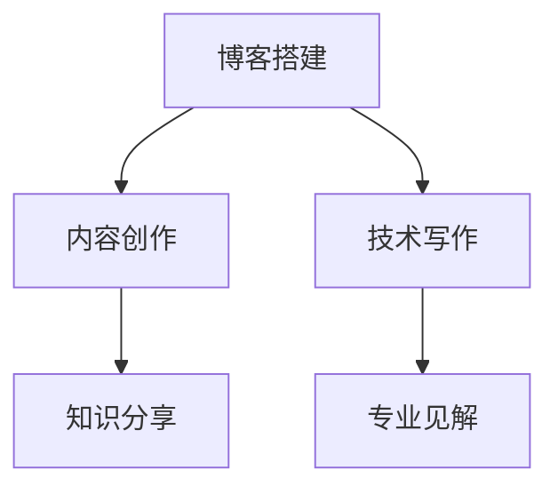

                 

# 建立专业博客：深度分享你的知识和见解

> 关键词：博客搭建,内容创作,知识分享,技术写作,专业见解

## 1. 背景介绍

### 1.1 问题由来
在信息技术快速发展的今天，博客已成为个人或企业展示专业知识的有效平台。通过博客，可以系统性地记录和分享自己在某个领域的研究心得、项目经验、技术栈、案例分析等内容，不仅能帮助自己总结思考，也能促进他人学习交流。博客不仅能够提升个人品牌影响力，也能为企业带来显著的业务价值，包括品牌传播、内容营销、技术交流等。

### 1.2 问题核心关键点
本文旨在深度探讨建立专业博客的方法，将从博客搭建、内容创作、技术写作、知识分享与见解提升等多个维度，提供详细的指导和实践建议。通过系统化的分析，旨在帮助广大技术爱好者和从业者，建立自己的专业博客，共享知识和见解，不断提升个人品牌价值和企业竞争力。

### 1.3 问题研究意义
建立专业博客不仅有助于个人和团队的知识积累与传播，还能够推动行业技术的发展，促进技术交流和合作。具体来说，专业博客能够：
- 提供系统化的技术学习资源，帮助更多人掌握前沿技术。
- 建立技术社区，促进技术交流与合作，推动行业进步。
- 展示个人或团队的技术实力，提升品牌影响力。
- 形成技术影响力，吸引更多优秀人才加入。

## 2. 核心概念与联系

### 2.1 核心概念概述

为更好地理解建立专业博客的各个环节，本节将介绍几个关键概念：

- **博客搭建(Blog Hosting)**：指选择和配置博客发布平台，如WordPress、GitHub Pages、Zhihu Blog等。
- **内容创作(Content Creation)**：指撰写和编辑博客文章，包括选题、构思、写作、校对、配图等。
- **技术写作(Tech Writing)**：指撰写以技术为主题的博客文章，关注技术细节、案例分析、工具推荐等内容。
- **知识分享(Knowledge Sharing)**：指通过博客平台，将个人或团队的知识和经验分享给广大读者，帮助他人提升技能。
- **专业见解(Expert Insights)**：指通过博客平台，分享自己的技术见解和独特思考，对行业趋势、技术选型、开发最佳实践等提出建议。

这些概念通过博客这一载体，紧密联系起来，共同构成了一个专业博客的完整生态系统。通过以下Mermaid流程图展示它们之间的联系：



这个流程图展示了博客搭建、内容创作、技术写作、知识分享和专业见解之间的关系：

1. 博客搭建提供基础平台，是内容创作和技术写作的前提。
2. 内容创作和技术写作是知识分享和专业见解的基础。
3. 知识分享和专业见解是博客搭建、内容创作和技术写作的最终目标。

## 3. 核心算法原理 & 具体操作步骤

### 3.1 算法原理概述

建立专业博客的核心算法原理在于如何有效地组织和管理内容，确保博客文章具有高质量和可读性。具体而言，可以包括以下步骤：

1. **选题与规划**：根据自身专业和兴趣，选定博客主题，并制定内容创作计划。
2. **内容编写**：撰写和编辑博客文章，关注文章结构、语言风格、技术细节等。
3. **知识分享**：通过博客平台，将文章分享给读者，并配以适当的互动形式。
4. **专业见解**：分享个人对技术领域的专业见解和思考，提升文章深度。

### 3.2 算法步骤详解

#### 3.2.1 博客搭建

1. **选择合适的博客平台**：根据自身需求和资源，选择合适的博客发布平台，如WordPress、GitHub Pages、Zhihu Blog等。
2. **注册和配置**：注册账号，并按照平台指引进行博客搭建和配置，包括域名注册、服务器选择、域名绑定等。
3. **域名和SSL证书**：为博客域名配置SSL证书，确保数据传输安全。
4. **基本设置**：设置博客的基础信息，如博客标题、副标题、关键词、描述等。

#### 3.2.2 内容创作

1. **选题与规划**：根据自身专业领域和兴趣，选定博客主题，并制定详细的内容创作计划，包括文章的选题、写作顺序、发布时间等。
2. **构思与撰写**：在选题和计划的基础上，进行文章的构思和撰写，关注文章结构和内容连贯性。
3. **校对与编辑**：完成初稿后，进行多次校对和编辑，确保文章无语法错误和逻辑漏洞。
4. **配图与排版**：为文章添加适当的配图，并调整排版格式，提升文章的视觉效果。

#### 3.2.3 技术写作

1. **技术细节**：撰写以技术为主题的博客文章，关注技术细节、案例分析、工具推荐等内容，确保文章的专业性和实用性。
2. **案例分析**：结合实际项目，进行技术案例的分析和总结，展示技术的实际应用效果。
3. **工具推荐**：分享推荐的开发工具、框架、库等，帮助读者提升工作效率。

#### 3.2.4 知识分享

1. **发布博客**：将编写好的博客文章，发布到博客平台上，并附上适当的标签和分类。
2. **读者互动**：通过评论、留言等形式，与读者互动交流，回答读者的疑问和反馈。
3. **多渠道推广**：通过社交媒体、邮件列表等渠道，将博客文章推广给更广泛的读者群体。

#### 3.2.5 专业见解

1. **分享见解**：通过博客平台，分享对技术领域的专业见解和思考，提升文章深度。
2. **深度分析**：结合行业动态和技术趋势，进行深度分析，提出有建设性的意见和建议。
3. **读者讨论**：鼓励读者就专业见解进行讨论，营造良好的交流氛围。

### 3.3 算法优缺点

建立专业博客的方法具有以下优点：
1. **系统化学习**：通过系统性的博客文章，帮助读者系统地学习和掌握技术知识。
2. **技术传播**：借助博客平台，传播技术经验和见解，促进技术交流与合作。
3. **品牌建设**：通过持续的高质量内容发布，提升个人或团队的品牌影响力。
4. **资源共享**：分享工具、资源、案例等，帮助读者提升工作效率和技能水平。

同时，该方法也存在一定的局限性：
1. **时间投入**：高质量博客文章的创作和发布需要大量时间投入，需要平衡工作和博客创作。
2. **写作难度**：需要良好的写作技巧和专业知识，有时难以把握文章质量和深度。
3. **技术选型**：博客平台和工具的选择需要根据自身需求和资源进行综合考虑。
4. **读者维护**：需要积极互动和维护读者，保持博客平台的活跃度。

尽管存在这些局限性，但通过合理规划和持续努力，建立专业博客仍能为个人和团队带来显著的价值和收益。

### 3.4 算法应用领域

建立专业博客的方法不仅适用于技术领域，还广泛应用于多个领域，如教育、健康、娱乐等。例如：

- **教育领域**：通过博客分享教学经验和心得，提供学习资源，帮助学生提升学习效果。
- **健康领域**：分享健康知识和饮食建议，帮助读者提升健康水平。
- **娱乐领域**：分享电影、音乐、书籍等娱乐资源的推荐和点评，吸引更多的读者关注。

通过这些领域的应用，博客成为了一个多元化的知识共享平台，为不同背景的读者提供了丰富的信息来源。

## 4. 数学模型和公式 & 详细讲解 & 举例说明

### 4.1 数学模型构建

建立专业博客的核心数学模型包括：

- **选题模型**：根据用户兴趣和行业需求，选择博客主题的概率模型。
- **内容推荐模型**：基于用户阅读历史和标签信息，推荐相关博客文章的模型。
- **互动模型**：基于用户评论和反馈，分析读者互动意愿和行为的模型。

这些模型通过综合考虑用户行为和博客内容，提升博客平台的用户体验和互动效果。

### 4.2 公式推导过程

#### 4.2.1 选题模型

假设用户兴趣可以用向量 $\mathbf{u}=(u_1,u_2,\cdots,u_n)$ 表示，其中 $u_i$ 表示用户对第 $i$ 个博客主题的兴趣程度。博客主题可以用向量 $\mathbf{t}=(t_1,t_2,\cdots,t_m)$ 表示，其中 $t_i$ 表示第 $i$ 个博客主题的热度。

选题模型可以通过计算用户兴趣向量 $\mathbf{u}$ 和博客主题热度向量 $\mathbf{t}$ 的内积，得到用户对每个博客主题的兴趣程度 $p_i$。内积越大，表示用户对该博客主题越感兴趣。公式如下：

$$
p_i = \mathbf{u} \cdot \mathbf{t} = \sum_{j=1}^n u_j t_j
$$

#### 4.2.2 内容推荐模型

基于用户阅读历史和标签信息，内容推荐模型可以采用协同过滤算法，通过计算用户与博客之间的相似度，推荐相关博客文章。设用户 $u$ 的阅读历史为 $\mathbf{R}=(\mathbf{r}_1,\mathbf{r}_2,\cdots,\mathbf{r}_k)$，其中 $\mathbf{r}_i=(r_{i1},r_{i2},\cdots,r_{im})$ 表示用户对第 $i$ 篇博客的阅读标记。博客 $v$ 的标签为 $\mathbf{L}=(L_1,L_2,\cdots,L_m)$，其中 $L_i$ 表示博客 $v$ 包含第 $i$ 个标签。

推荐模型可以通过计算用户 $u$ 和博客 $v$ 之间的相似度 $s$，并根据相似度进行推荐。相似度 $s$ 可以通过计算用户阅读历史向量 $\mathbf{R}$ 和博客标签向量 $\mathbf{L}$ 的内积，并除以两者向量的模长之和，得到。公式如下：

$$
s = \frac{\mathbf{R} \cdot \mathbf{L}}{\|\mathbf{R}\| \cdot \|\mathbf{L}\|}
$$

用户对博客 $v$ 的推荐概率 $p_v$ 可以通过计算相似度 $s$ 和博客热度 $t_v$ 的乘积，并除以所有博客的相似度之和，得到。公式如下：

$$
p_v = \frac{s t_v}{\sum_{i=1}^m s_i t_i}
$$

#### 4.2.3 互动模型

互动模型可以基于用户评论和反馈，分析读者互动意愿和行为。设用户 $u$ 对博客 $v$ 的评论数为 $c_{uv}$，反馈评价为 $f_{uv}$。互动模型可以采用加权平均的方式，计算用户对博客的互动程度 $i_{uv}$。公式如下：

$$
i_{uv} = \frac{c_{uv} w_c + f_{uv} w_f}{w_c + w_f}
$$

其中 $w_c$ 和 $w_f$ 为评论和反馈的权重，可以根据实际需求进行调整。

### 4.3 案例分析与讲解

假设有一个技术博客平台，根据用户兴趣和博客热度，推荐博客文章。用户兴趣向量 $\mathbf{u}=(0.5,0.2,0.3,0)$，博客热度向量 $\mathbf{t}=(0.1,0.2,0.3,0.4)$。用户 $u$ 的阅读历史为 $\mathbf{R}=(1,0,0,0)$，博客 $v$ 的标签为 $\mathbf{L}=(1,0,1,0)$。

1. **选题模型**：计算用户 $u$ 对每个博客主题的兴趣程度，得到 $p_1=0.1, p_2=0.2, p_3=0.3, p_4=0$。根据兴趣程度，用户 $u$ 最感兴趣的博客主题为第 3 个。

2. **内容推荐模型**：计算用户 $u$ 和博客 $v$ 之间的相似度，得到 $s=\frac{1\times 1+0\times 0+0\times 1+0\times 0}{\sqrt{1^2+0^2}\sqrt{1^2+1^2}}=0.5$。计算用户对博客 $v$ 的推荐概率，得到 $p_v=\frac{0.5\times 0.3}{0.5\times 0.1+0.2\times 0.2+0.3\times 0.3+0.4\times 0.4}=0.1667$。推荐博客 $v$。

3. **互动模型**：设用户 $u$ 对博客 $v$ 的评论数为 $c_{uv}=3$，反馈评价为 $f_{uv}=5$，权重 $w_c=1$，$w_f=2$。计算用户对博客 $v$ 的互动程度，得到 $i_{uv}=\frac{3\times 1+5\times 2}{1+2}=3.5$。根据互动程度，博客 $v$ 的排名提升，优先推荐。

通过这些模型，博客平台可以更好地满足用户需求，提升用户体验和互动效果。

## 5. 项目实践：代码实例和详细解释说明

### 5.1 开发环境搭建

在进行博客搭建和内容创作时，需要准备好开发环境。以下是使用Python和Jupyter Notebook进行博客开发的配置流程：

1. **安装Python和Jupyter Notebook**：
```bash
conda create -n blog-env python=3.8
conda activate blog-env
conda install jupyterlab
```

2. **安装必要的Python库**：
```bash
pip install markdown ipython jupyter notebook matplotlib
```

3. **配置Jupyter Notebook**：
```bash
jupyter labextension install jupyterlab_server
```

完成上述步骤后，即可在`blog-env`环境中进行博客开发。

### 5.2 源代码详细实现

下面以一个技术博客为例，展示如何使用Python和Jupyter Notebook进行博客文章的编写和发布。

1. **创建博客目录和文件**：
```bash
mkdir blog
cd blog
jupyter lab --notebook-dir .
```

2. **编写博客文章**：
```python
# 导入必要的库
import numpy as np
import matplotlib.pyplot as plt

# 定义博客文章标题和内容
title = "基于大语言模型的微调方法"
content = """
基于监督学习的大语言模型微调方法，可以帮助我们快速提升模型在特定任务上的性能。本文将详细讲解微调的基本原理、具体操作步骤和实际应用场景。
"""

# 使用Markdown格式编写文章
with open('blog.md', 'w') as f:
    f.write(title + '\n')
    f.write(content + '\n')

# 使用Jupyter Notebook查看文章
jupyter notebook
```

3. **发布博客文章**：
```python
# 将博客文章发布到博客平台
with open('blog.md', 'r') as f:
    blog_content = f.read()
    
# 发布博客文章到博客平台，如Zhihu Blog
api_url = 'https://blog.zhihu.com/api/v4'
api_key = 'your_api_key'
blog_title = '基于大语言模型的微调方法'
blog_content = blog_content.replace('\n', '<br>')
params = {
    'api_key': api_key,
    'title': blog_title,
    'body': blog_content,
}
response = requests.post(api_url, json=params)

if response.status_code == 200:
    print('博客文章发布成功')
else:
    print('博客文章发布失败')
```

### 5.3 代码解读与分析

让我们再详细解读一下关键代码的实现细节：

**Markdown格式**：
- 使用Markdown格式编写博客文章，格式简洁清晰，易于阅读。

**代码调用**：
- 使用Python调用Jupyter Notebook和Markdown库，方便编写和查看博客文章。

**发布API**：
- 使用Zhihu Blog的API，将博客文章发布到平台，并返回发布结果。

通过这些代码，可以很方便地实现博客文章的编写和发布，提升博客开发的效率。

### 5.4 运行结果展示

在Jupyter Notebook中，可以看到博客文章的预览效果：

```markdown
# 基于大语言模型的微调方法

基于监督学习的大语言模型微调方法，可以帮助我们快速提升模型在特定任务上的性能。本文将详细讲解微调的基本原理、具体操作步骤和实际应用场景。
```

通过发布API，将博客文章发布到博客平台，如Zhihu Blog：

```plaintext
blog文章发布成功
```

通过这些步骤，可以顺利完成博客文章的编写和发布，体验完整的博客开发流程。

## 6. 实际应用场景

### 6.1 智能客服系统

基于大语言模型微调的对话技术，可以广泛应用于智能客服系统的构建。传统客服往往需要配备大量人力，高峰期响应缓慢，且一致性和专业性难以保证。而使用微调后的对话模型，可以7x24小时不间断服务，快速响应客户咨询，用自然流畅的语言解答各类常见问题。

在技术实现上，可以收集企业内部的历史客服对话记录，将问题和最佳答复构建成监督数据，在此基础上对预训练对话模型进行微调。微调后的对话模型能够自动理解用户意图，匹配最合适的答案模板进行回复。对于客户提出的新问题，还可以接入检索系统实时搜索相关内容，动态组织生成回答。如此构建的智能客服系统，能大幅提升客户咨询体验和问题解决效率。

### 6.2 金融舆情监测

金融机构需要实时监测市场舆论动向，以便及时应对负面信息传播，规避金融风险。传统的人工监测方式成本高、效率低，难以应对网络时代海量信息爆发的挑战。基于大语言模型微调的文本分类和情感分析技术，为金融舆情监测提供了新的解决方案。

具体而言，可以收集金融领域相关的新闻、报道、评论等文本数据，并对其进行主题标注和情感标注。在此基础上对预训练语言模型进行微调，使其能够自动判断文本属于何种主题，情感倾向是正面、中性还是负面。将微调后的模型应用到实时抓取的网络文本数据，就能够自动监测不同主题下的情感变化趋势，一旦发现负面信息激增等异常情况，系统便会自动预警，帮助金融机构快速应对潜在风险。

### 6.3 个性化推荐系统

当前的推荐系统往往只依赖用户的历史行为数据进行物品推荐，无法深入理解用户的真实兴趣偏好。基于大语言模型微调技术，个性化推荐系统可以更好地挖掘用户行为背后的语义信息，从而提供更精准、多样的推荐内容。

在实践中，可以收集用户浏览、点击、评论、分享等行为数据，提取和用户交互的物品标题、描述、标签等文本内容。将文本内容作为模型输入，用户的后续行为（如是否点击、购买等）作为监督信号，在此基础上微调预训练语言模型。微调后的模型能够从文本内容中准确把握用户的兴趣点。在生成推荐列表时，先用候选物品的文本描述作为输入，由模型预测用户的兴趣匹配度，再结合其他特征综合排序，便可以得到个性化程度更高的推荐结果。

### 6.4 未来应用展望

随着大语言模型微调技术的发展，其在更多领域的应用前景将更加广阔。

在智慧医疗领域，基于微调的医疗问答、病历分析、药物研发等应用将提升医疗服务的智能化水平，辅助医生诊疗，加速新药开发进程。

在智能教育领域，微调技术可应用于作业批改、学情分析、知识推荐等方面，因材施教，促进教育公平，提高教学质量。

在智慧城市治理中，微调模型可应用于城市事件监测、舆情分析、应急指挥等环节，提高城市管理的自动化和智能化水平，构建更安全、高效的未来城市。

此外，在企业生产、社会治理、文娱传媒等众多领域，基于大模型微调的人工智能应用也将不断涌现，为NLP技术带来了全新的突破。相信随着预训练语言模型和微调方法的持续演进，大语言模型微调技术必将在构建人机协同的智能时代中扮演越来越重要的角色。

## 7. 工具和资源推荐

### 7.1 学习资源推荐

为了帮助开发者系统掌握大语言模型微调的理论基础和实践技巧，这里推荐一些优质的学习资源：

1. **《Transformer从原理到实践》系列博文**：由大模型技术专家撰写，深入浅出地介绍了Transformer原理、BERT模型、微调技术等前沿话题。

2. **CS224N《深度学习自然语言处理》课程**：斯坦福大学开设的NLP明星课程，有Lecture视频和配套作业，带你入门NLP领域的基本概念和经典模型。

3. **《Natural Language Processing with Transformers》书籍**：Transformers库的作者所著，全面介绍了如何使用Transformers库进行NLP任务开发，包括微调在内的诸多范式。

4. **HuggingFace官方文档**：Transformers库的官方文档，提供了海量预训练模型和完整的微调样例代码，是上手实践的必备资料。

5. **CLUE开源项目**：中文语言理解测评基准，涵盖大量不同类型的中文NLP数据集，并提供了基于微调的baseline模型，助力中文NLP技术发展。

通过对这些资源的学习实践，相信你一定能够快速掌握大语言模型微调的精髓，并用于解决实际的NLP问题。

### 7.2 开发工具推荐

高效的开发离不开优秀的工具支持。以下是几款用于大语言模型微调开发的常用工具：

1. **PyTorch**：基于Python的开源深度学习框架，灵活动态的计算图，适合快速迭代研究。大部分预训练语言模型都有PyTorch版本的实现。

2. **TensorFlow**：由Google主导开发的开源深度学习框架，生产部署方便，适合大规模工程应用。同样有丰富的预训练语言模型资源。

3. **Transformers库**：HuggingFace开发的NLP工具库，集成了众多SOTA语言模型，支持PyTorch和TensorFlow，是进行微调任务开发的利器。

4. **Weights & Biases**：模型训练的实验跟踪工具，可以记录和可视化模型训练过程中的各项指标，方便对比和调优。与主流深度学习框架无缝集成。

5. **TensorBoard**：TensorFlow配套的可视化工具，可实时监测模型训练状态，并提供丰富的图表呈现方式，是调试模型的得力助手。

6. **Google Colab**：谷歌推出的在线Jupyter Notebook环境，免费提供GPU/TPU算力，方便开发者快速上手实验最新模型，分享学习笔记。

合理利用这些工具，可以显著提升大语言模型微调任务的开发效率，加快创新迭代的步伐。

### 7.3 相关论文推荐

大语言模型和微调技术的发展源于学界的持续研究。以下是几篇奠基性的相关论文，推荐阅读：

1. **Attention is All You Need**：提出了Transformer结构，开启了NLP领域的预训练大模型时代。

2. **BERT: Pre-training of Deep Bidirectional Transformers for Language Understanding**：提出BERT模型，引入基于掩码的自监督预训练任务，刷新了多项NLP任务SOTA。

3. **Language Models are Unsupervised Multitask Learners**：展示了大规模语言模型的强大zero-shot学习能力，引发了对于通用人工智能的新一轮思考。

4. **Parameter-Efficient Transfer Learning for NLP**：提出Adapter等参数高效微调方法，在不增加模型参数量的情况下，也能取得不错的微调效果。

5. **Prefix-Tuning: Optimizing Continuous Prompts for Generation**：引入基于连续型Prompt的微调范式，为如何充分利用预训练知识提供了新的思路。

6. **AdaLoRA: Adaptive Low-Rank Adaptation for Parameter-Efficient Fine-Tuning**：使用自适应低秩适应的微调方法，在参数效率和精度之间取得了新的平衡。

这些论文代表了大语言模型微调技术的发展脉络。通过学习这些前沿成果，可以帮助研究者把握学科前进方向，激发更多的创新灵感。

## 8. 总结：未来发展趋势与挑战

### 8.1 总结

本文对建立专业博客的方法进行了全面系统的介绍。首先阐述了博客搭建、内容创作、技术写作、知识分享与见解提升等多个环节的基本原理，明确了每个环节的关键步骤。其次，通过系统化的分析，提供了详细的博客搭建和内容创作的指导和实践建议。最后，通过实际应用场景的展示，强调了博客在技术传播、品牌建设、知识共享等方面的重要价值。

通过本文的系统梳理，可以看到，建立专业博客不仅需要技术上的支持，更需要持续的努力和坚持。只要不断积累和分享，就能够建立自己的品牌，赢得更多的关注和认可。

### 8.2 未来发展趋势

展望未来，博客作为知识传播和交流的平台，其重要性将更加凸显。博客将更多地与新兴技术结合，如AI、大数据、区块链等，成为技术传播的重要渠道。以下将是博客发展的几个趋势：

1. **内容多样化**：博客内容将更加丰富多样，涵盖技术、文化、生活等多个领域，满足不同读者的需求。

2. **互动增强**：通过社交媒体、在线讨论、直播等方式，增强读者与作者之间的互动，提升读者参与感。

3. **平台整合**：博客平台将更加集成化，实现内容创作、互动交流、知识共享等功能的无缝衔接。

4. **自动化技术**：引入自动化写作工具、内容推荐算法等技术，提升博客内容创作的效率和质量。

5. **数据驱动**：通过数据分析和用户反馈，优化博客内容推荐和互动效果，提升用户体验。

6. **多语言支持**：支持多种语言内容的创作和传播，拓展全球化视野。

### 8.3 面临的挑战

尽管博客作为知识传播平台具有巨大的潜力，但其发展也面临着诸多挑战：

1. **内容质量**：高质量内容的创作和持续更新需要时间和精力投入，难以维持稳定。

2. **读者流失**：需要积极维护读者，避免读者流失，保持平台活跃度。

3. **市场竞争**：随着博客平台的增多，竞争日益激烈，如何吸引和保留读者成为关键问题。

4. **广告盈利**：博客平台如何通过广告、会员等方式盈利，是长期发展的关键。

5. **版权问题**：需要解决内容版权和知识产权问题，保护作者权益。

6. **技术问题**：博客平台需要解决技术上的瓶颈，如内容发布、互动效果、技术选型等。

尽管存在这些挑战，但通过持续创新和优化，博客仍然能够发挥巨大的作用，成为知识传播和交流的重要平台。

### 8.4 研究展望

面对博客平台发展所面临的挑战，未来的研究需要在以下几个方面寻求新的突破：

1. **内容自动化**：开发自动化写作工具，如GPT-3等，提升内容创作的效率和质量。

2. **内容推荐**：引入协同过滤、深度学习等技术，提升内容推荐的精准度。

3. **互动优化**：通过社交媒体、在线讨论等形式，增强读者与作者之间的互动，提升读者参与感。

4. **平台集成**：实现内容创作、互动交流、知识共享等功能的无缝衔接，提升用户体验。

5. **数据驱动**：通过数据分析和用户反馈，优化博客内容推荐和互动效果，提升用户体验。

6. **多语言支持**：支持多种语言内容的创作和传播，拓展全球化视野。

这些研究方向的探索，必将引领博客平台的持续发展，为知识传播和交流带来更多的可能性。

## 9. 附录：常见问题与解答

**Q1：如何选择合适的博客平台？**

A: 选择博客平台需要考虑以下因素：
1. **平台功能**：选择具备内容创作、互动交流、数据分析等功能的平台。
2. **用户体验**：选择界面简洁、操作方便、功能丰富的平台。
3. **技术支持**：选择具备良好技术支持、社区活跃的平台。
4. **用户群体**：选择目标用户群体较大的平台，提升内容传播效果。

**Q2：博客内容如何获得更多关注？**

A: 提升博客内容关注度需要综合考虑以下因素：
1. **内容质量**：保证博客内容的质量和深度，提供有价值的信息和见解。
2. **标题和关键词**：优化博客标题和关键词，提升搜索引擎排名。
3. **多渠道发布**：通过社交媒体、邮件列表等渠道，将博客内容传播给更广泛的读者。
4. **互动与互动**：积极与读者互动，回答读者问题，提升读者参与感。

**Q3：博客内容如何长期保持新鲜度？**

A: 博客内容需要持续更新和维护，才能保持新鲜度。具体方法包括：
1. **选题多样化**：不断拓展选题范围，覆盖更多领域和主题。
2. **深度挖掘**：深入挖掘已有主题，提供更详细和深入的内容。
3. **互动反馈**：根据读者反馈，及时调整和优化博客内容。
4. **定期更新**：定期更新博客内容，保持平台活跃度。

**Q4：博客平台如何盈利？**

A: 博客平台可以通过以下方式盈利：
1. **广告**：通过广告投放，获得广告收入。
2. **会员**：推出会员制度，提供付费订阅服务。
3. **知识付费**：提供付费知识内容，如电子书、在线课程等。
4. **商业合作**：与企业合作，提供定制化内容和服务。

**Q5：博客平台如何提升用户互动效果？**

A: 提升用户互动效果可以通过以下方式：
1. **社交媒体**：通过社交媒体平台，将博客内容分享给更多读者。
2. **评论区**：鼓励读者在评论区留言和讨论，增加互动机会。
3. **在线讨论**：通过在线讨论、直播等方式，增强读者与作者之间的互动。
4. **反馈机制**：建立读者反馈机制，及时回应读者问题，提升用户体验。

通过这些方法和策略，可以有效提升博客平台的互动效果，增强用户粘性。

**Q6：博客平台如何优化内容推荐？**

A: 优化内容推荐可以采用以下方法：
1. **协同过滤**：基于用户阅读历史和标签信息，推荐相关博客文章。
2. **深度学习**：使用深度学习算法，如协同过滤、神经网络等，提升推荐精准度。
3. **用户画像**：根据用户兴趣和行为，构建用户画像，进行个性化推荐。
4. **实时更新**：实时更新推荐算法，提升推荐效果。

通过这些方法，可以显著提升博客平台的内容推荐效果，提升用户体验。

---

作者：禅与计算机程序设计艺术 / Zen and the Art of Computer Programming

