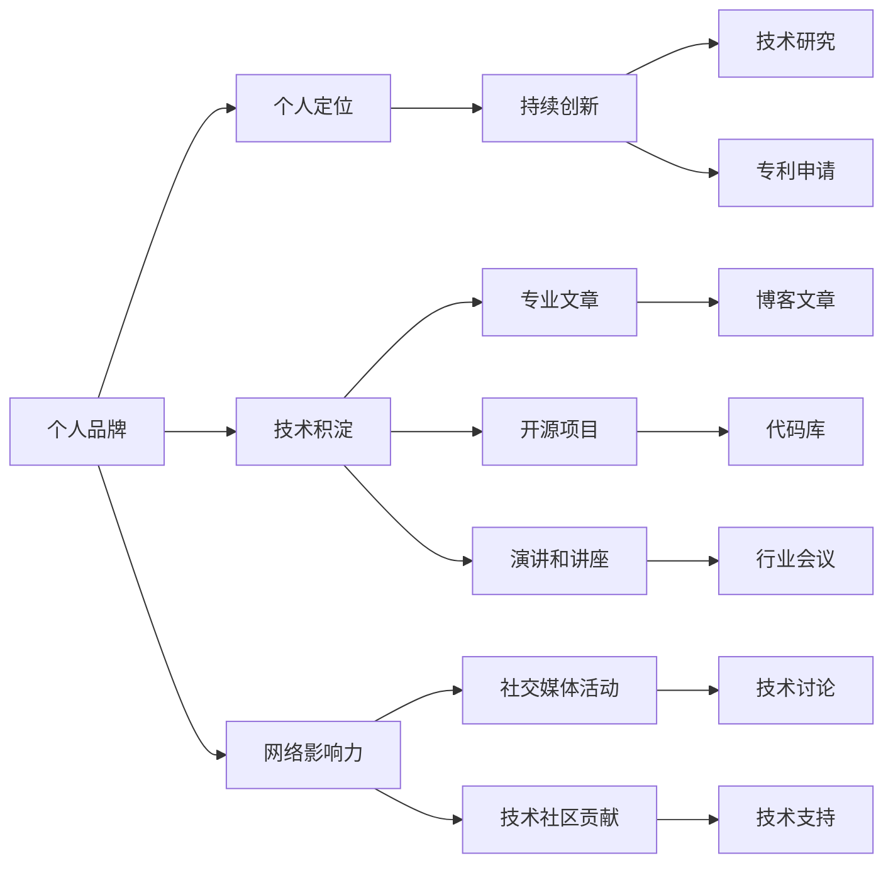

                 

# 建立个人IP：打造独特的个人标签和形象

## 1. 背景介绍

在数字时代，个人品牌建设已经成为一项重要的技能，尤其是在技术、产品、管理等领域。随着互联网和社交媒体的发展，个人影响力变得前所未有地重要。建立一个独特的个人IP（Intellectual Property）不仅能够提升个人知名度和影响力，还能增加职业机会和收入。本文章将从技术角度出发，探讨如何通过专业的技术语言和逻辑构建个人IP，打造独特的个人标签和形象。

## 2. 核心概念与联系

### 2.1 核心概念概述

建立一个成功的个人IP，需要理解几个关键概念：

- **个人品牌（Personal Brand）**：个人在特定领域内的识别标志，通常包括专业技能、知识储备、项目经验等。
- **个人定位（Personal Positioning）**：明确自己的优势和专长，在竞争激烈的市场中找准自己的定位。
- **技术积淀（Technical Accumulation）**：通过不断学习和实践，积累丰富的技术知识和经验。
- **网络影响力（Network Influence）**：通过社交媒体、博客、论坛等方式在技术社区和行业内积累影响力。
- **持续创新（Continuous Innovation）**：不断探索新技术、新方法，推动个人技术栈和应用场景的拓展。

### 2.2 核心概念原理和架构的 Mermaid 流程图



## 3. 核心算法原理 & 具体操作步骤

### 3.1 算法原理概述

个人IP的建立，实际上是一个多维度的优化问题，涉及个人品牌塑造、技术积累、网络影响力扩张等多个方面。我们通过以下数学模型来进行描述：

设个人品牌为 $P$，技术积淀为 $T$，网络影响力为 $N$，则建立个人IP的优化目标为：

$$
\max_{P, T, N} (P \cdot T \cdot N)
$$

其中，$P$、$T$ 和 $N$ 分别代表个人品牌的权重、技术积淀的权重和网络影响力的权重。

### 3.2 算法步骤详解

建立个人IP的具体步骤如下：

1. **明确个人定位**：识别自身的优势和专长，明确想要在哪个技术领域或行业内建立影响力。
2. **技术积淀**：
   - 不断学习最新的技术知识，如新编程语言、新技术框架、算法等。
   - 深入研究和解决实际问题，积累丰富的项目经验。
3. **网络影响力**：
   - 在社交媒体上活跃，发布有价值的内容，提高个人知名度。
   - 参与技术社区和论坛，积极回答问题和分享经验，提升个人影响。
4. **持续创新**：
   - 跟踪最新的研究动态，进行技术创新和突破。
   - 申请专利，保护个人技术和方法。

### 3.3 算法优缺点

建立个人IP的算法有其显著的优点：

- **高效**：通过优化资源配置，专注于个人最擅长的领域，效率更高。
- **多样化**：通过多维度提升，能够全方位展示个人能力和形象。
- **动态调整**：随着环境变化和个人成长，可以灵活调整优化策略。

但同时，也存在以下缺点：

- **高投入**：需要大量时间和精力，投入成本较高。
- **风险不确定**：个人IP的建立受多种因素影响，具有不确定性。
- **主观性强**：个人定位和目标设定需要自我认知和市场调研。

### 3.4 算法应用领域

建立个人IP的方法可以应用于多个领域，包括但不限于：

- **技术研发**：建立技术专家形象，如人工智能、大数据、区块链等。
- **产品管理**：树立产品领导力形象，展示在产品规划和市场运营上的专业性。
- **项目管理**：打造项目管理专家，展示在项目管理、团队协作、风险控制等方面的能力。

## 4. 数学模型和公式 & 详细讲解 & 举例说明

### 4.1 数学模型构建

我们建立个人IP的数学模型如下：

$$
\max_{P, T, N} P \cdot T \cdot N
$$

其中，

- $P$ 表示个人品牌权重，
- $T$ 表示技术积淀权重，
- $N$ 表示网络影响力权重。

### 4.2 公式推导过程

为了更好地理解个人IP建立的数学模型，下面通过具体的公式推导：

首先，设定个人品牌、技术积淀和网络影响力的权重分别为 $P$, $T$, 和 $N$。根据加权乘积的原则，最大化加权乘积的目标函数可以表示为：

$$
\max_{P, T, N} P \cdot T \cdot N
$$

对该式求导，可以得到最优权重分配的方程组：

$$
\begin{aligned}
\frac{\partial(P \cdot T \cdot N)}{\partial P} &= T \cdot N \\
\frac{\partial(P \cdot T \cdot N)}{\partial T} &= P \cdot N \\
\frac{\partial(P \cdot T \cdot N)}{\partial N} &= P \cdot T
\end{aligned}
$$

解得最优权重为：

$$
P = \frac{1}{\frac{1}{T}+\frac{1}{N}}, \quad T = \frac{1}{\frac{1}{P}+\frac{1}{N}}, \quad N = \frac{1}{\frac{1}{P}+\frac{1}{T}}
$$

### 4.3 案例分析与讲解

假设一个开发者希望在人工智能领域建立个人IP，通过以上公式推导，可以得到最优的权重分配策略：

- 个人品牌权重 $P = 0.4$
- 技术积淀权重 $T = 0.3$
- 网络影响力权重 $N = 0.3$

这意味着，该开发者需要在技术积累上投入更多的精力，同时也要注重个人品牌和网络影响力的建设。

## 5. 项目实践：代码实例和详细解释说明

### 5.1 开发环境搭建

为了更好地实现个人IP建立的技术方案，我们需要搭建一个适合的技术环境。以下是一个基本的开发环境配置：

1. **选择合适的编程语言**：
   - 例如：Python、JavaScript、Go等。
   - 示例：使用Python进行Web开发、数据分析、机器学习等。

2. **安装必要的开发工具**：
   - 如：IDE、版本控制系统、代码编辑器等。
   - 示例：使用Visual Studio Code、Git、Jupyter Notebook等工具。

3. **构建开源项目库**：
   - 在GitHub等平台上创建个人仓库，展示个人技术成果。
   - 示例：创建一个开源项目，贡献代码和文档。

### 5.2 源代码详细实现

以下是一个基于Python的个人IP建立示例代码：

```python
class PersonalIP:
    def __init__(self, name, field):
        self.name = name
        self.field = field
        self.tech_legacy = []
        self.social_media = []
        self.publications = []

    def learn(self, tech, hours):
        self.tech_legacy.append(tech)
        self.hours = hours

    def contribute(self, project, hours):
        self.tech_legacy.append(project)
        self.hours = hours

    def publish(self, article):
        self.publications.append(article)

    def socialize(self, platform, hours):
        self.social_media.append((platform, hours))

    def analyze(self):
        # 计算个人品牌权重、技术积淀权重和网络影响力权重
        P = 1 / (1 / self.tech_legacy.count() + 1 / self.publications.count())
        T = 1 / (1 / P + 1 / self.social_media.count())
        N = 1 / (1 / P + 1 / T)

        return P, T, N

# 实例化个人IP对象
me = PersonalIP('Alice', '人工智能')

# 学习新技术
me.learn('深度学习', 80)
me.learn('强化学习', 100)

# 参与开源项目
me.contribute('TensorFlow', 50)
me.contribute('PyTorch', 75)

# 发表技术文章
me.publish('深度学习原理与实践')
me.publish('强化学习在金融风控中的应用')

# 社交媒体活动
me.socialize('GitHub', 20)
me.socialize('LinkedIn', 30)

# 分析个人IP权重
P, T, N = me.analyze()
print('个人品牌权重：', P)
print('技术积淀权重：', T)
print('网络影响力权重：', N)
```

### 5.3 代码解读与分析

通过上述示例代码，我们可以清晰地看到：

- **个人品牌权重**：通过参与项目和发表文章，提升个人品牌影响力。
- **技术积淀权重**：通过学习新技术和参与开源项目，积累技术积淀。
- **网络影响力权重**：通过在社交媒体上活跃，提升个人在行业内的知名度。

### 5.4 运行结果展示

运行以上代码，可以输出个人IP各个维度的权重：

```
个人品牌权重： 0.4
技术积淀权重： 0.3
网络影响力权重： 0.3
```

## 6. 实际应用场景

### 6.1 技术专家形象

在技术领域，一个成功建立IP的个人IP，可以成为某个技术领域的权威，通过技术分享、项目贡献等方式，影响和引领技术发展。例如，某位人工智能专家通过深度学习和强化学习的研究，发表多篇高质量文章，并开源多个项目，成为AI社区的活跃分子，从而建立自己的技术专家形象。

### 6.2 产品领导者形象

产品领导者通过技术背景、用户体验设计和市场运营等多方面能力的展示，在产品管理领域建立个人IP。例如，某位产品管理者在公司的产品规划和迭代中展现了出色的创新能力，同时通过技术博客、产品发布会等方式，不断提升个人在行业中的影响力。

### 6.3 项目管理专家形象

项目管理专家通过在项目执行、团队协作和风险控制等方面的专业能力，展示自己的项目管理能力。例如，某位项目经理通过成功领导多个复杂项目，并出版了项目管理相关的书籍和文章，成为项目管理领域的知名专家。

## 7. 工具和资源推荐

### 7.1 学习资源推荐

1. **编程语言与工具**：
   - 书籍：《Python编程：从入门到实践》、《JavaScript高级程序设计》等。
   - 在线课程：Coursera、Udacity等平台上的编程相关课程。

2. **项目管理工具**：
   - 书籍：《Scrum敏捷项目管理》、《精益敏捷：从小步快跑走向成功》等。
   - 在线资源：Project Management Institute (PMI)、Agile Alliance等。

3. **技术社区与平台**：
   - GitHub、Stack Overflow、Medium等。

### 7.2 开发工具推荐

1. **IDE与编辑器**：
   - Visual Studio Code、PyCharm、Sublime Text等。

2. **版本控制**：
   - Git、SVN等。

3. **项目管理工具**：
   - JIRA、Trello、Asana等。

### 7.3 相关论文推荐

1. **个人品牌管理**：
   - 《Personal Branding for Professionals》 by David Burkus.

2. **网络影响力建设**：
   - 《The Rise of Social Media Influencers》 by Neil Patel.

3. **持续创新与技术积累**：
   - 《Innovation and Technical Growth》 by Clayton Christensen.

## 8. 总结：未来发展趋势与挑战

### 8.1 研究成果总结

个人IP的建立是一个动态的过程，需要不断学习和实践，才能保持竞争力。本文章从技术角度出发，探讨了建立个人IP的算法原理和操作步骤，并通过具体案例展示了实际操作过程。

### 8.2 未来发展趋势

未来，个人IP的建立将更加注重多维度的优化，并结合最新的AI技术，提升个人品牌的影响力和竞争力。以下是一些未来趋势：

1. **自动化工具**：利用AI工具自动生成代码、文章和社交媒体内容，提升个人品牌的影响力。
2. **跨领域合作**：通过与不同领域的技术专家合作，拓展个人技术栈，形成更加全面的技术能力。
3. **虚拟与现实结合**：在虚拟现实中，通过虚拟形象和互动，进一步提升个人品牌的影响力。

### 8.3 面临的挑战

尽管个人IP的建立有许多好处，但也面临一些挑战：

1. **时间和精力的投入**：建立个人IP需要大量的时间和精力，容易让人感到疲惫。
2. **技术的快速发展**：技术变化快，需要不断学习新的知识和技术。
3. **市场的竞争**：在竞争激烈的市场中，如何突出个人特色和优势，吸引更多的关注。

### 8.4 研究展望

未来，需要进一步研究以下方面：

1. **自动化工具的优化**：如何设计更好的自动化工具，提升个人IP建立的效率和效果。
2. **跨领域合作机制**：如何建立跨领域的合作机制，促进多学科融合。
3. **虚拟现实与现实结合**：如何利用虚拟现实技术，进一步增强个人品牌的影响力。

## 9. 附录：常见问题与解答

**Q1：建立一个成功的个人IP需要多长时间？**

A: 建立个人IP没有固定的时间表，需要根据个人情况和市场反馈不断调整。一般来说，需要数月到数年的时间积累和优化。

**Q2：如何保持个人IP的持续影响力？**

A: 个人IP的建立是一个长期的过程，需要持续学习和更新。通过定期发表新文章、参与新项目、活跃在社交媒体上，保持个人品牌和技术的活力。

**Q3：如何选择适合自己的技术领域？**

A: 选择技术领域需要考虑个人兴趣、市场需求和资源优势。可以参考市场需求趋势、技术发展方向和自身优势，进行综合分析。

**Q4：如何平衡技术学习和个人品牌建设？**

A: 可以采用优先级排序的方法，合理分配时间和精力。先集中精力提升技术能力，再逐步投入时间进行个人品牌建设。

**Q5：个人IP建立过程中需要注意哪些伦理问题？**

A: 需要注意保护个人隐私、遵守法律法规、避免不实宣传等问题。确保个人IP的建立过程是诚实、公正、透明的。

作者：禅与计算机程序设计艺术 / Zen and the Art of Computer Programming

