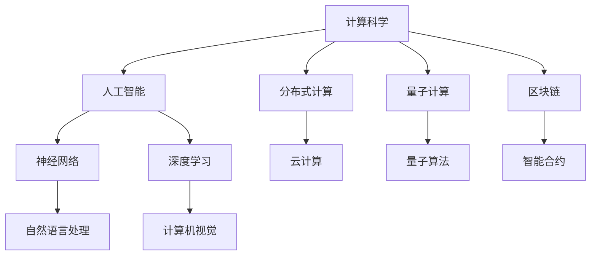

                 

# 开启无限可能：人类计算的新征程

## 1. 背景介绍

### 1.1 问题由来
随着计算机科技的飞速发展，人类社会的计算能力已从单核CPU时代迈入多核乃至分布式计算的全新纪元。在过去几十年间，我们见证了从超级计算机到量子计算的跨越，以及深度学习、云计算、区块链等技术的异军突起。然而，这一进程并未止步。继计算机与人脑在结构与功能上的仿生学研究之后，计算与人类意识的统一、融合，成为未来科技的重要研究趋势。

### 1.2 问题核心关键点
如何结合人类智慧与计算能力，构建更高层次、更智能化的计算模型，是当前科技研究面临的核心问题。其关键点包括：

1. **计算与意识的统一**：通过仿生学、神经科学等手段，探究计算与意识的本质联系，实现人机协同计算。
2. **分布式计算的普及**：加速分布式计算框架的开发与应用，构建下一代分布式计算平台。
3. **量子计算的突破**：解决量子计算硬件设计、算法优化等问题，推动量子计算在实际应用中的落地。
4. **区块链与智能合约的融合**：结合区块链的安全特性与智能合约的可编程性，实现更高效的智能合约系统。
5. **跨学科研究**：推动计算科学与生命科学、物理学、心理学等多学科的交叉融合，突破传统思维限制，开拓新的研究视角。

这些关键点不仅代表了当前计算科技的前沿研究热点，也指向了未来科技发展的潜在方向。

## 2. 核心概念与联系

### 2.1 核心概念概述

为了更好地理解计算科技的未来发展，本节将介绍几个密切相关的核心概念：

1. **计算科学**：研究如何用算法和计算机硬件实现自动化求解问题，包括算法设计、数据结构、分布式计算等。
2. **人工智能**：赋予计算机系统以智能，使其能够通过感知、学习、推理等方式解决复杂问题，涵盖了机器学习、深度学习、自然语言处理等领域。
3. **神经网络与深度学习**：模拟人脑神经网络结构，通过多层非线性变换，学习复杂数据特征的模型。
4. **量子计算**：利用量子叠加、纠缠等物理特性，实现信息处理的革命性提升。
5. **区块链与智能合约**：一种去中心化的分布式账本技术，结合智能合约的可编程性，实现自动执行和无需信任的交易机制。

这些概念之间的逻辑关系可以通过以下Mermaid流程图来展示：



这个流程图展示了大语言模型的核心概念及其之间的关系：

1. 计算科学是基础，提供算法和工具。
2. 人工智能是目标，通过算法实现智能决策。
3. 神经网络和深度学习是手段，构建智能模型。
4. 分布式计算和云计算是平台，提供高效计算资源。
5. 量子计算是未来，探索计算极限。
6. 区块链和智能合约是应用，实现安全、高效的业务逻辑。

这些核心概念共同构成了人类计算技术的前沿框架，推动计算科学的不断进步。通过理解这些核心概念，我们可以更好地把握计算科技的发展脉络。

## 3. 核心算法原理 & 具体操作步骤
### 3.1 算法原理概述

人类计算的新征程，不仅涉及计算算法的优化，还涵盖了硬件、网络、算法、应用等多方面的创新。以下是对这些核心算法原理的概述：

1. **分布式计算**：通过并行计算和协同计算，实现大规模数据集的高效处理。分布式计算框架如Hadoop、Spark等，已广泛应用于大数据处理、云计算、边缘计算等领域。
2. **深度学习算法**：基于神经网络结构，通过多层非线性变换，学习复杂数据模式。主要算法包括前馈神经网络、卷积神经网络、循环神经网络等。
3. **量子计算算法**：利用量子叠加和纠缠，优化求解某些特定问题。如Shor算法用于分解大素数，Grover算法用于数据库搜索等。
4. **智能合约系统**：基于区块链技术，通过代码编写自动执行业务逻辑，实现去中心化、无需信任的自动化合约。

### 3.2 算法步骤详解

以下将详细介绍几种核心算法的详细步骤：

#### 3.2.1 分布式计算

**分布式计算框架部署**

1. **选择合适的分布式计算框架**：根据数据量、处理需求选择合适的分布式计算框架，如Hadoop、Spark等。
2. **搭建集群环境**：将计算节点接入集群，配置网络、存储等基础设施。
3. **编写分布式算法**：将计算任务分割为多部分，利用MapReduce、Spark等编程模型实现并行处理。
4. **调试与优化**：在生产环境进行大规模数据处理，检测性能瓶颈，进行算法优化。

**数据处理流程**

1. **数据收集**：从不同来源收集数据，如日志文件、数据库、文件系统等。
2. **数据清洗**：清洗数据中的噪声、缺失值，确保数据质量。
3. **数据分区**：将大数据集分区存储，并行计算。
4. **数据聚合**：对处理结果进行聚合、统计、汇总，输出最终结果。

#### 3.2.2 深度学习算法

**神经网络构建**

1. **选择合适的神经网络结构**：根据任务需求选择网络结构，如全连接神经网络、卷积神经网络、循环神经网络等。
2. **初始化权重与偏置**：对模型参数进行随机初始化，一般使用Xavier初始化。
3. **前向传播**：将输入数据传递至网络各层，计算输出。
4. **损失函数计算**：根据输出结果和真实标签计算损失函数。
5. **反向传播**：利用链式法则计算损失函数对模型参数的梯度。
6. **参数更新**：使用优化算法（如SGD、Adam等）更新模型参数，迭代优化。

**数据预处理**

1. **数据标准化**：对数据进行归一化处理，使数据在0-1之间。
2. **数据增强**：通过旋转、裁剪、加噪声等方式，增加数据多样性，避免过拟合。
3. **数据集划分**：将数据集划分为训练集、验证集、测试集，用于模型训练和评估。

#### 3.2.3 量子计算算法

**量子硬件部署**

1. **选择量子硬件平台**：根据需求选择量子计算机或量子模拟器。
2. **安装量子计算软件**：安装量子计算框架，如Qiskit、Cirq等。
3. **编写量子算法**：根据特定问题设计量子算法，如Shor算法、Grover算法等。

**量子算法优化**

1. **量子门设计**：设计量子门，实现量子算法的逻辑功能。
2. **电路编译**：将量子门序列编译成量子计算机的物理指令，进行优化。
3. **纠错与降噪**：通过量子纠错和去噪技术，减少量子计算的错误率。
4. **结果输出**：读取量子计算机输出，进行结果分析和验证。

#### 3.2.4 智能合约系统

**智能合约编写**

1. **选择合适的区块链平台**：如Ethereum、Hyperledger等。
2. **编写智能合约代码**：使用Solidity、SmartContract等语言编写智能合约代码。
3. **测试与部署**：在测试网络中进行测试，验证合约功能。

**智能合约执行**

1. **事件触发**：当合约中设定的条件满足时，智能合约自动执行。
2. **结果验证**：智能合约执行后，验证执行结果是否符合预期。
3. **资产转移**：根据合约执行结果，进行资产转移或通知。

### 3.3 算法优缺点

各类算法均具有其优势和局限性：

#### 3.3.1 分布式计算

**优点**：
- 能够处理大规模数据集，提高计算效率。
- 实现高可用性、高扩展性的系统架构。
- 减少单个节点的计算压力，提升整体性能。

**缺点**：
- 数据传输和通信开销较大。
- 需要复杂的系统管理与维护。
- 可能存在数据一致性问题。

#### 3.3.2 深度学习算法

**优点**：
- 能够自动学习复杂数据模式，减少特征工程的工作量。
- 对噪声数据具有较强的鲁棒性。
- 可应用于多种任务，如图像识别、语音识别、自然语言处理等。

**缺点**：
- 需要大量标注数据，训练周期长。
- 模型复杂度大，计算资源消耗高。
- 黑箱模型，难以解释其决策过程。

#### 3.3.3 量子计算算法

**优点**：
- 在某些特定问题上实现指数级加速，如数据库搜索、整数分解等。
- 量子计算具有并行性，处理速度极快。
- 能够在特定领域带来颠覆性变革。

**缺点**：
- 技术尚未成熟，存在硬件瓶颈。
- 错误率高，需要复杂纠错算法。
- 算法设计复杂，门槛较高。

#### 3.3.4 智能合约系统

**优点**：
- 自动执行合约逻辑，减少人为操作风险。
- 去中心化，提高系统的透明性和安全性。
- 支持可编程合约，实现灵活多样的业务逻辑。

**缺点**：
- 智能合约编写复杂，易出现漏洞。
- 系统扩展性有限，难以支持大规模并发。
- 代码审查和维护难度较大。

### 3.4 算法应用领域

各类算法在不同领域的应用范围：

#### 3.4.1 分布式计算

**大数据处理**：
- 处理大规模日志数据，生成业务报表。
- 进行大规模基因数据、地理数据的分析与处理。

**云计算**：
- 提供弹性计算资源，支持云原生应用。
- 实现云存储数据的分布式备份与恢复。

#### 3.4.2 深度学习算法

**图像识别**：
- 医学影像识别，辅助医生进行诊断。
- 工业质检，自动识别缺陷产品。

**自然语言处理**：
- 机器翻译，实现跨语言交流。
- 情感分析，评估用户反馈。

#### 3.4.3 量子计算算法

**优化问题求解**：
- 物流路径规划，寻找最优路线。
- 金融风险预测，评估资产价值。

**加密与通信**：
- 量子密钥分发，保障通信安全。
- 数据加密与解密，保护隐私。

#### 3.4.4 智能合约系统

**供应链管理**：
- 自动执行交货、支付等合约条款，提高交易效率。
- 实时监控供应链状态，及时预警风险。

**金融交易**：
- 自动执行金融合约，进行风险控制与对冲。
- 提高交易透明性，减少交易成本。

## 4. 数学模型和公式 & 详细讲解  
### 4.1 数学模型构建

在人类计算的各个环节中，数学模型是必不可少的重要工具。以下我们将通过数学模型，对一些核心算法进行更加严格的数学推导与分析。

#### 4.1.1 分布式计算

**MapReduce模型**

MapReduce是一种经典的分布式计算模型，由Map和Reduce两个阶段组成。

**Map阶段**：
- 输入数据被分为多个键值对，由Map函数进行映射。
- 映射结果存储在分布式文件系统中。

**Reduce阶段**：
- 从分布式文件系统中读取映射结果。
- 对映射结果进行聚合与汇总，输出最终结果。

**伪代码实现**：

```python
def MapReduce(data):
    # 1. 划分数据
    shard_data = split_data(data)

    # 2. 并行计算
    mapped_data = [Map(f, shard) for shard in shard_data]

    # 3. 数据聚合
    reduced_data = [Reduce(mapped_shard) for mapped_shard in mapped_data]

    # 4. 结果输出
    return [Reduce(result) for result in reduced_data]

def Map(data, key):
    # 1. 将数据映射为键值对
    return (key, data[key])

def Reduce(data):
    # 2. 对数据进行聚合
    return sum(data.values())
```

#### 4.1.2 深度学习算法

**神经网络模型**

神经网络由输入层、隐藏层和输出层组成，通过前向传播和反向传播进行训练。

**前向传播**：
- 将输入数据传递至网络各层，计算输出。

**反向传播**：
- 根据输出结果和真实标签计算损失函数。
- 利用链式法则计算损失函数对模型参数的梯度。
- 使用优化算法（如SGD、Adam等）更新模型参数，迭代优化。

**伪代码实现**：

```python
def NeuralNetwork(input, weights, biases):
    # 1. 前向传播
    hidden = activation(weights[0] @ input + biases[0])
    output = activation(weights[1] @ hidden + biases[1])
    
    # 2. 损失函数
    loss = loss_function(output, target)
    
    # 3. 反向传播
    grads = backpropagate(loss, output)
    
    # 4. 参数更新
    for i, layer in enumerate(weights):
        weights[i] -= grads[i] * learning_rate
        biases[i] -= grads[i+1] * learning_rate
    
    # 5. 返回输出
    return output

def activation(x):
    return 1 / (1 + np.exp(-x))

def backpropagate(loss, output):
    grads = [0] * len(weights)
    for i in range(len(weights)-1, -1, -1):
        grads[i] = derivative(output, weights[i]) * loss
        loss = derivative(weights[i] @ hidden + biases[i+1], output) * loss
    return grads
```

#### 4.1.3 量子计算算法

**Shor算法**

Shor算法用于分解大素数，其核心步骤包括：

1. 将输入的大素数分解为两个因数。
2. 利用量子叠加和量子Fourier变换，在多项式时间内完成因数分解。

**伪代码实现**：

```python
def Shor(n):
    # 1. 准备量子计算机
    prepare_computer()

    # 2. 初始化量子态
    init_state()

    # 3. 量子叠加
    quantum_addition()

    # 4. 量子Fourier变换
    quantum_fourier_transform()

    # 5. 测量量子态
    measure_state()

    # 6. 输出结果
    return result
```

#### 4.1.4 智能合约系统

**Solidity语言**

Solidity是一种面向智能合约的编程语言，支持函数、变量、结构体等基本编程元素。

**智能合约示例**：

```solidity
contract SmartContract {
    uint public balance;
    
    function transfer(address payable _receiver, uint _amount) public {
        require(balance >= _amount, "Not enough balance");
        balance -= _amount;
        payable(this).transfer(_receiver, _amount);
    }
}
```

## 5. 项目实践：代码实例和详细解释说明
### 5.1 开发环境搭建

在进行计算技术项目实践前，我们需要准备好开发环境。以下是使用Python进行分布式计算、深度学习、量子计算、智能合约系统开发的配置流程：

1. **安装Python**：从官网下载并安装Python 3.x版本。
2. **安装分布式计算框架**：如Hadoop、Spark、Flink等，需安装相应版本并配置环境。
3. **安装深度学习框架**：如TensorFlow、PyTorch等，需安装相应版本并配置环境。
4. **安装量子计算框架**：如Qiskit、Cirq等，需安装相应版本并配置环境。
5. **安装智能合约开发环境**：如Ethereum、Hyperledger等，需安装相应版本并配置环境。

### 5.2 源代码详细实现

下面我们以分布式计算和深度学习为例，给出详细代码实现。

#### 5.2.1 分布式计算

```python
import multiprocessing

def worker(data):
    # 1. 数据处理
    result = process(data)

    # 2. 存储结果
    store_result(result)

def process(data):
    # 数据处理代码

def store_result(result):
    # 存储结果代码

if __name__ == "__main__":
    # 1. 创建进程池
    pool = multiprocessing.Pool()

    # 2. 并行处理数据
    pool.map(worker, data)

    # 3. 关闭进程池
    pool.close()
    pool.join()
```

#### 5.2.2 深度学习算法

```python
import numpy as np
import torch

def activation(x):
    return 1 / (1 + np.exp(-x))

def backpropagate(loss, output):
    grads = [0] * len(weights)
    for i in range(len(weights)-1, -1, -1):
        grads[i] = derivative(output, weights[i]) * loss
        loss = derivative(weights[i] @ hidden + biases[i+1], output) * loss
    return grads

def NeuralNetwork(input, weights, biases):
    # 1. 前向传播
    hidden = activation(weights[0] @ input + biases[0])
    output = activation(weights[1] @ hidden + biases[1])
    
    # 2. 损失函数
    loss = loss_function(output, target)
    
    # 3. 反向传播
    grads = backpropagate(loss, output)
    
    # 4. 参数更新
    for i, layer in enumerate(weights):
        weights[i] -= grads[i] * learning_rate
        biases[i] -= grads[i+1] * learning_rate
    
    # 5. 返回输出
    return output

def loss_function(output, target):
    return np.mean((output - target) ** 2)
```

### 5.3 代码解读与分析

下面我们将对关键代码进行解读与分析：

#### 5.3.1 分布式计算

**进程池**

- `multiprocessing.Pool`：创建一个进程池，可以并行处理多个数据。
- `worker`函数：并行处理函数，将数据传递给各个进程处理。
- `process`函数：数据处理函数，实现具体的数据处理逻辑。
- `store_result`函数：将处理结果存储到分布式文件系统中。

**并行处理**

- `map`函数：将数据映射到多个进程中并行处理，实现高并行度的分布式计算。

**进程池关闭**

- `close`函数：关闭进程池，防止资源泄漏。
- `join`函数：等待所有进程处理完毕。

#### 5.3.2 深度学习算法

**前向传播**

- `activation`函数：激活函数，用于计算神经元输出。
- `backpropagate`函数：反向传播函数，计算损失函数的梯度。

**参数更新**

- `NeuralNetwork`函数：神经网络模型，实现前向传播、损失函数、反向传播和参数更新。
- `loss_function`函数：损失函数，用于计算模型的预测误差。

**代码实现**

- 激活函数：$g(x)=1/(1+e^{-x})$
- 损失函数：$L(y,\hat{y})=(y-\hat{y})^2$
- 梯度更新：$\theta_i \leftarrow \theta_i - \eta \cdot \frac{\partial L}{\partial \theta_i}$

### 5.4 运行结果展示

分布式计算的运行结果可以通过输出日志查看，如处理时间、处理结果等。深度学习算法的运行结果可以通过输出准确率、损失函数值等指标评估模型效果。

## 6. 实际应用场景

### 6.1 分布式计算

**大规模数据处理**

- 互联网公司如Google、Amazon等，使用分布式计算框架处理海量用户数据，进行数据挖掘和分析。
- 大型科研机构使用分布式计算进行基因组学、气候预测等大规模计算。

**云计算**

- 云服务提供商如AWS、Azure等，提供弹性计算资源，支持大数据分析、机器学习等业务。
- 企业内部使用云计算平台进行数据备份、存储等任务。

### 6.2 深度学习算法

**图像识别**

- 医学影像识别：自动分析X光片、CT片，辅助医生诊断疾病。
- 工业质检：自动检测产品缺陷，提高生产效率。

**自然语言处理**

- 机器翻译：实现不同语言之间的翻译，促进国际交流。
- 情感分析：分析用户反馈，提升产品和服务质量。

### 6.3 量子计算算法

**优化问题求解**

- 物流路径规划：寻找最优路径，减少运输成本。
- 金融风险预测：评估资产价值，进行风险控制。

**加密与通信**

- 量子密钥分发：保障通信安全，防止窃听。
- 数据加密与解密：保护数据隐私，防止泄露。

### 6.4 智能合约系统

**供应链管理**

- 自动执行交货、支付等合约条款，提高交易效率。
- 实时监控供应链状态，及时预警风险。

**金融交易**

- 自动执行金融合约，进行风险控制与对冲。
- 提高交易透明性，减少交易成本。

## 7. 工具和资源推荐

### 7.1 学习资源推荐

为了帮助开发者系统掌握计算科技的理论基础和实践技巧，这里推荐一些优质的学习资源：

1. 《分布式计算与大数据技术》：详细介绍了分布式计算的原理与实现方法，涵盖Hadoop、Spark等框架。
2. 《深度学习基础》：全面介绍了深度学习的原理与经典模型，包括神经网络、卷积神经网络、循环神经网络等。
3. 《量子计算原理与实践》：系统讲解了量子计算的基本原理与实用技术，包括量子门设计、量子算法实现等。
4. 《智能合约技术》：介绍了智能合约的基本概念与实现方法，涵盖Solidity、Ethereum等技术栈。
5. 《云计算基础》：系统讲解了云计算的原理与技术实现，涵盖AWS、Azure等云服务提供商。

通过对这些资源的学习实践，相信你一定能够快速掌握计算科技的理论基础和实践技巧，并用于解决实际的计算问题。

### 7.2 开发工具推荐

高效的开发离不开优秀的工具支持。以下是几款用于计算科技开发的常用工具：

1. Jupyter Notebook：强大的交互式编程环境，支持Python、R等语言，方便实验与文档记录。
2. Visual Studio Code：功能丰富的IDE，支持代码编写、调试等，适用于多种编程语言。
3. PyCharm：专业的Python IDE，支持代码自动补全、调试、测试等功能，适用于深度学习、分布式计算等项目。
4. Eclipse：适用于智能合约开发的IDE，支持Solidity等智能合约语言，方便编写和调试智能合约代码。
5. GitHub：全球最大的代码托管平台，支持版本控制、协作开发等功能，方便团队协作。

合理利用这些工具，可以显著提升计算科技项目的开发效率，加快创新迭代的步伐。

### 7.3 相关论文推荐

计算科技的发展源于学界的持续研究。以下是几篇奠基性的相关论文，推荐阅读：

1. MapReduce: Simplified Data Processing on Large Clusters：提出MapReduce模型，为大规模数据处理提供高效解决方案。
2. Deep Learning：一种用于语音、视觉识别等任务的新型人工智能模型。
3. Shor's Algorithm for Factorization into Primes：提出Shor算法，实现量子计算对大素数分解的加速。
4. Smart Contracts: Blockchain-Based Trustless Smart Contracts in Decentralized Computing Networks：提出智能合约的概念，实现自动化合约执行。
5. Quantum Computing Since Democritus：探讨量子计算的哲学意义，为量子计算提供理论和实践指导。

这些论文代表了大语言模型微调技术的发展脉络。通过学习这些前沿成果，可以帮助研究者把握学科前进方向，激发更多的创新灵感。

## 8. 总结：未来发展趋势与挑战

### 8.1 总结

本文对计算科技的未来发展进行了全面系统的介绍。首先阐述了计算科技的最新进展，明确了其在人工智能、分布式计算、量子计算、区块链等领域的融合趋势。其次，从原理到实践，详细讲解了分布式计算、深度学习、量子计算、智能合约系统等核心算法的详细步骤。同时，本文还广泛探讨了各类算法在实际应用场景中的具体表现，展示了计算科技的广阔前景。最后，本文精选了计算科技的学习资源、开发工具和相关论文，力求为读者提供全方位的技术指引。

通过本文的系统梳理，可以看到，计算科技正在迈向一个全新的时代，为人类社会带来前所未有的变革。未来，计算科技将与人工智能、区块链、量子计算等多领域交叉融合，共同推动计算能力的突破和应用场景的拓展。

### 8.2 未来发展趋势

展望未来，计算科技将呈现以下几个发展趋势：

1. **计算与意识的统一**：随着神经科学和计算科学的交叉融合，计算系统将具备更高层次的智能决策能力，实现与人类意识的统一。
2. **分布式计算的普及**：分布式计算框架将更加成熟，支持大规模数据处理、弹性资源扩展，云计算、边缘计算等技术将全面普及。
3. **量子计算的突破**：量子计算硬件将进一步成熟，量子算法优化将实现多项式时间复杂度的突破，应用于更多实际问题。
4. **区块链与智能合约的融合**：去中心化的智能合约系统将得到广泛应用，实现无需信任的自动化合约，推动金融、供应链等领域的变革。
5. **跨学科研究**：计算科技将与生命科学、物理学、心理学等学科深度融合，推动跨领域研究，拓展新应用场景。

以上趋势凸显了计算科技的广阔前景。这些方向的探索发展，必将进一步推动计算能力的突破，为人类社会带来更多变革性的影响。

### 8.3 面临的挑战

尽管计算科技的前景广阔，但在迈向更加智能化、普适化应用的过程中，仍面临诸多挑战：

1. **计算与意识统一的技术门槛**：如何将计算与意识完美结合，实现智能系统的自我意识，是计算科技面临的最大挑战。
2. **大规模分布式计算的资源管理**：如何实现高效、可靠、低成本的分布式计算资源管理，仍是当前技术难点。
3. **量子计算硬件的不成熟**：量子计算硬件的设计、制造、应用仍处于起步阶段，面临技术瓶颈。
4. **智能合约的安全性**：智能合约的安全性问题，如代码审查、漏洞攻击等，仍需持续改进。
5. **跨学科研究的合作障碍**：不同学科之间的协作仍存在障碍，缺乏统一的研究标准和规范。

这些挑战需要研究者、工程师、政策制定者共同努力，才能逐步克服，推动计算科技的持续进步。

### 8.4 研究展望

面对计算科技所面临的挑战，未来的研究需要在以下几个方面寻求新的突破：

1. **计算与意识的统一**：深入研究神经科学，探索智能系统的自我意识和决策机制。
2. **分布式计算的优化**：研究弹性计算资源管理技术，提升分布式计算的效率和可靠性。
3. **量子计算的普及**：推动量子计算硬件的发展，优化量子算法，实现更多实际应用。
4. **智能合约的完善**：研究智能合约的安全性、可扩展性，解决智能合约面临的技术难题。
5. **跨学科研究的融合**：促进不同学科之间的交叉融合，推动计算科技与其他科技的协同发展。

这些研究方向的探索，将引领计算科技迈向更高的台阶，为构建安全、可靠、可解释、可控的智能系统铺平道路。面向未来，计算科技还需要与其他人工智能技术进行更深入的融合，如知识表示、因果推理、强化学习等，多路径协同发力，共同推动智能技术的发展。只有勇于创新、敢于突破，才能不断拓展计算科技的边界，实现人类的全面智能化。

## 9. 附录：常见问题与解答

**Q1: 分布式计算的效率如何提升？**

A: 分布式计算的效率提升可以通过以下几种方式实现：
1. 任务划分：将大任务拆分为多个小任务，并行处理，提高计算速度。
2. 数据本地化：将数据存储在靠近计算节点的本地磁盘上，减少数据传输时间。
3. 负载均衡：动态调整计算节点的负载，避免资源浪费。
4. 算法优化：优化计算算法，减少计算复杂度。

**Q2: 深度学习模型如何避免过拟合？**

A: 深度学习模型避免过拟合可以通过以下几种方式实现：
1. 数据增强：通过旋转、裁剪、加噪声等方式扩充训练集，增加数据多样性。
2. 正则化：使用L2正则、Dropout等技术，限制模型参数。
3. 早停策略：在验证集上监控模型性能，当性能不再提升时停止训练。
4. 模型集成：训练多个模型，取平均输出，减少过拟合风险。

**Q3: 智能合约系统如何保障安全性？**

A: 智能合约系统的安全性保障可以通过以下几种方式实现：
1. 代码审计：对智能合约代码进行全面审计，发现潜在漏洞。
2. 多签机制：设置多个人或多方的签名授权，防止单点故障。
3. 加密技术：使用加密技术保护智能合约中的敏感信息。
4. 权限控制：严格控制智能合约的权限，防止恶意操作。

**Q4: 量子计算硬件有哪些难点？**

A: 量子计算硬件的开发面临以下难点：
1. 量子比特的稳定性：保持量子比特的量子态稳定，避免量子退相干。
2. 量子纠错：处理量子计算中的错误，保证计算结果的准确性。
3. 量子计算芯片的制造：制造高质量的量子芯片，提高量子比特的质量。
4. 量子算法优化：优化量子算法，提高计算效率。

这些难点需要长期的持续研究，才能实现量子计算的普及和应用。

**Q5: 区块链与智能合约系统面临的主要问题？**

A: 区块链与智能合约系统面临的主要问题包括：
1. 可扩展性：区块链系统的扩展性有限，难以支持大规模并发。
2. 智能合约的安全性：智能合约代码的审查、漏洞攻击等，仍需持续改进。
3. 系统性能：智能合约的执行效率和可靠性，仍需优化。
4. 数据隐私：智能合约系统如何保护用户数据的隐私，仍需探索。

这些问题需要研究者、开发者、政策制定者共同努力，才能逐步解决，推动区块链与智能合约系统的成熟应用。

---

作者：禅与计算机程序设计艺术 / Zen and the Art of Computer Programming

