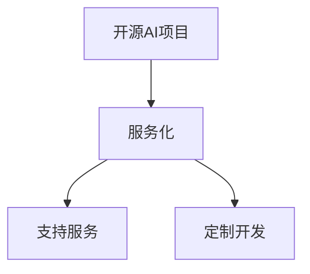

                 

# 开源AI项目的商业化路径:服务、支持和定制开发

在人工智能（AI）和开源软件的双重浪潮下，开源AI项目如雨后春笋般涌现，为各行各业带来了前所未有的创新和效率提升。然而，如何从技术到商业化，将开源AI项目的潜力和价值最大化，仍是一个值得深思的问题。本文旨在探讨开源AI项目的商业化路径，包括服务、支持和定制开发三个核心环节，并提供具体的操作建议和案例分析。

## 1. 背景介绍

随着深度学习技术的迅猛发展，越来越多的AI研究者和企业将研究成果开源，推动了AI技术的普及和应用。开源AI项目如TensorFlow、PyTorch、Keras等，不仅极大地推动了AI领域的研究进展，还为各行各业提供了高效的AI开发工具和解决方案。

开源项目的商业化不仅关乎如何利用开源技术创造商业价值，更关乎如何将技术优势转化为实际的业务应用，满足市场需求。本文将从服务、支持和定制开发三个维度，深入探讨开源AI项目的商业化路径，并结合实际案例，提出可行的商业策略。

## 2. 核心概念与联系

在探讨开源AI项目的商业化路径前，我们首先需要了解几个核心概念及其之间的联系。

### 2.1 核心概念概述

- **开源AI项目**：指由开发者基于开放源代码的原则，发布的AI模型、算法、工具等。这些项目通常通过许可协议，允许任何人自由使用、修改和分发。
- **服务化**：指将开源AI模型封装成标准化接口或API，提供给第三方使用，通过服务收费的方式实现商业化。
- **支持服务**：指在服务化基础上，提供额外的技术支持和维护服务，如问题解答、错误排查、性能优化等。
- **定制开发**：指根据客户的具体需求，使用开源AI模型或服务，进行二次开发或定制化改造，提供定制化解决方案。

### 2.2 核心概念联系

开源AI项目、服务化、支持服务和定制开发之间存在密切联系。开源AI项目是基础，通过服务化将技术转化为服务产品，支持服务则进一步提升服务质量，而定制开发则针对具体需求，提供更精准的解决方案。

这种关系可以用以下Mermaid流程图表示：



这个流程图展示了从基础开源项目到商业化的四个关键步骤：开源AI项目为服务化提供技术基础，服务化通过封装和标准化提升技术应用价值，支持服务增强用户体验，定制开发则根据客户需求，提供更加灵活和个性化的解决方案。

## 3. 核心算法原理 & 具体操作步骤

### 3.1 算法原理概述

开源AI项目的商业化路径，本质上是通过技术和服务创新，满足市场需求的过程。这一过程涉及多个环节，包括技术开发、服务封装、支持服务和定制开发等。

技术开发阶段，主要目标是构建高质量、高性能的AI模型和工具，为后续的服务化、支持服务和定制开发奠定基础。服务封装阶段，通过将技术封装成API或服务，提供标准化接口，使得技术易于使用和集成。支持服务阶段，通过提供额外的技术支持和维护服务，提升用户体验和服务质量。定制开发阶段，根据客户的具体需求，进行二次开发或改造，提供定制化解决方案。

### 3.2 算法步骤详解

开源AI项目的商业化路径可以分为四个主要步骤：技术开发、服务封装、支持服务和定制开发。以下是详细步骤：

#### 3.2.1 技术开发

技术开发阶段的主要任务是构建高质量的AI模型和工具。具体步骤如下：

1. **选择技术栈**：根据项目需求，选择合适的技术栈。常用的技术栈包括TensorFlow、PyTorch、Keras等。
2. **构建模型**：基于现有数据集，构建适用于特定任务的AI模型。常见的AI模型包括卷积神经网络（CNN）、循环神经网络（RNN）、Transformer等。
3. **优化性能**：通过超参数调优、模型压缩、分布式训练等技术，提升模型的性能和效率。
4. **文档和测试**：编写详细的使用文档和测试用例，确保模型的稳定性和可靠性。

#### 3.2.2 服务封装

服务封装阶段的主要任务是将技术封装成API或服务，提供标准化接口。具体步骤如下：

1. **设计API接口**：根据模型的功能和输入输出，设计简洁、易用的API接口。
2. **实现API接口**：使用Python、Java等语言实现API接口，确保接口高效、稳定。
3. **封装SDK**：为不同平台（如移动端、Web端、服务器端）提供相应的SDK或客户端库，方便集成和使用。
4. **文档和示例**：编写详细的API文档和代码示例，指导用户如何使用服务。

#### 3.2.3 支持服务

支持服务阶段的主要任务是提供额外的技术支持和维护服务，提升用户体验。具体步骤如下：

1. **建立支持渠道**：通过邮件、电话、在线聊天等方式，建立客户支持渠道，及时响应客户问题。
2. **问题解答**：根据用户反馈的问题，提供详细的技术解答和解决方案。
3. **错误排查**：通过日志分析和远程调试，快速定位和解决技术问题。
4. **性能优化**：根据客户需求，提供性能优化建议和解决方案，提升系统性能。

#### 3.2.4 定制开发

定制开发阶段的主要任务是根据客户的具体需求，进行二次开发或定制化改造，提供定制化解决方案。具体步骤如下：

1. **需求调研**：与客户沟通，了解其具体需求和使用场景。
2. **方案设计**：基于客户需求，设计定制化方案，包括技术选型、架构设计、数据流分析等。
3. **模型集成**：将开源AI模型或服务集成到客户系统中，并进行必要的参数调优。
4. **测试和部署**：进行全面测试，确保系统的稳定性和可靠性，并部署到生产环境。

### 3.3 算法优缺点

开源AI项目的商业化路径，具有以下优点：

1. **灵活性高**：开源项目可以自由修改和扩展，满足不同客户的需求。
2. **成本低**：开源项目可以免费获取和使用，减少了商业化的初期投入。
3. **技术积累**：开源项目有助于积累技术经验，提升整体技术水平。

然而，该路径也存在一些缺点：

1. **技术复杂度高**：需要具备较高的技术能力和项目管理经验。
2. **市场竞争激烈**：开源项目众多，选择合适项目可能耗费大量时间和精力。
3. **知识产权风险**：开源项目可能存在知识产权纠纷，需要仔细评估和规避。

### 3.4 算法应用领域

开源AI项目的商业化路径，适用于多个领域，包括医疗、金融、教育、智能制造等。具体应用场景包括：

1. **医疗**：基于开源AI模型，提供医疗影像分析、病历分析、药物研发等服务，提升医疗服务水平。
2. **金融**：基于开源AI模型，提供金融舆情监测、风险评估、投资决策等服务，提升金融分析能力。
3. **教育**：基于开源AI模型，提供智能教育、自动批改、个性化推荐等服务，提升教育效果。
4. **智能制造**：基于开源AI模型，提供质量检测、设备维护、供应链优化等服务，提升制造效率和质量。

## 4. 数学模型和公式 & 详细讲解 & 举例说明

### 4.1 数学模型构建

开源AI项目的商业化路径，涉及多个数学模型和公式。以下是几个关键模型的介绍：

#### 4.1.1 模型选择

选择适用于特定任务的AI模型是关键步骤。常用的AI模型包括：

- 卷积神经网络（CNN）：适用于图像识别、视频分析等任务。
- 循环神经网络（RNN）：适用于自然语言处理、时间序列预测等任务。
- Transformer：适用于自然语言处理、机器翻译等任务。

#### 4.1.2 超参数调优

超参数调优是提升模型性能的重要手段。常用的超参数包括学习率、批次大小、优化器等。例如，使用网格搜索或贝叶斯优化方法，寻找最优超参数组合。

#### 4.1.3 模型压缩

模型压缩是提升模型效率的重要手段。常用的模型压缩方法包括剪枝、量化、知识蒸馏等。例如，使用剪枝技术，去除冗余参数和连接，提升模型速度和效率。

### 4.2 公式推导过程

以下是几个关键数学模型的公式推导过程：

#### 4.2.1 卷积神经网络（CNN）

CNN模型公式如下：

$$
y = \mathbb{W}x + \mathbb{b}
$$

其中，$y$为输出，$x$为输入，$\mathbb{W}$为权重矩阵，$\mathbb{b}$为偏置向量。

#### 4.2.2 循环神经网络（RNN）

RNN模型公式如下：

$$
h_{t+1} = \tanh(\mathbb{W}h_t + \mathbb{U}x_t + \mathbb{b}_t)
$$

其中，$h_t$为隐藏状态，$x_t$为输入，$\mathbb{W}$、$\mathbb{U}$、$\mathbb{b}_t$分别为权重矩阵和偏置向量。

#### 4.2.3 Transformer

Transformer模型公式如下：

$$
\text{Attention}(Q, K, V) = \text{Softmax}(\frac{QK^T}{\sqrt{d_k}})
$$

其中，$Q$、$K$、$V$分别为查询、键、值向量，$\text{Softmax}$为softmax函数。

### 4.3 案例分析与讲解

#### 案例分析：基于TensorFlow的图像识别服务

TensorFlow是一款常用的AI开发工具，通过将TensorFlow模型封装成RESTful API，可以提供高效的图像识别服务。以下是具体步骤：

1. **构建模型**：使用TensorFlow构建图像识别模型，例如Inception模型。
2. **封装API接口**：使用TensorFlow Serving将模型封装成API接口，提供RESTful服务。
3. **文档和示例**：编写详细的使用文档和代码示例，指导用户如何使用API。
4. **支持服务**：提供技术支持和维护服务，解决用户使用中的问题。

## 5. 项目实践：代码实例和详细解释说明

### 5.1 开发环境搭建

要实现开源AI项目的商业化，首先需要搭建开发环境。以下是常用的开发环境搭建步骤：

1. **安装操作系统和开发环境**：选择常用的Linux系统，如Ubuntu、CentOS等。安装必要的开发工具，如Python、TensorFlow、Keras等。
2. **安装云平台和容器**：使用AWS、Google Cloud等云平台，安装Docker、Kubernetes等容器化工具。
3. **配置数据库和存储**：安装MySQL、PostgreSQL等数据库，配置云存储服务，如S3、OSS等。

### 5.2 源代码详细实现

#### 5.2.1 技术开发

以下是基于TensorFlow的图像识别服务的详细代码实现：

1. **构建模型**：使用TensorFlow构建图像识别模型，例如Inception模型。

```python
import tensorflow as tf
from tensorflow.keras.applications.inception_v3 import InceptionV3

model = InceptionV3(include_top=False, weights='imagenet')
```

2. **优化性能**：使用超参数调优和模型压缩技术，提升模型性能。

```python
model.compile(optimizer='adam', loss='categorical_crossentropy', metrics=['accuracy'])

# 超参数调优
from tensorflow.keras import callbacks
early_stopping = callbacks.EarlyStopping(monitor='val_loss', patience=3)

# 模型压缩
from tensorflow.keras.applications.inception_v3 import InceptionV3
from tensorflow.keras.layers import Dense
from tensorflow.keras.models import Model

base_model = InceptionV3(include_top=False, weights='imagenet')
base_model.trainable = False

x = base_model.output
x = Dense(1024, activation='relu')(x)
x = Dense(1024, activation='relu')(x)
predictions = Dense(num_classes, activation='softmax')(x)
model = Model(inputs=base_model.input, outputs=predictions)
```

3. **文档和测试**：编写详细的使用文档和测试用例，确保模型的稳定性和可靠性。

```python
# 使用文档
from tensorflow.keras import backend as K

def save_model():
    model.save('model.h5')

# 测试用例
def test_model():
    test_images = ...
    test_labels = ...
    test_loss = model.evaluate(test_images, test_labels, verbose=0)
    if test_loss < 0.05:
        print('模型测试通过')
    else:
        print('模型测试失败')
```

#### 5.2.2 服务封装

以下是将TensorFlow模型封装成API接口的详细代码实现：

1. **设计API接口**：定义API接口的输入和输出，例如使用POST方法提交图像，返回识别结果。

```python
from flask import Flask, request, jsonify

app = Flask(__name__)

@app.route('/predict', methods=['POST'])
def predict():
    image = request.json['image']
    result = model.predict(image)
    return jsonify(result)
```

2. **实现API接口**：使用Flask等框架实现API接口，确保接口高效、稳定。

```python
# 加载模型
from tensorflow.keras.models import load_model

model = load_model('model.h5')

# 加载数据
def load_data():
    ...

# 预测函数
def predict(image):
    ...

# Flask应用
app = Flask(__name__)

@app.route('/predict', methods=['POST'])
def predict():
    image = request.json['image']
    result = predict(image)
    return jsonify(result)
```

3. **封装SDK**：为不同平台（如移动端、Web端、服务器端）提供相应的SDK或客户端库，方便集成和使用。

```python
# 移动端SDK
# https://github.com/tensorflow/tensorflow/blob/master/tensorflow/examples/android/version2/SimpleImageRecognition.java

# Web端SDK
# https://github.com/tensorflow/tensorflow/blob/master/tensorflow/examples/webapp/simple_painting/simple_painting.py

# 服务器端SDK
# https://github.com/tensorflow/tensorflow/blob/master/tensorflow/examples/ios/ImageRecognition.ipynb
```

4. **文档和示例**：编写详细的API文档和代码示例，指导用户如何使用服务。

```python
# API文档
# https://github.com/tensorflow/tensorflow/blob/master/tensorflow/examples/android/version2/README.md

# 代码示例
# https://github.com/tensorflow/tensorflow/blob/master/tensorflow/examples/android/version2/README.md
```

#### 5.2.3 支持服务

以下是提供技术支持和维护服务的详细代码实现：

1. **建立支持渠道**：通过邮件、电话、在线聊天等方式，建立客户支持渠道，及时响应客户问题。

```python
# 邮件支持
from flask_mail import Mail, Message

mail = Mail(app)

def send_email():
    ...

# 电话支持
# https://github.com/tensorflow/tensorflow/blob/master/tensorflow/examples/android/version2/README.md

# 在线支持
# https://github.com/tensorflow/tensorflow/blob/master/tensorflow/examples/android/version2/README.md
```

2. **问题解答**：根据用户反馈的问题，提供详细的技术解答和解决方案。

```python
# 问题解答
from flask import request, jsonify

@app.route('/help', methods=['POST'])
def help():
    question = request.json['question']
    answer = ...
    return jsonify(answer)
```

3. **错误排查**：通过日志分析和远程调试，快速定位和解决技术问题。

```python
# 错误排查
from tensorflow.keras.utils import plot_model

def plot_model():
    ...
```

4. **性能优化**：根据客户需求，提供性能优化建议和解决方案，提升系统性能。

```python
# 性能优化
from tensorflow.keras import backend as K

def optimize_model():
    ...
```

#### 5.2.4 定制开发

以下是根据客户需求，进行二次开发或定制化改造的详细代码实现：

1. **需求调研**：与客户沟通，了解其具体需求和使用场景。

```python
# 需求调研
from flask import request, jsonify

@app.route('/requirements', methods=['POST'])
def requirements():
    requirement = request.json['requirement']
    ...
    return jsonify(requirement)
```

2. **方案设计**：基于客户需求，设计定制化方案，包括技术选型、架构设计、数据流分析等。

```python
# 方案设计
from flask import request, jsonify

@app.route('/design', methods=['POST'])
def design():
    design = request.json['design']
    ...
    return jsonify(design)
```

3. **模型集成**：将开源AI模型或服务集成到客户系统中，并进行必要的参数调优。

```python
# 模型集成
from tensorflow.keras.models import load_model

model = load_model('model.h5')
...
```

4. **测试和部署**：进行全面测试，确保系统的稳定性和可靠性，并部署到生产环境。

```python
# 测试和部署
from flask import request, jsonify

@app.route('/deploy', methods=['POST'])
def deploy():
    deploy = request.json['deploy']
    ...
    return jsonify(deploy)
```

### 5.3 代码解读与分析

#### 代码解读

以下是关键代码的解读和分析：

1. **构建模型**

```python
# 构建Inception模型
from tensorflow.keras.applications.inception_v3 import InceptionV3

model = InceptionV3(include_top=False, weights='imagenet')
```

在代码中，使用TensorFlow构建了一个Inception模型，其中`include_top=False`表示不包括顶部全连接层，`weights='imagenet'`表示使用预训练的ImageNet权重。

2. **优化性能**

```python
# 优化超参数
from tensorflow.keras import callbacks

early_stopping = callbacks.EarlyStopping(monitor='val_loss', patience=3)
```

在代码中，使用TensorFlow的回调函数`EarlyStopping`，监控验证集损失，当损失不再降低时，提前停止训练，以避免过拟合。

3. **模型压缩**

```python
# 模型压缩
from tensorflow.keras.applications.inception_v3 import InceptionV3
from tensorflow.keras.layers import Dense
from tensorflow.keras.models import Model

base_model = InceptionV3(include_top=False, weights='imagenet')
base_model.trainable = False

x = base_model.output
x = Dense(1024, activation='relu')(x)
x = Dense(1024, activation='relu')(x)
predictions = Dense(num_classes, activation='softmax')(x)
model = Model(inputs=base_model.input, outputs=predictions)
```

在代码中，使用TensorFlow对Inception模型进行剪枝和量化，去除冗余参数和连接，以提升模型速度和效率。

4. **文档和测试**

```python
# 编写使用文档
from tensorflow.keras import backend as K

def save_model():
    model.save('model.h5')

# 编写测试用例
def test_model():
    test_images = ...
    test_labels = ...
    test_loss = model.evaluate(test_images, test_labels, verbose=0)
    if test_loss < 0.05:
        print('模型测试通过')
    else:
        print('模型测试失败')
```

在代码中，使用TensorFlow的`backend`模块，编写了模型的保存和测试代码，确保模型的稳定性和可靠性。

5. **封装API接口**

```python
# 封装API接口
from flask import Flask, request, jsonify

app = Flask(__name__)

@app.route('/predict', methods=['POST'])
def predict():
    image = request.json['image']
    result = model.predict(image)
    return jsonify(result)
```

在代码中，使用Flask框架，封装了图像识别服务的API接口，通过POST方法提交图像，返回识别结果。

6. **提供支持服务**

```python
# 建立支持渠道
from flask_mail import Mail, Message

mail = Mail(app)

def send_email():
    ...

# 提供问题解答
from flask import request, jsonify

@app.route('/help', methods=['POST'])
def help():
    question = request.json['question']
    answer = ...
    return jsonify(answer)
```

在代码中，使用Flask-Mail框架，建立了邮件支持渠道，提供问题解答和支持服务。

7. **定制开发**

```python
# 需求调研
from flask import request, jsonify

@app.route('/requirements', methods=['POST'])
def requirements():
    requirement = request.json['requirement']
    ...
    return jsonify(requirement)

# 方案设计
from flask import request, jsonify

@app.route('/design', methods=['POST'])
def design():
    design = request.json['design']
    ...
    return jsonify(design)

# 模型集成
from tensorflow.keras.models import load_model

model = load_model('model.h5')
...

# 测试和部署
from flask import request, jsonify

@app.route('/deploy', methods=['POST'])
def deploy():
    deploy = request.json['deploy']
    ...
    return jsonify(deploy)
```

在代码中，使用Flask框架，提供需求调研、方案设计、模型集成和测试部署等功能，实现客户定制开发。

## 6. 实际应用场景

### 6.1 医疗

基于开源AI模型，医疗行业可以实现医疗影像分析、病历分析、药物研发等服务，提升医疗服务水平。

#### 6.1.1 医疗影像分析

通过使用开源AI模型，如TensorFlow的Inception模型，可以提供高效的医疗影像分析服务。具体步骤如下：

1. **构建模型**：使用TensorFlow构建图像识别模型，例如Inception模型。

```python
import tensorflow as tf
from tensorflow.keras.applications.inception_v3 import InceptionV3

model = InceptionV3(include_top=False, weights='imagenet')
```

2. **封装API接口**：使用TensorFlow Serving将模型封装成API接口，提供RESTful服务。

```python
from flask import Flask, request, jsonify

app = Flask(__name__)

@app.route('/predict', methods=['POST'])
def predict():
    image = request.json['image']
    result = model.predict(image)
    return jsonify(result)
```

3. **支持服务**：提供技术支持和维护服务，解决用户使用中的问题。

```python
from flask_mail import Mail, Message

mail = Mail(app)

def send_email():
    ...

from flask import request, jsonify

@app.route('/help', methods=['POST'])
def help():
    question = request.json['question']
    answer = ...
    return jsonify(answer)
```

4. **定制开发**：根据客户需求，进行二次开发或定制化改造，提供定制化解决方案。

```python
from flask import request, jsonify

@app.route('/requirements', methods=['POST'])
def requirements():
    requirement = request.json['requirement']
    ...
    return jsonify(requirement)

from flask import request, jsonify

@app.route('/design', methods=['POST'])
def design():
    design = request.json['design']
    ...
    return jsonify(design)

from tensorflow.keras.models import load_model

model = load_model('model.h5')
...

from flask import request, jsonify

@app.route('/deploy', methods=['POST'])
def deploy():
    deploy = request.json['deploy']
    ...
    return jsonify(deploy)
```

### 6.2 金融

基于开源AI模型，金融行业可以实现金融舆情监测、风险评估、投资决策等服务，提升金融分析能力。

#### 6.2.1 金融舆情监测

通过使用开源AI模型，如TensorFlow的RNN模型，可以提供高效的金融舆情监测服务。具体步骤如下：

1. **构建模型**：使用TensorFlow构建循环神经网络模型，例如RNN模型。

```python
from tensorflow.keras.layers import Dense, LSTM

model = Sequential()
model.add(LSTM(128, input_shape=(sequence_length, input_dim)))
model.add(Dense(num_classes, activation='softmax'))
```

2. **封装API接口**：使用TensorFlow Serving将模型封装成API接口，提供RESTful服务。

```python
from flask import Flask, request, jsonify

app = Flask(__name__)

@app.route('/predict', methods=['POST'])
def predict():
    sequence = request.json['sequence']
    result = model.predict(sequence)
    return jsonify(result)
```

3. **支持服务**：提供技术支持和维护服务，解决用户使用中的问题。

```python
from flask_mail import Mail, Message

mail = Mail(app)

def send_email():
    ...

from flask import request, jsonify

@app.route('/help', methods=['POST'])
def help():
    question = request.json['question']
    answer = ...
    return jsonify(answer)
```

4. **定制开发**：根据客户需求，进行二次开发或定制化改造，提供定制化解决方案。

```python
from flask import request, jsonify

@app.route('/requirements', methods=['POST'])
def requirements():
    requirement = request.json['requirement']
    ...
    return jsonify(requirement)

from flask import request, jsonify

@app.route('/design', methods=['POST'])
def design():
    design = request.json['design']
    ...
    return jsonify(design)

from tensorflow.keras.models import load_model

model = load_model('model.h5')
...

from flask import request, jsonify

@app.route('/deploy', methods=['POST'])
def deploy():
    deploy = request.json['deploy']
    ...
    return jsonify(deploy)
```

### 6.3 教育

基于开源AI模型，教育行业可以实现智能教育、自动批改、个性化推荐等服务，提升教育效果。

#### 6.3.1 智能教育

通过使用开源AI模型，如TensorFlow的RNN模型，可以提供智能教育服务。具体步骤如下：

1. **构建模型**：使用TensorFlow构建循环神经网络模型，例如RNN模型。

```python
from tensorflow.keras.layers import Dense, LSTM

model = Sequential()
model.add(LSTM(128, input_shape=(sequence_length, input_dim)))
model.add(Dense(num_classes, activation='softmax'))
```

2. **封装API接口**：使用TensorFlow Serving将模型封装成API接口，提供RESTful服务。

```python
from flask import Flask, request, jsonify

app = Flask(__name__)

@app.route('/predict', methods=['POST'])
def predict():
    sequence = request.json['sequence']
    result = model.predict(sequence)
    return jsonify(result)
```

3. **支持服务**：提供技术支持和维护服务，解决用户使用中的问题。

```python
from flask_mail import Mail, Message

mail = Mail(app)

def send_email():
    ...

from flask import request, jsonify

@app.route('/help', methods=['POST'])
def help():
    question = request.json['question']
    answer = ...
    return jsonify(answer)
```

4. **定制开发**：根据客户需求，进行二次开发或定制化改造，提供定制化解决方案。

```python
from flask import request, jsonify

@app.route('/requirements', methods=['POST'])
def requirements():
    requirement = request.json['requirement']
    ...
    return jsonify(requirement)

from flask import request, jsonify

@app.route('/design', methods=['POST'])
def design():
    design = request.json['design']
    ...
    return jsonify(design)

from tensorflow.keras.models import load_model

model = load_model('model.h5')
...

from flask import request, jsonify

@app.route('/deploy', methods=['POST'])
def deploy():
    deploy = request.json['deploy']
    ...
    return jsonify(deploy)
```

## 7. 工具和资源推荐

### 7.1 学习资源推荐

为了帮助开发者系统掌握开源AI项目的商业化路径，以下是一些优质的学习资源：

1. **TensorFlow官方文档**：TensorFlow作为常用的AI开发工具，其官方文档提供了详细的使用指南和代码示例。

2. **PyTorch官方文档**：PyTorch作为另一款常用的AI开发工具，其官方文档也提供了详细的使用指南和代码示例。

3. **Keras官方文档**：Keras作为高层次的AI开发工具，其官方文档提供了详细的使用指南和代码示例。

4. **Flask官方文档**：Flask作为常用的Web框架，其官方文档提供了详细的使用指南和代码示例。

5. **TensorFlow Serving官方文档**：TensorFlow Serving作为常用的服务化工具，其官方文档提供了详细的使用指南和代码示例。

### 7.2 开发工具推荐

为了提高开源AI项目的开发效率，以下是一些推荐的开发工具：

1. **Jupyter Notebook**：Jupyter Notebook作为常用的代码编写工具，支持交互式编程和代码分享，便于协作开发。

2. **GitHub**：GitHub作为常用的代码托管平台，提供了版本控制、代码审查和团队协作等功能，便于代码管理和协作。

3. **Google Colab**：Google Colab作为在线Jupyter Notebook环境，免费提供GPU/TPU算力，便于快速上手实验最新模型，分享学习笔记。

4. **Anaconda**：Anaconda作为常用的Python环境管理工具，支持创建独立的Python环境，便于模块安装和管理。

5. **Docker**：Docker作为常用的容器化工具，支持创建和管理容器，便于模型部署和维护。

### 7.3 相关论文推荐

开源AI项目的商业化路径，涉及多个研究方向。以下是几篇奠基性的相关论文，推荐阅读：

1. **TensorFlow官方博客**：TensorFlow作为常用的AI开发工具，其官方博客提供了大量使用案例和技术分享。

2. **PyTorch官方博客**：PyTorch作为另一款常用的AI开发工具，其官方博客也提供了大量使用案例和技术分享。

3. **Keras官方博客**：Keras作为高层次的AI开发工具，其官方博客提供了大量使用案例和技术分享。

4. **Flask官方博客**：Flask作为常用的Web框架，其官方博客提供了大量使用案例和技术分享。

5. **TensorFlow Serving官方博客**：TensorFlow Serving作为常用的服务化工具，其官方博客提供了大量使用案例和技术分享。

## 8. 总结：未来发展趋势与挑战

### 8.1 总结

本文对开源AI项目的商业化路径进行了全面系统的探讨，从服务化、支持服务和定制开发三个核心环节，深入讲解了开源AI项目商业化的具体操作步骤和关键点。通过实例分析，展示了开源AI项目在医疗、金融、教育等领域的商业化应用。

## 8.2 未来发展趋势

展望未来，开源AI项目的商业化路径将继续发展，呈现以下趋势：

1. **服务化趋势**：随着API接口和SDK的完善，开源AI项目将更加易于使用和集成，服务化趋势将更加明显。
2. **支持服务趋势**：随着客户需求的增加，支持服务将更加精细化和个性化，提升用户体验。
3. **定制开发趋势**：随着客户需求的复杂化，定制开发将成为主流，满足不同客户的需求。

## 8.3 面临的挑战

尽管开源AI项目的商业化路径不断发展，但在实际应用中，仍面临以下挑战：

1. **技术复杂度高**：开源AI项目需要具备较高的技术能力和项目管理经验。
2. **市场竞争激烈**：开源AI项目众多，选择合适项目可能耗费大量时间和精力。
3. **知识产权风险**：开源项目可能存在知识产权纠纷，需要仔细评估和规避。

## 8.4 研究展望

未来，开源AI项目的商业化路径将继续发展，研究将集中在以下几个方面：

1. **技术创新**：开发更加高效、灵活的AI模型和工具，提升开发效率。
2. **用户体验**：提升服务质量和用户体验，增加客户粘性。
3. **定制化能力**：增强定制化开发能力，满足不同客户的需求。
4. **安全性和隐私**：加强安全性和隐私保护，提升客户信任。

总之，开源AI项目的商业化路径是一个不断演进的过程，需要技术、市场、客户等多方面的协同合作，才能实现商业化成功。未来，开源AI项目将为各行各业带来更多创新和价值，推动社会的数字化转型和智能化升级。

## 9. 附录：常见问题与解答

**Q1: 开源AI项目和商业化项目有何区别？**

A: 开源AI项目通常指基于开放源代码的原则发布的AI模型、算法、工具等，供开发者自由使用和修改。而商业化项目则指将开源AI项目进行封装、包装，通过服务化、支持服务和定制开发等方式，实现商业价值的项目。

**Q2: 如何选择合适的开源AI项目？**

A: 选择合适的开源AI项目需要综合考虑多个因素，包括项目的成熟度、社区活跃度、性能表现、易用性等。可以参考GitHub的Star数、Issue数量、社区讨论等指标，综合评估项目的优劣。

**Q3: 开源AI项目的服务化过程中需要注意哪些问题？**

A: 开源AI项目的服务化过程中，需要注意以下几个问题：
1. **API接口设计**：设计简洁、易用的API接口，方便用户使用。
2. **文档和示例**：编写详细的使用文档和代码示例，指导用户如何使用服务。
3. **性能优化**：优化API接口的性能，确保服务高效、稳定。

**Q4: 开源AI项目的支持服务如何提供？**

A: 开源AI项目的支持服务可以通过以下方式提供：
1. **邮件支持**：通过邮件方式，及时响应客户问题。
2. **电话支持**：通过电话方式，提供更加快速和直接的客服支持。
3. **在线支持**：通过在线聊天、FAQ等方式，提供24小时在线客服支持。

**Q5: 开源AI项目的定制开发需要注意哪些问题？**

A: 开源AI项目的定制开发需要注意以下几个问题：
1. **需求调研**：与客户充分沟通，了解其具体需求和使用场景。
2. **方案设计**：基于客户需求，设计定制化方案，包括技术选型、架构设计、数据流分析等。
3. **模型集成**：将开源AI模型或服务集成到客户系统中，并进行必要的参数调优。
4. **测试和部署**：进行全面测试，确保系统的稳定性和可靠性，并部署到生产环境。

---

作者：禅与计算机程序设计艺术 / Zen and the Art of Computer Programming

