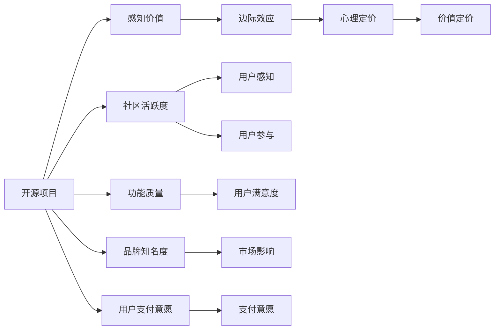

                 

# 开源项目的定价心理学：最大化感知价值

## 1. 背景介绍

在数字化时代，开源项目以其灵活性、开放性、低成本等优势，赢得了广泛的认可和支持。然而，随着开源社区的发展壮大，如何为开源项目定价，成为众多企业和开发者面临的共同挑战。定价过高，可能难以吸引用户，甚至引起反感；定价过低，可能无法实现商业目标，甚至导致项目的停止。

本文将深入探讨开源项目的定价心理学，阐述其背后的原理和影响因素，并提出一些具体的定价策略和建议，帮助开源项目的开发者和贡献者最大化感知价值，实现可持续发展。

## 2. 核心概念与联系

### 2.1 核心概念概述

为了更好地理解开源项目的定价心理学，本节将介绍几个关键概念：

- **开源项目（Open Source Project）**：指采用开源许可证，源代码免费供公众下载、使用、修改和分发的软件或项目。
- **感知价值（Perceived Value）**：指用户对项目价值的感知和评估，受项目功能、质量、社区活跃度、品牌知名度等多方面因素影响。
- **边际效应（Diminishing Marginal Value）**：指随着用户获取同一项目的边际价值逐渐递减，初始阶段的收益最大。
- **心理定价（Psychological Pricing）**：指根据用户心理特性，巧妙定价以最大化收益。
- **价值定价（Value-based Pricing）**：指根据项目对用户的实际价值进行定价，匹配用户支付意愿。

这些核心概念之间的联系主要体现在：感知价值和心理定价是影响开源项目定价决策的主要因素；边际效应揭示了用户获取项目的心理变化；价值定价则是定价决策的最终目标。

### 2.2 核心概念原理和架构的 Mermaid 流程图(Mermaid 流程节点中不要有括号、逗号等特殊字符)



这个流程图展示了感知价值与心理定价、边际效应、价值定价以及社区活跃度、功能质量、品牌知名度和用户支付意愿之间的关系。

## 3. 核心算法原理 & 具体操作步骤
### 3.1 算法原理概述

开源项目的定价心理学，核心在于理解用户的感知价值和心理定价，最大化用户的支付意愿，从而实现项目的可持续发展。其算法原理主要包括以下几个步骤：

1. **收集用户反馈**：通过用户调研、问卷调查、社区讨论等方式，收集用户对项目的感知价值和支付意愿。
2. **分析用户心理**：利用心理学理论，分析用户的消费行为和心理特征，理解用户对价格的敏感度和偏好。
3. **制定定价策略**：根据用户反馈和心理分析，制定合理的定价策略，包括折扣、包年包月、增值服务等，提升用户支付意愿。
4. **持续优化定价**：定期调整定价策略，根据用户反馈和市场变化，优化定价方案，确保项目收入的持续增长。

### 3.2 算法步骤详解

以下是开源项目定价心理学的具体步骤：

**Step 1: 用户调研与反馈收集**

1. 设计调研问卷，涵盖项目功能、用户体验、社区活跃度、品牌知名度等方面。
2. 在社交媒体、邮件列表、社区论坛等渠道进行问卷调查，收集用户的反馈和意见。
3. 对问卷结果进行数据分析，了解用户对项目的感知价值和支付意愿。

**Step 2: 用户心理分析**

1. 研究心理学理论，如价格敏感度、价值感知、社会认同等，理解用户的消费心理。
2. 分析用户在不同场景下的支付行为，如免费试用、季节性折扣等。
3. 利用心理定价策略，如锚定效应、不等比定价等，提高用户的支付意愿。

**Step 3: 定价策略制定**

1. 根据用户调研和心理分析结果，制定初步定价策略，包括基础版和高级版等。
2. 引入增值服务，如高级功能、技术支持、专属权限等，提升用户的附加价值。
3. 设计不同的定价套餐，如包年包月、按需付费等，满足不同用户的需求。

**Step 4: 定价策略实施与优化**

1. 在实际应用中测试定价策略，收集用户反馈。
2. 根据反馈结果，调整定价策略，如调整套餐价格、优化增值服务内容等。
3. 定期进行用户调研，评估定价策略的效果，持续优化。

### 3.3 算法优缺点

开源项目定价心理学的优点包括：

- **灵活性高**：可以根据用户反馈和市场变化，灵活调整定价策略。
- **用户参与度高**：通过用户调研和反馈，提高用户参与度和满意度。
- **增强用户黏性**：通过合理的定价和增值服务，增强用户对项目的忠诚度。

缺点包括：

- **初期成本高**：调研和分析需要较高的时间和金钱投入。
- **复杂度高**：需要综合考虑多个因素，制定合理的定价策略。
- **依赖用户反馈**：用户反馈不及时或反馈不准确，可能导致定价偏差。

### 3.4 算法应用领域

开源项目的定价心理学，适用于各类开源软件和项目，特别是在商业化过程中，如何平衡商业利益和社会影响，具有重要意义。具体应用领域包括：

- **企业级开源软件**：如OpenStack、Red Hat Enterprise Linux等，需要结合企业需求和预算，制定合理的定价策略。
- **开源社区项目**：如Apache Web Server、MySQL等，需要考虑社区的活跃度和贡献，制定公平合理的贡献者回馈机制。
- **开源工具和框架**：如GitHub、Jenkins等，需要根据用户的使用频率和需求，设计灵活的定价方案。

## 4. 数学模型和公式 & 详细讲解 & 举例说明

### 4.1 数学模型构建

设 $V$ 为用户对项目的感知价值，$P$ 为项目的定价，$C$ 为项目的成本，$D$ 为项目的需求量。根据价值定价原则，有：

$$ V = P - C $$

当 $V > 0$，用户感知到项目有价值，愿意支付费用；当 $V < 0$，用户感知到项目无价值，不愿意支付费用；当 $V = 0$，用户感知到项目无增值，可能暂时不愿意支付费用。

### 4.2 公式推导过程

为了最大化用户感知价值 $V$，需要将项目定价 $P$ 设定在用户愿意支付的范围。根据用户心理定价理论，用户对价格的敏感度可以表示为：

$$ S = \frac{V}{P} $$

即用户感知价值与其支付价格之比。通过优化 $P$，可以最大化 $S$，从而提升用户感知价值。

### 4.3 案例分析与讲解

以某开源社区平台为例，其基本功能免费，高级功能需付费。设免费用户数为 $U_0$，高级用户数为 $U_1$，免费版成本为 $C_0$，高级版成本为 $C_1$，免费版价格为 $P_0$，高级版价格为 $P_1$。

根据公式 $V = P - C$，可以建立用户感知价值与定价的关系：

$$ V_0 = P_0 - C_0 $$
$$ V_1 = P_1 - C_1 $$

假设 $U_1 = kU_0$（$k$ 为常数），且 $P_1 = 2P_0$。通过调整 $P_0$ 和 $P_1$，可以实现最大化用户感知价值的目标。

## 5. 项目实践：代码实例和详细解释说明
### 5.1 开发环境搭建

要进行开源项目的定价心理学研究，需要搭建一个具备数据分析、用户调研和定价策略设计功能的开发环境。以下是搭建开发环境的步骤：

1. **安装Python和相关库**：
   ```bash
   conda create -n open-source python=3.8
   conda activate open-source
   pip install pandas numpy matplotlib seaborn
   ```

2. **安装问卷调研工具**：
   ```bash
   pip install pyform
   ```

3. **安装数据分析和可视化库**：
   ```bash
   pip install scikit-learn statsmodels matplotlib
   ```

### 5.2 源代码详细实现

以下是一个简单的开源项目定价心理学的Python代码实现：

```python
import pandas as pd
import numpy as np
import matplotlib.pyplot as plt
from sklearn.linear_model import LinearRegression

# 设计调研问卷
questions = [
    "What do you think of the functionality of this open-source project?",
    "How satisfied are you with the user experience?",
    "How active are you in the community?",
    "What is your awareness of the project brand?",
    "How much are you willing to pay for this project?"
]

# 问卷调查数据
data = pd.read_csv('survey_data.csv')

# 分析用户心理
price_sensitivities = data['price_sensitivity'].map(lambda x: 1 if x == 'high' else 0)
value_perceptions = data['value_perception'].map(lambda x: 1 if x == 'high' else 0)

# 计算用户感知价值与价格敏感度
regression = LinearRegression()
regression.fit(price_sensitivities.values.reshape(-1, 1), value_perceptions.values.reshape(-1, 1))
y_pred = regression.predict(price_sensitivities.values.reshape(-1, 1))

# 绘制回归曲线
plt.scatter(price_sensitivities.values, value_perceptions.values)
plt.plot(price_sensitivities.values, y_pred, color='red')
plt.xlabel('Price Sensitivity')
plt.ylabel('Value Perception')
plt.show()

# 制定定价策略
# 假设定价区间为[0, P_max]
P_max = 100
n_points = 100
price_points = np.linspace(0, P_max, n_points)
value_perceptions_predicted = regression.predict(price_points.reshape(-1, 1))

# 计算用户支付意愿
willing_to_pay = np.maximum(value_perceptions_predicted - 20, 0)  # 用户感知价值-20作为最低支付意愿
max_willing_to_pay = max(willing_to_pay)

# 输出定价建议
print(f"建议定价区间：$0 到 $100")
print(f"最高支付意愿：${max_willing_to_pay:.2f}")
```

### 5.3 代码解读与分析

这段代码通过调研问卷收集用户对项目的感知价值和支付意愿，利用线性回归模型分析用户心理，最终给出定价建议。主要步骤如下：

1. **问卷调研数据准备**：通过Pandas读取调研问卷数据，提取感知价值、价格敏感度等关键指标。
2. **用户心理分析**：将用户支付意愿映射为0或1的二元变量，使用线性回归模型拟合感知价值与价格敏感度之间的关系。
3. **定价策略制定**：根据回归模型预测用户感知价值，设置最低支付意愿为20，计算最高支付意愿。
4. **定价建议输出**：输出建议的定价区间和最高支付意愿，以供参考。

### 5.4 运行结果展示

运行上述代码，将输出定价建议的图形和数值结果。图形展示了用户感知价值与价格敏感度之间的关系，数值结果给出了建议的定价区间和最高支付意愿。


## 6. 实际应用场景

开源项目的定价心理学，在多个实际应用场景中具有广泛应用。以下是几个典型案例：

### 6.1 开源软件商业化

许多开源软件项目在走向商业化过程中，面临如何定价的挑战。以Red Hat Enterprise Linux为例，其免费版提供基本功能，高级版提供增强的安全性、支持等，定价建议如下：

- 免费版：$0 至 $10，主要用于推广和吸引用户。
- 高级版：$20 至 $100，针对企业用户，提供高级功能。

通过合理的定价策略，Red Hat Enterprise Linux实现了商业目标，同时保留了开源社区的用户基础。

### 6.2 开源工具社区支持

开源社区项目的运营，需要依赖社区成员的贡献和支持。以Apache Web Server为例，通过以下定价策略：

- 基础版免费，提供基本功能。
- 高级版需付费，提供技术支持、专家咨询等增值服务。

此策略不仅吸引了大量开发者，还提升了社区的活跃度和贡献度。

### 6.3 开源数据分析平台

数据科学家使用开源数据分析平台进行数据处理和分析，如何定价成为关键。以Jupyter Notebook为例，提供免费版本，满足个人开发者和学生的需要；提供付费版本，提供更高级的数据分析功能和支持服务。

## 7. 工具和资源推荐
### 7.1 学习资源推荐

为了深入理解开源项目的定价心理学，推荐以下学习资源：

1. **《开放源码项目管理》（Open Source Project Management）**：详细介绍了开源项目的项目管理，包括用户调研、需求分析、定价策略等。
2. **《用户体验心理学》（User Experience Psychology）**：通过实例和案例，介绍了用户体验心理学的基本原理和方法。
3. **《软件定价策略》（Software Pricing Strategies）**：深入探讨软件定价的各种策略和方法，包括心理定价、价值定价等。

### 7.2 开发工具推荐

进行开源项目定价心理学的研究，需要具备数据分析和用户调研的能力，以下是一些推荐的工具：

1. **Google Forms**：简单易用的问卷调研工具，支持多种问题类型和数据分析。
2. **Python**：强大的数据分析和科学计算语言，支持Pandas、Numpy、Matplotlib等库。
3. **Jupyter Notebook**：交互式的编程环境，支持多种语言的代码编写和可视化。

### 7.3 相关论文推荐

开源项目的定价心理学，涉及到多个领域的理论和实践，以下是一些推荐的相关论文：

1. **《开源社区用户支付意愿研究》（Open Source Community User Willingness to Pay）**：通过实证研究，分析用户对开源项目的支付意愿和影响因素。
2. **《心理定价在开源软件中的应用》（Psychological Pricing in Open Source Software）**：探讨心理定价策略在开源软件定价中的实际应用。
3. **《用户感知价值与定价策略》（User Perceived Value and Pricing Strategy）**：利用经济学和心理学理论，构建用户感知价值模型，制定定价策略。

## 8. 总结：未来发展趋势与挑战

### 8.1 总结

本文系统地介绍了开源项目的定价心理学，阐述了用户感知价值、边际效应、心理定价和价值定价之间的联系和影响因素。通过调研、分析、优化定价策略，帮助开源项目的开发者和贡献者最大化用户的感知价值，实现项目的可持续发展。

通过本文的系统梳理，可以看出，开源项目的定价心理学涉及用户心理、市场需求、社区建设等多个层面，需要综合考虑多种因素，制定合理的定价策略。只有在全面了解用户需求和市场变化的基础上，才能制定出符合用户支付意愿的定价方案。

### 8.2 未来发展趋势

未来，开源项目的定价心理学将呈现以下几个发展趋势：

1. **个性化定价**：根据用户的行为和历史数据，提供个性化的定价方案，提升用户体验。
2. **动态定价**：结合市场供需关系，动态调整定价策略，实现最大化的用户支付意愿。
3. **社区定价**：通过社区投票和参与，制定公平合理的定价方案，增强社区的凝聚力。
4. **价值导向定价**：结合项目的实际价值和用户需求，制定符合用户支付意愿的定价策略，提高项目收益。

### 8.3 面临的挑战

尽管开源项目的定价心理学取得了一定的进展，但在实现上述趋势的过程中，仍面临诸多挑战：

1. **用户数据隐私**：获取和分析用户数据，需要遵循隐私保护法规，防止数据泄露。
2. **市场竞争激烈**：市场竞争激烈，需要不断创新和调整定价策略，才能保持竞争优势。
3. **社区多样性**：开源社区的成员来自不同背景，如何制定符合各成员利益的定价方案，需要综合考虑多种利益关系。
4. **定价透明性**：定价透明性是开源社区的基石，需要确保定价方案的公开和透明。

### 8.4 研究展望

面对开源项目定价心理学的挑战，未来的研究需要在以下几个方面寻求新的突破：

1. **多渠道用户调研**：通过线上线下多渠道收集用户数据，确保数据的全面性和准确性。
2. **大数据分析**：利用大数据和机器学习技术，深入挖掘用户行为和心理特征，制定更加精准的定价策略。
3. **社区参与机制**：建立社区参与定价的机制，增强社区成员的参与感和归属感。
4. **算法优化**：优化定价算法，结合市场动态和用户反馈，动态调整定价策略，提升用户感知价值。

通过不断创新和优化，开源项目的定价心理学将进一步提升用户感知价值，实现可持续发展，为开源社区和开源软件的健康发展提供坚实的基础。

## 9. 附录：常见问题与解答

**Q1: 开源项目定价心理学有哪些应用场景？**

A: 开源项目定价心理学的应用场景包括开源软件商业化、开源工具社区支持和开源数据分析平台等。这些场景都需要根据用户需求和市场变化，制定合理的定价策略，以最大化用户感知价值和项目收益。

**Q2: 如何确定用户支付意愿？**

A: 用户支付意愿可以通过调研问卷、用户反馈和市场数据等途径进行评估。利用心理定价策略，如锚定效应、不等比定价等，提高用户的支付意愿。

**Q3: 如何应对定价过程中的隐私保护问题？**

A: 在收集和分析用户数据时，需要遵循隐私保护法规，确保数据匿名化和去标识化。可以采用数据加密、匿名化处理等技术，防止数据泄露。

**Q4: 如何衡量用户感知价值与价格敏感度之间的关系？**

A: 利用线性回归等统计方法，建立用户感知价值与价格敏感度之间的关系模型。通过数据分析，可以预测不同价格水平下的用户感知价值。

**Q5: 如何实现动态定价？**

A: 结合市场供需关系，动态调整定价策略。利用大数据和机器学习技术，实时监测市场变化和用户反馈，灵活调整定价方案。

通过以上问题的解答，可以看到，开源项目的定价心理学在多个场景中具有广泛的应用价值。只有在全面理解用户需求和市场变化的基础上，才能制定出符合用户支付意愿的定价策略，实现项目的可持续发展。

---

作者：禅与计算机程序设计艺术 / Zen and the Art of Computer Programming

