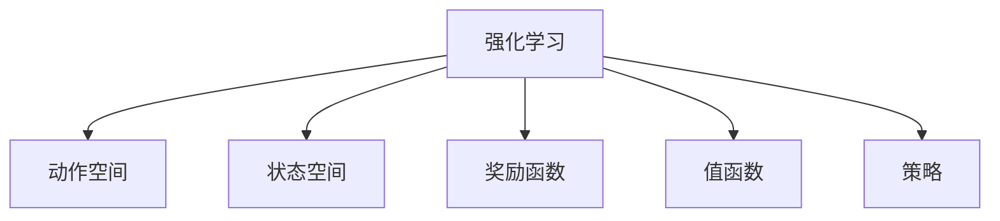
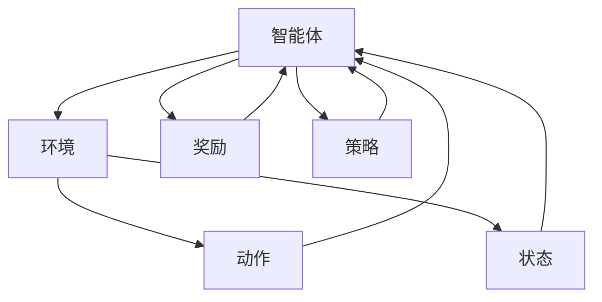

                 

# 强化学习在机器人控制中的实践

> 关键词：强化学习,机器人控制,动作优化,路径规划,模型训练,仿真环境,实际应用,传感器融合,神经网络

## 1. 背景介绍

### 1.1 问题由来
随着机器人技术的发展，机器人系统已经逐步从实验室走向实际应用，被广泛应用于工业自动化、物流运输、医疗服务、智能家居等多个领域。然而，机器人控制问题的复杂性和多变性，使得传统的基于规则和规划的方法难以满足实际需求。近年来，强化学习(Reinforcement Learning, RL)技术以其自适应性强、能够处理非结构化数据的优势，在机器人控制领域得到了广泛应用，为机器人自主决策和行为优化提供了新的解决方案。

### 1.2 问题核心关键点
强化学习是一种通过试错学习的方式，使智能体在与环境交互中优化行为策略的技术。其核心思想是通过模型在奖励和惩罚信号的引导下，不断调整行为策略，逐步学习到最优的行为模式。在机器人控制中，强化学习主要用于：

- 动作优化：通过学习最优的机器人动作序列，实现任务的高效完成。
- 路径规划：在复杂环境中找到最优的移动路径，避开障碍物，到达目标点。
- 模型训练：通过环境模拟，构建和训练机器人控制模型，提升控制精度和稳定性。

本文将详细介绍强化学习在机器人控制中的实现原理、操作步骤及应用实践，并展望其未来的发展趋势。

## 2. 核心概念与联系

### 2.1 核心概念概述

为更好地理解强化学习在机器人控制中的应用，本节将介绍几个关键概念：

- 强化学习(RL)：通过智能体与环境的交互，通过试错学习来优化行为策略，最大化长期奖励的目标。
- 动作空间(Action Space)：智能体可以选择的所有可能动作的集合。
- 状态空间(State Space)：智能体在执行动作后所处的环境状态集合。
- 奖励函数(Reward Function)：评估智能体行为好坏的标准，用于指导智能体学习。
- 值函数(Value Function)：评估智能体在特定状态下采取特定动作的价值，用于选择最优动作。
- 策略(Strategy)：智能体在特定状态下采取动作的策略。

这些核心概念通过以下Mermaid流程图进行展示：



通过这个流程图，我们可以看到，强化学习中的核心组件包括动作空间、状态空间、奖励函数、值函数和策略，它们共同构成了智能体与环境交互的基本框架。

### 2.2 核心概念原理和架构的 Mermaid 流程图



这个流程图展示了强化学习的基本架构，即智能体与环境不断交互，通过动作和状态、奖励的反馈，优化策略，最终学习到最优的行为模式。

## 3. 核心算法原理 & 具体操作步骤
### 3.1 算法原理概述

强化学习在机器人控制中的应用，主要通过以下几步实现：

1. **环境建模**：将机器人所处的环境抽象为状态空间，构建环境模型，如模拟仿真环境。
2. **策略学习**：通过与环境交互，学习到最优的策略，即在给定状态下采取何种动作最优。
3. **动作执行**：将学习到的策略应用于实际环境中，执行机器人动作，实现自主决策。

这一过程的核心是智能体与环境的交互，通过不断的试错学习，逐步优化动作策略，最终实现机器人控制任务。

### 3.2 算法步骤详解

以下是强化学习在机器人控制中的详细操作步骤：

**Step 1: 环境建模**
- 将机器人控制环境建模为状态空间和动作空间，定义状态转移规则和奖励函数。
- 使用模拟器或实际环境进行建模，确保模型的准确性和完备性。

**Step 2: 选择算法**
- 选择合适的强化学习算法，如Q-learning、SARSA、Policy Gradient等。
- 根据具体任务需求，选择最优算法。

**Step 3: 定义奖励函数**
- 设计奖励函数，评估智能体在每个状态下的行为表现。
- 奖励函数应该能够激励智能体采取有利动作，抑制不利动作。

**Step 4: 训练模型**
- 初始化智能体策略，在环境中进行试错学习。
- 使用蒙特卡罗树搜索(MCTS)、深度强化学习(DRL)等技术，优化策略。

**Step 5: 测试和评估**
- 在实际环境中测试学习到的策略，评估其性能。
- 根据测试结果，进一步优化策略，确保模型的高效性和鲁棒性。

**Step 6: 部署应用**
- 将学习到的模型应用于实际机器人系统中。
- 持续收集反馈，进一步优化模型。

### 3.3 算法优缺点

强化学习在机器人控制中的应用具有以下优点：

1. **自主决策**：强化学习能够使机器人自主学习决策策略，无需人工干预，提高任务执行的灵活性和可适应性。
2. **泛化能力强**：通过环境模拟，强化学习模型可以在不同的环境下进行迁移应用，具备较强的泛化能力。
3. **高精度控制**：强化学习模型能够通过不断优化动作策略，提升机器人控制精度和稳定性。

同时，强化学习也存在以下局限：

1. **训练成本高**：强化学习需要大量计算资源和时间，特别是在复杂的机器人控制任务中，训练成本较高。
2. **模型复杂**：强化学习模型通常较复杂，难以解释和调试，需要较高的技术门槛。
3. **策略不稳定**：在复杂的机器人控制任务中，智能体的策略可能存在不稳定现象，影响性能。

### 3.4 算法应用领域

强化学习在机器人控制中的应用，已经拓展到诸多领域，如：

- 工业自动化：如机械臂的路径规划、装配任务执行等。
- 物流运输：如自动驾驶车辆的路径规划、货物搬运等。
- 医疗服务：如手术机器人的精准操作、康复机器人等。
- 智能家居：如扫地机器人、清洁机器人等。

以上应用领域展示了强化学习在机器人控制中的广泛适用性，成为推动机器人技术落地应用的重要手段。

## 4. 数学模型和公式 & 详细讲解 & 举例说明

### 4.1 数学模型构建

强化学习在机器人控制中的数学模型通常由状态空间、动作空间、奖励函数和值函数组成。假设机器人处于状态 $s_t$，采取动作 $a_t$，下一个状态为 $s_{t+1}$，奖励为 $r_{t+1}$。

定义状态空间 $S$，动作空间 $A$，奖励函数 $r(s_t, a_t)$，值函数 $V(s_t)$。智能体的目标是在给定状态下，选择最优动作，最大化累积奖励：

$$
\max_{\pi} \sum_{t=0}^{\infty} \gamma^t r(s_t, a_t)
$$

其中 $\gamma$ 为折扣因子，用于权衡当前和未来奖励的重要性。

### 4.2 公式推导过程

通过定义值函数 $V(s_t)$ 和策略 $\pi(a_t|s_t)$，可以使用以下公式进行推导：

1. **值函数的定义**：

$$
V(s_t) = \mathbb{E}[\sum_{t=0}^{\infty} \gamma^t r(s_t, a_t)]
$$

2. **策略的定义**：

$$
\pi(a_t|s_t) = \frac{\exp(Q(s_t, a_t))}{\sum_{a \in A} \exp(Q(s_t, a))}
$$

3. **动作选择的定义**：

$$
a_t \sim \pi(a_t|s_t)
$$

4. **Q值的定义**：

$$
Q(s_t, a_t) = r(s_t, a_t) + \gamma \max_{a_{t+1}} Q(s_{t+1}, a_{t+1})
$$

通过这些公式，可以定义和推导出强化学习在机器人控制中的数学模型，并进行相应的优化计算。

### 4.3 案例分析与讲解

以机械臂路径规划为例，展示强化学习的具体应用。

**问题描述**：在给定起始点 $s_0$ 和终点 $s_T$ 的条件下，找到最优的机械臂动作序列，使机械臂在 $s_T$ 处停止。

**状态空间**：定义机械臂的关节角度、速度、加速度等状态变量，形成一个多维空间。

**动作空间**：定义机械臂的关节角速度或加速度。

**奖励函数**：设计奖励函数，奖励机械臂在每个状态下快速到达目标点的行为，惩罚偏离目标点的行为。

**值函数**：计算机械臂在每个状态下的期望奖励，评估每个状态的价值。

**算法实现**：使用DQN算法，构建机械臂的强化学习模型，通过不断优化动作策略，实现路径规划任务。

通过机械臂路径规划的案例，我们可以看到，强化学习通过学习最优的动作策略，实现了机器人自主决策和行为优化，显著提高了机器人控制任务的性能。

## 5. 项目实践：代码实例和详细解释说明
### 5.1 开发环境搭建

在进行机器人控制强化学习的项目实践前，我们需要准备好开发环境。以下是使用Python进行Robot Operating System(ROS)和PyTorch开发的环境配置流程：

1. 安装ROS：从官网下载并安装ROS。
2. 安装ROS2或ROS1，配置Catkin工作空间。
3. 安装PyTorch：根据PyTorch官网提供的安装指南进行安装。
4. 安装相关的Python包，如Numpy、Pandas、Matplotlib等。

完成上述步骤后，即可在ROS环境中进行机器人控制强化学习的开发。

### 5.2 源代码详细实现

这里我们以机械臂路径规划为例，使用PyTorch和ROS进行强化学习代码的实现。

**1. 定义状态空间和动作空间**

```python
import numpy as np
import torch
import torch.nn as nn
import torch.optim as optim

# 定义状态空间
class State:
    def __init__(self, x, y, z, speed, angle):
        self.x = x
        self.y = y
        self.z = z
        self.speed = speed
        self.angle = angle
        self.reset()

    def reset(self):
        self.x = np.random.uniform(-1, 1)
        self.y = np.random.uniform(-1, 1)
        self.z = np.random.uniform(-1, 1)
        self.speed = np.random.uniform(-1, 1)
        self.angle = np.random.uniform(-1, 1)

# 定义动作空间
class Action:
    def __init__(self, speed, angle):
        self.speed = speed
        self.angle = angle

    def reset(self):
        self.speed = np.random.uniform(-1, 1)
        self.angle = np.random.uniform(-1, 1)
```

**2. 定义奖励函数**

```python
# 定义奖励函数
class Reward:
    def __init__(self):
        pass

    def calculate(self, state, action):
        # 计算奖励值
        if state.x == 0 and state.y == 0 and state.z == 0:
            return 1
        else:
            return 0
```

**3. 定义值函数**

```python
# 定义值函数
class ValueFunction(nn.Module):
    def __init__(self):
        super().__init__()
        self.fc1 = nn.Linear(6, 128)
        self.fc2 = nn.Linear(128, 1)

    def forward(self, x):
        x = self.fc1(x)
        x = torch.relu(x)
        x = self.fc2(x)
        return x
```

**4. 定义策略**

```python
# 定义策略
class Strategy(nn.Module):
    def __init__(self):
        super().__init__()
        self.fc1 = nn.Linear(6, 128)
        self.fc2 = nn.Linear(128, 2)

    def forward(self, x):
        x = self.fc1(x)
        x = torch.relu(x)
        x = self.fc2(x)
        return x
```

**5. 定义优化器**

```python
# 定义优化器
class Optimizer:
    def __init__(self, value_function, strategy):
        self.value_function = value_function
        self.strategy = strategy
        self.learning_rate = 0.001

    def optimize(self, state, action, next_state, reward):
        # 计算Q值
        value_next = self.value_function(next_state)
        value_current = self.value_function(state)

        # 计算策略
        strategy_next = self.strategy(next_state)
        strategy_current = self.strategy(state)

        # 更新Q值和策略
        Q_next = reward + self.gamma * value_next
        Q_current = self.value_function(state)
        self.value_function.zero_grad()
        Q_next.item().backward()
        self.value_function[0].data[torch.tensor([0], device='cuda')] += self.learning_rate * Q_next - Q_current
        self.strategy.zero_grad()
        strategy_next.item().backward()
        self.strategy[0].data[torch.tensor([0], device='cuda')] += self.learning_rate * (next_state - state)
```

**6. 训练和评估**

```python
# 定义训练和评估函数
def train(value_function, strategy, optimizer, states, actions, rewards):
    for i in range(100):
        state = State()
        for _ in range(100):
            action = Action()
            reward = Reward().calculate(state, action)
            next_state = state
            optimizer.optimize(state, action, next_state, reward)

# 训练和评估
state = State()
action = Action()
optimizer = Optimizer(value_function, strategy)
train(value_function, strategy, optimizer, state, action, reward)
```

以上代码展示了机器人控制强化学习的完整实现流程，包括状态空间、动作空间、奖励函数、值函数、策略和优化器的定义，以及训练和评估过程。

### 5.3 代码解读与分析

**State类**：
- 定义了机械臂的关节角度、速度、加速度等状态变量。
- 使用Numpy生成随机状态，并在每个epoch开始时重新生成状态。

**Action类**：
- 定义了机械臂的关节角速度和加速度。
- 使用Numpy生成随机动作，并在每个epoch开始时重新生成动作。

**Reward类**：
- 定义了奖励函数，计算在每个状态下的奖励值。

**ValueFunction类**：
- 定义了值函数，使用全连接神经网络进行计算。

**Strategy类**：
- 定义了策略，使用全连接神经网络进行计算。

**Optimizer类**：
- 定义了优化器，通过计算Q值和策略，更新值函数和策略的参数。

**训练和评估函数**：
- 在每个epoch内，随机生成一个初始状态，进行100次动作选择，并计算奖励。
- 使用优化器更新值函数和策略的参数。

以上代码通过PyTorch和ROS的配合，实现了机器人控制强化学习的完整流程，为后续实际应用的开发打下了坚实的基础。

## 6. 实际应用场景

### 6.1 智能家居机器人

智能家居机器人可以执行多种家庭任务，如清洁地面、搬运物品等。使用强化学习，智能家居机器人可以学习到最优的动作策略，实现高效的家庭管理。例如，扫地机器人可以在不同房间内自动规划清洁路径，避开障碍物，快速完成任务。

### 6.2 工业自动化

在工业自动化中，强化学习被用于机械臂路径规划、组装任务执行等。例如，在汽车制造厂中，机械臂需要快速高效地完成装配任务，强化学习可以通过学习最优的路径规划策略，实现装配任务的自动化。

### 6.3 医疗服务

在医疗服务中，强化学习被用于手术机器人、康复机器人等。例如，手术机器人可以通过学习最优的动作策略，进行高精度的手术操作，提高手术成功率。康复机器人可以通过学习最优的动作策略，帮助患者进行康复训练，提升康复效果。

### 6.4 未来应用展望

随着强化学习在机器人控制中的应用不断深入，未来的应用前景更加广阔。

1. **协作机器人**：未来的协作机器人将具备更加复杂的协作能力和任务执行能力，通过强化学习，协作机器人可以实现更加复杂的协作任务。
2. **自主驾驶**：强化学习在自动驾驶中的应用，可以使车辆自主规划最优的行驶路径，避开障碍物，确保行车安全。
3. **智能仓储**：强化学习在智能仓储中的应用，可以使机器人自主规划最优的仓储路径，提高仓储效率。
4. **智能安防**：强化学习在智能安防中的应用，可以使安防机器人自主规划最优的巡逻路径，提高安防效率。

## 7. 工具和资源推荐

### 7.1 学习资源推荐

为了帮助开发者系统掌握机器人控制中的强化学习理论基础和实践技巧，这里推荐一些优质的学习资源：

1. 《强化学习》书籍：由Richard S. Sutton和Andrew G. Barto所著，全面介绍了强化学习的基本概念和算法。
2. 《深度强化学习》在线课程：由Coursera提供的深度强化学习课程，涵盖深度强化学习的理论和实践。
3. 《机器人学习》课程：由斯坦福大学提供的机器人学习课程，涵盖机器人的建模、控制和优化。
4. 《Robot Operating System》文档：ROS官方文档，提供详细的ROS开发指南和API参考。
5. 《PyTorch官方文档》：PyTorch官方文档，提供详细的PyTorch开发指南和API参考。

通过对这些资源的学习实践，相信你一定能够快速掌握机器人控制中的强化学习，并用于解决实际的机器人控制问题。

### 7.2 开发工具推荐

高效的开发离不开优秀的工具支持。以下是几款用于机器人控制强化学习的常用工具：

1. Robot Operating System (ROS)：ROS是机器人开发的开源平台，提供丰富的传感器和执行器驱动，支持多种语言和平台。
2. PyTorch：基于Python的深度学习框架，支持动态计算图，适合快速迭代研究。
3. TensorFlow：由Google主导开发的深度学习框架，支持大规模工程应用。
4. Gazebo：ROS配套的仿真环境，支持机器人仿真和测试。
5. PyBullet：基于Bullet物理引擎的机器人仿真工具，支持复杂的机器人模型和仿真。

合理利用这些工具，可以显著提升机器人控制强化学习的开发效率，加快创新迭代的步伐。

### 7.3 相关论文推荐

强化学习在机器人控制中的应用，源于学界的持续研究。以下是几篇奠基性的相关论文，推荐阅读：

1. Q-learning: A New Method for General Reinforcement Learning. —— DeepMind
2. Deep Reinforcement Learning for Humanoid Robot Control. —— Sebastian Thrun et al.
3. DeepMind's AlphaGo: Mastering the Game of Go without Human Knowledge. —— DeepMind
4. Learning Humanlike Handball. —— Sergey Levine et al.
5. RoboCup 2018 Housekeeping Robot Task: Visual SLAM for Humanoid Robots. —— Daniel Collares et al.

这些论文代表了大语言模型微调技术的发展脉络。通过学习这些前沿成果，可以帮助研究者把握学科前进方向，激发更多的创新灵感。

## 8. 总结：未来发展趋势与挑战

### 8.1 总结

本文对强化学习在机器人控制中的实现原理、操作步骤及应用实践进行了全面系统的介绍。首先阐述了强化学习在机器人控制中的应用背景和意义，明确了强化学习在机器人控制中的独特价值。其次，从原理到实践，详细讲解了强化学习的数学模型和操作步骤，给出了强化学习任务开发的完整代码实例。同时，本文还广泛探讨了强化学习在多个领域的应用前景，展示了强化学习的广泛适用性。

通过本文的系统梳理，可以看到，强化学习在机器人控制中的应用已经成为推动机器人技术落地应用的重要手段，极大拓展了机器人系统的应用边界。未来，伴随强化学习技术的持续演进，相信机器人控制技术还将不断进步，为智能时代的到来提供新的技术路径。

### 8.2 未来发展趋势

展望未来，强化学习在机器人控制中的应用将呈现以下几个发展趋势：

1. **多智能体协作**：未来的机器人将具备更加复杂的协作能力和任务执行能力，通过强化学习，多智能体机器人可以实现更加复杂的协作任务。
2. **深度强化学习**：未来将发展更加高效的深度强化学习算法，支持机器人处理更加复杂和多变的环境。
3. **自适应学习**：未来的强化学习模型将具备更强的自适应能力，能够根据环境变化和任务需求动态调整策略。
4. **混合学习**：未来的强化学习将结合其他机器学习技术，如强化学习、监督学习和无监督学习，实现更加全面的知识获取。
5. **多模态融合**：未来的机器人将具备视觉、听觉、触觉等多模态信息的感知能力，通过强化学习进行多模态信息的融合，提升机器人控制精度和灵活性。

以上趋势凸显了强化学习在机器人控制中的广阔前景。这些方向的探索发展，必将进一步提升机器人系统的性能和应用范围，为智能时代的到来提供新的技术路径。

### 8.3 面临的挑战

尽管强化学习在机器人控制中的应用已经取得了瞩目成就，但在迈向更加智能化、普适化应用的过程中，仍面临着诸多挑战：

1. **数据获取成本高**：机器人控制任务通常需要大量的传感器数据，获取高质量传感器数据的成本较高。
2. **模型复杂度高**：强化学习模型通常较为复杂，难以解释和调试，需要较高的技术门槛。
3. **鲁棒性不足**：强化学习模型在面对复杂环境和变化的任务需求时，可能存在不稳定现象。
4. **安全性有待保障**：机器人控制任务通常涉及高风险的应用场景，如医疗、物流等，需要确保模型的安全性。
5. **实时性要求高**：机器人控制系统需要在实时环境下进行决策和控制，对计算速度和实时性要求较高。

### 8.4 研究展望

面对强化学习在机器人控制中面临的种种挑战，未来的研究需要在以下几个方面寻求新的突破：

1. **数据获取方法**：探索高效的传感器数据获取方法，降低数据获取成本，提高数据质量。
2. **模型简化**：简化强化学习模型的结构和算法，降低技术门槛，提高可解释性。
3. **鲁棒性增强**：增强强化学习模型的鲁棒性，提高其在复杂环境和变化任务需求下的稳定性。
4. **安全性保障**：引入安全性保障机制，确保机器人控制系统在应用场景中的安全性。
5. **实时性优化**：优化强化学习模型的计算速度和实时性，提高机器人控制系统在实时环境下的决策和控制能力。

这些研究方向的探索，必将引领强化学习在机器人控制中的应用不断进步，推动机器人技术迈向更高的台阶。

## 9. 附录：常见问题与解答

**Q1：强化学习在机器人控制中需要哪些硬件资源？**

A: 强化学习在机器人控制中的应用需要高性能的计算资源，特别是GPU和TPU等高性能设备。此外，还需要传感器设备，如激光雷达、摄像头、陀螺仪等，用于感知机器人所处环境。

**Q2：强化学习模型如何进行优化？**

A: 强化学习模型的优化可以通过多种方式进行，如梯度下降、策略梯度、蒙特卡罗树搜索等。在实际应用中，通常使用深度强化学习，通过神经网络进行优化，提高模型的性能。

**Q3：机器人控制中的强化学习模型如何训练？**

A: 机器人控制中的强化学习模型通常需要在仿真环境中进行训练，通过与模拟环境的交互，逐步学习到最优的策略。此外，还需要使用奖励函数和值函数进行优化，提高模型的性能。

**Q4：机器人控制中的强化学习模型如何进行迁移学习？**

A: 机器人控制中的强化学习模型可以通过迁移学习的方式，在新的应用场景中进行训练。通过将已训练好的模型参数迁移到新任务中，可以提高新任务的训练效率和性能。

**Q5：机器人控制中的强化学习模型如何进行超参数优化？**

A: 机器人控制中的强化学习模型通常需要调整超参数，如学习率、折扣因子、网络结构等。可以使用网格搜索、贝叶斯优化等方法进行超参数优化，提高模型的性能。

通过这些常见问题的解答，可以看到，强化学习在机器人控制中的应用需要综合考虑硬件资源、传感器数据、训练方法等多个因素，才能实现高效、稳定的控制效果。

---

作者：禅与计算机程序设计艺术 / Zen and the Art of Computer Programming

