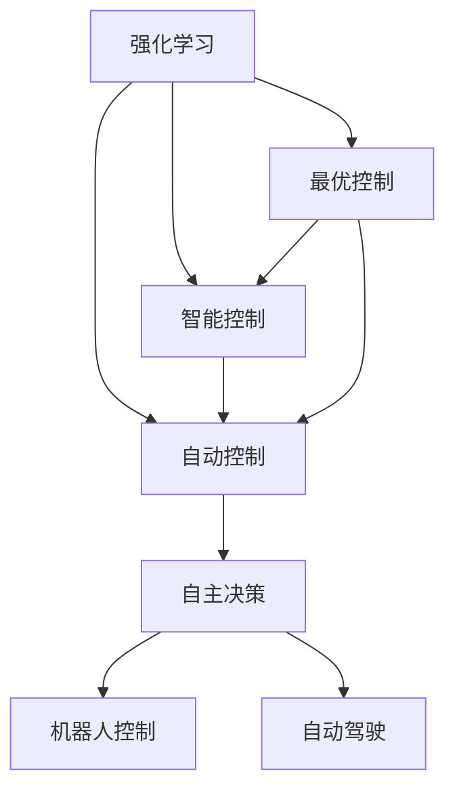

                 

# 强化学习在自动控制中的应用

> 关键词：强化学习,自动控制,最优控制,智能控制,自主决策,机器人控制,自动驾驶

## 1. 背景介绍

### 1.1 问题由来

强化学习（Reinforcement Learning, RL）作为一门基于试错学习（Trial and Error Learning）的学科，近年来在自动控制领域取得了长足的发展。自动控制系统的核心任务是确保控制对象（如机器人、无人机、自动驾驶车辆）的动态行为稳定可靠，但传统的控制策略依赖于对控制对象模型的精确描述和先验知识，难以应对复杂多变的外界环境。强化学习通过不断试错，逐步优化控制策略，在无需精确模型和先验知识的情况下，实现了对动态环境的高效适应和自主决策。

### 1.2 问题核心关键点

强化学习在自动控制中的应用主要体现在以下几个关键点：

- **环境建模**：强化学习将控制对象及其环境视为一个动态系统，通过与环境的交互学习最优策略。
- **试错学习**：强化学习通过不断试错，逐步优化控制策略，实现自主决策。
- **自主决策**：强化学习不需要精确模型和先验知识，能够根据环境变化自主调整控制策略。
- **多模态融合**：强化学习可以融合视觉、听觉等多种传感器信息，实现对复杂环境的感知。
- **学习效率**：强化学习通过自适应学习率等技术，快速优化控制策略，提升学习效率。

## 2. 核心概念与联系

### 2.1 核心概念概述

为更好地理解强化学习在自动控制中的应用，本节将介绍几个密切相关的核心概念：

- **强化学习（Reinforcement Learning, RL）**：通过与环境的交互，学习最优策略的学科。强化学习的主要目标是最大化累积奖励，即在一定的环境状态下，采取最优的行动以获得最大的总奖励。

- **自动控制（Automatic Control）**：通过控制算法，对系统进行自动调节和控制，确保系统动态行为稳定可靠。

- **最优控制（Optimal Control）**：以数学规划的方式，寻求控制系统的最优策略。

- **智能控制（Intelligent Control）**：结合人工智能技术，实现自动控制的智能化、自主化。

- **自主决策（Autonomous Decision Making）**：在无需人类干预的情况下，系统能够自主选择行动，应对复杂环境。

- **机器人控制（Robot Control）**：将强化学习应用于机器人运动控制，提升其自主性和灵活性。

- **自动驾驶（Autonomous Driving）**：通过强化学习实现车辆自主导航和决策，保障行车安全。

这些核心概念之间的逻辑关系可以通过以下Mermaid流程图来展示：



这个流程图展示出强化学习在自动控制中的核心概念及其之间的关系：

1. 强化学习通过与环境的交互学习最优策略。
2. 自动控制通过控制算法调节系统，确保动态行为稳定。
3. 最优控制以数学规划的方式求解最优策略。
4. 智能控制结合人工智能技术实现智能化、自主化。
5. 自主决策使系统能够自主选择行动，应对复杂环境。
6. 强化学习应用于机器人控制，提升自主性和灵活性。
7. 强化学习实现自动驾驶，保障行车安全。

## 3. 核心算法原理 & 具体操作步骤

### 3.1 算法原理概述

强化学习在自动控制中的应用，主要通过模型预测、价值函数和策略优化三个步骤实现。具体来说，强化学习代理（Agent）在每个时间步(t)，根据当前状态(s)采取行动(a)，并获得环境反馈奖励(r)和下一个状态(s')。代理的目标是最大化累积奖励总和。

算法的核心在于如何构建策略(policy)和价值函数(value function)。策略指定在每个状态下应采取的行动，而价值函数评估状态和行动的价值。通过策略优化算法，不断调整策略和价值函数，使得代理能够更好地适应环境。

### 3.2 算法步骤详解

强化学习在自动控制中的应用，一般包括以下几个关键步骤：

**Step 1: 环境建模**

- 定义环境（Environment），包括状态空间(S)、动作空间(A)和奖励函数(R)。
- 状态空间描述控制对象的状态，动作空间描述可采取的行动，奖励函数评估每个行动的即时奖励。

**Step 2: 策略选择与优化**

- 选择策略(policy)，如贪心策略、ε-greedy策略、Q-Learning等。
- 通过蒙特卡洛方法、Q-learning、SARSA等算法，不断优化策略，学习最优策略。

**Step 3: 价值函数评估**

- 使用蒙特卡洛方法、TD-error等评估策略的价值，更新价值函数。
- 通过价值函数评估，进一步优化策略。

**Step 4: 模型训练**

- 使用自监督学习方法，如深度强化学习（Deep RL），训练策略和价值函数。
- 通过深度网络构建策略，优化模型参数，提升学习效率。

**Step 5: 策略评估**

- 在验证集上评估策略性能，选择最佳策略。
- 在实际控制对象上部署最优策略，进行实时控制。

### 3.3 算法优缺点

强化学习在自动控制中的应用具有以下优点：

- 自适应性强：不需要精确模型和先验知识，能够自主适应动态环境。
- 学习效率高：通过试错学习，快速优化控制策略。
- 鲁棒性强：能够在复杂多变的环境中稳定运行。
- 应用广泛：适用于各种类型的控制系统，如机器人、车辆、无人机等。

同时，该方法也存在以下局限性：

- 学习过程较长：需要大量的环境交互数据，学习过程耗时。
- 策略空间复杂：在大型状态和动作空间中，搜索最优策略难度大。
- 状态表示困难：如何有效地表示高维状态空间，是关键挑战。
- 数据噪声影响：环境噪声可能导致学习不稳定。

尽管存在这些局限性，但就目前而言，强化学习仍是大规模控制系统优化的重要手段。未来相关研究的重点在于如何进一步提高学习效率、优化策略表示、减少数据噪声等，以进一步提升强化学习在自动控制中的应用效果。

### 3.4 算法应用领域

强化学习在自动控制中的应用，涵盖了机器人控制、自动驾驶、智能电网、化工过程控制等多个领域，具体示例如下：

- **机器人控制**：通过强化学习，机器人能够自主学习最优的运动策略，实现自主导航、避障、抓取等任务。
- **自动驾驶**：在自动驾驶汽车中，强化学习能够学习最优的驾驶策略，实现自主导航、路径规划、交通避障等。
- **智能电网**：通过强化学习，智能电网能够自适应电力负荷，优化能源分配，提高电网效率。
- **化工过程控制**：在化工生产中，强化学习能够优化生产过程，提高产品质量和生产效率。

除了上述这些经典领域外，强化学习在自动控制中的应用还在不断扩展，如水文监测、农业自动化、医疗机器人等，为传统行业的智能化转型提供了新的解决方案。随着强化学习技术的不断发展，相信其将在更广阔的应用领域发挥重要作用。

## 4. 数学模型和公式 & 详细讲解 & 举例说明

### 4.1 数学模型构建

在强化学习中，我们将控制对象和环境视为一个动态系统。设状态空间为 $S$，动作空间为 $A$，奖励函数为 $R$，策略为 $π$，则强化学习的数学模型可以表示为：

- 状态转移方程：$s'=f(s,a)$
- 奖励函数：$r=r(s,a)$
- 策略：$π(a|s)=P(a|s,π)$

其中，$f$ 为状态转移函数，$r$ 为奖励函数，$π$ 为策略函数。

### 4.2 公式推导过程

以下我们以Q-Learning算法为例，推导其核心公式。

Q-Learning算法通过学习状态-动作对价值函数 $Q(s,a)$，最大化累计奖励。设 $Q(s,a)$ 为状态 $s$ 和动作 $a$ 的Q值，则Q-Learning算法的更新公式为：

$$
Q(s,a) \leftarrow Q(s,a) + α(r + γ\max_{a'}Q(s',a') - Q(s,a))
$$

其中 $α$ 为学习率，$γ$ 为折扣因子，表示未来奖励的权重。该公式的意义在于，在每个时间步 $t$，代理通过当前状态 $s_t$ 采取动作 $a_t$，获得即时奖励 $r_t$ 和下一个状态 $s_{t+1}$，计算Q值的更新量，并在每次更新时，考虑未来的奖励，进行策略优化。

### 4.3 案例分析与讲解

我们以自动驾驶车辆的路径规划为例，分析强化学习的应用。在自动驾驶中，车辆的路径规划是一个典型的强化学习问题。车辆的状态可以表示为当前位置、速度、方向等信息，动作可以表示为加速度、转向角度等。车辆的目标是安全、高效地到达目的地。

具体实现中，可以将自动驾驶环境建模为状态空间和动作空间，奖励函数设计为到达目的地的距离和速度的函数。在每个时间步，车辆根据当前状态采取动作，并获得即时奖励和下一个状态。通过Q-Learning算法，车辆能够逐步优化路径规划策略，达到最优的行驶路线。

## 5. 项目实践：代码实例和详细解释说明

### 5.1 开发环境搭建

在进行强化学习实践前，我们需要准备好开发环境。以下是使用Python进行PyTorch开发的环境配置流程：

1. 安装Anaconda：从官网下载并安装Anaconda，用于创建独立的Python环境。

2. 创建并激活虚拟环境：
```bash
conda create -n pytorch-env python=3.8 
conda activate pytorch-env
```

3. 安装PyTorch：根据CUDA版本，从官网获取对应的安装命令。例如：
```bash
conda install pytorch torchvision torchaudio cudatoolkit=11.1 -c pytorch -c conda-forge
```

4. 安装OpenAI Gym：用于创建和模拟强化学习环境。
```bash
pip install gym
```

5. 安装TensorBoard：用于可视化模型训练过程和结果。
```bash
pip install tensorboard
```

完成上述步骤后，即可在`pytorch-env`环境中开始强化学习实践。

### 5.2 源代码详细实现

这里我们以Q-Learning算法在Gym环境中训练控制对象为例，给出完整的代码实现。

首先，安装OpenAI Gym库，创建一个模拟环境：

```python
import gym
import gym_frozenlake

env = gym.make('FrozenLake-v0')
```

然后，定义Q-Learning算法的核心函数：

```python
import numpy as np

def q_learning(env, num_episodes=2000, discount_factor=0.9, learning_rate=0.8, epsilon=0.1):
    num_states = env.observation_space.n
    num_actions = env.action_space.n
    Q = np.zeros([num_states, num_actions])

    for _ in range(num_episodes):
        state = env.reset()
        done = False
        while not done:
            action = np.argmax(Q[state] + epsilon * np.random.randn(num_actions)) if np.random.uniform() < epsilon else np.random.choice(num_actions)
            next_state, reward, done, _ = env.step(action)
            Q[state, action] += learning_rate * (reward + discount_factor * np.max(Q[next_state]) - Q[state, action])
            state = next_state

    return Q
```

接下来，使用Q-Learning算法训练环境，并输出最终Q值：

```python
q_values = q_learning(env)
print(q_values)
```

以上就是使用PyTorch对Q-Learning算法在Gym环境中进行自动控制对象训练的完整代码实现。可以看到，借助Gym库，我们可以很方便地创建和模拟各种强化学习环境，并通过Q-Learning算法对环境进行自主决策训练。

### 5.3 代码解读与分析

让我们再详细解读一下关键代码的实现细节：

**环境创建**：
- `gym.make('FrozenLake-v0')`：创建FrozenLake环境，这是一个经典的4x4网格世界，目标是走到目标位置。

**Q-Learning算法**：
- 初始化Q值表 `Q = np.zeros([num_states, num_actions])`：将Q值表初始化为全0。
- 每次迭代，从环境重置状态，并根据策略采取动作，直到终止状态或到达目标位置：
  - `state = env.reset()`：重置环境，获取初始状态。
  - `done = False`：设置是否终止标志。
  - 在每个时间步，根据当前状态采取动作：
    - `action = np.argmax(Q[state] + epsilon * np.random.randn(num_actions)) if np.random.uniform() < epsilon else np.random.choice(num_actions)`：在当前状态下，采取动作，利用ε-greedy策略进行探索和利用。
    - `next_state, reward, done, _ = env.step(action)`：执行动作，获取下一个状态、即时奖励和是否终止标志。
    - `Q[state, action] += learning_rate * (reward + discount_factor * np.max(Q[next_state]) - Q[state, action])`：根据Q值更新公式，更新Q值表。
    - `state = next_state`：更新当前状态。

**训练过程**：
- 通过多次迭代，不断优化Q值表，最终得到最优的Q值表。

可以看到，PyTorch配合Gym库使得Q-Learning算法的实现变得简洁高效。开发者可以将更多精力放在算法改进和模型优化上，而不必过多关注底层实现细节。

当然，工业级的系统实现还需考虑更多因素，如模型的保存和部署、超参数的自动搜索、更灵活的策略表示等。但核心的强化学习范式基本与此类似。

## 6. 实际应用场景

### 6.1 智能机器人控制

强化学习在智能机器人控制中的应用，可以显著提升机器人的自主性和灵活性。传统机器人控制依赖于精确的物理模型和控制算法，难以应对动态环境。而强化学习通过与环境的交互学习最优策略，能够实现机器人在复杂环境中的自主决策。

在技术实现上，可以设计机器人控制环境，如机械臂抓取、无人车导航等，在每个时间步，机器人根据当前状态采取动作，并获得即时奖励和下一个状态。通过强化学习算法，机器人能够逐步优化控制策略，实现自主导航、避障、抓取等任务。

### 6.2 自动驾驶

强化学习在自动驾驶中的应用，可以实现车辆的自主决策和路径规划。车辆的状态可以表示为当前位置、速度、方向等信息，动作可以表示为加速度、转向角度等。车辆的目标是安全、高效地到达目的地。

在实际应用中，可以设计自动驾驶环境，如Simulator中车辆的控制模拟，在每个时间步，车辆根据当前状态采取动作，并获得即时奖励和下一个状态。通过强化学习算法，车辆能够逐步优化路径规划策略，达到最优的行驶路线。

### 6.3 智能电网

强化学习在智能电网中的应用，可以实现电网的自适应优化。智能电网的状态可以表示为电力负荷、发电容量等信息，动作可以表示为发电策略、输电策略等。电网的目标是优化电力分配，提高效率和稳定性。

在实际应用中，可以设计智能电网环境，如电力市场模拟，在每个时间步，电网根据当前状态采取动作，并获得即时奖励和下一个状态。通过强化学习算法，电网能够逐步优化发电和输电策略，提高电网的效率和稳定性。

### 6.4 未来应用展望

随着强化学习技术的不断发展，其在自动控制中的应用前景将更加广阔。未来，强化学习将进一步应用于更多垂直行业，如医疗机器人、农业自动化、工业生产等，为各行各业带来智能化转型的新机遇。

在医疗领域，强化学习可以用于手术机器人的操作控制，提升手术的精度和安全性。在农业领域，强化学习可以优化农业机械的作业路径，提高农业生产效率。在工业生产中，强化学习可以优化生产线调度，提升生产效率和产品质量。

## 7. 工具和资源推荐
### 7.1 学习资源推荐

为了帮助开发者系统掌握强化学习在自动控制中的应用，这里推荐一些优质的学习资源：

1. 《强化学习：原理与实践》系列博文：由大模型技术专家撰写，深入浅出地介绍了强化学习的核心原理、算法实现和应用案例。

2. 斯坦福大学《CS234: Reinforcement Learning》课程：斯坦福大学开设的强化学习课程，提供了丰富的学习资源和实验平台，是学习强化学习的绝佳资源。

3. 《Reinforcement Learning: An Introduction》书籍：由Richard Sutton和Andrew Barto合著，全面介绍了强化学习的理论基础和应用实例。

4. OpenAI Gym：一个用于创建和模拟强化学习环境的库，提供了多种经典环境，方便开发者进行实验和研究。

5. PyTorch官方文档：PyTorch官方文档提供了详细的API说明和示例代码，是学习PyTorch的必备资源。

6. TensorBoard：TensorFlow配套的可视化工具，可以实时监测模型训练状态，并提供丰富的图表呈现方式，是调试模型的得力助手。

通过对这些资源的学习实践，相信你一定能够快速掌握强化学习在自动控制中的应用，并用于解决实际的自动控制问题。

### 7.2 开发工具推荐

高效的开发离不开优秀的工具支持。以下是几款用于强化学习开发的常用工具：

1. PyTorch：基于Python的开源深度学习框架，灵活动态的计算图，适合快速迭代研究。
2. TensorFlow：由Google主导开发的开源深度学习框架，生产部署方便，适合大规模工程应用。
3. OpenAI Gym：一个用于创建和模拟强化学习环境的库，提供了多种经典环境，方便开发者进行实验和研究。
4. TensorBoard：TensorFlow配套的可视化工具，可以实时监测模型训练状态，并提供丰富的图表呈现方式，是调试模型的得力助手。
5. Weights & Biases：模型训练的实验跟踪工具，可以记录和可视化模型训练过程中的各项指标，方便对比和调优。
6. PyTorch Lightning：一个用于快速搭建和训练深度学习模型的库，支持多种模型和训练策略。

合理利用这些工具，可以显著提升强化学习任务的开发效率，加快创新迭代的步伐。

### 7.3 相关论文推荐

强化学习在自动控制中的应用源于学界的持续研究。以下是几篇奠基性的相关论文，推荐阅读：

1. Reinforcement Learning: An Introduction by Richard Sutton and Andrew Barto：奠定了强化学习理论基础，是学习强化学习的必读之作。

2. Deep Reinforcement Learning for Decision Making: Towards Generalization and Sample Efficiency by Richard Sutton and A. Guez：介绍了深度强化学习的理论和方法，为自动控制领域带来了新的突破。

3. Curiosity-Driven Exploration in a High-Dimensional Robot Motor Control Task by B. Thrun et al.：通过强化学习实现了机器人自主运动控制，展示了强化学习在机器人控制中的应用潜力。

4. Human-Driving Simulation Using Reinforcement Learning by B. Treutel et al.：通过强化学习实现了自动驾驶车辆的自主决策和路径规划，展示了强化学习在自动驾驶中的应用。

5. Reinforcement Learning for a Smart Energy Network with Renewable Energy Sources by P. Vrioni et al.：通过强化学习实现了智能电网的自适应优化，展示了强化学习在智能电网中的应用。

这些论文代表了大规模控制系统优化领域的研究进展，通过学习这些前沿成果，可以帮助研究者把握学科前进方向，激发更多的创新灵感。

## 8. 总结：未来发展趋势与挑战

### 8.1 总结

本文对强化学习在自动控制中的应用进行了全面系统的介绍。首先阐述了强化学习在自动控制中的研究背景和意义，明确了强化学习在自动控制中的独特价值。其次，从原理到实践，详细讲解了强化学习的核心算法和操作步骤，给出了强化学习任务开发的完整代码实例。同时，本文还广泛探讨了强化学习在智能机器人、自动驾驶、智能电网等多个领域的应用前景，展示了强化学习范式的巨大潜力。此外，本文精选了强化学习的各类学习资源，力求为读者提供全方位的技术指引。

通过本文的系统梳理，可以看到，强化学习在自动控制中的应用正在逐步成熟，成为解决复杂控制系统优化问题的有力工具。未来，伴随强化学习技术的不断发展，其在自动控制中的应用前景将更加广阔，为各行业带来智能化转型的新机遇。

### 8.2 未来发展趋势

展望未来，强化学习在自动控制中的应用将呈现以下几个发展趋势：

1. 模型复杂度提升：随着计算能力的提升，强化学习模型将逐步从简单的Q-Learning发展到深度强化学习、强化学习网络（Reinforcement Learning Network, RLN）等，具备更强的适应性和学习能力。

2. 多模态融合：强化学习可以融合视觉、听觉、触觉等多种传感器信息，实现对复杂环境的全面感知，提高决策的准确性和鲁棒性。

3. 模型泛化能力增强：通过迁移学习、元学习等技术，强化学习模型能够更好地适应新环境，提升泛化能力。

4. 学习效率提高：通过自适应学习率、模型压缩等技术，强化学习模型能够更快地优化策略，提高学习效率。

5. 系统可靠性提升：通过对抗训练、异常检测等技术，强化学习系统能够更好地应对恶意攻击和环境扰动，提高系统的稳定性和鲁棒性。

6. 人机协同增强：通过人机交互设计，强化学习系统能够更好地理解人类意图，提高人机协同效率。

以上趋势凸显了强化学习在自动控制中的广阔前景。这些方向的探索发展，必将进一步提升强化学习模型的性能和应用范围，为各行业带来智能化转型的新机遇。

### 8.3 面临的挑战

尽管强化学习在自动控制中的应用已经取得了显著进展，但在迈向更加智能化、普适化应用的过程中，它仍面临着诸多挑战：

1. 环境建模复杂：强化学习依赖于精确的环境建模，但在复杂多变的环境下，建模难度大。

2. 学习效率低：强化学习需要大量的环境交互数据，学习过程耗时。

3. 策略空间大：在大型状态和动作空间中，搜索最优策略难度大。

4. 数据噪声影响：环境噪声可能导致学习不稳定。

5. 模型泛化能力不足：在大规模环境中，模型泛化能力有限。

6. 系统可靠性低：强化学习系统可能存在脆弱点，容易受到恶意攻击。

7. 人机协同困难：强化学习系统难以理解人类意图，影响人机协同效率。

正视强化学习面临的这些挑战，积极应对并寻求突破，将是其走向成熟的必由之路。相信随着学界和产业界的共同努力，这些挑战终将一一被克服，强化学习必将在构建智能系统的过程中发挥越来越重要的作用。

### 8.4 研究展望

面对强化学习在自动控制中的应用所面临的挑战，未来的研究需要在以下几个方面寻求新的突破：

1. 环境建模自动化：通过强化学习自动建模，减少人工建模的复杂度。

2. 学习效率提升：通过自适应学习率、模型压缩等技术，提高学习效率。

3. 多模态融合：融合视觉、听觉、触觉等多种传感器信息，实现对复杂环境的全面感知。

4. 模型泛化能力增强：通过迁移学习、元学习等技术，提高模型的泛化能力。

5. 系统可靠性提高：通过对抗训练、异常检测等技术，提高系统的稳定性和鲁棒性。

6. 人机协同设计：通过人机交互设计，提高人机协同效率。

这些研究方向的探索，必将引领强化学习在自动控制中的应用迈向更高的台阶，为构建智能系统带来新的突破。面向未来，强化学习需要与其他人工智能技术进行更深入的融合，如知识表示、因果推理、强化学习等，多路径协同发力，共同推动智能系统的进步。只有勇于创新、敢于突破，才能不断拓展强化学习模型的边界，让智能技术更好地造福人类社会。

## 9. 附录：常见问题与解答

**Q1：强化学习在自动控制中的应用是否依赖于精确的环境建模？**

A: 强化学习在自动控制中的应用确实依赖于精确的环境建模。一个精确的环境模型能够提供对系统状态和动作的准确描述，使得代理能够更好地理解环境，并做出最优的决策。然而，在实际应用中，环境建模的复杂度往往非常高，且难以获得准确的物理模型。为了克服这一挑战，近年来越来越多的研究致力于环境建模的自动化和近似建模，以提高强化学习的可应用性和效果。

**Q2：强化学习在自动控制中的学习效率如何？**

A: 强化学习在自动控制中的学习效率较低，需要大量的环境交互数据进行训练。在实际应用中，通常通过模拟环境进行训练，以减少真实环境中的交互次数。此外，通过自适应学习率和模型压缩等技术，可以显著提升强化学习的学习效率，减少训练时间。

**Q3：强化学习在自动控制中的策略空间复杂，如何应对？**

A: 在自动控制中，状态和动作空间往往非常复杂，难以在有限的时间内找到最优策略。为了应对这一挑战，通常采用启发式搜索、采样优化等技术，以快速搜索策略空间，找到近似最优策略。此外，结合深度学习等技术，可以提升策略空间表示和搜索效率，进一步优化强化学习的性能。

**Q4：强化学习在自动控制中的应用是否适用于各种类型的控制系统？**

A: 强化学习在自动控制中的应用主要适用于动态环境下的复杂控制系统，如机器人、自动驾驶车辆等。然而，对于一些静态环境下的简单控制系统，传统的控制算法如PID等可能更为适用。因此，在实际应用中，需要根据具体控制系统的特点，选择合适的控制方法。

**Q5：强化学习在自动控制中的应用是否需要人类干预？**

A: 强化学习在自动控制中的应用通常不需要人类干预，通过与环境的交互进行自主学习和决策。然而，在某些情况下，人类干预是必要的，如在关键操作或决策环节，需要人工监督和介入，以确保系统的安全性和可靠性。

**Q6：强化学习在自动控制中的应用是否存在伦理和安全问题？**

A: 强化学习在自动控制中的应用确实存在伦理和安全问题。强化学习模型可能会学习到有害的行为或策略，导致安全风险。因此，在设计强化学习系统时，需要考虑到伦理和安全问题，进行相应的监督和限制。此外，通过对抗训练等技术，可以提高系统的鲁棒性和安全性，减少伦理和安全风险。

这些问题的解答，能够帮助开发者更好地理解强化学习在自动控制中的应用，避免在实际应用中遇到常见的问题。通过本文的系统梳理，相信你一定能够快速掌握强化学习在自动控制中的应用，并用于解决实际的自动控制问题。

