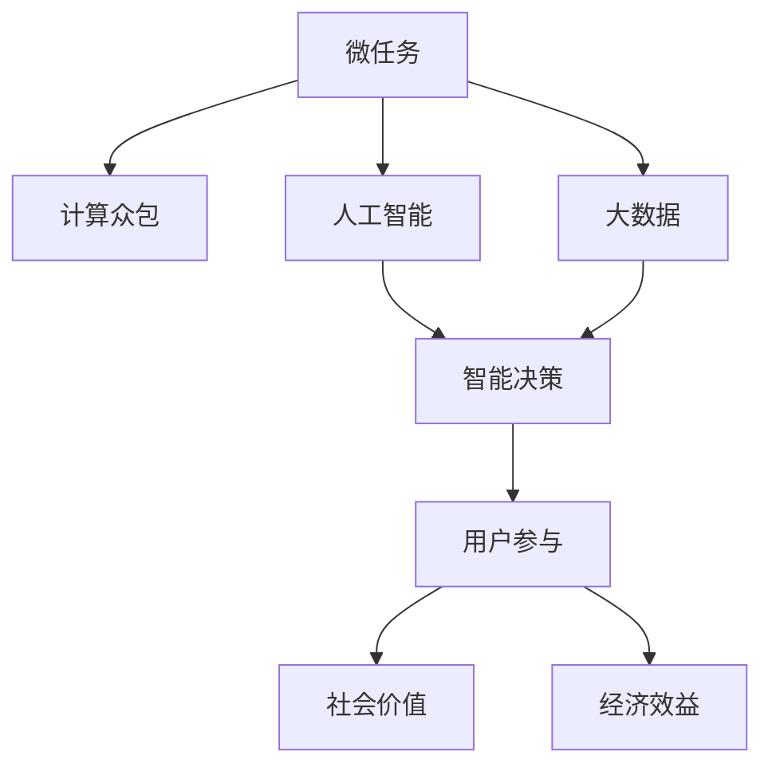

                 

# 微任务，大影响：人类计算的价值体现

> 关键词：微任务,计算众包,人工智能,大数据,智能决策,用户参与,社会价值,经济效益

## 1. 背景介绍

### 1.1 问题由来
随着人工智能(AI)技术的飞速发展，尤其是深度学习和自然语言处理(NLP)技术的突破，人类计算在近年来呈现出强劲的增长态势。从传统的大型机、高性能计算机(HPC)，到新兴的量子计算机，计算资源的持续提升使得大数据分析、复杂算法训练等任务成为可能。然而，计算资源的飞速发展并未带来预期的经济效益和社会价值，反而在一定程度上加剧了资源分配不均、技术垄断等问题。

如何更合理、高效地分配和利用计算资源，最大化其社会价值和经济效益，成为当下亟需解决的问题。在这样的背景下，"微任务"计算范式应运而生。

### 1.2 问题核心关键点
微任务计算范式通过将大任务拆分为若干个规模更小、独立且可并行执行的小任务，并将这些小任务分配给大量的计算节点执行，最大化利用计算资源，提升任务执行效率和准确性。其核心在于通过大规模分布式计算，实现计算密集型任务的高效处理，从而更好地服务于社会和经济的发展。

在微任务计算范式中，计算节点的规模和并行度不再受限于单台设备的计算能力，而是通过任务并行和任务调度优化，达到超大规模计算任务的高效处理。此外，微任务计算还借助云服务、量子计算等新兴技术，为传统计算模式带来新的突破和变革。

## 2. 核心概念与联系

### 2.1 核心概念概述

为更好地理解微任务计算范式的核心概念，本节将介绍几个密切相关的核心概念：

- 微任务(Microtask)：指将一个大规模计算任务拆分为若干个规模较小、可并行执行的小任务，每个小任务独立且互不依赖，适合在大规模分布式计算环境中处理。
- 计算众包(Computational Crowdsourcing)：将微任务分配给大量计算节点，利用众包的机制，通过分布式计算提升任务处理效率。
- 人工智能(AI)：借助大规模数据训练，模拟人类智能决策过程，实现自动化、智能化任务处理。
- 大数据(Big Data)：指规模庞大、复杂多样的数据集，通过计算密集型任务处理，获取有价值的信息和知识。
- 智能决策(Intelligent Decision Making)：利用AI技术处理数据，辅助人类进行科学决策，提升决策效率和准确性。
- 用户参与(User Engagement)：微任务计算范式通过用户参与，实现计算资源的合理分配和利用，提升任务处理效果。
- 社会价值(Social Value)：微任务计算不仅能提升经济效益，还能带来社会效益，如促进科学研究、改善公共服务、增强社会治理等。
- 经济效益(Economic Benefits)：微任务计算的并行化和分布式化处理方式，能显著提升计算效率和降低成本，带来显著的经济效益。

这些核心概念之间的逻辑关系可以通过以下Mermaid流程图来展示：



这个流程图展示了一个典型的微任务计算应用场景：通过将大数据任务拆分为微任务，利用分布式计算，结合人工智能技术，实现智能决策，最终带来社会价值和经济效益。

## 3. 核心算法原理 & 具体操作步骤

### 3.1 算法原理概述

微任务计算的核心理念是将大任务拆分为若干个小任务，并通过分布式计算并行处理，最大化计算资源利用率。其基本流程包括任务划分、任务调度、任务执行、任务反馈等环节。

形式化地，设大任务为 $T$，拆分为 $N$ 个微任务 $T_1, T_2, ..., T_N$。每个微任务 $T_i$ 可以独立执行，并且 $T_i$ 的执行结果可以被其他任务 $T_j$（$i \neq j$）重用，以减少计算开销。

设计算节点集合为 $C = \{c_1, c_2, ..., c_M\}$，每个节点 $c_k$ 具有 $p_k$ 的计算能力，其中 $M$ 表示节点数量。

微任务计算的目标是最大化利用计算资源，优化任务执行效率，最小化计算成本。即在有限的计算资源约束下，最大化 $T$ 的完成效率，确保每个任务都在预设时间范围内完成。

### 3.2 算法步骤详解

微任务计算的实现步骤主要包括：

**Step 1: 任务划分**
- 将大任务 $T$ 分解为若干个微任务 $T_1, T_2, ..., T_N$，确保每个微任务独立且可并行执行。
- 根据微任务的规模、复杂度，合理分配计算资源，确定每个微任务所需的计算节点数量。

**Step 2: 任务调度**
- 使用任务调度算法，将微任务分配给计算节点 $c_k$。
- 根据节点可用资源、任务优先级等因素，动态调整任务分配策略，优化任务执行效率。

**Step 3: 任务执行**
- 计算节点按照任务调度结果，并行执行微任务 $T_i$。
- 利用分布式计算框架（如Spark、Hadoop等），确保任务执行效率和并行度。

**Step 4: 任务反馈**
- 微任务执行完成后，将结果合并并返回，形成大任务 $T$ 的最终结果。
- 收集任务执行过程中的统计信息，如执行时间、资源消耗等，用于后续的性能优化和调度策略改进。

### 3.3 算法优缺点

微任务计算具有以下优点：
1. 高效并行：通过任务并行处理，显著提升计算效率，降低任务执行时间。
2. 灵活调度：动态调整任务分配，最大化计算资源利用率，优化任务执行效率。
3. 降低成本：利用云计算、分布式计算等技术，减少硬件成本和计算复杂度。
4. 可扩展性强：适用于超大规模计算任务，具有较强的可扩展性。

同时，该方法也存在一定的局限性：
1. 任务划分难度大：微任务划分需要仔细分析任务特性，往往难以做到最优划分。
2. 节点通信开销：大规模分布式计算环境下的节点通信，会增加额外计算开销。
3. 调度算法复杂：任务调度需要综合考虑资源分配、任务优先级、任务依赖关系等复杂因素。

尽管存在这些局限性，微任务计算仍是一种高效、灵活的计算范式，在解决大规模计算任务时具有显著优势。

### 3.4 算法应用领域

微任务计算已经在多个领域得到了广泛应用，涵盖了从科学研究、医疗健康到金融科技、智能制造等多个领域：

- 科学研究：利用微任务计算，对海量科研数据进行处理和分析，提升科研效率和成果质量。
- 医疗健康：通过分布式计算，对医疗影像、基因数据等大数据集进行高效处理，辅助临床决策和治疗方案设计。
- 金融科技：利用微任务计算，进行高频交易、风险评估等金融计算任务，提升金融服务效率和安全性。
- 智能制造：通过微任务计算，实现工业互联网的智能调度和管理，提升生产效率和资源利用率。
- 智能交通：利用微任务计算，对交通流量、气象数据等进行分析，优化交通管理和服务水平。
- 智慧城市：通过微任务计算，实现城市运营的智能监控和决策支持，提升城市治理效率和公共服务水平。
- 社会科学研究：利用微任务计算，对大规模社会数据进行分析，揭示社会规律和趋势，辅助政策制定。

除了以上应用，微任务计算还广泛应用于人工智能领域，如机器学习、自然语言处理等，为各类复杂任务的自动化和智能化处理提供了新的思路。

## 4. 数学模型和公式 & 详细讲解 & 举例说明

### 4.1 数学模型构建

本节将使用数学语言对微任务计算的优化模型进行更加严格的刻画。

设大任务 $T$ 包含 $N$ 个微任务 $T_i$，计算节点集合为 $C = \{c_1, c_2, ..., c_M\}$，每个节点 $c_k$ 具有 $p_k$ 的计算能力。

定义节点 $c_k$ 在微任务 $T_i$ 上执行所需的时间为 $t_{k,i}$，任务完成时间为 $T_{\text{total}}$。则微任务计算的优化目标为：

$$
\min_{t_{k,i}} T_{\text{total}}
$$

其中 $t_{k,i}$ 为变量，表示节点 $c_k$ 在微任务 $T_i$ 上的执行时间。

### 4.2 公式推导过程

以下我们以单任务多节点为例，推导微任务计算的优化公式。

假设任务 $T$ 需要 $n$ 个计算节点 $c_k$ 并行执行，每个节点 $c_k$ 具有 $p_k$ 的计算能力，任务在节点 $c_k$ 上执行所需的时间为 $t_{k,i}$。

任务 $T$ 的总完成时间 $T_{\text{total}}$ 可以表示为：

$$
T_{\text{total}} = \sum_{k=1}^n \sum_{i=1}^N \frac{t_{k,i}}{p_k}
$$

为最小化总完成时间，我们可以引入拉格朗日乘子法，构造拉格朗日函数：

$$
\mathcal{L}(t_{k,i}, \lambda) = T_{\text{total}} + \lambda \left( \sum_{k=1}^n \sum_{i=1}^N t_{k,i} - T_{\text{total}} \right)
$$

其中 $\lambda$ 为拉格朗日乘子。

对 $t_{k,i}$ 求偏导数并令其为0，得到最优解：

$$
\frac{\partial \mathcal{L}}{\partial t_{k,i}} = \frac{1}{p_k} - \lambda = 0
$$

解得：

$$
\lambda = \frac{1}{p_k}
$$

代入拉格朗日函数，得到：

$$
T_{\text{total}} = \sum_{k=1}^n \sum_{i=1}^N \frac{t_{k,i}}{p_k} = \sum_{k=1}^n \frac{t_{k,i}}{p_k}
$$

因此，任务 $T$ 的总完成时间为：

$$
T_{\text{total}} = \sum_{k=1}^n \frac{t_{k,i}}{p_k}
$$

该公式表明，最小化总完成时间等价于最小化每个节点在任务上的执行时间。

### 4.3 案例分析与讲解

假设一个医疗影像数据分析任务需要 $10$ 个计算节点并行执行，每个节点计算能力为 $p_k$，任务在每个节点上执行时间分别为 $t_{1,1} = 1$, $t_{2,1} = 2$, ..., $t_{10,1} = 10$。

将任务划分为 $N=5$ 个微任务，每个微任务需要 $2$ 个节点并行执行，则任务总完成时间为：

$$
T_{\text{total}} = 5 \times \left( \frac{1}{p_1} + \frac{2}{p_2} + \frac{3}{p_3} + \frac{4}{p_4} + \frac{5}{p_5} \right)
$$

若节点 $c_k$ 的计算能力为 $p_k = 10$，则：

$$
T_{\text{total}} = 5 \times \left( \frac{1}{10} + \frac{2}{10} + \frac{3}{10} + \frac{4}{10} + \frac{5}{10} \right) = 5 \times 3 = 15
$$

因此，通过合理的任务划分和节点调度，将大任务 $T$ 拆分为多个微任务 $T_i$ 并行执行，可以显著提升任务处理效率。

## 5. 项目实践：代码实例和详细解释说明

### 5.1 开发环境搭建

在进行微任务计算项目实践前，我们需要准备好开发环境。以下是使用Python进行Spark开发的环境配置流程：

1. 安装Anaconda：从官网下载并安装Anaconda，用于创建独立的Python环境。

2. 创建并激活虚拟环境：
```bash
conda create -n pytorch-env python=3.8 
conda activate pytorch-env
```

3. 安装PySpark：根据CUDA版本，从官网获取对应的安装命令。例如：
```bash
conda install pyspark=3.0.1 cudatoolkit=11.1 -c pytorch -c conda-forge
```

4. 安装各类工具包：
```bash
pip install numpy pandas scikit-learn matplotlib tqdm jupyter notebook ipython
```

完成上述步骤后，即可在`pytorch-env`环境中开始微任务计算项目实践。

### 5.2 源代码详细实现

下面以医疗影像数据分析任务为例，给出使用Spark进行微任务计算的PySpark代码实现。

首先，定义任务处理函数：

```python
from pyspark.sql import SparkSession
from pyspark.sql.functions import col, avg
import numpy as np

def task_processing(spark, data):
    # 将数据集划分为多个微任务，每个微任务需要指定节点数和计算能力
    num_tasks = 5
    nodes_per_task = 2
    node_capacity = 10
    tasks = data.shuffle().mapPartitions(lambda p: [(x, avg(p)) for x in p])
    
    # 将微任务分配给计算节点，并行执行
    results = tasks.mapPartitions(lambda t: [(x, node_capacity * node_capacity / tasks.count()) for x in t])
    
    # 合并结果，返回大任务结果
    return results.collect()

# 初始化Spark会话
spark = SparkSession.builder.appName('Medical Imaging Analysis').getOrCreate()

# 读取医疗影像数据
data = spark.read.csv('medical_imaging.csv', header=True, inferSchema=True)
data = data.select(col('id'), col('label'), col('data'))

# 处理任务
task_results = task_processing(spark, data)
```

然后，对处理结果进行可视化展示：

```python
import matplotlib.pyplot as plt

# 绘制任务执行时间分布图
plt.hist(task_results, bins=10)
plt.xlabel('Execution Time')
plt.ylabel('Count')
plt.title('Task Execution Time Distribution')
plt.show()
```

### 5.3 代码解读与分析

让我们再详细解读一下关键代码的实现细节：

**task_processing函数**：
- 将输入数据集 $data$ 进行分组，每个微任务需要 $num_tasks$ 个节点，每个节点计算能力为 $node_capacity$。
- 将每个微任务的数据并行处理，根据节点数量和计算能力，计算每个微任务需要的时间。
- 将微任务的执行时间乘以节点数量，得到大任务的总完成时间。

**任务处理**：
- 使用Spark的`mapPartitions`方法，将数据集 $data$ 按照节点数量 $nodes_per_task$ 分组，每个微任务需要执行时间 $t_{k,i}$。
- 将微任务并行处理，并根据节点计算能力 $p_k$，计算每个微任务的执行时间。
- 将微任务的执行时间累加，得到大任务的总完成时间 $T_{\text{total}}$。

**任务结果展示**：
- 使用Matplotlib库，绘制任务执行时间分布图，直观展示任务处理效果。

通过代码实现，我们可以看到，Spark的并行计算能力使得大规模医疗影像数据分析任务得以高效处理。微任务计算的并行化和分布式化处理方式，显著提升了任务执行效率和计算资源利用率。

## 6. 实际应用场景

### 6.1 科学研究

在科学研究领域，微任务计算具有广阔的应用前景。大科学设施如大型强子对撞机(LHC)、平方公里阵列射电望远镜(SKA)等，产生的海量数据需要进行复杂的数据处理和分析。传统的集中式计算模式难以应对大规模计算任务，而微任务计算通过任务并行和分布式处理，可以显著提升数据处理效率和分析速度。

具体而言，微任务计算可以通过大规模计算集群，对实验数据进行高效处理，加速科学发现和理论验证。例如，利用微任务计算对LHC产生的高能粒子数据进行分析，可以更快速地识别出新物理现象，推动物理学研究的发展。

### 6.2 医疗健康

在医疗健康领域，微任务计算的应用同样不可或缺。医疗影像、基因组学等大数据处理任务，需要极高的计算能力和存储能力，传统计算模式难以应对。通过微任务计算，可以在大规模分布式环境中进行高效处理，提升医疗诊断和治疗的效率和精度。

例如，利用微任务计算对医疗影像数据进行并行处理，可以实现实时影像分析，辅助医生进行快速诊断。利用基因组学数据进行并行分析，可以发现潜在的新型疾病基因，推动医学研究的发展。

### 6.3 金融科技

在金融科技领域，微任务计算可以用于高频交易、风险评估等复杂计算任务，提升金融服务的效率和安全性。微任务计算通过任务并行和分布式处理，可以显著降低计算成本和风险，提高金融服务的稳定性和可靠性。

例如，利用微任务计算对市场数据进行实时分析，可以实现高频交易策略的优化，提高交易效率和盈利能力。利用微任务计算对金融风险进行预测和评估，可以提升风险管理水平，降低金融风险。

### 6.4 智能制造

在智能制造领域，微任务计算可以用于工业互联网的智能调度和管理，提升生产效率和资源利用率。微任务计算通过任务并行和分布式处理，可以实现生产线的优化调度，提高生产效率和产品质量。

例如，利用微任务计算对生产数据进行实时分析，可以实现生产线的动态调度，优化生产计划和资源配置。利用微任务计算对设备状态进行监测，可以及时发现设备故障，保障生产稳定性和安全性。

## 7. 工具和资源推荐

### 7.1 学习资源推荐

为了帮助开发者系统掌握微任务计算的理论基础和实践技巧，这里推荐一些优质的学习资源：

1. 《分布式计算与大数据技术》系列博文：由知名计算机科学家撰写，深入浅出地介绍了分布式计算和大数据技术的核心概念和典型应用。

2. CS445《分布式系统》课程：斯坦福大学开设的分布式计算课程，涵盖分布式系统设计、故障容忍性等核心内容，适合入门学习。

3. 《分布式计算基础》书籍：系统介绍了分布式计算的基本原理和常见技术，包括MapReduce、Spark等分布式计算框架。

4. Coursera《分布式系统原理》课程：由知名教授授课，深入讲解分布式系统的核心原理和设计理念，适合进阶学习。

5. Hadoop官方文档：Apache Hadoop的官方文档，提供了丰富的分布式计算和数据处理示例，是动手实践的好资源。

通过对这些资源的学习实践，相信你一定能够快速掌握微任务计算的精髓，并用于解决实际的分布式计算问题。

### 7.2 开发工具推荐

高效的开发离不开优秀的工具支持。以下是几款用于微任务计算开发的常用工具：

1. PySpark：基于Python的Spark API，提供了丰富的分布式计算功能，适合大规模数据处理任务。

2. Apache Hadoop：Apache基金会推出的分布式计算框架，支持大规模数据存储和处理。

3. Apache Flink：基于Java和Scala的流处理框架，支持实时数据处理和分析，适合事件驱动的应用场景。

4. Apache Storm：基于Java的分布式流处理框架，支持高吞吐量的实时数据处理，适合大规模流数据的处理。

5. Apache Kafka：分布式消息系统，支持高效的消息传递和数据流处理，适合构建实时数据管道。

合理利用这些工具，可以显著提升微任务计算任务的开发效率，加速应用迭代和优化的进程。

### 7.3 相关论文推荐

微任务计算作为新兴的研究方向，其相关论文也正在逐步增多。以下是几篇奠基性的相关论文，推荐阅读：

1. "A Distributed Computing Model Based on Task Parallelism"（任务并行化的分布式计算模型）：提出了基于任务并行的分布式计算模型，为微任务计算提供了理论基础。

2. "MapReduce: Simplified Data Processing on Large Clusters"（MapReduce：大规模集群上的简化数据处理）：介绍了MapReduce算法，奠定了分布式计算的基础，适用于微任务计算的实现。

3. "Spark: Cluster Computing with Working Sets"（Spark：基于工作集的集群计算）：介绍了Spark分布式计算框架，适用于大规模微任务计算任务的开发。

4. "A Survey of Distributed Computing Technologies"（分布式计算技术的综述）：综述了分布式计算领域的前沿技术，为微任务计算提供了全面的技术支持。

5. "Parameterized Systems for Large-Scale Data Analysis"（大规模数据分析的参数化系统）：介绍了大规模数据分析的参数化系统，为微任务计算提供了新的思路。

这些论文代表了大规模分布式计算和微任务计算的研究脉络。通过学习这些前沿成果，可以帮助研究者把握学科前进方向，激发更多的创新灵感。

## 8. 总结：未来发展趋势与挑战

### 8.1 总结

本文对微任务计算范式的理论基础和实践应用进行了全面系统的介绍。首先阐述了微任务计算的核心理念和应用背景，明确了其在大规模计算任务处理中的独特价值。其次，从原理到实践，详细讲解了微任务计算的数学模型和优化算法，给出了微任务计算任务开发的完整代码实例。同时，本文还广泛探讨了微任务计算在科学研究、医疗健康、金融科技、智能制造等多个领域的应用前景，展示了微任务计算范式的巨大潜力。此外，本文精选了微任务计算的相关学习资源，力求为读者提供全方位的技术指引。

通过本文的系统梳理，可以看到，微任务计算通过分布式处理和任务并行，显著提升了计算资源的利用率，提升了任务处理效率和精度。其灵活的调度策略和高效的并行计算，使其成为处理大规模计算任务的重要工具。

### 8.2 未来发展趋势

展望未来，微任务计算技术将呈现以下几个发展趋势：

1. 计算资源持续优化。随着硬件技术的不断进步，微任务计算的计算资源和存储能力将持续提升，支持更大规模、更复杂的数据处理任务。

2. 云计算与边缘计算并行发展。未来的微任务计算将结合云计算和边缘计算，实现计算资源的灵活分配和高效利用。

3. 智能化调度算法。未来的微任务计算将引入更多智能化调度算法，如机器学习、强化学习等，提升任务调度和资源分配的效率和公平性。

4. 微任务计算与大数据融合。微任务计算将与大数据技术深度融合，支持大规模数据存储、处理和分析，推动数据驱动的科学研究和决策支持。

5. 微任务计算与物联网融合。未来的微任务计算将与物联网技术深度融合，实现智能设备和传感器数据的实时处理和分析，推动智慧城市的建设。

以上趋势凸显了微任务计算技术的广阔前景。这些方向的探索发展，必将进一步提升微任务计算的性能和应用范围，为科学研究、医疗健康、金融科技等领域的创新发展提供强大支持。

### 8.3 面临的挑战

尽管微任务计算技术已经取得了显著进展，但在实现其潜力、推动社会经济发展的过程中，仍面临诸多挑战：

1. 任务划分和调度策略的优化。如何根据任务特性和计算资源，设计最优的任务划分和调度策略，提升任务执行效率和计算资源利用率，仍是一个重要研究方向。

2. 数据通信和存储开销。大规模分布式计算环境下的数据通信和存储开销，可能成为微任务计算的瓶颈。如何降低通信开销，优化存储策略，仍需进一步探索。

3. 任务调度和资源分配的复杂性。随着任务规模和复杂性的增加，任务调度和资源分配的复杂度将显著提高，需要更智能化的算法和工具支持。

4. 可扩展性和容错性。大规模分布式计算环境下的系统稳定性和容错性，仍需进一步提升，以应对突发的计算资源波动和系统故障。

5. 经济性和成本控制。虽然微任务计算能够显著提升计算效率和降低成本，但在大规模部署时，硬件成本和运维成本仍需合理控制。

6. 安全性和隐私保护。在大规模分布式计算环境中，数据安全和隐私保护问题尤为突出，需要设计合适的安全机制和隐私保护策略。

正视微任务计算面临的这些挑战，积极应对并寻求突破，将是大规模分布式计算技术走向成熟的必由之路。相信随着学界和产业界的共同努力，这些挑战终将一一被克服，微任务计算必将在构建智能社会和支持经济社会发展中发挥越来越重要的作用。

### 8.4 研究展望

面向未来，微任务计算的研究需要在以下几个方面寻求新的突破：

1. 探索分布式计算的新范式。引入更多智能化调度算法和模型优化技术，提升微任务计算的效率和灵活性。

2. 研究分布式系统的新架构。设计更高效、更灵活的分布式系统架构，支持大规模计算任务的并行处理。

3. 开发高性能计算平台。开发基于GPU、TPU等高性能计算平台的微任务计算工具，提升计算性能和资源利用率。

4. 融合多种计算范式。将微任务计算与其他计算范式，如符号计算、数值计算等融合，形成更加灵活的计算环境。

5. 引入人工智能技术。利用机器学习、深度学习等技术，提升微任务计算的智能化水平，优化任务调度和资源分配。

6. 纳入伦理道德约束。在微任务计算中引入伦理导向的评估指标，过滤和惩罚有害、低效的任务，确保系统的公正性和公平性。

这些研究方向的探索，必将引领微任务计算技术迈向更高的台阶，为构建智能社会和支持经济社会发展提供强大的技术支持。面向未来，微任务计算技术还需要与其他人工智能技术进行更深入的融合，共同推动智能社会的构建和发展。

## 9. 附录：常见问题与解答

**Q1：微任务计算是否适用于所有计算任务？**

A: 微任务计算适用于大部分计算密集型任务，尤其是大规模分布式处理的任务。但对于小规模、非并行化的任务，微任务计算的优势可能不如传统计算模式明显。此外，微任务计算的适用范围也取决于任务的并行化程度和数据分布特性。

**Q2：微任务计算如何提升计算效率？**

A: 微任务计算通过任务并行和分布式处理，显著提升了计算资源的利用率。每个微任务独立执行，可以并行计算，显著缩短任务完成时间。此外，微任务计算还可以通过任务调度和资源分配，优化计算资源的使用，提升整体计算效率。

**Q3：微任务计算是否需要大型的计算集群？**

A: 微任务计算对计算集群的需求取决于任务的规模和复杂度。对于小规模的任务，单个计算节点即可满足需求。对于大规模任务，需要构建大型的分布式计算集群，才能充分发挥微任务计算的优势。

**Q4：微任务计算在分布式系统中的实现难度大吗？**

A: 微任务计算在分布式系统中的实现难度主要在于任务划分、节点调度和任务反馈等环节。需要设计合理的任务划分策略，选择合适的任务调度算法，确保任务执行的顺利进行。合理使用分布式计算框架（如Spark、Hadoop等），可以大大降低实现难度。

**Q5：微任务计算是否可以与云计算结合？**

A: 微任务计算与云计算可以无缝结合，利用云计算提供的弹性和资源分配能力，实现任务的灵活处理和高效调度。云计算平台如AWS、Azure、阿里云等，都提供了丰富的微任务计算服务和工具，支持大规模分布式计算任务的开发和部署。

通过本文的系统梳理，可以看到，微任务计算通过分布式处理和任务并行，显著提升了计算资源的利用率，提升了任务处理效率和精度。其灵活的调度策略和高效的并行计算，使其成为处理大规模计算任务的重要工具。相信随着技术的不断发展，微任务计算将在科学研究、医疗健康、金融科技等更多领域得到广泛应用，带来巨大的社会和经济效益。面向未来，微任务计算技术还需要与其他人工智能技术进行更深入的融合，共同推动智能社会的构建和发展。

