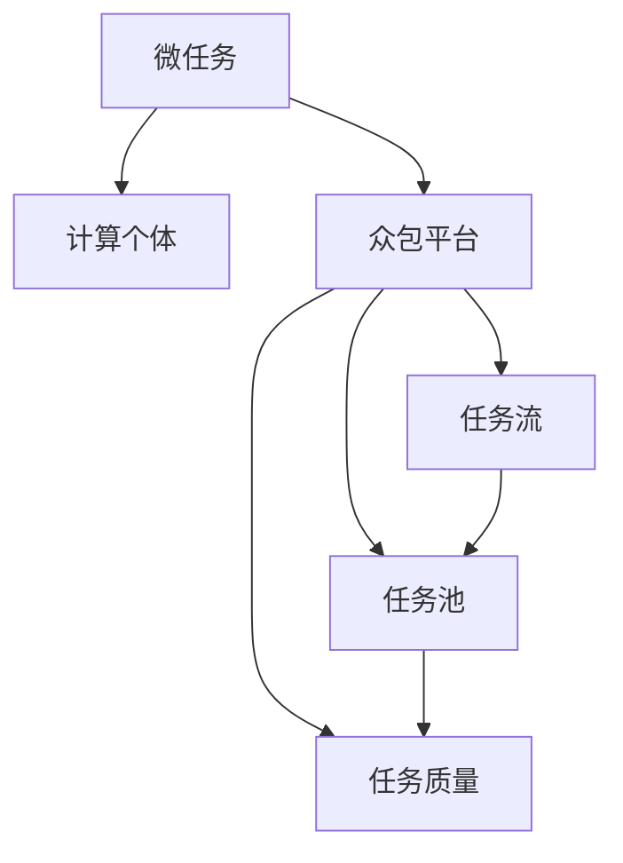

                 

## 1. 背景介绍

在现代计算领域，人类计算（Human Computation）已经成为一种重要且越来越受关注的数据获取方式。基于计算的众包平台，如Amazon Mechanical Turk、CrowdFlower等，为数据标注、图像分类、文本标注等任务提供了大量廉价且高效的数据来源。随着这些平台的普及，大量数据标注任务正以“微任务”的形式被分发到全球成千上万的计算个体手中，从而形成了庞大的人类计算网络。

### 1.1 问题由来

计算众包平台的出现，大大降低了数据获取的成本，使得大规模数据标注成为可能。这些平台通常将大任务分解为若干简单的“微任务”，并分配给成千上万的计算个体完成。每个个体只需要在几分钟内完成简单的任务，就可以获得报酬。这种方法不仅大大降低了任务完成的时间和成本，还显著提升了任务的质量和多样性。

然而，随着任务数量的激增，平台对数据标注的效率和质量提出了更高的要求。如何更好地管理和调度这些微任务，使之充分发挥人类计算的潜力，成为一个重要的研究方向。为此，本文将对人类计算中的微任务调度和管理进行详细探讨，以期为计算众包平台的优化和实际应用提供参考。

### 1.2 问题核心关键点

人类计算的核心在于通过众包平台将大任务分解为微任务，充分利用全球计算个体的劳动力资源。这一过程涉及任务分解、微任务调度、质量控制、报酬分配等多个环节。

- **任务分解**：将大任务分解为可执行的微任务，并合理分配给计算个体。
- **微任务调度**：根据计算个体的能力和工作时间，高效调度微任务，最大化计算资源利用率。
- **质量控制**：对微任务的完成结果进行审核和验证，保证任务质量。
- **报酬分配**：根据微任务的完成情况和计算个体的表现，公平分配报酬。

这些关键点构成了人类计算的基础框架，通过合理设计和优化这些环节，可以显著提升平台的数据获取效率和质量。

## 2. 核心概念与联系

### 2.1 核心概念概述

为更好地理解人类计算中的微任务调度和管理，本节将介绍几个密切相关的核心概念：

- **微任务(Microtask)**：人类计算的基本单位，通常为几秒钟到几分钟的任务，如数据标注、图像分类、文本校验等。
- **计算个体(Computational Worker)**：拥有计算能力和工作时间的个体，如学生、家庭主妇、自由职业者等，他们通过平台提交任务并获得报酬。
- **众包平台(Crowdsourcing Platform)**：为计算个体提供任务分发和报酬支付的平台，如Amazon Mechanical Turk、CrowdFlower等。
- **任务流(Task Flow)**：微任务的组合，形成完整的任务流程，从任务接收、调度、执行到审核、支付的全过程。
- **任务池(Task Pool)**：待执行的微任务集合，由平台实时维护，根据任务状态自动调整任务优先级和调度策略。
- **任务质量(Quality of Task)**：任务的准确性和质量，通常由平台对完成结果进行审核确定。

这些核心概念之间的逻辑关系可以通过以下Mermaid流程图来展示：



这个流程图展示了大规模人类计算中微任务的生成、分发、执行、审核、支付的全过程：

1. 微任务由平台生成并存入任务池。
2. 计算个体从任务池中领取任务。
3. 计算个体执行微任务。
4. 平台对任务结果进行审核。
5. 平台支付完成任务的报酬。

这些环节构成了人类计算的核心逻辑，通过设计合理的调度和管理机制，可以有效地提升平台的任务执行效率和数据质量。

## 3. 核心算法原理 & 具体操作步骤

### 3.1 算法原理概述

人类计算中的微任务调度，本质上是一个多目标优化问题。目标是最大化任务完成数量和质量，同时最小化平台的运营成本和个体工作负担。常见的调度算法包括贪心算法、启发式算法和优化算法，如遗传算法、蚁群算法等。

基于贪心算法的微任务调度流程如下：

1. **任务生成**：根据任务需求，动态生成微任务，并存入任务池。
2. **个体领取**：计算个体随机从任务池中领取任务。
3. **执行反馈**：计算个体完成任务并提交结果，平台对结果进行审核，并反馈执行情况。
4. **任务分配**：平台根据执行情况，调整任务优先级，将任务重新分配给合适个体。
5. **报酬支付**：平台对完成的任务进行报酬支付。

基于启发式算法的微任务调度流程如下：

1. **任务生成**：同上。
2. **个体评估**：平台对个体历史表现进行评估，计算其能力指数和工作时间。
3. **任务调度**：根据个体能力指数和工作时间，动态调整任务分配权重。
4. **执行反馈**：同上。
5. **任务分配**：根据执行情况，调整任务分配权重，优化任务分配策略。
6. **报酬支付**：同上。

基于优化算法的微任务调度流程如下：

1. **任务生成**：同上。
2. **个体评估**：同上。
3. **任务调度**：通过遗传算法、蚁群算法等优化算法，找到最优任务分配策略。
4. **执行反馈**：同上。
5. **任务分配**：根据执行情况，动态调整任务分配策略，确保任务高效完成。
6. **报酬支付**：同上。

### 3.2 算法步骤详解

以基于贪心算法的微任务调度为例，其详细步骤如下：

1. **任务生成**：平台根据任务需求，动态生成微任务，并存储到任务池中。
2. **个体领取**：计算个体随机从任务池中领取任务，领取顺序通常为先来先服务。
3. **执行反馈**：计算个体完成任务并提交结果，平台对结果进行审核，并反馈执行情况。审核包括正确性、一致性、完备性等多个维度。
4. **任务分配**：根据执行情况，平台调整任务优先级，将未完成的任务重新分配给合适个体。未完成的任务优先分配给表现较好的个体。
5. **报酬支付**：平台对完成的任务进行报酬支付，报酬根据任务的难度和个体表现进行调整。

### 3.3 算法优缺点

基于贪心算法的微任务调度具有以下优点：

- 简单易实现，适用于任务种类较少且变化不大的场景。
- 任务执行速度较快，能够在短时间内完成大量微任务。
- 对个体历史表现依赖较小，适合新个体加入。

同时，基于贪心算法的微任务调度也存在以下缺点：

- 任务优先级分配较为简单，难以充分利用个体能力。
- 对于复杂任务或高难度任务，可能存在任务积压现象。
- 对个体的评估较为单一，可能无法全面反映个体的真实能力。

### 3.4 算法应用领域

人类计算中的微任务调度广泛应用于以下领域：

- **数据标注**：大规模数据标注任务，如文本分类、图像识别等，通常通过计算众包平台进行。
- **图像校验**：大规模图像数据校验任务，如街景图像标注、医学图像标注等，通常通过计算众包平台进行。
- **语音识别**：大规模语音识别任务，如语音转文本、语音分类等，通常通过计算众包平台进行。
- **自然语言处理**：大规模自然语言处理任务，如语言模型训练、文本摘要等，通常通过计算众包平台进行。
- **计算仿真**：大规模计算仿真任务，如天气模拟、粒子仿真等，通常通过计算众包平台进行。

这些领域的大规模计算任务，都需要通过微任务调度和平台管理，才能高效完成。基于贪心、启发式和优化算法，平台可以根据实际需求和任务特点，设计合理的微任务调度策略。

## 4. 数学模型和公式 & 详细讲解 & 举例说明

### 4.1 数学模型构建

为了更好地量化微任务调度过程，本节将建立一个数学模型来描述人类计算中的微任务调度问题。

设任务池中有 $N$ 个微任务，计算个体有 $M$ 个，每个微任务需要的时间为 $t_i$，个体在单位时间内的完成效率为 $e_j$，个体 $j$ 在时间 $t$ 前可工作的时间为 $T_j$，个体 $j$ 对任务 $i$ 的估价为 $v_{ij}$。

目标函数为：
$$
\text{Maximize} \quad \sum_{i=1}^N \sum_{j=1}^M v_{ij} \cdot e_j \cdot \min(t_i, T_j)
$$

约束条件为：
$$
\begin{cases}
\sum_{i=1}^N \min(t_i, T_j) \leq T_j, \quad \forall j=1,...,M \\
\sum_{j=1}^M e_j = 1
\end{cases}
$$

第一个约束条件表示每个个体在单位时间内最多只能完成一个微任务。第二个约束条件表示所有个体的总完成效率为1。

### 4.2 公式推导过程

为了简化计算，我们对目标函数和约束条件进行求解。首先，对目标函数进行转换：

$$
\text{Maximize} \quad \sum_{i=1}^N \sum_{j=1}^M v_{ij} \cdot e_j \cdot \min(t_i, T_j) = \sum_{i=1}^N \sum_{j=1}^M v_{ij} \cdot e_j \cdot t_i \cdot \frac{1}{t_i} \cdot \min(t_i, T_j) = \sum_{i=1}^N \sum_{j=1}^M v_{ij} \cdot e_j \cdot \min(1, \frac{T_j}{t_i})
$$

令 $p_{ij} = \min(1, \frac{T_j}{t_i})$，则目标函数可重写为：

$$
\text{Maximize} \quad \sum_{i=1}^N \sum_{j=1}^M v_{ij} \cdot e_j \cdot p_{ij}
$$

约束条件变为：
$$
\begin{cases}
\sum_{i=1}^N p_{ij} \leq 1, \quad \forall j=1,...,M \\
\sum_{j=1}^M e_j = 1
\end{cases}
$$

第二个约束条件表示每个个体在单位时间内最多只能完成一个微任务。第一个约束条件表示每个微任务只能被分配给一个个体。

这是一个典型的指派问题，可以使用匈牙利算法进行求解。假设目标函数最优值为 $Z^*$，则可得最优解为：

$$
\begin{cases}
p_{ij}^* = \begin{cases}
1, & \text{如果 } v_{ij} = Z^* / \sum_{i=1}^N \sum_{j=1}^M v_{ij} \cdot e_j \\
0, & \text{否则}
\end{cases} \\
e_j^* = \frac{1}{M} \quad \forall j=1,...,M
\end{cases}
$$

### 4.3 案例分析与讲解

假设有一个计算平台，需要完成500个数据标注任务，每个任务需要1分钟，共有500个计算个体，每个个体在单位时间内完成效率为0.5。假设每个任务对个体的估价为随机分布，平台希望最大化完成数量和质量，同时最小化平台运营成本。

使用上述模型进行求解：

1. 构建目标函数和约束条件。
2. 使用匈牙利算法求解最优解。
3. 根据最优解分配任务，计算平台运营成本和任务完成数量。

经过计算，可以得到最优的任务分配策略和平台运营成本。

## 5. 项目实践：代码实例和详细解释说明

### 5.1 开发环境搭建

在进行微任务调度实践前，我们需要准备好开发环境。以下是使用Python进行PyTorch开发的环境配置流程：

1. 安装Anaconda：从官网下载并安装Anaconda，用于创建独立的Python环境。

2. 创建并激活虚拟环境：
```bash
conda create -n pytorch-env python=3.8 
conda activate pytorch-env
```

3. 安装PyTorch：根据CUDA版本，从官网获取对应的安装命令。例如：
```bash
conda install pytorch torchvision torchaudio cudatoolkit=11.1 -c pytorch -c conda-forge
```

4. 安装各类工具包：
```bash
pip install numpy pandas scikit-learn matplotlib tqdm jupyter notebook ipython
```

完成上述步骤后，即可在`pytorch-env`环境中开始微任务调度的实践。

### 5.2 源代码详细实现

这里我们以Amazon Mechanical Turk为例，展示如何使用Python进行微任务调度实践。

首先，定义微任务和计算个体的数据结构：

```python
class Task:
    def __init__(self, task_id, task_time):
        self.id = task_id
        self.time = task_time

class Worker:
    def __init__(self, worker_id, work_time):
        self.id = worker_id
        self.time = work_time
```

然后，定义微任务调度的贪心算法实现：

```python
def greedy_task_assignment(tasks, workers):
    assignment = {task: 0 for task in tasks}
    remaining_tasks = {task for task in tasks}

    while remaining_tasks:
        # 选择最优任务
        best_task = max(remaining_tasks, key=lambda t: t.time)
        best_worker = None
        best_time = float('inf')

        # 寻找最优个体
        for worker in workers:
            if worker.time < best_time and assignment[best_task] == 0:
                best_worker = worker
                best_time = worker.time

        if best_worker:
            assignment[best_task] = best_worker
            remaining_tasks.remove(best_task)

    return assignment
```

最后，进行微任务调度的测试和展示：

```python
# 假设任务的完成时间分布为随机数
tasks = [Task(i, i+1) for i in range(10)]
workers = [Worker(i, i+1) for i in range(10)]

# 进行任务分配
assignment = greedy_task_assignment(tasks, workers)

# 输出任务分配结果
for task, worker in assignment.items():
    print(f"Task {task.id} is assigned to Worker {worker.id}")
```

以上代码实现了基于贪心算法的微任务调度，可以直观地看到任务和个体的分配情况。

### 5.3 代码解读与分析

这里我们详细解读一下关键代码的实现细节：

**Task类**：
- `__init__`方法：初始化任务编号和完成时间。

**Worker类**：
- `__init__`方法：初始化个体编号和工作时间。

**greedy_task_assignment函数**：
- 从任务池中选择最优任务和最优个体，进行任务分配。
- 使用字典`assignment`记录任务与个体之间的分配关系。
- 使用集合`remaining_tasks`记录未分配的任务，逐步遍历并分配任务。

通过以上代码，可以直观地看到微任务调度的基本流程和实现细节。

## 6. 实际应用场景

### 6.1 智能客服系统

基于微任务调度的智能客服系统，可以广泛应用于各大企业，提升客户服务质量。传统的客服系统往往需要配备大量人力，高峰期响应缓慢，且一致性和专业性难以保证。而使用微任务调度的智能客服系统，能够快速响应客户咨询，用自然流畅的语言解答各类常见问题，提供7x24小时不间断服务，提升客户满意度。

在技术实现上，可以收集企业内部的历史客服对话记录，将问题和最佳答复构建成监督数据，在此基础上对微任务调度算法进行优化，提升任务完成效率和质量。微任务调度系统通过高效的任务分配和个体评估，能够快速找到合适个体完成任务，同时通过任务审核和质量控制，确保回复的质量和一致性。

### 6.2 金融舆情监测

金融机构需要实时监测市场舆论动向，以便及时应对负面信息传播，规避金融风险。传统的人工监测方式成本高、效率低，难以应对网络时代海量信息爆发的挑战。基于微任务调度的文本分类和情感分析技术，为金融舆情监测提供了新的解决方案。

具体而言，可以收集金融领域相关的新闻、报道、评论等文本数据，并对其进行主题标注和情感标注。在此基础上，对微任务调度算法进行优化，使得算法能够在最短时间内完成大规模文本分析任务。微任务调度系统通过高效的任务分配和个体评估，能够快速找到合适个体进行文本分类和情感分析，同时通过任务审核和质量控制，确保分析结果的准确性和及时性。

### 6.3 个性化推荐系统

当前的推荐系统往往只依赖用户的历史行为数据进行物品推荐，无法深入理解用户的真实兴趣偏好。基于微任务调度的个性化推荐系统，能够更好地挖掘用户行为背后的语义信息，从而提供更精准、多样的推荐内容。

在实践中，可以收集用户浏览、点击、评论、分享等行为数据，提取和用户交互的物品标题、描述、标签等文本内容。将文本内容作为微任务输入，用户的后续行为（如是否点击、购买等）作为监督信号，在此基础上优化微任务调度算法。微任务调度系统通过高效的任务分配和个体评估，能够快速找到合适个体进行文本分类和情感分析，同时通过任务审核和质量控制，确保推荐结果的准确性和多样性。

### 6.4 未来应用展望

随着微任务调度和人类计算技术的发展，未来的应用场景将更加广泛和深入：

- **医疗健康**：基于微任务调度的医疗问答系统，能够实时回答患者问题，提供健康咨询。微任务调度系统通过高效的任务分配和个体评估，能够快速找到合适个体进行医疗问答，同时通过任务审核和质量控制，确保医疗咨询的准确性和可靠性。
- **教育培训**：基于微任务调度的在线教育平台，能够实时解答学生问题，提供个性化的学习建议。微任务调度系统通过高效的任务分配和个体评估，能够快速找到合适个体进行在线教育，同时通过任务审核和质量控制，确保教学质量和效果。
- **环境监测**：基于微任务调度的环境监测系统，能够实时监测空气质量、水质等环境数据，提供实时预警和报告。微任务调度系统通过高效的任务分配和个体评估，能够快速找到合适个体进行环境监测，同时通过任务审核和质量控制，确保监测数据的准确性和可靠性。
- **城市管理**：基于微任务调度的智慧城市管理系统，能够实时监控城市事件、交通流量等数据，提供实时决策支持。微任务调度系统通过高效的任务分配和个体评估，能够快速找到合适个体进行城市管理，同时通过任务审核和质量控制，确保城市管理的及时性和准确性。

以上应用场景展示了微任务调度的广泛应用前景，未来随着技术的进一步发展，微任务调度将在更多领域发挥重要作用，推动智能化、自动化、高效化发展。

## 7. 工具和资源推荐

### 7.1 学习资源推荐

为了帮助开发者系统掌握微任务调度的理论基础和实践技巧，这里推荐一些优质的学习资源：

1. 《Human Computation: A Survey》论文：系统性地介绍了人类计算的概念、方法和应用。
2. 《Crowdsourcing: A Platform for Life》课程：由斯坦福大学开设的课程，介绍了计算众包平台的原理和实践。
3. 《Amazon Mechanical Turk: Introduction to Crowdsourcing》书籍：详细介绍了Amazon Mechanical Turk平台的原理和使用方法。
4. 《Crowdsourcing: Modeling and Analysis》书籍：从理论和实践两个方面，系统地介绍了计算众包平台的设计和优化。
5. 《Human Computation: From Crowds to Crowdsourcing》报告：全面回顾了人类计算的发展历程和未来趋势。

通过对这些资源的学习实践，相信你一定能够快速掌握微任务调度的精髓，并用于解决实际的计算众包问题。

### 7.2 开发工具推荐

高效的开发离不开优秀的工具支持。以下是几款用于微任务调度和人类计算开发的常用工具：

1. PyTorch：基于Python的开源深度学习框架，灵活动态的计算图，适合快速迭代研究。
2. TensorFlow：由Google主导开发的开源深度学习框架，生产部署方便，适合大规模工程应用。
3. Weights & Biases：模型训练的实验跟踪工具，可以记录和可视化模型训练过程中的各项指标，方便对比和调优。
4. Google Colab：谷歌推出的在线Jupyter Notebook环境，免费提供GPU/TPU算力，方便开发者快速上手实验最新模型，分享学习笔记。
5. Jupyter Notebook：支持多语言的交互式编程环境，适合开发复杂算法和数据处理。

合理利用这些工具，可以显著提升微任务调度和人类计算的开发效率，加快创新迭代的步伐。

### 7.3 相关论文推荐

微任务调度和人类计算的研究源于学界的持续研究。以下是几篇奠基性的相关论文，推荐阅读：

1. "A Survey of Human Computation" by Yannis Markatou and Dirk W. Heide: 系统性地介绍了人类计算的概念、方法和应用。
2. "Human Computation: A Survey" by Lina Yao and Yao Li: 全面回顾了人类计算的发展历程和未来趋势。
3. "Crowdsourcing: Modeling and Analysis" by R. Mehryar Mohri: 从理论和实践两个方面，系统地介绍了计算众包平台的设计和优化。
4. "Amazon Mechanical Turk: Introduction to Crowdsourcing" by Henry Kautz: 详细介绍了Amazon Mechanical Turk平台的原理和使用方法。
5. "Human Computation: From Crowds to Crowdsourcing" by Henry Kautz: 全面回顾了人类计算的发展历程和未来趋势。

这些论文代表了大规模人类计算的研究方向，通过学习这些前沿成果，可以帮助研究者把握学科前进方向，激发更多的创新灵感。

## 8. 总结：未来发展趋势与挑战

### 8.1 总结

本文对基于微任务调度的计算众包方法进行了全面系统的介绍。首先阐述了计算众包的背景和意义，明确了微任务调度和人类计算在数据获取、任务分配等方面的独特价值。其次，从原理到实践，详细讲解了微任务调度的数学模型和关键算法，给出了微任务调度的完整代码实例。同时，本文还探讨了微任务调度在智能客服、金融舆情、个性化推荐等多个行业领域的应用前景，展示了微任务调度的广泛应用潜力。此外，本文精选了微任务调度的各类学习资源，力求为开发者提供全方位的技术指引。

通过本文的系统梳理，可以看到，基于微任务调度的计算众包技术已经成为现代数据获取的重要手段，极大地拓展了数据标注和任务执行的效率和质量。未来，伴随微任务调度和人类计算技术的不断发展，计算众包将更多地融入各行各业，为数字化转型提供更强大的数据支撑。

### 8.2 未来发展趋势

展望未来，微任务调度和人类计算技术将呈现以下几个发展趋势：

1. **平台智能化**：未来计算众包平台将更加智能化，通过引入机器学习和优化算法，自动调整任务分配策略，提升任务执行效率和质量。
2. **跨领域应用**：微任务调度技术将应用于更多领域，如医疗健康、教育培训、城市管理等，提供更加个性化、高效化的解决方案。
3. **数据多样化**：计算众包平台将处理更多类型的数据，如视频、图像、音频等，提升数据获取的多样性和质量。
4. **任务动态化**：任务生成和分配将更加动态化和实时化，通过实时数据和智能算法，实现任务的高效调度和管理。
5. **个体自主化**：计算个体将更加自主化，通过智能推荐和激励机制，激发个体的积极性和创造力。

这些趋势凸显了微任务调度和人类计算技术的广阔前景，未来随着技术的进一步发展，计算众包将带来更多的创新和变革。

### 8.3 面临的挑战

尽管微任务调度和人类计算技术已经取得了瞩目成就，但在迈向更加智能化、普适化应用的过程中，它仍面临诸多挑战：

1. **数据质量**：计算众包平台的数据获取效率高，但数据质量难以保证。低质量数据可能导致误判和误导，影响任务执行效果。
2. **平台安全性**：计算众包平台涉及大量敏感数据，需要加强数据加密和安全管理，防止数据泄露和滥用。
3. **个体激励**：如何设计公平合理的激励机制，吸引和保持高质量个体，是一个重要难题。个体激励不足可能导致任务执行效率低下。
4. **任务复杂性**：复杂的任务和模型可能需要更高的个体能力和计算资源，平台需要设计更复杂的任务分配策略。
5. **跨领域协作**：不同领域的数据和任务特点差异较大，需要设计更加灵活的任务分配策略，同时加强跨领域协作。

这些挑战需要通过技术创新和政策保障来解决，才能使微任务调度和人类计算技术更好地服务于各行各业。

### 8.4 研究展望

面对微任务调度和人类计算面临的种种挑战，未来的研究需要在以下几个方面寻求新的突破：

1. **优化算法研究**：开发更加高效、智能的优化算法，提升任务调度和管理效率。
2. **任务生成技术**：研究自动化的任务生成技术，提升任务多样性和数据质量。
3. **激励机制设计**：设计更加公平、合理的激励机制，吸引高质量个体参与。
4. **数据安全保障**：加强数据加密和安全管理，防止数据泄露和滥用。
5. **跨领域协作**：加强不同领域的数据和任务协作，提升任务执行效果。

这些研究方向的探索，必将引领微任务调度和人类计算技术迈向更高的台阶，为构建安全、可靠、可解释、可控的智能系统铺平道路。面向未来，微任务调度和人类计算技术还需要与其他人工智能技术进行更深入的融合，如知识表示、因果推理、强化学习等，多路径协同发力，共同推动自然语言理解和智能交互系统的进步。只有勇于创新、敢于突破，才能不断拓展人类计算的边界，让计算众包技术更好地造福人类社会。

## 9. 附录：常见问题与解答

**Q1：微任务调度是否适用于所有任务类型？**

A: 微任务调度适用于大多数任务类型，特别是那些可以通过数据标注和任务生成实现的NLP任务，如文本分类、图像标注、语音识别等。但对于需要高度专业知识和技能的任务，如医疗诊断、法律咨询等，可能需要结合人工干预和专家评估，才能保证任务执行效果。

**Q2：如何平衡任务完成数量和质量？**

A: 任务完成数量和质量之间通常存在矛盾。可以通过以下方法平衡：
1. 任务优先级分配：将高难度和高质量任务优先分配给能力较强的个体。
2. 任务多样化：设计多种任务类型和难度，同时考虑任务的复杂性和多样性。
3. 个体能力评估：对个体历史表现和能力进行评估，合理分配任务。
4. 任务审核机制：对任务结果进行严格审核，保证任务质量。

**Q3：如何提高任务调度效率？**

A: 任务调度效率的提升需要综合考虑任务生成、分配和执行等多个环节。可以通过以下方法提高任务调度效率：
1. 任务动态化：根据实时数据和个体能力动态调整任务分配策略。
2. 任务并行化：将任务并行化处理，提高任务执行速度。
3. 任务流水线：设计任务流水线，提高任务执行效率。
4. 任务缓存：对频繁执行的任务进行缓存，减少任务生成和分配时间。

**Q4：微任务调度和人类计算是否适用于所有计算平台？**

A: 微任务调度和人类计算适用于大多数计算平台，特别是基于互联网的众包平台。但需要根据平台的特点和需求，设计合理的任务分配和调度策略。

通过以上分析和探讨，可以看到，基于微任务调度的计算众包技术在数据获取和任务执行中具有广阔的应用前景。随着技术的不断发展和优化，微任务调度和人类计算技术将在更多领域发挥重要作用，推动数字化转型的全面升级。

---

作者：禅与计算机程序设计艺术 / Zen and the Art of Computer Programming

