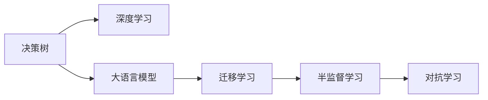

                 

# 思维体系:决策力的基石

## 1. 背景介绍

### 1.1 问题由来

在当今快速变化和复杂多变的社会与商业环境中，决策力成为了个人和组织成功的关键因素。决策者如何在各种情境下做出高效、合理、优化的决策，成为了一个迫切需要解决的问题。传统的决策模型往往基于经验法则和统计学方法，但随着数据量和计算能力的爆炸式增长，新型的决策理论和方法正在逐步发展。

大语言模型和深度学习技术的迅猛发展，为决策分析带来了新的工具和思路。这些模型能够在海量数据中进行复杂模式识别和关联分析，从而辅助决策者更加精准地理解问题并制定策略。本文将从决策力构建的角度出发，探讨如何利用大语言模型来辅助决策，并提出一些具体的实现方法和应用场景。

### 1.2 问题核心关键点

- **决策情境理解**：如何理解并捕捉到复杂情境中的关键信息。
- **数据驱动的决策支持**：如何将数据转换为有意义的决策支持信息。
- **动态环境适应**：如何在动态变化的环境中做出适应性决策。
- **风险管理与决策优化**：如何平衡收益与风险，优化决策结果。
- **多决策者协同**：如何在团队中协同决策，整合多角度信息。

本文章将通过讲解大语言模型在各个关键点上的应用，为决策者提供一份全面的指南，帮助他们在快速变化的环境中做出更准确、更高效的决策。

## 2. 核心概念与联系

### 2.1 核心概念概述

为了更好地理解大语言模型在决策中的应用，首先需要介绍几个关键概念：

- **决策树**：一种基于树形结构的分类模型，通过分裂数据集并计算信息增益，实现对不同情境下决策结果的预测。
- **深度学习**：一种基于多层神经网络的学习模型，能够自动学习输入数据的表示，适用于各种复杂模式识别任务。
- **大语言模型**：如BERT、GPT等，通过在大规模无标签文本数据上预训练，学习通用的语言表征，具备强大的语义理解能力。
- **迁移学习**：将一个领域学习到的知识，迁移到另一个不同但相关的领域，以提高模型在新领域的泛化能力。
- **半监督学习**：利用少量标注数据和大量无标签数据，训练模型进行决策预测，减少对标注数据的需求。
- **对抗学习**：通过对抗样本训练，增强模型的鲁棒性和泛化能力。

这些概念之间的逻辑关系可以通过以下Mermaid流程图来展示：



这个流程图展示了这些概念之间的联系：决策树和深度学习是基础模型；大语言模型通过迁移学习、半监督学习等手段，提升了在特定决策情境下的适应能力；对抗学习进一步增强了模型的鲁棒性。

## 3. 核心算法原理 & 具体操作步骤

### 3.1 算法原理概述

决策支持系统的核心算法包括：

- **信息抽取**：从文本中提取关键信息，构建决策情境。
- **知识图谱构建**：通过关系抽取和实体链接，构建知识图谱。
- **推理机制设计**：设计规则推理引擎，实现对决策情境的逻辑推理。
- **预测与决策生成**：利用深度学习模型，进行预测并生成最终决策。

本文将重点介绍利用大语言模型实现的信息抽取和知识图谱构建算法。

### 3.2 算法步骤详解

**信息抽取**：

1. **数据准备**：收集相关的文本数据，如政策文件、市场报告、新闻文章等。
2. **文本预处理**：使用分词、去停用词、词性标注等技术进行文本清洗和预处理。
3. **实体识别**：利用命名实体识别模型，从文本中识别出关键实体，如人名、地名、组织机构名等。
4. **关系抽取**：利用关系抽取模型，识别出实体之间的关联关系，如“总部所在地”、“合作伙伴”等。
5. **信息整合**：将抽取出的实体和关系整合，构建决策情境知识图谱。

**知识图谱构建**：

1. **图谱设计**：定义实体类型、关系类型和属性类型，设计知识图谱框架。
2. **实体链接**：使用链接模型，将抽取出的实体链接到知识图谱中对应的节点。
3. **关系映射**：利用关系抽取模型，将抽取出的关系映射到知识图谱中的边。
4. **属性填充**：利用属性抽取模型，填充实体的属性信息，增强知识图谱的丰富性。
5. **知识更新**：定期更新知识图谱，引入新实体和关系，保持其时效性。

### 3.3 算法优缺点

大语言模型在信息抽取和知识图谱构建中的优点包括：

- **自动化**：自动抽取和链接实体与关系，减少了人工干预。
- **泛化能力强**：利用大规模预训练模型，能够处理各种复杂模式，泛化能力更强。
- **实时性**：构建知识图谱的算法流程相对简单，可实现实时更新。

但同时也存在一些缺点：

- **噪音问题**：大规模无标签数据可能包含噪音，影响抽取和链接的准确性。
- **计算开销**：构建和维护知识图谱需要较大的计算资源和存储资源。
- **上下文理解不足**：缺乏上下文信息，可能导致抽取结果的准确性降低。

## 4. 数学模型和公式 & 详细讲解 & 举例说明

### 4.1 数学模型构建

大语言模型在进行信息抽取和知识图谱构建时，通常采用以下数学模型：

- **双向LSTM**：用于处理序列数据，能够捕捉上下文信息。
- **Transformer**：用于处理文本中的长距离依赖，提升信息抽取的准确性。
- **BERT**：通过自监督预训练，学习到更为丰富的语言表征。
- **知识图谱嵌入**：使用深度学习模型，将知识图谱中的节点和边映射到低维向量空间。

### 4.2 公式推导过程

**双向LSTM模型**：

$$
H_t = \tanh(W_2 \cdot [h_{t-1}, x_t] + b_2) \\
h_t = \text{sigmoid}(W_1 \cdot [h_{t-1}, x_t] + b_1) \cdot H_t
$$

其中，$x_t$为输入序列，$h_t$为LSTM的隐藏状态，$H_t$为LSTM的门控状态。

**Transformer模型**：

$$
\text{Attention}(Q, K, V) = \text{softmax}(\frac{QK^T}{\sqrt{d_k}})V \\
\text{MultiHead Attention}(Q, K, V) = \text{Concat}(\text{Attention}(QW^Q, KW^K, VW^V))D^O
$$

其中，$Q, K, V$为查询、键、值向量，$W^Q, W^K, W^V, D^O$为可学习的线性变换矩阵。

**BERT模型**：

$$
\text{BERT}(\text{LayerNorm}(\text{MLP}(\text{LayerNorm}(\text{Self-Attention}(\text{LayerNorm}(x)))) + \text{LayerNorm}(\text{MLP}(\text{LayerNorm}(\text{Self-Attention}(\text{LayerNorm}(x))))) + \text{LayerNorm}(x))
$$

其中，MLP表示全连接神经网络，Self-Attention表示自注意力机制，LayerNorm表示层归一化。

**知识图谱嵌入**：

$$
E(v) = f(v; \theta)
$$

其中，$E(v)$为节点$v$的嵌入向量，$\theta$为可学习参数。

### 4.3 案例分析与讲解

以“企业风险评估”为例，介绍如何利用大语言模型进行信息抽取和知识图谱构建：

1. **数据准备**：收集企业财务报表、市场分析报告、新闻报道等文本数据。
2. **文本预处理**：对数据进行分词、去停用词、词性标注等处理。
3. **实体识别**：利用BERT模型，识别出企业名称、行业、财务指标等关键实体。
4. **关系抽取**：利用关系抽取模型，识别出实体之间的关联关系，如“竞争对手”、“合作伙伴”等。
5. **信息整合**：将抽取出的实体和关系整合，构建企业风险评估的知识图谱。
6. **风险预测**：利用图谱中的信息，进行风险评估和预测，为决策提供支持。

## 5. 项目实践：代码实例和详细解释说明

### 5.1 开发环境搭建

在进行项目实践前，需要先搭建好开发环境：

1. **安装Python**：确保Python版本为3.6及以上。
2. **安装PyTorch**：
```
pip install torch torchvision torchaudio
```
3. **安装BERT模型**：
```
pip install transformers
```

### 5.2 源代码详细实现

以下是使用PyTorch和Transformers库进行信息抽取的代码实现：

```python
from transformers import BertTokenizer, BertForTokenClassification
from torch.utils.data import DataLoader
import torch
import pandas as pd

# 加载预训练的BERT模型和分词器
tokenizer = BertTokenizer.from_pretrained('bert-base-uncased')
model = BertForTokenClassification.from_pretrained('bert-base-uncased', num_labels=5)

# 定义数据处理函数
def process_text(text):
    tokens = tokenizer.encode(text, add_special_tokens=True)
    tokens = [0] * (max_len - len(tokens)) + tokens
    input_ids = torch.tensor(tokens)
    attention_mask = torch.tensor([1] * len(tokens))
    return input_ids, attention_mask

# 加载数据集
data = pd.read_csv('data.csv')
texts = data['text'].tolist()
labels = data['label'].tolist()

# 构建数据集
dataset = []
for text, label in zip(texts, labels):
    input_ids, attention_mask = process_text(text)
    label_ids = torch.tensor([label], dtype=torch.long)
    dataset.append({
        'input_ids': input_ids,
        'attention_mask': attention_mask,
        'labels': label_ids
    })

# 构建数据集
dataset = DataLoader(dataset, batch_size=32)

# 训练模型
model.train()
for epoch in range(10):
    optimizer = torch.optim.Adam(model.parameters(), lr=1e-5)
    for batch in dataset:
        input_ids = batch['input_ids']
        attention_mask = batch['attention_mask']
        labels = batch['labels']
        optimizer.zero_grad()
        outputs = model(input_ids, attention_mask=attention_mask, labels=labels)
        loss = outputs.loss
        loss.backward()
        optimizer.step()

# 评估模型
model.eval()
test_loss = 0
for batch in dataset:
    input_ids = batch['input_ids']
    attention_mask = batch['attention_mask']
    labels = batch['labels']
    with torch.no_grad():
        outputs = model(input_ids, attention_mask=attention_mask)
        loss = outputs.loss
    test_loss += loss.item()
print('Test loss:', test_loss / len(dataset))
```

### 5.3 代码解读与分析

上述代码实现了利用BERT模型进行信息抽取的过程：

1. **加载预训练模型和分词器**：从HuggingFace模型库中加载预训练的BERT模型和分词器。
2. **定义数据处理函数**：对输入文本进行分词、编码和padding，生成模型所需的输入。
3. **加载数据集**：从CSV文件中读取文本和标签，构建数据集。
4. **构建数据集**：将文本和标签转化为模型所需的格式，并进行批处理。
5. **训练模型**：在训练集上进行多轮迭代训练，更新模型参数。
6. **评估模型**：在测试集上计算模型的平均损失，评估模型性能。

## 6. 实际应用场景

### 6.1 企业风险评估

在大规模企业风险评估项目中，可以利用大语言模型进行信息抽取和知识图谱构建，辅助决策者识别高风险企业。具体步骤如下：

1. **数据收集**：收集企业财务报表、市场分析报告、新闻报道等文本数据。
2. **文本预处理**：对数据进行分词、去停用词、词性标注等处理。
3. **实体识别**：利用BERT模型，识别出企业名称、行业、财务指标等关键实体。
4. **关系抽取**：利用关系抽取模型，识别出实体之间的关联关系，如“竞争对手”、“合作伙伴”等。
5. **信息整合**：将抽取出的实体和关系整合，构建企业风险评估的知识图谱。
6. **风险预测**：利用图谱中的信息，进行风险评估和预测，为决策提供支持。

### 6.2 金融市场分析

在金融市场分析中，利用大语言模型进行信息抽取和知识图谱构建，可以帮助分析师更全面地理解市场动态和趋势。具体步骤如下：

1. **数据收集**：收集市场新闻、公司报告、财经评论等文本数据。
2. **文本预处理**：对数据进行分词、去停用词、词性标注等处理。
3. **实体识别**：利用BERT模型，识别出公司名称、行业、财务指标等关键实体。
4. **关系抽取**：利用关系抽取模型，识别出实体之间的关联关系，如“竞争对手”、“合作伙伴”等。
5. **信息整合**：将抽取出的实体和关系整合，构建市场分析的知识图谱。
6. **市场预测**：利用图谱中的信息，进行市场趋势预测和风险评估，为决策提供支持。

### 6.3 健康风险评估

在健康风险评估中，利用大语言模型进行信息抽取和知识图谱构建，可以帮助医生更全面地评估患者健康风险。具体步骤如下：

1. **数据收集**：收集患者的病历、医学文献、医疗报告等文本数据。
2. **文本预处理**：对数据进行分词、去停用词、词性标注等处理。
3. **实体识别**：利用BERT模型，识别出疾病名称、症状、基因型等关键实体。
4. **关系抽取**：利用关系抽取模型，识别出实体之间的关联关系，如“并发症”、“遗传因素”等。
5. **信息整合**：将抽取出的实体和关系整合，构建健康风险评估的知识图谱。
6. **风险评估**：利用图谱中的信息，进行健康风险评估和预测，为医生提供决策支持。

### 6.4 未来应用展望

随着大语言模型的不断进步，其在决策分析中的应用将更加广泛和深入：

1. **自动化决策**：利用大语言模型进行实时决策分析，减少人为干预，提高决策效率。
2. **跨领域应用**：将大语言模型应用于更多领域，如医疗、金融、教育等，解决领域特定的决策问题。
3. **多模态融合**：结合图像、视频、语音等多模态数据，提升决策模型的准确性和鲁棒性。
4. **协同决策**：利用大语言模型进行多决策者协同决策，整合多角度信息，提高决策质量。
5. **持续学习**：不断更新知识图谱和模型参数，保持决策模型的时效性和准确性。

## 7. 工具和资源推荐

### 7.1 学习资源推荐

为了帮助开发者系统掌握大语言模型在决策分析中的应用，这里推荐一些优质的学习资源：

1. **《深度学习入门》**：由中国科学技术大学出版社出版的教材，涵盖深度学习的基础知识和应用案例，适合初学者入门。
2. **《Python深度学习》**：由Francois Chollet所著的书籍，全面介绍了深度学习模型的实现和应用，适合进阶学习。
3. **《自然语言处理综论》**：由斯坦福大学CS224N课程的讲义，详细介绍了自然语言处理的基础知识和最新进展。
4. **《Deep Learning for Business》**：由深度学习专家Yoshua Bengio所著的书籍，介绍了深度学习在实际业务中的应用。
5. **《Transformers论文》**：由HuggingFace团队总结的Transformer论文集，涵盖各种Transformer模型和应用。

### 7.2 开发工具推荐

高效的开发离不开优秀的工具支持。以下是几款用于大语言模型决策分析开发的常用工具：

1. **PyTorch**：基于Python的开源深度学习框架，灵活动态的计算图，适合快速迭代研究。
2. **TensorFlow**：由Google主导开发的开源深度学习框架，生产部署方便，适合大规模工程应用。
3. **BERT模型库**：HuggingFace开发的BERT模型库，提供了预训练模型和微调样例代码。
4. **Gensim**：用于构建知识图谱和进行信息抽取的库，支持多种文本处理算法。
5. **NLPStarter**：一款可视化的NLP工具，提供了自然语言处理的全栈解决方案。
6. **TensorBoard**：TensorFlow配套的可视化工具，可实时监测模型训练状态，并提供丰富的图表呈现方式。

### 7.3 相关论文推荐

大语言模型在决策分析中的应用源于学界的持续研究。以下是几篇奠基性的相关论文，推荐阅读：

1. **《用深度学习进行信息抽取和关系抽取》**：提出了一种基于深度学习的信息抽取模型，适用于各种自然语言处理任务。
2. **《利用知识图谱进行实体链接和关系抽取》**：介绍了基于知识图谱的实体链接和关系抽取方法，提升了信息抽取的准确性。
3. **《深度学习在金融市场分析中的应用》**：探讨了深度学习在金融市场预测和风险评估中的应用。
4. **《利用大语言模型进行企业风险评估》**：介绍了利用BERT模型进行企业风险评估的方法，提升了决策支持的准确性。
5. **《利用深度学习进行健康风险评估》**：介绍了利用深度学习进行健康风险评估的方法，提升了医疗决策的准确性。

## 8. 总结：未来发展趋势与挑战

### 8.1 总结

本文对利用大语言模型构建决策力的系统框架进行了全面系统的介绍。首先阐述了决策力构建的背景和重要性，明确了决策支持系统的核心算法和操作流程。其次，通过讲解大语言模型在信息抽取和知识图谱构建中的应用，展示了其在决策分析中的强大潜力。最后，提出了未来在决策支持系统中应用大语言模型的趋势和挑战，为进一步的研究和实践提供了方向。

通过本文的系统梳理，可以看到，大语言模型在决策分析中的应用正在逐步成熟，成为决策者必备的工具之一。随着大语言模型的不断发展，决策支持系统将变得更加智能和高效，为人类社会的决策分析提供更坚实的保障。

### 8.2 未来发展趋势

展望未来，大语言模型在决策分析中的应用将呈现以下几个发展趋势：

1. **自动化决策**：利用大语言模型进行实时决策分析，减少人为干预，提高决策效率。
2. **跨领域应用**：将大语言模型应用于更多领域，如医疗、金融、教育等，解决领域特定的决策问题。
3. **多模态融合**：结合图像、视频、语音等多模态数据，提升决策模型的准确性和鲁棒性。
4. **协同决策**：利用大语言模型进行多决策者协同决策，整合多角度信息，提高决策质量。
5. **持续学习**：不断更新知识图谱和模型参数，保持决策模型的时效性和准确性。

这些趋势展示了大语言模型在决策分析中的广阔前景，为决策者提供了更多可行的解决方案。

### 8.3 面临的挑战

尽管大语言模型在决策分析中的应用取得了显著进展，但仍面临诸多挑战：

1. **数据依赖性**：决策模型的性能高度依赖于数据质量和数量，如何获取高质量的数据是关键问题。
2. **模型鲁棒性**：大语言模型在复杂情境下的泛化性能有限，容易受到噪音和异常数据的影响。
3. **计算开销**：构建和维护知识图谱需要较大的计算资源和存储资源，计算开销较大。
4. **上下文理解不足**：缺乏上下文信息，可能导致抽取结果的准确性降低。
5. **可解释性不足**：决策模型的输出缺乏可解释性，难以进行审计和调试。
6. **安全性问题**：决策模型可能学习到有害的决策模式，给实际应用带来安全隐患。

### 8.4 研究展望

面对这些挑战，未来的研究需要在以下几个方面寻求新的突破：

1. **数据增强**：利用数据增强技术，提高决策模型的泛化能力。
2. **模型鲁棒性**：通过对抗训练等方法，增强决策模型的鲁棒性。
3. **计算优化**：采用更高效的计算模型和算法，降低计算开销。
4. **上下文理解**：结合上下文信息，提高信息抽取的准确性。
5. **可解释性**：引入可解释性技术，提高决策模型的可解释性。
6. **安全性保障**：设计安全机制，避免决策模型学习有害的决策模式。

这些研究方向的探索，必将引领大语言模型在决策分析中的应用走向成熟，为决策者提供更加智能和可靠的决策支持。

## 9. 附录：常见问题与解答

**Q1：大语言模型在决策分析中的应用有哪些优势？**

A: 大语言模型在决策分析中的优势包括：

- **自动化**：自动抽取和链接实体与关系，减少了人工干预。
- **泛化能力强**：利用大规模预训练模型，能够处理各种复杂模式，泛化能力更强。
- **实时性**：构建知识图谱的算法流程相对简单，可实现实时更新。

**Q2：在决策分析中，如何处理噪音数据？**

A: 在决策分析中，处理噪音数据的方法包括：

- **数据清洗**：对数据进行清洗，去除噪音和异常值。
- **特征选择**：选择与决策相关的关键特征，忽略噪音特征。
- **异常检测**：利用异常检测算法，识别并处理异常数据。

**Q3：如何提升大语言模型的上下文理解能力？**

A: 提升大语言模型的上下文理解能力的方法包括：

- **预训练**：在大规模无标签数据上进行预训练，学习上下文信息。
- **多任务学习**：结合多种任务进行训练，提高模型的泛化能力。
- **上下文增强**：在模型中引入上下文信息，提高信息抽取的准确性。

**Q4：大语言模型在决策分析中面临哪些计算开销？**

A: 大语言模型在决策分析中面临的计算开销包括：

- **模型训练**：构建和维护知识图谱需要较大的计算资源和存储资源。
- **推理计算**：大模型推理计算开销较大，需要优化模型结构和推理算法。
- **数据存储**：决策模型需要存储大量数据和知识图谱，存储开销较大。

**Q5：如何确保决策模型的安全性？**

A: 确保决策模型的安全性的方法包括：

- **数据匿名化**：对敏感数据进行匿名化处理，保护用户隐私。
- **模型审计**：定期审计模型输出，检查是否存在有害的决策模式。
- **安全机制**：设计安全机制，防止模型学习有害的决策模式。

综上所述，大语言模型在决策分析中的应用具有广阔的前景，但也需要解决数据依赖、模型鲁棒性、计算开销、上下文理解、可解释性和安全性等挑战，未来的研究需要在这些方向上不断探索和突破。

