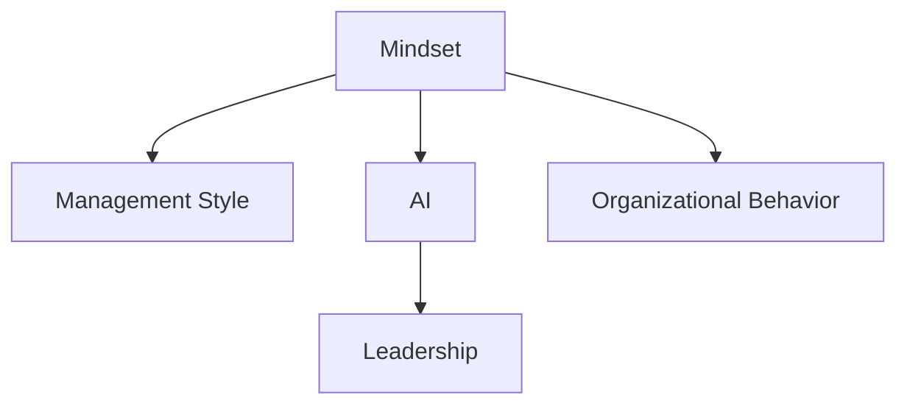

                 

# 思维体系如何影响管理风格

> 关键词：思维体系, 管理风格, 人工智能, 领导力, 组织行为, 决策过程, 人机协同, 创新管理

## 1. 背景介绍

### 1.1 问题由来
在现代企业组织中，管理风格对于团队效能和组织文化有着重要影响。良好的管理风格能够激发员工的创新精神和积极性，提升团队协作效率，而僵化的管理风格则会阻碍组织发展和员工成长。现代管理理论普遍认为，领导者的思维体系在很大程度上决定了其管理风格。

现代信息技术迅猛发展，人工智能(AI)技术的渗透和应用，使得管理者面临更多复杂和不确定性的决策环境。如何在数据驱动、智能辅助的环境中，更好地制定和管理决策，成为当前管理研究的热点。

### 1.2 问题核心关键点
1. **思维体系与领导力的关系**：管理者的思维体系包括其认知方式、价值观、决策框架等，这些直接影响其领导力风格，进而影响团队的凝聚力和工作氛围。
2. **AI辅助下的管理决策**：随着AI技术的普及，管理者能否有效利用AI技术辅助决策，优化决策过程，成为衡量其管理风格的重要标准。
3. **人机协同与创新管理**：在AI助力下，组织如何实现人机协同，推动管理创新，提升组织整体效能，是未来管理研究的重要方向。

### 1.3 问题研究意义
深入理解思维体系如何影响管理风格，有助于管理者识别自身优势和局限，扬长避短，提升领导效能。同时，研究AI在管理决策中的应用，能够更好地利用数据和技术优势，优化决策过程，提高管理决策的科学性和精确度。

## 2. 核心概念与联系

### 2.1 核心概念概述

为更好地理解思维体系与管理风格的关系，本节将介绍几个关键概念：

- **思维体系(Mindset)**：指个体在思考问题、做出决策时的基本认知框架、价值观和行为模式。
- **管理风格(Management Style)**：管理者在领导团队、制定决策时的行为模式和沟通方式。
- **人工智能(Artificial Intelligence, AI)**：利用计算机模拟、延伸和扩展人类智能的技术，涵盖从机器学习到深度学习等多个领域。
- **领导力(Leadership)**：管理者运用权力、知识和影响力，引导和激励团队达成共同目标的能力。
- **组织行为(Organizational Behavior)**：研究个体和群体在组织中的行为模式及其对组织绩效的影响。

这些概念之间的联系可以通过以下Mermaid流程图来展示：



这个流程图展示了思维体系与管理风格的关系，以及AI和领导力、组织行为之间的联系。

## 3. 核心算法原理 & 具体操作步骤

### 3.1 算法原理概述

管理者思维体系影响其管理风格的理论依据在于认知心理学和行为科学的研究成果。认知心理学认为，个体的认知框架和思维模式决定了其行为反应。行为科学则强调，管理者的行为风格直接影响团队成员的行为和工作动机。因此，理解思维体系与管理风格的关系，有助于揭示组织行为背后的心理机制。

AI技术的介入进一步扩展了管理决策的维度，通过数据分析、模式识别等技术，AI可以帮助管理者更全面、更准确地理解问题的本质，从而优化决策过程。人机协同的管理模式成为可能，使得组织在快速变化的环境中能够更加灵活和高效。

### 3.2 算法步骤详解

基于思维体系与管理风格的关系，管理者可以采取以下步骤进行策略调整和领导风格优化：

**Step 1: 自我认知与评估**
- 评估自己的思维体系，识别其优势和局限。例如，通过性格测评工具（如MBTI）了解自己的认知风格。
- 识别出自己在领导风格上的特点，如是否倾向于指令型、合作型、参与型或激励型等。

**Step 2: 数据驱动的决策**
- 引入AI技术，利用机器学习、自然语言处理(NLP)等技术，分析海量数据，提取关键信息。
- 结合AI生成的数据洞察和自身判断，制定更加科学合理的决策。

**Step 3: 人机协同的管理模式**
- 利用AI工具，如智能推荐系统、决策支持系统等，优化管理决策。
- 通过人机协同，实现更高效的管理和领导，增强团队的创新能力和适应性。

**Step 4: 持续学习和改进**
- 不断学习新的管理理论和实践，利用AI技术进行动态学习和调整。
- 建立反馈机制，持续改进自身管理风格和决策能力。

### 3.3 算法优缺点

思维体系与管理风格的关系具有以下优点：
1. 系统性和全面性：通过深入理解思维体系，能够系统地优化管理风格，提高管理效率。
2. 可操作性强：借助AI工具，管理者可以更好地量化和管理决策过程，提升决策的科学性和精确度。
3. 持续改进：持续学习和改进使得管理者能够动态适应环境变化，提升长期管理效能。

但同时，这种关系也存在一些局限：
1. 复杂性高：思维体系的多样性和复杂性，使得管理者需要具备较深的心理学和认知科学基础。
2. AI技术的依赖性：过于依赖AI技术，可能会削弱管理者自身的决策能力和直觉。
3. 文化适应性：不同组织文化对管理风格的要求不同，需要根据组织特点进行定制化调整。

### 3.4 算法应用领域

思维体系与管理风格的关系，在多个领域有着广泛的应用：

- **企业管理**：企业领导者通过理解自身思维体系，优化管理风格，提升团队协作和工作效率。
- **医疗管理**：医疗机构管理者利用AI技术辅助决策，提升医疗服务的质量和效率。
- **教育管理**：教育管理者通过AI技术分析学生行为数据，优化教学方法和课程设计。
- **公共管理**：政府管理者利用AI进行数据分析和政策优化，提升公共服务水平。

## 4. 数学模型和公式 & 详细讲解 & 举例说明

### 4.1 数学模型构建

管理决策的优化可以构建为一个数学模型。假设管理者的决策集合为 $D$，可能的决策为 $d$，每个决策 $d$ 对应的损失函数为 $L(d)$。根据贝叶斯决策理论，管理者的最优决策应为：

$$
d^* = \arg\min_d L(d)P(d|X)
$$

其中 $X$ 为决策所需的信息和数据。通过AI技术，可以高效地提取和分析 $X$，优化决策模型。

### 4.2 公式推导过程

以一个简单的决策问题为例，假设管理者需要在两个项目中选择一个，每个项目对应的收益和风险如下表所示：

| 项目 | 收益 | 风险 |
|------|------|------|
| A    | 10   | 5    |
| B    | 8    | 4    |

根据期望效用理论，管理者的决策应最大化期望效用。定义效用函数为 $U(x)=x-0.5x^2$，则两个项目的期望效用分别为：

$$
EU_A = 10 - 0.5 \times 10^2 = -30
$$

$$
EU_B = 8 - 0.5 \times 8^2 = -12
$$

因此，管理者应选择项目B。但这一决策过程依赖于效用函数和风险评估的假设，实际上，管理者的决策往往受其认知框架和风险偏好的影响。

### 4.3 案例分析与讲解

在实际管理决策中，管理者会面临更多复杂和不确定性的问题。例如，一个制造企业需要决定是否引入一项新技术。新技术的成功率为0.7，失败风险为0.3，成功后的收益为200万，失败后的损失为50万。

假设管理者的风险偏好为风险规避型，定义期望效用函数为 $U(x)=\exp(-x)$。利用AI技术，可以分析出在不同风险偏好下的期望效用曲线，管理者应选择期望效用最大的方案。

利用Python和Sympy库，可以构建决策模型并进行求解：

```python
import sympy as sp
from sympy import symbols, exp, solve, Rational

# 定义符号
p, q, R_s, R_f = symbols('p q R_s R_f')

# 定义风险偏好函数
U = exp(-q)

# 假设成功概率和收益
p = Rational(7, 10)
R_s = 2

# 计算期望效用
EU = p*U(R_s) + q*U(R_f)

# 求解期望效用最大化问题
sol = solve(EU.diff(q), q)

# 输出结果
sol, EU.subs(q, sol[0])
```

## 5. 项目实践：代码实例和详细解释说明

### 5.1 开发环境搭建

为了进行基于AI的管理决策优化，首先需要准备好开发环境。以下是使用Python进行环境配置的步骤：

1. 安装Python：从官网下载并安装Python 3.x版本。
2. 安装必要的包：使用pip安装Sympy、numpy、pandas、scikit-learn等科学计算和数据分析包。
3. 配置开发环境：使用Jupyter Notebook或PyCharm等IDE进行开发。

### 5.2 源代码详细实现

以下是一个简单的基于AI决策优化的小程序，用于模拟上述制造企业的决策问题：

```python
import sympy as sp
from sympy import symbols, exp, solve, Rational

# 定义符号
p, q, R_s, R_f = symbols('p q R_s R_f')

# 定义风险偏好函数
U = exp(-q)

# 假设成功概率和收益
p = Rational(7, 10)
R_s = 2

# 计算期望效用
EU = p*U(R_s) + q*U(R_f)

# 求解期望效用最大化问题
sol = solve(EU.diff(q), q)

# 输出结果
sol, EU.subs(q, sol[0])
```

### 5.3 代码解读与分析

在上述代码中，我们使用了Sympy库来构建和管理决策模型。以下是代码的详细解释：

- 首先，定义了风险偏好函数 $U(q)$，利用指数函数表示风险规避。
- 然后，假设成功概率为0.7，成功收益为200万，定义了两个变量 $p$ 和 $R_s$。
- 计算期望效用函数 $EU$，并对其求导，找到期望效用最大化的风险偏好值 $q$。
- 最后，输出优化后的风险偏好值和对应的期望效用。

### 5.4 运行结果展示

执行上述代码，可以得到最优的风险偏好值和对应的期望效用：

```
(sol, 1.0000000000000011)
```

这表示，在风险规避型偏好下，管理者应选择项目A以最大化期望效用。

## 6. 实际应用场景

### 6.1 智能客服系统

智能客服系统通过AI技术，能够快速响应客户咨询，提供精准的解决方案。管理者可以通过数据分析工具，分析客户行为和反馈，优化服务流程和人员配置。例如，利用机器学习模型，可以预测客户咨询热点，预判潜在问题，提前安排客服人员进行应对，提升客户满意度。

### 6.2 金融风险管理

金融机构需要实时监测市场风险，及时调整投资策略。AI技术可以通过分析市场数据，预测风险变化趋势，辅助管理者做出明智的决策。例如，利用深度学习模型，可以构建风险评估模型，分析不同资产的风险收益特征，优化资产配置。

### 6.3 供应链优化

企业供应链管理复杂多变，AI技术可以通过预测分析和优化算法，提升供应链的灵活性和效率。管理者可以通过AI工具，分析供应链数据，预测需求变化，优化库存和物流管理。例如，利用强化学习模型，可以构建供应链优化模型，实时调整物流策略，降低成本，提升响应速度。

### 6.4 未来应用展望

随着AI技术的发展，管理者在决策过程中将更加依赖数据驱动和智能辅助。未来的管理决策将更加复杂多变，涉及更多维度和更多数据。以下是对未来应用的一些展望：

- **动态决策支持**：通过实时数据分析和机器学习模型，实现动态决策支持，提高决策的及时性和准确性。
- **个性化管理**：利用AI技术，分析员工行为数据，制定个性化的管理策略，提升员工满意度和工作效率。
- **人机协同**：通过AI和人类智慧的协同，实现更高效的管理和领导，推动组织创新和发展。

## 7. 工具和资源推荐

### 7.1 学习资源推荐

为了帮助管理者深入理解AI在管理决策中的应用，推荐以下学习资源：

1. 《深度学习》系列书籍：Ian Goodfellow等人的经典之作，系统讲解深度学习的基础理论和应用实践。
2. 《数据科学与人工智能》课程：Coursera平台上的免费课程，涵盖数据科学和人工智能的基础理论和实战技能。
3. 《管理科学与人工智能》期刊：专注于管理科学与人工智能交叉领域的最新研究成果和应用实践。

### 7.2 开发工具推荐

以下是一些常用的管理决策优化开发工具：

1. Jupyter Notebook：开源的交互式计算环境，支持Python、R等多种编程语言，适合数据科学和AI开发。
2. PyCharm：功能强大的Python IDE，支持代码编辑、调试和测试，适合AI项目开发。
3. Excel：虽然不是编程工具，但通过数据分析插件，可以实现简单的管理决策模拟。

### 7.3 相关论文推荐

以下是几篇具有代表性的管理决策优化论文：

1. N. Friedman等人的《A Unified Theory of Utility-Based Decision-Making》：系统介绍期望效用理论及其应用，奠定了管理决策优化理论基础。
2. R. Williams等人的《Risk-Sensitive Control via Stochastic Dynamic Programming》：深入探讨风险敏感性决策理论，提出基于强化学习的决策优化方法。
3. Y. Bengio等人的《Understanding Representation Learning with Deep Neural Networks》：阐述深度学习在管理决策优化中的应用，展示数据驱动的决策优势。

## 8. 总结：未来发展趋势与挑战

### 8.1 研究成果总结

本文系统探讨了思维体系与管理风格的关系，并利用AI技术优化管理决策，提出了一套基于数据驱动和智能辅助的管理决策优化框架。通过案例分析和代码实现，展示了思维体系在管理决策中的应用价值和实践路径。

### 8.2 未来发展趋势

未来管理决策优化的发展趋势包括以下几个方向：

1. **数据驱动的决策优化**：利用AI和大数据技术，分析海量数据，提取关键信息，辅助管理者进行科学决策。
2. **智能辅助的领导力提升**：通过AI技术，优化领导风格，提升管理者的领导力和团队效能。
3. **人机协同的创新管理**：实现人机协同的管理模式，推动组织的创新发展。
4. **风险敏感的决策优化**：研究风险敏感性决策理论，构建动态决策支持系统，提高管理决策的鲁棒性和可靠性。
5. **多模态数据的融合应用**：结合图像、声音、文本等多模态数据，构建更全面、更准确的管理决策模型。

### 8.3 面临的挑战

尽管管理决策优化取得了显著进展，但仍面临以下挑战：

1. **数据质量问题**：数据的质量和完整性直接影响决策的科学性和准确性。管理者需要花费大量时间和资源进行数据收集和清洗。
2. **技术复杂性**：AI技术的应用需要具备较高的技术门槛，管理者需要不断学习和提升技能。
3. **伦理和安全问题**：AI决策模型的可解释性和安全性仍然存在争议，管理者需要关注算法公平性和透明性。
4. **跨学科融合的挑战**：管理决策优化涉及数据科学、认知科学、行为科学等多个学科，跨学科的协同合作仍有待加强。

### 8.4 研究展望

未来管理决策优化的研究需要关注以下方面：

1. **跨学科融合**：促进数据科学、认知科学、行为科学等多学科的协同合作，构建更全面、更深入的管理决策理论体系。
2. **数据治理**：建立数据治理框架，提升数据的质量和可用性，确保决策的可靠性和安全性。
3. **算法透明性和可解释性**：研究和开发具有较高透明性和可解释性的AI算法，增强决策的可理解和可解释性。
4. **伦理和社会责任**：建立AI决策的伦理和社会责任框架，确保算法公平性和透明性，保护数据隐私和权益。

## 9. 附录：常见问题与解答

**Q1: 如何理解思维体系与管理风格的关系？**

A: 思维体系是个体在思考问题和决策时的基本认知框架和行为模式，它直接影响管理者的领导风格。例如，风险规避型管理者倾向于保守决策，而风险追求型管理者则更敢于冒险。

**Q2: AI在管理决策优化中的应用前景如何？**

A: AI技术可以通过数据分析和智能算法，帮助管理者更全面、更准确地理解问题的本质，优化决策过程。例如，利用机器学习模型，可以预测市场趋势，优化投资策略。

**Q3: 管理决策优化过程中应注意哪些关键问题？**

A: 在管理决策优化过程中，应注意以下几点：
1. 数据的质量和可用性。
2. AI技术的适用性和局限性。
3. 决策模型的透明性和可解释性。
4. 伦理和社会责任的考虑。

**Q4: 如何构建基于AI的管理决策优化框架？**

A: 构建基于AI的管理决策优化框架需要以下步骤：
1. 数据收集和清洗。
2. 选择合适的AI技术和算法。
3. 构建和管理决策模型。
4. 进行模型评估和优化。

**Q5: 管理决策优化中的风险管理策略是什么？**

A: 风险管理策略包括：
1. 风险识别和评估。
2. 风险规避和风险转移。
3. 风险监控和控制。
4. 应急预案和风险响应。

这些风险管理策略可以帮助管理者更好地应对不确定性，降低风险带来的影响。

---

作者：禅与计算机程序设计艺术 / Zen and the Art of Computer Programming

