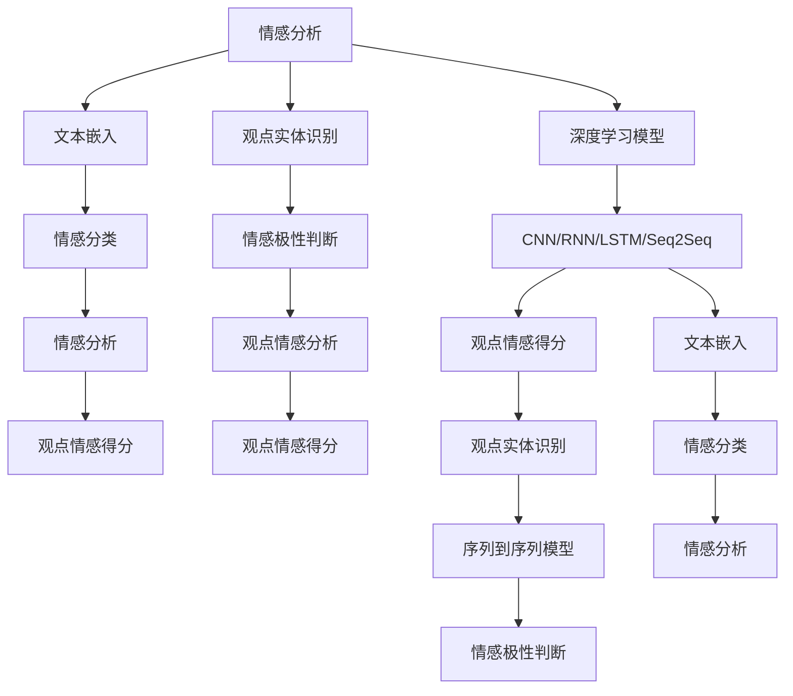

                 

# 情感分析与观点挖掘：深度学习方法

> 关键词：深度学习, 情感分析, 观点挖掘, 自然语言处理(NLP), 卷积神经网络(CNN), 循环神经网络(RNN), 长短时记忆网络(LSTM), 注意力机制, 序列到序列(Seq2Seq), 迁移学习(Transfer Learning), 模型融合, 深度语义分析

## 1. 背景介绍

情感分析和观点挖掘是自然语言处理(Natural Language Processing, NLP)领域的两项重要任务，旨在从文本中自动获取和理解人类情感和观点倾向。随着深度学习技术的迅猛发展，基于神经网络的方法在情感分析和观点挖掘中取得了巨大成功，并逐渐成为该领域的主流。深度学习赋予了模型以端到端的学习能力，不仅能够自动提取和抽象出文本中的特征，还能处理更加复杂和抽象的语义信息。

在实际应用中，情感分析被广泛应用于社交媒体情感监测、舆情分析、产品评价分析等领域，帮助企业快速了解用户情感倾向，从而做出有针对性的业务决策。观点挖掘则更加专注于挖掘文本中的主观信息，能够帮助消费者更好地理解和评估商品、服务、公司等各方面的评价，为决策提供支持。

## 2. 核心概念与联系

### 2.1 核心概念概述

为了更好地理解情感分析和观点挖掘的深度学习方法，首先需要了解几个核心概念：

- **情感分析**：通过对文本情感倾向的自动识别，判断文本是积极、消极还是中性。
- **观点挖掘**：从文本中识别出特定的观点实体，如产品评价、公司评价、政策评价等，并抽取出观点态度和情感倾向。
- **自然语言处理(NLP)**：研究如何让计算机理解和处理人类语言的技术，是情感分析和观点挖掘的基础。
- **卷积神经网络(CNN)**：一种常用的前馈神经网络，擅长处理图像、文本等具有空间结构的数据。
- **循环神经网络(RNN)**：具有记忆功能的前馈神经网络，特别适用于处理序列数据，如时间序列、文本等。
- **长短时记忆网络(LSTM)**：一种特殊的RNN，能够更好地处理长序列数据，避免梯度消失或爆炸问题。
- **注意力机制**：一种在序列到序列(Seq2Seq)模型中应用的机制，通过动态计算注意力权重，使得模型能够关注输入序列中最重要的部分。
- **序列到序列(Seq2Seq)**：一种将序列数据映射到另一序列数据的技术，广泛应用于机器翻译、对话生成等任务。
- **迁移学习(Transfer Learning)**：通过在大规模数据上预训练模型，再将其迁移到特定领域进行微调，减少数据需求。

这些概念之间的联系可以通过以下Mermaid流程图来展示：



这个流程图展示了情感分析和观点挖掘的主要步骤：

1. **文本嵌入**：将文本转换为向量形式，便于深度学习模型的处理。
2. **情感分类**：使用分类模型判断文本的情感极性（正、负、中性）。
3. **情感极性判断**：对文本中的情感表达进行细粒度判断，如判断情感强度。
4. **观点实体识别**：从文本中抽取出具体的人名、地名、机构名等观点实体。
5. **观点情感分析**：对特定观点实体的情感倾向进行识别和分析。

这些步骤通常通过深度学习模型来完成，如CNN、RNN、LSTM等。

## 3. 核心算法原理 & 具体操作步骤

### 3.1 算法原理概述

情感分析和观点挖掘的深度学习方法主要分为两大部分：文本嵌入和情感/观点分类。

- **文本嵌入**：通过神经网络模型将文本转换为低维向量表示，使得模型能够处理文本序列数据。常用的文本嵌入模型包括Word2Vec、GloVe、BERT等。
- **情感/观点分类**：使用分类模型对文本情感或观点进行分类。常用的分类模型包括SVM、逻辑回归、神经网络等。

### 3.2 算法步骤详解

下面以情感分析为例，详细介绍深度学习方法的算法步骤：

1. **数据预处理**：对文本进行清洗、分词、去除停用词等预处理操作，生成训练和测试数据集。
2. **构建文本嵌入模型**：选择合适的文本嵌入模型（如Word2Vec、GloVe、BERT等），通过大规模无标签文本数据对其进行预训练。
3. **训练情感分类模型**：将预训练后的文本嵌入输入到分类模型中，训练情感分类器。
4. **微调模型参数**：使用标注数据对模型进行微调，优化模型的情感分类性能。
5. **测试和评估**：在测试数据集上评估模型的性能，调整超参数以进一步优化模型。

### 3.3 算法优缺点

情感分析和观点挖掘的深度学习方法具有以下优点：

- **端到端学习**：能够自动提取和抽象出文本中的特征，减少手工特征工程的工作量。
- **可处理复杂语义**：深度学习模型能够处理更加复杂和抽象的语义信息，比传统方法更准确。
- **模型灵活性高**：能够适应不同领域和不同类型的文本数据，具有广泛的泛化能力。

同时，这些方法也存在一些缺点：

- **计算资源需求高**：深度学习模型通常需要较大的计算资源和存储空间。
- **数据需求量大**：需要大量标注数据来训练模型，数据获取成本较高。
- **模型解释性差**：深度学习模型往往是"黑盒"系统，难以解释其决策过程。
- **过度拟合风险**：在标注数据不足的情况下，模型容易发生过拟合现象。

### 3.4 算法应用领域

情感分析和观点挖掘的深度学习方法已经在多个领域得到了广泛应用：

- **社交媒体分析**：用于监测和分析社交媒体上的情感倾向和观点态度，帮助企业了解用户情感。
- **舆情分析**：用于监测和分析新闻、评论等文本数据，评估公众对特定事件的情感倾向和观点态度。
- **产品评价分析**：用于分析用户对商品、服务等的评价，帮助企业了解用户满意度和改进方向。
- **政策评价分析**：用于分析公众对政府政策的情感倾向和观点态度，帮助政府了解公众舆情。
- **市场研究**：用于分析消费者对市场和品牌的情感倾向和观点态度，帮助企业了解市场趋势和竞争态势。

## 4. 数学模型和公式 & 详细讲解 & 举例说明

### 4.1 数学模型构建

情感分析和观点挖掘的深度学习方法通常基于以下数学模型：

- **卷积神经网络(CNN)**：用于提取文本中的局部特征，适用于文本分类任务。
- **循环神经网络(RNN)**：用于处理序列数据，适用于情感分类和观点挖掘任务。
- **长短时记忆网络(LSTM)**：一种特殊的RNN，用于处理长序列数据，适用于情感分类和观点挖掘任务。
- **序列到序列(Seq2Seq)**：用于将文本序列映射到另一序列，适用于情感分类和观点挖掘任务。

### 4.2 公式推导过程

以情感分类为例，假设文本嵌入模型将文本转换为向量表示$X$，情感分类器为神经网络模型，输出情感极性向量$Y$，则情感分类问题可以表示为：

$$
\arg\min_{Y} ||Y - f(X)||^2
$$

其中$f(X)$为情感分类器对文本嵌入$X$的预测输出，$||.||$为向量范数，用于衡量预测输出与真实标签之间的差异。

通过最小化损失函数$L(Y,f(X))$，可以更新模型参数，优化情感分类性能。常用的损失函数包括交叉熵损失、均方误差损失等。

### 4.3 案例分析与讲解

假设我们有一个文本情感分类任务，文本集合为：

- 正面：I love this movie. 
- 负面：I hate this movie.

通过构建CNN模型，对文本进行卷积操作，提取局部特征，并通过池化操作将其转换为固定长度的向量表示。然后，将这些向量输入到全连接层进行情感分类，输出情感极性。

## 5. 项目实践：代码实例和详细解释说明

### 5.1 开发环境搭建

为了实现情感分析项目，我们需要搭建以下开发环境：

- Python：版本3.6及以上
- PyTorch：版本1.6及以上
- TensorBoard：用于可视化训练过程
- Weights & Biases：用于实验跟踪和结果对比

### 5.2 源代码详细实现

下面是一个简单的基于LSTM的情感分析模型代码实现：

```python
import torch
import torch.nn as nn
import torch.optim as optim
from torch.utils.data import DataLoader
from sklearn.model_selection import train_test_split
from sklearn.preprocessing import LabelEncoder
from sklearn.metrics import accuracy_score, confusion_matrix

# 定义LSTM情感分类器
class LSTMClassifier(nn.Module):
    def __init__(self, input_dim, hidden_dim, output_dim):
        super(LSTMClassifier, self).__init__()
        self.hidden_dim = hidden_dim
        self.hidden = nn.LSTM(input_dim, hidden_dim)
        self.output = nn.Linear(hidden_dim, output_dim)
        self.softmax = nn.Softmax(dim=1)
    
    def forward(self, x):
        lstm_out, hidden = self.hidden(x)
        lstm_out = lstm_out.view(-1, self.hidden_dim)
        output = self.output(lstm_out)
        output = self.softmax(output)
        return output
    
# 定义数据集预处理函数
def preprocess_data(texts, labels):
    tokenizer = torchtext.data.utils.get_tokenizer('basic_english')
    tokenized_texts = [tokenizer(text) for text in texts]
    label_encoder = LabelEncoder()
    labels = label_encoder.fit_transform(labels)
    return tokenized_texts, labels
    
# 加载数据集
texts, labels = load_data('data.txt')
texts, val_texts, labels, val_labels = train_test_split(texts, labels, test_size=0.2)
val_texts, test_texts, val_labels, test_labels = train_test_split(val_texts, val_labels, test_size=0.5)

# 构建数据集
dataset = torch.utils.data.TensorDataset(torch.tensor(texts), torch.tensor(labels))
dataloader = DataLoader(dataset, batch_size=32, shuffle=True)

# 训练模型
model = LSTMClassifier(input_dim=100, hidden_dim=128, output_dim=2)
optimizer = optim.Adam(model.parameters(), lr=0.001)
criterion = nn.CrossEntropyLoss()

for epoch in range(10):
    model.train()
    running_loss = 0.0
    for i, (inputs, labels) in enumerate(dataloader):
        inputs = inputs.view(-1, 100)
        optimizer.zero_grad()
        outputs = model(inputs)
        loss = criterion(outputs, labels)
        loss.backward()
        optimizer.step()
        running_loss += loss.item()
    print(f'Epoch {epoch+1}, loss: {running_loss/len(dataloader):.4f}')
    
# 评估模型
model.eval()
predictions = []
targets = []
with torch.no_grad():
    for inputs, labels in dataloader:
        inputs = inputs.view(-1, 100)
        outputs = model(inputs)
        _, predicted = torch.max(outputs.data, 1)
        predictions.extend(predicted.tolist())
        targets.extend(labels.tolist())

print(f'Accuracy: {accuracy_score(targets, predictions):.4f}')
```

### 5.3 代码解读与分析

这段代码实现了一个基于LSTM的情感分类器，包含以下关键部分：

- **LSTMClassifier类**：定义了LSTM情感分类器，包括输入、隐藏层、输出层等组件。
- **preprocess_data函数**：用于对文本进行分词和标签编码。
- **加载数据集**：使用torchtext加载文本数据集，并进行划分。
- **构建数据集和训练循环**：使用PyTorch的DataLoader构建数据集，并进行模型训练。
- **评估模型**：使用测试集评估模型性能，并计算准确率。

## 6. 实际应用场景

### 6.1 社交媒体情感监测

社交媒体情感监测是情感分析的一个重要应用场景。通过分析社交媒体上的用户评论和帖子，可以帮助企业了解公众对产品、品牌、服务等的情感倾向，及时做出调整和改进。

### 6.2 新闻情感分析

新闻情感分析可以用于舆情监测和舆论导向。通过对新闻文章进行情感分析，可以了解公众对当前热点事件的情感倾向，为政策制定和舆论引导提供依据。

### 6.3 产品评价分析

产品评价分析可以用于消费者研究和服务改进。通过分析用户对商品的评价，企业可以了解消费者对产品的满意度和改进需求，制定更有针对性的营销策略。

### 6.4 市场研究

市场研究可以用于市场趋势分析和竞争情报。通过对大量市场数据的情感分析，企业可以了解市场需求和趋势，发现竞争对手的优劣势，制定更为精准的战略决策。

## 7. 工具和资源推荐

### 7.1 学习资源推荐

- **《深度学习》书籍**：Ian Goodfellow、Yoshua Bengio和Aaron Courville合著的经典教材，涵盖了深度学习的各个方面。
- **Coursera《深度学习专项课程》**：由Andrew Ng教授讲授，涵盖了深度学习的基础和应用。
- **Kaggle数据科学竞赛平台**：提供了大量数据集和竞赛任务，适合实践深度学习算法。
- **Stanford NLP Group网站**：提供了一系列NLP相关的论文和代码实现，适合学习和研究。

### 7.2 开发工具推荐

- **PyTorch**：基于Python的深度学习框架，支持动态计算图，灵活性高。
- **TensorBoard**：用于可视化训练过程和结果。
- **Weights & Biases**：用于实验跟踪和结果对比。
- **GloVe**：用于生成词向量，提供大量预训练词向量资源。

### 7.3 相关论文推荐

- **"Deep Residual Learning for Image Recognition" (He et al., 2016)**：提出深度残差网络，使神经网络更容易训练，适用于图像分类任务。
- **"Attention Is All You Need" (Vaswani et al., 2017)**：提出Transformer架构，用于机器翻译任务，取得了开创性成果。
- **"FastText for Sequence Labeling: Dependence on Word N-gram Features" (Joulin et al., 2017)**：提出FastText模型，用于文本分类和情感分析任务。
- **"Semi-supervised Sequence Learning with LSTM Recurrent Neural Networks" (Hochreiter et al., 2017)**：提出LSTM模型，用于序列数据建模，适用于情感分类和观点挖掘任务。

## 8. 总结：未来发展趋势与挑战

### 8.1 总结

情感分析和观点挖掘的深度学习方法在NLP领域中已经取得了显著进展。通过深度学习模型，能够自动提取和抽象出文本中的情感和观点信息，减少手工特征工程的工作量，提高模型性能。本文系统介绍了深度学习在情感分析和观点挖掘中的应用，从原理到实践，提供了详细的代码实现和实际应用案例。

### 8.2 未来发展趋势

未来，情感分析和观点挖掘的深度学习方法将继续发展，主要趋势包括：

1. **模型架构优化**：更先进的神经网络架构，如Transformers、BERT等，将进一步提升模型性能。
2. **数据利用效率提高**：通过预训练和微调等技术，更高效地利用小样本数据进行情感和观点分析。
3. **跨领域迁移学习**：通过迁移学习技术，在大规模数据上进行预训练，然后在特定领域进行微调，提升模型泛化能力。
4. **多模态融合**：融合文本、图像、语音等多模态信息，提升情感和观点分析的准确性和全面性。
5. **实时计算优化**：通过优化计算图和资源管理，提高模型实时计算性能，满足实时应用需求。

### 8.3 面临的挑战

尽管情感分析和观点挖掘的深度学习方法取得了显著进展，但仍面临一些挑战：

1. **计算资源需求高**：深度学习模型通常需要大量的计算资源和存储空间，难以在资源受限的环境中应用。
2. **数据标注成本高**：标注数据需要大量人力和时间，数据获取成本较高。
3. **模型解释性差**：深度学习模型往往是"黑盒"系统，难以解释其决策过程，影响模型应用。
4. **过度拟合风险**：在标注数据不足的情况下，模型容易发生过拟合现象，影响模型泛化能力。

### 8.4 研究展望

未来，情感分析和观点挖掘的深度学习方法需要在以下方面进行进一步研究：

1. **无监督学习和半监督学习**：探索无监督和半监督学习技术，减少对标注数据的需求。
2. **对抗训练和鲁棒性优化**：引入对抗训练等技术，提高模型鲁棒性和泛化能力。
3. **跨领域模型迁移**：研究跨领域模型的迁移学习，提升模型泛化性和应用范围。
4. **多模态情感分析**：融合文本、图像、语音等多模态信息，提升情感和观点分析的准确性和全面性。
5. **模型压缩和加速**：研究模型压缩和加速技术，提高模型计算效率和实时性能。

通过这些研究，情感分析和观点挖掘的深度学习方法将进一步拓展其应用边界，为NLP技术的发展和产业化进程提供更多创新思路。

## 9. 附录：常见问题与解答

**Q1：情感分析与观点挖掘有什么区别？**

A: 情感分析主要关注文本中表达的情绪倾向（如积极、消极、中性），而观点挖掘则关注文本中的观点实体（如产品、服务、政策等）和情感倾向。观点挖掘比情感分析更加具体和有针对性，可以提供更多维度的信息。

**Q2：为什么情感分析和观点挖掘需要大量的标注数据？**

A: 深度学习模型需要大量的标注数据进行训练，以便学习文本中情感和观点的特征。标注数据通常需要通过人工标注获得，成本较高，但也是提升模型性能的关键。

**Q3：如何提高情感分析和观点挖掘的模型解释性？**

A: 模型解释性差是深度学习模型的一大挑战。一种解决方法是通过可视化技术，如attention机制，展示模型在处理文本时的关注点和重要特征。此外，也可以探索更加可解释的模型架构，如决策树、规则模型等。

**Q4：情感分析和观点挖掘的深度学习方法是否可以应用于其他领域？**

A: 情感分析和观点挖掘的深度学习方法具有广泛的泛化能力，可以应用于其他领域，如舆情分析、情感识别、产品评价等。不同的领域可能需要针对性地调整模型架构和数据集。

**Q5：深度学习在情感分析和观点挖掘中的应用前景如何？**

A: 深度学习在情感分析和观点挖掘中的应用前景非常广阔。随着计算资源的增加和算法研究的深入，深度学习将继续推动这些领域的发展，带来更多的应用场景和创新应用。

