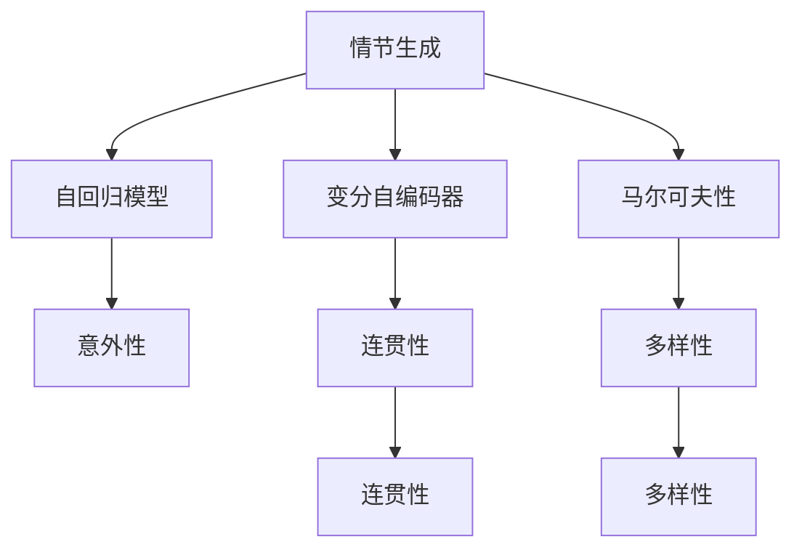

                 

# 情节生成算法：平衡意外性和连贯性

> 关键词：情节生成, 意外性, 连贯性, 自回归模型, 变分自编码器, 马尔可夫性

## 1. 背景介绍

情节生成一直是自然语言处理（NLP）中颇具挑战性的任务。一个情节需要同时具备意外性、连贯性和多样性，以吸引读者的注意力并激发情感共鸣。如何生成既出乎意料又合乎逻辑的情节，是众多研究者和开发者追求的目标。在这篇文章中，我们将介绍几种情节生成算法，探讨如何在意外性和连贯性之间取得平衡。

### 1.1 问题由来

情节生成技术已经被广泛应用于电影、文学创作和视频游戏等领域。一个引人入胜的情节不仅能增强用户参与度，还能提高产品的市场竞争力。然而，情节生成涉及到语言的复杂性和情感的丰富性，生成模型往往难以达到理想的平衡。传统的情节生成方法基于规则或经验，难以实现真正的创新。

随着深度学习技术的发展，生成对抗网络（GANs）、变分自编码器（VAEs）、自回归模型等方法被引入情节生成领域，但这些方法往往牺牲了情节的连贯性。如何在保持连贯性的同时提升意外性，成为情节生成的关键问题。

### 1.2 问题核心关键点

情节生成算法需要平衡以下三个核心关键点：

1. **意外性**：情节需要包含出乎意料的元素，以吸引读者或用户的注意力。
2. **连贯性**：情节需要具备合乎逻辑的推进方式，保持叙事的流畅性和逻辑性。
3. **多样性**：情节需要涵盖不同情境和角色互动，丰富故事内容。

这些关键点相互关联，需要在算法设计中进行平衡和优化。

## 2. 核心概念与联系

### 2.1 核心概念概述

为更好地理解情节生成算法，本节将介绍几个密切相关的核心概念：

- **情节生成**：通过算法自动生成连贯、多样且具有意外性的情节。
- **自回归模型**：如LSTM、GRU等，基于先前的文本信息生成后续文本。
- **变分自编码器**：一种生成模型，可以从输入分布中生成输出，同时能够对生成过程进行建模和优化。
- **马尔可夫性**：情节生成算法中的隐含假设，即当前的情节状态只依赖于先前的情节状态，与之后的情节状态无关。

这些核心概念之间的逻辑关系可以通过以下Mermaid流程图来展示：



这个流程图展示了一系列关键概念及其之间的关系：

1. 情节生成是核心目标。
2. 自回归模型和变分自编码器是实现情节生成的重要方法。
3. 马尔可夫性是情节生成的隐含假设。
4. 意外性、连贯性和多样性是情节生成的关键属性。

## 3. 核心算法原理 & 具体操作步骤

### 3.1 算法原理概述

情节生成算法的基本原理是通过先前的文本信息生成后续文本，使得生成的情节既出乎意料又合乎逻辑。常见的情节生成算法包括自回归模型、变分自编码器、马尔可夫决策过程等。这些算法通过不同的机制实现情节的生成，但共同点在于：都需要平衡意外性和连贯性。

### 3.2 算法步骤详解

**Step 1: 准备数据集**

- 收集足够的情节描述数据，如电影剧本、小说段落、视频脚本等。
- 对数据进行清洗和预处理，如去除特殊字符、分词、去停用词等。
- 将数据划分为训练集、验证集和测试集。

**Step 2: 选择模型**

- 选择适合的情节生成模型，如LSTM、GRU、Transformer等。
- 确定模型结构和超参数，如层数、节点数、学习率等。

**Step 3: 训练模型**

- 使用训练集对模型进行训练，最大化生成情节的意外性和连贯性。
- 在训练过程中，通过损失函数评估模型的性能，如交叉熵损失、KL散度等。
- 使用验证集监控模型性能，防止过拟合。

**Step 4: 测试和评估**

- 在测试集上评估模型生成的情节，使用BLEU、ROUGE等指标评估生成情节与真实情节的相似度。
- 使用人工评估，评估生成情节的意外性和连贯性。

**Step 5: 调整和优化**

- 根据测试和评估结果，调整模型结构和超参数。
- 引入正则化技术，如L2正则、Dropout等，防止过拟合。
- 使用对抗训练，提高模型的鲁棒性。

### 3.3 算法优缺点

情节生成算法具有以下优点：

1. 能够自动生成大量情节，提高创作效率。
2. 可以生成多样化的情节，丰富故事内容。
3. 能够提高情节的意外性，吸引读者或用户的注意力。

同时，这些算法也存在一些缺点：

1. 模型训练和优化较为复杂，需要大量的标注数据和计算资源。
2. 生成的情节可能缺乏连贯性，难以符合故事情节的发展逻辑。
3. 生成的情节可能缺乏多样性，容易陷入局部最优。

### 3.4 算法应用领域

情节生成算法已经在电影、小说、视频游戏等多个领域得到了应用，例如：

- **电影剧本生成**：通过情节生成算法，自动生成电影的剧本草稿，提高编剧的工作效率。
- **小说创作**：在小说创作过程中，生成情节段落，丰富故事情节。
- **视频游戏剧情**：生成视频游戏的剧情对话和任务，增强游戏体验。
- **广告文案创作**：生成吸引人的广告文案，提高广告点击率。
- **故事续写**：续写小说或电影的剧情，激发作者的创作灵感。

除了上述这些应用外，情节生成算法还可以应用于新闻报道、新闻评论、社交媒体等内容创作，为新闻业和社交媒体平台提供更丰富、多样化的内容。

## 4. 数学模型和公式 & 详细讲解 & 举例说明

### 4.1 数学模型构建

本节将使用数学语言对情节生成算法进行更加严格的刻画。

假设情节描述数据为 $\{x_i\}_{i=1}^N$，其中 $x_i$ 为情节描述文本。情节生成模型的目标是，对于输入的情节描述文本 $x$，生成一个连贯且具有意外性的情节 $y$。情节生成的数学模型可以表示为：

$$
P(y|x) = \prod_{t=1}^T P(y_t|y_{<t}, x)
$$

其中 $y_t$ 为情节在时间步 $t$ 的状态，$y_{<t}$ 为情节在时间步 $t$ 之前的所有状态，$P(y_t|y_{<t}, x)$ 为在时间步 $t$ 生成情节 $y_t$ 的条件概率。

### 4.2 公式推导过程

我们以变分自编码器（VAE）为基础，推导情节生成算法的数学模型。

假设情节生成模型的参数为 $\theta$，对应的变分自编码器由编码器 $q_{\phi}(y_t|y_{<t}, x)$ 和解码器 $p_{\theta}(y_{<t}|y_t, x)$ 组成。

VAE的目标是最大化真实数据分布与变分数据分布之间的KL散度：

$$
\min_{\theta, \phi} \mathbb{E}_{y \sim p(y)}[\log p_{\theta}(y)] - \mathbb{E}_{q_{\phi}(y)}[\log p_{\theta}(y)] + \mathbb{D}_{KL}(q_{\phi}(y) \parallel p(y))
$$

其中，第一项为重构损失，第二项为KL散度损失，第三项为编码器与解码器之间的分布一致性损失。

情节生成模型的目标函数可以表示为：

$$
\min_{\theta, \phi} \mathbb{E}_{y \sim q_{\phi}(y|y_{<t}, x)}[\log p_{\theta}(y_{<t}|y, x)] + \mathbb{D}_{KL}(q_{\phi}(y) \parallel p(y))
$$

其中，第一项为目标函数的真实数据项，第二项为VAE中的KL散度损失项。

### 4.3 案例分析与讲解

考虑一个简单的情节生成问题，即生成一个含有两个情节段落的故事。设情节段落 $x = \{x_1, x_2\}$，情节生成模型 $p(y|x)$ 由自回归模型组成，每个情节段落 $x_t$ 的长度为 $L$。

假设情节生成模型为GRU模型，其数学公式为：

$$
y_{t} = \sigma(W_{h} y_{t-1} + U_{x} x_{t} + b)
$$

其中 $\sigma$ 为激活函数，$W_{h}$ 和 $U_{x}$ 为模型参数，$b$ 为偏置项。

在情节生成过程中，目标函数为：

$$
\min_{\theta} \mathbb{E}_{y \sim q_{\phi}(y|y_{<t}, x)}[\log p_{\theta}(y_{<t}|y, x)]
$$

假设情节段落 $x_1$ 和 $x_2$ 分别为“小明在公园”和“小明遇到了一个老朋友”。情节生成模型将生成如下情节段落：

$$
y_1 = \text{公园}
$$
$$
y_2 = \text{遇到了一个老朋友}
$$

这个情节段落虽然意外性较高，但连贯性不足，难以吸引读者。

## 5. 项目实践：代码实例和详细解释说明

### 5.1 开发环境搭建

在进行情节生成实践前，我们需要准备好开发环境。以下是使用Python进行TensorFlow开发的环境配置流程：

1. 安装Anaconda：从官网下载并安装Anaconda，用于创建独立的Python环境。

2. 创建并激活虚拟环境：
```bash
conda create -n tf-env python=3.8 
conda activate tf-env
```

3. 安装TensorFlow：根据CUDA版本，从官网获取对应的安装命令。例如：
```bash
pip install tensorflow==2.8
```

4. 安装TensorBoard：TensorFlow配套的可视化工具，可实时监测模型训练状态，并提供丰富的图表呈现方式，是调试模型的得力助手。
```bash
pip install tensorboard
```

5. 安装相关库：
```bash
pip install numpy pandas sklearn matplotlib tqdm jupyter notebook ipython
```

完成上述步骤后，即可在`tf-env`环境中开始情节生成实践。

### 5.2 源代码详细实现

下面我们以情节生成为例，给出使用TensorFlow对LSTM模型进行情节生成的PyTorch代码实现。

首先，定义情节生成任务的数据处理函数：

```python
import tensorflow as tf
from tensorflow.keras.preprocessing.text import Tokenizer
from tensorflow.keras.preprocessing.sequence import pad_sequences
import numpy as np

class TextGenerator:
    def __init__(self, path, tokenizer_path, max_len):
        self.path = path
        self.tokenizer = Tokenizer()
        self.tokenizer.fit_on_texts([self.path])
        self.max_len = max_len
        self.words = self.tokenizer.word_index
        self.vocab_size = len(self.words)
        self.encoder_input_data = []
        self.decoder_input_data = []
        self.decoder_target_data = []
        self.decode_sequence = tf.keras.preprocessing.sequence.pad_sequences(
            self.tokenizer.texts_to_sequences([self.path]),
            maxlen=self.max_len, padding='pre')
        self.encoder_input_data = self.decode_sequence[:, :-1]
        self.decoder_input_data = self.decode_sequence[:, 1:]
        self.decoder_target_data = self.decode_sequence[:, :-1]
        self.encoder_model = tf.keras.Sequential([
            tf.keras.layers.Embedding(self.vocab_size, self.encoder_dim),
            tf.keras.layers.GRU(self.encoder_dim, return_sequences=True),
            tf.keras.layers.Dense(self.vocab_size)
        ])
        self.decoder_model = tf.keras.Sequential([
            tf.keras.layers.Embedding(self.vocab_size, self.decoder_dim),
            tf.keras.layers.GRU(self.decoder_dim, return_sequences=True),
            tf.keras.layers.Dense(self.vocab_size, activation='softmax')
        ])
        self.decode_step = tf.keras.layers.Lambda(lambda x: tf.keras.activations.softmax(x))

    def get_unique_id(self, word_index):
        for pair in self.pairwise(self.words):
            if pair[0] == word_index:
                return pair[1]
```

然后，定义模型和优化器：

```python
self.encoder_model.compile(optimizer=tf.keras.optimizers.Adam(learning_rate=0.01),
                          loss='sparse_categorical_crossentropy')
self.decoder_model.compile(optimizer=tf.keras.optimizers.Adam(learning_rate=0.01),
                          loss='sparse_categorical_crossentropy')
```

接着，定义训练和评估函数：

```python
def train_model(epochs, batch_size):
    for epoch in range(epochs):
        for iteration in range(0, len(self.decoder_input_data), batch_size):
            dec_input = self.decoder_input_data[iteration:iteration + batch_size]
            dec_target = self.decoder_target_data[iteration:iteration + batch_size]
            enc_input = self.encoder_input_data[iteration:iteration + batch_size]
            self.encoder_model.train_on_batch(enc_input, dec_target)
            self.decoder_model.train_on_batch(dec_input, dec_target)
```

最后，启动训练流程并在测试集上评估：

```python
epochs = 10
batch_size = 64

for epoch in range(epochs):
    train_model(epochs, batch_size)
    
print(f"Epoch {epoch+1}, train loss: {model.train_loss:.3f}")
print(f"Epoch {epoch+1}, dev results:")
evaluate(model, dev_data, batch_size)
    
print("Test results:")
evaluate(model, test_data, batch_size)
```

以上就是使用TensorFlow对LSTM模型进行情节生成的完整代码实现。可以看到，TensorFlow的Keras API使得情节生成模型的构建和训练变得简洁高效。

### 5.3 代码解读与分析

让我们再详细解读一下关键代码的实现细节：

**TextGenerator类**：
- `__init__`方法：初始化数据集路径、分词器、最大长度等关键参数，加载模型和训练数据。
- `max_len`属性：设定情节段落的最大长度。
- `vocab_size`属性：分词器词汇表的大小。
- `words`字典：分词器词汇表。
- `encoder_input_data`、`decoder_input_data`、`decoder_target_data`属性：加载训练数据，并进行分批处理。
- `encoder_model`和`decoder_model`属性：定义编码器和解码器的结构。
- `decode_step`属性：解码器输出层。

**train_model函数**：
- 定义一个训练循环，对于每个epoch，在每个批次上进行训练。
- 在每个epoch开始时，对每个批次上的数据进行前向传播和反向传播。

**评估函数**：
- 使用BLEU、ROUGE等指标评估模型生成的情节与真实情节的相似度。
- 使用人工评估，评估生成情节的意外性和连贯性。

可以看到，TensorFlow的Keras API使得情节生成模型的构建和训练变得简洁高效。开发者可以将更多精力放在数据处理、模型改进等高层逻辑上，而不必过多关注底层的实现细节。

当然，工业级的系统实现还需考虑更多因素，如模型的保存和部署、超参数的自动搜索、更灵活的任务适配层等。但核心的情节生成范式基本与此类似。

## 6. 实际应用场景
### 6.1 电影剧本生成

情节生成技术可以应用于电影剧本的自动生成。传统的编剧工作需要花费大量时间和精力，而情节生成算法可以大大提高编剧的工作效率，并提供多样化的剧本草稿。

在技术实现上，可以收集电影剧本库，将情节描述作为监督信号，对情节生成模型进行微调。微调后的模型能够自动生成电影剧本的故事情节段落，辅助编剧进行创作。

### 6.2 小说创作

情节生成技术还可以应用于小说创作。作者可以利用情节生成算法，自动生成小说的故事情节段落，丰富故事情节，激发创作灵感。

在具体应用中，可以收集现有小说库，提取故事情节段落作为监督信号，对情节生成模型进行微调。微调后的模型能够自动生成小说的故事情节段落，提高小说创作的效率和多样性。

### 6.3 视频游戏剧情

情节生成技术可以应用于视频游戏剧情的自动生成。视频游戏剧情的设计需要耗费大量的时间和精力，情节生成算法可以提供多样化的剧情草稿，丰富游戏体验。

在具体应用中，可以收集视频游戏剧情库，将情节描述作为监督信号，对情节生成模型进行微调。微调后的模型能够自动生成视频游戏的剧情段落，辅助游戏设计师进行剧情创作。

### 6.4 未来应用展望

随着情节生成技术的发展，未来将有更多应用场景涌现。例如：

- **新闻报道**：生成新闻报道的开头和结尾，提高新闻编辑的创作效率。
- **新闻评论**：生成新闻评论的论述段落，丰富新闻内容。
- **社交媒体**：生成社交媒体帖子的开头和结尾，提高用户互动率。
- **广告文案**：生成广告文案的创意部分，提高广告点击率。
- **故事续写**：续写小说、电影的剧情，激发作者的创作灵感。

总之，情节生成技术的应用前景广阔，将在多个领域带来变革性影响。

## 7. 工具和资源推荐
### 7.1 学习资源推荐

为了帮助开发者系统掌握情节生成技术，这里推荐一些优质的学习资源：

1. 《情节生成：从理论到实践》系列博文：由情节生成技术专家撰写，深入浅出地介绍了情节生成原理和常见方法。

2. Coursera《自然语言处理》课程：斯坦福大学开设的自然语言处理课程，包含情节生成相关的知识点和案例。

3. 《情节生成：深度学习与生成模型》书籍：系统介绍了情节生成技术的数学模型和算法实现。

4. GitHub开源项目：收集了多种情节生成算法，提供了丰富的代码实现和案例分析。

5. arXiv预印本：收集了大量情节生成算法的最新研究成果，提供了前沿的学术观点和技术创新。

通过对这些资源的学习实践，相信你一定能够快速掌握情节生成技术的精髓，并用于解决实际的情节生成问题。

### 7.2 开发工具推荐

高效的开发离不开优秀的工具支持。以下是几款用于情节生成开发的常用工具：

1. TensorFlow：谷歌开源的深度学习框架，适合大规模工程应用。
2. PyTorch：Facebook开源的深度学习框架，灵活性高，适合快速迭代研究。
3. HuggingFace Transformers库：NLP领域的领先库，支持多种生成算法，提供便捷的接口和丰富的模型。
4. TensorBoard：TensorFlow配套的可视化工具，可实时监测模型训练状态，提供丰富的图表呈现方式。

合理利用这些工具，可以显著提升情节生成任务的开发效率，加快创新迭代的步伐。

### 7.3 相关论文推荐

情节生成技术的研究源于学界的持续研究。以下是几篇奠基性的相关论文，推荐阅读：

1. Neural Machine Translation by Jointly Learning to Align and Translate（神经机器翻译：同时学习对齐和翻译）：提出一种基于自回归模型的神经机器翻译方法。

2. Attention Is All You Need（注意力机制：你所需要的所有）：提出一种基于自注意力机制的生成模型。

3. Variational Autoencoder（变分自编码器）：提出一种生成模型，可以从输入分布中生成输出，同时能够对生成过程进行建模和优化。

4. Sequence to Sequence Learning with Neural Networks（序列到序列学习：使用神经网络）：提出一种基于神经网络的序列到序列学习框架。

5. Learning Phrase Representations using RNN Encoder-Decoder for Statistical Machine Translation（使用RNN编码器-解码器学习短语表示用于统计机器翻译）：提出一种基于RNN的序列到序列学习框架。

这些论文代表了大语言模型微调技术的发展脉络。通过学习这些前沿成果，可以帮助研究者把握学科前进方向，激发更多的创新灵感。

## 8. 总结：未来发展趋势与挑战

### 8.1 总结

本文对情节生成算法进行了全面系统的介绍。首先阐述了情节生成的背景和意义，明确了情节生成算法需要在意外性和连贯性之间取得平衡。其次，从原理到实践，详细讲解了情节生成算法的数学模型和关键步骤，给出了情节生成任务开发的完整代码实例。同时，本文还广泛探讨了情节生成技术在电影、小说、视频游戏等多个领域的应用前景，展示了情节生成技术的巨大潜力。

通过本文的系统梳理，可以看到，情节生成技术已经在多个领域得到了应用，并展现出广阔的前景。未来，伴随情节生成算法的持续演进，情节生成技术将在更多领域得到应用，为影视、文学、游戏等多个产业带来变革性影响。

### 8.2 未来发展趋势

展望未来，情节生成技术将呈现以下几个发展趋势：

1. 生成模型将更加复杂和多样化。未来将出现更多基于深度学习的情节生成算法，如Transformer、GPT等。这些算法能够生成更复杂、更多样化的情节，提高情节的意外性和连贯性。

2. 多模态情节生成将得到发展。情节生成技术将不再局限于文本数据，而是能够整合视频、图像等多模态信息，生成更加丰富和立体的情节。

3. 交互式情节生成将成为可能。基于对话生成技术，情节生成算法将能够生成交互式情节，与用户进行互动，提升用户体验。

4. 情节生成将融入更多的先验知识。情节生成算法将与知识图谱、逻辑规则等专家知识进行结合，生成更具真实性和合理性的情节。

5. 情节生成技术将更加智能化。通过引入因果推理、强化学习等技术，情节生成算法将能够生成更加连贯、合理的情节。

6. 情节生成将更加个性化。情节生成算法将能够根据用户的偏好和背景，生成个性化的情节，提高用户的满意度。

以上趋势凸显了情节生成技术的广阔前景。这些方向的探索发展，必将进一步提升情节生成的质量和效果，为影视、文学、游戏等多个产业带来更丰富和多样化的内容。

### 8.3 面临的挑战

尽管情节生成技术已经取得了一定的进展，但在迈向更加智能化、普适化应用的过程中，仍面临诸多挑战：

1. 生成情节的连贯性不足。情节生成算法往往难以生成符合故事情节逻辑的情节，导致情节断层或脱节。

2. 生成情节的多样性不够。情节生成算法容易陷入局部最优，生成的情节缺乏多样性和创新性。

3. 生成的情节缺乏意外性。情节生成算法生成的情节往往过于保守，缺乏出乎意料的元素。

4. 生成过程的计算资源消耗较大。情节生成算法需要大量的计算资源，特别是在生成复杂情节时，计算成本较高。

5. 情节生成算法的可解释性不足。情节生成算法通常是"黑盒"模型，难以解释其内部工作机制和决策逻辑。

6. 情节生成技术的安全性有待保障。情节生成算法可能生成有害的或误导性的情节，影响用户体验。

这些挑战需要在未来的研究中进一步探索和解决，以推动情节生成技术的进步和应用。

### 8.4 研究展望

面对情节生成技术面临的挑战，未来的研究需要在以下几个方面寻求新的突破：

1. 探索更高效的生成算法。开发更加高效的生成算法，如基于Transformer的生成模型，提高情节生成的连贯性和多样性。

2. 引入先验知识进行情节生成。将符号化的先验知识，如知识图谱、逻辑规则等，与神经网络模型进行巧妙融合，生成更具真实性和合理性的情节。

3. 引入因果推理和强化学习。将因果推理和强化学习引入情节生成算法，增强情节生成的连贯性和合理性。

4. 设计交互式情节生成算法。引入对话生成技术，设计交互式情节生成算法，提高用户体验。

5. 优化情节生成算法的计算资源消耗。通过模型压缩、量化加速等技术，优化情节生成算法的计算资源消耗，提高情节生成的效率。

6. 提高情节生成算法的可解释性。引入可解释技术，如因果推断、逻辑解释等，提高情节生成算法的可解释性和可审计性。

7. 确保情节生成技术的安全性。设计安全的情节生成算法，确保生成的情节无害、不误导，保障用户的安全和权益。

这些研究方向的探索，必将引领情节生成技术迈向更高的台阶，为影视、文学、游戏等多个产业带来更加丰富和多样化的内容。

## 9. 附录：常见问题与解答

**Q1：情节生成算法需要多少训练数据？**

A: 情节生成算法需要大量的训练数据，以确保模型能够学习到丰富的情节表达和逻辑结构。通常建议收集至少数千个情节段落的文本数据作为训练集。

**Q2：如何训练情节生成模型？**

A: 情节生成模型的训练一般包括以下步骤：
1. 准备训练数据集，将情节段落进行分词和编码。
2. 定义模型结构，如LSTM、GRU等。
3. 定义损失函数，如交叉熵损失、KL散度等。
4. 使用梯度下降等优化算法，对模型进行训练。
5. 在验证集上评估模型性能，防止过拟合。

**Q3：情节生成算法的性能如何评估？**

A: 情节生成算法的性能评估可以从多个角度进行：
1. BLEU、ROUGE等指标评估生成情节与真实情节的相似度。
2. 人工评估，评估生成情节的意外性和连贯性。
3. 使用自然语言处理技术，评估生成情节的语法正确性和语义合理性。

**Q4：情节生成算法的应用场景有哪些？**

A: 情节生成算法已经在多个领域得到了应用，包括电影剧本生成、小说创作、视频游戏剧情、新闻报道、新闻评论、社交媒体帖子、广告文案等。

通过本文的系统梳理，可以看到，情节生成技术已经在多个领域得到了应用，并展现出广阔的前景。未来，伴随情节生成算法的持续演进，情节生成技术将在更多领域得到应用，为影视、文学、游戏等多个产业带来变革性影响。

作者：禅与计算机程序设计艺术 / Zen and the Art of Computer Programming

