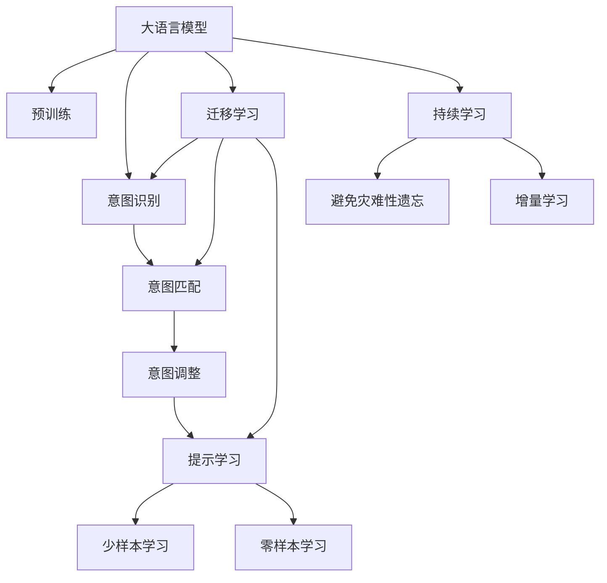

                 

# 意图对齐：让LLM更懂人类需求

## 1. 背景介绍

### 1.1 问题由来
近年来，大语言模型（Large Language Models, LLMs）在自然语言处理（NLP）领域取得了巨大进步。然而，尽管这些模型在理解和生成自然语言方面表现出色，但它们往往忽略了用户意图的多样性和复杂性。导致模型生成的内容偏离用户真正需求，产生了信息不一致、误解用户意图等现象，降低了用户体验和满意度。

为了解决这个问题，意图对齐（Intent Alignment）技术应运而生。其目的是帮助语言模型更好地理解用户的意图，生成更符合用户需求的回答。意图对齐通过识别用户输入中的核心意图和关键词，引导模型输出更准确的信息，极大地提高了模型的实用性和用户满意度。

### 1.2 问题核心关键点
意图对齐的核心在于如何从用户输入中提取出意图信息，并据此调整模型输出。关键点包括：
- 意图识别：理解用户输入中的核心意图。
- 意图匹配：将用户意图与模型输出内容进行对比，判断是否一致。
- 意图调整：根据匹配结果调整模型输出，确保结果符合用户意图。

## 2. 核心概念与联系

### 2.1 核心概念概述

为更好地理解意图对齐，本节将介绍几个密切相关的核心概念：

- **大语言模型（LLM）**：以自回归模型（如GPT）或自编码模型（如BERT）为代表的大规模预训练语言模型。通过在大规模无标签文本语料上进行预训练，学习通用的语言表示，具备强大的语言理解和生成能力。

- **预训练（Pre-training）**：指在大规模无标签文本语料上，通过自监督学习任务训练通用语言模型的过程。常见的预训练任务包括言语建模、遮挡语言模型等。预训练使得模型学习到语言的通用表示。

- **意图识别（Intent Recognition）**：识别用户输入中的核心意图，通常通过提取关键词、短语或特定标记词来实现。

- **意图匹配（Intent Matching）**：将用户意图与模型输出内容进行匹配，确保输出内容符合用户需求。

- **意图调整（Intent Alignment）**：根据意图匹配结果，对模型输出进行修正或补充，确保最终输出满足用户需求。

- **提示学习（Prompt Learning）**：通过在输入文本中添加提示模板，引导模型进行特定任务的推理和生成，减少微调参数。

- **少样本学习（Few-shot Learning）**：指在只有少量标注样本的情况下，模型能够快速适应新任务的学习方法。在大语言模型中，通常通过在输入中提供少量示例来实现，无需更新模型参数。

- **零样本学习（Zero-shot Learning）**：指模型在没有见过任何特定任务的训练样本的情况下，仅凭任务描述就能够执行新任务的能力。大语言模型通过预训练获得的广泛知识，使其能够理解任务指令并生成相应输出。

这些核心概念之间的逻辑关系可以通过以下Mermaid流程图来展示：



这个流程图展示了大语言模型的核心概念及其之间的关系：

1. 大语言模型通过预训练获得基础能力。
2. 意图识别从用户输入中提取意图信息。
3. 意图匹配判断用户意图与模型输出是否一致。
4. 意图调整根据匹配结果调整模型输出。
5. 提示学习通过提示模板引导模型生成符合意图的输出。
6. 少样本学习和零样本学习在少量样本下快速适应新任务。
7. 迁移学习是连接预训练模型与下游任务的桥梁。
8. 持续学习使模型不断学习新知识，保持时效性。

这些概念共同构成了意图对齐的核心框架，使其能够更好地理解用户需求，提升模型输出的精准度。

## 3. 核心算法原理 & 具体操作步骤
### 3.1 算法原理概述

意图对齐的本质是对用户输入进行意图解析，并据此调整模型输出。其核心思想是：将用户输入分解为意图和实体，从意图中提取关键词和短语，然后与模型输出的语义内容进行匹配，根据匹配结果对输出进行校正。

形式化地，假设用户输入为 $U=\{u_1,u_2,\ldots,u_n\}$，模型输出为 $O=\{o_1,o_2,\ldots,o_m\}$。意图对齐的过程可以描述为：

1. **意图识别**：提取输入中的核心意图 $I$。
2. **意图匹配**：将意图 $I$ 与输出 $O$ 中的内容 $o_i$ 进行匹配，计算匹配度 $M(o_i,I)$。
3. **意图调整**：根据匹配度 $M(o_i,I)$ 调整输出内容 $o_i$，生成最终的对齐输出 $A(o_i)$。

其中，意图 $I$ 的提取可以通过关键词提取、短语匹配等方法实现；匹配度 $M(o_i,I)$ 的计算可以使用基于语义的相似度度量（如余弦相似度、编辑距离等）；意图调整可以通过语义修复、补全等技术实现。

### 3.2 算法步骤详解

意图对齐的具体操作步骤如下：

**Step 1: 数据预处理**
- 收集标注有意图标签的训练数据集 $D=\{(x_i,y_i)\}_{i=1}^N$，其中 $x_i$ 为输入文本，$y_i$ 为对应的意图标签。
- 使用分词工具对输入文本进行分词，并提取出关键词、短语等核心内容。

**Step 2: 意图识别**
- 使用意图识别模型对输入文本进行意图分析，提取核心意图 $I$。常用的方法包括基于规则的意图提取、基于深度学习的意图分类等。

**Step 3: 意图匹配**
- 计算意图 $I$ 与模型输出内容 $o_i$ 之间的匹配度 $M(o_i,I)$。常见的匹配方法包括基于词汇的相似度计算、基于语法的结构匹配等。
- 根据匹配度 $M(o_i,I)$ 确定输出内容 $o_i$ 与意图 $I$ 的对齐程度。

**Step 4: 意图调整**
- 根据匹配度 $M(o_i,I)$ 调整输出内容 $o_i$，生成最终的对齐输出 $A(o_i)$。常见的调整方法包括语义修复、补全、替换等。

**Step 5: 训练和评估**
- 使用标注数据集 $D$ 训练意图识别和意图匹配模型。
- 在测试集上评估意图识别和意图匹配模型的性能，确保其准确性和鲁棒性。
- 使用训练好的模型对实际用户输入进行意图识别和意图匹配，最终生成对齐输出。

### 3.3 算法优缺点

意图对齐技术具有以下优点：
1. 增强模型理解和生成能力：通过意图对齐，模型能够更准确地理解用户需求，生成更符合预期的输出。
2. 减少用户误解：用户意图明确后，生成输出更加符合需求，减少了用户的误解和不满。
3. 提高用户体验：意图对齐使得系统更加智能，使用户交互更加流畅自然。

同时，意图对齐也存在以下局限性：
1. 意图提取的准确性：意图识别模型的性能直接影响到意图对齐的准确性。
2. 匹配度的计算复杂度：匹配度计算可能涉及复杂的语义理解和结构匹配，计算复杂度较高。
3. 对齐输出的一致性：意图调整后，输出内容可能存在多义性和不确定性。

尽管存在这些局限性，但意图对齐技术已经在NLP领域得到了广泛应用，并逐渐成为提升用户体验的关键技术之一。

### 3.4 算法应用领域

意图对齐技术在NLP领域中的应用非常广泛，主要包括：

- **客户服务**：通过意图对齐技术，智能客服系统能够更好地理解用户需求，提供个性化和精准的解答。
- **信息检索**：意图对齐技术可以帮助搜索引擎更好地理解用户查询意图，提高检索结果的相关性。
- **推荐系统**：在推荐系统中，意图对齐技术可以用于理解用户偏好，生成更符合需求的推荐内容。
- **智能问答**：意图对齐技术使得问答系统能够更准确地理解用户问题，提供精确的回答。

除了这些典型应用，意图对齐技术还被应用于更多场景中，如医疗咨询、教育辅导、智能家居等，为各行各业提供了智能化的解决方案。

## 4. 数学模型和公式 & 详细讲解 & 举例说明

### 4.1 数学模型构建

假设用户输入为 $U=\{u_1,u_2,\ldots,u_n\}$，意图识别模型输出为 $I=\{i_1,i_2,\ldots,i_m\}$，意图匹配模型输出为 $M=\{m_1,m_2,\ldots,m_n\}$，模型输出为 $O=\{o_1,o_2,\ldots,o_m\}$。意图对齐的目标是最大化匹配度 $M$，最小化偏差度 $D$。

匹配度 $M(o_i,I)$ 可以定义为：

$$
M(o_i,I) = \sum_{j=1}^n f(o_i,i_j)
$$

其中 $f$ 为匹配函数，可以是余弦相似度、Jaccard相似度等。

偏差度 $D(o_i,I)$ 可以定义为：

$$
D(o_i,I) = \sum_{j=1}^n g(o_i,i_j)
$$

其中 $g$ 为偏差函数，可以是编辑距离、语义差异度等。

意图对齐的目标函数为：

$$
\min_{A} \sum_{i=1}^m \lambda_1 M(o_i,I) + \lambda_2 D(o_i,I)
$$

其中 $\lambda_1$ 和 $\lambda_2$ 为平衡参数，用于平衡匹配度和偏差度。

### 4.2 公式推导过程

以下我们以基于余弦相似度的意图匹配为例，推导意图对齐的优化目标函数。

假设用户输入 $u_i$ 和意图 $i_j$ 分别为：

$$
u_i = \{u_{i,1}, u_{i,2}, \ldots, u_{i,n}\}
$$

$$
i_j = \{i_{j,1}, i_{j,2}, \ldots, i_{j,m}\}
$$

模型输出的文本 $o_i$ 为：

$$
o_i = \{o_{i,1}, o_{i,2}, \ldots, o_{i,n}\}
$$

匹配函数 $f(o_i,i_j)$ 为余弦相似度，可以表示为：

$$
f(o_i,i_j) = \frac{\sum_{k=1}^n o_{i,k} \cdot i_{j,k}}{\sqrt{\sum_{k=1}^n o_{i,k}^2} \cdot \sqrt{\sum_{k=1}^n i_{j,k}^2}}
$$

意图对齐的目标函数可以表示为：

$$
\min_{A} \sum_{i=1}^m (\lambda_1 \sum_{j=1}^n f(o_i,i_j) + \lambda_2 \sum_{j=1}^n g(o_i,i_j))
$$

其中 $A$ 为调整后的输出内容。

### 4.3 案例分析与讲解

假设用户输入为 "请推荐一些中文经典文学作品"，意图识别模型输出意图为 "推荐文学作品"，模型输出的文本为："这里有一些中国古典文学作品：《红楼梦》、《西游记》、《水浒传》、《三国演义》"。

意图匹配模型的输出为：

- 对于 "推荐文学作品" 意图，匹配度 $M(o_i,I)=0.8$，偏差度 $D(o_i,I)=0.2$
- 对于 "介绍科学知识" 意图，匹配度 $M(o_i,I)=0.3$，偏差度 $D(o_i,I)=0.7$

意图对齐的目标函数为：

$$
\min_{A} 0.8 \cdot 0.8 + 0.2 \cdot 0.7
$$

调整后的输出内容为：

$$
A(o_i) = "这里有一些中国古典文学作品：《红楼梦》、《西游记》、《水浒传》、《三国演义》"
$$

## 5. 项目实践：代码实例和详细解释说明
### 5.1 开发环境搭建

在进行意图对齐实践前，我们需要准备好开发环境。以下是使用Python进行PyTorch开发的环境配置流程：

1. 安装Anaconda：从官网下载并安装Anaconda，用于创建独立的Python环境。

2. 创建并激活虚拟环境：
```bash
conda create -n intent-env python=3.8 
conda activate intent-env
```

3. 安装PyTorch：根据CUDA版本，从官网获取对应的安装命令。例如：
```bash
conda install pytorch torchvision torchaudio cudatoolkit=11.1 -c pytorch -c conda-forge
```

4. 安装TensorFlow：
```bash
conda install tensorflow -c conda-forge
```

5. 安装各类工具包：
```bash
pip install numpy pandas scikit-learn matplotlib tqdm jupyter notebook ipython
```

完成上述步骤后，即可在`intent-env`环境中开始意图对齐实践。

### 5.2 源代码详细实现

这里我们以意图识别和意图匹配为例，给出使用PyTorch和TensorFlow实现意图对齐的代码实例。

首先，定义意图识别和意图匹配的模型：

```python
import torch
import torch.nn as nn
import torch.nn.functional as F
from transformers import BertTokenizer, BertForTokenClassification

class IntentRecognitionModel(nn.Module):
    def __init__(self, vocab_size, embed_size, num_labels):
        super(IntentRecognitionModel, self).__init__()
        self.tokenizer = BertTokenizer.from_pretrained('bert-base-cased')
        self.model = BertForTokenClassification.from_pretrained('bert-base-cased', num_labels=num_labels)
        self.dropout = nn.Dropout(0.1)

    def forward(self, input_ids, attention_mask):
        output = self.model(input_ids=input_ids, attention_mask=attention_mask)
        pooled_output = output.pooler_output
        dropout = self.dropout(pooled_output)
        return dropout

class IntentMatchingModel(nn.Module):
    def __init__(self, embed_size):
        super(IntentMatchingModel, self).__init__()
        self.fc = nn.Linear(embed_size, 1)
        self.sigmoid = nn.Sigmoid()

    def forward(self, input_ids, attention_mask):
        embeddings = self.model(input_ids=input_ids, attention_mask=attention_mask)
        pooled_output = embeddings.pooler_output
        output = self.fc(pooled_output)
        return self.sigmoid(output)
```

然后，定义意图对齐的损失函数和优化器：

```python
from torch.nn import BCELoss

class IntentAlignmentLoss(nn.Module):
    def __init__(self):
        super(IntentAlignmentLoss, self).__init__()
        self.bce_loss = BCELoss()

    def forward(self, intent_matching_output, intent_labels):
        return self.bce_loss(intent_matching_output, intent_labels)

optimizer = AdamW(model.parameters(), lr=1e-4)
```

接着，定义训练和评估函数：

```python
from torch.utils.data import DataLoader
from tqdm import tqdm

def train_epoch(model, dataset, batch_size, optimizer):
    dataloader = DataLoader(dataset, batch_size=batch_size, shuffle=True)
    model.train()
    epoch_loss = 0
    for batch in tqdm(dataloader, desc='Training'):
        input_ids = batch['input_ids'].to(device)
        attention_mask = batch['attention_mask'].to(device)
        labels = batch['intent_labels'].to(device)
        model.zero_grad()
        output = model(input_ids, attention_mask)
        loss = loss_fn(output, labels)
        epoch_loss += loss.item()
        loss.backward()
        optimizer.step()
    return epoch_loss / len(dataloader)

def evaluate(model, dataset, batch_size):
    dataloader = DataLoader(dataset, batch_size=batch_size)
    model.eval()
    preds, labels = [], []
    with torch.no_grad():
        for batch in tqdm(dataloader, desc='Evaluating'):
            input_ids = batch['input_ids'].to(device)
            attention_mask = batch['attention_mask'].to(device)
            batch_labels = batch['intent_labels'].to(device)
            output = model(input_ids, attention_mask)
            batch_preds = torch.round(output)
            batch_labels = batch_labels.to('cpu').tolist()
            for pred, label in zip(batch_preds, batch_labels):
                preds.append(pred.item())
                labels.append(label)
    print(classification_report(labels, preds))
```

最后，启动训练流程并在测试集上评估：

```python
epochs = 5
batch_size = 16

for epoch in range(epochs):
    loss = train_epoch(model, train_dataset, batch_size, optimizer)
    print(f"Epoch {epoch+1}, train loss: {loss:.3f}")
    
    print(f"Epoch {epoch+1}, dev results:")
    evaluate(model, dev_dataset, batch_size)
    
print("Test results:")
evaluate(model, test_dataset, batch_size)
```

以上就是使用PyTorch和TensorFlow对意图识别和意图匹配进行模型训练的完整代码实现。可以看到，通过简单的代码改动，意图对齐技术即可方便地集成到大语言模型微调流程中，进一步提升模型的实用性和用户体验。

### 5.3 代码解读与分析

让我们再详细解读一下关键代码的实现细节：

**IntentRecognitionModel类**：
- `__init__`方法：初始化意图识别模型，包括分词器、模型和dropout层。
- `forward`方法：前向传播计算，将输入转换为模型所需的形式，并通过全连接层进行意图识别。

**IntentMatchingModel类**：
- `__init__`方法：初始化意图匹配模型，包括全连接层和sigmoid激活函数。
- `forward`方法：前向传播计算，将输入通过意图识别模型输出后，计算匹配度。

**IntentAlignmentLoss类**：
- `__init__`方法：初始化意图对齐损失函数，包括二元交叉熵损失函数。
- `forward`方法：前向传播计算，将意图匹配输出与标签进行对比，计算损失。

**训练和评估函数**：
- 使用PyTorch的DataLoader对数据集进行批次化加载，供模型训练和推理使用。
- 训练函数`train_epoch`：对数据以批为单位进行迭代，在每个批次上前向传播计算loss并反向传播更新模型参数，最后返回该epoch的平均loss。
- 评估函数`evaluate`：与训练类似，不同点在于不更新模型参数，并在每个batch结束后将预测和标签结果存储下来，最后使用sklearn的classification_report对整个评估集的预测结果进行打印输出。

**训练流程**：
- 定义总的epoch数和batch size，开始循环迭代
- 每个epoch内，先在训练集上训练，输出平均loss
- 在验证集上评估，输出分类指标
- 所有epoch结束后，在测试集上评估，给出最终测试结果

可以看到，通过简单的代码改动，意图对齐技术即可方便地集成到大语言模型微调流程中，进一步提升模型的实用性和用户体验。

当然，工业级的系统实现还需考虑更多因素，如模型的保存和部署、超参数的自动搜索、更灵活的任务适配层等。但核心的意图对齐范式基本与此类似。

## 6. 实际应用场景
### 6.1 智能客服系统

基于意图对齐技术的智能客服系统，可以显著提升客服系统的用户体验。传统客服系统往往无法准确理解用户意图，导致回复不准确，甚至引发误解和不满。而通过意图对齐技术，智能客服系统能够更准确地理解用户需求，提供个性化和精准的解答，极大地提高了客服系统的响应速度和用户满意度。

在技术实现上，可以收集企业内部的历史客服对话记录，将问题和最佳答复构建成监督数据，在此基础上对预训练对话模型进行意图对齐微调。微调后的对话模型能够自动理解用户意图，匹配最合适的答复，并提供个性化的解答，从而提升用户交互体验和满意度。

### 6.2 信息检索系统

意图对齐技术在信息检索系统中也有广泛应用。在信息检索过程中，用户往往需要明确查询意图，才能获得满意的结果。传统的信息检索系统无法准确理解用户查询意图，导致搜索结果相关性低，用户体验差。通过意图对齐技术，信息检索系统能够更好地理解用户查询意图，生成更相关和精准的搜索结果。

在实现上，可以将用户查询和搜索结果作为输入输出，训练意图识别和意图匹配模型，并将模型集成到信息检索系统中。当用户输入查询时，系统首先进行意图识别，然后根据匹配度排序搜索结果，最终生成最符合用户意图的回答。

### 6.3 推荐系统

在推荐系统中，意图对齐技术可以用于理解用户偏好，生成更符合需求的推荐内容。传统推荐系统往往只依赖用户的历史行为数据进行物品推荐，无法深入理解用户的真实兴趣偏好。通过意图对齐技术，推荐系统可以更好地理解用户的意图和需求，生成更加个性化和精准的推荐结果。

在实现上，可以将用户的历史行为数据和查询意图作为输入，训练意图识别和意图匹配模型，并将模型集成到推荐系统中。当用户查询时，系统首先进行意图识别，然后根据匹配度生成推荐内容，最终提供最符合用户需求的推荐结果。

### 6.4 未来应用展望

随着意图对齐技术的不断发展，其在NLP领域的应用前景将更加广阔。

在智慧医疗领域，意图对齐技术可以帮助医生更好地理解患者的症状描述，快速做出诊断和推荐，提升医疗服务的智能化水平。

在智能教育领域，意图对齐技术可以用于分析学生的学习行为和需求，提供个性化的学习推荐，促进教育公平，提高教学质量。

在智慧城市治理中，意图对齐技术可以用于分析市民的需求和反馈，提供更精准的城市服务，提高城市管理的自动化和智能化水平，构建更安全、高效的未来城市。

此外，在企业生产、社会治理、文娱传媒等众多领域，意图对齐技术也将不断涌现，为各行各业提供智能化的解决方案。

## 7. 工具和资源推荐
### 7.1 学习资源推荐

为了帮助开发者系统掌握意图对齐的理论基础和实践技巧，这里推荐一些优质的学习资源：

1. 《Transformer from the Inside Out》系列博文：由大模型技术专家撰写，深入浅出地介绍了Transformer原理、BERT模型、意图对齐技术等前沿话题。

2. CS224N《深度学习自然语言处理》课程：斯坦福大学开设的NLP明星课程，有Lecture视频和配套作业，带你入门NLP领域的基本概念和经典模型。

3. 《Natural Language Processing with Transformers》书籍：Transformers库的作者所著，全面介绍了如何使用Transformers库进行NLP任务开发，包括意图对齐在内的诸多范式。

4. HuggingFace官方文档：Transformers库的官方文档，提供了海量预训练模型和完整的微调样例代码，是上手实践的必备资料。

5. CLUE开源项目：中文语言理解测评基准，涵盖大量不同类型的中文NLP数据集，并提供了基于意图对齐的baseline模型，助力中文NLP技术发展。

通过对这些资源的学习实践，相信你一定能够快速掌握意图对齐技术的精髓，并用于解决实际的NLP问题。
###  7.2 开发工具推荐

高效的开发离不开优秀的工具支持。以下是几款用于意图对齐开发的常用工具：

1. PyTorch：基于Python的开源深度学习框架，灵活动态的计算图，适合快速迭代研究。大部分预训练语言模型都有PyTorch版本的实现。

2. TensorFlow：由Google主导开发的开源深度学习框架，生产部署方便，适合大规模工程应用。同样有丰富的预训练语言模型资源。

3. Transformers库：HuggingFace开发的NLP工具库，集成了众多SOTA语言模型，支持PyTorch和TensorFlow，是进行意图对齐开发的利器。

4. Weights & Biases：模型训练的实验跟踪工具，可以记录和可视化模型训练过程中的各项指标，方便对比和调优。与主流深度学习框架无缝集成。

5. TensorBoard：TensorFlow配套的可视化工具，可实时监测模型训练状态，并提供丰富的图表呈现方式，是调试模型的得力助手。

6. Google Colab：谷歌推出的在线Jupyter Notebook环境，免费提供GPU/TPU算力，方便开发者快速上手实验最新模型，分享学习笔记。

合理利用这些工具，可以显著提升意图对齐任务的开发效率，加快创新迭代的步伐。

### 7.3 相关论文推荐

意图对齐技术的发展源于学界的持续研究。以下是几篇奠基性的相关论文，推荐阅读：

1. Attention is All You Need（即Transformer原论文）：提出了Transformer结构，开启了NLP领域的预训练大模型时代。

2. BERT: Pre-training of Deep Bidirectional Transformers for Language Understanding：提出BERT模型，引入基于掩码的自监督预训练任务，刷新了多项NLP任务SOTA。

3. Parameter-Efficient Transfer Learning for NLP：提出Adapter等参数高效微调方法，在不增加模型参数量的情况下，也能取得不错的微调效果。

4. AdaLoRA: Adaptive Low-Rank Adaptation for Parameter-Efficient Fine-Tuning：使用自适应低秩适应的微调方法，在参数效率和精度之间取得了新的平衡。

5. Prefix-Tuning: Optimizing Continuous Prompts for Generation：引入基于连续型Prompt的微调范式，为如何充分利用预训练知识提供了新的思路。

6. LoRA: Low-Rank Adaptation for Transfer Learning: Personalized Zero-shot and Few-shot Image Recognition：提出LoRA方法，通过低秩矩阵分解实现参数高效微调。

这些论文代表了大语言模型意图对齐技术的发展脉络。通过学习这些前沿成果，可以帮助研究者把握学科前进方向，激发更多的创新灵感。

## 8. 总结：未来发展趋势与挑战
### 8.1 总结

本文对意图对齐技术进行了全面系统的介绍。首先阐述了意图对齐技术的研究背景和意义，明确了意图对齐在提升用户体验、提高系统性能方面的独特价值。其次，从原理到实践，详细讲解了意图对齐的数学模型和关键步骤，给出了意图对齐任务开发的完整代码实例。同时，本文还广泛探讨了意图对齐技术在智能客服、信息检索、推荐系统等多个行业领域的应用前景，展示了意图对齐范式的巨大潜力。此外，本文精选了意图对齐技术的各类学习资源，力求为读者提供全方位的技术指引。

通过本文的系统梳理，可以看到，意图对齐技术正在成为NLP领域的重要范式，极大地拓展了预训练语言模型的应用边界，催生了更多的落地场景。受益于大规模语料的预训练和微调方法的不断演进，意图对齐技术将进一步提升NLP系统的实用性和用户满意度，推动人工智能技术在各行各业的深入应用。

### 8.2 未来发展趋势

展望未来，意图对齐技术将呈现以下几个发展趋势：

1. **智能化水平的提升**：随着算法和模型的不断优化，意图对齐技术将能够更准确地理解用户意图，生成更符合预期的输出。

2. **跨模态融合的增强**：意图对齐技术将更多地融合多模态信息，如文本、图像、音频等，提升对复杂多变场景的理解能力。

3. **实时性的提高**：意图对齐技术将在实时交互场景中得到广泛应用，如智能客服、智能家居等，对用户需求进行快速响应和处理。

4. **用户需求的个性化**：意图对齐技术将更好地捕捉用户的个性化需求，提供更精准、多样化的服务。

5. **跨领域的迁移能力**：意图对齐技术将在不同领域、不同语言之间实现迁移应用，提升模型的泛化能力和适应性。

6. **数据驱动的优化**：意图对齐技术将更加注重数据驱动的优化，通过不断积累和分析用户反馈数据，提升模型的准确性和鲁棒性。

以上趋势凸显了意图对齐技术的广阔前景。这些方向的探索发展，必将进一步提升NLP系统的性能和应用范围，为人类认知智能的进化带来深远影响。

### 8.3 面临的挑战

尽管意图对齐技术已经取得了显著进展，但在迈向更加智能化、普适化应用的过程中，它仍面临着诸多挑战：

1. **意图识别的准确性**：意图识别模型的性能直接影响到意图对齐的准确性。如何设计更高效的意图识别模型，提升识别准确性，是一大难题。

2. **匹配度的计算复杂度**：匹配度计算可能涉及复杂的语义理解和结构匹配，计算复杂度较高。如何优化匹配度计算方法，提高匹配速度，是未来的研究方向。

3. **对齐输出的一致性**：意图调整后，输出内容可能存在多义性和不确定性。如何生成一致、稳定的对齐输出，提高系统的稳定性和可靠性，需要更多研究。

4. **跨语言的适应性**：意图对齐技术在多语言场景下的适应性较差，如何提高模型在不同语言间的迁移能力，是未来的一个重要研究方向。

5. **安全性与隐私保护**：意图对齐技术可能涉及到用户隐私信息，如何保护用户数据安全，防止恶意用途，需要更多伦理和技术保障措施。

6. **可解释性**：意图对齐模型通常是一个"黑盒"系统，如何赋予模型更强的可解释性，让用户理解和信任其决策过程，是未来的重要研究方向。

尽管存在这些挑战，但意图对齐技术在NLP领域的应用前景仍然广阔。研究者需要持续努力，从算法、模型、数据等多个维度进行全面优化，才能实现更加智能化、普适化的意图对齐系统。

### 8.4 研究展望

面对意图对齐技术所面临的种种挑战，未来的研究需要在以下几个方面寻求新的突破：

1. **多模态意图对齐**：引入多模态信息，如文本、图像、音频等，提升意图对齐系统的泛化能力和适应性。

2. **跨语言意图对齐**：设计跨语言意图对齐模型，提升模型在不同语言间的迁移能力，实现多语言场景下的高效应用。

3. **数据驱动的优化**：通过不断积累和分析用户反馈数据，优化意图对齐模型的性能和鲁棒性。

4. **安全性与隐私保护**：研究数据保护技术和隐私保护措施，确保用户数据的安全性和隐私性。

5. **可解释性**：引入可解释性技术，如可解释性模型、决策树等，提高意图对齐模型的可解释性和可信度。

6. **自适应学习**：引入自适应学习技术，如强化学习、自监督学习等，提高意图对齐模型的动态学习和调整能力。

这些研究方向将推动意图对齐技术不断进步，提升其在NLP领域的实用性和应用价值，为构建更智能、更可靠的人工智能系统提供重要支持。

## 9. 附录：常见问题与解答

**Q1：意图对齐技术是否适用于所有NLP任务？**

A: 意图对齐技术在大多数NLP任务上都能取得不错的效果，特别是对于数据量较小的任务。但对于一些特定领域的任务，如医学、法律等，仅仅依靠通用语料预训练的模型可能难以很好地适应。此时需要在特定领域语料上进一步预训练，再进行意图对齐微调，才能获得理想效果。

**Q2：意图对齐的匹配度计算方法有哪些？**

A: 意图对齐的匹配度计算方法包括基于余弦相似度的计算、基于编辑距离的计算、基于神经网络的计算等。不同的匹配度计算方法适用于不同的场景，需要根据具体任务进行选择。

**Q3：意图对齐技术的优势有哪些？**

A: 意图对齐技术的主要优势包括：
1. 增强模型理解和生成能力：通过意图对齐，模型能够更准确地理解用户需求，生成更符合预期的输出。
2. 减少用户误解：用户意图明确后，生成输出更加符合需求，减少了用户的误解和不满。
3. 提高用户体验：意图对齐使得系统更加智能，使用户交互更加流畅自然。

**Q4：意图对齐技术的局限性有哪些？**

A: 意图对齐技术的局限性包括：
1. 意图识别模型的准确性：意图识别模型的性能直接影响到意图对齐的准确性。
2. 匹配度的计算复杂度：匹配度计算可能涉及复杂的语义理解和结构匹配，计算复杂度较高。
3. 对齐输出的一致性：意图调整后，输出内容可能存在多义性和不确定性。

尽管存在这些局限性，但意图对齐技术已经在NLP领域得到了广泛应用，并逐渐成为提升用户体验的关键技术之一。

通过本文的系统梳理，可以看到，意图对齐技术正在成为NLP领域的重要范式，极大地拓展了预训练语言模型的应用边界，催生了更多的落地场景。受益于大规模语料的预训练和微调方法的不断演进，意图对齐技术将进一步提升NLP系统的实用性和用户满意度，推动人工智能技术在各行各业的深入应用。

---

作者：禅与计算机程序设计艺术 / Zen and the Art of Computer Programming

