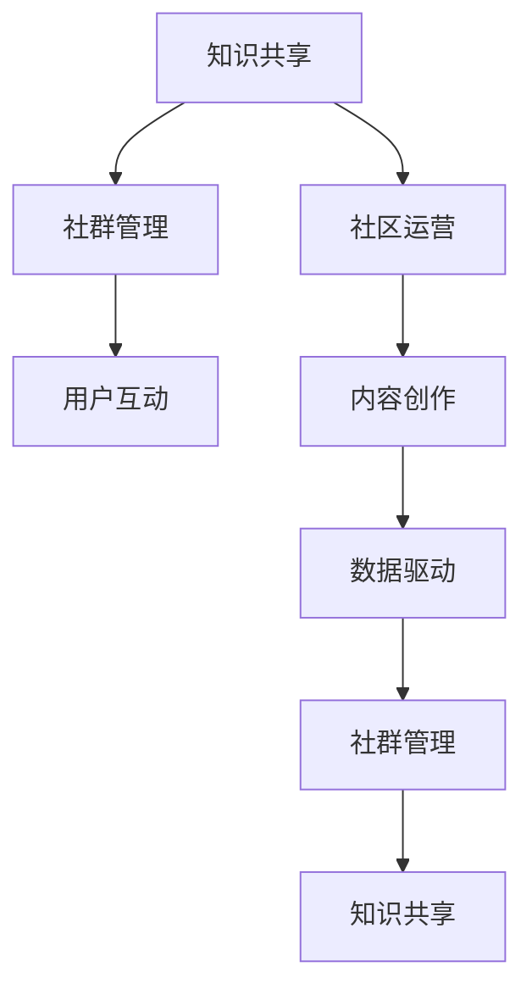

                 

# 打造专业知识社群的运营策略

> 关键词：知识共享,社群管理,社区运营,用户互动,内容创作,数据驱动

## 1. 背景介绍

### 1.1 问题由来
在当今数字化时代，知识的快速积累和传播速度已经超越了以往任何时代。人们获取知识的方式也从单一的图书、学术文章转向了更加多元和灵活的在线平台。特别是对于专业领域工作者，如何快速获取前沿信息、积累行业经验，并形成高质量的社区互动，成为了他们面临的重要挑战。因此，打造一个专业知识的社群，不仅能够为专业领域的从业者提供学习、交流、合作的便捷渠道，更能推动行业的健康发展和创新进步。

### 1.2 问题核心关键点
构建一个成功的专业知识社群，需要综合考虑多个因素，包括社区的定位、内容管理、用户互动、知识分享机制、运营策略等。本博客旨在围绕这些核心点，系统地介绍如何打造和运营一个高效、活跃的专业知识社群。

### 1.3 问题研究意义
一个成功的专业知识社群不仅能为成员提供专业知识的分享和交流平台，还能促进知识的创新和应用，推动行业的进步和发展。通过系统地了解社群运营的策略和方法，能够帮助社群管理者更有效地管理社群，吸引更多的高质量用户参与，提升社群的影响力和价值。

## 2. 核心概念与联系

### 2.1 核心概念概述

在构建专业知识社群的过程中，涉及到的核心概念包括：

- **知识共享**：指社群成员之间分享和交换专业知识、经验和技术的过程。知识共享是社群存在的基础，也是其核心价值所在。
- **社群管理**：指对社群资源进行有效配置和管理，包括用户管理、内容审核、活动组织等，确保社群的有序运行和良性发展。
- **社区运营**：通过制定策略和计划，促进社群活跃度，增加用户粘性，提高社群的整体价值和影响力。
- **用户互动**：指社群成员之间的交流、讨论、协作，旨在形成积极的学习氛围和知识碰撞。
- **内容创作**：指社群成员主动生成和传播专业内容的实践，包括撰写文章、发布视频、参与讨论等。
- **数据驱动**：基于数据分析和挖掘，优化社群运营策略，提高运营效率和效果。

这些概念之间存在紧密的联系和互动，相互促进，共同构成了一个专业知识社群的生态系统。

### 2.2 核心概念原理和架构的 Mermaid 流程图



这个流程图展示了核心概念之间的互动关系：

1. **知识共享**作为起点，是社群存在的基础。
2. **社群管理**确保知识共享的有序进行，同时也对**用户互动**和**内容创作**进行规范和引导。
3. **社区运营**通过策略制定和执行，促进**用户互动**和**内容创作**，进一步强化**知识共享**。
4. **内容创作**丰富了**知识共享**的内容，同时为**数据驱动**提供了素材。
5. **数据驱动**通过对社群运营数据的分析和利用，优化了**社群管理**和**社区运营**策略。

## 3. 核心算法原理 & 具体操作步骤

### 3.1 算法原理概述

构建专业知识社群的过程，本质上是一个综合应用多种技术和方法，持续优化社群生态系统的过程。其核心算法原理包括以下几个方面：

- **社区定位**：明确社群的目标和特色，吸引具有共同兴趣和需求的用户。
- **内容分发策略**：通过算法推荐，将高质量内容推送给最需要的用户。
- **用户行为分析**：基于用户行为数据，优化内容和互动策略，提升用户体验。
- **激励机制设计**：通过奖励和认可，激励用户积极参与和贡献内容。

### 3.2 算法步骤详解

构建和运营专业知识社群的主要步骤包括：

1. **社区规划**：确定社群的目标、定位和特色，设计社群的规则和功能。
2. **用户招募**：通过各种渠道吸引和招募目标用户，建立初步的社区基础。
3. **内容创作和审核**：鼓励用户积极创作内容，同时进行审核和筛选，确保内容质量和专业性。
4. **用户互动和参与**：通过话题讨论、问答、项目协作等方式，促进用户互动和知识共享。
5. **数据分析和优化**：持续收集和分析用户数据，优化社群运营策略，提升社群价值。

### 3.3 算法优缺点

构建和运营专业知识社群的优势和挑战如下：

**优势**：

1. **知识共享高效**：社群提供了一个平台，便于专业知识的快速传播和积累。
2. **专业交流深入**：社群成员之间有更深入的交流和讨论，有助于问题的解决和知识的创新。
3. **社群粘性强**：通过互动和激励机制，可以增强用户粘性和活跃度。

**挑战**：

1. **用户管理复杂**：社群成员多样，管理和引导难度较大。
2. **内容质量控制**：需要有效的审核和筛选机制，确保内容的专业性和准确性。
3. **互动质量低**：用户互动依赖于高质量内容和活跃的社区氛围，需要持续优化。

### 3.4 算法应用领域

知识社群的构建和运营，可以应用于多个领域，包括但不限于：

- **科技研发**：提供技术交流和协作平台，推动技术创新和应用。
- **医疗健康**：提供医学知识和经验分享，促进医疗知识的普及和应用。
- **教育培训**：提供在线学习和互动平台，提升教育培训的效果和质量。
- **金融投资**：提供金融知识分享和投资交流，增强金融决策的科学性和有效性。
- **创业创新**：提供创业资源和合作机会，促进创业项目的孵化和成长。

## 4. 数学模型和公式 & 详细讲解 & 举例说明

### 4.1 数学模型构建

在社群运营中，数据驱动是一个重要的原则。我们可以使用以下数学模型来描述社群的用户行为和互动情况：

- **用户活跃度模型**：
  $$
  A = \sum_{i=1}^N a_i
  $$
  其中，$A$为用户的总活跃度，$a_i$为每个时间段内用户的活跃度得分。

- **内容质量评分模型**：
  $$
  Q = \frac{\sum_{j=1}^M q_j}{M}
  $$
  其中，$Q$为内容的平均质量评分，$q_j$为每个内容的质量评分。

### 4.2 公式推导过程

以上模型的推导过程如下：

**用户活跃度模型**：

假设用户每天在线时间为$t_i$，每天浏览文章数量为$p_i$，则每个时间段内用户的活跃度得分$a_i$可以表示为：
$$
a_i = \frac{t_i + p_i}{T}
$$
其中$T$为总时间段数。将$a_i$求和即得到用户的总活跃度$A$。

**内容质量评分模型**：

假设对每篇文章进行质量评分，评分范围为$[0, 1]$。则内容的平均质量评分$Q$可以表示为：
$$
Q = \frac{1}{M}\sum_{j=1}^M q_j
$$
其中，$M$为内容的总数，$q_j$为第$j$篇文章的质量评分。

### 4.3 案例分析与讲解

以一个科技研发社区为例：

**用户活跃度模型**：
- 假设社区中有10000名用户，每天在线用户数为8000人，每天浏览文章数为1000篇。
- 如果用户每天在线时间为2小时，浏览文章数为10篇，则用户的总活跃度$A$为：
  $$
  A = \frac{8000 \times 2 + 1000 \times 10}{7} \approx 3600
  $$

**内容质量评分模型**：
- 假设社区中每天有1000篇文章，对每篇文章进行质量评分，评分平均为0.7。
- 则内容的平均质量评分$Q$为：
  $$
  Q = \frac{1000 \times 0.7}{1000} = 0.7
  $$

## 5. 项目实践：代码实例和详细解释说明

### 5.1 开发环境搭建

构建知识社群的开发环境主要包括以下几个步骤：

1. **选择合适的编程语言和框架**：
   - 语言：Python
   - 框架：Flask（用于搭建Web应用）、SQLAlchemy（用于数据库操作）、Jinja2（用于模板渲染）

2. **环境配置**：
   - 安装Python 3.x
   - 安装Flask和相关依赖
   - 配置数据库连接

3. **部署环境**：
   - 部署到云服务器，如AWS、阿里云、华为云等
   - 安装和配置Nginx等Web服务器

### 5.2 源代码详细实现

以下是一个简单的社区用户管理系统的代码实现：

```python
from flask import Flask, render_template, request
from flask_sqlalchemy import SQLAlchemy
from sqlalchemy import create_engine

app = Flask(__name__)
app.config['SQLALCHEMY_DATABASE_URI'] = 'sqlite:///users.db'
db = SQLAlchemy(app)

class User(db.Model):
    id = db.Column(db.Integer, primary_key=True)
    username = db.Column(db.String(50), unique=True)
    email = db.Column(db.String(100), unique=True)
    created_at = db.Column(db.DateTime, default=db.func.now())

@app.route('/')
def index():
    users = User.query.all()
    return render_template('index.html', users=users)

@app.route('/add_user', methods=['GET', 'POST'])
def add_user():
    if request.method == 'POST':
        username = request.form['username']
        email = request.form['email']
        new_user = User(username=username, email=email)
        db.session.add(new_user)
        db.session.commit()
        return 'User added successfully'
    else:
        return render_template('add_user.html')

if __name__ == '__main__':
    app.run(debug=True)
```

### 5.3 代码解读与分析

以上代码实现了一个简单的用户管理系统，包括用户注册和查询功能：

- `User`类：定义了用户的基本信息，包括ID、用户名、邮箱和注册时间。
- `SQLAlchemy`：用于数据库操作，定义了用户信息表的结构和操作。
- `Flask`：用于搭建Web应用，包括路由和模板渲染。

### 5.4 运行结果展示

用户管理系统运行后，可以通过访问`/`路径查询用户信息，通过访问`/add_user`路径进行用户注册。

## 6. 实际应用场景

### 6.1 智能问答系统

智能问答系统可以通过知识社群的平台，提供24/7的专家咨询服务。用户可以通过问答界面提交问题，系统自动匹配相关领域的专家进行回答，并提供类似问题的参考解答。这种实时互动的方式，可以大大提高问题解决的效率和质量。

### 6.2 在线教育平台

在线教育平台可以利用知识社群的资源，提供高质量的教学视频、互动讨论和作业辅导。通过社群管理者的审核和推荐，确保教学内容的科学性和专业性，增强学习效果。

### 6.3 项目协作平台

项目协作平台可以利用知识社群的资源，提供项目管理、代码共享和任务分配的功能。通过社群的协作机制，促进项目的进展和高质量代码的共享。

### 6.4 未来应用展望

未来，随着技术的不断进步，知识社群的应用场景将更加广泛，涵盖更多行业和领域。以下是对未来应用场景的展望：

1. **虚拟现实技术**：利用VR/AR技术，打造沉浸式的学习体验和互动环境，提升用户体验。
2. **人工智能技术**：结合自然语言处理、图像识别等技术，提供更加智能化和个性化的服务。
3. **区块链技术**：通过区块链技术保障用户数据的隐私和安全，建立更可信的社区环境。
4. **社交媒体集成**：将知识社群与社交媒体平台集成，扩大社群的影响力和用户覆盖范围。
5. **实时数据分析**：利用大数据和机器学习技术，实时分析社群数据，优化社群运营策略。

## 7. 工具和资源推荐

### 7.1 学习资源推荐

以下是几个推荐的知识资源，帮助读者更好地理解和掌握社群运营的知识：

1. **《社区运营指南》**：详细介绍了社群运营的各个环节和策略，提供实用的案例和分析。
2. **《用户行为分析》**：讲解了用户行为数据挖掘和分析的基本方法，提升社群运营的科学性。
3. **《数据可视化》**：介绍如何使用数据可视化技术，直观展示社群运营数据，优化运营决策。
4. **《社交网络分析》**：讲解社交网络分析的基本理论和工具，提升社群管理的效率和效果。

### 7.2 开发工具推荐

以下是几个推荐的开发工具，帮助开发者更高效地实现社群管理系统：

1. **Flask**：轻量级的Web应用框架，适合快速开发小型应用。
2. **SQLAlchemy**：强大的ORM框架，支持多数据库操作和高级查询。
3. **Jinja2**：模板渲染引擎，支持动态生成HTML页面。
4. **Gunicorn**：基于Geiger daemon的WSGI HTTP服务，支持并发处理请求。

### 7.3 相关论文推荐

以下是几篇经典的学术论文，深入研究了社群运营和知识共享的理论与实践：

1. **《社区运营的理论与实践》**：总结了社群运营的理论基础和实践经验，提供了丰富的案例分析。
2. **《知识共享的社会网络分析》**：通过社会网络分析方法，研究知识共享的传播路径和影响因素。
3. **《用户行为数据驱动的社群运营策略》**：基于用户行为数据，提出了优化社群运营的策略和方法。

## 8. 总结：未来发展趋势与挑战

### 8.1 总结

本博客系统地介绍了打造专业知识社群的运营策略，包括社区规划、用户管理、内容创作、数据分析等多个环节。通过详细介绍社群运营的核心概念和操作步骤，帮助社群管理者更好地理解和应用这些策略。

### 8.2 未来发展趋势

未来的知识社群将更加智能化、个性化和多元化，以下趋势值得关注：

1. **技术融合**：结合人工智能、大数据、区块链等技术，提升社群的智能化水平和安全性。
2. **社交拓展**：将社群与社交媒体、论坛等平台集成，扩大社群的影响力和用户覆盖范围。
3. **内容创新**：利用AR/VR、实时数据分析等技术，提供更加沉浸式和个性化的内容服务。
4. **价值提升**：通过知识变现、用户付费等模式，提升社群的价值和可持续性。
5. **社区自治**：通过社区自治机制，提升用户参与感和社群的自主管理能力。

### 8.3 面临的挑战

尽管知识社群在快速发展和壮大，但也面临一些挑战：

1. **用户管理**：用户多样，管理复杂，需要建立有效的用户行为管理和引导机制。
2. **内容质量**：需要严格的内容审核和筛选机制，确保内容的专业性和准确性。
3. **互动质量**：需要持续优化互动机制，提升用户粘性和互动质量。
4. **数据隐私**：需要保障用户数据的隐私和安全，建立更可信的社区环境。
5. **社区自治**：需要建立社区自治机制，提升用户参与感和社群的自主管理能力。

### 8.4 研究展望

未来的研究需要关注以下几个方面：

1. **用户行为模型**：深入研究用户行为模型，优化社群运营策略。
2. **内容推荐算法**：开发高效的内容推荐算法，提升用户的内容获取体验。
3. **社区自治机制**：探索社区自治机制，提升用户参与感和社群的自主管理能力。
4. **数据隐私保护**：研究数据隐私保护技术，确保用户数据的安全性。
5. **跨平台集成**：研究跨平台集成技术，提升社群的影响力和用户覆盖范围。

## 9. 附录：常见问题与解答

### Q1: 如何提高用户粘性？

A: 用户粘性是社群管理的重要指标，可以通过以下方式提升：

1. **提供高质量内容**：持续发布有价值、有趣味的内容，吸引用户关注和参与。
2. **用户互动机制**：通过话题讨论、问答、项目协作等方式，促进用户互动和知识共享。
3. **激励机制设计**：通过奖励和认可，激励用户积极参与和贡献内容。
4. **社群自治机制**：赋予用户一定的管理和决策权，增强用户参与感和社区认同感。

### Q2: 如何确保内容的专业性和准确性？

A: 内容专业性和准确性的保障需要建立完善的内容审核机制：

1. **专家审核**：邀请领域专家参与内容审核，确保内容的科学性和专业性。
2. **用户投票**：通过用户投票机制，筛选高质量内容，提升内容质量。
3. **数据驱动分析**：基于用户反馈和数据挖掘，持续优化内容策略。
4. **开源社区合作**：与开源社区合作，获取高质量的内容资源。

### Q3: 如何提升社群的智能化水平？

A: 通过以下技术手段提升社群的智能化水平：

1. **自然语言处理**：利用NLP技术，实现智能问答和内容推荐。
2. **机器学习**：通过用户行为数据挖掘和分析，优化社群运营策略。
3. **图像识别**：利用图像识别技术，提升内容分类和检索的准确性。
4. **区块链技术**：保障用户数据的隐私和安全，建立更可信的社区环境。

### Q4: 如何处理社群中的负面行为？

A: 社群中的负面行为需要建立完善的社区管理机制：

1. **社区规则**：制定明确的社区规则，规范用户行为。
2. **用户行为监控**：实时监控用户行为，及时处理违规行为。
3. **用户举报机制**：建立用户举报机制，快速处理负面行为。
4. **社区自治**：通过社区自治机制，提升用户参与感和社群的自主管理能力。

---

作者：禅与计算机程序设计艺术 / Zen and the Art of Computer Programming

