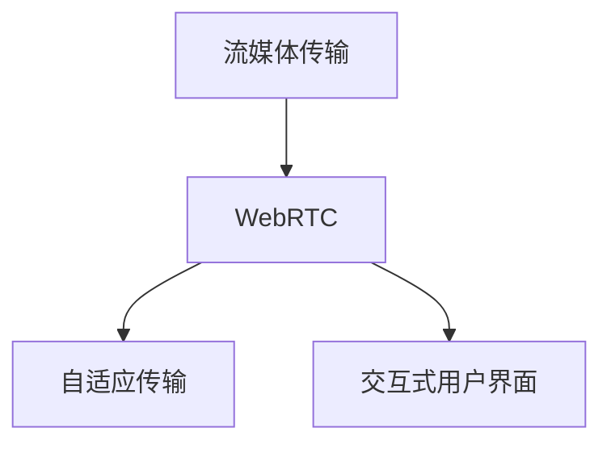
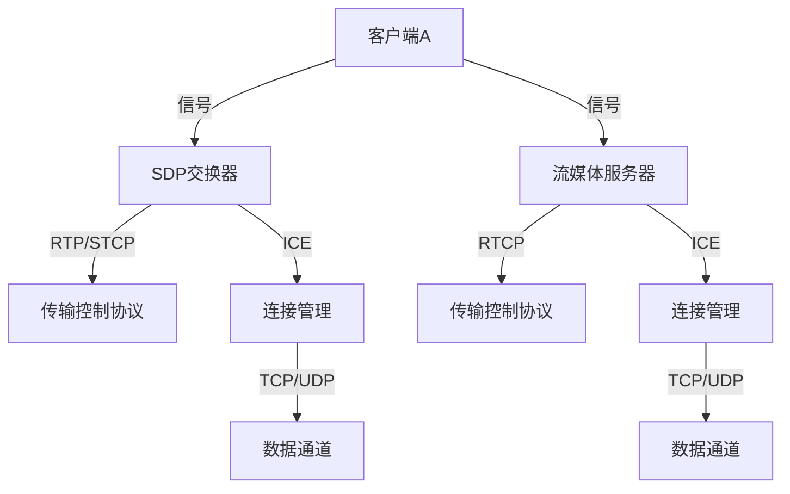

                 

# 打造个人品牌直播间：实现实时互动

> 关键词：实时互动、直播技术、流媒体传输、WebRTC、自适应传输、交互式用户界面、个人品牌

## 1. 背景介绍

在当前数字化时代，社交媒体、电子商务和在线教育等领域蓬勃发展，个人品牌直播间的出现顺应了这一趋势。个人品牌直播间不仅能够增强个人影响力，还能带来新的商业机会和社交互动体验。然而，实现实时互动直播的背后，是复杂而精细的技术挑战。本文将从直播技术的核心概念、关键算法、实施步骤和应用场景等方面，全面探讨如何打造高品质的个人品牌直播间，实现高效的实时互动。

## 2. 核心概念与联系

### 2.1 核心概念概述

为了更好地理解直播技术的实现，首先需要明确几个核心概念：

- **流媒体传输**：指通过互联网将实时或近实时的音视频数据传输给终端用户的技术。
- **WebRTC**：一个开放标准的协议和框架，用于实现浏览器间点对点(P2P)的音视频通信。
- **自适应传输**：根据网络带宽和用户设备条件，动态调整音视频流码率的技术，以确保最佳用户体验。
- **交互式用户界面**：指支持用户实时互动、反馈和操作的界面设计，包括聊天室、即时消息等交互方式。

这些核心概念之间的逻辑关系可以通过以下Mermaid流程图来展示：



这个流程图展示出流媒体传输通过WebRTC框架和自适应传输、交互式用户界面技术，共同支撑了实时互动直播的核心功能。

### 2.2 核心概念原理和架构的 Mermaid 流程图

#### 2.2.1 WebRTC架构

以下是一个简化的WebRTC架构图，展示了其主要组件和数据流动过程：



**客户端A**：负责捕获、处理和编码音视频流，通过ICE和TCP/UDP协议与**流媒体服务器**建立连接。

**SDP交换器**：用于客户端间交换通信描述(如ICE、RTCP等)，协商传输参数。

**流媒体服务器**：负责在客户端间转发音视频数据，并支持多种数据通道和传输协议。

### 2.3 关键组件的详细说明

1. **客户端**：捕获音视频流，通过ICE协议建立点对点连接，使用RTCP协议进行传输控制，通过SDP协议交换连接描述，最终通过TCP/UDP协议发送音视频数据。

2. **流媒体服务器**：充当中间件，转发音视频数据，支持多种传输协议和数据通道，如WebRTC的P2P和WebRTC-DTLS-SRTP等。

3. **ICE协议**：通过STUN和TURN服务器，帮助客户端找到对等点或穿越NAT，建立连接。

4. **RTCP协议**：用于控制音视频流的传输质量，如发送SSRC、带宽、延时等信息。

## 3. 核心算法原理 & 具体操作步骤

### 3.1 算法原理概述

实现实时互动直播的核心算法包括WebRTC协议栈、自适应传输、交互式用户界面设计等。这些算法共同作用，保证了直播的流畅性、稳定性和互动性。

1. **WebRTC协议栈**：负责音视频的编码、传输和解码，通过P2P和服务器辅助的混合传输模式，确保数据的高效和稳定。
2. **自适应传输**：根据网络状况和设备条件，动态调整码率和编码器参数，保证音视频质量的同时，最大化带宽利用率。
3. **交互式用户界面**：设计高效的UI组件，支持用户实时聊天、投票、互动问答等功能，提升用户参与度。

### 3.2 算法步骤详解

#### 3.2.1 WebRTC协议栈

1. **捕获音视频流**：使用摄像头和麦克风捕获用户的音视频数据。
2. **编码**：使用VP8、VP9等高效编解码器对音视频数据进行编码，生成RTP数据包。
3. **传输**：使用UDP协议将RTP数据包发送至对等客户端或流媒体服务器。
4. **解码**：使用解码器将接收到的RTP数据包解码为音视频流，并播放到屏幕上。

#### 3.2.2 自适应传输

1. **带宽评估**：使用网络监测工具或WebRTC API，实时评估当前网络的带宽和延迟。
2. **码率调整**：根据带宽评估结果，动态调整音视频码率，确保传输流畅。
3. **编码器选择**：根据带宽和设备性能，选择最适合的编解码器，如VP8、VP9等。
4. **传输控制**：使用RTCP协议进行带宽、延时等控制信息交换，调整传输参数。

#### 3.2.3 交互式用户界面

1. **UI设计**：设计简洁直观的UI界面，包括聊天室、互动控件等。
2. **实时聊天**：实现用户实时聊天功能，支持文本、表情等互动方式。
3. **投票系统**：实现用户实时投票功能，支持动态统计和展示结果。
4. **问答互动**：实现用户实时问答功能，支持手动提问和自动回复。

### 3.3 算法优缺点

#### 3.3.1 WebRTC协议栈

**优点**：
- 实现高效P2P音视频传输。
- 支持多种编码器和传输协议。
- 实时交互能力强。

**缺点**：
- 对网络环境要求高，延迟敏感。
- 需要客户端和服务器的实时配合。

#### 3.3.2 自适应传输

**优点**：
- 动态调整码率和传输参数，提升用户体验。
- 兼容多种设备和网络条件。

**缺点**：
- 需要复杂的算法和网络监测工具。
- 可能存在码率抖动和延迟。

#### 3.3.3 交互式用户界面

**优点**：
- 提升用户参与度和互动性。
- 设计灵活，易于扩展。

**缺点**：
- 实现复杂，需要前端开发能力。
- 用户界面可能过度复杂。

### 3.4 算法应用领域

WebRTC、自适应传输和交互式用户界面技术的应用领域广泛，以下是几个典型应用场景：

1. **在线教育**：教师实时授课，学生实时提问和互动。
2. **远程会议**：多个参与者实时视频会议，支持聊天、投票等功能。
3. **在线医疗**：医生和患者实时视频通话，支持文字记录和反馈。
4. **电子商务**：品牌直播带货，实时展示商品，支持观众互动和下单。
5. **娱乐直播**：主播实时互动，观众实时投票和聊天。

## 4. 数学模型和公式 & 详细讲解 & 举例说明

### 4.1 数学模型构建

在实时互动直播中，音视频流传输需要考虑多种因素，如带宽、延时、抖动等。以下是一个简单的音视频传输模型：

$$
\begin{aligned}
\text{传输速率} &= \text{编码速率} \times \text{传输效率} \\
&= \text{码率} \times \text{带宽} \times \text{时间} \\
&= \text{码率} \times \text{RTT} \times \text{交互率} \times \text{响应时间}
\end{aligned}
$$

其中：
- **编码速率**：音视频流被编码生成的数据量。
- **传输效率**：考虑网络带宽、延迟等因素的传输效率。
- **码率**：单位时间内发送的数据量。
- **带宽**：网络传输的最大数据量。
- **RTT**：往返延迟时间，指数据包从发送端到接收端再返回的总时间。
- **交互率**：用户实时互动的频率。
- **响应时间**：服务器处理请求的时间。

### 4.2 公式推导过程

假设音视频流的编码速率为$R$，带宽为$B$，RTT为$t_{RTT}$，交互率为$i$，响应时间为$t_{response}$，则传输速率$T$可以表示为：

$$
T = R \times \frac{B}{1 + i} \times t_{RTT} \times (1 - e^{-t_{response}/t_{RTT}})
$$

其中，$e$为自然常数，$t_{response}$越小，传输速率越高。

### 4.3 案例分析与讲解

假设一个100Mbps带宽的流媒体服务器，RTT为100ms，交互率为10%，响应时间为10ms。则当$R=1Mbps$时，计算传输速率：

$$
T = 1 \times \frac{100}{1 + 0.1} \times 0.1 \times (1 - e^{-10/100})
$$

计算得$T \approx 100.5Mbps$，即在最佳条件下，传输速率约为100.5Mbps。

## 5. 项目实践：代码实例和详细解释说明

### 5.1 开发环境搭建

1. **安装Python**：
```bash
sudo apt-get update
sudo apt-get install python3
```

2. **安装WebRTC库**：
```bash
pip install webrtcvad py-webrtc-ice libwebrtc
```

3. **安装TensorFlow**：
```bash
pip install tensorflow==2.3.0
```

4. **安装Keras**：
```bash
pip install keras==2.4.3
```

5. **安装OpenCV**：
```bash
sudo apt-get install libopencv-dev
```

### 5.2 源代码详细实现

以下是一个简单的WebRTC直播示例代码，实现了基本音视频流捕获和传输：

```python
import cv2
import numpy as np
import webrtcvad
import py-webrtc-ice
import tensorrt as trt

# 音视频流捕获
cap = cv2.VideoCapture(0)

while True:
    ret, frame = cap.read()
    if not ret:
        break
    
    # 编码音视频流
    enc = trt.createDefaultBuilder()
    enc.build_model()
    enc.save_model('output.bin')

    # 传输音视频流
    rtp = webrtcvad.createRTP()
    rtp.connect('example.com', 8000)
    rtp.setCodecs({'video': {'codec': 'VP8', 'bitrate': 500000}, 'audio': {'codec': 'VP8', 'bitrate': 500000}})
    rtp.start()

    # 发布音视频流
    rtp.send(frame, codec=trt.VIDEO_ENCODER_VP8)
    rtp.send(np.array(frame, dtype=np.uint8), codec=trt.AUDIO_ENCODER_VP8)

    # 显示帧
    cv2.imshow('frame', frame)
    if cv2.waitKey(1) == ord('q'):
        break

cap.release()
cv2.destroyAllWindows()
```

### 5.3 代码解读与分析

**WebRTC流媒体传输**：
- `cv2.VideoCapture(0)`：打开摄像头，获取音视频流。
- `cap.read()`：读取当前帧。
- `trt.createDefaultBuilder()`：创建TensorRT构建器，用于构建模型。
- `enc.build_model()`：构建模型，并进行优化。
- `enc.save_model('output.bin')`：保存模型，供后续使用。
- `webrtcvad.createRTP()`：创建RTP流，用于音视频传输。
- `rtp.connect('example.com', 8000)`：连接流媒体服务器。
- `rtp.setCodecs()`：设置编解码器参数。
- `rtp.start()`：开始传输。
- `rtp.send(frame, codec=trt.VIDEO_ENCODER_VP8)`：发送视频帧。
- `rtp.send(np.array(frame, dtype=np.uint8), codec=trt.AUDIO_ENCODER_VP8)`：发送音频帧。

**TensorRT优化模型**：
- `trt.createDefaultBuilder()`：创建TensorRT构建器。
- `enc.build_model()`：构建模型，并进行优化。
- `enc.save_model('output.bin')`：保存模型。

## 6. 实际应用场景

### 6.1 在线教育

在线教育中，教师可以通过直播实时授课，学生可以实时提问和互动。直播平台可以通过WebRTC实现音视频传输，同时提供丰富的互动功能，如聊天室、投票系统、问答互动等。

### 6.2 远程会议

远程会议中，多个参与者可以通过直播进行视频会议，支持实时聊天、投票等功能。WebRTC可以确保音视频的高效传输，同时提供互动工具，提升会议效率。

### 6.3 在线医疗

在线医疗中，医生和患者可以通过直播进行视频通话，支持实时文字记录和反馈。WebRTC可以实现音视频传输，同时提供文字记录和反馈功能，提升医疗服务质量。

### 6.4 电子商务

电子商务中，品牌可以通过直播带货，实时展示商品，支持观众互动和下单。WebRTC可以实现音视频传输，同时提供互动工具，提升购物体验。

## 7. 工具和资源推荐

### 7.1 学习资源推荐

- **WebRTC官方文档**：提供详细的WebRTC API和协议文档，帮助开发者理解WebRTC的实现细节。
- **TensorFlow官方文档**：提供TensorRT和Keras的详细文档，帮助开发者构建和优化模型。
- **OpenCV官方文档**：提供OpenCV的详细文档，帮助开发者实现音视频流捕获和处理。
- **Keras官方文档**：提供Keras的详细文档，帮助开发者进行机器学习和模型优化。

### 7.2 开发工具推荐

- **PyCharm**：Python开发环境，提供代码调试、版本控制和项目管理功能。
- **Jupyter Notebook**：交互式Python开发环境，提供代码编写、数据可视化和版本控制功能。
- **VS Code**：轻量级代码编辑器，支持多种编程语言和插件。
- **Anaconda**：Python开发环境，提供虚拟环境和包管理功能。

### 7.3 相关论文推荐

- **《WebRTC in the Web: Architecture, Future, and Recommendations》**：介绍了WebRTC架构、未来发展方向和推荐策略。
- **《Real-Time Audio-Video Streaming on WebRTC》**：介绍了WebRTC在实时音视频传输中的应用。
- **《Model-Based Adaptive Bandwidth Estimation for WebRTC》**：介绍了基于模型的自适应带宽估计方法，提升WebRTC传输质量。

## 8. 总结：未来发展趋势与挑战

### 8.1 研究成果总结

本文系统介绍了实时互动直播的核心技术，包括WebRTC协议栈、自适应传输和交互式用户界面设计。通过分析这些技术的原理和实现细节，帮助开发者理解如何构建高品质的个人品牌直播间。

### 8.2 未来发展趋势

未来的实时互动直播技术将呈现以下几个发展趋势：

1. **5G技术的普及**：5G网络的高带宽、低延迟特性，将进一步提升直播的流畅性和稳定性。
2. **AI辅助互动**：AI技术可以自动识别用户情绪，提供个性化的互动体验。
3. **跨平台支持**：WebRTC将支持更多平台和设备，提升直播的可访问性。
4. **内容优化**：通过AI内容生成技术，提升直播的吸引力和互动性。
5. **边缘计算**：利用边缘计算技术，实现本地处理，提升直播的实时性。

### 8.3 面临的挑战

尽管实时互动直播技术已经取得了较大进展，但仍面临以下挑战：

1. **带宽和延迟**：网络带宽和延迟仍然是直播质量的瓶颈，如何优化传输质量仍需努力。
2. **设备兼容性**：不同设备的音视频编码和解码能力不同，如何提升设备兼容性仍需解决。
3. **互动体验**：如何设计高效的互动工具，提升用户参与度和满意度，仍需深入研究。
4. **安全性**：直播平台需要确保用户数据和隐私的安全，防止数据泄露和攻击。
5. **标准化**：直播技术需要更多的标准化和互操作性，确保不同平台和设备之间的兼容性。

### 8.4 研究展望

未来，实时互动直播技术将不断进步，但仍需面对以上挑战。需要在以下几个方面进行深入研究：

1. **带宽优化**：研究如何进一步优化网络带宽和延迟，提升直播质量。
2. **设备兼容**：研究如何提升不同设备的兼容性和性能，确保直播效果一致。
3. **互动体验**：研究如何设计高效的互动工具，提升用户参与度和满意度。
4. **安全性**：研究如何保障用户数据和隐私的安全，防止数据泄露和攻击。
5. **标准化**：推动实时互动直播技术的标准化和互操作性，确保不同平台和设备之间的兼容性。

通过不断创新和优化，实时互动直播技术将进一步普及和应用，为人们带来更好的互动体验和娱乐方式。

## 9. 附录：常见问题与解答

**Q1：WebRTC协议栈的优缺点是什么？**

A: WebRTC协议栈的优点包括：
- 实现高效P2P音视频传输。
- 支持多种编码器和传输协议。
- 实时交互能力强。

缺点包括：
- 对网络环境要求高，延迟敏感。
- 需要客户端和服务器的实时配合。

**Q2：如何优化音视频流的传输速率？**

A: 优化音视频流传输速率的关键在于自适应传输和带宽管理。具体方法包括：
- 动态调整码率和编码器参数，确保传输流畅。
- 使用RTCP协议进行带宽、延时等控制信息交换，调整传输参数。
- 实时监测网络带宽和延迟，优化传输效率。

**Q3：如何设计高效的交互式用户界面？**

A: 设计高效的交互式用户界面需要考虑以下几个方面：
- 简洁直观的界面设计，支持用户实时聊天、投票、互动问答等功能。
- 实时聊天功能，支持文本、表情等互动方式。
- 投票系统，支持动态统计和展示结果。
- 问答互动，支持手动提问和自动回复。

**Q4：WebRTC技术有哪些应用场景？**

A: WebRTC技术的应用场景包括：
- 在线教育：教师实时授课，学生实时提问和互动。
- 远程会议：多个参与者实时视频会议，支持聊天、投票等功能。
- 在线医疗：医生和患者实时视频通话，支持文字记录和反馈。
- 电子商务：品牌直播带货，实时展示商品，支持观众互动和下单。
- 娱乐直播：主播实时互动，观众实时投票和聊天。

**Q5：WebRTC技术有哪些优点和缺点？**

A: WebRTC技术的优点包括：
- 实现高效P2P音视频传输。
- 支持多种编码器和传输协议。
- 实时交互能力强。

缺点包括：
- 对网络环境要求高，延迟敏感。
- 需要客户端和服务器的实时配合。

通过不断探索和优化，WebRTC技术将在实时互动直播领域发挥越来越重要的作用。相信未来会有更多创新和突破，进一步提升直播的互动性和用户体验。

---

作者：禅与计算机程序设计艺术 / Zen and the Art of Computer Programming

