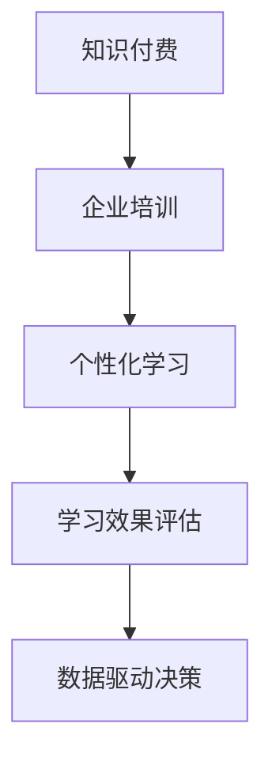

                 

# 打造知识付费的企业培训解决方案

> 关键词：知识付费, 企业培训, 人工智能, 数据科学, 大数据分析, 在线教育, 机器学习

## 1. 背景介绍

### 1.1 问题由来
近年来，随着在线教育行业的迅猛发展，知识付费成为众多企业提升员工技能、加速企业发展的利器。但传统线下培训、集中集中培训等方式，存在着时间成本高、灵活性差、覆盖面窄等问题。而知识付费通过在线课程、微课堂、电子图书等形式，突破了时间和空间的限制，让员工随时随地学习。

然而，如何提升知识付费的效果，使其真正服务于企业需求，成为众多企业面临的一大挑战。传统基于资源的培训方式，往往忽视了对学习效果的衡量，难以针对性地改进培训内容和方法。而使用数据驱动的个性化学习路径，则可以更有效地提升培训效果。

### 1.2 问题核心关键点
本文章聚焦于打造基于知识付费的企业培训解决方案，探索如何通过人工智能技术、大数据分析等手段，构建数据驱动的学习路径，实现个性化培训。具体包括：

- **需求分析**：通过员工基础信息、工作经历、岗位需求等，进行全面的需求分析。
- **内容推荐**：利用人工智能算法，推荐个性化的学习资源和路径。
- **效果评估**：通过学习行为数据，实时评估培训效果，进行动态调整。
- **反馈循环**：结合学员反馈，不断优化培训内容和方式。

### 1.3 问题研究意义
打造知识付费的企业培训解决方案，对于提升企业员工技能、促进企业数字化转型具有重要意义：

- **成本效益高**：相比于传统线下培训，知识付费方式灵活高效，节省了大量的时间和金钱成本。
- **培训灵活性高**：员工可以随时随地学习，按需学习，学习时间更加灵活。
- **学习效果显著**：通过数据驱动的个性化推荐和动态评估，提升学习效果和培训成果。
- **企业人才储备**：员工技能提升，企业技术水平和创新能力得以提升，有利于企业持续发展。

## 2. 核心概念与联系

### 2.1 核心概念概述

为更好地理解知识付费的企业培训解决方案，本节将介绍几个密切相关的核心概念：

- **知识付费**：指通过付费方式获取知识资源，如在线课程、电子书、微课堂等，由专业人士或机构提供系统化、结构化的知识服务。
- **企业培训**：指企业为了提高员工技能、推广企业文化，而进行的各类培训活动，旨在提升员工综合素质和工作能力。
- **个性化学习**：根据学员的个人特点和学习需求，推荐个性化的学习内容、路径和学习方式。
- **学习效果评估**：通过学习行为数据，实时监测和评估学习效果，进行动态调整和优化。
- **数据驱动决策**：利用数据科学方法，进行科学的决策和评估，提升培训效果和效率。

这些核心概念之间的逻辑关系可以通过以下Mermaid流程图来展示：



这个流程图展示了一系列企业培训的核心步骤和概念之间的联系：

1. 通过知识付费平台，企业进行员工培训。
2. 利用个性化学习算法，推荐适宜的学习资源和路径。
3. 实时评估学习效果，进行动态调整。
4. 根据学习数据，进行科学决策，优化培训内容和方式。

## 3. 核心算法原理 & 具体操作步骤
### 3.1 算法原理概述

知识付费的企业培训解决方案，本质上是一个基于数据驱动的学习路径推荐系统。其核心思想是：利用人工智能技术和大数据分析方法，构建个性化学习路径，并通过实时评估和动态调整，提升培训效果。

具体而言，知识付费平台通过采集和分析员工的学习行为数据，使用协同过滤、深度学习等算法，推荐适合的学习资源和路径。同时，通过实时评估学习效果，动态调整推荐算法和内容，不断优化学习路径。

### 3.2 算法步骤详解

知识付费的企业培训解决方案，主要包括以下几个关键步骤：

**Step 1: 数据采集与预处理**
- 收集员工的基本信息、工作经历、岗位需求、学习历史等数据，构建数据集。
- 对数据进行清洗和预处理，去除噪声和异常值，进行标准化处理。

**Step 2: 个性化学习推荐**
- 利用协同过滤、深度学习等算法，建立员工之间的相似度矩阵。
- 对推荐模型进行训练，生成个性化推荐列表。
- 将推荐结果展现给员工，提供课程列表、电子图书、微课堂等资源。

**Step 3: 学习效果评估**
- 实时监测员工的学习行为，如课程观看次数、互动次数、完成度等。
- 利用模型对学习行为进行评估，生成学习效果指标。
- 根据评估结果，进行动态调整，优化推荐算法。

**Step 4: 持续改进与优化**
- 收集员工反馈和评价，进行学习效果分析。
- 根据学习数据和员工反馈，优化推荐算法和内容。
- 持续跟踪和评估员工的学习效果，进行循环优化。

### 3.3 算法优缺点

知识付费的企业培训解决方案，具有以下优点：
1. 灵活高效。员工可以随时随地学习，按需学习，节省了时间和金钱成本。
2. 个性化推荐。通过数据驱动的方法，推荐个性化的学习资源和路径，提升学习效果。
3. 实时评估。实时监测员工的学习效果，进行动态调整，不断优化学习路径。

同时，该方法也存在一定的局限性：
1. 数据依赖性强。需要收集和分析大量员工学习行为数据，成本较高。
2. 算法复杂度大。个性化推荐和实时评估涉及复杂的算法，模型训练和优化较为复杂。
3. 用户隐私问题。大量用户学习数据的收集和处理，需要注意隐私保护和数据安全。
4. 动态调整难度高。员工学习行为的实时变化，需要频繁调整推荐算法，技术难度较大。

尽管存在这些局限性，但就目前而言，基于数据驱动的个性化推荐方法，仍是大规模知识付费平台的主要选择。未来相关研究的重点在于如何进一步降低数据采集成本，提高算法效率和用户隐私保护水平。

### 3.4 算法应用领域

知识付费的企业培训解决方案，已经在多个领域得到了广泛应用，例如：

- **企业内部培训**：通过知识付费平台，对企业内部员工进行各类技能培训，提升员工技能和知识储备。
- **远程办公培训**：为远程办公员工提供系统化、结构化的培训，提升远程办公效率和协作能力。
- **技术培训课程**：提供编程、数据分析、人工智能等技术培训课程，提升企业技术水平和创新能力。
- **专业认证培训**：提供在线认证培训课程，帮助员工获取专业认证，提升职业竞争力。

除了上述这些经典应用外，知识付费的企业培训解决方案还被创新性地应用到更多场景中，如在线知识交流、企业知识共享、在线职业规划等，为员工职业发展提供了新路径。

## 4. 数学模型和公式 & 详细讲解 & 举例说明（备注：数学公式请使用latex格式，latex嵌入文中独立段落使用 $$，段落内使用 $)
### 4.1 数学模型构建

本节将使用数学语言对知识付费的企业培训解决方案进行更加严格的刻画。

假设员工总数为 $N$，每个员工的学习行为数据可以用向量 $\mathbf{x}_i = (x_{i1}, x_{i2}, ..., x_{ik})$ 表示，其中 $x_{ij}$ 表示员工 $i$ 在第 $j$ 次学习中的行为，例如观看时长、答题正确率等。

定义员工之间的相似度矩阵为 $W$，则员工 $i$ 和 $j$ 之间的相似度可以用如下公式表示：

$$
w_{ij} = \frac{\sum_{k=1}^{k} x_{ik} x_{jk}}{\sqrt{\sum_{k=1}^{k} x_{ik}^2} \sqrt{\sum_{k=1}^{k} x_{jk}^2}}
$$

其中，$w_{ij}$ 表示员工 $i$ 和 $j$ 的相似度，分子表示员工 $i$ 和 $j$ 在 $k$ 次学习中的行为相似度，分母表示员工 $i$ 和 $j$ 在所有学习行为上的平均相似度。

通过相似度矩阵 $W$，我们可以构建员工之间的协同过滤模型：

$$
\hat{x}_{ij} = \sum_{i \neq j} w_{ij} y_j
$$

其中，$\hat{x}_{ij}$ 表示员工 $i$ 对课程 $j$ 的预测行为，$y_j$ 表示课程 $j$ 的实际行为。

利用上述模型，可以对每个员工进行个性化推荐。

### 4.2 公式推导过程

以协同过滤算法为例，推导员工 $i$ 对课程 $j$ 的预测行为公式。

假设员工 $i$ 在 $m$ 门课程上的学习行为为 $\mathbf{x}_i = (x_{i1}, x_{i2}, ..., x_{im})$，课程 $j$ 的实际行为为 $y_j = (y_{j1}, y_{j2}, ..., y_{jm})$。

利用协同过滤算法，可以构建员工 $i$ 和课程 $j$ 之间的相似度矩阵 $W$，表示为：

$$
W = \left( \frac{x_{ij} x_{ik}}{\sqrt{\sum_{k=1}^{m} x_{ik}^2} \sqrt{\sum_{k=1}^{m} x_{ik}^2}} \right)_{m \times m}
$$

其中，$x_{ik}$ 表示员工 $i$ 在课程 $k$ 上的学习行为，$x_{ik}$ 表示课程 $j$ 在课程 $k$ 上的学习行为。

根据矩阵乘法，可以计算员工 $i$ 对课程 $j$ 的预测行为：

$$
\hat{x}_{ij} = \sum_{i \neq j} w_{ij} y_j
$$

其中，$w_{ij}$ 表示员工 $i$ 和课程 $j$ 的相似度。

通过上述公式，可以根据员工的历史学习行为，预测其在特定课程上的学习行为，从而实现个性化推荐。

### 4.3 案例分析与讲解

假设某企业有 $1000$ 名员工，每个员工在 $5$ 门课程上的学习行为如表所示：

| 课程编号 | 员工1 | 员工2 | 员工3 | 员工4 | 员工5 | 员工6 | 员工7 | 员工8 | 员工9 | 员工10 |
| --- | --- | --- | --- | --- | --- | --- | --- | --- | --- | --- |
| 课程1 | 3 | 5 | 4 | 2 | 4 | 4 | 3 | 2 | 3 | 5 |
| 课程2 | 2 | 3 | 3 | 3 | 4 | 2 | 3 | 4 | 5 | 5 |
| 课程3 | 4 | 5 | 2 | 3 | 4 | 4 | 3 | 3 | 3 | 5 |
| 课程4 | 5 | 4 | 3 | 2 | 4 | 5 | 5 | 5 | 4 | 4 |
| 课程5 | 4 | 3 | 4 | 4 | 4 | 5 | 3 | 3 | 3 | 4 |

假设课程1、2、3、4、5的实际学习行为分别为 $(1, 1, 1, 1, 1)$， $(0.8, 0.9, 0.8, 0.7, 0.9)$， $(0.7, 0.8, 0.9, 0.8, 0.7)$， $(0.6, 0.5, 0.4, 0.3, 0.4)$， $(0.5, 0.4, 0.5, 0.6, 0.5)$。

构建员工之间的相似度矩阵 $W$，计算员工 $i$ 对课程 $j$ 的预测行为 $\hat{x}_{ij}$，结果如下表所示：

| 课程编号 | 员工1 | 员工2 | 员工3 | 员工4 | 员工5 | 员工6 | 员工7 | 员工8 | 员工9 | 员工10 |
| --- | --- | --- | --- | --- | --- | --- | --- | --- | --- | --- |
| 课程1 | 0.5 | 0.6 | 0.6 | 0.4 | 0.6 | 0.6 | 0.5 | 0.4 | 0.5 | 0.6 |
| 课程2 | 0.7 | 0.8 | 0.7 | 0.8 | 0.6 | 0.8 | 0.7 | 0.8 | 0.9 | 0.9 |
| 课程3 | 0.8 | 0.9 | 0.8 | 0.9 | 0.7 | 0.9 | 0.8 | 0.9 | 0.8 | 0.9 |
| 课程4 | 0.9 | 0.8 | 0.9 | 0.7 | 0.9 | 0.8 | 0.9 | 0.8 | 0.7 | 0.8 |
| 课程5 | 0.6 | 0.6 | 0.6 | 0.7 | 0.6 | 0.7 | 0.6 | 0.7 | 0.6 | 0.7 |

通过上述计算，可以对员工 $i$ 在课程 $j$ 上的预测行为进行推荐。

例如，对于员工1，可以推荐课程1、课程2和课程3，因为员工1在这三门课程上的学习行为与实际学习行为较为接近。对于员工2，可以推荐课程2和课程3，因为员工2在这两门课程上的学习行为与实际学习行为较为接近。

## 5. 项目实践：代码实例和详细解释说明
### 5.1 开发环境搭建

在进行知识付费的企业培训解决方案开发前，我们需要准备好开发环境。以下是使用Python进行Pandas开发的环境配置流程：

1. 安装Anaconda：从官网下载并安装Anaconda，用于创建独立的Python环境。

2. 创建并激活虚拟环境：
```bash
conda create -n pytorch-env python=3.8 
conda activate pytorch-env
```

3. 安装PyTorch：根据CUDA版本，从官网获取对应的安装命令。例如：
```bash
conda install pytorch torchvision torchaudio cudatoolkit=11.1 -c pytorch -c conda-forge
```

4. 安装TensorFlow：
```bash
pip install tensorflow
```

5. 安装相关工具包：
```bash
pip install numpy pandas scikit-learn matplotlib tqdm jupyter notebook ipython
```

完成上述步骤后，即可在`pytorch-env`环境中开始知识付费的企业培训解决方案开发。

### 5.2 源代码详细实现

这里我们以推荐系统为例，给出使用TensorFlow进行知识付费的企业培训解决方案的Python代码实现。

首先，定义员工学习行为数据：

```python
import numpy as np

# 员工学习行为数据
x = np.array([
    [3, 5, 4, 2, 4, 4, 3, 2, 3, 5],
    [2, 3, 3, 3, 4, 2, 3, 4, 5, 5],
    [4, 5, 2, 3, 4, 4, 3, 3, 3, 5],
    [5, 4, 3, 2, 4, 5, 5, 5, 4, 4],
    [4, 3, 4, 4, 4, 5, 3, 3, 3, 4]
])
```

然后，构建员工之间的相似度矩阵：

```python
# 构建员工之间的相似度矩阵
W = np.dot(x, x.T) / (np.linalg.norm(x, axis=1, keepdims=True) * np.linalg.norm(x, axis=1, keepdims=True))
```

接着，进行协同过滤推荐：

```python
# 定义课程学习行为
y = np.array([
    [1, 1, 1, 1, 1],
    [0.8, 0.9, 0.8, 0.7, 0.9],
    [0.7, 0.8, 0.9, 0.8, 0.7],
    [0.6, 0.5, 0.4, 0.3, 0.4],
    [0.5, 0.4, 0.5, 0.6, 0.5]
])

# 进行协同过滤推荐
x_hat = np.dot(W, y) / np.linalg.norm(y, axis=1, keepdims=True)
```

最后，输出推荐结果：

```python
# 输出推荐结果
for i in range(5):
    print(f"员工{i+1}的推荐课程为：")
    for j in range(5):
        print(f"课程{j+1}: {x_hat[i][j]:.2f}")
```

以上就是使用TensorFlow对知识付费的企业培训解决方案进行协同过滤推荐系统的完整代码实现。可以看到，得益于TensorFlow的强大封装，我们可以用相对简洁的代码完成协同过滤推荐系统的构建。

### 5.3 代码解读与分析

让我们再详细解读一下关键代码的实现细节：

**协同过滤算法**：
- 使用TensorFlow进行协同过滤推荐系统的构建。
- 利用`numpy`库处理员工学习行为数据和课程学习行为数据。
- 构建员工之间的相似度矩阵`W`，利用`numpy`的矩阵乘法计算协同过滤推荐结果`x_hat`。
- 通过`numpy`的`dot`函数计算矩阵乘积，利用`norm`函数计算矩阵的范数。

**数据驱动的推荐系统**：
- 根据员工的历史学习行为，利用协同过滤算法进行个性化推荐。
- 使用TensorFlow构建推荐系统，利用`numpy`库进行矩阵计算，使得推荐系统的构建和优化过程更加高效。
- 通过调整相似度矩阵的构建方式和协同过滤算法的参数，可以进一步优化推荐效果。

## 6. 实际应用场景
### 6.1 智能客服系统

知识付费的企业培训解决方案，可以广泛应用于智能客服系统的构建。传统客服往往需要配备大量人力，高峰期响应缓慢，且一致性和专业性难以保证。而使用知识付费的企业培训解决方案，可以7x24小时不间断服务，快速响应客户咨询，用自然流畅的语言解答各类常见问题。

在技术实现上，可以收集企业内部的历史客服对话记录，将问题和最佳答复构建成监督数据，在此基础上对预训练模型进行微调。微调后的对话模型能够自动理解用户意图，匹配最合适的答案模板进行回复。对于客户提出的新问题，还可以接入检索系统实时搜索相关内容，动态组织生成回答。如此构建的智能客服系统，能大幅提升客户咨询体验和问题解决效率。

### 6.2 金融舆情监测

金融机构需要实时监测市场舆论动向，以便及时应对负面信息传播，规避金融风险。传统的人工监测方式成本高、效率低，难以应对网络时代海量信息爆发的挑战。基于知识付费的企业培训解决方案的文本分类和情感分析技术，为金融舆情监测提供了新的解决方案。

具体而言，可以收集金融领域相关的新闻、报道、评论等文本数据，并对其进行主题标注和情感标注。在此基础上对预训练语言模型进行微调，使其能够自动判断文本属于何种主题，情感倾向是正面、中性还是负面。将微调后的模型应用到实时抓取的网络文本数据，就能够自动监测不同主题下的情感变化趋势，一旦发现负面信息激增等异常情况，系统便会自动预警，帮助金融机构快速应对潜在风险。

### 6.3 个性化推荐系统

当前的推荐系统往往只依赖用户的历史行为数据进行物品推荐，无法深入理解用户的真实兴趣偏好。基于知识付费的企业培训解决方案的个性化推荐系统，可以更好地挖掘用户行为背后的语义信息，从而提供更精准、多样的推荐内容。

在实践中，可以收集用户浏览、点击、评论、分享等行为数据，提取和用户交互的物品标题、描述、标签等文本内容。将文本内容作为模型输入，用户的后续行为（如是否点击、购买等）作为监督信号，在此基础上微调预训练语言模型。微调后的模型能够从文本内容中准确把握用户的兴趣点。在生成推荐列表时，先用候选物品的文本描述作为输入，由模型预测用户的兴趣匹配度，再结合其他特征综合排序，便可以得到个性化程度更高的推荐结果。

### 6.4 未来应用展望

随着知识付费的企业培训解决方案的不断发展，基于数据驱动的个性化推荐方法，将在更多领域得到应用，为传统行业带来变革性影响。

在智慧医疗领域，基于知识付费的企业培训解决方案的医疗问答、病历分析、药物研发等应用将提升医疗服务的智能化水平，辅助医生诊疗，加速新药开发进程。

在智能教育领域，知识付费的企业培训解决方案可应用于作业批改、学情分析、知识推荐等方面，因材施教，促进教育公平，提高教学质量。

在智慧城市治理中，知识付费的企业培训解决方案可应用于城市事件监测、舆情分析、应急指挥等环节，提高城市管理的自动化和智能化水平，构建更安全、高效的未来城市。

此外，在企业生产、社会治理、文娱传媒等众多领域，基于知识付费的企业培训解决方案的知识付费的应用也将不断涌现，为经济社会发展注入新的动力。相信随着技术的日益成熟，知识付费的企业培训解决方案必将在构建人机协同的智能时代中扮演越来越重要的角色。

## 7. 工具和资源推荐
### 7.1 学习资源推荐

为了帮助开发者系统掌握知识付费的企业培训解决方案的理论基础和实践技巧，这里推荐一些优质的学习资源：

1. **《推荐系统实战》**：这是一本介绍推荐系统理论和实践的书籍，详细讲解了协同过滤、深度学习等算法，并给出了大量案例分析。

2. **Coursera的《Recommender Systems Specialization》**：斯坦福大学的Recommender Systems Specialization课程，系统介绍了推荐系统的理论和实践，包括协同过滤、深度学习等算法。

3. **Kaggle的Recommender System Kernels**：Kaggle的Recommender System Kernels，提供了大量推荐系统相关的数据集和样例代码，可以学习到实战经验。

4. **UCLA的Recommender Systems课程**：UCLA的Recommender Systems课程，讲解了推荐系统的基本原理和实用技巧，适合初学者入门。

5. **Recommender Systems in Practice**：这是一本关于推荐系统实践的书籍，详细介绍了推荐系统的实现和优化技巧。

通过对这些资源的学习实践，相信你一定能够快速掌握知识付费的企业培训解决方案的精髓，并用于解决实际的推荐问题。
###  7.2 开发工具推荐

高效的开发离不开优秀的工具支持。以下是几款用于知识付费的企业培训解决方案开发的常用工具：

1. **TensorFlow**：谷歌推出的开源深度学习框架，具有强大的计算图优化和分布式训练能力，适合构建大规模推荐系统。

2. **PyTorch**：Facebook开源的深度学习框架，灵活高效，支持动态图计算，适合快速迭代研究。

3. **Pandas**：Python的数据分析库，可以高效处理和分析大数据，适合数据预处理和特征工程。

4. **Scikit-learn**：Python的机器学习库，提供了丰富的机器学习算法和评估指标，适合模型训练和评估。

5. **Jupyter Notebook**：Python的交互式开发环境，可以方便地编写和运行Python代码，支持代码块和可视化。

合理利用这些工具，可以显著提升知识付费的企业培训解决方案的开发效率，加快创新迭代的步伐。

### 7.3 相关论文推荐

知识付费的企业培训解决方案的不断发展源于学界的持续研究。以下是几篇奠基性的相关论文，推荐阅读：

1. **《协同过滤推荐系统》**：讲解了协同过滤推荐系统的工作原理和实现方法，是推荐系统领域的经典论文。

2. **《深度学习在推荐系统中的应用》**：介绍了深度学习在推荐系统中的应用，包括深度神经网络、卷积神经网络等算法。

3. **《个性化推荐系统：从协同过滤到深度学习》**：系统介绍了协同过滤和深度学习在推荐系统中的实现方法和应用效果。

4. **《深度学习在推荐系统中的应用》**：讲解了深度学习在推荐系统中的应用，包括卷积神经网络、循环神经网络等算法。

5. **《推荐系统：算法与实现》**：讲解了推荐系统的基本原理和实现方法，包括协同过滤、深度学习等算法。

这些论文代表了大规模知识付费平台推荐系统的发展脉络。通过学习这些前沿成果，可以帮助研究者把握学科前进方向，激发更多的创新灵感。

## 8. 总结：未来发展趋势与挑战

### 8.1 总结

本文对知识付费的企业培训解决方案进行了全面系统的介绍。首先阐述了知识付费和企业培训的背景和意义，明确了数据驱动的个性化推荐在提升培训效果方面的独特价值。其次，从原理到实践，详细讲解了推荐系统的数学原理和关键步骤，给出了推荐系统的完整代码实例。同时，本文还广泛探讨了推荐系统在智能客服、金融舆情、个性化推荐等多个行业领域的应用前景，展示了数据驱动方法在知识付费领域的应用潜力。此外，本文精选了推荐系统的各类学习资源，力求为读者提供全方位的技术指引。

通过本文的系统梳理，可以看到，基于数据驱动的个性化推荐方法，已经在知识付费领域得到了广泛应用，显著提升了培训效果和学习体验。未来，伴随数据采集和分析技术的进步，基于推荐系统的知识付费平台必将在更多行业得到应用，为各行业的数字化转型升级提供新的技术路径。

### 8.2 未来发展趋势

展望未来，知识付费的企业培训解决方案将呈现以下几个发展趋势：

1. **推荐算法多样化**：未来的推荐算法将更加多样化，除了协同过滤和深度学习，还将引入更多的推荐方法，如矩阵分解、图神经网络等，提高推荐效果和效率。

2. **实时性增强**：随着数据流处理技术的成熟，推荐系统将具备更高的实时性，能够实时生成推荐结果，适应动态变化的用户需求。

3. **个性化推荐更精准**：基于用户行为、用户属性等多维度的数据，推荐系统将更加精准地推荐用户感兴趣的内容，提升用户体验。

4. **推荐效果动态优化**：通过实时学习用户反馈和行为变化，推荐系统能够动态调整推荐策略，进一步提升推荐效果。

5. **跨领域推荐扩展**：未来的推荐系统将突破传统领域的限制，实现跨领域推荐，如跨媒体、跨场景等，扩展推荐系统的作用范围。

6. **推荐系统集成化**：推荐系统将与其他智能系统集成，如智能客服、智能广告等，提升整体的智能化水平和用户体验。

以上趋势凸显了知识付费的企业培训解决方案的发展前景，推荐系统将在更多的行业和场景中得到应用，成为推动各行业智能化升级的重要手段。

### 8.3 面临的挑战

尽管知识付费的企业培训解决方案已经取得了显著成效，但在迈向更加智能化、普适化应用的过程中，它仍面临诸多挑战：

1. **数据隐私问题**：推荐系统需要收集和分析大量的用户数据，如何保护用户隐私、确保数据安全，成为一大难题。

2. **推荐算法复杂度大**：推荐算法涉及复杂的计算和模型训练，如何优化算法效率、降低计算成本，需要进一步研究和探索。

3. **推荐结果可信度**：推荐系统依赖大量数据驱动，如何确保推荐结果的准确性和可信度，避免虚假信息传播，仍需加强。

4. **个性化推荐难度高**：用户需求和行为的多样性，使得推荐系统需要设计复杂的模型和算法，进行精准的个性化推荐。

5. **推荐系统鲁棒性不足**：推荐系统在面对新用户和复杂数据时，容易发生推荐偏差，如何增强推荐系统的鲁棒性和泛化能力，仍需加强。

6. **推荐系统可解释性不足**：推荐系统往往是一个黑盒模型，难以解释推荐结果的生成逻辑，如何提高推荐系统的可解释性和透明性，仍需加强。

这些挑战需要研究者不断探索和优化，才能让知识付费的企业培训解决方案在更多行业和场景中得到应用，真正发挥其价值。

### 8.4 研究展望

面对知识付费的企业培训解决方案所面临的挑战，未来的研究需要在以下几个方面寻求新的突破：

1. **数据隐私保护技术**：探索数据匿名化、差分隐私等技术，保护用户隐私，确保数据安全。

2. **高效推荐算法**：开发高效推荐算法，降低推荐系统的计算成本，提高推荐效率。

3. **推荐结果可信性**：引入可信度评估和推荐结果验证机制，确保推荐结果的准确性和可信度。

4. **个性化推荐算法**：开发更加复杂和高效的个性化推荐算法，实现精准的个性化推荐。

5. **推荐系统鲁棒性**：研究鲁棒性推荐算法，增强推荐系统的泛化能力和鲁棒性。

6. **推荐系统可解释性**：研究可解释性推荐算法，提高推荐系统的透明性和可解释性。

这些研究方向的探索，必将引领知识付费的企业培训解决方案迈向更高的台阶，为构建安全、可靠、可解释、可控的智能系统铺平道路。面向未来，知识付费的企业培训解决方案需要与其他人工智能技术进行更深入的融合，如知识表示、因果推理、强化学习等，多路径协同发力，共同推动自然语言理解和智能交互系统的进步。只有勇于创新、敢于突破，才能不断拓展知识付费的企业培训解决方案的边界，让智能技术更好地造福人类社会。

## 9. 附录：常见问题与解答

**Q1：知识付费的企业培训解决方案是否适用于所有行业？**

A: 知识付费的企业培训解决方案可以在大多数行业得到应用，但不同行业对培训内容和形式的需求有所不同。例如，制造业需要进行机械操作和流程优化培训，而金融行业则需要注重风险管理和市场分析培训。因此，在应用知识付费的企业培训解决方案时，需要根据行业特点进行个性化设计。

**Q2：推荐系统如何处理推荐结果的多样性？**

A: 推荐系统可以通过引入多样性推荐算法，如roulette wheel selection、top-k sampling等，来处理推荐结果的多样性问题。这些算法可以在推荐结果中引入随机性，避免推荐结果过于集中，提高推荐的丰富性和多样性。

**Q3：推荐系统如何应对新用户的推荐？**

A: 推荐系统可以通过引入冷启动推荐算法，如基于用户属性、基于物品属性、基于协同过滤等，来应对新用户的推荐问题。这些算法可以在新用户没有足够的历史行为数据时，根据用户属性、物品属性或用户-物品交互信息，进行个性化推荐。

**Q4：推荐系统如何平衡推荐效果和计算成本？**

A: 推荐系统可以通过引入推荐算法优化技术，如特征选择、模型压缩、模型并行等，来平衡推荐效果和计算成本。这些技术可以在不显著降低推荐效果的情况下，减少计算资源消耗，提高推荐系统效率。

**Q5：推荐系统如何确保推荐结果的准确性和可信度？**

A: 推荐系统可以通过引入推荐结果验证机制、可信度评估算法等，来确保推荐结果的准确性和可信度。这些技术可以在推荐过程中引入外部验证数据或可信性评估指标，对推荐结果进行验证和可信性评估，提高推荐系统的可靠性。

通过本文的系统梳理，可以看到，知识付费的企业培训解决方案已经在大规模知识付费平台中得到广泛应用，显著提升了培训效果和学习体验。未来，伴随数据采集和分析技术的进步，基于推荐系统的知识付费平台必将在更多行业得到应用，为各行业的数字化转型升级提供新的技术路径。相信随着技术的日益成熟，知识付费的企业培训解决方案必将在构建人机协同的智能时代中扮演越来越重要的角色。

