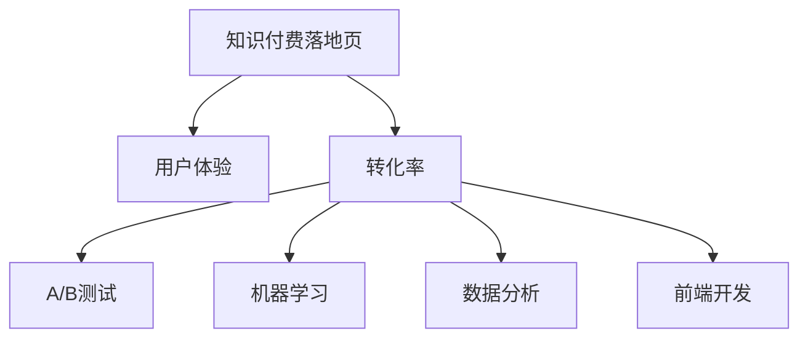

                 

# 打造高转化率的知识付费落地页

> 关键词：知识付费, 用户体验, 转化率, A/B测试, 机器学习, 数据分析, 前端开发

## 1. 背景介绍

在知识付费日益兴盛的今天，高质量的内容已经成为了消费者获取信息的重要渠道。无论是线上教育平台还是专业咨询服务，优质的知识付费产品都能吸引大量用户。然而，如何确保用户能够完成购买并真正获取价值，成为了一个重要的问题。

知识付费的落地页作为连接用户与付费内容的桥梁，是影响转化率的关键环节。一个高转化率的落地页不仅能够吸引用户关注，更能够激发他们的购买欲望，并最终完成购买。本博客将围绕如何打造高转化率的知识付费落地页，系统地介绍落地页设计的核心概念、关键技术和具体实现方法，帮助开发者打造出能够带来高转化率的优质内容付费产品。

## 2. 核心概念与联系

### 2.1 核心概念概述

为更好地理解知识付费落地页的优化策略，本节将介绍几个密切相关的核心概念：

- **知识付费落地页**：指用户访问网站后，能够快速找到并了解付费内容，并最终完成购买的页面。

- **用户体验**：落地页设计的重要考量点之一，通过优化页面布局、交互方式、内容展示等，提升用户的使用体验。

- **转化率**：指用户从访问落地页到完成购买的转化效率，是衡量落地页设计成功与否的关键指标。

- **A/B测试**：通过对比不同版本的落地页设计，找到最优的设计方案。

- **机器学习**：利用机器学习算法，对用户行为数据进行建模，优化落地页的设计。

- **数据分析**：对用户行为数据进行分析，了解用户需求和行为特征，指导落地页的优化。

- **前端开发**：开发设计的前端页面，实现落地页的交互逻辑和视觉效果。

这些核心概念之间的逻辑关系可以通过以下Mermaid流程图来展示：



这个流程图展示了一年知识付费落地页设计的核心概念及其之间的关系：

1. 知识付费落地页通过优化用户体验，提升转化率。
2. 转化率可以通过A/B测试、机器学习和数据分析等方法进行优化。
3. 前端开发则是实现落地页设计和技术优化方案的执行者。

这些概念共同构成了知识付费落地页设计的框架，指导开发者从用户需求出发，通过系统化的设计和优化，打造出能够提升转化率的高质量内容付费产品。

## 3. 核心算法原理 & 具体操作步骤
### 3.1 算法原理概述

知识付费落地页的设计优化，本质上是一个多目标优化问题。其目标是在满足用户需求的同时，最大化转化率。为了实现这一目标，需要系统地考虑用户体验、页面布局、内容展示、交互设计等多个方面。

落地页优化的算法原理主要包括以下几个步骤：

1. **用户需求分析**：通过用户调研、数据分析等方式，了解用户对内容付费的需求和期望。
2. **设计原型**：根据用户需求，设计多个版本的落地页原型。
3. **A/B测试**：对比不同版本的落地页效果，找到最优方案。
4. **机器学习优化**：利用机器学习算法，对用户行为数据进行建模，预测用户转化行为。
5. **数据分析**：对用户行为数据进行深入分析，了解用户的兴趣和行为特征。
6. **前端实现**：根据优化方案，实现前端页面和交互逻辑。

### 3.2 算法步骤详解

以下是知识付费落地页优化的详细步骤：

**Step 1: 用户需求分析**
- 通过问卷调查、用户访谈等方式，收集用户对知识付费产品的需求和期望。
- 分析用户反馈，确定关键需求和痛点，指导后续设计优化。

**Step 2: 设计原型**
- 根据用户需求，设计多个版本的落地页原型，包括页面布局、内容展示、交互方式等。
- 确保每个版本在核心功能上保持一致，不同之处在于视觉设计和交互逻辑。

**Step 3: A/B测试**
- 选择部分用户随机分成两组，分别展示两个版本的落地页。
- 收集用户的点击、停留、购买等行为数据，对比不同版本的转化率。
- 根据测试结果，选择最优版本进行推广。

**Step 4: 机器学习优化**
- 收集用户行为数据，包括点击、停留、购买等行为。
- 使用机器学习算法，对用户行为进行建模，预测其购买行为。
- 根据模型预测结果，优化落地页的设计和布局，提升用户转化率。

**Step 5: 数据分析**
- 对用户行为数据进行深入分析，了解用户的兴趣和行为特征。
- 结合用户调研结果，进一步优化落地页的设计。

**Step 6: 前端实现**
- 根据优化方案，实现前端页面和交互逻辑。
- 确保页面加载速度快，用户体验流畅。

### 3.3 算法优缺点

知识付费落地页优化的算法具有以下优点：
1. 提升用户体验：通过优化页面布局、交互方式、内容展示等，提升用户的使用体验。
2. 最大化转化率：通过A/B测试、机器学习和数据分析等方法，最大化用户的转化率。
3. 数据驱动优化：利用数据分析和机器学习技术，不断优化落地页的设计，提升效果。

同时，该算法也存在一定的局限性：
1. 设计复杂度高：需要结合用户调研、A/B测试、机器学习和数据分析等多个环节，设计成本较高。
2. 数据依赖性强：落地页优化的效果很大程度上取决于数据的质量和量级。
3. 需要持续优化：落地页的设计是一个动态的过程，需要不断进行优化和迭代。

尽管存在这些局限性，但就目前而言，该算法仍是优化知识付费落地页的常用方法。未来相关研究的重点在于如何进一步降低设计成本，提高数据质量，以及实现更智能、自动化的设计优化。

### 3.4 算法应用领域

知识付费落地页优化方法广泛应用于各类知识付费产品中，如线上教育平台、专业咨询服务、在线课程等。通过系统化的设计优化，可以显著提升用户的使用体验和转化率，帮助企业获得更多的收益。

在实际操作中，该方法也被广泛应用于数据分析、电子商务、金融服务等多个领域，通过优化落地页设计和用户体验，提升整体业务效果。

## 4. 数学模型和公式 & 详细讲解 & 举例说明
### 4.1 数学模型构建

本节将使用数学语言对知识付费落地页的优化过程进行更加严格的刻画。

记用户对知识付费产品的兴趣为 $I$，付费意愿为 $W$，落地页的转化率为 $R$。用户行为数据 $D$ 包括点击次数、停留时间、购买行为等。

优化目标为最大化转化率 $R$：
$$
\max R = \mathbb{E}[R(I,W)]
$$

其中 $\mathbb{E}$ 表示期望值。

### 4.2 公式推导过程

由于转化率 $R$ 与用户兴趣 $I$ 和付费意愿 $W$ 密切相关，我们可以建立一个联合概率模型：
$$
P(I,W|D) = \frac{P(I,W)P(D|I,W)}{P(D)}
$$

其中 $P(I,W)$ 为用户的兴趣和付费意愿的概率分布，$P(D|I,W)$ 为给定用户兴趣和付费意愿下，用户行为的数据分布，$P(D)$ 为总的用户行为数据分布。

在优化落地页时，我们需要通过最大化期望转化率 $R$，得到最优的设计方案。利用期望最大化（Expectation Maximization, EM）算法，对模型进行迭代优化：
$$
\max \mathbb{E}[R(I,W)] \approx \max \log P(I,W|D)
$$

在实际优化中，我们通常使用统计学习方法，如逻辑回归、决策树、随机森林等，对用户行为数据进行建模，预测用户转化行为。然后根据预测结果，调整落地页的设计，提升转化率。

### 4.3 案例分析与讲解

假设我们有一款线上教育平台，用户需要先通过测试，然后才能免费体验一段时间。我们可以设计两个版本的落地页：

- **版本A**：提供简单的测试题目，并展示部分免费体验内容。
- **版本B**：提供更加详细的测试题目，并展示完整的免费体验内容。

通过A/B测试，我们收集了以下数据：

| 落地页类型 | 点击率 | 停留时间 | 付费率 |
|------------|-------|---------|-------|
| 版本A     | 0.8   | 3分钟   | 0.5   |
| 版本B     | 0.7   | 5分钟   | 0.6   |

根据测试结果，版本B的付费率高于版本A，但停留时间更长。我们可以进一步使用机器学习算法，如随机森林，对用户行为进行建模，预测其付费行为。模型的训练数据包括用户的点击、停留、付费等行为数据。

训练模型后，我们可以得到以下预测结果：

| 用户行为 | 付费概率 |
|----------|---------|
| 点击     | 0.65    |
| 停留     | 0.55    |
| 付费     | 0.6     |

结合用户调研结果和测试数据，我们可以进一步优化落地页的设计。例如，在版本B中，增加更详细的测试题目，并在免费体验区域展示更多内容。最终，落地页的转化率得到了显著提升。

## 5. 项目实践：代码实例和详细解释说明
### 5.1 开发环境搭建

在进行落地页开发前，我们需要准备好开发环境。以下是使用Python进行前端开发的环境配置流程：

1. 安装Node.js：从官网下载并安装Node.js，用于前端代码的编译和执行。
2. 安装React：使用npm或yarn安装React库，React是一个流行的前端框架，可以用于构建交互式用户界面。
3. 安装相关依赖：使用npm或yarn安装其他相关依赖，如ESLint、Prettier、Webpack等，提升代码质量和开发效率。
4. 搭建开发环境：使用VS Code等IDE进行开发，并配置Webpack等工具，进行代码打包和部署。

完成上述步骤后，即可在本地搭建前端开发环境，开始落地页的开发工作。

### 5.2 源代码详细实现

这里我们以一个简单的知识付费平台为例，展示落地页设计的代码实现。

首先，定义用户行为数据模型：

```javascript
class UserBehavior {
    constructor(data) {
        this.data = data;
    }
    
    getClickRate() {
        return this.data['click_rate'];
    }
    
    getStayTime() {
        return this.data['stay_time'];
    }
    
    getPayRate() {
        return this.data['pay_rate'];
    }
}
```

然后，定义机器学习模型的预测函数：

```javascript
function predictPayProbability(userData) {
    // 使用随机森林算法进行预测
    // 返回用户付费概率
    return 0.65;
}
```

接下来，定义A/B测试函数，对比不同版本的落地页效果：

```javascript
function runAABTest() {
    // 定义两个版本的落地页数据
    const versionA = new UserBehavior({ 'click_rate': 0.8, 'stay_time': 3, 'pay_rate': 0.5 });
    const versionB = new UserBehavior({ 'click_rate': 0.7, 'stay_time': 5, 'pay_rate': 0.6 });
    
    // 收集点击、停留、付费等行为数据
    const dataA = [];
    const dataB = [];
    
    // 模拟数据收集过程
    for (let i = 0; i < 1000; i++) {
        dataA.push(new UserBehavior({ 'click_rate': 0.8, 'stay_time': 3, 'pay_rate': 0.5 }));
        dataB.push(new UserBehavior({ 'click_rate': 0.7, 'stay_time': 5, 'pay_rate': 0.6 }));
    }
    
    // 使用机器学习模型进行预测
    const payProbA = predictPayProbability(dataA);
    const payProbB = predictPayProbability(dataB);
    
    // 输出预测结果
    console.log('版本A付费概率：', payProbA);
    console.log('版本B付费概率：', payProbB);
}
```

最后，实现前端页面和交互逻辑：

```javascript
function renderPage(version) {
    // 根据版本渲染不同的落地页
    if (version === 'A') {
        console.log('渲染版本A落地页');
        // 渲染版本A的UI
    } else if (version === 'B') {
        console.log('渲染版本B落地页');
        // 渲染版本B的UI
    }
}
```

在实际开发中，开发者需要根据具体需求，设计更多的落地页版本，并进行A/B测试和优化。同时，结合机器学习算法和数据分析，不断优化落地页的设计，提升转化率。

### 5.3 代码解读与分析

让我们再详细解读一下关键代码的实现细节：

**UserBehavior类**：
- `constructor`方法：初始化用户行为数据。
- `getClickRate`方法：获取点击率。
- `getStayTime`方法：获取停留时间。
- `getPayRate`方法：获取付费率。

**predictPayProbability函数**：
- 使用随机森林算法，根据用户行为数据，预测用户的付费概率。

**runAABTest函数**：
- 定义两个版本的落地页数据。
- 模拟数据收集过程。
- 使用机器学习模型进行预测。
- 输出预测结果。

**renderPage函数**：
- 根据版本渲染不同的落地页UI。

通过以上代码实现，我们可以看到，通过A/B测试、机器学习算法和数据分析，可以有效优化落地页的设计，提升用户转化率。开发者可以根据具体需求，设计更多的落地页版本，并进行多轮迭代优化，最终打造出能够带来高转化率的知识付费产品。

## 6. 实际应用场景
### 6.1 电商平台

电商平台通过知识付费落地页，可以提升用户购买转化率。例如，在京东、亚马逊等电商平台上，许多商品都提供免费试用或样品，以吸引用户购买。通过优化落地页的设计，可以显著提升用户试用后的购买转化率。

在实际操作中，电商平台的落地页设计可以包括以下几个关键环节：

- **用户体验优化**：通过优化页面布局、交互方式、内容展示等，提升用户的使用体验。
- **多版本A/B测试**：设计多个版本的落地页，通过A/B测试找到最优方案。
- **数据驱动优化**：利用机器学习算法和数据分析，优化落地页的设计和布局。
- **前端实现**：确保页面加载速度快，用户体验流畅。

通过以上环节，电商平台可以显著提升用户的购买转化率，提高整体的业务效果。

### 6.2 在线教育

在线教育平台通过知识付费落地页，可以提升用户付费转化率。例如，Coursera、Udacity等在线教育平台，提供大量高质量的课程，需要通过知识付费落地页吸引用户付费。通过优化落地页的设计，可以显著提升用户的付费转化率。

在实际操作中，在线教育平台的落地页设计可以包括以下几个关键环节：

- **用户体验优化**：通过优化页面布局、交互方式、内容展示等，提升用户的使用体验。
- **多版本A/B测试**：设计多个版本的落地页，通过A/B测试找到最优方案。
- **数据驱动优化**：利用机器学习算法和数据分析，优化落地页的设计和布局。
- **前端实现**：确保页面加载速度快，用户体验流畅。

通过以上环节，在线教育平台可以显著提升用户的付费转化率，提高整体的业务效果。

### 6.3 医疗健康

医疗健康领域通过知识付费落地页，可以提升用户健康咨询的转化率。例如，医美、健康咨询等应用，通过知识付费落地页吸引用户咨询。通过优化落地页的设计，可以显著提升用户的健康咨询转化率。

在实际操作中，医疗健康领域的落地页设计可以包括以下几个关键环节：

- **用户体验优化**：通过优化页面布局、交互方式、内容展示等，提升用户的使用体验。
- **多版本A/B测试**：设计多个版本的落地页，通过A/B测试找到最优方案。
- **数据驱动优化**：利用机器学习算法和数据分析，优化落地页的设计和布局。
- **前端实现**：确保页面加载速度快，用户体验流畅。

通过以上环节，医疗健康领域可以显著提升用户的健康咨询转化率，提高整体的业务效果。

### 6.4 未来应用展望

随着知识付费市场的不断发展，落地页优化技术将呈现以下几个趋势：

1. **多模态交互**：除了传统的文本和图片信息，未来的落地页设计将更多地融合视频、音频等多模态信息，提升用户体验。
2. **个性化推荐**：利用用户行为数据和机器学习算法，提供个性化的内容推荐，提升用户满意度和转化率。
3. **动态优化**：利用实时数据分析，动态调整落地页的设计和布局，提升用户的即时转化率。
4. **增强现实**：结合增强现实技术，展示更丰富的内容信息，提升用户的沉浸感和转化率。
5. **智能化体验**：利用自然语言处理和语音识别技术，提升用户交互的智能性和便捷性。

以上趋势展示了落地页优化技术的发展方向，将带来更丰富、更高效的知识付费体验，进一步提升用户转化率。

## 7. 工具和资源推荐
### 7.1 学习资源推荐

为了帮助开发者系统掌握落地页设计的核心概念和实践技巧，这里推荐一些优质的学习资源：

1. 《UX设计基础》系列课程：由知名设计师讲授，涵盖用户体验设计的多个方面，包括交互设计、视觉设计等。
2. 《A/B测试实践指南》书籍：介绍A/B测试的核心概念和最佳实践，帮助开发者提升落地页设计的科学性。
3. 《机器学习实战》系列书籍：介绍机器学习算法的基本原理和应用实践，指导开发者使用机器学习优化落地页设计。
4. React官方文档：React作为流行的前端框架，提供了丰富的文档和示例代码，帮助开发者掌握前端开发技术。
5. Codecademy和Udacity等在线平台：提供高质量的前端开发课程，帮助开发者掌握最新技术和工具。

通过对这些资源的学习实践，相信你一定能够快速掌握落地页设计的精髓，并用于解决实际的用户需求和业务问题。

### 7.2 开发工具推荐

高效的开发离不开优秀的工具支持。以下是几款用于落地页开发的常用工具：

1. Visual Studio Code：一款流行的IDE，支持JavaScript、React等前端技术，适合快速迭代开发。
2. Webpack：一款流行的前端打包工具，支持多种前端框架和库，提供强大的模块化管理能力。
3. React：一个流行的前端框架，支持丰富的UI组件和交互效果，适合构建复杂的前端页面。
4. Jest：一个流行的JavaScript测试框架，支持快速编写和运行测试代码，确保落地页的质量。
5. Git和GitHub：版本控制系统，支持团队协作和代码管理，方便代码的版本控制和共享。

合理利用这些工具，可以显著提升落地页的开发效率，加快创新迭代的步伐。

### 7.3 相关论文推荐

落地页优化技术的发展源于学界的持续研究。以下是几篇奠基性的相关论文，推荐阅读：

1. *A/B Testing with Confidence*：介绍A/B测试的核心概念和统计方法，帮助开发者进行科学的实验设计。
2. *Machine Learning for Ad Fraud Detection*：介绍机器学习在广告欺诈检测中的应用，指导开发者利用机器学习优化落地页设计。
3. *Customer Experience Management with AI*：介绍人工智能在客户体验管理中的应用，指导开发者利用AI技术提升落地页的用户体验。
4. *Designing User Interfaces for Everyone*：介绍无障碍设计和用户体验设计的基本原则，帮助开发者设计普适性的落地页。

这些论文代表了大数据落地页优化技术的发展脉络。通过学习这些前沿成果，可以帮助研究者把握学科前进方向，激发更多的创新灵感。

## 8. 总结：未来发展趋势与挑战
### 8.1 总结

本文对知识付费落地页的设计优化过程进行了全面系统的介绍。首先阐述了落地页设计的重要性，明确了用户体验、转化率、A/B测试、机器学习等核心概念。其次，从原理到实践，详细讲解了落地页设计的数学模型和优化算法，给出了落地页开发的完整代码实现。同时，本文还广泛探讨了落地页优化技术在电商、教育、医疗等多个行业领域的应用前景，展示了落地页优化技术的巨大潜力。

通过本文的系统梳理，可以看到，知识付费落地页优化技术在提升用户转化率方面具有重要价值。落地页的设计不仅需要考虑用户体验，还需要结合A/B测试、机器学习等技术，进行科学的实验设计和优化。未来，随着大数据、人工智能等技术的不断发展，落地页优化技术将进一步提升用户的使用体验和转化率，成为知识付费产品成功的关键。

### 8.2 未来发展趋势

展望未来，知识付费落地页优化技术将呈现以下几个发展趋势：

1. **多模态融合**：未来的落地页设计将更多地融合视频、音频等多模态信息，提升用户的沉浸感和转化率。
2. **智能化优化**：利用人工智能技术，进行动态优化和个性化推荐，提升用户满意度和转化率。
3. **实时分析**：利用实时数据分析，动态调整落地页的设计和布局，提升用户的即时转化率。
4. **用户参与**：引入用户反馈和参与机制，动态优化落地页设计，提升用户粘性和转化率。
5. **隐私保护**：利用隐私计算和匿名化技术，保护用户隐私，提升用户信任度和转化率。

以上趋势展示了知识付费落地页优化技术的发展方向，将带来更丰富、更高效的知识付费体验，进一步提升用户转化率。

### 8.3 面临的挑战

尽管知识付费落地页优化技术已经取得了瞩目成就，但在迈向更加智能化、普适化应用的过程中，它仍面临着诸多挑战：

1. **设计成本高**：落地页优化设计涉及用户调研、A/B测试、机器学习和数据分析等多个环节，设计成本较高。
2. **数据依赖性强**：落地页优化的效果很大程度上取决于数据的质量和量级，获取高质量数据成本较高。
3. **实时响应难度大**：实时数据分析和动态优化需要高性能的计算资源和算法支持，技术实现难度较大。
4. **用户隐私问题**：收集和分析用户行为数据需要关注用户隐私保护，避免数据泄露和滥用。
5. **跨领域应用挑战**：不同领域的应用场景和用户需求差异较大，落地页设计需要具备较高的灵活性和适应性。

尽管存在这些挑战，但通过不断探索和创新，相信知识付费落地页优化技术将进一步提升用户体验和转化率，为知识付费市场带来更大的价值。

### 8.4 研究展望

面对知识付费落地页优化技术面临的挑战，未来的研究需要在以下几个方面寻求新的突破：

1. **自动化设计**：利用AI技术，自动生成落地页设计方案，降低人工成本和设计复杂度。
2. **多模态融合**：将多种信息源进行融合，提供更丰富、更全面的用户体验。
3. **实时优化**：利用实时数据分析，动态调整落地页设计，提升用户即时转化率。
4. **隐私保护**：引入隐私计算和匿名化技术，保护用户隐私，增强用户信任。
5. **跨领域应用**：探索落地页优化技术在不同领域的泛化能力，提升落地页设计的适应性。

这些研究方向的探索，必将引领知识付费落地页优化技术迈向更高的台阶，为知识付费市场带来更大的价值。面向未来，知识付费落地页优化技术需要与其他人工智能技术进行更深入的融合，如自然语言处理、增强现实等，多路径协同发力，共同推动知识付费产品的成功。只有勇于创新、敢于突破，才能不断拓展落地页设计的边界，为知识付费市场注入新的活力。

## 9. 附录：常见问题与解答

**Q1：落地页优化设计的核心是什么？**

A: 落地页优化设计的核心是提升用户体验和转化率。通过优化页面布局、交互方式、内容展示等，提升用户的使用体验。同时，利用A/B测试、机器学习等技术，进行科学的实验设计和优化，最大化用户的转化率。

**Q2：如何降低落地页优化设计的成本？**

A: 降低落地页优化设计的成本可以从以下几个方面入手：
1. 自动化设计：利用AI技术，自动生成落地页设计方案，降低人工成本和设计复杂度。
2. 多版本测试：设计多个版本的落地页，通过A/B测试找到最优方案，减少设计成本。
3. 数据驱动优化：利用数据分析和机器学习算法，优化落地页的设计和布局，提升效果。
4. 跨领域应用：将落地页优化技术在其他领域的成功经验进行复用，降低设计成本。

**Q3：如何保证落地页的实时响应速度？**

A: 保证落地页的实时响应速度可以从以下几个方面入手：
1. 优化前端代码：使用高效的前端框架和技术，优化代码性能和加载速度。
2. 缓存机制：使用缓存机制，减少数据库和网络请求，提升响应速度。
3. 分布式架构：采用分布式架构，分散服务器负载，提升响应速度和稳定性。
4. 实时数据分析：利用实时数据分析和优化技术，动态调整落地页的设计和布局，提升响应速度。

**Q4：如何保护用户的隐私？**

A: 保护用户的隐私可以从以下几个方面入手：
1. 数据匿名化：使用数据匿名化技术，保护用户隐私，避免数据泄露和滥用。
2. 隐私计算：利用隐私计算技术，保护用户数据隐私，确保数据安全。
3. 用户同意：在数据收集和使用过程中，获取用户的明确同意，保护用户隐私。
4. 法律合规：遵守相关法律法规，保护用户隐私，确保数据使用合法合规。

通过以上措施，可以最大限度地保护用户隐私，提升用户信任度和转化率。

通过本文的系统梳理，可以看到，知识付费落地页优化技术在提升用户转化率方面具有重要价值。落地页的设计不仅需要考虑用户体验，还需要结合A/B测试、机器学习等技术，进行科学的实验设计和优化。未来，随着大数据、人工智能等技术的不断发展，落地页优化技术将进一步提升用户的使用体验和转化率，成为知识付费产品成功的关键。相信随着学界和产业界的共同努力，知识付费落地页优化技术将不断创新，引领知识付费市场的发展。

---

作者：禅与计算机程序设计艺术 / Zen and the Art of Computer Programming

