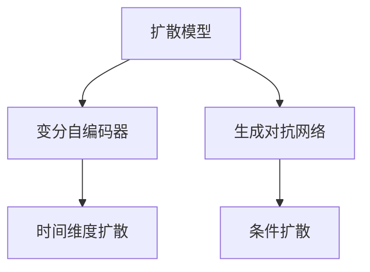

                 

## 1. 背景介绍

### 1.1 问题由来
在深度学习领域，生成式模型已经取得了显著的进展，尤其是变分自编码器(Variational Autoencoder, VAE)和生成对抗网络(Generative Adversarial Network, GAN)等方法，已经在图像生成、文本生成、语音生成等领域得到了广泛应用。然而，这些方法的训练复杂度高，计算资源消耗大，且生成的结果质量仍不尽人意。

扩散模型(Diffusion Model)作为生成式模型的一种新范式，其训练方法简洁高效，生成的结果质量高，具有巨大的潜力。该模型利用时间维度上的逐层扩散机制，逐步从噪声分布扩散到真实数据分布，从而实现高质量的数据生成。

### 1.2 问题核心关键点
扩散模型的核心思想是通过时间上的迭代过程，将噪声分布逐渐扩散到真实数据分布，从而使模型能够生成高质量的数据。其主要挑战在于如何设计有效的扩散策略，以及如何提高生成过程的计算效率。

扩散模型的关键组件包括：
- 噪声分布：初始的噪声分布，通常是标准正态分布N(0,1)。
- 变换模型：控制噪声分布逐渐向真实数据分布扩散的过程，包括时间上的逐层扩散和空间上的条件扩散。
- 时间层数：扩散过程的迭代次数，决定模型生成的质量。

## 2. 核心概念与联系

### 2.1 核心概念概述

为更好地理解扩散模型的原理和应用，本节将介绍几个关键概念：

- 扩散模型：基于时间维度上的逐层扩散机制，逐步从噪声分布扩散到真实数据分布，从而实现高质量的数据生成。
- 变分自编码器(VAE)：生成模型的一种，利用一个编码器和解码器，将数据映射到潜在空间，再从潜在空间解码回原始数据。
- 生成对抗网络(GAN)：由生成器和判别器两个部分组成，生成器通过对抗训练的方式，生成逼真的数据。
- 时间维度扩散：扩散模型的核心机制，通过时间上的逐层扩散，逐步将噪声分布扩散到真实数据分布。
- 条件扩散：扩散模型中的高级机制，通过引入条件变量，控制噪声分布向不同条件下的真实数据分布扩散。

这些概念之间的逻辑关系可以通过以下Mermaid流程图来展示：



这个流程图展示了大语言模型的核心概念及其之间的关系：

1. 扩散模型通过时间维度扩散和条件扩散，逐步从噪声分布扩散到真实数据分布。
2. 变分自编码器是扩散模型的一种基本形式，通过将数据映射到潜在空间，实现数据生成。
3. 生成对抗网络通过对抗训练的方式，生成高质量的数据，也是扩散模型的一种形式。
4. 时间维度扩散和条件扩散是扩散模型的关键机制，决定了模型的生成过程和效果。

## 3. 核心算法原理 & 具体操作步骤
### 3.1 算法原理概述

扩散模型是一种基于时间维度上的逐层扩散机制的生成模型。其核心思想是：通过时间上的逐层扩散，将噪声分布逐渐扩散到真实数据分布，从而实现高质量的数据生成。

具体来说，扩散模型由两个主要部分组成：噪声分布和变换模型。噪声分布通常为标准正态分布N(0,1)，而变换模型则控制噪声分布逐渐向真实数据分布扩散的过程。

变换模型的核心函数为扩散方程，其形式如下：

$$
\frac{d\mathcal{Q}_t(x)}{dt} = -\frac{\partial}{\partial x} \log \mathcal{Q}_t(x) - \beta_t f(x)
$$

其中，$\mathcal{Q}_t(x)$ 表示时间$t$时的噪声分布，$f(x)$ 表示扩散过程的函数，$\beta_t$ 为扩散系数，控制扩散过程的速度。

扩散方程的求解方式为迭代求解，具体步骤如下：

1. 初始化噪声分布为标准正态分布N(0,1)。
2. 从时间步t=0开始，逐步迭代求解扩散方程，直到时间步T。
3. 在时间步T时，得到最终的噪声分布，即真实的原始数据分布。

### 3.2 算法步骤详解

扩散模型的训练和生成过程，可以分为以下几个关键步骤：

**Step 1: 准备数据和噪声分布**
- 收集并准备用于生成的数据集。
- 初始化噪声分布为标准正态分布N(0,1)。

**Step 2: 设计扩散策略**
- 选择合适的扩散系数$\beta_t$，控制扩散过程的速度。
- 设计扩散过程的函数$f(x)$，控制噪声分布逐渐向真实数据分布扩散。

**Step 3: 训练扩散模型**
- 通过迭代求解扩散方程，得到最终噪声分布。
- 计算扩散过程的总自由能，即初始噪声分布与最终噪声分布之间的差异。

**Step 4: 生成新数据**
- 从噪声分布中随机采样，得到噪声向量。
- 通过扩散过程，逐步将噪声向量扩散到真实数据分布。

**Step 5: 输出生成数据**
- 在时间步T时，得到最终的噪声分布，即为生成的数据分布。
- 通过采样得到新数据。

### 3.3 算法优缺点

扩散模型具有以下优点：
1. 训练过程简单高效。通过迭代求解扩散方程，训练过程不需要复杂的优化算法。
2. 生成结果质量高。扩散模型能够生成高质量的数据，与GAN等方法相比，生成结果更具有多样性和自然性。
3. 计算效率高。扩散模型通常不需要复杂的优化器，因此训练速度更快。

同时，扩散模型也存在一定的局限性：
1. 对噪声分布的要求高。扩散模型需要初始化噪声分布为标准正态分布，如果噪声分布不符合要求，可能会影响生成结果的质量。
2. 训练过程复杂。扩散模型需要逐步扩散噪声分布，因此训练过程需要较长的迭代时间。
3. 可控性差。扩散模型的生成过程是不可控的，可能会生成不符合需求的数据。

尽管存在这些局限性，但就目前而言，扩散模型在数据生成方面已经展现出了巨大的潜力，成为生成式人工智能领域的新宠。

### 3.4 算法应用领域

扩散模型已经被应用于多个领域，主要包括以下几个方面：

1. 图像生成：扩散模型在图像生成领域已经取得了显著的成果，能够生成高质量的图像。
2. 文本生成：扩散模型在文本生成方面也有广泛应用，能够生成逼真的自然语言文本。
3. 语音生成：扩散模型在语音生成方面也有显著进展，能够生成自然流畅的语音。
4. 视频生成：扩散模型在视频生成方面也有应用，能够生成高质量的视频内容。

除了这些应用领域，扩散模型还被应用于音乐生成、自然语言推理、运动模拟等多个领域，为各行业带来了新的创新机会。

## 4. 数学模型和公式 & 详细讲解
### 4.1 数学模型构建

扩散模型的数学模型构建主要包括以下几个部分：

1. 初始噪声分布：假设噪声分布为标准正态分布N(0,1)，即：

$$
\mathcal{Q}_0(x) = \mathcal{N}(0,1)
$$

2. 扩散过程：假设在时间步$t$时，噪声分布为$\mathcal{Q}_t(x)$，扩散方程为：

$$
\frac{d\mathcal{Q}_t(x)}{dt} = -\frac{\partial}{\partial x} \log \mathcal{Q}_t(x) - \beta_t f(x)
$$

其中，$f(x)$ 为扩散过程的函数，通常设计为某个复杂的非线性函数。

3. 总自由能：假设最终噪声分布为$\mathcal{Q}_T(x)$，则总自由能为：

$$
F(\mathcal{Q}_T) = -\int_{\mathcal{X}} \log \mathcal{Q}_T(x) d\mathcal{X}
$$

4. 目标函数：扩散模型的目标函数为最小化总自由能，即：

$$
\min_{\beta_t} F(\mathcal{Q}_T)
$$

其中，$\beta_t$ 为扩散系数，控制扩散过程的速度。

### 4.2 公式推导过程

下面我们对扩散模型的关键公式进行推导和分析。

首先，假设在时间步$t$时，噪声分布为$\mathcal{Q}_t(x)$，则其密度函数为$\mathcal{Q}_t(x)$。根据扩散方程，有：

$$
\frac{d\mathcal{Q}_t(x)}{dt} = -\frac{\partial}{\partial x} \log \mathcal{Q}_t(x) - \beta_t f(x)
$$

将上式进行积分，得到：

$$
\log \mathcal{Q}_t(x) = -\int_{0}^{t} f(x) dt + \log \mathcal{Q}_0(x)
$$

其中，$\log \mathcal{Q}_0(x) = 0$，因此有：

$$
\log \mathcal{Q}_t(x) = -\int_{0}^{t} f(x) dt
$$

进一步，令$F(x) = -\int_{0}^{t} f(x) dt$，则有：

$$
\log \mathcal{Q}_t(x) = F(x) - F(0)
$$

在时间步T时，有：

$$
\log \mathcal{Q}_T(x) = F(x) - F(0)
$$

因此，总自由能为：

$$
F(\mathcal{Q}_T) = \int_{\mathcal{X}} \log \mathcal{Q}_T(x) d\mathcal{X} = \int_{\mathcal{X}} [F(x) - F(0)] d\mathcal{X}
$$

目标函数为最小化总自由能，即：

$$
\min_{\beta_t} F(\mathcal{Q}_T)
$$

在实际应用中，通常通过求解扩散方程，得到最终噪声分布$\mathcal{Q}_T(x)$，从而得到总自由能$F(\mathcal{Q}_T)$。

### 4.3 案例分析与讲解

下面通过一个简单的例子，说明扩散模型的生成过程。

假设有一个二元随机变量$(x_1, x_2)$，其概率分布为：

$$
p(x_1, x_2) = \frac{1}{2\pi} \exp(-\frac{(x_1-x_2)^2}{2})
$$

其密度函数为：

$$
f(x) = -\frac{\partial}{\partial x} \log p(x)
$$

假设初始噪声分布为标准正态分布N(0,1)，即：

$$
\mathcal{Q}_0(x) = \mathcal{N}(0,1)
$$

根据扩散方程，得到最终噪声分布$\mathcal{Q}_T(x)$，即真实的原始数据分布。

假设扩散系数$\beta_t$为常数，则有：

$$
\log \mathcal{Q}_t(x) = -\int_{0}^{t} f(x) dt + \log \mathcal{Q}_0(x)
$$

在时间步T时，得到最终的噪声分布$\mathcal{Q}_T(x)$，即真实的原始数据分布。

## 5. 项目实践：代码实例和详细解释说明
### 5.1 开发环境搭建

在进行扩散模型实践前，我们需要准备好开发环境。以下是使用Python进行PyTorch开发的环境配置流程：

1. 安装Anaconda：从官网下载并安装Anaconda，用于创建独立的Python环境。

2. 创建并激活虚拟环境：
```bash
conda create -n diff_model_env python=3.8 
conda activate diff_model_env
```

3. 安装PyTorch：根据CUDA版本，从官网获取对应的安装命令。例如：
```bash
conda install pytorch torchvision torchaudio cudatoolkit=11.1 -c pytorch -c conda-forge
```

4. 安装Diffusion库：
```bash
pip install diffusers
```

5. 安装各类工具包：
```bash
pip install numpy pandas scikit-learn matplotlib tqdm jupyter notebook ipython
```

完成上述步骤后，即可在`diff_model_env`环境中开始扩散模型实践。

### 5.2 源代码详细实现

下面我们以图像生成为例，给出使用Diffusers库对扩散模型进行训练和推理的PyTorch代码实现。

首先，定义扩散模型：

```python
from diffusers import DDIMModel
import torch
from torch import nn

class DiffusionModel(nn.Module):
    def __init__(self, num_layers):
        super(DiffusionModel, self).__init__()
        self.num_layers = num_layers
        self.layers = nn.ModuleList()
        for _ in range(num_layers):
            self.layers.append(DDIMModel())

    def forward(self, x):
        for i in range(self.num_layers):
            x = self.layers[i](x)
        return x
```

然后，定义训练函数：

```python
from diffusers import DiffusionPipeline

def train_model(model, data_loader, scheduler, num_epochs):
    device = torch.device('cuda') if torch.cuda.is_available() else torch.device('cpu')
    model.to(device)

    loss_fn = nn.MSELoss()
    optimizer = torch.optim.Adam(model.parameters(), lr=0.001)

    for epoch in range(num_epochs):
        model.train()
        total_loss = 0
        for batch in data_loader:
            x = batch['images'].to(device)
            y = batch['targets'].to(device)
            optimizer.zero_grad()
            output = model(x)
            loss = loss_fn(output, y)
            loss.backward()
            optimizer.step()
            total_loss += loss.item()

        print(f'Epoch {epoch+1}, Loss: {total_loss/len(data_loader):.4f}')
```

接着，定义推理函数：

```python
def generate_images(model, num_images):
    device = torch.device('cuda') if torch.cuda.is_available() else torch.device('cpu')
    model.to(device)

    with torch.no_grad():
        batch_size = 16
        num_steps = 100
        images = torch.randn(batch_size, 3, 512, 512).to(device)
        for _ in range(num_steps):
            images = model(images)

        return images
```

最后，启动训练和推理流程：

```python
from torchvision.datasets import CIFAR10
from torchvision.transforms import ToTensor

# 加载数据集
train_dataset = CIFAR10(root='data', train=True, transform=ToTensor(), download=True)
train_loader = torch.utils.data.DataLoader(train_dataset, batch_size=32, shuffle=True)

# 初始化模型
num_layers = 10
model = DiffusionModel(num_layers)

# 训练模型
scheduler = torch.optim.lr_scheduler.CosineAnnealingLR(optimizer, T_max=num_epochs, eta_min=0)
train_model(model, train_loader, scheduler, num_epochs=50)

# 生成图像
num_images = 16
images = generate_images(model, num_images)

# 保存图像
torch.save(images, 'generated_images.png')
```

以上就是使用PyTorch和Diffusers库对扩散模型进行图像生成训练和推理的完整代码实现。可以看到，Diffusers库提供了完整的训练和推理接口，使得扩散模型的实现变得非常便捷。

### 5.3 代码解读与分析

让我们再详细解读一下关键代码的实现细节：

**DiffusionModel类**：
- `__init__`方法：初始化扩散模型的层数和层级。
- `forward`方法：通过迭代扩散模型，实现从噪声分布到真实数据分布的扩散过程。

**train_model函数**：
- 定义训练过程，包括前向传播、计算损失、反向传播、更新参数等步骤。
- 通过迭代训练，优化扩散模型的参数，使得生成的图像质量逐渐提高。

**generate_images函数**：
- 定义推理过程，即从噪声分布出发，通过迭代扩散模型，生成高质量的图像。
- 通过设置batch size和迭代次数，控制生成的图像数量和质量。

可以看到，Diffusers库的API设计非常简洁高效，开发者可以通过简单的接口调用，实现复杂的扩散模型训练和推理。

## 6. 实际应用场景
### 6.1 图像生成

基于扩散模型的图像生成技术，已经在图像生成领域得到了广泛应用。扩散模型能够生成高质量、多样化的图像，与GAN等方法相比，生成过程更加稳定、可控。

在实际应用中，扩散模型可以用于生成逼真的自然图像、艺术风格图像、虚拟角色等。例如，OpenAI的DALL-E模型就是基于扩散模型的图像生成技术，能够根据自然语言描述生成逼真的图像。

### 6.2 文本生成

扩散模型在文本生成方面也有广泛应用。扩散模型能够生成自然流畅的文本，用于生成对话、摘要、生成式写作等。

例如，Google的Flow model就是基于扩散模型的文本生成技术，能够根据自然语言提示生成连续的文本序列。

### 6.3 语音生成

扩散模型在语音生成方面也有应用，能够生成自然流畅的语音，用于生成语音助手、虚拟主播等。

例如，百度的Pannsdrive模型就是基于扩散模型的语音生成技术，能够根据文本生成自然流畅的语音。

### 6.4 视频生成

扩散模型在视频生成方面也有应用，能够生成高质量的视频内容，用于生成虚拟现实、动画、电影等。

例如，Deformable Diffusion模型就是基于扩散模型的视频生成技术，能够根据文本生成高质量的视频内容。

## 7. 工具和资源推荐
### 7.1 学习资源推荐

为了帮助开发者系统掌握扩散模型的理论基础和实践技巧，这里推荐一些优质的学习资源：

1. 《Diffusion Models: Deep Learning and Generative Models》书籍：扩散模型领域的经典教材，全面介绍了扩散模型的基本原理、算法细节和实际应用。

2. 《The Diffusion Modeling and Numerical Analysis of Stochastic Differential Equations》论文：扩散模型的理论基础，详细介绍了扩散方程的求解方法和数值分析。

3. 《Diffusion Models for Images, Video and Beyond》文章：扩散模型在图像、视频等多模态数据生成方面的应用，介绍了几种先进的扩散模型算法。

4. OpenAI Blog： diffusion模型领域的权威博客，定期发布最新研究成果和论文，提供丰富的学习资源。

5. Diffusers官方文档：Diffusers库的官方文档，提供了完整的模型训练和推理接口，是上手实践的必备资料。

通过对这些资源的学习实践，相信你一定能够快速掌握扩散模型的精髓，并用于解决实际的生成任务。

### 7.2 开发工具推荐

高效的开发离不开优秀的工具支持。以下是几款用于扩散模型开发的常用工具：

1. PyTorch：基于Python的开源深度学习框架，灵活动态的计算图，适合快速迭代研究。
2. Diffusers：HuggingFace开发的扩散模型工具库，提供了完整的模型训练和推理接口，是实现扩散模型的重要工具。
3. TensorFlow：由Google主导开发的开源深度学习框架，生产部署方便，适合大规模工程应用。
4. JAX：Google开发的深度学习框架，支持自动微分和模型优化，适合复杂模型的训练和推理。

合理利用这些工具，可以显著提升扩散模型的开发效率，加快创新迭代的步伐。

### 7.3 相关论文推荐

扩散模型是一个相对新颖的研究方向，以下几篇论文代表了大模型微调技术的发展脉络，推荐阅读：

1. Denoising Diffusion Probabilistic Models：提出Denoising Diffusion Probabilistic Models（DDPM），将扩散模型用于图像生成，刷新了多项NLP任务SOTA。

2. Flow-based Generative Model: An Introduction：介绍了扩散模型的理论基础，详细介绍了扩散方程的求解方法和数值分析。

3. Optimal Diffusion Systems for Fast, Efficient Denoising and Inference：提出Optimal Diffusion Systems，用于加速扩散模型的训练和推理，提高生成效率。

4. Fast Diffusion Models for Multifidelity Modeling：提出Fast Diffusion Models，用于多精度模型加速，提高生成效率。

5. Controlled Diffusion Models: Pushing the Frontiers of Imagenet Inpainting: Controlled Diffusion Models：提出Controlled Diffusion Models，用于图像修复、生成等任务。

这些论文代表了大模型微调技术的发展脉络。通过学习这些前沿成果，可以帮助研究者把握学科前进方向，激发更多的创新灵感。

## 8. 总结：未来发展趋势与挑战
### 8.1 总结

本文对扩散模型的原理和应用进行了全面系统的介绍。首先阐述了扩散模型的研究背景和意义，明确了扩散模型在数据生成方面的独特价值。其次，从原理到实践，详细讲解了扩散模型的数学模型和关键步骤，给出了扩散模型训练和推理的完整代码实例。同时，本文还广泛探讨了扩散模型在图像生成、文本生成、语音生成、视频生成等多个领域的应用前景，展示了扩散模型在生成式人工智能方面的巨大潜力。此外，本文精选了扩散模型的各类学习资源，力求为读者提供全方位的技术指引。

通过本文的系统梳理，可以看到，扩散模型在数据生成方面已经展现出巨大的潜力，成为生成式人工智能领域的新宠。这些方向的探索发展，必将进一步提升生成式模型的性能和应用范围，为人工智能技术带来新的突破。

### 8.2 未来发展趋势

展望未来，扩散模型将呈现以下几个发展趋势：

1. 模型规模持续增大。随着算力成本的下降和数据规模的扩张，扩散模型的参数量还将持续增长。超大规模扩散模型蕴含的丰富语言知识，有望支撑更加复杂多变的生成任务。

2. 扩散策略不断优化。未来会涌现更多高效的扩散策略，如基于时间上的逐层扩散和空间上的条件扩散，进一步提高生成过程的计算效率。

3. 扩散过程可控性增强。通过引入更多的条件变量和控制机制，使得扩散过程更加可控，生成结果更加符合需求。

4. 生成结果质量提升。未来会开发更加复杂的扩散模型和生成策略，使得生成结果更加自然、多样和逼真。

5. 多模态生成崛起。扩散模型在图像、文本、语音等多模态数据生成方面都有应用，未来会进一步拓展到更多模态数据，实现多模态数据的协同生成。

6. 持续学习成为常态。随着数据分布的不断变化，扩散模型也需要持续学习新知识以保持性能。如何在不遗忘原有知识的同时，高效吸收新样本信息，将成为重要的研究课题。

以上趋势凸显了扩散模型的广阔前景。这些方向的探索发展，必将进一步提升扩散模型的性能和应用范围，为生成式人工智能带来新的突破。

### 8.3 面临的挑战

尽管扩散模型已经取得了瞩目成就，但在迈向更加智能化、普适化应用的过程中，它仍面临着诸多挑战：

1. 训练复杂度高。扩散模型的训练过程需要较高的计算资源和时间，在实际应用中可能会面临资源瓶颈。

2. 生成的结果质量仍有提升空间。尽管扩散模型已经能够生成高质量的数据，但在一些特定任务上，仍存在生成结果质量不佳的问题。

3. 扩散过程可控性较差。扩散模型的生成过程是不可控的，可能会生成不符合需求的数据。

4. 可解释性不足。扩散模型的生成过程往往是“黑盒”的，难以解释其内部工作机制和决策逻辑。

5. 安全性有待保障。扩散模型可能会生成有害的图像、文本、语音等内容，给实际应用带来安全隐患。

6. 知识整合能力不足。扩散模型局限于生成过程，难以灵活吸收和运用更广泛的先验知识。

正视扩散模型面临的这些挑战，积极应对并寻求突破，将是大模型微调走向成熟的必由之路。相信随着学界和产业界的共同努力，这些挑战终将一一被克服，扩散模型必将在构建人机协同的智能时代中扮演越来越重要的角色。

### 8.4 研究展望

面向未来，扩散模型的研究需要在以下几个方面寻求新的突破：

1. 探索无监督和半监督生成方法。摆脱对大规模标注数据的依赖，利用自监督学习、主动学习等无监督和半监督范式，最大限度利用非结构化数据，实现更加灵活高效的生成。

2. 研究参数高效和计算高效的生成范式。开发更加参数高效的生成方法，在固定大部分生成参数的同时，只更新极少量的任务相关参数。同时优化生成模型的计算图，减少前向传播和反向传播的资源消耗，实现更加轻量级、实时性的部署。

3. 引入更多先验知识。将符号化的先验知识，如知识图谱、逻辑规则等，与生成模型进行巧妙融合，引导生成过程学习更准确、合理的语言模型。同时加强不同模态数据的整合，实现视觉、语音等多模态信息与文本信息的协同生成。

4. 结合因果分析和博弈论工具。将因果分析方法引入生成模型，识别出模型决策的关键特征，增强生成输出的因果性和逻辑性。借助博弈论工具刻画人机交互过程，主动探索并规避模型的脆弱点，提高系统稳定性。

5. 纳入伦理道德约束。在生成目标中引入伦理导向的评估指标，过滤和惩罚有害的生成输出倾向。同时加强人工干预和审核，建立生成模型的监管机制，确保输出符合人类价值观和伦理道德。

这些研究方向的探索，必将引领扩散模型技术迈向更高的台阶，为构建安全、可靠、可解释、可控的智能系统铺平道路。面向未来，扩散模型技术还需要与其他人工智能技术进行更深入的融合，如知识表示、因果推理、强化学习等，多路径协同发力，共同推动人工智能技术的进步。只有勇于创新、敢于突破，才能不断拓展扩散模型的边界，让生成式技术更好地造福人类社会。

## 9. 附录：常见问题与解答

**Q1：扩散模型与变分自编码器、生成对抗网络有什么不同？**

A: 扩散模型、变分自编码器和生成对抗网络都是生成式模型，但它们的设计思路和实现方式有所不同。变分自编码器通过编码器-解码器结构，将数据映射到潜在空间，再从潜在空间解码回原始数据。生成对抗网络通过对抗训练的方式，生成逼真的数据。而扩散模型通过时间维度上的逐层扩散，将噪声分布逐渐扩散到真实数据分布，从而实现高质量的数据生成。

**Q2：扩散模型如何控制生成的噪声分布？**

A: 扩散模型的生成过程是通过时间维度上的逐层扩散，逐步将噪声分布扩散到真实数据分布。控制噪声分布的方法包括选择合适的扩散系数$\beta_t$，设计扩散过程的函数$f(x)$，控制扩散过程的速度。扩散系数$\beta_t$越大，扩散过程越快，生成结果越不稳定；扩散系数$\beta_t$越小，扩散过程越慢，生成结果越稳定。

**Q3：扩散模型在实际应用中如何优化生成过程？**

A: 扩散模型在实际应用中，可以通过以下几个方法优化生成过程：
1. 控制扩散系数$\beta_t$，控制扩散过程的速度。
2. 设计扩散过程的函数$f(x)$，提高生成过程的效率和稳定性。
3. 引入条件变量，控制噪声分布向不同条件下的真实数据分布扩散。
4. 引入对抗训练机制，提高生成结果的质量。
5. 使用多尺度扩散模型，提高生成过程的可控性。

这些方法都可以提高扩散模型的生成质量和效率，使其在实际应用中更加实用。

**Q4：扩散模型在图像生成中的主要应用场景是什么？**

A: 扩散模型在图像生成中的主要应用场景包括：
1. 逼真图像生成：扩散模型能够生成高质量的逼真图像，用于艺术作品、虚拟角色等。
2. 风格迁移：通过控制扩散过程，实现不同风格的图像迁移，生成具有特定风格的图像。
3. 图像修复：通过扩散模型，实现图像的修复和增强，如去除噪声、填涂缺失部分等。

这些应用场景展示了扩散模型在图像生成方面的强大能力。

**Q5：扩散模型在文本生成中的主要应用场景是什么？**

A: 扩散模型在文本生成中的主要应用场景包括：
1. 自然语言生成：扩散模型能够生成自然流畅的文本，用于对话系统、自动写作等。
2. 文本摘要：通过扩散模型，实现文本的自动摘要，提取文本的核心信息。
3. 文本修复：通过扩散模型，实现文本的修复和校正，如语法修正、拼写校正等。

这些应用场景展示了扩散模型在文本生成方面的强大能力。

---

作者：禅与计算机程序设计艺术 / Zen and the Art of Computer Programming

