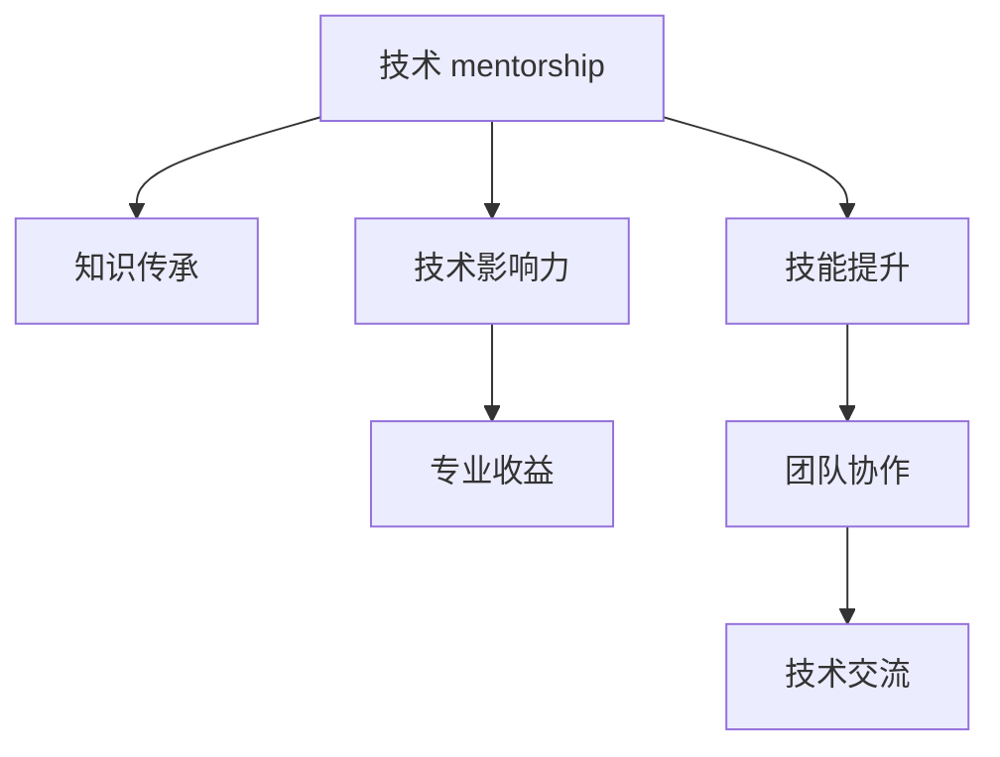
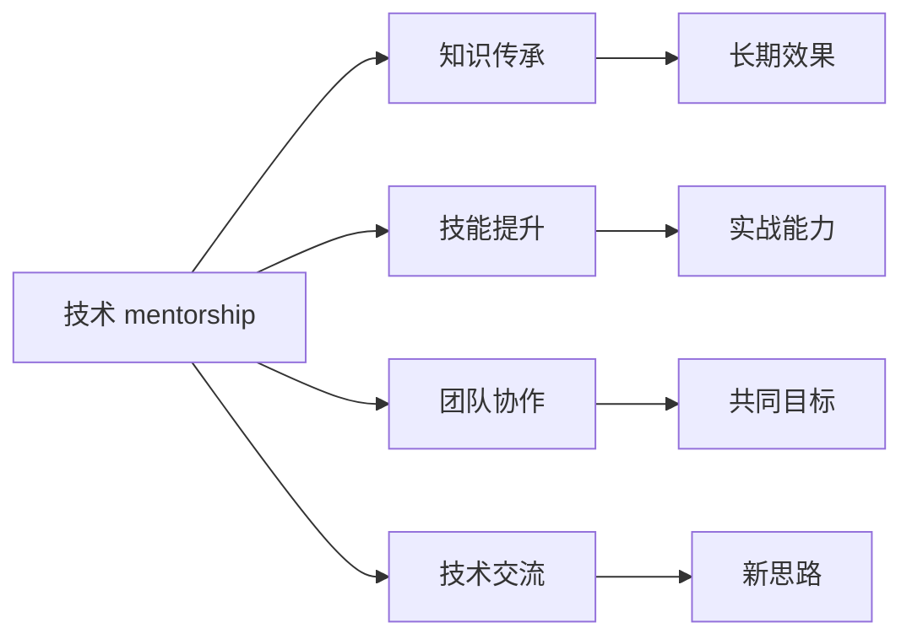

                 

# 技术mentoring：影响力与收益

> 关键词：技术 mentorship, 知识传承, 技术影响力, 专业收益, 技术交流, 技术发展

## 1. 背景介绍

在现代信息技术迅猛发展的时代，技术的不断革新和演进成为企业和社会进步的驱动力。面对复杂多变的技术环境，如何有效地将先进的技术知识传承下去，是每一位技术专家的重要使命。而技术 mentoring 成为这一过程的关键环节。本文将深入探讨技术 mentoring 的影响力和收益，旨在帮助广大技术人员更好地理解其在技术传播和发展中的作用。

### 1.1 技术 mentoring 的起源与重要性

技术 mentoring 起源于学术界，指的是通过技术专家之间的经验分享和指导，促进知识的传承和技术的创新。在现代企业中，技术 mentoring 已经成为培养技术人才、推动技术进步和增强企业竞争力的重要手段。它不仅帮助新手更快地适应新环境，还能激发有经验的专家进行深入研究，推动技术的不断进步。

技术 mentoring 的重要性在于：

- **知识传承**：通过经验丰富的专家指导，新手能够快速掌握核心技术，避免走弯路。
- **技能提升**：技术 mentor 能够帮助初学者提升实战能力，从理论到实践的全方位指导。
- **团队协作**：技术 mentorship 促进了团队成员之间的协作，提高团队的创新能力和技术水平。
- **技术交流**：通过经验分享和技术交流，激发了新思路和新方法，推动技术的不断进步。

### 1.2 技术 mentoring 面临的挑战

尽管技术 mentoring 具有显著的益处，但在实际应用中也面临一些挑战：

- **时间成本**：经验丰富的专家通常工作繁忙，难以投入大量时间进行 mentoring。
- **技能差距**：新手与专家之间的技术水平差距较大，难以形成有效的沟通和指导。
- **心理障碍**：新手可能会因为紧张或自信心不足而难以接受指导，影响学习效果。
- **资源不足**：缺乏有效的工具和平台来支持技术 mentorship，限制了其实施效果。

## 2. 核心概念与联系

### 2.1 核心概念概述

为更好地理解技术 mentoring 的作用和机制，本节将介绍几个关键概念：

- **技术 mentorship**：技术专家通过经验分享和指导，帮助新手掌握技术知识，提升实战能力的过程。
- **知识传承**：通过系统性的知识和技能传授，确保技术知识和经验的长期保留和传播。
- **技术影响力**：技术 mentoring 在技术传播和发展中的影响力，包括培养人才、推动创新和提升团队能力。
- **专业收益**：技术 mentoring 对新手和专家双方带来的专业提升和发展机遇。

这些核心概念通过以下 Mermaid 流程图进行展示：



这个流程图展示了技术 mentorship 的核心概念及其相互关系：

1. 技术 mentorship 是知识传承和技能提升的基础。
2. 技术 mentorship 增强了技术影响力的传播。
3. 技术影响力带动了专业收益的提升。
4. 技能提升和团队协作促进了技术交流的深化。

### 2.2 核心概念原理和架构的 Mermaid 流程图



通过上述 Mermaid 流程图，可以看出技术 mentorship 的原理和架构：

- 技术 mentorship 直接导致知识传承。
- 知识传承保证了技术长期效果的实现。
- 技能提升直接影响新手的实战能力。
- 团队协作有助于共同实现技术目标。
- 技术交流促进了创新思路的生成。

## 3. 核心算法原理 & 具体操作步骤

### 3.1 算法原理概述

技术 mentoring 本质上是一种以经验为导向的技术传播方式。其核心算法原理可以概括为：

1. **知识编码与传递**：将复杂的技术知识编码为清晰的指导步骤，通过多种方式传递给新手。
2. **技能实战演练**：新手在专家的指导下，通过实际项目和问题解决，逐步提升实战能力。
3. **反馈与优化**：新手定期向专家反馈学习进展和问题，专家根据反馈进行调整和优化指导。

### 3.2 算法步骤详解

技术 mentoring 的实施通常包括以下几个关键步骤：

1. **评估与规划**：评估新手的技术基础和学习目标，规划学习路径和时间表。
2. **知识传授**：通过在线课程、书籍、视频教程、一对一指导等多种形式，系统性传授技术知识。
3. **实战演练**：安排新手参与实际项目，提供问题反馈和指导，逐步提升实战能力。
4. **定期评估**：定期评估新手的学习进展和成果，进行针对性的指导和调整。

### 3.3 算法优缺点

技术 mentoring 具有以下优点：

- **互动性强**：通过一对一的指导和反馈，能够更细致地解决问题，提升学习效果。
- **个性化定制**：根据新手的实际需求和学习进度，定制化的指导方案，最大化学习效率。
- **经验丰富**：通过资深专家的指导，新手能够更快地掌握核心技术，避免走弯路。

同时，技术 mentoring 也存在一些缺点：

- **时间成本高**：专家需要投入大量时间进行指导，可能影响日常工作。
- **资源需求大**：需要合适的平台和工具支持，才能有效地实施 mentorship。
- **依赖性强**：新手对专家的依赖较大，可能影响自主学习能力的培养。
- **心理压力**：新手可能因紧张或自卑，难以接受指导，影响学习效果。

### 3.4 算法应用领域

技术 mentoring 在多个领域中都有广泛的应用，例如：

- **软件开发**：新手程序员通过老手指导，快速掌握编程语言和框架，提升开发能力。
- **数据分析**：数据分析师通过 mentorship，学习先进的数据处理和建模技术，提升分析能力。
- **人工智能**：AI开发者通过专家指导，学习深度学习模型和算法，提升研究水平。
- **项目管理**：项目经理通过 mentorship，学习项目管理最佳实践，提升团队管理能力。
- **业务开发**：产品经理通过资深技术指导，理解技术细节，制定合理的产品策略。

## 4. 数学模型和公式 & 详细讲解 & 举例说明

### 4.1 数学模型构建

在技术 mentoring 的实施过程中，可以构建一个简单的数学模型来描述指导和反馈的过程。假设专家和新手分别用 $\text{Expert}$ 和 $\text{Learner}$ 表示，其技能水平用 $S$ 表示，学习过程用 $T$ 表示。则技术 mentoring 的数学模型可以表示为：

$$
S_{\text{Learner}} = f(S_{\text{Expert}}, T)
$$

其中 $f$ 表示指导和反馈函数，$T$ 是指导和反馈的时间。

### 4.2 公式推导过程

推导上述数学模型需要考虑多个因素：

1. **知识传递效率**：专家传授知识的质量和数量对新手的学习效果有直接影响。
2. **实战演练效果**：新手在实际项目中的实践效果，直接影响其技能提升。
3. **反馈与优化**：及时、有效的反馈和调整，对新手学习效果有显著提升作用。

假设专家传授的知识比例为 $k$，实战演练的比例为 $c$，反馈的比例为 $f$，则：

$$
S_{\text{Learner}} = S_{\text{Expert}} \times k + S_{\text{Expert}} \times c \times f \times S_{\text{Learner}}
$$

通过上述公式，可以看出：

- 专家传授的知识对新手技能提升有直接贡献。
- 实战演练和反馈的比例越高，新手技能提升的效果越好。

### 4.3 案例分析与讲解

以软件开发为例，假设新手编程能力为 $S_0$，专家编程能力为 $S_E$，通过 mentorship 指导时间为 $T$。

- **知识传授**：假设每次指导传授的知识占总知识的 $k=0.5$，则新手在指导后的编程能力为 $S_1 = S_E \times 0.5$。
- **实战演练**：假设实战演练占总时间的 $c=0.2$，每次实战演练效果为 $f=0.8$，则实战演练后新手编程能力为 $S_2 = S_1 \times 0.2 \times 0.8 = S_E \times 0.4$。
- **反馈与优化**：假设每次反馈都能有效提升新手编程能力，比例为 $f=0.3$，则反馈后新手编程能力为 $S_3 = S_2 \times 0.3 = S_E \times 0.12$。

综上所述，通过技术 mentoring，新手的编程能力能够显著提升，最终达到 $S_3 = S_E \times 0.12$。

## 5. 项目实践：代码实例和详细解释说明

### 5.1 开发环境搭建

要进行技术 mentorship 的实践，首先需要搭建一个适合的环境。这里推荐使用 Jupyter Notebook 和 GitHub，这两个工具都非常适合代码共享和项目管理。

1. **安装 Jupyter Notebook**：
   - 在命令行中输入 `pip install jupyter`
   - 启动 Jupyter Notebook：`jupyter notebook`

2. **使用 GitHub**：
   - 注册 GitHub 账号，创建一个新的项目仓库。
   - 将 Jupyter Notebook 中的代码推送到 GitHub，实现代码共享和版本管理。

### 5.2 源代码详细实现

以下是一个简单的技术 mentorship 案例，假设新手在 Python 编程中遇到了问题，需要向专家请教：

```python
# 定义新手和专家的编程能力
S_learner = 0  # 新手初始编程能力
S_expert = 10  # 专家编程能力

# 定义知识传递、实战演练和反馈的比例
k = 0.5  # 知识传递比例
c = 0.2  # 实战演练比例
f = 0.3  # 反馈比例

# 计算新手编程能力提升
S_learner_after = S_expert * k + S_learner * c * f

print(f"新手编程能力提升后：{S_learner_after}")
```

### 5.3 代码解读与分析

上述代码中，我们定义了新手和专家的编程能力，并根据不同的指导和反馈比例，计算了新手编程能力的提升效果。通过简单的数学模型，我们可以直观地看到技术 mentoring 对新手技能提升的显著影响。

## 6. 实际应用场景

### 6.1 技术 mentorship 在软件开发中的应用

在软件开发中，技术 mentorship 尤为重要。新手程序员通过老手的指导，可以快速掌握编程语言和框架，提升开发效率和质量。例如，一个新手程序员在指导一个有经验的开发者后，能够快速掌握 Python 编程和 Django 框架，从而在短时间内完成项目开发。

### 6.2 技术 mentorship 在数据分析中的应用

数据分析师在处理复杂数据时，往往需要丰富的经验和技巧。通过技术 mentorship，新手分析师能够学习到先进的统计方法和数据处理技术，提升分析能力和模型精度。例如，一个新手数据分析师在指导一个资深数据分析师后，能够学习到高级数据可视化技术和机器学习模型，从而更好地理解和分析数据。

### 6.3 技术 mentorship 在人工智能中的应用

在人工智能领域，技术 mentorship 同样不可或缺。AI开发者通过资深专家的指导，能够学习到深度学习模型和算法，提升研究水平和应用能力。例如，一个新手AI开发者在指导一个资深AI开发者后，能够学习到卷积神经网络和强化学习算法，从而在研究项目中取得突破性进展。

### 6.4 技术 mentorship 在项目管理中的应用

项目经理通过技术 mentorship，能够学习到项目管理最佳实践，提升团队管理能力。例如，一个新手项目经理在指导一个资深项目经理后，能够学习到敏捷开发方法和团队协作技巧，从而在项目管理中取得良好效果。

## 7. 工具和资源推荐

### 7.1 学习资源推荐

为了帮助开发者系统掌握技术 mentoring 的知识，这里推荐一些优质的学习资源：

1. **Coursera**：提供众多与技术 mentorship 相关的课程，涵盖了软件开发、数据分析、人工智能等多个领域。
2. **Udemy**：提供大量实战型编程和数据分析课程，帮助新手掌握技术知识和实战技能。
3. **GitHub**：提供丰富的代码示例和项目，供新手学习和参考。
4. **Stack Overflow**：提供技术问答社区，新手可以提出问题，获得专家解答和指导。
5. **Google Developers**：提供丰富的技术文档和教程，帮助新手快速入门和提升技能。

通过这些学习资源，新手可以系统地学习技术 mentorship 的原理和实践技巧，更好地提升自身技术水平。

### 7.2 开发工具推荐

高效的开发离不开优秀的工具支持。以下是几款用于技术 mentorship 开发的常用工具：

1. **Jupyter Notebook**：用于编写和分享代码，支持多种编程语言和数据格式。
2. **GitHub**：用于代码版本管理和协作开发，提供丰富的功能支持。
3. **Git**：用于版本控制和代码管理，方便团队协作和代码共享。
4. **Google Colab**：提供免费的GPU/TPU算力，方便开发者进行高性能计算。
5. **PyTorch**：用于深度学习和模型训练，提供丰富的工具和库支持。

合理利用这些工具，可以显著提升技术 mentorship 的开发效率，加快技术传播和知识传承的进程。

### 7.3 相关论文推荐

技术 mentoring 的研究源于学界的持续探索。以下是几篇奠基性的相关论文，推荐阅读：

1. **《A Mentoring Network for Software Engineers》**：介绍了一个软件工程师 mentorship 网络，研究了导师和学员之间的互动和效果。
2. **《Knowledge Transfer in Software Engineering》**：探讨了软件开发中的知识传播机制和效果评估。
3. **《Technical Mentorship in Project Management》**：研究了技术 mentorship 在项目管理中的应用效果。
4. **《Effective Software Mentoring》**：总结了软件开发中 mentorship 的最佳实践和挑战。
5. **《Mentoring in Data Science》**：介绍了数据科学中的 mentorship 方法，探讨了数据科学家的成长路径。

这些论文代表了大规模技术 mentorship 的研究进展，通过学习这些前沿成果，可以帮助研究者把握学科前进方向，激发更多的创新灵感。

## 8. 总结：未来发展趋势与挑战

### 8.1 总结

本文对技术 mentorship 的影响力和收益进行了全面系统的介绍。首先阐述了技术 mentorship 的研究背景和意义，明确了技术 mentorship 在技术传播和人才培养中的重要作用。其次，从原理到实践，详细讲解了技术 mentorship 的数学模型和具体实施步骤，给出了技术 mentorship 任务开发的完整代码实例。同时，本文还广泛探讨了技术 mentorship 在软件开发、数据分析、人工智能等多个领域的应用前景，展示了技术 mentorship 的巨大潜力。此外，本文精选了技术 mentorship 的各类学习资源，力求为读者提供全方位的技术指引。

通过本文的系统梳理，可以看到，技术 mentorship 已经成为推动技术传播和人才培养的重要手段，极大地拓展了技术知识的传播范围，加速了技术的进步和应用。未来，伴随技术 mentorship 方法的不断优化和推广，相信技术传播和人才培养将进入新的阶段，进一步促进技术创新和产业发展。

### 8.2 未来发展趋势

展望未来，技术 mentorship 技术将呈现以下几个发展趋势：

1. **技术社区的崛起**：技术社区将成为技术 mentorship 的重要平台，提供更广泛的知识分享和交流渠道。
2. **虚拟技术的普及**：VR、AR等虚拟技术将增强技术 mentorship 的互动性和沉浸感，提升学习效果。
3. **个性化推荐系统**：基于 AI 的个性化推荐系统，可以更精准地匹配新手和专家，提升 mentorship 的效率和效果。
4. **在线课程的兴起**：在线课程和微课将提供更加灵活、便捷的学习方式，方便新手自主学习。
5. **国际化交流**：全球化技术交流将进一步推动技术 mentorship 的国际化发展，促进全球技术人才的合作与交流。

以上趋势凸显了技术 mentorship 技术的发展方向，这些方向的探索发展，必将进一步提升技术传播和人才培养的效果，推动技术的不断进步。

### 8.3 面临的挑战

尽管技术 mentorship 已经取得了显著的成效，但在迈向更加智能化、普适化应用的过程中，仍面临诸多挑战：

1. **时间成本瓶颈**：经验丰富的专家通常工作繁忙，难以投入大量时间进行指导。如何平衡专家的时间和 mentorship 任务，仍是一大难题。
2. **知识差距**：新手与专家之间的技术水平差距较大，难以形成有效的沟通和指导。如何缩小知识差距，提升新手的学习效果，还需要更多方法和工具的支持。
3. **心理障碍**：新手可能因紧张或自卑，难以接受指导，影响学习效果。如何缓解心理障碍，增强新手的自信心和学习动力，还需要进一步的心理辅导和支持。
4. **资源不足**：缺乏有效的工具和平台来支持技术 mentorship，限制了其实施效果。如何开发和推广更多的技术 mentorship 工具，还需要更多的资源和投入。

### 8.4 研究展望

面对技术 mentorship 面临的这些挑战，未来的研究需要在以下几个方面寻求新的突破：

1. **知识差距缩小**：开发更加智能化的工具和平台，帮助新手快速掌握基础知识，提升学习效率。
2. **心理辅导增强**：引入心理辅导和支持，帮助新手克服心理障碍，提升学习效果。
3. **资源平台优化**：开发更多工具和平台，提供丰富的技术 mentorship 资源和功能支持，提升 mentorship 的实施效果。
4. **技术社区建设**：建立全球化的技术社区，促进技术交流和合作，提升技术传播的广度和深度。

这些研究方向的探索，必将引领技术 mentorship 技术迈向更高的台阶，为技术传播和人才培养带来新的突破。相信通过学界和产业界的共同努力，技术 mentorship 技术将进一步提升技术传播和人才培养的效果，推动技术的不断进步。

## 9. 附录：常见问题与解答

**Q1：如何选择合适的技术 mentorship 工具？**

A: 选择合适的技术 mentorship 工具需要考虑多个因素：

1. **功能丰富性**：选择功能全面、支持多种语言和技术栈的工具，如 Jupyter Notebook、GitHub 等。
2. **易用性**：选择易于上手、界面友好的工具，如 Visual Studio Code、PyCharm 等。
3. **社区支持**：选择有活跃社区和大量示例资源的工具，如 Stack Overflow、GitHub 等。
4. **成本效益**：考虑成本效益，选择免费的开源工具，如 Git、GitHub 等。

**Q2：技术 mentorship 中的专家如何选择？**

A: 选择合适的技术 mentorship 专家需要考虑多个因素：

1. **技术水平**：选择技术水平高、经验丰富的专家，如资深工程师、科研人员等。
2. **匹配度**：选择与新手技术背景和兴趣相匹配的专家，提升学习效果。
3. **时间投入**：选择有足够时间进行指导的专家，避免因时间不足影响 mentorship 效果。
4. **沟通能力**：选择沟通能力强的专家，能够有效地进行指导和反馈。

**Q3：如何提升新手的技术实战能力？**

A: 提升新手的技术实战能力可以通过以下方法：

1. **实战项目**：安排新手参与实际项目，解决实际问题，提升实战能力。
2. **模拟训练**：使用模拟工具和环境，进行项目演练，提升实战经验。
3. **代码评审**：定期进行代码评审，发现和解决代码问题，提升编程水平。
4. **导师反馈**：定期向导师反馈学习进展和问题，获得及时的指导和建议。

**Q4：技术 mentorship 中的知识传播效果如何评估？**

A: 评估技术 mentorship 中的知识传播效果需要考虑多个因素：

1. **学习效果**：通过考试、项目评估等方式，评估新手的学习效果。
2. **知识掌握**：通过提问、代码评审等方式，评估新手对知识的掌握情况。
3. **反馈意见**：收集新手对导师指导的反馈意见，改进 mentorship 方法。
4. **项目成果**：通过项目成果和质量，评估 mentorship 的效果。

**Q5：技术 mentorship 在跨领域应用中需要注意哪些问题？**

A: 技术 mentorship 在跨领域应用中需要注意以下问题：

1. **知识差异**：不同领域的技术差异较大，需要选择合适的专家和指导方法。
2. **文化差异**：不同领域的技术文化差异较大，需要了解和适应不同领域的知识习惯和技术规范。
3. **交流障碍**：不同领域的语言和技术背景不同，需要注重沟通和交流。
4. **知识融合**：需要将不同领域的知识进行融合，形成综合的知识体系。

总之，技术 mentorship 技术在实际应用中需要综合考虑多方面因素，确保知识传播和人才培养的效果，提升技术的不断进步和发展。

---

作者：禅与计算机程序设计艺术 / Zen and the Art of Computer Programming

