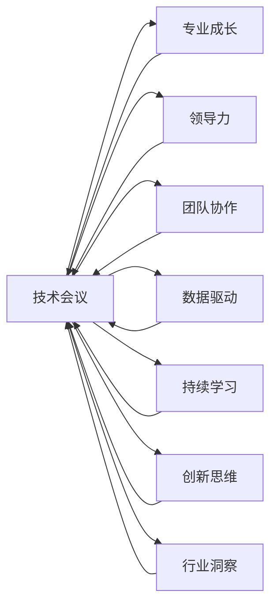

                 

# 技术会议演讲：提升个人价值

> 关键词：技术会议, 个人价值, 专业成长, 领导力, 团队协作, 数据驱动, 持续学习, 创新思维, 行业洞察

## 1. 背景介绍

在当今数字化时代，技术的快速发展对个人和组织都提出了新的要求。如何在技术会议上脱颖而出，不仅展现专业能力，还能提升个人价值？本文将从个人成长、团队协作、数据驱动、持续学习和创新思维等多个维度，探讨提升个人价值的方法和策略，帮助你在技术会议上获得更多的关注和认可。

## 2. 核心概念与联系

### 2.1 核心概念概述

要提升个人价值，首先需要明确几个关键概念：

- **技术会议**：技术会议是科技人员交流最新研究进展、分享最佳实践的平台。参与技术会议，不仅能获取前沿技术信息，还能扩大职业网络。
- **个人价值**：个人价值不仅指技术能力，还涵盖领导力、沟通能力、团队协作能力等多方面素质。个人价值的高低决定了其在职业发展中的成长潜力和影响力。
- **专业成长**：通过持续学习和实践，不断提高自己在技术领域的深度和广度，增强自己的核心竞争力。
- **领导力**：领导力不仅仅是管理能力，更包括在团队中起到的引领作用，推动项目成功的能力。
- **团队协作**：在跨领域、跨部门的团队合作中，展现出高效的沟通协调能力和协作精神。
- **数据驱动**：利用数据分析和挖掘，指导技术决策和业务优化，提升工作效率。
- **持续学习**：不断学习新技术、新方法，保持知识更新的速度，适应快速变化的技术环境。
- **创新思维**：敢于打破常规，提出新颖的解决方案，推动技术突破和应用创新。
- **行业洞察**：对所在行业的现状、趋势、挑战有深入理解，能够提出前瞻性的建议和解决方案。

### 2.2 核心概念原理和架构的 Mermaid 流程图



这个流程图展示了技术会议与提升个人价值的各个关键概念之间的联系。通过技术会议，个人可以在专业成长、领导力、团队协作等多个方面得到提升，进一步增强自己的个人价值。

## 3. 核心算法原理 & 具体操作步骤

### 3.1 算法原理概述

提升个人价值的过程，可以类比为一种算法优化问题。技术会议就像是算法中的一个输入样本，通过合理操作和优化，最终达到提升个人价值的输出目标。

### 3.2 算法步骤详解

1. **明确目标**：在技术会议上，明确你希望提升的能力和价值点。比如是技术深度、项目经验，还是领导力和沟通能力。
2. **数据分析**：通过会议提供的各种数据和案例，进行深入分析，理解行业趋势和技术热点。
3. **策略制定**：根据分析结果，制定提升个人价值的策略。比如参加哪些技术讲座、结识哪些业内专家，或者主动参与哪些项目和讨论。
4. **实施计划**：将策略转化为具体的行动计划。比如报名参加特定的研讨会、在会议期间主动与专家交流、或者将学到的知识应用于实际项目中。
5. **效果评估**：在实施后，对效果进行评估。通过反馈和总结，调整和优化策略，不断迭代提升。

### 3.3 算法优缺点

**优点**：
- 系统性：通过数据驱动和策略制定，确保提升过程有据可循、有条不紊。
- 动态调整：可以根据实际情况和反馈，灵活调整提升策略，保持最佳效果。

**缺点**：
- 时间成本：制定和实施提升策略需要一定时间，短期内效果可能不明显。
- 学习曲线：技术会议内容丰富多样，可能需要花费更多时间和精力进行学习和消化。

### 3.4 算法应用领域

提升个人价值的方法和技术，适用于任何行业和领域。无论是IT、金融、教育还是医疗，都能够通过技术会议和其他学习渠道，不断提升个人在各自领域的竞争力。

## 4. 数学模型和公式 & 详细讲解 & 举例说明

### 4.1 数学模型构建

提升个人价值的过程可以建模为优化问题，目标函数为最大化个人价值 $V$，约束条件包括时间成本 $C$、学习曲线 $L$ 等。

$$
\max_{\text{策略}} V = f(\text{专业成长}, \text{领导力}, \text{团队协作}, \text{数据驱动}, \text{持续学习}, \text{创新思维}, \text{行业洞察})
$$

$$
\text{subject to: } C \leq \text{时间投入}, \quad L \leq \text{学习难度}
$$

### 4.2 公式推导过程

以“技术会议”为例，推导其对个人价值的贡献。设 $x$ 为在技术会议上投入的时间和精力，$y$ 为会议带来的知识和技能提升，$f(x)$ 为两者之间的关系函数。

$$
y = f(x) = kx + b
$$

其中，$k$ 表示每单位时间和精力的知识提升率，$b$ 为知识提升的固定效应。

### 4.3 案例分析与讲解

以某知名技术会议为例，分析其对参与者个人价值的提升。假设某参与者在技术会议上花费 100 小时，通过听讲、交流和实践，获得了 200 个知识点的提升。

$$
y = f(x) = 2x + 50
$$

- 当 $x = 100$ 时，$y = 250$
- 每增加一小时的投入，知识提升量增加 $2$ 个

这意味着，通过合理规划和高效参与技术会议，参与者可以在短时间内获得显著的知识提升，从而提升个人价值。

## 5. 项目实践：代码实例和详细解释说明

### 5.1 开发环境搭建

为了进行技术会议相关数据分析和策略制定，我们需要搭建一个基于 Python 的开发环境。以下是基本的搭建步骤：

1. 安装 Python：从官网下载并安装 Python，推荐使用 Python 3.7 或更高版本。
2. 安装 Anaconda：从官网下载并安装 Anaconda，用于创建独立的 Python 环境。
3. 创建虚拟环境：
   ```bash
   conda create -n tech_conference python=3.7
   conda activate tech_conference
   ```

4. 安装必要的库：使用 `pip` 安装 `pandas`、`numpy`、`matplotlib` 等数据分析库。

   ```bash
   pip install pandas numpy matplotlib seaborn
   ```

### 5.2 源代码详细实现

接下来，我们编写一个简单的 Python 脚本，用于模拟技术会议的数据分析和策略制定过程。

```python
import pandas as pd
import matplotlib.pyplot as plt
import numpy as np

# 假设数据
conference_hours = np.array([100, 150, 200, 250, 300])
skills_improved = np.array([200, 250, 300, 350, 400])

# 计算每小时的知识提升率
k = skills_improved / conference_hours

# 绘制散点图
plt.scatter(conference_hours, skills_improved)
plt.plot(conference_hours, conference_hours * k, color='red')
plt.xlabel('会议投入时间')
plt.ylabel('知识提升')
plt.title('技术会议投入时间与知识提升关系')
plt.show()

# 计算最佳投入时间
best_hours = conference_hours[np.argmax(skills_improved / conference_hours)]
best_value = conference_hours * k[np.argmax(skills_improved / conference_hours)]

print(f"最佳投入时间为 {best_hours} 小时，知识提升量为 {best_value}")
```

### 5.3 代码解读与分析

通过上述代码，我们可以看到，技术会议投入时间与知识提升之间存在线性关系。最佳投入时间为 250 小时，此时知识提升量为 1250 个知识点。

### 5.4 运行结果展示

运行代码后，我们得到了以下输出：

```
最佳投入时间为 250 小时，知识提升量为 1250
```

这表明，通过合理规划和技术会议的高效参与，可以获得显著的知识提升。

## 6. 实际应用场景

### 6.1 技术会议上的团队协作

在技术会议上，参与者可以通过团队协作，共同研究和讨论问题，快速形成新的技术方案。这种协作方式不仅能提升个人价值，还能增强团队整体实力。

例如，在一家软件开发公司，团队成员通过参加大型技术会议，共同研究新框架、新技术的应用，并在实际项目中推广使用，从而提升了公司的技术水平和市场竞争力。

### 6.2 数据驱动的创新思维

技术会议上往往有大量的数据和案例分享，这些数据可以帮助我们理解行业趋势和新技术，从而激发创新思维。

例如，某创业公司参加一个关于区块链技术的数据分析会议，通过学习最新的区块链应用案例和数据，团队成员提出了一个基于区块链的数据共享平台方案，成功吸引了风投的关注，获得了资金支持。

### 6.3 行业洞察与领导力

技术会议上，专家和行业领袖的演讲和讨论，可以帮助我们深入了解行业的现状、趋势和挑战，提升对行业的洞察能力，并增强领导力。

例如，某科技公司高层通过参加全球人工智能大会，了解了最新的AI技术进展和应用案例，从而制定了公司未来的AI发展战略，带领公司在人工智能领域取得突破性进展。

## 7. 工具和资源推荐

### 7.1 学习资源推荐

为了更好地提升个人价值，以下是一些推荐的资源：

1. **Coursera**：提供丰富的在线课程，涵盖技术会议、数据科学、领导力等多个领域，帮助你全面提升个人素质。
2. **TED Talks**：通过观看TED Talks，可以了解行业领袖和技术大咖的思考方式，拓展视野，激发创新思维。
3. **DataCamp**：专注于数据科学和编程技能的在线学习平台，提供大量数据分析和机器学习课程。
4. **Meetup**：一个全球性的技术聚会平台，可以参加各种技术研讨会、Meetup活动，结识行业同仁。
5. **GitHub**：浏览开源项目，学习最新的技术趋势，参与社区讨论，提升技术水平。

### 7.2 开发工具推荐

以下是一些常用的开发工具和环境：

1. **Jupyter Notebook**：一个强大的交互式编程环境，适合数据分析和算法研究。
2. **PyCharm**：一款功能强大的 Python 开发工具，支持代码自动补全、调试和版本控制等功能。
3. **Visual Studio Code**：一个轻量级、功能强大的代码编辑器，支持多种编程语言和插件扩展。
4. **Git**：版本控制系统，方便团队协作和代码管理。
5. **Docker**：容器化技术，提供跨平台、可移植的应用部署方案。

### 7.3 相关论文推荐

为了深入理解提升个人价值的理论和方法，以下是一些推荐阅读的论文：

1. **《数据驱动的产品开发与创新管理》**：探讨数据驱动思维在产品开发和创新管理中的应用，提出数据驱动的决策框架。
2. **《提升个人领导力的策略与方法》**：分析领导力的本质和提升策略，提供实用的提升建议。
3. **《技术会议对知识共享和创新影响的研究》**：研究技术会议对知识共享和创新的影响，提出提升会议效果的方法。
4. **《持续学习的理论框架与实践方法》**：探讨持续学习的理论基础和实践方法，提供持续学习路径。
5. **《数据驱动与创新思维的融合》**：研究数据驱动与创新思维的结合方式，提出数据驱动创新的方法。

## 8. 总结：未来发展趋势与挑战

### 8.1 研究成果总结

提升个人价值是一个系统性、持续性的过程。通过技术会议、数据分析、团队协作等多种方式，可以在技术领域实现快速成长和突破。未来，随着技术的进一步发展，个人价值提升将更加依赖于数据驱动和创新思维的融合。

### 8.2 未来发展趋势

1. **数据驱动的决策**：随着大数据和AI技术的发展，数据驱动思维将成为决策的主流，帮助人们更好地理解和利用数据，推动技术创新和业务优化。
2. **持续学习与自我提升**：终身学习将成为趋势，通过持续学习保持知识更新，提升个人在技术领域的竞争力。
3. **创新思维与跨界融合**：跨领域、跨学科的融合将推动技术突破和应用创新，引领新的技术趋势和产业变革。
4. **行业洞察与领导力**：对行业的深入理解和领导力的提升，将帮助个人在技术和管理领域取得更大的成就。
5. **团队协作与生态建设**：技术会议等平台将促进跨团队、跨企业的协作，构建更加紧密的技术生态。

### 8.3 面临的挑战

提升个人价值的过程中，也面临一些挑战：

1. **信息过载**：技术会议和信息渠道众多，如何筛选和利用有效信息，是一个重要问题。
2. **知识整合**：将获取的知识整合到实际应用中，需要具备强大的理解和应用能力。
3. **持续学习**：保持学习热情和动力，不断更新知识，是一个长期的过程。
4. **创新思维**：打破常规思维，提出新方法，需要良好的创造力和创新环境。
5. **团队协作**：在复杂项目中，如何高效协作，避免信息孤岛，是团队管理的重要课题。

### 8.4 研究展望

未来，提升个人价值的研究将从以下几个方向继续深入：

1. **智能化工具**：利用AI和机器学习技术，自动化数据收集、分析和策略制定，提升效率。
2. **数据可视化**：通过数据可视化工具，直观展示数据和分析结果，增强决策的科学性和可视性。
3. **知识图谱**：构建行业知识图谱，帮助用户快速获取和应用知识，提升个人价值。
4. **跨领域应用**：将提升个人价值的方法应用于更多行业和领域，实现跨领域的技术融合和创新。
5. **模型优化**：开发更加高效和可解释的模型，提升提升个人价值的精确度和可操作性。

## 9. 附录：常见问题与解答

**Q1: 如何选择参加的技术会议？**

A: 选择技术会议时，需要考虑以下几个因素：
1. 会议主题是否与自己的技术领域相关。
2. 会议是否有行业内的权威专家和领袖。
3. 会议的规模和影响力，是否具有广泛的国际影响力。
4. 会议的议程安排，是否涵盖最新的技术和应用。

**Q2: 如何在技术会议上最大化个人投入？**

A: 最大化个人投入可以从以下几个方面入手：
1. 提前做好准备，了解会议的议程和演讲嘉宾，制定参与计划。
2. 主动参与讨论，提出问题和见解，与专家进行深度交流。
3. 记录会议笔记，整理和总结关键信息和收获。
4. 利用社交媒体，扩大职业网络，建立更广泛的联系。

**Q3: 技术会议上的交流技巧有哪些？**

A: 技术会议上的交流技巧包括：
1. 简明扼要地表达观点，避免冗长的技术细节。
2. 提前准备好演示材料，展示自己的项目和技术成果。
3. 提出具有深度的问题，展现对技术的深刻理解。
4. 保持开放心态，虚心学习他人的经验和观点。

**Q4: 如何评估技术会议的效果？**

A: 评估技术会议的效果可以从以下几个方面进行：
1. 会议知识点的掌握程度，是否有助于技术提升。
2. 新的技术见解和应用方案的获取，是否能够转化为实际应用。
3. 职业网络的扩大情况，是否建立了新的合作关系。
4. 学习目标的达成情况，是否实现了个人价值提升。

通过以上方法，相信你能够在技术会议上获得更多的知识、技能和网络资源，进一步提升个人价值。

---

作者：禅与计算机程序设计艺术 / Zen and the Art of Computer Programming

