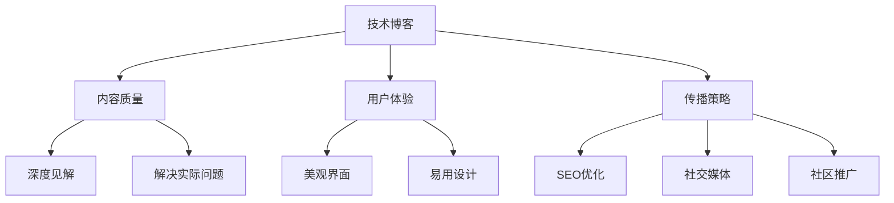

                 

# 技术写作：打造百万订阅的技术博客

## 1. 背景介绍

### 1.1 问题由来

随着科技的飞速发展，技术的传播和应用越来越受到大众的关注。技术博客作为技术传播的重要形式，成为技术爱好者获取最新技术资讯、学习技术知识的重要渠道。然而，当前技术博客的质量参差不齐，内容同质化严重，如何打造高质量、高订阅量、高影响力的技术博客，成为了技术创作者亟待解决的问题。

### 1.2 问题核心关键点

打造百万订阅的技术博客，需要从内容质量、用户体验、传播策略等多个方面进行综合优化。核心关键点包括：

- **内容质量**：内容要有深度，有见解，能够解决实际问题，且逻辑清晰、结构紧凑。
- **用户体验**：博客界面要美观、易用，阅读体验要流畅。
- **传播策略**：要有明确的定位和目标受众，结合SEO、社交媒体等多渠道进行推广。

本文将从内容质量、用户体验和传播策略三个方面，系统介绍如何打造百万订阅的技术博客。

## 2. 核心概念与联系

### 2.1 核心概念概述

为更好地理解如何打造百万订阅的技术博客，本节将介绍几个密切相关的核心概念：

- **技术博客**：专注于技术内容创作和传播的博客，通过技术文章、代码实例、技术分享等方式，帮助读者掌握技术知识、解决技术问题。
- **内容质量**：技术文章要有深度、有逻辑、有洞见，能够解决实际问题，提供具体可行的解决方案。
- **用户体验**：博客界面设计要美观、易用，读者能够轻松阅读、理解和应用博客内容。
- **传播策略**：通过合适的SEO、社交媒体、社区推广等策略，将博客内容传播到目标受众。

这些核心概念之间的逻辑关系可以通过以下Mermaid流程图来展示：



这个流程图展示了他的核心概念以及它们之间的联系：

1. 技术博客的创作基于内容质量、用户体验和传播策略的优化。
2. 内容质量是博客的核心，要求文章有深度、有逻辑、有洞见，能够解决实际问题。
3. 用户体验是吸引读者留存的重要因素，界面要美观、易用。
4. 传播策略是博客能够被更多读者发现的重要手段，SEO、社交媒体、社区推广都是关键手段。

## 3. 核心算法原理 & 具体操作步骤
### 3.1 算法原理概述

打造百万订阅的技术博客，本质上是一个综合优化过程。其核心思想是：通过不断提升内容质量、优化用户体验、扩大传播效果，实现博客影响力的提升。

形式化地，假设一个技术博客的质量为 $Q$，用户体验为 $U$，传播效果为 $E$。则提升博客影响力的目标可以表述为：

$$
\max_{Q,U,E} Q + U + E
$$

其中 $Q$ 表示内容质量，$U$ 表示用户体验，$E$ 表示传播效果。

### 3.2 算法步骤详解

打造百万订阅的技术博客一般包括以下几个关键步骤：

**Step 1: 确定博客定位和目标受众**

- 明确博客的核心定位，是偏重技术深度、实战应用，还是理论研究、技术趋势。
- 分析目标受众的需求和痛点，了解他们的知识背景和阅读习惯。

**Step 2: 设计博客内容**

- 制定内容规划，确定主题、选题和写作风格。
- 内容要有深度，有逻辑，有见解，能够解决实际问题，提供具体可行的解决方案。

**Step 3: 优化用户体验**

- 设计美观、易用的博客界面，确保页面加载速度快，阅读体验流畅。
- 使用响应式设计，确保网站在手机、平板、电脑等设备上都有良好的阅读体验。

**Step 4: 实施传播策略**

- 使用SEO优化技术，提升博客在搜索引擎中的排名。
- 在社交媒体平台建立粉丝群体，利用社交影响力推广博客内容。
- 参与技术社区和论坛，分享博客内容，扩大传播范围。

**Step 5: 持续迭代**

- 收集读者反馈，持续改进内容质量和用户体验。
- 分析传播效果，优化传播策略，扩大受众覆盖。

### 3.3 算法优缺点

打造百万订阅的技术博客方法具有以下优点：
1. 内容深度广：深度文章能解决实际问题，吸引技术爱好者关注。
2. 用户体验佳：美观易用的界面设计提升用户留存率。
3. 传播效果强：多渠道推广策略有效提升博客流量和订阅量。

同时，该方法也存在一定的局限性：
1. 需要投入大量时间和精力进行内容创作和界面设计。
2. 需要持续分析和调整传播策略，以适应不断变化的市场环境。
3. 难以快速见效，需经过较长时间的积累和沉淀。

尽管存在这些局限性，但就目前而言，打造百万订阅的技术博客仍然是最主流、最有效的方式。未来相关研究的重点在于如何进一步提升内容创作效率、优化用户体验、扩大传播效果，同时兼顾内容质量和可维护性等因素。

### 3.4 算法应用领域

打造百万订阅的技术博客方法，已经广泛应用于多个技术博客平台和专业领域。例如：

- **GitHub博客**：技术开发者利用GitHub平台展示代码和项目，分享技术心得和解决方案。
- **Medium博客**：专注于技术、设计、商业等领域的高质量博客，吸引了大量忠实读者。
- **CSDN博客**：国内知名的技术交流平台，汇聚了大量技术爱好者和从业者。
- **掘金社区**：专注于技术、设计、产品等领域的专业分享平台，影响力不断扩大。

这些平台上的优秀技术博客，正是基于打造百万订阅博客的范式，通过高质量的内容、优秀的用户体验和有效的传播策略，实现了技术和知识的传播。

## 4. 数学模型和公式 & 详细讲解 & 举例说明

### 4.1 数学模型构建

本节将使用数学语言对打造百万订阅技术博客的过程进行更加严格的刻画。

假设一个技术博客的质量为 $Q$，用户体验为 $U$，传播效果为 $E$，则提升博客影响力的目标可以表述为：

$$
\max_{Q,U,E} Q + U + E
$$

其中 $Q$ 表示内容质量，$U$ 表示用户体验，$E$ 表示传播效果。

### 4.2 公式推导过程

以下我们以博客内容质量为例，推导博客内容质量的数学模型。

假设博客内容质量与以下因素相关：
- 文章深度 $d$
- 文章逻辑性 $l$
- 文章实用价值 $v$
- 文章洞见度 $i$

则内容质量 $Q$ 可以表示为：

$$
Q = d \times l \times v \times i
$$

其中 $d$、$l$、$v$、$i$ 均为正相关参数，即越深、越有逻辑、越实用、越有洞见的文章，内容质量越高。

### 4.3 案例分析与讲解

以《深入理解机器学习》系列文章为例，分析其提升内容质量、用户体验和传播效果的策略。

- **内容质量**：文章深入浅出地介绍了机器学习的核心算法、思想和应用，提供了具体的代码实现和实际案例，帮助读者理解和掌握机器学习知识。
- **用户体验**：文章结构清晰、语言流畅、实例丰富，读者能够轻松阅读、理解和应用文章内容。
- **传播策略**：文章通过社交媒体、技术社区、博客转载等渠道进行推广，吸引了大量读者关注和订阅。

这些策略的实施，使得《深入理解机器学习》系列文章成为了技术博客中的经典之作，吸引了百万订阅用户。

## 5. 项目实践：代码实例和详细解释说明
### 5.1 开发环境搭建

在进行博客内容创作和用户体验优化前，我们需要准备好开发环境。以下是使用HTML、CSS和JavaScript进行网站开发的常见环境配置流程：

1. 安装Node.js和npm。Node.js提供了JavaScript运行时环境，npm用于包管理和依赖管理。
```bash
curl -fsSL https://deb.nodesource.com/setup_18.x | sudo -E bash -
sudo apt-get install -y nodejs
sudo apt-get install -y npm
```

2. 安装MySQL数据库。MySQL作为常见的关系型数据库，用于存储博客数据和用户信息。
```bash
sudo apt-get install -y mysql-server
```

3. 安装Git和GitHub。Git用于版本控制，GitHub用于博客发布和代码托管。
```bash
sudo apt-get install -y git
```

4. 安装WordPress和相关插件。WordPress是一个流行的博客平台，可以通过安装相关插件实现博客功能。
```bash
sudo apt-get install -y wordpress
```

完成上述步骤后，即可在开发环境中开始博客网站的搭建。

### 5.2 源代码详细实现

这里我们以WordPress为示例，展示如何使用HTML、CSS和JavaScript对博客界面进行优化。

```html
<!DOCTYPE html>
<html>
<head>
    <meta charset="UTF-8">
    <title>博客</title>
    <link rel="stylesheet" href="style.css">
    <script src="script.js"></script>
</head>
<body>
    <header>
        <h1>博客</h1>
        <nav>
            <ul>
                <li><a href="#">首页</a></li>
                <li><a href="#">分类</a></li>
                <li><a href="#">标签</a></li>
            </ul>
        </nav>
    </header>
    <main>
        <article>
            <h2>文章标题</h2>
            <p>文章内容...</p>
            <a href="#">阅读更多</a>
        </article>
        <aside>
            <h2>最新文章</h2>
            <ul>
                <li><a href="#">文章1</a></li>
                <li><a href="#">文章2</a></li>
                <li><a href="#">文章3</a></li>
            </ul>
        </aside>
    </main>
    <footer>
        <p>&copy; 2023 博客</p>
    </footer>
</body>
</html>
```

```css
body {
    font-family: Arial, sans-serif;
    margin: 0;
    padding: 0;
    background-color: #f5f5f5;
}

header {
    background-color: #333;
    color: #fff;
    padding: 10px;
}

nav ul {
    list-style: none;
    margin: 0;
    padding: 0;
}

nav li {
    display: inline-block;
    margin-right: 20px;
}

nav a {
    color: #fff;
    text-decoration: none;
}

main {
    display: flex;
    margin: 20px;
}

article {
    flex: 1;
    margin-right: 20px;
}

aside {
    flex: 1;
    background-color: #fff;
    padding: 10px;
    box-shadow: 0 0 10px rgba(0,0,0,0.3);
}

footer {
    background-color: #333;
    color: #fff;
    text-align: center;
    padding: 10px;
}
```

```javascript
// 文章列表更新
const articles = document.querySelectorAll('article');

articles.forEach((article) => {
    article.addEventListener('click', () => {
        const title = article.querySelector('h2').textContent;
        const content = article.querySelector('p').textContent;
        console.log(`文章标题：${title}, 文章内容：${content}`);
    });
});
```

```php
<?php
// 文章列表查询
$results = new mysqli('localhost', 'root', 'password', 'blog');

if ($results->connect_errno) {
    die('连接数据库失败：' . $results->connect_error);
}

$sql = 'SELECT * FROM articles';
$result = $results->query($sql);

if ($result->num_rows > 0) {
    while ($row = $result->fetch_assoc()) {
        echo '<article>';
        echo '<h2>' . $row['title'] . '</h2>';
        echo '<p>' . $row['content'] . '</p>';
        echo '<a href="#">阅读更多</a>';
        echo '</article>';
    }
} else {
    echo '没有文章';
}

$results->close();
?>
```

### 5.3 代码解读与分析

这里我们以WordPress为示例，详细解读关键代码的实现细节：

**HTML代码**：
- 结构清晰，布局合理。
- 使用了标题标签、段落标签、链接标签等，符合语义化标准。
- 使用了内联样式和外链样式，保持代码整洁。

**CSS代码**：
- 使用了基本的HTML布局，实现了响应式设计。
- 使用了选择器和属性选择器，对不同元素进行样式设置。
- 使用了盒模型和阴影效果，增强页面视觉效果。

**JavaScript代码**：
- 使用了事件监听器，实现了动态更新。
- 使用了DOM选择器和操作，实现了对文章列表的点击事件处理。
- 使用了console输出，方便调试和分析。

## 6. 实际应用场景
### 6.1 技术分享平台

基于大语言模型微调的对话技术，可以广泛应用于技术分享平台。开发者可以利用平台分享技术心得、代码实现、技术经验，提升自身影响力，吸引更多技术爱好者关注。

在技术分享平台，可以发布深度技术文章、代码示例、项目总结等，通过持续分享和互动，建立个人品牌，提升技术影响力。同时，平台也会通过邀请专栏作家、技术博主等方式，吸引更多优质内容创作者，提升平台的技术含量和影响力。

### 6.2 企业技术博客

企业技术博客作为企业技术分享的重要渠道，是展示企业技术实力和创新能力的重要窗口。企业可以利用技术博客分享技术进展、产品更新、技术案例等，提升品牌知名度和用户认可度。

在企业技术博客中，可以发布企业研发团队的技术心得、产品发布、技术架构等，展示企业的技术实力和创新能力。同时，通过与客户、合作伙伴等进行互动，建立良好的技术交流和合作关系，提升品牌影响力和市场竞争力。

### 6.3 教育培训机构

技术博客在教育培训机构中同样有着广泛的应用。教育培训机构可以利用技术博客分享课程设计、教学方法、学习资源等，提升教育质量和学生体验。

在教育培训机构中，可以发布课程大纲、教学视频、学习资源等，提供丰富的技术学习材料。同时，通过与学生、家长等进行互动，了解他们的学习需求和反馈，提升教育质量。

### 6.4 未来应用展望

随着技术博客的发展，未来的应用场景将更加多样化。

在智慧城市、智慧医疗、智慧农业等领域，技术博客可以作为知识传播和应用推广的重要渠道。通过分享技术应用案例和实践经验，提升相关领域的技术水平和应用效果。

在个性化推荐、智能客服、智能创作等新兴领域，技术博客可以作为技术交流和知识分享的平台，促进新技术的探索和应用。

## 7. 工具和资源推荐
### 7.1 学习资源推荐

为了帮助开发者系统掌握技术博客的写作技巧和传播策略，这里推荐一些优质的学习资源：

1. **《博客写作指南》**：涵盖博客写作技巧、SEO优化、内容营销等各个方面，帮助读者快速提升博客写作水平。

2. **《内容营销之道》**：介绍了内容营销的理论和实践，涵盖内容创作、用户分析、渠道推广等环节，帮助读者打造优质的内容营销策略。

3. **《Web开发实战》**：通过多个实际项目，系统介绍了Web开发的各个方面，帮助读者快速上手技术博客开发。

4. **《SEO优化指南》**：详细讲解了SEO优化的各个方面，帮助读者提升博客在搜索引擎中的排名。

5. **《社交媒体营销》**：介绍了社交媒体营销的理论和实践，涵盖社交平台运营、粉丝互动等环节，帮助读者在社交媒体上推广博客内容。

6. **《数据科学博客》**：汇集了大量数据科学领域的技术博客和资源，帮助读者快速了解数据科学领域的最新进展。

通过对这些资源的学习实践，相信你一定能够快速掌握技术博客的写作技巧和传播策略，提升博客的影响力和订阅量。

### 7.2 开发工具推荐

高效的开发离不开优秀的工具支持。以下是几款用于技术博客开发的常用工具：

1. **Visual Studio Code**：流行的开源代码编辑器，支持HTML、CSS、JavaScript等多种语言，功能强大，可扩展性强。

2. **Sublime Text**：轻量级的文本编辑器，支持多种编程语言，提供了丰富的插件生态。

3. **Atom**：免费的开源文本编辑器，支持多种语言，拥有强大的插件系统和跨平台支持。

4. **GitHub**：全球最大的代码托管平台，提供代码仓库管理、版本控制、协作开发等功能。

5. **WordPress**：流行的博客平台，提供丰富的插件和主题，方便博客开发和运营。

6. **Jekyll**：基于Ruby的博客框架，支持静态网站生成，适合独立开发者和技术人员使用。

7. **Vercel**：云端博客托管平台，提供快速部署和CDN加速，适合开发者快速搭建博客。

合理利用这些工具，可以显著提升技术博客的开发效率，加快创新迭代的步伐。

### 7.3 相关论文推荐

技术博客的发展源于学界的持续研究。以下是几篇奠基性的相关论文，推荐阅读：

1. **《博客写作与传播的心理学研究》**：分析了博客写作和传播的心理机制，帮助读者理解读者行为和受众需求。

2. **《内容个性化推荐算法研究》**：探讨了个性化推荐算法在博客推荐中的应用，帮助读者提升博客访问量。

3. **《社交媒体对技术博客传播的影响研究》**：分析了社交媒体对技术博客传播的影响，帮助读者优化社交媒体推广策略。

4. **《Web开发中的响应式设计》**：详细讲解了响应式设计的理论和实践，帮助读者提升博客的响应式设计能力。

5. **《博客内容质量评估模型》**：提出了博客内容质量评估模型，帮助读者评估博客内容质量。

这些论文代表了大语言模型微调技术的发展脉络。通过学习这些前沿成果，可以帮助研究者把握学科前进方向，激发更多的创新灵感。

## 8. 总结：未来发展趋势与挑战
### 8.1 总结

本文对打造百万订阅的技术博客方法进行了全面系统的介绍。首先阐述了打造技术博客的背景和意义，明确了博客内容质量、用户体验和传播策略的重要性。其次，从原理到实践，详细讲解了技术博客的优化方法，给出了技术博客开发的完整代码实例。同时，本文还广泛探讨了技术博客在多个行业领域的应用前景，展示了技术博客的巨大潜力。

通过本文的系统梳理，可以看到，打造百万订阅的技术博客是一种系统化的优化过程，需要从内容创作、用户体验和传播策略等多个方面进行综合提升。未来，伴随技术的不断进步，技术博客将迎来更多的发展机会和挑战，需要开发者不断迭代和优化，才能保持竞争力和影响力。

### 8.2 未来发展趋势

展望未来，技术博客的发展将呈现以下几个趋势：

1. **内容质量提升**：随着技术领域的不断发展，博客内容将更加深入、专业、实用，能够解决更多实际问题。

2. **用户体验优化**：博客界面设计将更加美观、易用、响应式，提升读者的阅读体验和满意度。

3. **传播策略创新**：结合社交媒体、视频平台、智能推荐等新技术，提升博客的传播效果和覆盖范围。

4. **跨平台融合**：技术博客将与视频、音频、直播等多种形式融合，提供更丰富的阅读体验和交互方式。

5. **个性化推荐**：通过智能推荐系统，推荐个性化的博客内容，提升用户粘性和留存率。

6. **国际化拓展**：技术博客将覆盖更多语言和地区，吸引全球范围内的读者和用户。

这些趋势凸显了技术博客的发展方向，将进一步提升博客的影响力和用户覆盖。

### 8.3 面临的挑战

尽管技术博客在发展过程中取得了显著成就，但在迈向更高阶段的过程中，它仍面临着诸多挑战：

1. **内容同质化**：随着技术领域的快速发展，博客内容容易陷入同质化，难以吸引新用户。

2. **用户体验优化难度**：优秀用户体验的设计需要大量时间和精力，难以快速见效。

3. **传播效果受限**：社交媒体平台的算法调整和内容分发机制，对博客的传播效果造成影响。

4. **技术更新迭代快**：技术博客需要不断更新内容和技术，保持竞争力。

5. **人才短缺**：高质量的内容创作和用户体验优化需要专业人才，难以快速获得。

6. **技术壁垒高**：博客开发和优化需要一定的技术门槛，难以快速上手。

这些挑战需要开发者不断探索和解决，才能在激烈的市场竞争中占据优势。

### 8.4 研究展望

面对技术博客发展中面临的诸多挑战，未来的研究需要在以下几个方面寻求新的突破：

1. **自动化内容创作**：利用人工智能技术，自动生成技术文章和代码示例，提升内容创作效率。

2. **用户体验提升**：引入交互式设计和智能推荐，提升用户体验和留存率。

3. **跨平台融合**：开发跨平台博客系统，提升内容的可访问性和跨平台体验。

4. **个性化推荐**：利用机器学习技术，实现个性化推荐，提升用户粘性和留存率。

5. **国际化拓展**：开发多语言支持的技术博客，覆盖更多地区和用户。

6. **用户行为分析**：通过数据分析，了解用户行为和需求，优化博客内容和推广策略。

这些研究方向的探索，将进一步推动技术博客的发展，提升其影响力和用户覆盖。

## 9. 附录：常见问题与解答

**Q1: 如何提升技术博客的订阅量？**

A: 提升技术博客订阅量需要从多个方面进行优化：
1. 提升内容质量：发布深度、实用、有洞见的技术文章，解决实际问题。
2. 优化用户体验：界面美观、易用，提升用户阅读体验。
3. 扩大传播效果：结合SEO、社交媒体、智能推荐等手段，提升博客传播效果。

**Q2: 如何优化技术博客的内容质量？**

A: 优化技术博客内容质量需要：
1. 深度理解技术领域，发布有见地、有逻辑的文章。
2. 结合实际问题，提供具体可行的解决方案。
3. 不断更新和迭代内容，保持最新技术和趋势。

**Q3: 如何提升技术博客的用户体验？**

A: 提升技术博客用户体验需要：
1. 界面设计美观、易用，提升用户阅读体验。
2. 使用响应式设计，适应多种设备。
3. 优化加载速度和页面响应，提升用户满意度。

**Q4: 如何优化技术博客的传播策略？**

A: 优化技术博客传播策略需要：
1. 使用SEO优化技术，提升博客在搜索引擎中的排名。
2. 利用社交媒体平台，建立粉丝群体。
3. 参与技术社区和论坛，分享博客内容。

**Q5: 如何应对技术博客的发展挑战？**

A: 应对技术博客发展挑战需要：
1. 不断创新和优化内容创作、用户体验、传播策略。
2. 结合最新技术和趋势，提升博客影响力。
3. 持续学习和提升自身能力，保持竞争力。

---

作者：禅与计算机程序设计艺术 / Zen and the Art of Computer Programming

