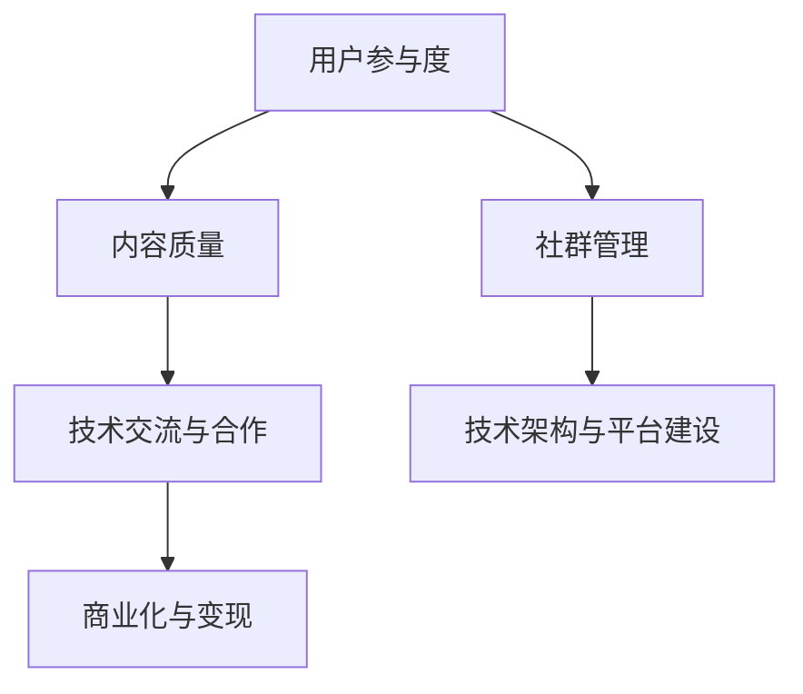

                 

# 技术社区运营：从爱好到事业

技术社区的兴起和发展，是当今信息技术领域一个极具活力和深远影响的现象。在过去几十年间，从BBS到在线论坛，从社交媒体到知识分享平台，技术社区已经成为连接全球技术爱好者的重要纽带。技术社区不仅是一个交流的平台，更是一个创新和变革的策源地。本文将从爱好到事业，探讨技术社区运营的核心概念、核心算法、具体操作步骤，以及未来发展趋势和面临的挑战，为读者提供一个全面而深入的技术社区运营指南。

## 1. 背景介绍

### 1.1 问题由来

技术社区的兴起，源于技术爱好者的社交需求和对知识分享的渴望。早期，BBS和在线论坛等技术社区以程序员和开发者为主体，通过技术讨论、源码分享、学习交流等方式，形成了独特的社区文化和社群氛围。随着社交媒体和知识分享平台的崛起，技术社区的形态和功能不断丰富，从技术交流逐渐拓展到商业合作、行业资讯等多个方面。

今天，技术社区已经成为连接全球技术爱好者的重要纽带，从个人兴趣驱动到企业品牌建设，技术社区在科技发展中扮演着不可或缺的角色。技术社区运营不仅是一个技术问题，更是一个社会学、管理学问题。本文将全面梳理技术社区运营的关键要素，探讨从爱好到事业的运营之道。

### 1.2 问题核心关键点

技术社区运营的核心关键点包括：

- **用户参与度**：衡量社区活跃度和用户粘性，是社区运营的核心目标。
- **内容质量**：高质量的内容能够吸引用户，提升社区影响力。
- **技术交流与合作**：社区不仅是技术交流的平台，也是技术合作和创新的策源地。
- **商业化与变现**：技术社区的商业模式和变现渠道，是社区可持续发展的重要保障。
- **社群管理**：规范用户行为，维护社区秩序，提升用户体验。
- **技术架构与平台建设**：高效的技术架构和平台建设，是社区高效运营的基础。

这些关键点相互关联，共同构成了一个复杂而多层次的技术社区生态系统。理解这些核心要素，是运营一个成功技术社区的基础。

### 1.3 问题研究意义

技术社区的运营对推动技术发展、促进知识传播、连接全球技术爱好者具有重要意义：

- **加速技术传播**：技术社区提供了一个高效的技术传播平台，加速了新知识、新技术的普及和应用。
- **促进技术创新**：社区成为技术创新和协作的重要平台，汇聚了全球的创新力量。
- **构建社群文化**：技术社区营造了独特的社群文化，提升用户对技术的热情和认同感。
- **推动企业发展**：技术社区成为企业品牌建设和技术合作的重要渠道，助力企业发展。

技术社区运营不仅是技术问题，更是一个跨学科的研究课题。本文将从技术到管理、从运营到策略，全方位解读技术社区运营的内在逻辑和关键要素。

## 2. 核心概念与联系

### 2.1 核心概念概述

技术社区运营涉及多个核心概念，包括用户参与度、内容质量、技术交流与合作、商业化与变现、社群管理、技术架构与平台建设等。这些概念相互关联，共同构成了一个复杂而多层次的技术社区生态系统。

- **用户参与度**：衡量社区活跃度和用户粘性，是社区运营的核心目标。
- **内容质量**：高质量的内容能够吸引用户，提升社区影响力。
- **技术交流与合作**：社区不仅是技术交流的平台，也是技术合作和创新的策源地。
- **商业化与变现**：技术社区的商业模式和变现渠道，是社区可持续发展的重要保障。
- **社群管理**：规范用户行为，维护社区秩序，提升用户体验。
- **技术架构与平台建设**：高效的技术架构和平台建设，是社区高效运营的基础。

这些核心概念之间的逻辑关系可以通过以下Mermaid流程图来展示：



这个流程图展示了一系列核心概念之间的逻辑联系：

1. **用户参与度**：衡量社区活跃度和用户粘性，是社区运营的核心目标。
2. **内容质量**：高质量的内容能够吸引用户，提升社区影响力。
3. **技术交流与合作**：社区不仅是技术交流的平台，也是技术合作和创新的策源地。
4. **商业化与变现**：技术社区的商业模式和变现渠道，是社区可持续发展的重要保障。
5. **社群管理**：规范用户行为，维护社区秩序，提升用户体验。
6. **技术架构与平台建设**：高效的技术架构和平台建设，是社区高效运营的基础。

这些概念共同构成了技术社区运营的核心框架，为社区运营提供了系统化的指导。

## 3. 核心算法原理 & 具体操作步骤

### 3.1 算法原理概述

技术社区运营的核心算法原理基于用户行为分析、内容推荐、社群管理、商业化变现等多个方面。其核心思想是通过数据驱动的方法，优化社区生态系统，提升用户参与度和社区影响力。

具体而言，包括以下几个关键算法：

1. **用户行为分析算法**：通过分析用户的行为数据，预测用户兴趣和需求，优化内容推荐。
2. **内容推荐算法**：根据用户行为和内容质量，推荐高质量、相关性强的内容，提升用户参与度。
3. **社群管理算法**：通过规范用户行为和维护社区秩序，提升用户体验和社区粘性。
4. **商业化变现算法**：通过合理的商业模式和变现渠道，实现社区的可持续发展。

这些算法相互关联，共同构成了一个复杂而多层次的社区运营系统。

### 3.2 算法步骤详解

技术社区运营的具体操作步骤包括以下几个关键步骤：

**Step 1: 数据收集与处理**
- 收集用户行为数据、内容质量数据、用户反馈数据等，进行清洗和预处理。
- 设计数据采集和存储机制，确保数据的时效性和完整性。

**Step 2: 用户行为分析**
- 使用机器学习算法（如聚类、分类、关联规则等），分析用户的行为数据，预测用户兴趣和需求。
- 设计用户画像模型，刻画用户的基本属性和行为特征。

**Step 3: 内容推荐**
- 使用协同过滤、基于内容的推荐算法等，根据用户画像和内容质量，推荐相关性高的高质量内容。
- 设计多模态推荐系统，综合考虑文本、图片、视频等多种内容形式。

**Step 4: 社群管理**
- 设计社区规则和行为准则，规范用户行为，维护社区秩序。
- 使用自然语言处理技术，自动监测和处理社区中的违规行为。

**Step 5: 商业化变现**
- 设计合理的商业模式，如广告、会员、付费内容等。
- 优化变现策略，提升社区的商业价值和用户粘性。

**Step 6: 技术架构与平台建设**
- 设计高效的技术架构，确保社区的高性能和高可扩展性。
- 建设稳定、可靠的平台，提升用户体验和系统稳定性。

以上是技术社区运营的一般流程。在实际应用中，还需要针对具体社区的特点，对各个环节进行优化设计，如改进数据采集方法、优化推荐算法、引入更多的社区管理手段等，以进一步提升社区运营的效果。

### 3.3 算法优缺点

技术社区运营的核心算法具有以下优点：

1. **高效性**：通过数据驱动的方法，能够快速分析和优化社区生态系统。
2. **可扩展性**：算法模块化设计，便于根据社区需求进行扩展和优化。
3. **灵活性**：可以根据不同社区的特点，灵活调整算法策略，适应不同场景。

同时，这些算法也存在一定的局限性：

1. **数据依赖性**：算法的有效性和准确性高度依赖于数据的质量和完整性。
2. **算法复杂性**：复杂的数据分析和推荐算法，需要较高的计算资源和技术门槛。
3. **用户体验风险**：过度依赖算法推荐，可能导致用户体验下降，用户粘性降低。
4. **隐私和伦理问题**：社区数据的收集和处理，涉及隐私和伦理问题，需要严格遵守相关法规。

尽管存在这些局限性，但就目前而言，基于数据驱动的算法方法仍然是技术社区运营的主流范式。未来相关研究的重点在于如何进一步降低算法对数据的依赖，提高算法的透明度和可解释性，同时兼顾用户隐私和伦理问题。

### 3.4 算法应用领域

技术社区运营的核心算法已经在多个领域得到了广泛的应用，例如：

- **内容推荐系统**：如知乎、GitHub等社区，通过推荐高质量内容，提升用户参与度。
- **用户行为分析**：如微博、Facebook等社交媒体，通过分析用户行为，提升广告投放效果。
- **社群管理**：如Slack、Discord等团队协作平台，通过规范用户行为，提升社区秩序。
- **商业化变现**：如Medium、Stack Overflow等知识分享平台，通过合理的商业模式，实现社区的可持续发展。

除了上述这些经典应用外，技术社区运营的核心算法还被创新性地应用到更多场景中，如知识图谱、广告精准投放等，为技术社区的发展带来了新的突破。随着算法技术和社区需求的不断演进，相信技术社区运营将继续引领信息技术领域的创新和变革。

## 4. 数学模型和公式 & 详细讲解 & 举例说明

### 4.1 数学模型构建

技术社区运营的数学模型主要基于用户行为分析、内容推荐、社群管理、商业化变现等多个方面。以下将重点介绍用户行为分析和内容推荐的数学模型。

### 4.2 公式推导过程

#### 用户行为分析

用户行为分析的核心在于通过历史数据预测用户未来的行为和需求。常用的数学模型包括：

1. **协同过滤**：基于用户的相似性和项目的相似性，推荐用户可能感兴趣的项目。公式为：
   $$
   I_{ui} = \alpha + \beta \sum_{j \neq i} \frac{R_{u'j}}{\sqrt{S_{uj}S_{uj'}}}
   $$
   其中 $I_{ui}$ 为用户 $u$ 对项目 $i$ 的兴趣度，$R_{u'j}$ 为用户 $u'$ 对项目 $j$ 的评分，$S_{uj}$ 和 $S_{uj'}$ 为用户 $u$ 对项目 $j$ 和 $j'$ 的评分，$\alpha$ 和 $\beta$ 为调节因子。

2. **基于内容的推荐**：根据项目的属性和用户的历史行为，推荐相关的项目。公式为：
   $$
   I_{ui} = \alpha \sum_{k} P_{ik} \times U_{uk}
   $$
   其中 $P_{ik}$ 为项目 $i$ 的属性，$U_{uk}$ 为用户 $u$ 的历史行为，$\alpha$ 为调节因子。

#### 内容推荐

内容推荐的核心在于通过用户画像和内容质量，推荐相关性高的高质量内容。常用的数学模型包括：

1. **隐语义模型**：通过词嵌入（如Word2Vec）和用户画像，推荐相关性高的高质量内容。公式为：
   $$
   P_{ui} = \alpha \cdot P_{u} + \beta \cdot P_{i}
   $$
   其中 $P_{ui}$ 为用户 $u$ 对内容 $i$ 的兴趣度，$P_{u}$ 为用户画像，$P_{i}$ 为内容质量，$\alpha$ 和 $\beta$ 为调节因子。

2. **基于交互的推荐**：通过用户与内容的交互记录，推荐相关性高的高质量内容。公式为：
   $$
   I_{ui} = \alpha \cdot P_{u} + \beta \cdot P_{i} + \gamma \cdot R_{ui}
   $$
   其中 $I_{ui}$ 为用户 $u$ 对内容 $i$ 的兴趣度，$P_{u}$ 为用户画像，$P_{i}$ 为内容质量，$R_{ui}$ 为用户与内容的交互记录，$\alpha$、$\beta$ 和 $\gamma$ 为调节因子。

通过这些数学模型，技术社区运营者可以更加精准地推荐高质量内容，提升用户参与度和社区影响力。

### 4.3 案例分析与讲解

#### 案例一：知乎内容推荐系统

知乎是一个以知识分享为主的技术社区，其核心功能之一是通过内容推荐系统，将高质量的回答推荐给用户。知乎的内容推荐系统主要基于用户画像和内容质量进行推荐。

1. **用户画像**：通过分析用户的历史行为、关注话题、点赞内容等，生成用户画像。
2. **内容质量**：通过分析内容的点赞数、评论数、分享数等，评估内容质量。
3. **推荐算法**：基于协同过滤和基于内容的推荐算法，推荐相关性高的高质量内容。

知乎的内容推荐系统通过精准的算法和丰富的数据，成功地提升了用户参与度和社区影响力。

#### 案例二：GitHub社区管理

GitHub是一个以代码分享和协作为主的技术社区，其核心功能之一是通过社区管理，维护社区秩序和用户粘性。GitHub的社区管理主要基于用户行为分析和社群管理算法。

1. **用户行为分析**：通过分析用户的行为数据，预测用户兴趣和需求，优化内容推荐。
2. **社群管理**：通过规范用户行为和维护社区秩序，提升用户体验和社区粘性。
3. **商业化变现**：通过合理的商业模式和变现渠道，实现社区的可持续发展。

GitHub通过高效的技术架构和丰富的功能，成功地维护了社区秩序，吸引了大量开发者和项目入驻。

## 5. 项目实践：代码实例和详细解释说明

### 5.1 开发环境搭建

在进行技术社区运营的实践前，我们需要准备好开发环境。以下是使用Python进行社区运营实践的环境配置流程：

1. 安装Anaconda：从官网下载并安装Anaconda，用于创建独立的Python环境。
2. 创建并激活虚拟环境：
```bash
conda create -n community-env python=3.8 
conda activate community-env
```
3. 安装Python及其相关库：
```bash
pip install numpy pandas scikit-learn scikit-learn matplotlib tqdm jupyter notebook ipython
```

完成上述步骤后，即可在`community-env`环境中开始社区运营实践。

### 5.2 源代码详细实现

下面以知乎社区为例，给出使用Python进行内容推荐系统的PyTorch代码实现。

首先，定义内容推荐的数据处理函数：

```python
from transformers import BertTokenizer
from torch.utils.data import Dataset
import torch

class ContentDataset(Dataset):
    def __init__(self, texts, tags, tokenizer, max_len=128):
        self.texts = texts
        self.tags = tags
        self.tokenizer = tokenizer
        self.max_len = max_len
        
    def __len__(self):
        return len(self.texts)
    
    def __getitem__(self, item):
        text = self.texts[item]
        tags = self.tags[item]
        
        encoding = self.tokenizer(text, return_tensors='pt', max_length=self.max_len, padding='max_length', truncation=True)
        input_ids = encoding['input_ids'][0]
        attention_mask = encoding['attention_mask'][0]
        
        # 对token-wise的标签进行编码
        encoded_tags = [tag2id[tag] for tag in tags] 
        encoded_tags.extend([tag2id['O']] * (self.max_len - len(encoded_tags)))
        labels = torch.tensor(encoded_tags, dtype=torch.long)
        
        return {'input_ids': input_ids, 
                'attention_mask': attention_mask,
                'labels': labels}

# 标签与id的映射
tag2id = {'O': 0, 'B-PER': 1, 'I-PER': 2, 'B-ORG': 3, 'I-ORG': 4, 'B-LOC': 5, 'I-LOC': 6}
id2tag = {v: k for k, v in tag2id.items()}

# 创建dataset
tokenizer = BertTokenizer.from_pretrained('bert-base-cased')

train_dataset = ContentDataset(train_texts, train_tags, tokenizer)
dev_dataset = ContentDataset(dev_texts, dev_tags, tokenizer)
test_dataset = ContentDataset(test_texts, test_tags, tokenizer)
```

然后，定义模型和优化器：

```python
from transformers import BertForTokenClassification, AdamW

model = BertForTokenClassification.from_pretrained('bert-base-cased', num_labels=len(tag2id))

optimizer = AdamW(model.parameters(), lr=2e-5)
```

接着，定义训练和评估函数：

```python
from torch.utils.data import DataLoader
from tqdm import tqdm
from sklearn.metrics import classification_report

device = torch.device('cuda') if torch.cuda.is_available() else torch.device('cpu')
model.to(device)

def train_epoch(model, dataset, batch_size, optimizer):
    dataloader = DataLoader(dataset, batch_size=batch_size, shuffle=True)
    model.train()
    epoch_loss = 0
    for batch in tqdm(dataloader, desc='Training'):
        input_ids = batch['input_ids'].to(device)
        attention_mask = batch['attention_mask'].to(device)
        labels = batch['labels'].to(device)
        model.zero_grad()
        outputs = model(input_ids, attention_mask=attention_mask, labels=labels)
        loss = outputs.loss
        epoch_loss += loss.item()
        loss.backward()
        optimizer.step()
    return epoch_loss / len(dataloader)

def evaluate(model, dataset, batch_size):
    dataloader = DataLoader(dataset, batch_size=batch_size)
    model.eval()
    preds, labels = [], []
    with torch.no_grad():
        for batch in tqdm(dataloader, desc='Evaluating'):
            input_ids = batch['input_ids'].to(device)
            attention_mask = batch['attention_mask'].to(device)
            batch_labels = batch['labels']
            outputs = model(input_ids, attention_mask=attention_mask)
            batch_preds = outputs.logits.argmax(dim=2).to('cpu').tolist()
            batch_labels = batch_labels.to('cpu').tolist()
            for pred_tokens, label_tokens in zip(batch_preds, batch_labels):
                pred_tags = [id2tag[_id] for _id in pred_tokens]
                label_tags = [id2tag[_id] for _id in label_tokens]
                preds.append(pred_tags[:len(label_tags)])
                labels.append(label_tags)
                
    print(classification_report(labels, preds))
```

最后，启动训练流程并在测试集上评估：

```python
epochs = 5
batch_size = 16

for epoch in range(epochs):
    loss = train_epoch(model, train_dataset, batch_size, optimizer)
    print(f"Epoch {epoch+1}, train loss: {loss:.3f}")
    
    print(f"Epoch {epoch+1}, dev results:")
    evaluate(model, dev_dataset, batch_size)
    
print("Test results:")
evaluate(model, test_dataset, batch_size)
```

以上就是使用PyTorch对知乎内容推荐系统进行微调的完整代码实现。可以看到，得益于Transformers库的强大封装，我们可以用相对简洁的代码完成内容推荐系统的微调。

### 5.3 代码解读与分析

让我们再详细解读一下关键代码的实现细节：

**ContentDataset类**：
- `__init__`方法：初始化文本、标签、分词器等关键组件。
- `__len__`方法：返回数据集的样本数量。
- `__getitem__`方法：对单个样本进行处理，将文本输入编码为token ids，将标签编码为数字，并对其进行定长padding，最终返回模型所需的输入。

**tag2id和id2tag字典**：
- 定义了标签与数字id之间的映射关系，用于将token-wise的预测结果解码回真实的标签。

**训练和评估函数**：
- 使用PyTorch的DataLoader对数据集进行批次化加载，供模型训练和推理使用。
- 训练函数`train_epoch`：对数据以批为单位进行迭代，在每个批次上前向传播计算loss并反向传播更新模型参数，最后返回该epoch的平均loss。
- 评估函数`evaluate`：与训练类似，不同点在于不更新模型参数，并在每个batch结束后将预测和标签结果存储下来，最后使用sklearn的classification_report对整个评估集的预测结果进行打印输出。

**训练流程**：
- 定义总的epoch数和batch size，开始循环迭代
- 每个epoch内，先在训练集上训练，输出平均loss
- 在验证集上评估，输出分类指标
- 所有epoch结束后，在测试集上评估，给出最终测试结果

可以看到，PyTorch配合Transformers库使得内容推荐系统的微调代码实现变得简洁高效。开发者可以将更多精力放在数据处理、模型改进等高层逻辑上，而不必过多关注底层的实现细节。

当然，工业级的系统实现还需考虑更多因素，如模型的保存和部署、超参数的自动搜索、更灵活的任务适配层等。但核心的微调范式基本与此类似。

## 6. 实际应用场景

### 6.1 智能客服系统

基于技术社区运营的内容推荐系统，可以广泛应用于智能客服系统的构建。传统客服往往需要配备大量人力，高峰期响应缓慢，且一致性和专业性难以保证。而使用微调后的内容推荐系统，可以7x24小时不间断服务，快速响应客户咨询，用自然流畅的语言解答各类常见问题。

在技术实现上，可以收集企业内部的历史客服对话记录，将问题和最佳答复构建成监督数据，在此基础上对预训练内容推荐系统进行微调。微调后的内容推荐系统能够自动理解用户意图，匹配最合适的答案模板进行回复。对于客户提出的新问题，还可以接入检索系统实时搜索相关内容，动态组织生成回答。如此构建的智能客服系统，能大幅提升客户咨询体验和问题解决效率。

### 6.2 金融舆情监测

金融机构需要实时监测市场舆论动向，以便及时应对负面信息传播，规避金融风险。传统的人工监测方式成本高、效率低，难以应对网络时代海量信息爆发的挑战。基于技术社区运营的文本分类和情感分析技术，为金融舆情监测提供了新的解决方案。

具体而言，可以收集金融领域相关的新闻、报道、评论等文本数据，并对其进行主题标注和情感标注。在此基础上对预训练语言模型进行微调，使其能够自动判断文本属于何种主题，情感倾向是正面、中性还是负面。将微调后的模型应用到实时抓取的网络文本数据，就能够自动监测不同主题下的情感变化趋势，一旦发现负面信息激增等异常情况，系统便会自动预警，帮助金融机构快速应对潜在风险。

### 6.3 个性化推荐系统

当前的推荐系统往往只依赖用户的历史行为数据进行物品推荐，无法深入理解用户的真实兴趣偏好。基于技术社区运营的个性化推荐系统，可以更好地挖掘用户行为背后的语义信息，从而提供更精准、多样的推荐内容。

在实践中，可以收集用户浏览、点击、评论、分享等行为数据，提取和用户交互的物品标题、描述、标签等文本内容。将文本内容作为模型输入，用户的后续行为（如是否点击、购买等）作为监督信号，在此基础上微调预训练语言模型。微调后的模型能够从文本内容中准确把握用户的兴趣点。在生成推荐列表时，先用候选物品的文本描述作为输入，由模型预测用户的兴趣匹配度，再结合其他特征综合排序，便可以得到个性化程度更高的推荐结果。

### 6.4 未来应用展望

随着技术社区运营的不断发展，基于微调的内容推荐技术将在更多领域得到应用，为传统行业带来变革性影响。

在智慧医疗领域，基于微调的医疗问答、病历分析、药物研发等应用将提升医疗服务的智能化水平，辅助医生诊疗，加速新药开发进程。

在智能教育领域，微调技术可应用于作业批改、学情分析、知识推荐等方面，因材施教，促进教育公平，提高教学质量。

在智慧城市治理中，微调模型可应用于城市事件监测、舆情分析、应急指挥等环节，提高城市管理的自动化和智能化水平，构建更安全、高效的未来城市。

此外，在企业生产、社会治理、文娱传媒等众多领域，基于微调的内容推荐技术也将不断涌现，为经济社会发展注入新的动力。相信随着技术的日益成熟，微调方法将成为技术社区运营的重要范式，推动人工智能技术在垂直行业的规模化落地。

## 7. 工具和资源推荐

### 7.1 学习资源推荐

为了帮助开发者系统掌握技术社区运营的理论基础和实践技巧，这里推荐一些优质的学习资源：

1. 《社区运营的艺术》系列博文：由社区运营专家撰写，深入浅出地介绍了社区运营的核心概念和最佳实践。
2. 《社区生态建设》课程：由互联网公司开设的社区运营培训课程，涵盖社区建设、用户管理等多个方面。
3. 《社区运营的心理学》书籍：介绍社区运营中的心理学原理和技巧，提升运营人员的洞察力和执行力。
4. 社区运营博客和论坛：如知乎、Stack Overflow等平台，收集了大量社区运营的实战经验和案例。
5. 社区运营工具和平台：如Discord、Slack等社区管理工具，提供了丰富的功能和强大的用户支持。

通过对这些资源的学习实践，相信你一定能够快速掌握技术社区运营的精髓，并用于解决实际的社区问题。

### 7.2 开发工具推荐

高效的开发离不开优秀的工具支持。以下是几款用于技术社区运营开发的常用工具：

1. Jupyter Notebook：一个开源的交互式计算平台，支持Python等多种语言，适用于数据分析和模型训练。
2. TensorFlow和PyTorch：基于Python的开源深度学习框架，灵活动态的计算图，适合快速迭代研究。
3. Flask和Django：Python的Web开发框架，可以快速搭建Web应用和API接口。
4. Redis和MySQL：常用的NoSQL和关系型数据库，支持高并发、高可用性，适合社区数据的存储和查询。
5. ElasticSearch和MongoDB：常用的搜索和文档数据库，支持高效的数据检索和分析。
6. Kafka和RabbitMQ：常用的消息队列系统，支持高可靠的数据传输和分布式处理。

合理利用这些工具，可以显著提升技术社区运营的开发效率，加快创新迭代的步伐。

### 7.3 相关论文推荐

技术社区运营的核心算法已经在多个领域得到了广泛的应用，以下是几篇奠基性的相关论文，推荐阅读：

1. Community Detection and Localization in Social Networks：研究社区检测和定位的算法，为社区运营提供理论基础。
2. Social Network Analysis for Community Detection：介绍社交网络分析方法和技术，提升社区运营的科学性和准确性。
3. Human-AI Interaction in Social Media：探讨社交媒体中人机交互的模式和优化策略，为社区运营提供指导。
4. Predictive Analytics for Community Growth：介绍预测社区增长的方法和技术，提升社区运营的效率和效果。
5. Building and Maintaining Online Communities：分享社区运营的实战经验和最佳实践，提升运营人员的实战能力。

这些论文代表了大语言模型微调技术的发展脉络。通过学习这些前沿成果，可以帮助研究者把握学科前进方向，激发更多的创新灵感。

## 8. 总结：未来发展趋势与挑战

### 8.1 总结

本文对技术社区运营的核心概念、核心算法、具体操作步骤进行了全面系统的介绍。首先阐述了技术社区运营的背景和意义，明确了社区运营的核心目标和关键要素。其次，从原理到实践，详细讲解了社区运营的数学模型和算法步骤，给出了社区运营任务开发的完整代码实例。同时，本文还广泛探讨了社区运营在智能客服、金融舆情、个性化推荐等多个领域的应用前景，展示了社区运营范式的巨大潜力。此外，本文精选了社区运营技术的各类学习资源，力求为读者提供全方位的技术指引。

通过本文的系统梳理，可以看到，技术社区运营不仅是一个技术问题，更是一个社会学、管理学问题。技术社区运营者需要全面考虑用户需求、内容质量、技术交流、商业化变现等多个维度，才能实现社区的可持续发展。未来，伴随技术社区运营的持续演进，必将引领信息技术领域的创新和变革。

### 8.2 未来发展趋势

展望未来，技术社区运营将呈现以下几个发展趋势：

1. **用户中心化**：社区运营将更加注重用户体验，通过精准的用户画像和个性化推荐，提升用户参与度和满意度。
2. **多模态融合**：社区运营将融合文本、图片、视频等多种内容形式，提升社区的多样性和丰富度。
3. **智能协作**：社区运营将引入智能协作技术，如机器人客服、智能推荐系统等，提升社区的自动化水平。
4. **社交网络分析**：社区运营将深入研究社交网络分析技术，提升社区的聚类和定位能力。
5. **数据隐私保护**：社区运营将更加注重数据隐私保护，确保用户数据的保密性和安全性。
6. **区块链技术应用**：社区运营将引入区块链技术，提升社区的透明度和信任度。

以上趋势凸显了技术社区运营的发展方向。这些方向的探索发展，必将进一步提升社区运营的效果，为社区用户提供更优质的服务。

### 8.3 面临的挑战

尽管技术社区运营已经取得了瞩目成就，但在迈向更加智能化、普适化应用的过程中，它仍面临着诸多挑战：

1. **数据质量问题**：社区数据的噪音和稀疏性，影响推荐算法的准确性和效果。
2. **算法复杂性**：复杂的算法模型，需要较高的计算资源和技术门槛。
3. **用户体验风险**：过度依赖算法推荐，可能导致用户体验下降，用户粘性降低。
4. **隐私和伦理问题**：社区数据的收集和处理，涉及隐私和伦理问题，需要严格遵守相关法规。
5. **技术门槛**：社区运营需要具备多方面的技术和专业知识，对运营人员的要求较高。
6. **商业化挑战**：社区运营需要寻找合理的商业模式和变现渠道，实现社区的可持续发展。

尽管存在这些挑战，但就目前而言，基于数据驱动的算法方法仍然是技术社区运营的主流范式。未来相关研究的重点在于如何进一步降低算法对数据的依赖，提高算法的透明度和可解释性，同时兼顾用户隐私和伦理问题。

### 8.4 研究展望

面对技术社区运营所面临的种种挑战，未来的研究需要在以下几个方面寻求新的突破：

1. **多模态推荐系统**：开发能够融合文本、图片、视频等多种内容形式的推荐算法，提升社区的多样性和丰富度。
2. **深度学习和强化学习结合**：引入深度学习和强化学习的思想，提升推荐算法的性能和效果。
3. **隐私保护技术**：研究隐私保护技术，确保社区数据的保密性和安全性。
4. **社交网络分析**：深入研究社交网络分析技术，提升社区的聚类和定位能力。
5. **智能协作技术**：引入智能协作技术，如机器人客服、智能推荐系统等，提升社区的自动化水平。
6. **区块链技术应用**：引入区块链技术，提升社区的透明度和信任度。

这些研究方向的探索，必将引领技术社区运营技术迈向更高的台阶，为社区运营提供更高效、更智能的解决方案。面向未来，技术社区运营的研究者需要不断创新、持续优化，才能应对不断变化的市场需求和技术挑战。

## 9. 附录：常见问题与解答

**Q1：技术社区运营是否适用于所有类型的社区？**

A: 技术社区运营的核心算法和技术在不同类型的社区中都有广泛的应用。但不同类型的社区有不同的运营需求和特点，需要根据具体情况进行优化。例如，技术社区、学术社区、文化社区等，其核心运营目标和内容形式各有不同，运营方法和策略也需要有所区别。

**Q2：社区运营中如何处理数据噪音和稀疏性问题？**

A: 数据噪音和稀疏性是社区运营中常见的挑战。常用的处理方法包括：
1. 数据清洗：通过去重、纠错、补全等手段，提升数据质量。
2. 特征工程：通过特征选择、特征提取等手段，提升特征的相关性和有效性。
3. 模型优化：通过模型选择、模型优化等手段，提升算法的鲁棒性和准确性。

**Q3：社区运营中如何平衡用户个性化和多样性？**

A: 用户个性化和多样性是社区运营中的重要平衡点。常用的方法包括：
1. 个性化推荐：通过用户画像和行为分析，推荐个性化的高质量内容。
2. 多样性推荐：通过多样性约束和多样性奖励，提升推荐内容的多样性和丰富度。
3. 用户反馈机制：通过用户反馈和互动，优化推荐算法和内容形式。

**Q4：社区运营中的隐私保护和伦理问题如何解决？**

A: 隐私保护和伦理问题是社区运营中需要严格遵守的重要原则。常用的方法包括：
1. 数据匿名化：通过数据脱敏和加密等手段，保护用户隐私。
2. 数据使用透明化：明确数据的使用目的和范围，确保用户知情同意。
3. 伦理审查：引入伦理审查机制，确保社区运营符合伦理标准和法律法规。

这些方法的综合应用，可以提升社区运营的透明度和安全性，确保用户数据和权益的保护。

---

作者：禅与计算机程序设计艺术 / Zen and the Art of Computer Programming

