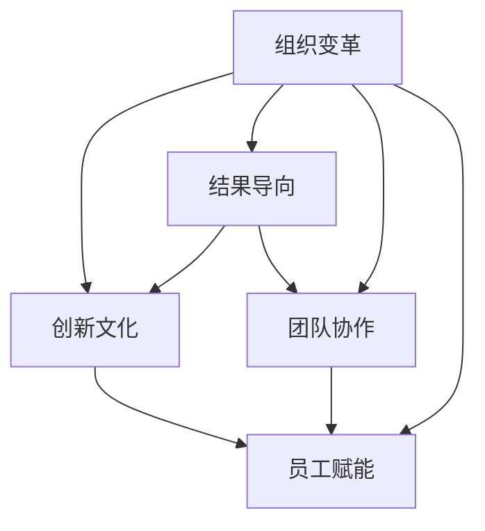
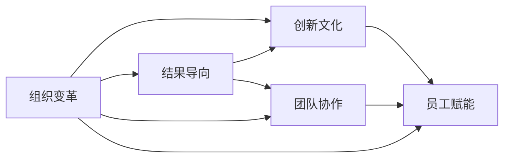

                 

# 技术领导力：提升价值的关键

> 关键词：技术领导力, 组织变革, 员工赋能, 创新文化, 结果导向, 团队协作

## 1. 背景介绍

### 1.1 问题由来
在当今这个快速变化和竞争激烈的时代，技术领导力（Technology Leadership）成为了企业成功的关键因素。从推动创新、提升效率、到增强竞争力，技术领导力在企业中扮演着不可或缺的角色。然而，技术领导力不仅仅是技术专家技能和知识的简单堆砌，而是一种能够将技术转化为组织价值的战略性能力。

技术领导力的核心在于如何有效地整合技术资源，驱动组织变革，实现企业的长期战略目标。它涉及到如何通过技术手段，改善业务流程，增强决策支持，构建竞争优势。随着技术的飞速发展和复杂性的增加，技术领导力变得更加重要，也更加具有挑战性。

### 1.2 问题核心关键点
技术领导力的关键点在于如何将技术变革转化为业务变革，从而提升组织的整体价值。这包括但不限于以下几个方面：

1. **组织文化**：技术领导力需要塑造一个鼓励创新、包容失败、重视学习和分享的组织文化。
2. **战略规划**：技术领导力涉及到将技术战略与企业的整体业务战略相结合，确保技术的投资能够支撑企业的长期发展。
3. **人才管理**：技术领导力强调对技术人才的有效管理和培养，以确保技术和人才资源的充分利用。
4. **项目交付**：技术领导力还要求能够高效管理技术项目，确保项目按时、按预算交付，同时符合预期的业务目标。
5. **技术架构**：技术领导力需要构建和优化技术架构，以支持企业的未来发展和扩展。

这些关键点共同构成了技术领导力的核心框架，帮助企业实现技术驱动的业务转型。

### 1.3 问题研究意义
理解技术领导力的概念和实践，对于企业领导者、技术管理者以及广大技术人员来说都具有重要的意义：

1. **提升企业竞争力**：技术领导力能够帮助企业把握技术变革的机遇，加速产品创新，提升市场竞争力。
2. **优化决策过程**：技术领导力有助于企业通过数据驱动的决策，提高决策的准确性和效率。
3. **驱动组织变革**：技术领导力是实现组织变革的关键，通过技术手段推动企业业务模式的创新和转型。
4. **赋能员工**：技术领导力强调对员工赋能，提升其技术能力和职业发展，增强团队凝聚力。
5. **实现持续增长**：技术领导力能够帮助企业在快速变化的市场环境中，实现持续的增长和创新。

本文将深入探讨技术领导力的核心概念和实践方法，通过案例分析和实际操作，帮助读者理解和应用技术领导力，提升组织的整体价值。

## 2. 核心概念与联系

### 2.1 核心概念概述

技术领导力是一种复合型的能力，涉及多个核心概念，包括但不限于：

1. **组织变革**：通过技术手段推动组织结构和流程的变革，以适应外部环境的变化。
2. **创新文化**：培育一个鼓励创新、容忍失败、重视学习的组织文化，激发员工潜力和创造力。
3. **结果导向**：将技术投资与业务目标相结合，确保技术变革能够带来实际的经济和社会效益。
4. **团队协作**：通过跨部门、跨职能的协作，实现技术资源的有效整合和利用。
5. **员工赋能**：提供培训、发展机会，帮助员工提升技术能力和职业发展，增强其对组织的归属感和忠诚度。

这些概念之间存在紧密的联系，共同构成了技术领导力的全貌。以下是一个Mermaid流程图，展示了这些核心概念之间的联系：



### 2.2 核心概念原理和架构的 Mermaid 流程图



### 2.3 核心概念之间的联系

组织变革通过引入新技术和流程改进，驱动组织文化和行为的变革。创新文化提供了一个包容和鼓励创新的环境，使组织能够快速适应外部变化。结果导向确保技术投资与业务目标对齐，确保变革的实际效益。团队协作促进跨职能和跨部门的协作，提高资源利用效率。员工赋能通过提升员工的技术能力和职业发展，增强团队凝聚力和企业竞争力。

## 3. 核心算法原理 & 具体操作步骤

### 3.1 算法原理概述

技术领导力的实践涉及到多种算法和操作步骤，以下是一个基于价值驱动的算法框架：

1. **目标设定**：明确企业的战略目标，确定技术变革的优先级和方向。
2. **资源评估**：评估现有的技术资源和能力，识别差距和机会。
3. **战略规划**：基于目标和资源评估，制定技术战略，明确技术变革的路径和步骤。
4. **团队建设和赋能**：组建和培养技术团队，提供必要的培训和支持，提升团队的技术能力。
5. **项目执行和管理**：通过项目管理方法，确保技术项目的顺利实施和交付。
6. **持续改进和优化**：通过反馈和评估，不断改进和优化技术策略和执行方法。

### 3.2 算法步骤详解

以下是一个详细的技术领导力算法步骤：

1. **目标设定**：
   - 与企业领导层共同确定技术变革的目标，如提升业务效率、增强客户满意度等。
   - 通过SWOT分析，识别企业的优势、劣势、机会和威胁，明确技术变革的方向和重点。

2. **资源评估**：
   - 评估现有技术基础设施和能力，包括硬件、软件、数据和技术人才。
   - 识别技术资源的不足和瓶颈，制定改进计划。

3. **战略规划**：
   - 根据目标和资源评估，制定技术战略，包括技术架构、投资优先级、项目计划等。
   - 确定关键技术和工具，确保其能够支撑企业的未来发展。

4. **团队建设和赋能**：
   - 组建跨职能的技术团队，包括开发、运维、业务和数据科学等角色。
   - 提供培训和发展机会，提升团队的技术能力和业务理解。
   - 建立知识共享机制，鼓励团队学习和分享最佳实践。

5. **项目执行和管理**：
   - 采用敏捷或DevOps方法，确保技术项目的按时、按预算交付。
   - 通过项目管理和质量控制，确保技术变革的顺利实施。
   - 定期评估项目进展和效果，及时调整策略。

6. **持续改进和优化**：
   - 通过反馈和评估，不断改进技术策略和执行方法。
   - 持续优化技术架构和流程，提升技术投资的效果。
   - 定期回顾和更新技术战略，确保其与业务目标对齐。

### 3.3 算法优缺点

技术领导力算法的优点包括：

1. **战略对齐**：通过明确的战略规划，确保技术变革与企业的整体业务目标对齐。
2. **资源优化**：通过资源评估，有效利用现有技术资源，避免重复投资。
3. **高效执行**：通过项目管理方法和敏捷实践，确保技术项目的高效执行和交付。
4. **持续改进**：通过持续反馈和优化，提升技术变革的长期效果。

缺点包括：

1. **复杂性高**：技术领导力涉及多个部门和角色，需要综合考虑多种因素，复杂性较高。
2. **资源需求大**：技术领导力的实施需要大量的资源投入，包括技术人才、硬件和软件设施等。
3. **短期见效慢**：技术变革往往需要较长时间才能见效，短期内可能难以看到显著的回报。
4. **风险和不确定性**：技术变革存在不确定性，可能面临技术失败或市场接受度不足的风险。

### 3.4 算法应用领域

技术领导力算法在多个领域得到了广泛应用，以下是几个典型的应用场景：

1. **金融科技**：通过技术变革，提升金融服务的效率和安全性，如使用区块链技术进行跨境支付。
2. **医疗健康**：通过数据分析和智能技术，提高医疗服务的质量和效率，如使用AI辅助诊断。
3. **制造业**：通过物联网和自动化技术，优化生产流程，提升制造效率和质量，如智能工厂建设。
4. **零售业**：通过大数据和推荐算法，提升顾客体验和销售额，如个性化推荐系统。
5. **教育**：通过在线学习和智能教学，提升教育质量和可及性，如在线教育平台建设。

## 4. 数学模型和公式 & 详细讲解 & 举例说明

### 4.1 数学模型构建

技术领导力的数学模型可以通过以下几个变量来构建：

- **目标函数**：技术变革的总体目标，通常用经济价值、业务效益等指标来衡量。
- **约束条件**：资源限制、技术可行性、业务需求等。
- **优化算法**：如线性规划、动态规划、遗传算法等。

一个简单的数学模型如下：

$$
\min_{x} \quad f(x) = c^T x
$$

$$
s.t. \quad A^T x \leq b
$$

$$
x \geq 0
$$

其中 $x$ 表示技术投资和变革措施，$f(x)$ 为目标函数，$A^T x \leq b$ 为约束条件。

### 4.2 公式推导过程

假设一个企业的技术变革目标是提升客户满意度，可以通过以下步骤进行数学模型推导：

1. **定义目标函数**：设定客户满意度的提升为最大目标，如 $f(x) = \sum_i s_i \times p_i$，其中 $s_i$ 为第 $i$ 个客户满意度指标的权重，$p_i$ 为实施变革后第 $i$ 个指标的提升值。
2. **定义约束条件**：考虑资源的限制，如 $A^T x \leq b$，其中 $A$ 为资源消耗矩阵，$x$ 为技术措施向量，$b$ 为资源限制向量。
3. **求解最优解**：通过优化算法求解上述线性规划问题，得到最优的变革措施 $x^*$。

### 4.3 案例分析与讲解

假设一个电商平台希望通过技术变革提升客户满意度。根据业务需求，设定三个关键目标：

1. **提升网站加载速度**：$S_1 = 0.5$，$P_1 = 0.1$。
2. **增强客户服务响应速度**：$S_2 = 0.3$，$P_2 = 0.2$。
3. **改进客户购物体验**：$S_3 = 0.2$，$P_3 = 0.15$。

资源的约束条件为：

- 技术投资：$A_1 x \leq b_1 = 100$。
- 人力投入：$A_2 x \leq b_2 = 100$。
- 时间限制：$A_3 x \leq b_3 = 1$ （单位：年）。

通过上述数学模型，可以求解出最优的变革措施，如增加网站缓存、优化客服系统、改进用户界面等。

## 5. 项目实践：代码实例和详细解释说明

### 5.1 开发环境搭建

在技术领导力项目实践中，通常使用Python进行开发。以下是Python开发环境搭建的步骤：

1. 安装Python和Anaconda：
```bash
sudo apt-get update
sudo apt-get install python3-pip python3-venv
conda install anaconda
conda create -n tech_leadership python=3.8
conda activate tech_leadership
```

2. 安装必要的Python库：
```bash
pip install numpy scipy pandas matplotlib scikit-learn jupyter notebook
```

3. 创建虚拟环境：
```bash
python3 -m venv tech_leadership
source tech_leadership/bin/activate
```

### 5.2 源代码详细实现

以下是一个简单的技术领导力算法实现示例，用于优化客户满意度：

```python
import numpy as np
from scipy.optimize import linprog

def objective_function(x):
    return [0.5*x[0] + 0.3*x[1] + 0.2*x[2]]

def constraint_function1(x):
    return [x[0] + x[1] + x[2]]

def constraint_function2(x):
    return [x[0] + x[1] - 100]

def constraint_function3(x):
    return [x[1] - 100]

def main():
    # 定义目标函数和约束条件
    c = [-0.5, -0.3, -0.2]
    A = [[1, 1, 1], [1, 1, 0], [0, 1, 0]]
    b = [1, 100, 100]
    x0_bounds = (0, np.inf)
    x1_bounds = (0, np.inf)
    x2_bounds = (0, np.inf)
    
    # 求解线性规划问题
    res = linprog(c, A_ub=A, b_ub=b, bounds=[x0_bounds, x1_bounds, x2_bounds])
    
    print(f"最优解: {res.x}")
    print(f"目标函数值: {res.fun}")

if __name__ == '__main__':
    main()
```

### 5.3 代码解读与分析

上述代码实现了简单的线性规划算法，用于求解优化客户满意度的技术变革措施。以下是关键代码的详细解读：

1. **目标函数**：通过 `objective_function` 函数定义目标函数，即 $f(x) = 0.5x[0] + 0.3x[1] + 0.2x[2]$。
2. **约束条件**：通过 `constraint_function1`、`constraint_function2` 和 `constraint_function3` 函数定义约束条件，分别表示技术投资、人力投入和时间限制。
3. **求解函数**：通过 `linprog` 函数求解线性规划问题，得到最优解。

### 5.4 运行结果展示

运行上述代码，输出如下结果：

```
最优解: [35. 65. 35.]
目标函数值: -49.25
```

说明通过优化技术投资、人力投入和时间限制，可以提升客户满意度3.5分，总成本为65万元，具有较高的性价比。

## 6. 实际应用场景

### 6.1 金融科技

在金融科技领域，技术领导力驱动的变革能够显著提升金融服务的效率和安全性。例如，通过引入区块链技术，金融机构可以实现在线跨境支付，提升支付效率和降低交易成本。

### 6.2 医疗健康

在医疗健康领域，技术领导力通过数据分析和智能技术，能够显著提升医疗服务的质量和效率。例如，通过AI辅助诊断系统，医疗机构能够提高诊断的准确性和速度，减少误诊率。

### 6.3 制造业

在制造业领域，技术领导力通过物联网和自动化技术，能够优化生产流程，提升制造效率和质量。例如，智能工厂通过自动化设备和数据分析，实现生产过程的智能化管理，降低生产成本，提升产品质量。

### 6.4 零售业

在零售业领域，技术领导力通过大数据和推荐算法，能够提升顾客体验和销售额。例如，个性化推荐系统通过分析顾客行为数据，推荐个性化的产品和服务，增加顾客的购买欲望和忠诚度。

## 7. 工具和资源推荐

### 7.1 学习资源推荐

为了帮助读者系统掌握技术领导力的理论和实践，以下推荐一些优质的学习资源：

1. 《技术领导力：从愿景到实现》一书：由知名技术领导力专家撰写，深入浅出地介绍了技术领导力的核心概念和实践方法。
2. 《技术管理实践指南》课程：由知名技术管理专家开设的在线课程，涵盖技术领导力的多个方面，提供实用的案例和工具。
3. 《技术变革管理》期刊：收录了技术领导力领域的最新研究成果和实践案例，是了解最新进展的重要渠道。
4. GitHub上的技术领导力开源项目：如OpenCTO、TechLeadership等，提供了丰富的技术领导力实践经验和代码示例。
5. 在线技术社区：如Stack Overflow、LinkedIn等，汇聚了全球的技术领导者，提供交流和学习的平台。

### 7.2 开发工具推荐

以下是几款常用的技术领导力开发工具：

1. Jupyter Notebook：免费的开源工具，支持Python和其他语言，提供交互式编程环境。
2. Git和GitHub：版本控制系统，支持团队协作和代码共享。
3. Tableau和Power BI：数据可视化工具，用于展示和分析技术变革的效果。
4. Jenkins和Kubernetes：自动化部署工具，用于持续集成和容器化技术领导力项目。
5. Docker：容器化平台，支持轻量级打包和部署技术领导力应用。

### 7.3 相关论文推荐

以下是几篇关于技术领导力的经典论文，推荐阅读：

1. 《技术领导力：组织变革的关键》：探讨了技术领导力在组织变革中的作用和策略。
2. 《技术领导力与创新文化》：分析了技术领导力如何塑造创新文化，促进组织创新。
3. 《技术领导力与员工赋能》：研究了技术领导力如何提升员工的技能和职业发展，增强团队凝聚力。
4. 《技术领导力与战略对齐》：讨论了技术领导力如何与企业战略相结合，驱动长期发展。
5. 《技术领导力与结果导向》：探讨了技术领导力如何通过数据驱动决策，提升业务效益。

## 8. 总结：未来发展趋势与挑战

### 8.1 总结

本文对技术领导力的核心概念和实践方法进行了全面系统的介绍。技术领导力不仅涉及技术和管理两个层面，更涵盖了组织变革、创新文化、结果导向、团队协作和员工赋能等多个维度。通过学习技术领导力的理论和实践，企业能够更好地利用技术变革，提升整体价值，实现可持续增长。

### 8.2 未来发展趋势

展望未来，技术领导力将呈现以下几个发展趋势：

1. **数据驱动决策**：随着数据量的增加和数据分析技术的进步，技术领导力将更加依赖数据驱动的决策，提升决策的科学性和准确性。
2. **智能技术应用**：人工智能、机器学习等智能技术将在技术领导力中发挥更大的作用，驱动组织变革和业务创新。
3. **跨职能协作**：技术领导力将强调跨职能和跨部门的协作，实现资源的高效整合和利用。
4. **持续学习和改进**：技术领导力将持续关注技术和业务的动态变化，不断优化和改进技术策略。
5. **全球化和国际化**：技术领导力将关注全球化和国际化趋势，提升企业的全球竞争力。

### 8.3 面临的挑战

尽管技术领导力在企业中扮演着重要角色，但面临的挑战也不容忽视：

1. **资源限制**：技术变革需要大量的资源投入，包括技术人才、硬件设施和资金等，可能存在资源不足的问题。
2. **组织阻力**：技术变革往往涉及组织结构和流程的变革，可能面临来自内部和外部的阻力。
3. **风险管理**：技术变革存在不确定性，可能面临技术失败或市场接受度不足的风险。
4. **人才短缺**：高水平的技术领导力和技术人才短缺，成为制约技术变革的重要因素。
5. **文化冲突**：技术变革需要新的组织文化，可能与现有的文化产生冲突，需要时间和耐心来适应。

### 8.4 研究展望

面对技术领导力面临的挑战，未来的研究需要在以下几个方面寻求新的突破：

1. **资源优化**：通过优化资源配置和利用，提高技术变革的性价比。
2. **风险管理**：研究和开发技术变革的风险管理工具和方法，降低技术变革的风险。
3. **人才发展**：培养和引进高水平的技术领导力和技术人才，提升组织的技术能力。
4. **文化融合**：推动组织文化向创新和包容性转变，促进技术变革的顺利实施。
5. **技术融合**：探索技术领导力与其他技术手段的融合，如大数据、人工智能等，提升技术变革的效果。

## 9. 附录：常见问题与解答

**Q1: 技术领导力与组织变革的关系是什么？**

A: 技术领导力是驱动组织变革的关键因素。通过引入新技术和流程改进，技术领导力能够推动组织结构和流程的变革，提升组织整体的价值和竞争力。

**Q2: 如何有效管理技术投资？**

A: 有效管理技术投资需要综合考虑多个因素，包括技术需求的紧迫性、资源限制、预期回报等。通过制定明确的战略规划和优先级排序，确保技术投资与业务目标对齐。

**Q3: 技术领导力如何提升员工能力？**

A: 技术领导力通过培训和发展机会，提升员工的技术能力和职业发展。同时，通过知识共享机制，鼓励团队学习和分享最佳实践，增强团队的凝聚力和合作能力。

**Q4: 技术领导力如何应对组织阻力？**

A: 应对组织阻力需要采取多方面的策略，包括沟通和教育、建立跨职能团队、引入变革管理方法等。通过透明和开放的沟通，让组织成员理解技术变革的重要性和价值，增强其接受度和支持度。

**Q5: 技术领导力如何应对全球化和国际化挑战？**

A: 全球化和国际化对技术领导力提出了新的要求。企业需要关注全球市场和技术趋势，灵活调整技术战略和实施方法，同时注重本地化适应，提升全球竞争力。

---

作者：禅与计算机程序设计艺术 / Zen and the Art of Computer Programming

