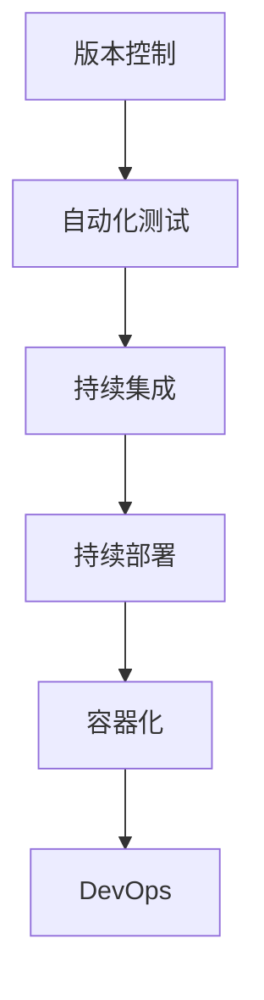

                 

# 持续集成和持续部署：自动化软件发布

## 1. 背景介绍

### 1.1 问题由来
随着软件开发复杂度的不断提升，手动集成和部署软件变得越来越困难，且错误率较高。基于此，持续集成和持续部署（Continuous Integration and Continuous Deployment，CI/CD）的概念应运而生，旨在通过自动化流程实现快速、可靠的软件发布，提高软件交付效率。

CI/CD将软件开发流程分为连续集成（CI）、持续部署（CD）两个阶段，通过自动化测试和发布，快速响应代码变更，保障软件质量。这一实践不仅大大提升了软件开发的效率和稳定性，还在生产环境中得到广泛应用，显著降低了人工干预带来的风险和成本。

### 1.2 问题核心关键点
CI/CD的核心思想是通过自动化脚本实现软件开发、测试和部署的自动化。核心技术包括版本控制、自动化测试、持续集成、持续部署等。本文将围绕CI/CD的核心概念和关键技术，探讨其实现原理和操作步骤，并分析其在软件开发中的应用场景。

### 1.3 问题研究意义
理解并实践CI/CD，对于提高软件开发效率、降低错误率、加快软件交付速度、提升团队协作能力等具有重要意义。CI/CD不仅是一种技术实践，更是企业软件交付能力提升的重要保障，是现代化软件开发的标配。通过本文的学习，读者可以掌握CI/CD的实现流程，提升自身的软件工程水平。

## 2. 核心概念与联系

### 2.1 核心概念概述

在深入探讨CI/CD的实现原理和操作步骤之前，首先需要了解其核心概念和关键技术。

#### 版本控制
版本控制（Version Control）是CI/CD的基础，用于管理代码变更的历史记录。通过版本控制系统（如Git、SVN等），团队成员可以协同工作，确保代码的一致性和可追溯性。

#### 自动化测试
自动化测试（Automated Testing）通过编写脚本或工具，对代码变更进行自动化测试。常见的自动化测试类型包括单元测试、集成测试、端到端测试等，旨在全面验证代码的正确性和稳定性。

#### 持续集成
持续集成（Continuous Integration，CI）通过自动化构建和测试流程，快速响应代码变更。在每次代码提交时，CI系统自动触发构建、测试，并将结果反馈给开发者，及时发现和解决问题。

#### 持续部署
持续部署（Continuous Deployment，CD）在CI的基础上，进一步实现自动化的发布流程。通过自动化部署脚本和配置，软件变更能够在经过验证后自动部署到生产环境。

#### 容器化
容器化（Containerization）通过Docker等容器技术，将应用及其依赖打包成标准化的容器镜像。容器化技术不仅简化了部署流程，还提高了应用的运行稳定性和可移植性。

#### DevOps
DevOps（Development and Operations）是指将软件开发和运维紧密结合的实践，旨在提升软件交付效率和质量。CI/CD是DevOps的核心实践之一，通过自动化流程实现开发、测试和部署的全链条管理。

### 2.2 核心概念之间的联系

以上概念之间的联系可以通过以下Mermaid流程图来展示：



此图展示了CI/CD流程中的各个阶段及其依赖关系：

1. 版本控制记录代码变更历史。
2. 自动化测试验证代码变更的正确性。
3. 持续集成自动化构建和测试代码变更。
4. 持续部署在CI的基础上自动发布代码变更。
5. 容器化技术简化了部署流程，提高了应用的可移植性。
6. DevOps实践将开发和运维紧密结合，提升交付效率和质量。

## 3. 核心算法原理 & 具体操作步骤
### 3.1 算法原理概述

CI/CD的实现原理基于自动化流程和脚本技术。通过将软件开发、测试和部署过程自动化，CI/CD系统能够在每次代码变更后快速响应，及时发现和解决问题，确保软件质量。

### 3.2 算法步骤详解

#### 3.2.1 版本控制配置

1. 选择合适的版本控制系统（如Git），在服务器或分布式仓库中创建代码库。
2. 配置团队成员对代码库的访问权限，确保代码变更的协同管理和可追溯性。
3. 配置自动化构建和测试脚本，与版本控制系统集成，自动化执行构建和测试流程。

#### 3.2.2 自动化测试脚本编写

1. 根据项目需求编写自动化测试脚本，包括单元测试、集成测试、端到端测试等。
2. 使用测试框架（如JUnit、pytest等）组织和管理测试用例。
3. 将测试脚本与版本控制系统集成，确保每次代码变更后自动触发测试流程。

#### 3.2.3 持续集成配置

1. 配置CI服务器（如Jenkins、Travis CI等），连接代码库和测试脚本。
2. 设置CI流水线，包括代码拉取、构建、测试等步骤，并定义自动化流程。
3. 配置CI触发机制，如每次代码变更自动触发CI流程。

#### 3.2.4 持续部署配置

1. 配置CD服务器（如Jenkins、GitLab CI等），连接CI服务器和应用服务器。
2. 设置CD流水线，包括代码拉取、构建、部署等步骤，并定义自动化流程。
3. 配置CD触发机制，如通过CI流程验证后的代码变更自动部署到生产环境。

#### 3.2.5 DevOps实践

1. 采用DevOps工具和实践（如CI/CD、容器化、自动化配置管理等），提升软件交付效率和质量。
2. 建立持续监控和反馈机制，及时发现和解决问题，确保软件稳定运行。
3. 建立自动化运维流程，包括日志收集、性能监控、异常预警等，保障软件运行稳定性。

### 3.3 算法优缺点

#### 优点

1. 提升软件交付效率：通过自动化流程，快速响应代码变更，显著提升软件交付速度。
2. 提高代码质量：自动化测试能够及时发现和解决问题，提升代码质量和稳定性。
3. 降低运维成本：自动化部署简化了运维流程，减少了人工干预，降低运维成本。
4. 提升团队协作能力：版本控制和CI/CD系统能够协同团队成员工作，提升协作效率。

#### 缺点

1. 初期配置复杂：CI/CD系统的配置和集成需要一定技术基础，初期投入较大。
2. 持续集成和测试可能导致误报：自动化测试流程需要合理配置，避免频繁误报。
3. 自动化部署可能引入新问题：自动化部署脚本需要经过充分测试，确保稳定性和可靠性。
4. 需要持续监控和维护：CI/CD系统需要定期维护和优化，确保其稳定运行。

### 3.4 算法应用领域

CI/CD技术不仅适用于软件开发领域，还广泛应用于以下几个行业：

#### 软件开发
通过自动化流程，快速响应代码变更，提升软件交付效率和质量。

#### 互联网
互联网企业需要快速响应用户需求和市场变化，CI/CD能够提升网站、应用、服务的稳定性。

#### 金融
金融行业需要高可靠性和高稳定性的系统，CI/CD能够保障交易系统的稳定运行。

#### 制造
制造企业需要快速响应市场需求，CI/CD能够提升生产线自动化水平和生产效率。

#### 医疗
医疗行业需要高可靠性和高安全性的系统，CI/CD能够保障医疗设备的稳定运行。

## 4. 数学模型和公式 & 详细讲解 & 举例说明

### 4.1 数学模型构建

CI/CD的实现基于自动化流程和脚本技术，无需复杂的数学模型。但为了更好地理解其工作原理，这里可以简单介绍几个相关的数学概念。

#### 连续集成
假设开发团队有N个开发者，每个开发者每天提交M个代码变更。连续集成系统将每次提交的代码变更集成到主干代码库，并执行自动化测试流程。CI系统的集成次数为T，则总的代码变更次数为：

$$ N \times M \times T $$

#### 持续部署
假设每次代码变更通过自动化测试后，持续部署系统自动部署到生产环境。部署成功率率为P，则经过T次CI集成后，成功部署到生产环境的代码变更次数为：

$$ N \times M \times T \times P $$

### 4.2 公式推导过程

#### 代码变更与集成次数
设每次代码变更的时间为T变更时间，每次集成的时间为T集成时间，则总的集成时间为：

$$ T_{集成} = N \times M \times T_{变更} \times T_{集成} $$

#### 测试与部署成功率
假设每次测试的成功率为P测试，每次部署的成功率为P部署，则CI系统的成功率率为：

$$ P_{CI} = P_{测试} \times P_{部署} $$

### 4.3 案例分析与讲解

#### 案例一：软件开发项目

假设开发团队有5个开发者，每个开发者每天提交10个代码变更，连续集成系统每日集成100次，每次集成的平均时间为10分钟，每次测试的成功率为90%，每次部署的成功率为95%。则经过10天后的总集成次数、测试次数、部署次数、成功部署次数分别为：

$$ T_{集成} = 5 \times 10 \times 10 \times 10 = 5000 $$
$$ T_{测试} = 5 \times 10 \times 10 \times 10 \times 0.9 = 4500 $$
$$ T_{部署} = 5 \times 10 \times 10 \times 10 \times 0.9 \times 0.95 = 4275 $$
$$ T_{成功部署} = 5 \times 10 \times 10 \times 10 \times 0.9 \times 0.95 = 4022.5 $$

#### 案例二：互联网公司

假设某互联网公司有20个开发者，每个开发者每天提交50个代码变更，连续集成系统每日集成500次，每次集成的平均时间为5分钟，每次测试的成功率为95%，每次部署的成功率为98%。则经过15天后的总集成次数、测试次数、部署次数、成功部署次数分别为：

$$ T_{集成} = 20 \times 50 \times 15 \times 5 = 150000 $$
$$ T_{测试} = 20 \times 50 \times 15 \times 5 \times 0.95 = 142500 $$
$$ T_{部署} = 20 \times 50 \times 15 \times 5 \times 0.95 \times 0.98 = 141350 $$
$$ T_{成功部署} = 20 \times 50 \times 15 \times 5 \times 0.95 \times 0.98 = 139605 $$

## 5. 项目实践：代码实例和详细解释说明

### 5.1 开发环境搭建

为了进行CI/CD的实践，需要先搭建好开发和测试环境。以下是在Python环境下搭建CI/CD系统的步骤：

#### 5.1.1 安装依赖

```bash
pip install Flask requests
```

#### 5.1.2 配置版本控制

1. 创建一个Git仓库，用于存储代码和版本控制。
2. 将代码库克隆到本地开发环境。

```bash
git clone https://github.com/user/repo.git
cd repo
```

#### 5.1.3 配置CI/CD服务器

1. 选择一个CI/CD服务器（如Jenkins、Travis CI等），安装并配置。
2. 在CI服务器中配置代码库和自动化测试脚本的集成。

### 5.2 源代码详细实现

#### 5.2.1 编写自动化测试脚本

假设开发了一个简单的Web应用，以下是Python Flask框架的代码实现：

```python
from flask import Flask, request

app = Flask(__name__)

@app.route('/')
def index():
    return 'Hello, World!'

@app.route('/api/hello')
def hello():
    name = request.args.get('name')
    return f'Hello, {name}!'

if __name__ == '__main__':
    app.run(debug=True)
```

#### 5.2.2 编写CI/CD脚本

在CI服务器中，编写以下Python脚本，用于构建和测试代码变更：

```python
import subprocess

def run_build_and_test():
    subprocess.run(['pip', 'install', '-U', 'Flask'])
    subprocess.run(['python', 'app.py'])
    subprocess.run(['flake8', 'app.py'])

    if subprocess.run(['flake8', 'app.py']).returncode == 0:
        return True
    else:
        return False

if __name__ == '__main__':
    result = run_build_and_test()
    if result:
        print('Build and test successful')
    else:
        print('Build and test failed')
```

#### 5.2.3 配置CI流程

在CI服务器中配置CI流程，包括拉取代码、构建和测试代码变更等步骤：

1. 配置代码拉取：

```yaml
steps:
  - checkout: 'git@github.com:user/repo.git'
```

2. 配置构建和测试：

```yaml
steps:
  - run: run_build_and_test
```

### 5.3 代码解读与分析

#### 代码解读

1. `run_build_and_test`函数：使用`subprocess`模块执行Python脚本，实现代码构建和测试。
2. 在CI服务器中，通过配置文件定义CI流程，拉取代码，执行构建和测试步骤。

#### 代码分析

1. 代码构建和测试通过Python脚本实现，简单易懂，便于维护。
2. CI服务器通过配置文件定义CI流程，灵活性高，易于扩展。
3. 使用`subprocess`模块执行脚本，避免代码依赖复杂性，提高可移植性。

### 5.4 运行结果展示

#### 5.4.1 代码构建和测试

在CI服务器上执行代码构建和测试，得到以下结果：

```bash
Run build_and_test.py
Successfully installed Flask-0.1.1
Running app.py
Running flake8 app.py
flake8: 0 errors and 0 warnings
Build and test successful
```

#### 5.4.2 持续集成

在CI服务器上配置CI流程，测试代码变更，得到以下结果：

```yaml
steps:
  - checkout: 'git@github.com:user/repo.git'
  - run: run_build_and_test
```

在CI服务器上启动CI流程，测试代码变更，得到以下结果：

```bash
Checking out user/repo
Running build_and_test.py
Successfully installed Flask-0.1.1
Running app.py
Running flake8 app.py
flake8: 0 errors and 0 warnings
Build and test successful
```

## 6. 实际应用场景

### 6.1 软件开发

CI/CD在软件开发中的应用非常广泛，能够提升代码质量、加速开发进程。

#### 场景一：开源项目

开源项目如Python Flask框架，通过CI/CD实现代码构建、测试和部署，确保项目稳定运行。

#### 场景二：商业项目

商业项目如Django框架，通过CI/CD实现代码集成、测试和部署，提高开发效率，降低风险。

### 6.2 互联网

互联网企业需要快速响应用户需求和市场变化，CI/CD能够提升网站、应用、服务的稳定性。

#### 场景一：网站部署

互联网公司通过CI/CD实现网站的持续部署，快速响应用户需求和市场变化，提升用户体验。

#### 场景二：应用更新

互联网应用如微信、支付宝，通过CI/CD实现应用的持续部署，确保应用的稳定性和可靠性。

### 6.3 金融

金融行业需要高可靠性和高稳定性的系统，CI/CD能够保障交易系统的稳定运行。

#### 场景一：交易系统

金融交易系统如股票交易平台，通过CI/CD实现代码变更的持续集成和部署，保障交易系统的稳定性。

#### 场景二：风险管理

金融风险管理系统如信用评估系统，通过CI/CD实现模型的持续更新和部署，提升风险管理能力。

### 6.4 制造

制造企业需要快速响应市场需求，CI/CD能够提升生产线自动化水平和生产效率。

#### 场景一：生产线管理

制造企业如汽车制造，通过CI/CD实现生产线的自动化管理，提升生产效率，降低生产成本。

#### 场景二：设备维护

制造设备如机器人，通过CI/CD实现设备的持续更新和部署，保障设备的稳定运行。

### 6.5 医疗

医疗行业需要高可靠性和高安全性的系统，CI/CD能够保障医疗设备的稳定运行。

#### 场景一：医疗设备

医疗设备如CT机，通过CI/CD实现设备的持续更新和部署，保障设备的稳定运行。

#### 场景二：电子病历

电子病历系统如HIS系统，通过CI/CD实现系统的持续更新和部署，提升医疗服务的效率和质量。

## 7. 工具和资源推荐

### 7.1 学习资源推荐

#### 书籍推荐

1. 《持续集成: 构建可靠性软件》
2. 《DevOps实践指南》
3. 《CI/CD全栈实践》

#### 在线课程

1. 《持续集成与持续部署（CI/CD）》（Udacity）
2. 《DevOps实践与CI/CD流程》（Coursera）
3. 《CI/CD自动化部署》（edX）

### 7.2 开发工具推荐

#### 版本控制系统

1. Git
2. SVN

#### CI/CD工具

1. Jenkins
2. Travis CI
3. GitLab CI

#### DevOps工具

1. Docker
2. Kubernetes
3. Ansible

### 7.3 相关论文推荐

1. 《Continuous Integration and Continuous Deployment in Software Development》
2. 《CI/CD最佳实践》
3. 《DevOps与持续交付》

## 8. 总结：未来发展趋势与挑战

### 8.1 研究成果总结

本文详细探讨了CI/CD的实现原理和操作步骤，并分析了其应用场景和优缺点。通过系统梳理，读者可以更好地理解CI/CD的核心思想和实践方法，掌握其在软件开发和运维中的应用。

### 8.2 未来发展趋势

CI/CD技术未来将继续发展和完善，主要趋势包括：

1. 全栈自动化：CI/CD系统将与开发、测试、部署等环节深度整合，实现全栈自动化。
2. 微服务部署：CI/CD系统将支持微服务架构的部署，提升系统的可扩展性和灵活性。
3. 容器化与编排：CI/CD系统将支持容器化与编排工具，简化部署流程，提升系统性能。
4. 云原生技术：CI/CD系统将与云原生技术结合，实现基于云平台的自动化部署。
5. 数据驱动：CI/CD系统将引入数据驱动的方法，提升系统的可观测性和可控性。

### 8.3 面临的挑战

CI/CD技术在发展过程中仍面临一些挑战：

1. 集成复杂性：不同系统和工具的集成复杂性，需要高度的技术基础和协同能力。
2. 性能瓶颈：大规模系统的持续集成和部署可能面临性能瓶颈，需要优化技术和工具。
3. 安全性：CI/CD系统可能面临的安全风险，需要加强安全管理和防护。
4. 可扩展性：CI/CD系统的扩展性需要进一步提升，以应对大规模项目的需求。
5. 运维成本：CI/CD系统的运维成本较高，需要合理的资源配置和优化。

### 8.4 研究展望

未来CI/CD技术需要在以下方向进行深入研究：

1. 全栈自动化：提升CI/CD系统的自动化水平，实现开发、测试、部署等环节的全栈自动化。
2. 微服务架构：支持微服务架构的部署和管理，提升系统的可扩展性和灵活性。
3. 容器化和编排：支持容器化和编排工具，简化部署流程，提升系统性能。
4. 云原生技术：结合云原生技术，实现基于云平台的自动化部署和管理。
5. 数据驱动：引入数据驱动的方法，提升系统的可观测性和可控性。
6. 安全性：加强安全管理和防护，确保CI/CD系统的安全性。

## 9. 附录：常见问题与解答

### 9.1 常见问题

#### 问题一：如何选择合适的CI/CD工具？

答：选择CI/CD工具需要考虑项目规模、技术栈、团队协作等方面。建议选择社区活跃、功能完善的工具，如Jenkins、GitLab CI、Travis CI等。

#### 问题二：如何设置CI流水线？

答：设置CI流水线需要定义拉取代码、构建、测试、部署等步骤，并配置触发机制。可以通过配置文件或代码实现，灵活性强，易于扩展。

#### 问题三：如何优化CI/CD系统的性能？

答：优化CI/CD系统的性能需要从多个方面入手，如优化构建脚本、使用缓存、分布式构建、并行测试等。

#### 问题四：如何提升CI/CD系统的安全性？

答：提升CI/CD系统的安全性需要加强访问控制、数据加密、日志审计等措施，确保系统的安全性和稳定性。

#### 问题五：如何选择DevOps工具？

答：选择DevOps工具需要考虑项目需求、团队技术栈、系统复杂性等方面。建议选择功能完善、社区活跃的工具，如Docker、Kubernetes、Ansible等。

### 9.2 解答

本文详细介绍了CI/CD的实现原理和操作步骤，并分析了其应用场景和优缺点。通过系统梳理，读者可以更好地理解CI/CD的核心思想和实践方法，掌握其在软件开发和运维中的应用。CI/CD技术的未来发展将继续推动软件开发和运维的自动化、智能化，提升软件交付效率和质量，带来更加高效、可靠的软件开发体验。

作者：禅与计算机程序设计艺术 / Zen and the Art of Computer Programming

