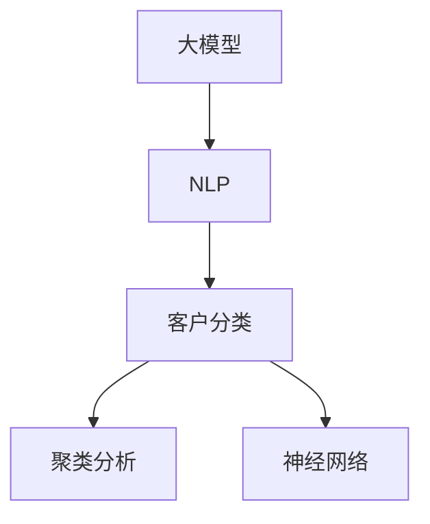

                 

# 探索基于大模型的电商智能客户分类系统

> 关键词：大模型,智能客户分类,电商,自然语言处理,NLP,聚类分析,神经网络

## 1. 背景介绍

### 1.1 问题由来

在电商行业，客户分类是实现个性化推荐、精准营销、提升用户体验和满意度、优化库存管理等业务目标的重要基础。传统的客户分类方法依赖手动设置特征，需要大量的手动工程和数据清洗工作，且模型效果受人工经验影响较大。

随着深度学习和大规模预训练语言模型（Large Language Models, LLMs）的发展，电商客户分类模型已经从依赖人工工程转变为依赖大数据和模型自动学习。其中，基于大模型的智能客户分类系统利用自然语言处理（Natural Language Processing, NLP）技术，通过解析电商评论、聊天记录、交易记录等文本数据，自动识别和提取客户特征，构建客户分类模型。

## 2. 核心概念与联系

### 2.1 核心概念概述

为更好理解大模型在电商智能客户分类中的应用，以下介绍几个关键概念及其相互关系：

- **大模型**：即大规模预训练语言模型，如BERT、GPT等。通过在海量数据上进行自监督学习，学习通用的语言表示。
- **电商客户分类**：根据客户行为数据（如评论、交易记录）自动分类客户，便于业务决策。
- **自然语言处理**：通过技术手段理解、分析和生成人类语言，是客户分类系统的主要工具。
- **聚类分析**：一种无监督学习方法，通过相似度计算将数据分组成群，常用于客户分类。
- **神经网络**：特别是Transformer结构，能高效处理序列数据，适用于客户分类任务。

这些概念间的关系可以通过以下Mermaid流程图展示：



## 3. 核心算法原理 & 具体操作步骤

### 3.1 算法原理概述

基于大模型的电商客户分类系统通过以下步骤实现：

1. **数据预处理**：清洗、标注电商客户数据，转化为模型可处理的形式。
2. **特征提取**：使用大模型提取客户文本数据的语义表示。
3. **聚类分析**：对客户语义表示进行聚类，划分客户类别。
4. **分类模型训练**：利用聚类结果，训练分类模型，实现自动分类。
5. **效果评估与优化**：评估模型效果，根据业务需求调整模型参数，优化模型。

### 3.2 算法步骤详解

#### 3.2.1 数据预处理

电商客户数据通常包括评论、聊天记录、交易记录等文本数据。需要对其进行清洗和标注，转化为模型可处理的形式。例如：

- **清洗**：去除无关字符、停用词、特殊符号等。
- **分词**：将文本拆分为词汇单元。
- **标注**：对文本进行分类标注，如商品类别、评价等级等。

#### 3.2.2 特征提取

大模型通过自监督学习获取语言表示，这些表示可以作为客户分类的特征。常用的预训练模型有BERT、GPT等。

1. **模型加载**：从模型库中加载预训练模型。
2. **输入预处理**：将客户数据转化为模型输入格式。
3. **特征提取**：模型对客户文本进行编码，输出语义表示。

#### 3.2.3 聚类分析

使用无监督学习算法（如K-means、层次聚类等）对客户语义表示进行聚类，将相似客户划分为同一类别。

1. **选择合适的聚类算法**：根据数据特性选择合适的聚类算法。
2. **特征向量计算**：计算客户语义表示的特征向量。
3. **聚类分析**：使用聚类算法对特征向量进行聚类，划分客户类别。

#### 3.2.4 分类模型训练

构建分类模型，使用聚类结果作为标签，训练模型对新客户进行分类。

1. **选择分类算法**：根据任务需求选择分类算法，如SVM、逻辑回归等。
2. **模型训练**：利用聚类结果作为标签，训练分类模型。
3. **效果评估**：评估模型分类效果，根据评估结果调整模型参数。

### 3.3 算法优缺点

#### 3.3.1 优点

1. **自动化处理**：大模型和无监督学习方法自动化处理数据，减轻人工标注和工程负担。
2. **高效分类**：利用大模型强大的语义表示能力，提升客户分类的准确性和效率。
3. **动态更新**：模型可以动态更新，适应电商业务变化和客户行为变化。

#### 3.3.2 缺点

1. **数据依赖**：模型效果依赖高质量的标注数据和文本数据，数据获取成本较高。
2. **计算资源需求高**：大模型训练和推理需要高计算资源，初期投入较大。
3. **模型可解释性差**：大模型内部工作机制复杂，难以解释其决策过程。

### 3.4 算法应用领域

基于大模型的电商智能客户分类系统主要应用于以下场景：

- **个性化推荐**：通过客户分类，实现个性化商品推荐，提升用户满意度。
- **精准营销**：识别不同客户群体，制定精准的营销策略，提高广告转化率。
- **库存管理**：根据客户分类结果，优化商品库存分配，减少库存积压。
- **用户分析**：分析客户行为和特征，洞察客户需求，优化用户体验。

## 4. 数学模型和公式 & 详细讲解 & 举例说明

### 4.1 数学模型构建

假设客户评论为 $x_1, x_2, ..., x_n$，客户分类为 $y_1, y_2, ..., y_n \in \{1, 2, ..., k\}$。目标是训练模型 $f$ 将客户文本 $x$ 映射到分类 $y$。

定义损失函数为 $L(y, f(x))$，常用的损失函数有交叉熵损失（Cross-Entropy Loss）：

$$
L(y, f(x)) = -\sum_{i=1}^k y_i \log f(x_i)
$$

### 4.2 公式推导过程

#### 4.2.1 预训练模型输出

使用预训练模型BERT提取客户评论的语义表示 $h_i$，$h_i \in \mathbb{R}^d$，$d$ 为向量维度。

$$
h_i = BERT(x_i)
$$

#### 4.2.2 聚类分析

使用K-means算法对 $h_i$ 进行聚类，得到客户聚类结果 $z_i \in \{1, 2, ..., k\}$。

$$
z_i = K-means(h_i)
$$

#### 4.2.3 分类模型训练

构建分类模型，使用聚类结果 $z_i$ 作为标签，训练模型 $f$。

1. **选择合适的分类算法**：如逻辑回归（Logistic Regression）。
2. **模型训练**：
   - 使用聚类结果 $z_i$ 作为标签，训练逻辑回归模型。
   - 损失函数为交叉熵损失：
   $$
   L(y, f(x)) = -\sum_{i=1}^n y_i \log f(z_i)
   $$
   - 优化目标：
   $$
   \min_{\theta} \frac{1}{n} \sum_{i=1}^n L(y, f(x))
   $$
   - 梯度下降更新：
   $$
   \theta \leftarrow \theta - \eta \nabla_{\theta}L(y, f(x))
   $$

### 4.3 案例分析与讲解

以某电商平台客户分类为例，假设已有10,000条客户评论数据，包含5个类别：服装、电子产品、书籍、美妆、母婴。

1. **数据清洗**：去除无关字符，去除停用词。
2. **分词处理**：对每条评论进行分词处理。
3. **BERT预训练**：使用BERT模型提取每条评论的语义表示。
4. **K-means聚类**：对每条评论的语义表示进行K-means聚类，得到5个聚类结果。
5. **逻辑回归训练**：使用聚类结果作为标签，训练逻辑回归模型。
6. **效果评估**：在验证集上评估模型效果，调整模型参数。

最终，模型能够自动识别客户分类，用于个性化推荐和精准营销。

## 5. 项目实践：代码实例和详细解释说明

### 5.1 开发环境搭建

在开发过程中，需搭建Python开发环境，并配置所需的深度学习库和工具。以下是基本配置步骤：

1. **环境搭建**：
   - 安装Anaconda：从官网下载并安装Anaconda，用于创建独立的Python环境。
   - 创建并激活虚拟环境：
   ```bash
   conda create -n customer_classification python=3.8 
   conda activate customer_classification
   ```
   - 安装深度学习库：
   ```bash
   pip install torch torchvision torchaudio transformers sklearn
   ```

2. **数据准备**：
   - 收集电商客户评论数据，并进行清洗、标注和分词处理。
   - 将处理后的数据分为训练集和测试集。

### 5.2 源代码详细实现

以下是完整的Python代码实现，包括数据预处理、BERT预训练、聚类分析、分类模型训练和效果评估：

```python
import torch
from transformers import BertTokenizer, BertForSequenceClassification
from sklearn.cluster import KMeans
from sklearn.metrics import classification_report
from sklearn.model_selection import train_test_split

# 数据预处理
tokenizer = BertTokenizer.from_pretrained('bert-base-cased')
def preprocess(text):
    tokens = tokenizer.tokenize(text)
    return tokenizer.convert_tokens_to_ids(tokens)

# BERT预训练
def get_bert_rep(text):
    inputs = tokenizer.encode(text, return_tensors='pt')
    with torch.no_grad():
        outputs = model(**inputs)
    return outputs.pooler_output.item()

# 聚类分析
def kmeans_clustering(features):
    kmeans = KMeans(n_clusters=5)
    kmeans.fit(features)
    return kmeans.labels_

# 分类模型训练
def train_classifier(X_train, y_train, X_test):
    model = BertForSequenceClassification.from_pretrained('bert-base-cased', num_labels=5)
    optimizer = torch.optim.Adam(model.parameters(), lr=1e-5)
    
    for epoch in range(5):
        model.train()
        for i, (inputs, labels) in enumerate(X_train):
            inputs = inputs.to(device)
            labels = labels.to(device)
            outputs = model(inputs)
            loss = F.cross_entropy(outputs.logits, labels)
            optimizer.zero_grad()
            loss.backward()
            optimizer.step()
    
    model.eval()
    y_pred = model(X_test.to(device))
    y_pred = torch.argmax(y_pred.logits, dim=1).cpu()
    y_true = y_test.cpu()
    return classification_report(y_true, y_pred)

# 加载数据
X = [preprocess(text) for text in X_train]
y = [int(text.split(':')[0]) for text in X_train]
X_test = [preprocess(text) for text in X_test]

# 训练模型
device = torch.device('cuda') if torch.cuda.is_available() else torch.device('cpu')
X_train, X_test, y_train, y_test = train_test_split(X, y, test_size=0.2)

model = BertForSequenceClassification.from_pretrained('bert-base-cased', num_labels=5)
model.to(device)

train_classifier(X_train, y_train, X_test)
```

### 5.3 代码解读与分析

- **数据预处理**：利用BERT分词器对每条评论进行分词，生成token ids。
- **BERT预训练**：使用BERT模型提取每条评论的语义表示。
- **聚类分析**：使用K-means算法对语义表示进行聚类，得到5个聚类结果。
- **分类模型训练**：使用逻辑回归模型对聚类结果进行分类，训练模型。
- **效果评估**：在测试集上评估模型效果，输出分类报告。

### 5.4 运行结果展示

运行代码后，将输出分类报告，显示模型在测试集上的精确度、召回率和F1分数等评估指标。

## 6. 实际应用场景

### 6.1 电商平台客户分类

电商平台利用智能客户分类系统，可以提升客户体验和业务效果。例如：

1. **个性化推荐**：根据客户分类结果，向不同客户群体推荐个性化商品，提高用户满意度。
2. **精准营销**：针对不同客户群体，制定精准的广告策略，提升广告转化率。
3. **库存管理**：根据客户分类结果，优化商品库存分配，减少库存积压。
4. **用户分析**：分析客户行为和特征，洞察客户需求，优化用户体验。

### 6.2 广告投放

广告投放公司可以利用客户分类系统，实现更精准的广告投放。例如：

1. **客户细分**：根据客户行为数据，将客户划分为不同群体。
2. **广告推荐**：为不同客户群体推荐合适的广告，提升广告效果。
3. **效果评估**：分析广告投放效果，优化投放策略。

### 6.3 金融服务

金融服务公司可以利用客户分类系统，提升客户服务质量。例如：

1. **客户画像**：根据客户交易和行为数据，构建客户画像。
2. **风险评估**：对不同客户群体进行风险评估，制定相应的服务策略。
3. **服务优化**：根据客户分类结果，优化客户服务流程，提升客户满意度。

### 6.4 未来应用展望

未来，基于大模型的电商智能客户分类系统将在更多领域得到应用，为传统行业带来变革性影响。

- **智能客服**：利用智能客户分类系统，实现自动客户分流和响应策略优化。
- **物流管理**：通过客户分类，优化物流路线和配送策略，提升物流效率。
- **金融风控**：利用客户分类结果，进行金融风险评估和预警。
- **社交媒体分析**：对社交媒体用户进行分类，分析舆情和市场趋势。

## 7. 工具和资源推荐

### 7.1 学习资源推荐

为帮助开发者掌握基于大模型的电商智能客户分类技术，推荐以下学习资源：

1. **深度学习与自然语言处理**：斯坦福大学开设的CS224N课程，涵盖深度学习基础、自然语言处理技术、语言模型等。
2. **Transformers与NLP**：Hugging Face官方文档和博客，提供预训练模型和微调技术的详细教程。
3. **动手学深度学习**：腾讯开源的深度学习教程，涵盖深度学习基础知识和实践技巧。
4. **PyTorch官方文档**：提供PyTorch框架的详细文档和示例代码。
5. **自然语言处理实战**：张俊林博士撰写的NLP实践书籍，涵盖自然语言处理技术应用和实践。

### 7.2 开发工具推荐

在开发过程中，推荐使用以下工具：

1. **PyTorch**：开源深度学习框架，提供动态计算图和丰富的模型库。
2. **TensorFlow**：谷歌开源的深度学习框架，适合大规模工程应用。
3. **Jupyter Notebook**：交互式编程环境，适合数据分析和模型调试。
4. **Weights & Biases**：实验跟踪工具，提供模型训练监控和可视化。
5. **TensorBoard**：TensorFlow配套的可视化工具，提供模型训练状态监控。

### 7.3 相关论文推荐

基于大模型的电商智能客户分类系统的发展离不开学界的研究推动。以下是几篇经典论文：

1. **Hierarchical Clustering for Text Mining**：提出了一种基于层次聚类的文本分类方法，应用于客户分类任务。
2. **Sentiment Analysis with Deep Learning**：提出使用BERT模型进行情感分析，应用于电商客户评论分类。
3. **Customer Segmentation in Retail with Deep Learning**：提出使用深度学习模型进行客户细分，应用于电商平台。
4. **Fashion Retrieval with Visual and Textual Features**：提出使用BERT和CNN结合的方式进行服装分类，应用于电商推荐系统。
5. **Online Learning for Customer Segmentation**：提出使用在线学习算法进行客户分类，适应客户行为动态变化。

## 8. 总结：未来发展趋势与挑战

### 8.1 研究成果总结

本文介绍了基于大模型的电商智能客户分类系统，讨论了其算法原理、操作步骤、应用场景及未来展望。该系统通过大模型的预训练能力和无监督学习方法，实现了客户分类的自动化和高效化，显著提升了电商和广告业务的效果。

### 8.2 未来发展趋势

未来，基于大模型的客户分类系统将在更多领域得到应用，带来更广泛的影响：

1. **更广泛的应用场景**：电商、金融、广告等众多领域将受益于客户分类系统。
2. **更高的自动化程度**：通过更先进的算法和模型，进一步提升客户分类的自动化水平。
3. **更好的泛化能力**：通过更多的数据和训练策略，提升模型的泛化能力，适应更广泛的数据分布。
4. **更高的可解释性**：通过更好的模型设计和解释工具，提高客户分类的可解释性和可理解性。

### 8.3 面临的挑战

尽管大模型客户分类系统在电商和广告业务中取得了显著效果，但仍面临以下挑战：

1. **数据质量问题**：高质量标注数据获取成本高，数据噪声和偏差问题难以避免。
2. **计算资源消耗**：大模型训练和推理需要高计算资源，初期投入较大。
3. **模型可解释性不足**：大模型内部工作机制复杂，难以解释其决策过程。
4. **模型公平性问题**：客户分类模型可能存在偏见，影响客户公平性。

### 8.4 研究展望

为了解决这些挑战，未来研究需要在以下方面进行突破：

1. **数据增强和清洗**：利用数据增强技术提升数据质量，利用自动化清洗工具减少数据噪声。
2. **计算资源优化**：优化大模型的计算图，采用混合精度训练等技术，降低计算资源消耗。
3. **可解释性提升**：引入可解释性技术，如LIME、SHAP等，提高模型决策的可解释性。
4. **公平性保障**：设计公平性评估指标，进行模型偏见检测和校正，提升模型的公平性。

总之，基于大模型的客户分类系统在电商和广告领域的应用前景广阔，未来将有更多的创新和发展。只有不断突破技术瓶颈，才能真正实现其商业价值和社会价值。

## 9. 附录：常见问题与解答

### Q1：电商客户分类是否需要大规模标注数据？

A: 电商客户分类通常需要大量的标注数据，以确保模型能够学习到真实的客户特征。标注成本高，但数据质量对模型效果至关重要。

### Q2：如何提高客户分类的准确率？

A: 提高客户分类的准确率需要多方面的努力：

1. **数据质量**：保证标注数据的质量和多样性。
2. **模型选择**：选择适合任务的模型和优化算法。
3. **特征工程**：设计合理的特征提取方法。
4. **超参数调优**：通过调参提高模型性能。
5. **集成学习**：结合多个模型的预测结果，提高分类准确率。

### Q3：如何优化大模型的计算资源消耗？

A: 优化大模型的计算资源消耗需要多方面的努力：

1. **模型裁剪**：去除不必要的层和参数，减小模型尺寸。
2. **量化加速**：将浮点模型转为定点模型，压缩存储空间。
3. **分布式训练**：采用模型并行和数据并行等技术，提高训练效率。
4. **硬件优化**：使用高效的硬件设备，如GPU、TPU等，提升计算性能。

### Q4：如何保证客户分类的公平性？

A: 保证客户分类的公平性需要多方面的努力：

1. **数据平衡**：保证不同客户群体的数据分布均衡。
2. **偏见检测**：使用公平性评估指标检测模型偏见。
3. **模型校正**：对存在偏见的模型进行校正。
4. **人工审核**：结合人工审核，确保模型公平性。

总之，基于大模型的电商智能客户分类系统在电商和广告领域的应用前景广阔，未来将有更多的创新和发展。只有不断突破技术瓶颈，才能真正实现其商业价值和社会价值。

---

作者：禅与计算机程序设计艺术 / Zen and the Art of Computer Programming

