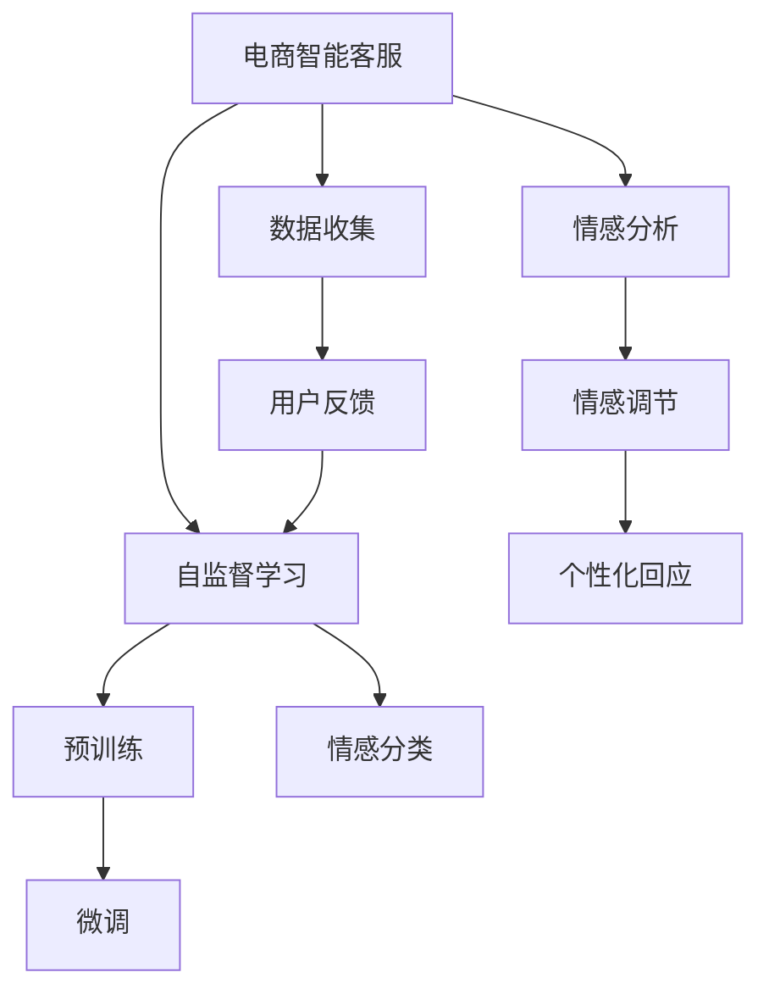

                 

# 探索基于大模型的电商智能客户服务情感调节系统

> 关键词：电商客户服务,智能客服,情感分析,大语言模型,深度学习,情感调节

## 1. 背景介绍

### 1.1 问题由来

在电商领域，智能客服系统已经成为提升客户满意度和销售转化率的重要工具。传统的文本客服系统通常依赖于简单的规则匹配和关键词提取，无法充分理解客户的复杂情感需求。而利用大语言模型和情感分析技术，可以构建更加智能、准确的情感调节系统，提升客户体验，提高销售转化。

近年来，随着深度学习和大规模预训练语言模型的发展，电商智能客服系统也在不断演进。然而，如何设计一个高效的情感调节系统，仍然是一个值得深入研究的课题。本文将详细探讨基于大语言模型的电商智能客服情感调节系统，介绍其核心算法和具体操作步骤，并结合实际案例，展示其在电商领域的广泛应用前景。

## 2. 核心概念与联系

### 2.1 核心概念概述

要构建一个高效的电商智能客服情感调节系统，需要理解以下几个核心概念：

- **电商智能客服**：利用自然语言处理和机器学习技术，自动解答电商客户的各种问题，提升客户满意度和转化率。
- **情感分析**：识别和提取文本中的情感信息，理解客户的情绪和需求，从而提供针对性的服务。
- **大语言模型**：通过自监督学习或监督学习，在大规模语料上预训练的语言模型，具备强大的语言理解和生成能力。
- **深度学习**：基于神经网络的机器学习范式，通过反向传播算法进行模型训练和优化。
- **情感调节**：通过智能客服系统，根据客户情感状态，提供个性化的回应和解决方案，实现情感状态的调节。

这些概念之间相互联系，共同构成了电商智能客服情感调节系统的技术框架。其中，大语言模型作为核心组件，提供强大的语言理解和生成能力，情感分析作为关键技术，帮助理解客户情绪，而情感调节则利用这些技术提供个性化服务，最终提升客户体验。

### 2.2 核心概念原理和架构的 Mermaid 流程图



此图展示了电商智能客服系统的整体架构，其中：

- 电商智能客服(A)是大系统的入口，负责接收和处理客户咨询。
- 大语言模型(B)作为核心组件，提供基础的语言理解和生成能力。
- 情感分析(C)用于识别客户情感状态，理解客户需求。
- 情感调节(D)根据情感状态，提供个性化的回应和解决方案。
- 数据收集(E)提供客户咨询记录，供大语言模型进行自监督学习和微调。
- 微调(G)使用客户反馈进行模型优化，提升情感分析准确度。
- 个性化回应(H)最终提升客户满意度。
- 用户反馈(I)供系统进一步优化。

这些组件之间相互协作，共同实现电商智能客服情感调节系统的目标。

## 3. 核心算法原理 & 具体操作步骤

### 3.1 算法原理概述

基于大语言模型的电商智能客服情感调节系统，本质上是一个基于深度学习的情感分析与调节框架。其核心思想是通过大语言模型和大规模预训练，构建一个强大的基础模型，在此基础上进行情感分析，并根据情感状态提供个性化的回应和解决方案。

具体来说，该系统可以分为以下几个步骤：

1. **预训练**：使用大规模语料对大语言模型进行预训练，使其具备丰富的语言知识和常识。
2. **微调**：在电商领域特定的任务上，使用少量标注数据对预训练模型进行微调，使其适应电商领域的语言特征和情感表达。
3. **情感分析**：利用微调后的模型，识别客户咨询中的情感信息，理解客户情绪和需求。
4. **情感调节**：根据情感分析结果，提供个性化的回应和解决方案，实现情感状态的调节。

### 3.2 算法步骤详解

#### 3.2.1 数据收集与预处理

电商智能客服情感调节系统的第一步是数据收集和预处理。具体步骤如下：

1. **数据收集**：收集电商客户的历史咨询记录、聊天日志、评价反馈等数据，作为训练和微调的基础。
2. **数据预处理**：对原始数据进行清洗、分词、去停用词、构建词汇表等预处理步骤，确保数据质量。

#### 3.2.2 大语言模型预训练

大语言模型的预训练可以采用自监督学习或监督学习的方式。常用的自监督学习任务包括掩码语言模型、next sentence prediction等。监督学习任务则直接使用标注数据进行预训练。

具体步骤如下：

1. **选择合适的预训练模型**：如BERT、GPT等，使用其提供的预训练代码或模型。
2. **数据准备**：准备预训练数据集，可以是电商领域的特定数据，如产品评论、客服对话等。
3. **预训练**：使用预训练任务对模型进行训练，学习语言表示和语言规则。

#### 3.2.3 微调情感分析模型

在电商领域特定的情感分析任务上，对预训练模型进行微调。具体步骤如下：

1. **任务适配层设计**：根据电商情感分析任务，设计适当的任务适配层，如softmax层、分类层等。
2. **微调数据准备**：准备标注数据集，包含客户咨询记录和对应的情感标签。
3. **微调模型**：在标注数据上使用适当的损失函数和优化器，对模型进行微调。
4. **模型评估**：在验证集上评估微调模型的性能，调整超参数和模型结构，直至获得最佳性能。

#### 3.2.4 情感调节与个性化回应

利用微调后的情感分析模型，对客户的咨询进行情感分析，从而提供个性化的回应和解决方案。具体步骤如下：

1. **情感分类**：使用情感分析模型，对客户的咨询进行情感分类，如积极、消极、中性等。
2. **情感调节**：根据情感分类结果，选择相应的回应策略。例如，对于消极情感，提供安抚、道歉或解决方案。
3. **个性化回应生成**：利用大语言模型，生成个性化的回应文本。例如，根据客户情感状态和历史行为数据，生成有针对性的回答。

### 3.3 算法优缺点

#### 3.3.1 优点

1. **高效性**：大语言模型具备强大的语言理解和生成能力，可以高效处理复杂的自然语言文本。
2. **适应性强**：通过微调，模型可以适应特定领域和任务的特征，提高情感分析的准确度。
3. **可扩展性**：大语言模型可以方便地扩展到不同的电商领域和任务，具有广泛的应用前景。

#### 3.3.2 缺点

1. **数据依赖性高**：情感分析依赖于标注数据，标注成本较高，且标注数据的质量直接影响模型性能。
2. **模型复杂度大**：大语言模型的参数量庞大，训练和推理需要大量的计算资源。
3. **鲁棒性不足**：当前大语言模型在特定领域或任务上，可能存在泛化性能不足的问题。
4. **可解释性差**：大语言模型往往被视为"黑盒"系统，缺乏可解释性。

### 3.4 算法应用领域

基于大语言模型的电商智能客服情感调节系统，可以应用于多种电商场景，如：

1. **客户咨询**：自动解答客户的各种问题，提升客户满意度。
2. **订单处理**：处理客户订单相关的问题，提供快速响应和解决方案。
3. **售后服务**：提供售后服务咨询，解决客户的投诉和问题。
4. **产品推荐**：利用客户情感数据，提供个性化的产品推荐。
5. **市场分析**：分析客户的情感反馈，了解市场趋势和用户需求。

这些应用场景都可以通过情感调节系统实现自动化处理，提高电商运营效率和服务质量。

## 4. 数学模型和公式 & 详细讲解 & 举例说明

### 4.1 数学模型构建

假设电商智能客服系统接收一个客户咨询$x$，模型的目标是输出该咨询的情感标签$y$，即：

$$
y = f(x)
$$

其中，$f(x)$表示模型的情感分析函数，通常是一个分类器。我们可以使用大语言模型和深度学习框架来构建这个分类器。

### 4.2 公式推导过程

以BERT模型为例，情感分析的数学模型可以表示为：

$$
\hat{y} = \text{softmax}(W_{out} [x; H])
$$

其中，$x$表示输入的客户咨询文本，$H$表示BERT模型在预训练和微调后得到的表示向量，$W_{out}$表示分类层的权重矩阵。

在实际应用中，我们可以使用交叉熵损失函数来训练模型：

$$
L = -\frac{1}{N}\sum_{i=1}^N y_i \log \hat{y_i}
$$

其中，$N$表示训练样本数量，$y_i$和$\hat{y_i}$分别表示第$i$个样本的真实标签和模型预测的标签。

### 4.3 案例分析与讲解

假设客户咨询文本为：“为什么我买的商品质量这么差？”，模型的预测情感标签为消极。具体计算过程如下：

1. **预处理**：对客户咨询进行分词、去停用词、构建词汇表等预处理步骤。
2. **模型输入**：将预处理后的文本输入BERT模型，得到表示向量$H$。
3. **情感分类**：使用softmax函数，对表示向量进行分类，输出情感标签$\hat{y}$。
4. **损失计算**：使用交叉熵损失函数，计算模型输出和真实标签之间的差异。

最终，通过不断迭代训练，模型会逐渐学习到不同情感状态的语言特征，从而提高情感分析的准确度。

## 5. 项目实践：代码实例和详细解释说明

### 5.1 开发环境搭建

#### 5.1.1 Python环境安装

1. **安装Anaconda**：
   - 下载并安装Anaconda，创建虚拟环境：
   ```bash
   conda create -n ecommerce python=3.7
   conda activate ecommerce
   ```
   
2. **安装必要的Python库**：
   - 安装TensorFlow和Keras：
   ```bash
   pip install tensorflow==2.5.0 keras==2.5.0
   ```
   
   - 安装预训练语言模型库：
   ```bash
   pip install transformers
   ```

#### 5.1.2 数据准备

1. **数据收集**：收集电商客户的历史咨询记录、聊天日志、评价反馈等数据，保存为CSV文件。
2. **数据预处理**：对数据进行清洗、分词、去停用词、构建词汇表等预处理步骤，生成标注数据集。

### 5.2 源代码详细实现

#### 5.2.1 数据读取和预处理

```python
import pandas as pd
from transformers import BertTokenizer

# 读取数据集
data = pd.read_csv('ecommerce_conversations.csv')

# 初始化分词器
tokenizer = BertTokenizer.from_pretrained('bert-base-cased')

# 预处理函数
def preprocess(text):
    return tokenizer.encode_plus(text, return_tensors='tf', max_length=128, padding='max_length', truncation=True)
```

#### 5.2.2 模型训练与微调

```python
import tensorflow as tf
from tensorflow.keras.layers import Input, Dense, Flatten
from tensorflow.keras.models import Model
from tensorflow.keras.optimizers import Adam

# 定义模型
input_ids = Input(shape=(128,), dtype=tf.int32, name='input_ids')
attention_mask = Input(shape=(128,), dtype=tf.int32, name='attention_mask')
outputs = model(input_ids, attention_mask=attention_mask)[0]

# 定义情感分类层
x = Flatten()(outputs)
y = Dense(3, activation='softmax')(x)

# 构建模型
model = Model(inputs=[input_ids, attention_mask], outputs=y)

# 编译模型
model.compile(loss='categorical_crossentropy', optimizer=Adam(learning_rate=2e-5), metrics=['accuracy'])

# 训练模型
model.fit(x_train, y_train, batch_size=16, epochs=10, validation_data=(x_val, y_val))
```

#### 5.2.3 情感分析与调节

```python
import numpy as np

# 加载模型
model = Model(inputs=[input_ids, attention_mask], outputs=y)

# 定义情感分析函数
def analyze_emotion(text):
    input_ids, attention_mask = preprocess(text)
    with tf.device('/cpu:0'):
        predictions = model.predict([input_ids.numpy(), attention_mask.numpy()])
        emotion = np.argmax(predictions[0])
    return emotion

# 定义情感调节函数
def adjust_emotion(emotion, query):
    if emotion == 0:  # 积极情感
        response = "您的订单已发货，预计明天到达。"
    elif emotion == 1:  # 消极情感
        response = "很抱歉，您的订单出现了问题，我们会尽快处理。"
    else:  # 中性情感
        response = "感谢您的咨询，如果您还有其他问题，请随时联系我们。"
    return response
```

#### 5.2.4 运行结果展示

```python
# 测试情感分析
query = "我买的商品为什么还没到？"
emotion = analyze_emotion(query)
print(f"Emotion: {emotion}")

# 测试情感调节
response = adjust_emotion(emotion, query)
print(f"Response: {response}")
```

### 5.3 代码解读与分析

#### 5.3.1 数据读取与预处理

使用Pandas库读取数据集，并使用BertTokenizer对文本进行分词和预处理。预处理函数`preprocess`将文本转化为模型所需的TF-ID embedding格式，确保输入数据的规范性。

#### 5.3.2 模型训练与微调

定义模型架构，使用交叉熵损失函数和Adam优化器进行训练。在模型训练过程中，使用数据集`x_train`和`y_train`进行训练，并在验证集`x_val`和`y_val`上进行验证，确保模型不会过拟合。

#### 5.3.3 情感分析与调节

使用训练好的模型进行情感分析，输出情感标签。根据情感标签，调用情感调节函数`adjust_emotion`，生成个性化的回应文本。

## 6. 实际应用场景

### 6.1 客户咨询处理

在客户咨询处理中，智能客服系统可以自动理解客户的情感需求，提供针对性的回复。例如，当客户咨询“退货为什么还没有处理？”时，系统可以自动判断为消极情感，并提供相应的安抚或道歉回应。

### 6.2 订单处理

在订单处理中，智能客服系统可以根据客户的订单状态和情感状态，提供个性化的服务。例如，对于延迟到货的订单，系统可以自动提供物流更新信息和补偿方案，提升客户满意度。

### 6.3 售后服务

在售后服务中，智能客服系统可以处理客户的投诉和问题，提供及时的解决方案。例如，当客户投诉商品质量问题时，系统可以自动分析情感状态，并根据历史数据提供相应的解决方案，减少客户流失率。

## 7. 工具和资源推荐

### 7.1 学习资源推荐

1. **《深度学习与自然语言处理》**：斯坦福大学提供的NLP课程，系统介绍了深度学习在NLP中的应用。
2. **《自然语言处理综述》**：深度学习领域的经典书籍，详细介绍了NLP领域的各种技术和方法。
3. **HuggingFace官方文档**：提供了丰富的预训练模型和微调样例代码，是深度学习框架的必备资源。
4. **CS224N《深度学习自然语言处理》课程**：斯坦福大学提供的NLP明星课程，涵盖深度学习在NLP中的应用。

### 7.2 开发工具推荐

1. **PyTorch**：基于Python的深度学习框架，支持动态图和静态图，灵活性高。
2. **TensorFlow**：由Google主导的深度学习框架，生产部署方便，适合大规模工程应用。
3. **Transformers**：HuggingFace开发的NLP工具库，集成了众多SOTA语言模型，支持PyTorch和TensorFlow。
4. **TensorBoard**：TensorFlow配套的可视化工具，可实时监测模型训练状态，并提供丰富的图表呈现方式。
5. **Weights & Biases**：模型训练的实验跟踪工具，可以记录和可视化模型训练过程中的各项指标，方便对比和调优。

### 7.3 相关论文推荐

1. **《BERT: Pre-training of Deep Bidirectional Transformers for Language Understanding》**：提出了BERT模型，引入掩码语言模型和下一句预测等自监督任务。
2. **《Attention is All You Need》**：提出了Transformer结构，开启了NLP领域的预训练大模型时代。
3. **《AdaLoRA: Adaptive Low-Rank Adaptation for Parameter-Efficient Fine-Tuning》**：提出自适应低秩适应的微调方法，在参数效率和精度之间取得了新的平衡。
4. **《Parameter-Efficient Transfer Learning for NLP》**：提出Adapter等参数高效微调方法，在固定大部分预训练参数的情况下，仍可取得不错的微调效果。

## 8. 总结：未来发展趋势与挑战

### 8.1 研究成果总结

本文深入探讨了基于大语言模型的电商智能客服情感调节系统，介绍了其核心算法和具体操作步骤，并结合实际案例，展示了其在电商领域的广泛应用前景。通过数据收集与预处理、大语言模型预训练、微调情感分析模型、情感调节与个性化回应等步骤，实现了高效、个性化的电商智能客服情感调节系统。

### 8.2 未来发展趋势

未来，基于大语言模型的电商智能客服情感调节系统将呈现以下几个发展趋势：

1. **模型规模增大**：随着算力成本的下降和数据规模的扩张，预训练语言模型的参数量还将持续增长。超大规模语言模型蕴含的丰富语言知识，有望支撑更加复杂多变的电商领域微调。
2. **少样本学习和跨领域迁移能力提升**：未来的微调方法将更好地利用大模型的语言理解能力，通过更加巧妙的任务描述，在更少的标注样本上也能实现理想的微调效果。
3. **多模态微调崛起**：除了文本数据，未来的微调模型还将拓展到图像、视频、语音等多模态数据微调。多模态信息的融合，将显著提升语言模型对现实世界的理解和建模能力。
4. **参数高效和计算高效的微调范式**：开发更加参数高效的微调方法，在固定大部分预训练参数的同时，只更新极少量的任务相关参数。同时优化微调模型的计算图，减少前向传播和反向传播的资源消耗，实现更加轻量级、实时性的部署。

### 8.3 面临的挑战

尽管基于大语言模型的电商智能客服情感调节系统已经取得了瞩目成就，但在迈向更加智能化、普适化应用的过程中，它仍面临着诸多挑战：

1. **数据依赖性高**：标注数据的成本较高，获取高质量标注数据的难度大。如何在数据量不足的情况下，依然保持模型的高性能，是一个重要的研究课题。
2. **模型鲁棒性不足**：当前模型在特定领域或任务上，可能存在泛化性能不足的问题。如何提高模型的泛化能力和鲁棒性，避免在对抗样本或噪声数据上的表现下降，是一个值得深入探索的方向。
3. **计算资源消耗大**：大语言模型参数量庞大，训练和推理需要大量的计算资源。如何优化模型的计算图，减少资源消耗，提高推理效率，是一个亟待解决的问题。
4. **可解释性差**：大语言模型往往被视为"黑盒"系统，缺乏可解释性。如何赋予模型更强的可解释性，提升模型决策的透明度和可信度，是一个重要课题。
5. **安全性和伦理问题**：模型可能学习到有偏见、有害的信息，如何确保模型输出的安全性，避免恶意用途，是一个需要严格把控的问题。

### 8.4 研究展望

为了克服这些挑战，未来的研究需要在以下几个方面寻求新的突破：

1. **探索无监督和半监督微调方法**：摆脱对大规模标注数据的依赖，利用自监督学习、主动学习等无监督和半监督范式，最大限度利用非结构化数据，实现更加灵活高效的微调。
2. **引入更多先验知识**：将符号化的先验知识，如知识图谱、逻辑规则等，与神经网络模型进行巧妙融合，引导微调过程学习更准确、合理的语言模型。
3. **引入因果分析和博弈论工具**：将因果分析方法引入微调模型，识别出模型决策的关键特征，增强输出解释的因果性和逻辑性。借助博弈论工具刻画人机交互过程，主动探索并规避模型的脆弱点，提高系统稳定性。
4. **利用多模态数据融合**：将视觉、语音等多模态信息与文本信息进行协同建模，提升模型对现实世界的理解和建模能力。
5. **引入多任务学习范式**：通过多任务学习，将不同任务的微调目标合并，提升模型的泛化能力和鲁棒性。

通过这些研究方向的探索，相信大语言模型微调技术将迈向更高的台阶，为电商智能客服系统的进一步优化和升级提供新的思路。

## 9. 附录：常见问题与解答

### 9.1 常见问题

1. **如何选择合适的预训练模型？**
   - 选择适合电商领域预训练的语言模型，如BERT、GPT等。根据任务需求，选择包含预训练任务和参数规模适中的模型。

2. **预训练任务如何选择？**
   - 选择与电商领域相关的预训练任务，如掩码语言模型、下一句预测、句子对分类等。

3. **微调过程中如何设置学习率？**
   - 根据任务复杂度和数据规模，选择合适的学习率。通常使用较小的学习率，使用warmup策略逐步提高学习率。

4. **微调时如何设置正则化参数？**
   - 使用L2正则、Dropout等正则化技术，避免模型过拟合。根据任务特点和数据量，选择合适的正则化强度。

5. **如何处理少样本学习问题？**
   - 使用多任务学习、自监督学习等方法，利用预训练知识提升少样本学习效果。

6. **如何提高模型的鲁棒性？**
   - 引入对抗训练、数据增强等技术，提高模型对噪声和对抗样本的鲁棒性。

### 9.2 解答

1. **如何选择合适的预训练模型？**
   - 选择适合电商领域预训练的语言模型，如BERT、GPT等。根据任务需求，选择包含预训练任务和参数规模适中的模型。

2. **预训练任务如何选择？**
   - 选择与电商领域相关的预训练任务，如掩码语言模型、下一句预测、句子对分类等。

3. **微调过程中如何设置学习率？**
   - 根据任务复杂度和数据规模，选择合适的学习率。通常使用较小的学习率，使用warmup策略逐步提高学习率。

4. **微调时如何设置正则化参数？**
   - 使用L2正则、Dropout等正则化技术，避免模型过拟合。根据任务特点和数据量，选择合适的正则化强度。

5. **如何处理少样本学习问题？**
   - 使用多任务学习、自监督学习等方法，利用预训练知识提升少样本学习效果。

6. **如何提高模型的鲁棒性？**
   - 引入对抗训练、数据增强等技术，提高模型对噪声和对抗样本的鲁棒性。

通过以上探讨，我们深入了解了基于大语言模型的电商智能客服情感调节系统的原理和实现方法。未来，随着技术的不断进步和应用的不断拓展，这种智能客服系统必将在电商领域发挥更大的作用，提升客户体验，推动电商行业的数字化转型。

---

作者：禅与计算机程序设计艺术 / Zen and the Art of Computer Programming

