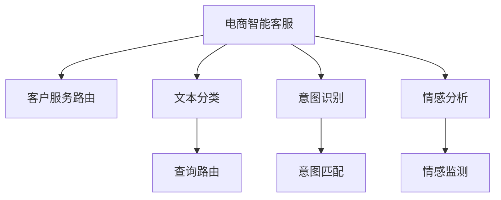

                 

# 探索基于大模型的电商智能客户服务路由系统

> 关键词：电商智能客服, 大语言模型, 客户服务路由, 自然语言处理(NLP), 机器学习

## 1. 背景介绍

### 1.1 问题由来
随着电商行业竞争日益激烈，消费者期望值不断提升，对客户服务的响应速度和质量提出了更高要求。传统客服中心面临客服人员不足、服务标准化程度低、响应时间不均匀等问题。因此，如何通过智能技术提升客户服务体验，成为电商企业转型升级的关键。

近年来，大语言模型在NLP领域取得了突破性进展，其强大的自然语言理解和生成能力，为电商智能客服的构建提供了新思路。将大语言模型应用于客服系统，能够实时响应用户查询，提供准确、自然的回答，提升客户满意度。

### 1.2 问题核心关键点
本节将介绍如何将大语言模型应用于电商智能客服系统，通过文本分类、意图识别、情感分析等技术，实现客户服务路由，并进一步优化客服质量。

核心问题包括：
1. 如何通过文本分类技术，将用户查询自动归类到不同意图类别，进行相应的服务路由。
2. 如何通过意图识别技术，从客户服务文本中提取关键信息，以便更好地理解和回答。
3. 如何通过情感分析技术，实时监控客户情绪，及时调整服务策略。

### 1.3 问题研究意义
探索基于大模型的电商智能客服路由系统，具有以下重要意义：

1. 提高客户满意度。通过智能客服系统，能够24小时不间断地回答用户问题，缩短用户等待时间，提高响应速度。
2. 提升客服效率。智能客服系统能够处理海量用户咨询，显著减少人工客服的工作量，提升企业运营效率。
3. 优化客户体验。通过个性化的客户服务，使购物体验更加流畅、便捷，增强客户忠诚度。
4. 降低运营成本。智能客服系统的引入，可以减少对人工客服的依赖，降低人工成本。
5. 支持业务创新。智能客服系统的搭建，为企业提供了新的业务创新机会，如智能推荐、智能导购等。

## 2. 核心概念与联系

### 2.1 核心概念概述

为更好地理解基于大模型的电商智能客服系统，本节将介绍几个核心概念：

- 电商智能客服(e-Commerce Intelligent Customer Service)：通过NLP和大数据技术，自动化处理客户咨询，提升客户服务体验的系统。
- 大语言模型(Large Language Model)：如GPT、BERT等，通过大规模无标签数据预训练，学习到丰富的语言知识和常识，具备强大的自然语言理解和生成能力。
- 客户服务路由(Customer Service Routing)：根据客户查询内容，自动匹配相应的服务流程，引导用户进入合适的服务页面或转接人工客服的过程。
- 文本分类(Text Classification)：将文本数据分为不同的预定义类别，如查询、投诉、建议等。
- 意图识别(Intent Recognition)：从用户查询中提取出意图信息，如查询产品信息、退货退款等。
- 情感分析(Sentiment Analysis)：识别文本中的情感倾向，如积极、消极、中性等。
- 自然语言处理(NLP)：涉及文本分类、意图识别、情感分析等技术，使计算机能够理解、处理和生成人类语言。
- 机器学习(Machine Learning)：使用训练数据集训练模型，使其能够自动学习和适应新数据。

这些概念之间的逻辑关系可以通过以下Mermaid流程图来展示：



这个流程图展示了大模型在电商智能客服系统中的核心概念及其之间的关系：

1. 电商智能客服通过文本分类、意图识别、情感分析等技术，处理用户查询，并自动路由至合适的服务页面或转接人工客服。
2. 大语言模型在文本分类、意图识别、情感分析等任务中，提供强大的自然语言理解能力。
3. 通过大模型的推理生成功能，实现智能客服系统的实时响应和对话。

## 3. 核心算法原理 & 具体操作步骤

### 3.1 算法原理概述

基于大模型的电商智能客服系统，通过文本分类、意图识别、情感分析等NLP技术，实现客户服务路由和自动回答。

具体流程如下：
1. 收集用户查询文本。
2. 将查询文本输入到大语言模型中进行文本分类，分类结果作为路由依据。
3. 对分类后的文本进行意图识别，提取关键信息。
4. 根据意图信息，生成相应的回复内容。
5. 对回复内容进行情感分析，调整语气和策略。
6. 将生成好的回复呈现给用户。

### 3.2 算法步骤详解

以下以大模型BERT为例，介绍基于BERT的电商智能客服系统算法步骤：

#### 3.2.1 数据预处理

1. 收集电商平台的客户服务数据，包括用户查询、客服聊天记录等。
2. 对数据进行清洗和标注，去除噪音和不相关数据。
3. 使用BertTokenizer对文本进行分词，生成token ids和attention mask。

#### 3.2.2 模型训练

1. 搭建BERT模型，设置分类任务为三分类（查询、投诉、建议）。
2. 使用随机梯度下降（SGD）和交叉熵损失函数，训练模型。
3. 对意图识别模型进行单独训练，采用序列标注任务。
4. 对情感分析模型进行训练，使用情感分类任务。

#### 3.2.3 模型推理

1. 对用户输入的查询文本进行预处理，生成token ids和attention mask。
2. 将查询文本输入BERT模型进行分类，得到三类分类概率。
3. 根据分类结果，调用意图识别模型提取意图信息。
4. 根据意图信息，生成相应的回复文本。
5. 对回复文本进行情感分析，调整回复语气。
6. 将生成的回复文本返回给用户。

### 3.3 算法优缺点

#### 3.3.1 优点

1. 高效性。基于大模型的电商智能客服系统能够实时响应用户查询，显著提高响应速度和客户满意度。
2. 准确性。大语言模型在文本分类、意图识别、情感分析等方面表现优异，能够准确理解用户意图和情感。
3. 可扩展性。该系统能够通过增加训练数据和调整模型参数，不断优化和提升服务质量。
4. 可解释性。通过大模型的推理过程，客服人员可以更好地理解系统的决策依据，提高服务质量。

#### 3.3.2 缺点

1. 依赖标注数据。模型的训练和优化需要大量标注数据，数据获取和标注成本较高。
2. 模型复杂度高。大模型参数量庞大，训练和推理成本高。
3. 对抗样本敏感。大模型对对抗样本的鲁棒性不足，容易被噪声数据干扰。
4. 可解释性不足。大模型决策过程复杂，难以解释其内部工作机制。

### 3.4 算法应用领域

基于大模型的电商智能客服系统，已经在多个电商平台得到了应用，如亚马逊、淘宝、京东等。具体应用场景包括：

1. 自动化问答系统。用户通过在线客服系统提出问题，智能客服系统自动回答。
2. 客户投诉处理。对用户投诉内容进行情感分析，自动分类并转接人工客服。
3. 智能导购服务。根据用户查询，智能客服系统推荐相关商品，提升购物体验。
4. 客户情感监测。实时监控用户情绪，及时调整服务策略，提升用户满意度。

## 4. 数学模型和公式 & 详细讲解  
### 4.1 数学模型构建

本节将使用数学语言对基于大模型的电商智能客服系统的关键部分进行更加严格的刻画。

记大语言模型为 $M_{\theta}$，其中 $\theta$ 为模型参数。假设输入为 $x$，输出为 $y$。根据分类任务，模型输出为三类概率：$q$、$c$、$s$，分别表示查询、投诉、建议的概率。则模型损失函数定义为：

$$
\mathcal{L}(\theta) = -\frac{1}{N}\sum_{i=1}^N \sum_{j=1}^3 [y_{ij}\log M_{\theta}(x_i)^{(j)} + (1-y_{ij})\log (1-M_{\theta}(x_i)^{(j)})
$$

其中 $y_{ij}$ 为标签，$M_{\theta}(x_i)^{(j)}$ 为模型在输入 $x_i$ 下输出 $j$ 类的概率。

### 4.2 公式推导过程

对于二分类任务，使用Softmax函数将模型输出转化为概率分布：

$$
p(y|x;\theta) = \frac{\exp(M_{\theta}(x))}{\sum_{j=1}^3 \exp(M_{\theta}(x_j))}
$$

将损失函数具体化为：

$$
\mathcal{L}(\theta) = -\frac{1}{N}\sum_{i=1}^N \sum_{j=1}^3 [y_{ij}\log p(y_j|x_i;\theta) + (1-y_{ij})\log (1-p(y_j|x_i;\theta))]
$$

通过反向传播算法，计算损失函数对模型参数 $\theta$ 的梯度，使用SGD等优化算法更新模型参数。

### 4.3 案例分析与讲解

以查询分类任务为例，进行详细的案例分析。

假设输入查询文本为：“我想买什么产品？”。经过BERT模型的分类，得到查询的概率 $p(q|x) = 0.7$，投诉的概率 $p(c|x) = 0.2$，建议的概率 $p(s|x) = 0.1$。根据这些概率，智能客服系统可以选择相应的服务路由。

## 5. 项目实践：代码实例和详细解释说明

### 5.1 开发环境搭建

在进行项目实践前，我们需要准备好开发环境。以下是使用Python进行PyTorch开发的环境配置流程：

1. 安装Anaconda：从官网下载并安装Anaconda，用于创建独立的Python环境。

2. 创建并激活虚拟环境：
```bash
conda create -n pytorch-env python=3.8 
conda activate pytorch-env
```

3. 安装PyTorch：根据CUDA版本，从官网获取对应的安装命令。例如：
```bash
conda install pytorch torchvision torchaudio cudatoolkit=11.1 -c pytorch -c conda-forge
```

4. 安装Transformers库：
```bash
pip install transformers
```

5. 安装各类工具包：
```bash
pip install numpy pandas scikit-learn matplotlib tqdm jupyter notebook ipython
```

完成上述步骤后，即可在`pytorch-env`环境中开始项目实践。

### 5.2 源代码详细实现

以下是基于BERT模型进行电商智能客服系统开发的PyTorch代码实现：

```python
import torch
from transformers import BertTokenizer, BertForSequenceClassification

# 定义电商智能客服模型
class ECommerceCustomerServiceModel:
    def __init__(self, num_labels=3):
        self.tokenizer = BertTokenizer.from_pretrained('bert-base-cased')
        self.model = BertForSequenceClassification.from_pretrained('bert-base-cased', num_labels=num_labels)
        self.model.train()
        
    def forward(self, input_ids, attention_mask):
        outputs = self.model(input_ids, attention_mask=attention_mask)
        return outputs.logits
    
    def predict(self, input_ids, attention_mask):
        with torch.no_grad():
            logits = self.model(input_ids, attention_mask=attention_mask)
            probabilities = torch.softmax(logits, dim=1)
            return probabilities
    
# 训练模型
model = ECommerceCustomerServiceModel(num_labels=3)
optimizer = torch.optim.SGD(model.parameters(), lr=2e-5)
criterion = torch.nn.CrossEntropyLoss()

# 训练集准备
train_dataset = ...
train_loader = ...

# 训练函数
def train_epoch(model, train_loader, optimizer, criterion):
    model.train()
    loss_sum = 0
    for batch in train_loader:
        input_ids, attention_mask, labels = batch
        logits = model(input_ids, attention_mask=attention_mask)
        loss = criterion(logits, labels)
        optimizer.zero_grad()
        loss.backward()
        optimizer.step()
        loss_sum += loss.item()
    return loss_sum / len(train_loader)

# 测试集准备
dev_dataset = ...
dev_loader = ...

# 测试函数
def evaluate(model, dev_loader, criterion):
    model.eval()
    loss_sum = 0
    correct = 0
    for batch in dev_loader:
        input_ids, attention_mask, labels = batch
        logits = model(input_ids, attention_mask=attention_mask)
        loss = criterion(logits, labels)
        loss_sum += loss.item()
        _, predicted = torch.max(logits, 1)
        correct += (predicted == labels).sum().item()
    return loss_sum / len(dev_loader), correct / len(dev_loader.dataset)

# 训练过程
for epoch in range(epochs):
    train_loss = train_epoch(model, train_loader, optimizer, criterion)
    dev_loss, acc = evaluate(model, dev_loader, criterion)
    print(f"Epoch {epoch+1}, train loss: {train_loss:.3f}, dev loss: {dev_loss:.3f}, accuracy: {acc:.2f}")
```

### 5.3 代码解读与分析

让我们再详细解读一下关键代码的实现细节：

**ECommerceCustomerServiceModel类**：
- `__init__`方法：初始化BERT模型和分词器，并将模型设置为训练模式。
- `forward`方法：将输入的文本分词后，通过BERT模型进行分类，输出logits。
- `predict`方法：将输入的文本分词后，通过BERT模型进行分类，输出概率分布。

**训练函数**：
- `train_epoch`函数：对模型进行前向传播和反向传播，计算损失函数，并更新模型参数。
- `evaluate`函数：对模型进行前向传播，计算损失函数，并计算准确率。

**训练过程**：
- 定义总的epoch数和batch size，开始循环迭代
- 每个epoch内，先在训练集上训练，输出平均loss和acc
- 在验证集上评估，输出平均loss和acc
- 重复上述步骤直至收敛

## 6. 实际应用场景

### 6.1 智能客服系统

智能客服系统是电商智能客服的主要应用场景，能够实现24小时在线客服，减少人工客服的工作量。通过智能客服系统，用户可以随时随地获取帮助，提升购物体验。

具体而言，智能客服系统可以分为以下几个部分：

1. 查询路由模块：根据用户查询文本，自动匹配相应的服务流程。
2. 自动回答模块：利用大语言模型生成自然流畅的回答，快速响应用户。
3. 人工客服模块：当用户需要更专业的服务时，自动转接人工客服，提升服务质量。

### 6.2 客户投诉处理

电商平台的客户投诉处理，是大模型在电商智能客服系统中的一个重要应用。通过情感分析技术，智能客服系统能够自动识别用户投诉的情感倾向，自动分类并转接人工客服，提升客户满意度。

具体流程如下：
1. 收集用户投诉数据，进行标注和清洗。
2. 训练情感分析模型，识别用户投诉的情感倾向。
3. 对情感倾向进行分类，自动转接人工客服。

### 6.3 智能导购服务

智能导购服务是大模型在电商智能客服系统中的另一个重要应用。通过意图识别技术，智能客服系统能够从用户查询中提取关键信息，推荐相关商品，提升购物体验。

具体流程如下：
1. 收集用户查询数据，进行标注和清洗。
2. 训练意图识别模型，提取用户查询的关键信息。
3. 根据提取的关键信息，推荐相关商品，并提供推荐理由。

### 6.4 未来应用展望

随着电商行业的发展，大模型在电商智能客服系统中的应用将更加广泛，未来可能出现以下趋势：

1. 多模态融合：将文本、图像、语音等多种模态信息进行融合，提升客户服务的感知能力。
2. 多语言支持：支持多语言客户服务，拓展电商平台的全球市场。
3. 实时情感监测：实时监控客户情绪，及时调整服务策略，提升客户满意度。
4. 个性化推荐：利用用户行为数据，进行个性化推荐，提升购物体验。
5. 机器人客服：利用大模型训练机器人客服，实现24小时无间断服务。

## 7. 工具和资源推荐
### 7.1 学习资源推荐

为了帮助开发者系统掌握大模型在电商智能客服系统中的应用，这里推荐一些优质的学习资源：

1. 《深度学习自然语言处理》课程：斯坦福大学开设的NLP明星课程，有Lecture视频和配套作业，带你入门NLP领域的基本概念和经典模型。

2. 《自然语言处理与深度学习》书籍：详细介绍了NLP中的各类模型和技术，包括BERT、GPT等大模型的应用。

3. 《Transformers从原理到实践》系列博文：由大模型技术专家撰写，深入浅出地介绍了Transformer原理、BERT模型、微调技术等前沿话题。

4. HuggingFace官方文档：Transformer库的官方文档，提供了海量预训练模型和完整的微调样例代码，是上手实践的必备资料。

5. Weights & Biases：模型训练的实验跟踪工具，可以记录和可视化模型训练过程中的各项指标，方便对比和调优。

### 7.2 开发工具推荐

高效的开发离不开优秀的工具支持。以下是几款用于电商智能客服系统开发的常用工具：

1. PyTorch：基于Python的开源深度学习框架，灵活动态的计算图，适合快速迭代研究。大部分预训练语言模型都有PyTorch版本的实现。

2. TensorFlow：由Google主导开发的开源深度学习框架，生产部署方便，适合大规模工程应用。同样有丰富的预训练语言模型资源。

3. Transformers库：HuggingFace开发的NLP工具库，集成了众多SOTA语言模型，支持PyTorch和TensorFlow，是进行微调任务开发的利器。

4. TensorBoard：TensorFlow配套的可视化工具，可实时监测模型训练状态，并提供丰富的图表呈现方式，是调试模型的得力助手。

### 7.3 相关论文推荐

大语言模型和电商智能客服系统的发展源于学界的持续研究。以下是几篇奠基性的相关论文，推荐阅读：

1. Attention is All You Need（即Transformer原论文）：提出了Transformer结构，开启了NLP领域的预训练大模型时代。

2. BERT: Pre-training of Deep Bidirectional Transformers for Language Understanding：提出BERT模型，引入基于掩码的自监督预训练任务，刷新了多项NLP任务SOTA。

3. Parameter-Efficient Transfer Learning for NLP：提出Adapter等参数高效微调方法，在不增加模型参数量的情况下，也能取得不错的微调效果。

4. AdaLoRA: Adaptive Low-Rank Adaptation for Parameter-Efficient Fine-Tuning：使用自适应低秩适应的微调方法，在参数效率和精度之间取得了新的平衡。

这些论文代表了大语言模型在电商智能客服系统中的应用脉络。通过学习这些前沿成果，可以帮助研究者把握学科前进方向，激发更多的创新灵感。

## 8. 总结：未来发展趋势与挑战

### 8.1 研究成果总结

本文对基于大模型的电商智能客服系统进行了全面系统的介绍。首先阐述了电商智能客服系统的背景和意义，明确了电商智能客服的实现路径和核心技术。其次，从原理到实践，详细讲解了电商智能客服系统的关键算法和操作步骤，给出了电商智能客服系统开发的完整代码实例。同时，本文还广泛探讨了电商智能客服系统在多个实际应用场景中的应用，展示了电商智能客服系统的广泛前景。

通过本文的系统梳理，可以看到，基于大模型的电商智能客服系统，能够提升客户服务体验，降低运营成本，优化客户满意度，是电商企业转型升级的关键技术。未来，随着大模型和微调技术的不断发展，电商智能客服系统必将在更多领域得到应用，为电商行业带来新的变革性影响。

### 8.2 未来发展趋势

展望未来，电商智能客服系统将呈现以下几个发展趋势：

1. 技术不断进步。随着预训练语言模型的发展，大模型在电商智能客服系统中的应用将更加高效、准确。
2. 应用场景不断扩展。大模型在电商智能客服系统中的应用场景将不断扩展，从查询回答、客户投诉处理，到智能导购、客户情感监测等，更多场景将被覆盖。
3. 用户体验不断提升。通过个性化推荐、实时情感监测等技术，电商智能客服系统将提供更加自然、流畅的客户服务体验。
4. 人机协作不断深化。大模型与人工客服的协作将更加紧密，提升整体客服质量。

### 8.3 面临的挑战

尽管电商智能客服系统已经取得了显著进展，但在迈向更加智能化、普适化应用的过程中，它仍面临着诸多挑战：

1. 标注数据获取困难。电商平台的客户服务数据量巨大，标注数据获取成本较高，数据质量和标注规范也不统一。
2. 模型鲁棒性不足。电商智能客服系统在面对特定领域的数据时，泛化性能往往不足，容易受到噪音数据干扰。
3. 实时性要求高。电商智能客服系统需要实时响应用户查询，对模型的推理速度和计算效率提出了更高要求。
4. 可解释性不足。大模型决策过程复杂，难以解释其内部工作机制，客服人员难以理解和调试系统。
5. 安全性有待提升。电商智能客服系统涉及用户隐私数据，需要具备较高的数据安全和隐私保护能力。

### 8.4 研究展望

面对电商智能客服系统面临的这些挑战，未来的研究需要在以下几个方面寻求新的突破：

1. 探索更高效的数据标注方法。通过半监督学习、主动学习等技术，减少对大量标注数据的依赖，提升数据获取效率。
2. 研究更鲁棒的模型优化方法。开发更加鲁棒的大模型和微调方法，增强电商智能客服系统的泛化能力和抗干扰能力。
3. 引入更多先验知识。将符号化的先验知识，如知识图谱、逻辑规则等，与神经网络模型进行融合，增强电商智能客服系统的信息整合能力。
4. 结合因果分析和博弈论工具。将因果分析方法引入电商智能客服系统，识别出系统决策的关键特征，增强输出解释的因果性和逻辑性。

这些研究方向的探索，必将引领电商智能客服系统迈向更高的台阶，为电商企业带来新的业务创新机会。

## 9. 附录：常见问题与解答

**Q1：电商智能客服系统如何实现文本分类和意图识别？**

A: 电商智能客服系统通过大语言模型BERT，将用户查询文本输入模型中进行分类。首先，通过text分类任务，将查询文本分为查询、投诉、建议等类别。然后，通过意图识别任务，从分类结果中提取关键信息，实现服务路由。

**Q2：电商智能客服系统如何提升客户满意度？**

A: 电商智能客服系统通过实时响应用户查询，自动回答常见问题，缩短用户等待时间，提升响应速度。同时，通过智能导购服务，推荐相关商品，提升购物体验。

**Q3：电商智能客服系统如何优化客户服务质量？**

A: 电商智能客服系统通过情感分析技术，实时监控客户情绪，及时调整服务策略，提升客户满意度。同时，通过多轮对话生成技术，提供更加自然流畅的客户服务体验。

**Q4：电商智能客服系统如何降低运营成本？**

A: 电商智能客服系统通过自动化问答和智能导购服务，减少人工客服的工作量，降低运营成本。同时，通过实时监控客户情绪，及时调整服务策略，提升客户满意度，进一步减少投诉和纠纷，降低运营成本。

**Q5：电商智能客服系统如何支持业务创新？**

A: 电商智能客服系统通过个性化推荐、实时情感监测等技术，支持更多业务创新，如智能推荐、智能导购等。同时，通过多模态融合等技术，拓展电商平台的全球市场。

---

作者：禅与计算机程序设计艺术 / Zen and the Art of Computer Programming

