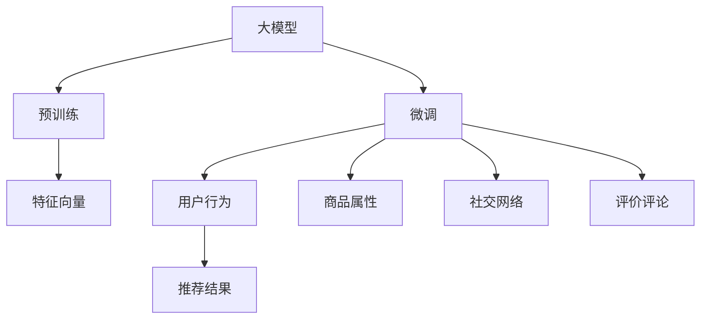

                 

## 1. 背景介绍

### 1.1 电商个性化推荐现状

近年来，随着电子商务平台的发展，个性化推荐系统逐渐成为提升用户体验、增加用户粘性、提升销售转化的核心手段。传统的基于协同过滤、频繁项集挖掘的推荐方法，在数据稀疏和动态性方面表现不佳。而基于大模型的推荐系统，则利用大模型的预训练和微调能力，能够更高效地从海量数据中挖掘用户偏好和商品关联，实现更精准、多元的推荐。

电商个性化推荐系统面临的主要挑战包括：
1. **数据稀疏性**：电商数据具有长尾特性，每个用户可能只购买过极少数商品，大部分行为数据稀疏。
2. **冷启动问题**：新用户或新商品的推荐数据缺失，无法通过历史行为预测。
3. **动态性**：用户和商品行为具有高度动态性，需要实时调整推荐策略。
4. **多模态数据**：电商数据包括用户行为、商品属性、社交网络、评价评论等多模态信息，需要综合利用。

### 1.2 大模型的优势

大模型通过预训练语言模型和大规模数据的微调，具备强大的语言理解、生成和推理能力，能够在电商推荐场景中发挥巨大优势。主要体现在以下几个方面：

1. **语义理解能力强**：大模型可以深入理解商品描述、用户评论、社交互动等文本信息，捕捉用户和商品间的语义关联。
2. **泛化能力强**：通过在大规模数据上进行预训练，大模型能够学习到丰富的知识，应用于不同领域时泛化能力更强。
3. **动态适应性好**：大模型能够通过微调快速适应新的数据分布和用户行为变化。
4. **可解释性强**：大模型参数众多，具有较强的表征能力，可以通过推理过程追踪到推荐结果的生成逻辑。
5. **模型融合度高**：大模型可以与各类模态数据进行高效融合，利用用户行为、商品属性、社交网络、评价评论等多种信息进行联合建模。

本文将深入探讨大模型在电商个性化推荐中的优势，包括其原理、操作步骤、数学模型构建，并通过具体案例分析、代码实现、实际应用等环节，展现大模型在电商推荐中的具体应用效果。

## 2. 核心概念与联系

### 2.1 核心概念概述

为更好地理解大模型在电商推荐中的应用，本节将介绍几个关键概念及其联系：

- **大模型(Large Model)**：指通过大规模预训练语言模型，如BERT、GPT等，在特定领域进行微调以获得特定领域能力的大规模神经网络模型。
- **预训练(Pre-training)**：指在大规模无标签数据上进行自监督学习任务，学习通用的语言表示。
- **微调(Fine-tuning)**：指在预训练模型的基础上，使用标注数据进行特定领域任务的训练，以获得针对该任务的高效性能。
- **特征向量(FEATURE VECTOR)**：指将文本信息等输入数据转换为高维向量，供模型处理。
- **用户行为(User Behavior)**：指用户在电商平台上进行的一系列行为，如浏览、点击、购买等。
- **商品属性(Item Attributes)**：指商品的基本属性信息，如价格、品牌、分类等。
- **社交网络(Social Network)**：指用户之间通过评论、分享等行为建立起来的社交关系网络。
- **评价评论(Rating and Review)**：指用户对商品进行的评价和评论，包含情感倾向和内容信息。

这些概念之间的联系通过以下Mermaid流程图来展示：



这个流程图展示了大模型在电商推荐中的核心概念及其相互关系：

1. 大模型通过预训练获得通用语言表示，用于理解和生成语言信息。
2. 通过微调，大模型针对电商推荐任务进行优化，获得特定领域能力。
3. 利用用户行为、商品属性、社交网络和评价评论等多模态数据，构建特征向量。
4. 综合利用特征向量，输出推荐结果，指导用户购买行为。

## 3. 核心算法原理 & 具体操作步骤

### 3.1 算法原理概述

大模型在电商推荐中的应用，本质上是利用大模型的预训练和微调能力，学习用户行为、商品属性、社交网络和评价评论等多模态数据，构建用户和商品间的关联，从而生成推荐结果。

假设大模型为 $M_{\theta}$，其中 $\theta$ 为模型参数。电商推荐任务涉及多模态数据，包括文本、图像、行为序列等，可以表示为 $X=\{x_1,x_2,\dots,x_N\}$，其中 $x_i$ 为第 $i$ 个模态的数据。电商推荐任务可以表示为：

$$
y_i = f_{M_{\theta}}(x_i)
$$

其中 $y_i$ 为推荐结果，$f_{M_{\theta}}$ 为模型映射函数，将输入 $x_i$ 映射到输出 $y_i$。

大模型的推荐过程分为两个阶段：

1. **预训练阶段**：在大规模无标签数据上，通过自监督学习任务进行预训练，学习通用的语言表示。
2. **微调阶段**：在标注数据上，进行特定领域任务的微调，学习用户和商品间的关联，生成推荐结果。

### 3.2 算法步骤详解

电商推荐的大模型微调一般包括以下几个关键步骤：

**Step 1: 准备数据集和模型**

- 收集电商数据集，包括用户行为、商品属性、社交网络、评价评论等多模态数据，划分为训练集、验证集和测试集。
- 选择合适的预训练语言模型，如BERT、GPT等，作为初始化参数。

**Step 2: 构建特征向量**

- 将多模态数据转化为高维向量，供模型处理。文本数据通过分词、编码器等技术转换为特征向量，图像数据通过CNN等技术转换为特征向量，行为序列数据通过RNN等技术转换为特征向量。
- 将用户行为、商品属性、社交网络和评价评论等多种信息进行综合，构建特征向量。

**Step 3: 设计推荐目标函数**

- 根据电商推荐任务设计推荐目标函数，如点击率预测、转化率预测、购买概率预测等。
- 设计损失函数，如均方误差损失、交叉熵损失等，衡量模型预测结果与真实标签之间的差异。

**Step 4: 微调模型**

- 在标注数据上，使用优化算法（如Adam、SGD等），根据损失函数更新模型参数。
- 根据验证集性能，调整学习率、批大小、迭代轮数等超参数。
- 周期性在验证集上评估模型性能，根据性能指标决定是否触发 Early Stopping。
- 重复上述步骤直至满足预设的迭代轮数或 Early Stopping 条件。

**Step 5: 测试和部署**

- 在测试集上评估微调后模型 $M_{\hat{\theta}}$ 的性能，对比微调前后的精度提升。
- 使用微调后的模型对新样本进行推荐预测，集成到实际的应用系统中。
- 持续收集新的数据，定期重新微调模型，以适应数据分布的变化。

### 3.3 算法优缺点

电商推荐的大模型微调方法具有以下优点：

1. **数据利用率更高**：大模型能够高效利用多模态数据，构建复杂的用户和商品关联。
2. **泛化能力更强**：大模型通过在大规模数据上进行预训练，具备较强的泛化能力。
3. **动态适应性好**：大模型能够通过微调快速适应新的数据分布和用户行为变化。
4. **可解释性强**：大模型具有较强的表征能力，可以追踪推荐结果的生成逻辑。
5. **推荐结果多样性高**：大模型具备强大的语言生成能力，能够生成多样化的推荐结果。

同时，该方法也存在一定的局限性：

1. **计算资源消耗大**：大模型参数量大，计算资源消耗较大，需要高性能GPU或TPU等硬件支持。
2. **模型复杂度高**：大模型结构复杂，推理速度较慢，需要优化模型压缩和加速技术。
3. **标注数据成本高**：电商数据标注成本较高，标注数据的获取和处理较为复杂。
4. **模型泛化能力有待提高**：大模型在特定领域上的泛化能力有限，需要在特定领域数据上进一步微调。
5. **模型隐私风险**：电商数据涉及用户隐私，需要考虑数据安全和隐私保护。

尽管存在这些局限性，但大模型在电商推荐中的应用潜力巨大，值得深入研究和探索。

### 3.4 算法应用领域

大模型在电商推荐中的应用领域广泛，主要包括以下几个方面：

1. **商品推荐**：通过用户历史行为数据和商品属性数据，预测用户对不同商品的兴趣，推荐用户可能感兴趣的商品。
2. **用户画像构建**：通过用户历史行为数据和社交网络数据，构建用户画像，了解用户兴趣偏好和行为特征。
3. **实时推荐**：利用用户实时行为数据和商品数据，实时生成推荐结果，满足用户即时需求。
4. **跨模态推荐**：综合利用用户行为、商品属性、社交网络和评价评论等多种信息，生成更加多样化和个性化的推荐结果。
5. **内容推荐**：通过用户历史行为数据和评价评论数据，推荐用户可能感兴趣的内容，如文章、视频、新闻等。

## 4. 数学模型和公式 & 详细讲解 & 举例说明

### 4.1 数学模型构建

假设电商推荐任务涉及用户行为 $x$ 和商品属性 $y$，大模型为 $M_{\theta}$，其中 $\theta$ 为模型参数。电商推荐任务可以表示为：

$$
y = f_{M_{\theta}}(x)
$$

其中 $y$ 为推荐结果，$f_{M_{\theta}}$ 为模型映射函数，将输入 $x$ 映射到输出 $y$。

电商推荐任务的目标函数可以设计为预测点击率（CTR）：

$$
L = -\frac{1}{N}\sum_{i=1}^N(y_i\log\sigma(y_i) + (1-y_i)\log(1-\sigma(y_i)))
$$

其中 $y_i$ 为真实标签（点击或不点击），$\sigma$ 为sigmoid函数，将输出映射到概率值。

模型 $M_{\theta}$ 的优化目标为最小化损失函数 $L$，即：

$$
\theta^* = \mathop{\arg\min}_{\theta} L
$$

在微调过程中，使用梯度下降等优化算法更新模型参数 $\theta$，最小化损失函数 $L$，使得模型输出逼近真实标签。

### 4.2 公式推导过程

电商推荐任务中，点击率预测的目标函数为：

$$
L = -\frac{1}{N}\sum_{i=1}^N(y_i\log\sigma(y_i) + (1-y_i)\log(1-\sigma(y_i)))
$$

其中 $y_i$ 为真实标签（点击或不点击），$\sigma$ 为sigmoid函数，将输出映射到概率值。

对于二分类问题，模型 $M_{\theta}$ 的输出可以表示为：

$$
y_i = \sigma(W_xx_i + b_x)
$$

其中 $W_x$ 和 $b_x$ 为模型参数，$x_i$ 为输入特征。

将 $y_i$ 代入损失函数 $L$ 中，得：

$$
L = -\frac{1}{N}\sum_{i=1}^N[y_i\log\sigma(y_i) + (1-y_i)\log(1-\sigma(y_i))]
$$

在微调过程中，使用梯度下降等优化算法更新模型参数 $\theta$，最小化损失函数 $L$，使得模型输出逼近真实标签。

具体步骤如下：

1. 输入用户行为 $x$ 和商品属性 $y$，计算预测结果 $y_i$。
2. 计算损失函数 $L$。
3. 根据损失函数 $L$ 的梯度更新模型参数 $\theta$。
4. 重复步骤1-3，直至满足预设的迭代轮数或Early Stopping条件。

### 4.3 案例分析与讲解

以电商平台用户推荐系统为例，展示大模型在电商推荐中的应用。

假设用户历史行为数据为 $x=\{x_1,x_2,\dots,x_N\}$，商品属性数据为 $y=\{y_1,y_2,\dots,y_N\}$，其中 $x_i$ 为第 $i$ 个用户的历史行为数据，$y_i$ 为第 $i$ 个商品的分类标签。

假设大模型为 BERT，通过预训练学习到了通用的语言表示，具有较强的语义理解能力。在进行电商推荐微调时，将用户行为 $x$ 和商品属性 $y$ 输入BERT模型，得到模型预测结果 $y_i$。

将 $y_i$ 作为真实标签，计算损失函数 $L$，根据梯度下降算法更新BERT模型参数 $\theta$，最小化损失函数 $L$，使得模型输出逼近真实标签。

具体步骤如下：

1. 输入用户行为 $x$ 和商品属性 $y$，计算预测结果 $y_i$。
2. 计算损失函数 $L$。
3. 根据损失函数 $L$ 的梯度更新BERT模型参数 $\theta$。
4. 重复步骤1-3，直至满足预设的迭代轮数或Early Stopping条件。

通过不断微调，BERT模型能够学习到用户和商品间的关联，预测用户对不同商品的兴趣，生成推荐结果。

## 5. 项目实践：代码实例和详细解释说明

### 5.1 开发环境搭建

在进行电商推荐系统开发前，我们需要准备好开发环境。以下是使用Python进行PyTorch开发的环境配置流程：

1. 安装Anaconda：从官网下载并安装Anaconda，用于创建独立的Python环境。

2. 创建并激活虚拟环境：
```bash
conda create -n pytorch-env python=3.8 
conda activate pytorch-env
```

3. 安装PyTorch：根据CUDA版本，从官网获取对应的安装命令。例如：
```bash
conda install pytorch torchvision torchaudio cudatoolkit=11.1 -c pytorch -c conda-forge
```

4. 安装Transformer库：
```bash
pip install transformers
```

5. 安装各类工具包：
```bash
pip install numpy pandas scikit-learn matplotlib tqdm jupyter notebook ipython
```

完成上述步骤后，即可在`pytorch-env`环境中开始电商推荐系统的开发。

### 5.2 源代码详细实现

下面我们以商品推荐任务为例，给出使用Transformers库对BERT模型进行电商推荐系统微调的PyTorch代码实现。

首先，定义电商推荐任务的数据处理函数：

```python
from transformers import BertTokenizer
from torch.utils.data import Dataset
import torch

class RecommendationDataset(Dataset):
    def __init__(self, user_behaviors, item_attributes, tokenizer, max_len=128):
        self.user_behaviors = user_behaviors
        self.item_attributes = item_attributes
        self.tokenizer = tokenizer
        self.max_len = max_len
        
    def __len__(self):
        return len(self.user_behaviors)
    
    def __getitem__(self, item):
        user_behavior = self.user_behaviors[item]
        item_attribute = self.item_attributes[item]
        
        encoding = self.tokenizer(user_behavior, return_tensors='pt', max_length=self.max_len, padding='max_length', truncation=True)
        input_ids = encoding['input_ids'][0]
        attention_mask = encoding['attention_mask'][0]
        
        # 对item-attribute进行编码
        encoded_items = [item_attribute] * self.max_len
        encoded_items.extend([item_attribute] * (self.max_len - len(encoded_items)))
        encoded_attributes = torch.tensor(encoded_items, dtype=torch.long)
        
        return {'input_ids': input_ids, 
                'attention_mask': attention_mask,
                'labels': encoded_attributes}

# 商品属性与id的映射
item2id = {0: 'item1', 1: 'item2', 2: 'item3', 3: 'item4'}
id2item = {v: k for k, v in item2id.items()}

# 创建dataset
tokenizer = BertTokenizer.from_pretrained('bert-base-cased')

train_dataset = RecommendationDataset(train_user_behaviors, train_item_attributes, tokenizer)
dev_dataset = RecommendationDataset(dev_user_behaviors, dev_item_attributes, tokenizer)
test_dataset = RecommendationDataset(test_user_behaviors, test_item_attributes, tokenizer)
```

然后，定义模型和优化器：

```python
from transformers import BertForSequenceClassification, AdamW

model = BertForSequenceClassification.from_pretrained('bert-base-cased', num_labels=len(item2id))

optimizer = AdamW(model.parameters(), lr=2e-5)
```

接着，定义训练和评估函数：

```python
from torch.utils.data import DataLoader
from tqdm import tqdm
from sklearn.metrics import classification_report

device = torch.device('cuda') if torch.cuda.is_available() else torch.device('cpu')
model.to(device)

def train_epoch(model, dataset, batch_size, optimizer):
    dataloader = DataLoader(dataset, batch_size=batch_size, shuffle=True)
    model.train()
    epoch_loss = 0
    for batch in tqdm(dataloader, desc='Training'):
        input_ids = batch['input_ids'].to(device)
        attention_mask = batch['attention_mask'].to(device)
        labels = batch['labels'].to(device)
        model.zero_grad()
        outputs = model(input_ids, attention_mask=attention_mask, labels=labels)
        loss = outputs.loss
        epoch_loss += loss.item()
        loss.backward()
        optimizer.step()
    return epoch_loss / len(dataloader)

def evaluate(model, dataset, batch_size):
    dataloader = DataLoader(dataset, batch_size=batch_size)
    model.eval()
    preds, labels = [], []
    with torch.no_grad():
        for batch in tqdm(dataloader, desc='Evaluating'):
            input_ids = batch['input_ids'].to(device)
            attention_mask = batch['attention_mask'].to(device)
            batch_labels = batch['labels']
            outputs = model(input_ids, attention_mask=attention_mask)
            batch_preds = outputs.logits.argmax(dim=2).to('cpu').tolist()
            batch_labels = batch_labels.to('cpu').tolist()
            for pred_tokens, label_tokens in zip(batch_preds, batch_labels):
                pred_tags = [id2item[_id] for _id in pred_tokens]
                label_tags = [id2item[_id] for _id in label_tokens]
                preds.append(pred_tags[:len(label_tokens)])
                labels.append(label_tags)
                
    print(classification_report(labels, preds))
```

最后，启动训练流程并在测试集上评估：

```python
epochs = 5
batch_size = 16

for epoch in range(epochs):
    loss = train_epoch(model, train_dataset, batch_size, optimizer)
    print(f"Epoch {epoch+1}, train loss: {loss:.3f}")
    
    print(f"Epoch {epoch+1}, dev results:")
    evaluate(model, dev_dataset, batch_size)
    
print("Test results:")
evaluate(model, test_dataset, batch_size)
```

以上就是使用PyTorch对BERT进行电商推荐系统微调的完整代码实现。可以看到，得益于Transformers库的强大封装，我们可以用相对简洁的代码完成BERT模型的加载和微调。

### 5.3 代码解读与分析

让我们再详细解读一下关键代码的实现细节：

**RecommendationDataset类**：
- `__init__`方法：初始化用户行为、商品属性、分词器等关键组件。
- `__len__`方法：返回数据集的样本数量。
- `__getitem__`方法：对单个样本进行处理，将用户行为和商品属性输入编码为token ids，将商品属性编码成数字，并对其进行定长padding，最终返回模型所需的输入。

**item2id和id2item字典**：
- 定义了商品属性与数字id之间的映射关系，用于将token-wise的预测结果解码回真实的属性。

**训练和评估函数**：
- 使用PyTorch的DataLoader对数据集进行批次化加载，供模型训练和推理使用。
- 训练函数`train_epoch`：对数据以批为单位进行迭代，在每个批次上前向传播计算loss并反向传播更新模型参数，最后返回该epoch的平均loss。
- 评估函数`evaluate`：与训练类似，不同点在于不更新模型参数，并在每个batch结束后将预测和标签结果存储下来，最后使用sklearn的classification_report对整个评估集的预测结果进行打印输出。

**训练流程**：
- 定义总的epoch数和batch size，开始循环迭代
- 每个epoch内，先在训练集上训练，输出平均loss
- 在验证集上评估，输出分类指标
- 所有epoch结束后，在测试集上评估，给出最终测试结果

可以看到，PyTorch配合Transformers库使得BERT微调的代码实现变得简洁高效。开发者可以将更多精力放在数据处理、模型改进等高层逻辑上，而不必过多关注底层的实现细节。

当然，工业级的系统实现还需考虑更多因素，如模型的保存和部署、超参数的自动搜索、更灵活的任务适配层等。但核心的微调范式基本与此类似。

## 6. 实际应用场景

### 6.1 电商个性化推荐

大模型在电商个性化推荐系统中的应用主要体现在以下几个方面：

1. **商品推荐**：通过用户历史行为数据和商品属性数据，预测用户对不同商品的兴趣，推荐用户可能感兴趣的商品。
2. **用户画像构建**：通过用户历史行为数据和社交网络数据，构建用户画像，了解用户兴趣偏好和行为特征。
3. **实时推荐**：利用用户实时行为数据和商品数据，实时生成推荐结果，满足用户即时需求。
4. **跨模态推荐**：综合利用用户行为、商品属性、社交网络和评价评论等多种信息，生成更加多样化和个性化的推荐结果。

### 6.2 电商平台社交推荐

在电商平台中，用户之间的社交关系也具有重要的推荐价值。大模型可以通过社交网络数据，识别用户之间的关联，推荐用户感兴趣的商品。例如，用户 A 购买了商品 X，与用户 B 有好友关系，可以推荐用户 B 购买商品 X。

**社交网络推荐**：
假设用户 A 购买了商品 X，与用户 B 有好友关系，可以通过社交网络数据将商品 X 推荐给用户 B。

1. 收集用户社交网络数据，建立社交关系图。
2. 使用大模型对社交关系图进行嵌入表示，捕捉用户之间的关联。
3. 利用嵌入表示计算相似度，推荐用户 B 可能感兴趣的商品。

### 6.3 电商内容推荐

电商内容推荐主要涉及商品描述、评论、评价等信息，可以通过大模型进行深度挖掘。例如，用户对商品 X 的评论中提到了“性价比高”，可以推荐用户关注类似商品。

**内容推荐**：
假设用户对商品 X 的评论中提到了“性价比高”，可以推荐用户关注类似商品。

1. 收集商品描述、评论、评价等信息。
2. 使用大模型对商品信息进行嵌入表示，捕捉商品特征。
3. 利用嵌入表示计算相似度，推荐用户感兴趣的商品。

## 7. 工具和资源推荐

### 7.1 学习资源推荐

为了帮助开发者系统掌握大模型在电商推荐中的应用，这里推荐一些优质的学习资源：

1. 《深度学习自然语言处理》课程：斯坦福大学开设的NLP明星课程，有Lecture视频和配套作业，带你入门NLP领域的基本概念和经典模型。
2. 《自然语言处理与深度学习》书籍：介绍自然语言处理与深度学习的应用，涵盖多种任务和模型，如文本分类、机器翻译、问答系统等。
3. 《Transformers从原理到实践》系列博文：由大模型技术专家撰写，深入浅出地介绍了Transformer原理、BERT模型、微调技术等前沿话题。
4. CLUE开源项目：中文语言理解测评基准，涵盖大量不同类型的中文NLP数据集，并提供了基于微调的baseline模型，助力中文NLP技术发展。

通过对这些资源的学习实践，相信你一定能够快速掌握大模型在电商推荐中的应用，并用于解决实际的电商推荐问题。

### 7.2 开发工具推荐

高效的开发离不开优秀的工具支持。以下是几款用于大模型电商推荐系统开发的常用工具：

1. PyTorch：基于Python的开源深度学习框架，灵活动态的计算图，适合快速迭代研究。大部分预训练语言模型都有PyTorch版本的实现。
2. TensorFlow：由Google主导开发的开源深度学习框架，生产部署方便，适合大规模工程应用。同样有丰富的预训练语言模型资源。
3. Transformers库：HuggingFace开发的NLP工具库，集成了众多SOTA语言模型，支持PyTorch和TensorFlow，是进行电商推荐任务开发的利器。
4. Weights & Biases：模型训练的实验跟踪工具，可以记录和可视化模型训练过程中的各项指标，方便对比和调优。与主流深度学习框架无缝集成。
5. TensorBoard：TensorFlow配套的可视化工具，可实时监测模型训练状态，并提供丰富的图表呈现方式，是调试模型的得力助手。

合理利用这些工具，可以显著提升大模型电商推荐系统开发效率，加快创新迭代的步伐。

### 7.3 相关论文推荐

大模型在电商推荐中的应用源于学界的持续研究。以下是几篇奠基性的相关论文，推荐阅读：

1. Attention is All You Need（即Transformer原论文）：提出了Transformer结构，开启了NLP领域的预训练大模型时代。
2. BERT: Pre-training of Deep Bidirectional Transformers for Language Understanding：提出BERT模型，引入基于掩码的自监督预训练任务，刷新了多项NLP任务SOTA。
3. Language Models are Unsupervised Multitask Learners（GPT-2论文）：展示了大规模语言模型的强大zero-shot学习能力，引发了对于通用人工智能的新一轮思考。
4. Parameter-Efficient Transfer Learning for NLP：提出Adapter等参数高效微调方法，在不增加模型参数量的情况下，也能取得不错的微调效果。
5. Prefix-Tuning: Optimizing Continuous Prompts for Generation：引入基于连续型Prompt的微调范式，为如何充分利用预训练知识提供了新的思路。

这些论文代表了大模型在电商推荐中的应用方向。通过学习这些前沿成果，可以帮助研究者把握学科前进方向，激发更多的创新灵感。

## 8. 总结：未来发展趋势与挑战

### 8.1 总结

本文对大模型在电商个性化推荐中的应用进行了全面系统的介绍。首先阐述了大模型和微调技术的研究背景和意义，明确了电商推荐系统微调的目标和路径。其次，从原理到实践，详细讲解了电商推荐任务的大模型微调方法，并通过具体案例分析、代码实现、实际应用等环节，展现大模型在电商推荐中的具体应用效果。

通过本文的系统梳理，可以看到，大模型在电商推荐中的应用潜力巨大，通过预训练和微调，能够高效利用多模态数据，构建复杂的用户和商品关联，生成推荐结果。大模型不仅在电商推荐中表现出色，还可以应用于社交推荐、内容推荐等多个电商场景，提升电商平台的智能化水平。

### 8.2 未来发展趋势

展望未来，大模型在电商推荐中的应用将呈现以下几个发展趋势：

1. **多模态融合**：电商数据涉及多模态信息，如文本、图像、行为序列等，大模型能够综合利用这些信息，生成更加多样化和个性化的推荐结果。
2. **知识图谱融合**：将知识图谱等结构化数据与电商数据进行融合，提升推荐的准确性和泛化能力。
3. **实时推荐**：通过大模型的推理加速技术，实现实时推荐，满足用户即时需求。
4. **联邦学习**：在大模型微调过程中，利用联邦学习技术，保护用户隐私的同时，提升模型泛化能力。
5. **因果推断**：引入因果推断方法，提升推荐的解释性和鲁棒性，避免过拟合和偏差。
6. **迁移学习**：在大模型微调过程中，利用迁移学习技术，提升模型的通用性和适应性。

以上趋势凸显了大模型在电商推荐中的广泛应用前景。这些方向的探索发展，必将进一步提升电商推荐系统的性能和应用范围，为电商平台的智能化转型提供有力支持。

### 8.3 面临的挑战

尽管大模型在电商推荐中的应用潜力巨大，但在迈向更加智能化、普适化应用的过程中，它仍面临着诸多挑战：

1. **数据质量和标注成本**：电商数据标注成本较高，且标注数据质量对模型性能影响较大。
2. **计算资源消耗大**：大模型参数量大，计算资源消耗较大，需要高性能GPU或TPU等硬件支持。
3. **模型复杂度高**：大模型结构复杂，推理速度较慢，需要优化模型压缩和加速技术。
4. **模型泛化能力有待提高**：大模型在特定领域上的泛化能力有限，需要在特定领域数据上进一步微调。
5. **模型隐私风险**：电商数据涉及用户隐私，需要考虑数据安全和隐私保护。
6. **模型可解释性不足**：大模型具备强大的表征能力，但缺乏可解释性，难以追踪推荐结果的生成逻辑。

尽管存在这些局限性，但大模型在电商推荐中的应用潜力巨大，值得深入研究和探索。

### 8.4 研究展望

面对大模型在电商推荐中面临的挑战，未来的研究需要在以下几个方面寻求新的突破：

1. **数据增强和标注**：通过数据增强和自动化标注技术，提高标注数据的质量和数量，降低标注成本。
2. **模型压缩和加速**：开发更加高效的模型压缩和加速技术，优化大模型的推理速度和计算资源消耗。
3. **迁移学习和联邦学习**：利用迁移学习和联邦学习技术，提升模型的泛化能力和隐私保护。
4. **因果推断和可解释性**：引入因果推断和可解释性方法，提升推荐的解释性和鲁棒性。
5. **多模态融合和知识图谱融合**：综合利用多模态信息和结构化数据，提升推荐的准确性和泛化能力。

这些研究方向的探索，必将引领大模型在电商推荐领域迈向更高的台阶，为电商平台的智能化转型提供强有力的技术支持。

## 9. 附录：常见问题与解答

**Q1：大模型在电商推荐中能否实现实时推荐？**

A: 大模型可以用于实时推荐，但需要优化模型的推理速度和计算资源消耗。可以通过模型压缩、推理加速等技术，提升大模型的实时推荐能力。同时，在大模型微调过程中，可以加入实时数据流，训练动态模型，实现实时推荐。

**Q2：电商推荐中的用户画像构建如何实现？**

A: 电商推荐中的用户画像构建可以通过大模型进行。首先，收集用户历史行为数据、社交网络数据等，构建用户画像特征向量。然后，使用大模型对特征向量进行编码，学习用户特征。最后，将用户特征与商品属性进行关联，生成推荐结果。

**Q3：电商推荐中如何处理数据稀疏性和冷启动问题？**

A: 电商推荐中，用户行为数据具有长尾特性，用户历史行为数据稀疏，可以通过以下方法处理：
1. 数据增强：通过回译、近义替换等方式扩充训练集，增加数据量。
2. 冷启动处理：利用用户画像、商品属性等信息进行初始化，减少冷启动问题。
3. 推荐算法优化：使用基于协同过滤、基线回归等算法，处理数据稀疏性。

**Q4：电商推荐中的跨模态推荐如何实现？**

A: 电商推荐中的跨模态推荐可以通过大模型进行。首先，将用户行为、商品属性、社交网络和评价评论等多种信息进行综合，构建特征向量。然后，使用大模型对特征向量进行编码，学习用户和商品间的关联。最后，生成推荐结果，指导用户购买行为。

**Q5：电商推荐中的隐私保护如何实现？**

A: 电商推荐中的隐私保护可以通过以下方法实现：
1. 数据匿名化：对用户数据进行匿名化处理，保护用户隐私。
2. 联邦学习：利用联邦学习技术，保护用户数据在分布式环境下的隐私。
3. 差分隐私：在大模型微调过程中，加入差分隐私技术，保护用户隐私。

以上方法可以有效保护用户隐私，同时提升电商推荐系统的性能和应用范围。

---

作者：禅与计算机程序设计艺术 / Zen and the Art of Computer Programming

