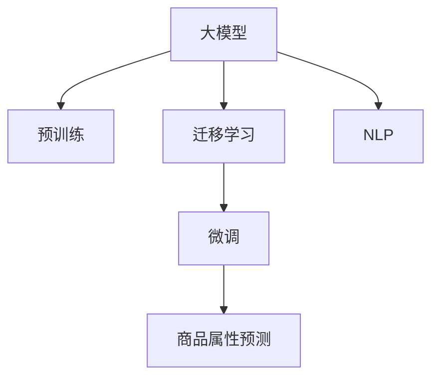

                 

# 探讨大模型在电商平台商品属性预测中的作用

> 关键词：大模型,商品属性预测,自然语言处理(NLP),迁移学习,Transformer,BERT,预训练,深度学习

## 1. 背景介绍

### 1.1 问题由来
在现代电子商务中，商品属性预测(如品牌、尺寸、颜色、材质等)对于提升用户体验、优化库存管理、个性化推荐等方面具有重要意义。传统的商品属性预测方法依赖于人工标注的训练数据，需要耗费大量时间和人力，且精度和泛化能力有限。近年来，随着深度学习技术的发展，基于预训练语言模型的大模型在自然语言处理(NLP)领域取得了显著进展。将大模型应用于电商平台商品属性预测，通过迁移学习的方法，能够显著提升预测精度和模型泛化能力，实现低成本、高效益的预测效果。

### 1.2 问题核心关键点
大模型在电商平台商品属性预测中的作用主要体现在以下几个方面：
- 利用大规模无标签文本数据进行预训练，学习到丰富的语言知识和语义表示。
- 通过迁移学习的方法，将预训练大模型的知识迁移到具体的商品属性预测任务上。
- 通过微调或提示学习，进一步优化模型在特定任务上的性能。
- 大模型具备自监督学习能力，能够在标注数据较少的情况下，仍然保持较高的预测精度。

### 1.3 问题研究意义
大模型在电商平台商品属性预测中的应用，对于提升电商平台的智能化水平、优化用户体验、降低运营成本具有重要意义：

1. **提升预测精度**：基于大模型的商品属性预测可以充分利用其语言理解和生成能力，提高预测结果的准确性。
2. **泛化能力更强**：大模型经过大规模语料的预训练，具备更强的泛化能力，能够更好地应对未知数据。
3. **降低运营成本**：相比于传统的基于人工标注数据的方法，大模型可以在标注数据较少的情况下，通过微调或提示学习实现高效的预测。
4. **优化库存管理**：准确的商品属性预测能够帮助电商平台更好地掌握商品销售情况，优化库存管理，降低库存成本。
5. **个性化推荐**：基于商品属性的个性化推荐能够提升用户体验，增加用户粘性，提高转化率。
6. **实时性更好**：大模型的预测速度快，能够实时处理查询，满足电商平台的实时需求。

## 2. 核心概念与联系

### 2.1 核心概念概述

为更好地理解大模型在电商平台商品属性预测中的应用，本节将介绍几个密切相关的核心概念：

- 大模型(Large Language Model, LLM)：以自回归(如GPT)或自编码(如BERT)模型为代表的大规模预训练语言模型。通过在大规模无标签文本语料上进行预训练，学习到丰富的语言知识和语义表示。

- 预训练(Pre-training)：指在大规模无标签文本语料上，通过自监督学习任务训练通用语言模型的过程。常见的预训练任务包括言语建模、掩码语言模型等。预训练使得模型学习到语言的通用表示。

- 迁移学习(Transfer Learning)：指将一个领域学习到的知识，迁移到另一个不同但相关的领域的学习范式。大模型的预训练-迁移学习过程即是一种典型的迁移学习方式。

- 微调(Fine-tuning)：指在预训练模型的基础上，使用下游任务的少量标注数据，通过有监督学习优化模型在特定任务上的性能。通常只需要调整顶层分类器或解码器，并以较小的学习率更新全部或部分的模型参数。

- 自然语言处理(NLP)：研究如何让计算机理解、处理和生成自然语言的技术，涵盖文本分类、命名实体识别、语义分析等多个子领域。

- 电商平台的商品属性预测：指利用电商平台商品描述等文本数据，预测商品的具体属性，如品牌、尺寸、颜色、材质等，以提升电商平台的智能化水平和用户体验。

这些核心概念之间的逻辑关系可以通过以下Mermaid流程图来展示：



这个流程图展示了大模型在电商平台商品属性预测中的核心概念及其之间的关系：

1. 大模型通过预训练获得基础能力。
2. 迁移学习将预训练知识应用到具体的商品属性预测任务上。
3. 微调进一步优化模型在该任务上的性能。
4. NLP技术提供了预测所需的数据预处理和模型训练技术。
5. 电商平台的商品属性预测是NLP技术的重要应用场景之一。

## 3. 核心算法原理 & 具体操作步骤

### 3.1 算法原理概述

基于大模型的电商平台商品属性预测，本质上是一个有监督的迁移学习过程。其核心思想是：将预训练的大模型视作一个强大的"特征提取器"，通过迁移学习的方法，将预训练知识迁移到具体的商品属性预测任务上。然后，通过微调或提示学习，进一步优化模型在该任务上的性能。

形式化地，假设预训练模型为 $M_{\theta}$，其中 $\theta$ 为预训练得到的模型参数。给定电商平台商品属性预测任务 $T$ 的标注数据集 $D=\{(x_i, y_i)\}_{i=1}^N$，迁移学习的过程包括两个主要步骤：

1. **特征提取**：使用预训练模型 $M_{\theta}$ 对商品描述 $x_i$ 进行编码，提取特征向量 $h_i = M_{\theta}(x_i)$。
2. **任务适配**：在特征向量 $h_i$ 上训练一个简单的线性分类器或回归器，预测商品属性 $y_i$。

微调的过程与传统的监督学习类似，在标注数据集 $D$ 上进行优化，更新模型参数 $\theta$，以最小化预测误差。

### 3.2 算法步骤详解

基于大模型的电商平台商品属性预测，一般包括以下几个关键步骤：

**Step 1: 准备预训练模型和数据集**
- 选择合适的预训练语言模型 $M_{\theta}$ 作为初始化参数，如 BERT、GPT 等。
- 准备电商平台商品属性预测任务 $T$ 的标注数据集 $D$，划分为训练集、验证集和测试集。一般要求标注数据与预训练数据的分布不要差异过大。

**Step 2: 特征提取**
- 使用预训练模型 $M_{\theta}$ 对电商平台商品描述数据进行编码，提取特征向量 $h_i = M_{\theta}(x_i)$。
- 选择合适的特征向量表示，如最后一层的输出作为特征，或者通过平均池化、Max Pooling等方式提取更高层次的语义信息。

**Step 3: 任务适配**
- 根据具体任务类型，设计合适的输出层和损失函数。
- 对于分类任务，通常使用softmax函数作为输出层，交叉熵损失函数作为损失函数。
- 对于回归任务，使用线性回归或神经网络作为输出层，均方误差损失函数作为损失函数。

**Step 4: 设置微调超参数**
- 选择合适的优化算法及其参数，如 AdamW、SGD 等，设置学习率、批大小、迭代轮数等。
- 设置正则化技术及强度，包括权重衰减、Dropout、Early Stopping等。
- 确定冻结预训练参数的策略，如仅微调顶层，或全部参数都参与微调。

**Step 5: 执行梯度训练**
- 将训练集数据分批次输入模型，前向传播计算损失函数。
- 反向传播计算参数梯度，根据设定的优化算法和学习率更新模型参数。
- 周期性在验证集上评估模型性能，根据性能指标决定是否触发 Early Stopping。
- 重复上述步骤直到满足预设的迭代轮数或 Early Stopping 条件。

**Step 6: 测试和部署**
- 在测试集上评估微调后模型 $M_{\hat{\theta}}$ 的性能，对比微调前后的精度提升。
- 使用微调后的模型对新商品进行属性预测，集成到实际的商品推荐、库存管理等应用系统中。
- 持续收集新的商品属性数据，定期重新微调模型，以适应数据分布的变化。

以上是基于大模型的电商平台商品属性预测的一般流程。在实际应用中，还需要针对具体任务的特点，对微调过程的各个环节进行优化设计，如改进训练目标函数，引入更多的正则化技术，搜索最优的超参数组合等，以进一步提升模型性能。

### 3.3 算法优缺点

基于大模型的电商平台商品属性预测，具有以下优点：
1. 利用预训练模型的大规模语料知识，能够有效提升预测精度和泛化能力。
2. 在标注数据较少的情况下，通过微调或提示学习，仍然能取得良好的预测效果。
3. 模型训练和推理速度快，能够实时处理电商平台的查询请求。
4. 与传统方法相比，降低了对人工标注数据的依赖，降低了运营成本。

同时，该方法也存在一定的局限性：
1. 需要较大的计算资源进行预训练和大规模数据集微调。
2. 对预训练语料的选择和预训练模型的参数设置较为敏感。
3. 模型的可解释性较差，难以解释预测结果背后的逻辑。
4. 对异常数据的鲁棒性较弱，易受到噪声数据的影响。

尽管存在这些局限性，但就目前而言，基于大模型的电商平台商品属性预测方法，仍是在该领域最主流和最有效的技术范式。未来相关研究的重点在于如何进一步降低对计算资源的依赖，提高模型的可解释性和鲁棒性，同时兼顾参数高效微调和提示学习等前沿技术。

### 3.4 算法应用领域

基于大模型的电商平台商品属性预测，已经在多个电商平台上得到了广泛的应用，涵盖商品分类、推荐、搜索等多个方面。例如：

- **商品分类**：利用商品描述数据，预测商品的具体分类，如服装、电子产品、日用品等。
- **推荐系统**：根据用户历史购买行为和商品属性预测，生成个性化推荐结果。
- **搜索系统**：通过商品属性预测，优化搜索引擎的召回和排序机制，提升搜索体验。
- **库存管理**：根据商品属性预测，优化库存分配策略，提高库存周转率。
- **广告投放**：通过商品属性预测，优化广告定向和投放策略，提升广告效果。

除了上述这些经典应用外，基于大模型的商品属性预测还被创新性地应用到更多场景中，如商品评价生成、智能客服、客户细分等，为电商平台的智能化转型提供了新的技术支持。随着预训练语言模型和商品属性预测技术的不断发展，相信电商平台将能够更好地理解和满足用户需求，提升整体运营效率和服务质量。

## 4. 数学模型和公式 & 详细讲解 & 举例说明

### 4.1 数学模型构建

本节将使用数学语言对基于大模型的电商平台商品属性预测过程进行更加严格的刻画。

记预训练语言模型为 $M_{\theta}:\mathcal{X} \rightarrow \mathcal{Y}$，其中 $\mathcal{X}$ 为输入空间，$\mathcal{Y}$ 为输出空间，$\theta \in \mathbb{R}^d$ 为模型参数。假设电商平台商品属性预测任务 $T$ 的标注数据集为 $D=\{(x_i,y_i)\}_{i=1}^N, x_i \in \mathcal{X}, y_i \in \mathcal{Y}$。

定义模型 $M_{\theta}$ 在输入 $x$ 上的特征向量为 $h_i = M_{\theta}(x_i) \in \mathbb{R}^k$，其中 $k$ 为特征向量的维度。假设任务 $T$ 的输出为 $y_i$，定义任务 $T$ 的损失函数为 $\ell(y_i, h_i)$。

在特征提取和任务适配之后，微调的过程可以表示为：

$$
\theta^* = \mathop{\arg\min}_{\theta} \frac{1}{N} \sum_{i=1}^N \ell(y_i, h_i)
$$

其中 $N$ 为数据集大小，$\ell$ 为损失函数。通过梯度下降等优化算法，微调过程不断更新模型参数 $\theta$，最小化损失函数 $\mathcal{L}$，使得模型输出逼近真实标签。由于 $\theta$ 已经通过预训练获得了较好的初始化，因此即便在小规模数据集上微调，也能较快收敛到理想的模型参数 $\hat{\theta}$。

### 4.2 公式推导过程

以下我们以二分类任务为例，推导交叉熵损失函数及其梯度的计算公式。

假设模型 $M_{\theta}$ 在输入 $x$ 上的特征向量为 $h_i = M_{\theta}(x_i) \in [0,1]$，表示商品属于某一属性的概率。真实标签 $y \in \{0,1\}$。则二分类交叉熵损失函数定义为：

$$
\ell(y_i, h_i) = -[y_i\log h_i + (1-y_i)\log(1-h_i)]
$$

将其代入特征提取和任务适配之后，定义模型 $M_{\theta}$ 在数据集 $D$ 上的经验风险为：

$$
\mathcal{L}(\theta) = \frac{1}{N} \sum_{i=1}^N \ell(y_i, h_i)
$$

根据链式法则，损失函数对参数 $\theta_k$ 的梯度为：

$$
\frac{\partial \mathcal{L}(\theta)}{\partial \theta_k} = \frac{1}{N}\sum_{i=1}^N \left(\frac{y_i}{h_i}-\frac{1-y_i}{1-h_i}\right) \frac{\partial h_i}{\partial \theta_k}
$$

其中 $\frac{\partial h_i}{\partial \theta_k}$ 可进一步递归展开，利用自动微分技术完成计算。

在得到损失函数的梯度后，即可带入参数更新公式，完成模型的迭代优化。重复上述过程直至收敛，最终得到适应电商平台商品属性预测任务的最优模型参数 $\theta^*$。

## 5. 项目实践：代码实例和详细解释说明

### 5.1 开发环境搭建

在进行电商平台商品属性预测实践前，我们需要准备好开发环境。以下是使用Python进行PyTorch开发的环境配置流程：

1. 安装Anaconda：从官网下载并安装Anaconda，用于创建独立的Python环境。

2. 创建并激活虚拟环境：
```bash
conda create -n pytorch-env python=3.8 
conda activate pytorch-env
```

3. 安装PyTorch：根据CUDA版本，从官网获取对应的安装命令。例如：
```bash
conda install pytorch torchvision torchaudio cudatoolkit=11.1 -c pytorch -c conda-forge
```

4. 安装Transformers库：
```bash
pip install transformers
```

5. 安装各类工具包：
```bash
pip install numpy pandas scikit-learn matplotlib tqdm jupyter notebook ipython
```

完成上述步骤后，即可在`pytorch-env`环境中开始电商平台商品属性预测实践。

### 5.2 源代码详细实现

这里我们以电商平台商品分类任务为例，给出使用Transformers库对BERT模型进行商品属性预测的PyTorch代码实现。

首先，定义商品分类任务的数据处理函数：

```python
from transformers import BertTokenizer
from torch.utils.data import Dataset
import torch

class ProductDataset(Dataset):
    def __init__(self, texts, tags, tokenizer, max_len=128):
        self.texts = texts
        self.tags = tags
        self.tokenizer = tokenizer
        self.max_len = max_len
        
    def __len__(self):
        return len(self.texts)
    
    def __getitem__(self, item):
        text = self.texts[item]
        tags = self.tags[item]
        
        encoding = self.tokenizer(text, return_tensors='pt', max_length=self.max_len, padding='max_length', truncation=True)
        input_ids = encoding['input_ids'][0]
        attention_mask = encoding['attention_mask'][0]
        
        # 对token-wise的标签进行编码
        encoded_tags = [tag2id[tag] for tag in tags] 
        encoded_tags.extend([tag2id['O']] * (self.max_len - len(encoded_tags)))
        labels = torch.tensor(encoded_tags, dtype=torch.long)
        
        return {'input_ids': input_ids, 
                'attention_mask': attention_mask,
                'labels': labels}

# 标签与id的映射
tag2id = {'O': 0, 'clothing': 1, 'electronics': 2, 'home goods': 3}
id2tag = {v: k for k, v in tag2id.items()}

# 创建dataset
tokenizer = BertTokenizer.from_pretrained('bert-base-cased')

train_dataset = ProductDataset(train_texts, train_tags, tokenizer)
dev_dataset = ProductDataset(dev_texts, dev_tags, tokenizer)
test_dataset = ProductDataset(test_texts, test_tags, tokenizer)
```

然后，定义模型和优化器：

```python
from transformers import BertForTokenClassification, AdamW

model = BertForTokenClassification.from_pretrained('bert-base-cased', num_labels=len(tag2id))

optimizer = AdamW(model.parameters(), lr=2e-5)
```

接着，定义训练和评估函数：

```python
from torch.utils.data import DataLoader
from tqdm import tqdm
from sklearn.metrics import classification_report

device = torch.device('cuda') if torch.cuda.is_available() else torch.device('cpu')
model.to(device)

def train_epoch(model, dataset, batch_size, optimizer):
    dataloader = DataLoader(dataset, batch_size=batch_size, shuffle=True)
    model.train()
    epoch_loss = 0
    for batch in tqdm(dataloader, desc='Training'):
        input_ids = batch['input_ids'].to(device)
        attention_mask = batch['attention_mask'].to(device)
        labels = batch['labels'].to(device)
        model.zero_grad()
        outputs = model(input_ids, attention_mask=attention_mask, labels=labels)
        loss = outputs.loss
        epoch_loss += loss.item()
        loss.backward()
        optimizer.step()
    return epoch_loss / len(dataloader)

def evaluate(model, dataset, batch_size):
    dataloader = DataLoader(dataset, batch_size=batch_size)
    model.eval()
    preds, labels = [], []
    with torch.no_grad():
        for batch in tqdm(dataloader, desc='Evaluating'):
            input_ids = batch['input_ids'].to(device)
            attention_mask = batch['attention_mask'].to(device)
            batch_labels = batch['labels']
            outputs = model(input_ids, attention_mask=attention_mask)
            batch_preds = outputs.logits.argmax(dim=2).to('cpu').tolist()
            batch_labels = batch_labels.to('cpu').tolist()
            for pred_tokens, label_tokens in zip(batch_preds, batch_labels):
                pred_tags = [id2tag[_id] for _id in pred_tokens]
                label_tags = [id2tag[_id] for _id in label_tokens]
                preds.append(pred_tags[:len(label_tags)])
                labels.append(label_tags)
                
    print(classification_report(labels, preds))
```

最后，启动训练流程并在测试集上评估：

```python
epochs = 5
batch_size = 16

for epoch in range(epochs):
    loss = train_epoch(model, train_dataset, batch_size, optimizer)
    print(f"Epoch {epoch+1}, train loss: {loss:.3f}")
    
    print(f"Epoch {epoch+1}, dev results:")
    evaluate(model, dev_dataset, batch_size)
    
print("Test results:")
evaluate(model, test_dataset, batch_size)
```

以上就是使用PyTorch对BERT进行电商平台商品分类任务预测的完整代码实现。可以看到，得益于Transformers库的强大封装，我们可以用相对简洁的代码完成BERT模型的加载和预测。

### 5.3 代码解读与分析

让我们再详细解读一下关键代码的实现细节：

**ProductDataset类**：
- `__init__`方法：初始化文本、标签、分词器等关键组件。
- `__len__`方法：返回数据集的样本数量。
- `__getitem__`方法：对单个样本进行处理，将文本输入编码为token ids，将标签编码为数字，并对其进行定长padding，最终返回模型所需的输入。

**tag2id和id2tag字典**：
- 定义了标签与数字id之间的映射关系，用于将token-wise的预测结果解码回真实的标签。

**训练和评估函数**：
- 使用PyTorch的DataLoader对数据集进行批次化加载，供模型训练和推理使用。
- 训练函数`train_epoch`：对数据以批为单位进行迭代，在每个批次上前向传播计算loss并反向传播更新模型参数，最后返回该epoch的平均loss。
- 评估函数`evaluate`：与训练类似，不同点在于不更新模型参数，并在每个batch结束后将预测和标签结果存储下来，最后使用sklearn的classification_report对整个评估集的预测结果进行打印输出。

**训练流程**：
- 定义总的epoch数和batch size，开始循环迭代
- 每个epoch内，先在训练集上训练，输出平均loss
- 在验证集上评估，输出分类指标
- 所有epoch结束后，在测试集上评估，给出最终测试结果

可以看到，PyTorch配合Transformers库使得BERT微调的代码实现变得简洁高效。开发者可以将更多精力放在数据处理、模型改进等高层逻辑上，而不必过多关注底层的实现细节。

当然，工业级的系统实现还需考虑更多因素，如模型的保存和部署、超参数的自动搜索、更灵活的任务适配层等。但核心的微调范式基本与此类似。

## 6. 实际应用场景
### 6.1 智能推荐系统

基于大模型的电商平台商品属性预测技术，可以广泛应用于智能推荐系统。传统的推荐系统往往只依赖用户的历史行为数据进行物品推荐，无法深入理解用户的真实兴趣偏好。而使用预训练语言模型进行商品属性预测，能够更好地挖掘用户行为背后的语义信息，从而提供更精准、多样的推荐内容。

在实践中，可以收集用户浏览、点击、评论、分享等行为数据，提取和用户交互的物品标题、描述、标签等文本内容。将文本内容作为模型输入，用户的后续行为（如是否点击、购买等）作为监督信号，在此基础上微调预训练语言模型。微调后的模型能够从文本内容中准确把握用户的兴趣点。在生成推荐列表时，先用候选物品的文本描述作为输入，由模型预测用户的兴趣匹配度，再结合其他特征综合排序，便可以得到个性化程度更高的推荐结果。

### 6.2 库存管理优化

电商平台需要实时掌握商品销售情况，以便及时调整库存，减少缺货或过剩。传统的库存管理往往依赖人工统计，效率低且误差大。基于大模型的商品属性预测，能够实时处理查询，自动更新库存数据，提升库存管理的智能化水平。

在实践中，可以结合平台上的商品查询数据，通过商品属性预测模型输出商品的销售预测，根据预测结果自动调整库存分配策略，优化库存管理，提高库存周转率。此外，还可以将预测结果作为预警信号，在库存接近临界点时及时发出警报，防止商品脱销。

### 6.3 搜索系统优化

电商平台上的搜索系统需要准确理解用户查询意图，快速匹配商品。传统的搜索系统往往依赖关键词匹配，难以处理复杂的自然语言查询。基于大模型的商品属性预测，能够深入理解用户查询背后的语义信息，从而提供更精准的搜索结果。

在实践中，可以将用户查询作为输入，通过商品属性预测模型输出预测的商品属性，结合这些属性进行召回和排序，提升搜索结果的相关性。同时，还可以通过预测结果对用户进行个性化推荐，提升搜索体验。

### 6.4 未来应用展望

随着大模型和商品属性预测技术的不断发展，未来在电商平台上的应用前景更加广阔：

1. **实时个性化推荐**：基于商品属性预测，实时更新个性化推荐结果，提升用户体验。
2. **商品评价生成**：利用商品属性预测，自动生成商品评价，降低人工标注成本。
3. **智能客服**：结合商品属性预测，训练对话模型，实现智能客服，提升服务效率和质量。
4. **客户细分**：基于商品属性预测，对用户进行细分，实现精准营销。
5. **广告定向**：结合商品属性预测，优化广告定向和投放策略，提升广告效果。
6. **市场分析**：基于商品属性预测，分析市场趋势，辅助商业决策。

## 7. 工具和资源推荐
### 7.1 学习资源推荐

为了帮助开发者系统掌握大模型在电商平台商品属性预测中的应用，这里推荐一些优质的学习资源：

1. 《Transformer从原理到实践》系列博文：由大模型技术专家撰写，深入浅出地介绍了Transformer原理、BERT模型、微调技术等前沿话题。

2. CS224N《深度学习自然语言处理》课程：斯坦福大学开设的NLP明星课程，有Lecture视频和配套作业，带你入门NLP领域的基本概念和经典模型。

3. 《Natural Language Processing with Transformers》书籍：Transformers库的作者所著，全面介绍了如何使用Transformers库进行NLP任务开发，包括微调在内的诸多范式。

4. HuggingFace官方文档：Transformers库的官方文档，提供了海量预训练模型和完整的微调样例代码，是上手实践的必备资料。

5. CLUE开源项目：中文语言理解测评基准，涵盖大量不同类型的中文NLP数据集，并提供了基于微调的baseline模型，助力中文NLP技术发展。

通过对这些资源的学习实践，相信你一定能够快速掌握大模型在电商平台商品属性预测中的核心技术，并用于解决实际的NLP问题。
###  7.2 开发工具推荐

高效的开发离不开优秀的工具支持。以下是几款用于电商平台商品属性预测开发的常用工具：

1. PyTorch：基于Python的开源深度学习框架，灵活动态的计算图，适合快速迭代研究。大部分预训练语言模型都有PyTorch版本的实现。

2. TensorFlow：由Google主导开发的开源深度学习框架，生产部署方便，适合大规模工程应用。同样有丰富的预训练语言模型资源。

3. Transformers库：HuggingFace开发的NLP工具库，集成了众多SOTA语言模型，支持PyTorch和TensorFlow，是进行商品属性预测开发的利器。

4. Weights & Biases：模型训练的实验跟踪工具，可以记录和可视化模型训练过程中的各项指标，方便对比和调优。与主流深度学习框架无缝集成。

5. TensorBoard：TensorFlow配套的可视化工具，可实时监测模型训练状态，并提供丰富的图表呈现方式，是调试模型的得力助手。

6. Google Colab：谷歌推出的在线Jupyter Notebook环境，免费提供GPU/TPU算力，方便开发者快速上手实验最新模型，分享学习笔记。

合理利用这些工具，可以显著提升电商平台商品属性预测的开发效率，加快创新迭代的步伐。

### 7.3 相关论文推荐

大模型在电商平台商品属性预测中的应用，源于学界的持续研究。以下是几篇奠基性的相关论文，推荐阅读：

1. Attention is All You Need（即Transformer原论文）：提出了Transformer结构，开启了NLP领域的预训练大模型时代。

2. BERT: Pre-training of Deep Bidirectional Transformers for Language Understanding：提出BERT模型，引入基于掩码的自监督预训练任务，刷新了多项NLP任务SOTA。

3. Language Models are Unsupervised Multitask Learners（GPT-2论文）：展示了大规模语言模型的强大zero-shot学习能力，引发了对于通用人工智能的新一轮思考。

4. Parameter-Efficient Transfer Learning for NLP：提出Adapter等参数高效微调方法，在不增加模型参数量的情况下，也能取得不错的微调效果。

5. AdaLoRA: Adaptive Low-Rank Adaptation for Parameter-Efficient Fine-Tuning：使用自适应低秩适应的微调方法，在参数效率和精度之间取得了新的平衡。

这些论文代表了大模型在电商平台商品属性预测技术的发展脉络。通过学习这些前沿成果，可以帮助研究者把握学科前进方向，激发更多的创新灵感。

## 8. 总结：未来发展趋势与挑战

### 8.1 总结

本文对基于大模型的电商平台商品属性预测方法进行了全面系统的介绍。首先阐述了电商平台商品属性预测的背景和意义，明确了大模型在该领域应用的潜力。其次，从原理到实践，详细讲解了基于大模型的商品属性预测过程，给出了微调任务开发的完整代码实例。同时，本文还广泛探讨了该方法在智能推荐、库存管理、搜索系统等多个场景中的应用前景，展示了其巨大的应用价值。此外，本文精选了相关学习资源和开发工具，力求为读者提供全方位的技术指引。

通过本文的系统梳理，可以看到，基于大模型的电商平台商品属性预测方法，已经在多个领域取得了显著的效果，显著提升了电商平台的用户体验和运营效率。未来，随着大模型和商品属性预测技术的不断发展，相信其在电商平台上的应用将更加广泛和深入，进一步推动电商平台的智能化升级。

### 8.2 未来发展趋势

展望未来，大模型在电商平台商品属性预测领域将呈现以下几个发展趋势：

1. **模型规模持续增大**：随着算力成本的下降和数据规模的扩张，预训练语言模型的参数量还将持续增长。超大规模语言模型蕴含的丰富语言知识，有望支撑更加复杂多变的商品属性预测任务。

2. **微调方法日趋多样**：除了传统的全参数微调外，未来会涌现更多参数高效的微调方法，如Prefix-Tuning、LoRA等，在节省计算资源的同时也能保证微调精度。

3. **持续学习成为常态**：随着数据分布的不断变化，微调模型也需要持续学习新知识以保持性能。如何在不遗忘原有知识的同时，高效吸收新样本信息，将成为重要的研究课题。

4. **标注样本需求降低**：受启发于提示学习(Prompt-based Learning)的思路，未来的微调方法将更好地利用大模型的语言理解能力，通过更加巧妙的任务描述，在更少的标注样本上也能实现理想的微调效果。

5. **多模态微调崛起**：当前的微调主要聚焦于纯文本数据，未来会进一步拓展到图像、视频、语音等多模态数据微调。多模态信息的融合，将显著提升语言模型对现实世界的理解和建模能力。

6. **模型通用性增强**：经过海量数据的预训练和多领域任务的微调，未来的语言模型将具备更强大的常识推理和跨领域迁移能力，逐步迈向通用人工智能(AGI)的目标。

以上趋势凸显了大模型在电商平台商品属性预测领域的广阔前景。这些方向的探索发展，必将进一步提升电商平台的智能化水平，提升用户体验和运营效率。

### 8.3 面临的挑战

尽管大模型在电商平台商品属性预测中取得了显著的效果，但在迈向更加智能化、普适化应用的过程中，它仍面临着诸多挑战：

1. **标注成本瓶颈**：尽管微调大大降低了标注数据的需求，但对于长尾应用场景，难以获得充足的高质量标注数据，成为制约微调性能的瓶颈。如何进一步降低微调对标注样本的依赖，将是一大难题。

2. **模型鲁棒性不足**：当前微调模型面对域外数据时，泛化性能往往大打折扣。对于测试样本的微小扰动，微调模型的预测也容易发生波动。如何提高微调模型的鲁棒性，避免灾难性遗忘，还需要更多理论和实践的积累。

3. **推理效率有待提高**：大规模语言模型虽然精度高，但在实际部署时往往面临推理速度慢、内存占用大等效率问题。如何在保证性能的同时，简化模型结构，提升推理速度，优化资源占用，将是重要的优化方向。

4. **可解释性亟需加强**：当前微调模型更像是"黑盒"系统，难以解释其内部工作机制和决策逻辑。对于医疗、金融等高风险应用，算法的可解释性和可审计性尤为重要。如何赋予微调模型更强的可解释性，将是亟待攻克的难题。

5. **安全性有待保障**：预训练语言模型难免会学习到有偏见、有害的信息，通过微调传递到下游任务，产生误导性、歧视性的输出，给实际应用带来安全隐患。如何从数据和算法层面消除模型偏见，避免恶意用途，确保输出的安全性，也将是重要的研究课题。

6. **知识整合能力不足**。现有的微调模型往往局限于任务内数据，难以灵活吸收和运用更广泛的先验知识。如何让微调过程更好地与外部知识库、规则库等专家知识结合，形成更加全面、准确的信息整合能力，还有很大的想象空间。

正视微调面临的这些挑战，积极应对并寻求突破，将是大模型在电商平台商品属性预测领域走向成熟的必由之路。相信随着学界和产业界的共同努力，这些挑战终将一一被克服，大模型将进一步拓展其应用边界，提升电商平台的智能化水平和用户体验。

### 8.4 研究展望

面向未来，大模型在电商平台商品属性预测领域的研究和应用，需要在以下几个方面寻求新的突破：

1. **探索无监督和半监督微调方法**。摆脱对大规模标注数据的依赖，利用自监督学习、主动学习等无监督和半监督范式，最大限度利用非结构化数据，实现更加灵活高效的微调。

2. **研究参数高效和计算高效的微调范式**。开发更加参数高效的微调方法，在固定大部分预训练参数的同时，只更新极少量的任务相关参数。同时优化微调模型的计算图，减少前向传播和反向传播的资源消耗，实现更加轻量级、实时性的部署。

3. **融合因果和对比学习范式**。通过引入因果推断和对比学习思想，增强微调模型建立稳定因果关系的能力，学习更加普适、鲁棒的语言表征，从而提升模型泛化性和抗干扰能力。

4. **引入更多先验知识**。将符号化的先验知识，如知识图谱、逻辑规则等，与神经网络模型进行巧妙融合，引导微调过程学习更准确、合理的语言模型。同时加强不同模态数据的整合，实现视觉、语音等多模态信息与文本信息的协同建模。

5. **结合因果分析和博弈论工具**。将因果分析方法引入微调模型，识别出模型决策的关键特征，增强输出解释的因果性和逻辑性。借助博弈论工具刻画人机交互过程，主动探索并规避模型的脆弱点，提高系统稳定性。

6. **纳入伦理道德约束**。在模型训练目标中引入伦理导向的评估指标，过滤和惩罚有偏见、有害的输出倾向。同时加强人工干预和审核，建立模型行为的监管机制，确保输出符合人类价值观和伦理道德。

这些研究方向的探索，必将引领大模型在电商平台商品属性预测领域的创新发展，为构建安全、可靠、可解释、可控的智能系统铺平道路。面向未来，大模型需要在多路径协同发力，共同推动自然语言理解和智能交互系统的进步。只有勇于创新、敢于突破，才能不断拓展语言模型的边界，让智能技术更好地造福人类社会。

## 9. 附录：常见问题与解答

**Q1：电商平台商品属性预测是否适用于所有商品类别？**

A: 电商平台商品属性预测在大多数商品类别上都能取得不错的效果，特别是对于数据量较多的商品类别。但对于一些特定领域的商品，如医疗、法律等，由于缺乏足够的标注数据，可能难以得到理想的预测结果。因此，在特定领域的商品预测中，需要针对该领域的特征进行相应的预处理和微调策略调整。

**Q2：微调过程中如何选择合适的学习率？**

A: 微调的学习率一般要比预训练时小1-2个数量级，如果使用过大的学习率，容易破坏预训练权重，导致过拟合。一般建议从1e-5开始调参，逐步减小学习率，直至收敛。也可以使用warmup策略，在开始阶段使用较小的学习率，再逐渐过渡到预设值。需要注意的是，不同的优化器(如AdamW、Adafactor等)以及不同的学习率调度策略，可能需要设置不同的学习率阈值。

**Q3：采用大模型微调时会面临哪些资源瓶颈？**

A: 目前主流的预训练大模型动辄以亿计的参数规模，对算力、内存、存储都提出了很高的要求。GPU/TPU等高性能设备是必不可少的，但即便如此，超大批次的训练和推理也可能遇到显存不足的问题。因此需要采用一些资源优化技术，如梯度积累、混合精度训练、模型并行等，来突破硬件瓶颈。同时，模型的存储和读取也可能占用大量时间和空间，需要采用模型压缩、稀疏化存储等方法进行优化。

**Q4：如何缓解微调过程中的过拟合问题？**

A: 过拟合是微调面临的主要挑战，尤其是在标注数据较少的情况下。常见的缓解策略包括：
1. 数据增强：通过回译、近义替换等方式扩充训练集
2. 正则化：使用L2正则、Dropout、Early Stopping等避免过拟合
3. 对抗训练：引入对抗样本，提高模型鲁棒性
4. 参数高效微调：只调整少量参数(如Adapter、Prefix等)，减小过拟合风险
5. 多模型集成：训练多个微调模型，取平均输出，抑制过拟合

这些策略往往需要根据具体任务和数据特点进行灵活组合。只有在数据、模型、训练、推理等各环节进行全面优化，才能最大限度地发挥大模型微调的威力。

**Q5：微调模型在落地部署时需要注意哪些问题？**

A: 将微调模型转化为实际应用，还需要考虑以下因素：
1. 模型裁剪：去除不必要的层和参数，减小模型尺寸，加快推理速度
2. 量化加速：将浮点模型转为定点模型，压缩存储空间，提高计算效率
3. 服务化封装：将模型封装为标准化服务接口，便于集成调用
4. 弹性伸缩：根据请求流量动态调整资源配置，平衡服务质量和成本
5. 监控告警：实时采集系统指标，设置异常告警阈值，确保服务稳定性
6. 安全防护：采用访问鉴权、数据脱敏等措施，保障数据和模型安全

大模型微调为电商平台商品属性预测带来了显著的效果，但如何将强大的性能转化为稳定、高效、安全的业务价值，还需要工程实践的不断打磨。唯有从数据、算法、工程、业务等多个维度协同发力，才能真正实现人工智能技术在垂直行业的规模化落地。总之，微调需要开发者根据具体任务，不断迭代和优化模型、数据和算法，方能得到理想的效果。

---

作者：禅与计算机程序设计艺术 / Zen and the Art of Computer Programming

