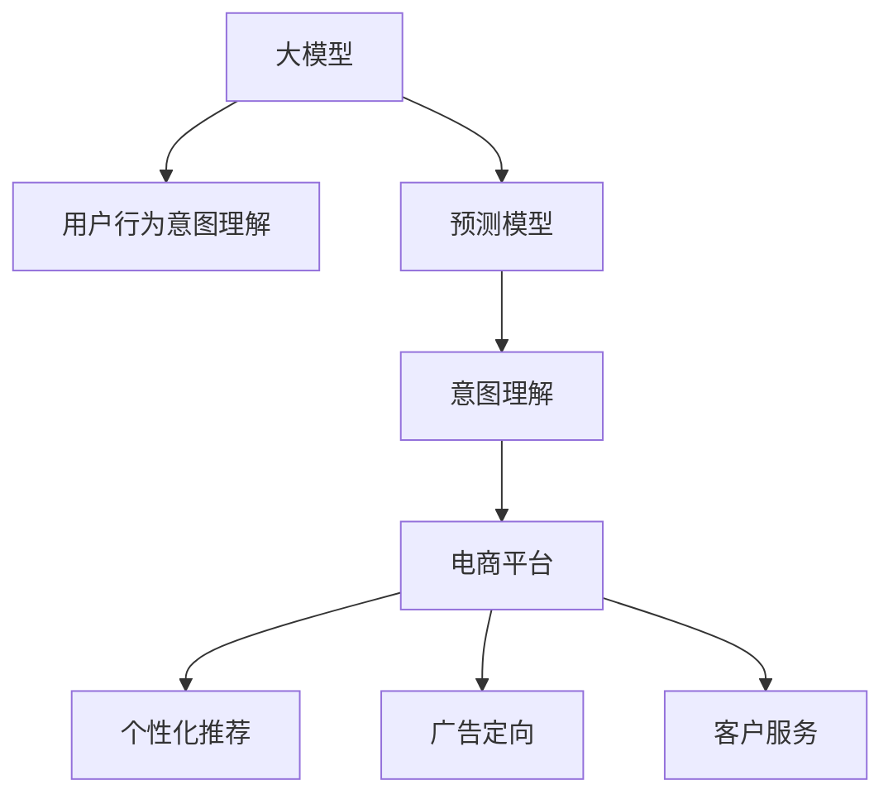

                 

# 探讨大模型在电商平台用户行为意图理解与预测中的潜力

> 关键词：大模型, 电商平台, 用户行为, 意图理解, 预测模型, 自然语言处理, 深度学习

## 1. 背景介绍

随着电子商务的快速发展，电商平台用户行为意图理解与预测在个性化推荐、广告定向、客户服务等多个场景中具有重要价值。传统的机器学习方法，如规则匹配、关联规则挖掘、协同过滤等，在处理海量用户行为数据时，难以处理非结构化和复杂语义信息，限制了其应用效果。近年来，预训练大模型（如BERT、GPT、T5等）通过大规模无监督学习，获得了丰富的语言知识，并已在多个NLP任务上取得了优异表现。

本文旨在探讨大模型在电商平台用户行为意图理解与预测中的潜力，分析其原理、操作步骤、优缺点及应用领域，并给出具体项目实践及未来应用展望。

## 2. 核心概念与联系

### 2.1 核心概念概述

为更好地理解大模型在电商平台用户行为意图理解与预测中的应用，本节将介绍几个密切相关的核心概念：

- **大模型(Large Model)**：指由深度神经网络构建的庞大模型，如BERT、GPT、T5等。通过在大型无标签文本数据上进行自监督学习，大模型获得了通用的语言表示能力。

- **用户行为意图(User Behavior Intent)**：指用户在电商平台上的意图和需求，如购买、浏览、评价等。理解用户意图，有助于提高个性化推荐和广告定向的效果。

- **意图理解(Intent Understanding)**：通过分析用户行为数据，自动推断用户真实意图。常见的方法包括自然语言处理（NLP）、情感分析等。

- **预测模型(Prediction Model)**：基于用户行为数据和历史表现，使用机器学习模型预测用户未来行为。常见模型包括分类模型、回归模型等。

- **电商平台(E-commerce Platform)**：指提供商品交易服务的在线平台，如淘宝、京东、Amazon等。电商平台的个性化推荐、广告定向、客户服务等功能需要依赖用户行为意图理解与预测技术。

- **自然语言处理(Natural Language Processing, NLP)**：通过计算机理解和处理人类语言的技术。大模型在NLP中的应用，能够处理文本数据，提取用户行为信息，辅助意图理解与预测。

这些核心概念之间的逻辑关系可以通过以下Mermaid流程图来展示：



这个流程图展示了大模型在电商平台用户行为意图理解与预测中的应用路径：

1. 大模型通过自监督学习获得语言表示能力，被用于处理用户行为数据，辅助意图理解。
2. 意图理解模型从大模型提取的用户行为信息中推断用户真实意图。
3. 预测模型基于意图理解的结果，进行用户行为预测。
4. 预测结果应用于电商平台，如个性化推荐、广告定向等场景。

## 3. 核心算法原理 & 具体操作步骤

### 3.1 算法原理概述

大模型在电商平台用户行为意图理解与预测中的应用，基于以下关键算法原理：

- **自监督学习**：在大规模无标签数据上进行预训练，学习通用的语言表示，如图形模型、注意力机制等。
- **微调(Fine-Tuning)**：在预训练模型的基础上，使用少量标注数据进行有监督微调，使其适应特定电商平台的意图理解与预测需求。
- **迁移学习**：将通用语言模型应用于电商平台，学习不同电商平台的特定业务知识，提升预测精度。
- **多模态学习**：结合用户行为数据的多样性（文本、图像、点击、评分等），使用多模态学习方法进行用户意图理解与预测。

### 3.2 算法步骤详解

基于大模型在电商平台用户行为意图理解与预测中的应用，其操作步骤如下：

1. **数据准备**：收集电商平台的用户行为数据，包括点击、浏览、评价、购买等记录，并对其进行标注。
2. **模型选择**：选择合适的预训练大模型（如BERT、GPT、T5等），作为意图理解与预测的初始化参数。
3. **微调过程**：使用用户行为数据进行有监督微调，调整大模型参数以适应电商平台的意图理解需求。
4. **意图理解**：使用微调后的大模型，从用户行为数据中提取语义信息，推断用户意图。
5. **预测模型训练**：基于意图理解结果，训练预测模型，预测用户未来行为。
6. **应用部署**：将预测模型集成到电商平台，进行个性化推荐、广告定向等应用。

### 3.3 算法优缺点

大模型在电商平台用户行为意图理解与预测中的应用，具有以下优点：

- **通用性**：大模型通过自监督学习获得通用语言表示能力，适用于不同电商平台的意图理解与预测。
- **灵活性**：通过微调，可以适应特定电商平台的意图需求，提升预测精度。
- **高效性**：大模型在预训练和微调过程中，能够利用并行计算优势，加速模型训练。
- **扩展性**：大模型支持多模态数据融合，能够处理复杂语义信息，提升应用场景的覆盖范围。

同时，该方法也存在一定的局限性：

- **数据依赖**：意图理解与预测模型的性能很大程度上依赖于标注数据的质量和数量。
- **过拟合风险**：大模型参数规模庞大，容易在特定场景下出现过拟合现象。
- **计算成本**：预训练和微调大模型需要强大的计算资源，成本较高。
- **模型复杂性**：大模型的复杂性增加了预测模型的训练和部署难度。

### 3.4 算法应用领域

大模型在电商平台用户行为意图理解与预测中，已经广泛应用于以下几个方面：

- **个性化推荐**：使用用户历史行为数据和意图理解结果，推荐最相关商品，提升用户体验。
- **广告定向**：基于用户意图预测结果，精准投放广告，提高广告转化率。
- **客户服务**：分析用户查询和反馈，预测用户需求，辅助自动化客服系统。
- **库存管理**：预测用户购买意图，优化库存管理，避免缺货和积压。
- **营销活动**：根据用户行为分析，预测营销活动效果，优化活动策略。

这些应用领域展示了大模型在电商平台意图理解与预测中的广泛应用和巨大潜力。未来，随着技术的发展，预计会有更多电商场景需要利用大模型进行深度分析，提升运营效率和用户体验。

## 4. 数学模型和公式 & 详细讲解 & 举例说明

### 4.1 数学模型构建

本文以用户意图理解为例，使用大模型进行意图分类。假设用户行为数据为 $x_1, x_2, \ldots, x_N$，每个 $x_i$ 包含若干特征 $x_{i1}, x_{i2}, \ldots, x_{in}$。使用预训练大模型 $M$ 处理每个特征，得到表示向量 $h_i = M(x_i)$，并通过意图分类器预测用户意图 $y_i$。

### 4.2 公式推导过程

假设用户意图分类为 $K$ 个类别，$K$ 维向量 $y_i \in \{0,1\}^K$，其中 $y_{ik}=1$ 表示用户 $i$ 属于第 $k$ 个意图类别。意图分类问题可以转化为多分类问题，使用softmax函数输出预测概率，计算交叉熵损失函数：

$$
L = -\frac{1}{N} \sum_{i=1}^N \sum_{k=1}^K y_{ik} \log \hat{y}_{ik}
$$

其中 $\hat{y}_{ik} = \frac{\exp(s_k)}{\sum_{j=1}^K \exp(s_j)}$，$s_k = W^{'}_k h_i + b_k$，$W^{'}_k, b_k$ 为意图分类器参数。

### 4.3 案例分析与讲解

以电商平台的商品搜索意图预测为例，使用大模型进行意图分类。假设搜索词 $x_i$ 为“iPhone X”，使用BERT模型进行向量表示 $h_i = M(x_i)$，并通过全连接层进行意图分类，输出意图分类概率向量 $\hat{y}_i$。使用交叉熵损失函数计算预测误差：

$$
L = -\frac{1}{N} \sum_{i=1}^N \sum_{k=1}^K y_{ik} \log \hat{y}_{ik}
$$

其中 $y_{ik} \in \{0,1\}$，$k$ 为意图类别（如“购买”、“浏览”、“评价”等），$\hat{y}_{ik}$ 为预测概率。

假设 $y_{ik} = 1$，则 $L = -\log \hat{y}_{ik}$。使用优化算法（如AdamW）更新模型参数，最小化损失函数 $L$，直至收敛。

## 5. 项目实践：代码实例和详细解释说明

### 5.1 开发环境搭建

在进行用户意图理解与预测的实践前，我们需要准备好开发环境。以下是使用Python进行PyTorch开发的配置流程：

1. 安装Anaconda：从官网下载并安装Anaconda，用于创建独立的Python环境。

2. 创建并激活虚拟环境：
```bash
conda create -n pytorch-env python=3.8 
conda activate pytorch-env
```

3. 安装PyTorch：根据CUDA版本，从官网获取对应的安装命令。例如：
```bash
conda install pytorch torchvision torchaudio cudatoolkit=11.1 -c pytorch -c conda-forge
```

4. 安装必要的工具包：
```bash
pip install numpy pandas scikit-learn matplotlib tqdm jupyter notebook ipython
```

5. 安装BertForSequenceClassification和BertTokenizer：
```bash
pip install transformers
```

完成上述步骤后，即可在`pytorch-env`环境中开始项目实践。

### 5.2 源代码详细实现

我们以电商平台商品搜索意图预测为例，使用BERT模型进行项目实践。

首先，定义数据处理函数：

```python
from transformers import BertTokenizer
from torch.utils.data import Dataset, DataLoader
import torch

class SearchDataset(Dataset):
    def __init__(self, texts, labels):
        self.texts = texts
        self.labels = labels
        self.tokenizer = BertTokenizer.from_pretrained('bert-base-uncased')
        
    def __len__(self):
        return len(self.texts)
    
    def __getitem__(self, item):
        text = self.texts[item]
        label = self.labels[item]
        
        encoding = self.tokenizer(text, return_tensors='pt', truncation=True, padding='max_length')
        input_ids = encoding['input_ids']
        attention_mask = encoding['attention_mask']
        
        return {'input_ids': input_ids, 
                'attention_mask': attention_mask,
                'labels': torch.tensor(label, dtype=torch.long)}
```

然后，定义模型和优化器：

```python
from transformers import BertForSequenceClassification

model = BertForSequenceClassification.from_pretrained('bert-base-uncased', num_labels=3) # 意图分类数为3，购买、浏览、评价

optimizer = torch.optim.AdamW(model.parameters(), lr=2e-5)
```

接着，定义训练和评估函数：

```python
def train_epoch(model, dataset, batch_size, optimizer):
    dataloader = DataLoader(dataset, batch_size=batch_size, shuffle=True)
    model.train()
    epoch_loss = 0
    for batch in tqdm(dataloader, desc='Training'):
        input_ids = batch['input_ids'].to(device)
        attention_mask = batch['attention_mask'].to(device)
        labels = batch['labels'].to(device)
        model.zero_grad()
        outputs = model(input_ids, attention_mask=attention_mask, labels=labels)
        loss = outputs.loss
        epoch_loss += loss.item()
        loss.backward()
        optimizer.step()
    return epoch_loss / len(dataloader)

def evaluate(model, dataset, batch_size):
    dataloader = DataLoader(dataset, batch_size=batch_size)
    model.eval()
    preds, labels = [], []
    with torch.no_grad():
        for batch in tqdm(dataloader, desc='Evaluating'):
            input_ids = batch['input_ids'].to(device)
            attention_mask = batch['attention_mask'].to(device)
            labels = batch['labels'].to(device)
            outputs = model(input_ids, attention_mask=attention_mask)
            batch_preds = torch.argmax(outputs.logits, dim=1).to('cpu').tolist()
            batch_labels = batch_labels.to('cpu').tolist()
            for pred, label in zip(batch_preds, batch_labels):
                preds.append(pred)
                labels.append(label)
                
    return preds, labels

device = torch.device('cuda') if torch.cuda.is_available() else torch.device('cpu')
model.to(device)
```

最后，启动训练流程并在测试集上评估：

```python
epochs = 5
batch_size = 16

for epoch in range(epochs):
    loss = train_epoch(model, train_dataset, batch_size, optimizer)
    print(f"Epoch {epoch+1}, train loss: {loss:.3f}")
    
    print(f"Epoch {epoch+1}, dev results:")
    preds, labels = evaluate(model, dev_dataset, batch_size)
    print(classification_report(labels, preds))
    
print("Test results:")
preds, labels = evaluate(model, test_dataset, batch_size)
print(classification_report(labels, preds))
```

以上就是使用PyTorch对BERT进行商品搜索意图预测的完整代码实现。可以看到，Transformer库封装了BERT模型的API，使得模型训练和推理变得更加简便。

### 5.3 代码解读与分析

让我们再详细解读一下关键代码的实现细节：

**SearchDataset类**：
- `__init__`方法：初始化文本、标签等关键组件，加载BertTokenizer进行文本处理。
- `__len__`方法：返回数据集的样本数量。
- `__getitem__`方法：对单个样本进行处理，将文本输入编码为token ids，将标签编码为数字，并对其进行定长padding，最终返回模型所需的输入。

**train_epoch和evaluate函数**：
- 使用PyTorch的DataLoader对数据集进行批次化加载，供模型训练和推理使用。
- 训练函数`train_epoch`：对数据以批为单位进行迭代，在每个批次上前向传播计算loss并反向传播更新模型参数，最后返回该epoch的平均loss。
- 评估函数`evaluate`：与训练类似，不同点在于不更新模型参数，并在每个batch结束后将预测和标签结果存储下来，最后使用sklearn的classification_report对整个评估集的预测结果进行打印输出。

**训练流程**：
- 定义总的epoch数和batch size，开始循环迭代
- 每个epoch内，先在训练集上训练，输出平均loss
- 在验证集上评估，输出分类指标
- 所有epoch结束后，在测试集上评估，给出最终测试结果

可以看到，PyTorch配合Transformer库使得模型训练和评估变得更加便捷高效。开发者可以将更多精力放在数据处理、模型改进等高层逻辑上，而不必过多关注底层的实现细节。

## 6. 实际应用场景

### 6.1 电商平台个性化推荐

电商平台利用用户行为数据和意图理解模型，为用户推荐个性化商品。基于大模型的意图理解，可以自动推断用户真实需求，从而提升推荐精度。通过与搜索、浏览、购买等行为数据的结合，预测用户下一步可能采取的行动，如点击、购买等，进行动态推荐。

### 6.2 广告定向

广告定向基于用户意图预测结果，精准投放广告，提升广告转化率。通过分析用户浏览记录和搜索意图，预测用户可能感兴趣的广告内容，进行定向投放。大模型可以处理多模态数据，通过文本、图像、点击等多种信息进行用户意图预测，提高广告投放的精准度。

### 6.3 客户服务

智能客服系统通过分析用户查询和反馈，预测用户需求，辅助自动化客服系统。使用大模型理解用户意图，根据意图生成标准回答或推荐解决方案，提高客服响应效率和准确性。

### 6.4 库存管理

库存管理系统通过预测用户购买意图，优化库存管理，避免缺货和积压。使用大模型分析用户历史购买行为和搜索意图，预测未来购买需求，实现库存的动态调整和优化。

### 6.5 营销活动

营销活动根据用户行为分析，预测营销活动效果，优化活动策略。使用大模型理解用户意图，预测活动参与度，调整活动内容和投放策略，提高活动效果和用户参与度。

## 7. 工具和资源推荐

### 7.1 学习资源推荐

为了帮助开发者系统掌握大模型在电商平台用户行为意图理解与预测的理论基础和实践技巧，这里推荐一些优质的学习资源：

1. 《自然语言处理》系列书籍：涵盖自然语言处理的基本概念和常用算法，是理解大模型和意图理解的基础。
2. CS224N《深度学习自然语言处理》课程：斯坦福大学开设的NLP明星课程，有Lecture视频和配套作业，深入浅出地介绍NLP原理和应用。
3. 《Transformers: From Theory to Practice》系列博文：由大模型技术专家撰写，详细解释大模型和微调的实现细节。
4. HuggingFace官方文档：Transformer库的官方文档，提供了海量预训练模型和微调样例代码，是上手实践的必备资料。
5. Weights & Biases：模型训练的实验跟踪工具，可以记录和可视化模型训练过程中的各项指标，方便对比和调优。

通过对这些资源的学习实践，相信你一定能够快速掌握大模型在电商平台意图理解与预测的精髓，并用于解决实际的NLP问题。

### 7.2 开发工具推荐

高效的开发离不开优秀的工具支持。以下是几款用于电商平台意图理解与预测开发的常用工具：

1. PyTorch：基于Python的开源深度学习框架，灵活的计算图，适合快速迭代研究。Transformer库提供了多种预训练大模型，如BERT、GPT等。
2. TensorFlow：由Google主导开发的开源深度学习框架，生产部署方便，适合大规模工程应用。TensorFlow提供了丰富的预训练模型资源。
3. Transformers库：HuggingFace开发的NLP工具库，集成了众多SOTA语言模型，支持PyTorch和TensorFlow，是进行意图理解与预测开发的利器。
4. Weights & Biases：模型训练的实验跟踪工具，可以记录和可视化模型训练过程中的各项指标，方便对比和调优。
5. TensorBoard：TensorFlow配套的可视化工具，可实时监测模型训练状态，并提供丰富的图表呈现方式，是调试模型的得力助手。

合理利用这些工具，可以显著提升大模型在电商平台意图理解与预测的开发效率，加快创新迭代的步伐。

### 7.3 相关论文推荐

大模型在电商平台意图理解与预测中的应用，源于学界的持续研究。以下是几篇奠基性的相关论文，推荐阅读：

1. Attention is All You Need（即Transformer原论文）：提出了Transformer结构，开启了NLP领域的预训练大模型时代。
2. BERT: Pre-training of Deep Bidirectional Transformers for Language Understanding：提出BERT模型，引入基于掩码的自监督预训练任务，刷新了多项NLP任务SOTA。
3. Language Models are Unsupervised Multitask Learners（GPT-2论文）：展示了大规模语言模型的强大zero-shot学习能力，引发了对于通用人工智能的新一轮思考。
4. Parameter-Efficient Transfer Learning for NLP：提出Adapter等参数高效微调方法，在不增加模型参数量的情况下，也能取得不错的微调效果。
5. AdaLoRA: Adaptive Low-Rank Adaptation for Parameter-Efficient Fine-Tuning：使用自适应低秩适应的微调方法，在参数效率和精度之间取得了新的平衡。

这些论文代表了大模型在电商平台意图理解与预测的发展脉络。通过学习这些前沿成果，可以帮助研究者把握学科前进方向，激发更多的创新灵感。

## 8. 总结：未来发展趋势与挑战

### 8.1 总结

本文对基于大模型在电商平台用户行为意图理解与预测进行了全面系统的介绍。首先阐述了意图理解与预测的研究背景和意义，明确了大模型在此类任务中的独特优势。其次，从原理到实践，详细讲解了大模型在电商平台应用的步骤和操作步骤，给出了具体的代码实例。同时，本文还广泛探讨了意图理解与预测方法在电商平台的实际应用场景，展示了大模型在电商平台意图理解与预测中的广泛应用和巨大潜力。最后，本文精选了意图理解与预测技术的各类学习资源，力求为读者提供全方位的技术指引。

通过本文的系统梳理，可以看到，基于大模型在电商平台用户行为意图理解与预测的方法，已经在个性化推荐、广告定向、客户服务等多个场景中得到了广泛应用，显著提升了电商平台的运营效率和用户体验。未来，伴随大模型的进一步发展，可以预见其将在大规模、多模态的用户行为数据处理和意图理解与预测中发挥更大的作用。

### 8.2 未来发展趋势

展望未来，大模型在电商平台用户行为意图理解与预测中，将呈现以下几个发展趋势：

1. 模型规模持续增大。随着算力成本的下降和数据规模的扩张，预训练语言模型的参数量还将持续增长。超大规模语言模型蕴含的丰富语言知识，有望支撑更加复杂多变的电商平台意图理解与预测任务。
2. 微调方法日趋多样。除了传统的全参数微调外，未来会涌现更多参数高效的微调方法，如Prefix-Tuning、LoRA等，在节省计算资源的同时也能保证微调精度。
3. 持续学习成为常态。随着数据分布的不断变化，微调模型也需要持续学习新知识以保持性能。如何在不遗忘原有知识的同时，高效吸收新样本信息，将成为重要的研究课题。
4. 标注样本需求降低。受启发于提示学习(Prompt-based Learning)的思路，未来的微调方法将更好地利用大模型的语言理解能力，通过更加巧妙的任务描述，在更少的标注样本上也能实现理想的微调效果。
5. 多模态微调崛起。当前的微调主要聚焦于纯文本数据，未来会进一步拓展到图像、视频、语音等多模态数据微调。多模态信息的融合，将显著提升语言模型对现实世界的理解和建模能力。
6. 模型通用性增强。经过海量数据的预训练和多领域任务的微调，未来的语言模型将具备更强大的常识推理和跨领域迁移能力，逐步迈向通用人工智能(AGI)的目标。

以上趋势凸显了大模型在电商平台意图理解与预测中的广阔前景。这些方向的探索发展，必将进一步提升电商平台的性能和应用范围，为电商平台运营带来新的突破。

### 8.3 面临的挑战

尽管大模型在电商平台意图理解与预测中已经取得了显著成效，但在迈向更加智能化、普适化应用的过程中，它仍面临着诸多挑战：

1. 标注成本瓶颈。虽然大模型在数据量较少的任务上表现出色的同时，标注数据的获取成本依然较高。如何进一步降低微调对标注样本的依赖，将是一大难题。
2. 模型鲁棒性不足。当前微调模型面对域外数据时，泛化性能往往大打折扣。对于测试样本的微小扰动，微调模型的预测也容易发生波动。如何提高微调模型的鲁棒性，避免灾难性遗忘，还需要更多理论和实践的积累。
3. 推理效率有待提高。大规模语言模型虽然精度高，但在实际部署时往往面临推理速度慢、内存占用大等效率问题。如何在保证性能的同时，简化模型结构，提升推理速度，优化资源占用，将是重要的优化方向。
4. 可解释性亟需加强。当前微调模型更像是"黑盒"系统，难以解释其内部工作机制和决策逻辑。对于电商平台的业务问题，算法的可解释性和可审计性尤为重要。如何赋予微调模型更强的可解释性，将是亟待攻克的难题。
5. 安全性有待保障。预训练语言模型难免会学习到有偏见、有害的信息，通过微调传递到下游任务，产生误导性、歧视性的输出，给实际应用带来安全隐患。如何从数据和算法层面消除模型偏见，避免恶意用途，确保输出的安全性，也将是重要的研究课题。

### 8.4 研究展望

面对大模型在电商平台意图理解与预测中面临的挑战，未来的研究需要在以下几个方面寻求新的突破：

1. 探索无监督和半监督微调方法。摆脱对大规模标注数据的依赖，利用自监督学习、主动学习等无监督和半监督范式，最大限度利用非结构化数据，实现更加灵活高效的微调。
2. 研究参数高效和计算高效的微调范式。开发更加参数高效的微调方法，在固定大部分预训练参数的同时，只更新极少量的任务相关参数。同时优化微调模型的计算图，减少前向传播和反向传播的资源消耗，实现更加轻量级、实时性的部署。
3. 融合因果和对比学习范式。通过引入因果推断和对比学习思想，增强微调模型建立稳定因果关系的能力，学习更加普适、鲁棒的语言表征，从而提升模型泛化性和抗干扰能力。
4. 引入更多先验知识。将符号化的先验知识，如知识图谱、逻辑规则等，与神经网络模型进行巧妙融合，引导微调过程学习更准确、合理的语言模型。同时加强不同模态数据的整合，实现视觉、语音等多模态信息与文本信息的协同建模。
5. 结合因果分析和博弈论工具。将因果分析方法引入微调模型，识别出模型决策的关键特征，增强输出解释的因果性和逻辑性。借助博弈论工具刻画人机交互过程，主动探索并规避模型的脆弱点，提高系统稳定性。
6. 纳入伦理道德约束。在模型训练目标中引入伦理导向的评估指标，过滤和惩罚有偏见、有害的输出倾向。同时加强人工干预和审核，建立模型行为的监管机制，确保输出符合人类价值观和伦理道德。

这些研究方向的探索，必将引领大模型在电商平台意图理解与预测技术迈向更高的台阶，为构建安全、可靠、可解释、可控的智能系统铺平道路。面向未来，大模型在电商平台用户行为意图理解与预测技术还需要与其他人工智能技术进行更深入的融合，如知识表示、因果推理、强化学习等，多路径协同发力，共同推动自然语言理解和智能交互系统的进步。只有勇于创新、敢于突破，才能不断拓展语言模型的边界，让智能技术更好地造福人类社会。

## 9. 附录：常见问题与解答

**Q1：大模型在电商平台用户行为意图理解与预测中，如何处理长尾行为数据？**

A: 长尾行为数据通常指的是用户行为数据中少数但不重要的行为，如极少的点击、评价等。处理长尾行为数据的方法主要包括：
1. 数据增强：通过合成为假的方式，生成更多的长尾数据，增加模型训练数据的覆盖面。
2. 小样本学习：利用微调方法，通过极少量的标注数据进行模型训练，提高模型对长尾数据的泛化能力。
3. 多任务学习：将不同用户行为的预测任务组合起来，同时训练多个意图理解模型，提升模型对长尾数据的适应性。

**Q2：大模型在电商平台用户行为意图理解与预测中，如何避免过拟合？**

A: 避免过拟合的方法主要包括：
1. 数据增强：通过对原始数据进行一些简单的变换，如回译、同义词替换等，生成更多的训练样本。
2. 正则化技术：如L2正则、Dropout、Early Stopping等，防止模型过度适应训练集。
3. 参数高效微调：使用 Adapter等方法，只更新部分任务相关参数，减少过拟合风险。
4. 对抗训练：引入对抗样本，提高模型鲁棒性，减少对特定输入的敏感度。
5. 多模型集成：训练多个意图理解模型，取平均输出，避免个别模型的过拟合。

**Q3：大模型在电商平台用户行为意图理解与预测中，如何提高模型鲁棒性？**

A: 提高模型鲁棒性的方法主要包括：
1. 对抗训练：引入对抗样本，提高模型对输入扰动的鲁棒性。
2. 正则化技术：如L2正则、Dropout等，减少模型对输入数据的敏感度。
3. 模型裁剪：去除不必要的层和参数，减小模型尺寸，提高模型的泛化能力。
4. 多模型融合：训练多个意图理解模型，结合其预测结果，提高模型的鲁棒性。

**Q4：大模型在电商平台用户行为意图理解与预测中，如何提高模型可解释性？**

A: 提高模型可解释性的方法主要包括：
1. 特征可视化：通过可视化模型输入和输出特征，了解模型内部决策过程。
2. 可解释模型：使用可解释模型架构，如LIME、SHAP等，解释模型预测结果。
3. 解释性训练：在模型训练过程中，加入解释性约束，如公平性、透明性等，提高模型的可解释性。

**Q5：大模型在电商平台用户行为意图理解与预测中，如何优化推理效率？**

A: 优化推理效率的方法主要包括：
1. 模型裁剪：去除不必要的层和参数，减小模型尺寸，加快推理速度。
2. 量化加速：将浮点模型转为定点模型，压缩存储空间，提高计算效率。
3. 推理优化：使用推理优化工具，如ONNX、TensorRT等，优化推理速度和资源占用。

这些方法可以帮助大模型在电商平台用户行为意图理解与预测中，提升性能、提高可解释性、优化推理效率，推动大模型技术在电商平台的实际应用。

---

作者：禅与计算机程序设计艺术 / Zen and the Art of Computer Programming

