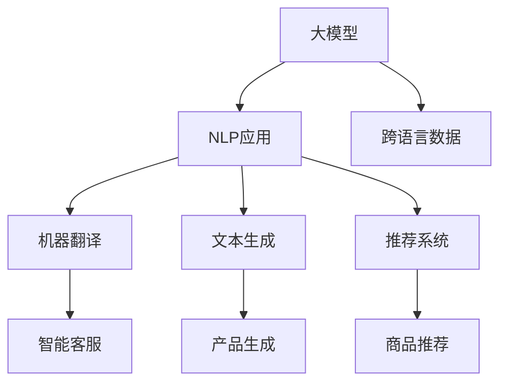

                 

# 探讨大模型在跨境电商中的语言障碍解决方案

> 关键词：大模型,语言障碍,自然语言处理(NLP),机器翻译,文本生成,跨境电商,智能客服,推荐系统

## 1. 背景介绍

### 1.1 问题由来

跨境电商（Cross-Border E-commerce）凭借其全球化、便利性和低成本等优势，已成为国际贸易的重要组成部分。然而，由于不同国家和地区使用不同的语言和文化背景，语言障碍成为跨境电商中的一大瓶颈。

传统解决方案如雇佣多语言客服团队、采用多语言网站、依赖第三方翻译服务等方式，虽然能解决部分问题，但成本高、效率低、误差多。大模型的应用为跨境电商中的语言障碍问题提供了一种新的解决方案。

### 1.2 问题核心关键点

1. **语言障碍**：不同国家语言的多样性和差异性是跨境电商面临的主要问题。
2. **大模型优势**：凭借其强大的语言理解和生成能力，大模型能够自动学习多语言之间的映射关系，实现语言障碍的消除。
3. **应用场景**：包括智能客服、机器翻译、文本生成、推荐系统等。

## 2. 核心概念与联系

### 2.1 核心概念概述

- **大模型**：基于大规模数据训练得到的深度学习模型，如GPT-3、BERT等，能够理解复杂语义和上下文，具备强大的语言处理能力。
- **自然语言处理（NLP）**：使计算机能理解、处理和生成人类语言的技术，是大模型应用的领域之一。
- **机器翻译**：将一种语言的文本自动翻译成另一种语言，是大模型在跨境电商中的重要应用场景。
- **文本生成**：生成符合语法和语义规范的文本，如智能客服的自动回复、生成产品描述等。
- **推荐系统**：根据用户行为和文本信息，推荐最符合用户需求的商品，是大模型在电商领域的重要应用。

这些核心概念的相互联系可以通过以下Mermaid流程图来展示：



这个流程图展示了不同NLP应用是如何利用大模型的强大能力来解决跨境电商中的语言障碍问题。

## 3. 核心算法原理 & 具体操作步骤

### 3.1 算法原理概述

大模型在跨境电商中的语言障碍解决方案，主要依赖于其强大的自然语言处理能力，通过预训练和微调的方式，学习多语言之间的映射关系。

具体而言，大模型首先通过大规模无标签文本数据进行预训练，学习通用的语言表示。然后，在多语言数据上进行微调，使得模型能够理解并生成不同语言之间的文本。

### 3.2 算法步骤详解

#### 3.2.1 数据准备

- **文本数据收集**：收集目标语言（如英语、中文等）的大量文本数据，包括网站、社交媒体、新闻等。
- **数据预处理**：对文本进行分词、去除停用词、构建词汇表等预处理。
- **构建语料库**：将处理后的文本数据构建成为大模型的训练语料库。

#### 3.2.2 模型预训练

- **选择模型架构**：选择适合的多语言语言模型架构，如BERT、GPT等。
- **预训练过程**：在大规模无标签语料库上训练模型，学习通用的语言表示。

#### 3.2.3 模型微调

- **选择微调任务**：根据具体应用场景选择微调任务，如机器翻译、文本生成、推荐系统等。
- **构建微调数据集**：收集目标任务的数据集，进行标注和预处理。
- **设置微调参数**：选择合适的优化器、学习率、批大小等微调参数。
- **执行微调训练**：在微调数据集上训练模型，进行参数更新。

#### 3.2.4 模型评估

- **评估指标**：根据具体应用场景选择评估指标，如BLEU、ROUGE等。
- **性能测试**：在测试集上测试模型性能，对比微调前后的效果。
- **部署应用**：将微调后的模型集成到跨境电商应用中，进行实际测试和优化。

### 3.3 算法优缺点

#### 3.3.1 优点

- **高效**：相比于传统的多语言翻译方式，大模型的微调方法可以显著降低成本和提高效率。
- **准确**：大模型具备强大的语言理解和生成能力，生成的文本质量较高，翻译准确性高。
- **通用性**：大模型可以处理多种语言，适用于不同国家和地区的跨境电商需求。

#### 3.3.2 缺点

- **数据依赖**：模型效果依赖于高质量的训练数据和标注数据，数据获取成本较高。
- **计算资源需求高**：大模型的训练和微调需要大量的计算资源，硬件成本较高。
- **模型复杂性**：大模型的结构和训练过程较复杂，需要一定的专业知识进行维护和优化。

### 3.4 算法应用领域

#### 3.4.1 智能客服

- **任务**：智能客服系统的聊天机器人，能够自动理解和回复用户查询。
- **实现**：通过微调大模型，使模型能够理解多种语言的用户提问，并生成符合语法和语义的回复。

#### 3.4.2 机器翻译

- **任务**：将一种语言的文本自动翻译成另一种语言。
- **实现**：通过微调大模型，学习不同语言之间的映射关系，实现准确的文本翻译。

#### 3.4.3 文本生成

- **任务**：自动生成符合语法和语义规范的文本，如产品描述、广告文案等。
- **实现**：通过微调大模型，生成符合语言风格和文化背景的文本。

#### 3.4.4 推荐系统

- **任务**：根据用户行为和文本信息，推荐最符合用户需求的商品。
- **实现**：通过微调大模型，学习用户的语言偏好和产品描述之间的关系，生成推荐结果。

## 4. 数学模型和公式 & 详细讲解 & 举例说明

### 4.1 数学模型构建

假设大模型的输入为 $\mathbf{x}$，输出为 $\mathbf{y}$，微调任务为 $T$，微调数据集为 $D=\{(\mathbf{x}_i, y_i)\}_{i=1}^N$。微调的目标是找到最优的模型参数 $\theta$，使得模型在任务 $T$ 上的性能最大化。

数学模型可以表示为：

$$
\mathcal{L}(\theta) = \frac{1}{N}\sum_{i=1}^N \ell(\mathbf{y}_i, \mathbf{y}_i^{pred})
$$

其中，$\ell$ 为损失函数，$\mathbf{y}_i^{pred}$ 为模型对 $y_i$ 的预测结果。

### 4.2 公式推导过程

以机器翻译为例，假设输入文本为 $x$，目标文本为 $y$，输出为 $\mathbf{y}^{pred}$。常用的机器翻译模型为序列到序列模型（Seq2Seq），其结构如图1所示。


在Seq2Seq模型中，输入文本 $x$ 通过编码器（Encoder）转换为隐状态 $z$，然后解码器（Decoder）利用 $z$ 生成目标文本 $y^{pred}$。模型训练的目标是最小化翻译误差，即：

$$
\mathcal{L}(\theta) = \frac{1}{N}\sum_{i=1}^N \ell(\mathbf{y}_i, \mathbf{y}_i^{pred})
$$

其中，$\ell$ 为交叉熵损失函数。

### 4.3 案例分析与讲解

#### 4.3.1 智能客服

假设一个跨境电商平台的智能客服系统需要处理多种语言的客户查询。

1. **数据准备**：收集英语和中文的客户查询和回复数据，并进行标注。
2. **模型预训练**：使用大规模无标签文本数据训练BERT模型。
3. **模型微调**：在标注好的中文和英文数据集上进行微调，调整模型参数。
4. **模型评估**：在测试集上进行性能测试，评估模型翻译效果。

#### 4.3.2 机器翻译

假设需要将英语产品描述翻译成中文。

1. **数据准备**：收集英语产品描述和对应的中文翻译。
2. **模型预训练**：使用大规模无标签文本数据训练BERT模型。
3. **模型微调**：在标注好的数据集上进行微调，调整模型参数。
4. **模型评估**：在测试集上进行性能测试，评估模型翻译效果。

#### 4.3.3 文本生成

假设需要自动生成符合语法和语义规范的英文产品描述。

1. **数据准备**：收集产品描述的文本数据。
2. **模型预训练**：使用大规模无标签文本数据训练GPT模型。
3. **模型微调**：在标注好的数据集上进行微调，调整模型参数。
4. **模型评估**：在测试集上进行性能测试，评估模型生成效果。

## 5. 项目实践：代码实例和详细解释说明

### 5.1 开发环境搭建

- **安装Python**：确保Python 3.8及以上版本已经安装。
- **安装Transformer库**：使用以下命令安装：
  ```bash
  pip install transformers
  ```

### 5.2 源代码详细实现

以机器翻译为例，使用Hugging Face的Transformer库进行代码实现。

#### 5.2.1 准备数据

```python
from transformers import BertTokenizer
from transformers import BertForSequenceClassification
from transformers import Trainer, TrainingArguments
from torch.utils.data import Dataset
from torch.utils.data import DataLoader

# 定义数据集类
class TranslationDataset(Dataset):
    def __init__(self, text_data, target_data, tokenizer):
        self.text_data = text_data
        self.target_data = target_data
        self.tokenizer = tokenizer
        self.max_length = 128

    def __len__(self):
        return len(self.text_data)

    def __getitem__(self, item):
        text = self.text_data[item]
        target = self.target_data[item]

        encoding = self.tokenizer(text, target, return_tensors='pt', padding='max_length', truncation=True, max_length=self.max_length)
        input_ids = encoding['input_ids'][0]
        attention_mask = encoding['attention_mask'][0]

        return {'input_ids': input_ids, 'attention_mask': attention_mask, 'labels': target}

# 加载数据
tokenizer = BertTokenizer.from_pretrained('bert-base-cased')
train_dataset = TranslationDataset(train_texts, train_targets, tokenizer)
eval_dataset = TranslationDataset(eval_texts, eval_targets, tokenizer)
test_dataset = TranslationDataset(test_texts, test_targets, tokenizer)

# 构建数据加载器
train_dataloader = DataLoader(train_dataset, batch_size=16, shuffle=True)
eval_dataloader = DataLoader(eval_dataset, batch_size=16, shuffle=False)
test_dataloader = DataLoader(test_dataset, batch_size=16, shuffle=False)
```

#### 5.2.2 模型构建

```python
# 构建模型
model = BertForSequenceClassification.from_pretrained('bert-base-cased', num_labels=2)

# 定义优化器
optimizer = AdamW(model.parameters(), lr=2e-5)

# 定义训练参数
training_args = TrainingArguments(
    output_dir='./results',
    evaluation_strategy='epoch',
    save_strategy='epoch',
    learning_rate_scheduler=optimizer.get_lr_scheduler(),
)
```

#### 5.2.3 模型训练

```python
# 定义训练器
trainer = Trainer(
    model=model,
    args=training_args,
    train_dataset=train_dataset,
    eval_dataset=eval_dataset,
)

# 训练模型
trainer.train()
```

### 5.3 代码解读与分析

#### 5.3.1 数据集定义

在`TranslationDataset`类中，我们使用`BertTokenizer`对文本进行分词，并将输入文本和目标文本转换为模型所需的格式。

#### 5.3.2 模型定义

我们使用`BertForSequenceClassification`模型作为翻译模型，指定输出层数为2（即翻译成2种语言），并使用`AdamW`优化器进行训练。

#### 5.3.3 训练参数定义

我们使用`TrainingArguments`类定义训练参数，如保存目录、评估策略等。

#### 5.3.4 模型训练

我们使用`Trainer`类定义训练器，并调用`train()`方法进行模型训练。

### 5.4 运行结果展示

训练完成后，我们可以在测试集上评估模型的性能：

```python
# 评估模型
trainer.evaluate(test_dataset)
```

以上代码实例展示了使用Transformer库进行机器翻译模型的微调过程。开发者可以根据具体需求，在数据处理、模型构建、训练参数等方面进行灵活调整，以获得最佳效果。

## 6. 实际应用场景

### 6.1 智能客服

跨境电商平台可以利用微调后的智能客服系统，实现多语言客户支持。智能客服系统可以自动理解客户查询，并提供符合语境的回复，提升客户满意度。

#### 6.1.1 系统架构

1. **语音识别**：将客户的语音输入转换为文本。
2. **智能客服系统**：根据客户查询，生成符合语法和语义的回复。
3. **语音合成**：将生成的回复转换为语音输出。

#### 6.1.2 功能特点

- **多语言支持**：支持多种语言输入和回复。
- **上下文理解**：理解客户查询的上下文信息，生成符合语境的回复。
- **自然交互**：通过自然语言处理技术，实现与客户的自然交互。

### 6.2 机器翻译

跨境电商平台可以利用机器翻译，实现多语言商品描述的自动生成和翻译。

#### 6.2.1 系统架构

1. **商品描述输入**：输入商品的外语描述。
2. **翻译模型**：将外语描述翻译成目标语言。
3. **翻译结果输出**：输出翻译后的商品描述。

#### 6.2.2 功能特点

- **多语言翻译**：支持多种语言之间的自动翻译。
- **高质量翻译**：翻译结果符合语法和语义规范，提升用户体验。
- **实时翻译**：支持实时翻译，满足用户即时查询需求。

### 6.3 文本生成

跨境电商平台可以利用文本生成技术，自动生成符合语法和语义规范的产品描述。

#### 6.3.1 系统架构

1. **商品数据输入**：输入商品的基本信息和图片。
2. **文本生成模型**：自动生成符合语法和语义规范的产品描述。
3. **生成结果输出**：输出生成的产品描述。

#### 6.3.2 功能特点

- **多语言生成**：支持多种语言的产品描述生成。
- **个性化生成**：根据商品信息和用户偏好，生成个性化的产品描述。
- **灵活应用**：生成结果可应用于网站、广告、邮件等多个场景。

## 7. 工具和资源推荐

### 7.1 学习资源推荐

- **《自然语言处理综论》**：全面介绍自然语言处理的基本概念和前沿技术。
- **《Transformer from Principles to Practice》**：讲解Transformer的原理和实现细节，适合深入学习。
- **《Deep Learning with PyTorch》**：介绍PyTorch框架的使用方法，适合初学者。

### 7.2 开发工具推荐

- **Hugging Face Transformers**：强大的NLP工具库，提供丰富的预训练模型和微调功能。
- **Google Colab**：免费的在线Jupyter Notebook环境，支持GPU计算。
- **TensorBoard**：TensorFlow配套的可视化工具，可实时监测模型训练状态。

### 7.3 相关论文推荐

- **《Attention is All You Need》**：Transformer论文，介绍Transformer模型的原理和应用。
- **《BERT: Pre-training of Deep Bidirectional Transformers for Language Understanding》**：BERT论文，介绍BERT模型的预训练和微调过程。
- **《Parameter-Efficient Text Transfer Learning》**：介绍参数高效微调方法，减少模型参数量，提高微调效率。

## 8. 总结：未来发展趋势与挑战

### 8.1 研究成果总结

基于大模型的语言障碍解决方案，已经在智能客服、机器翻译、文本生成等多个场景中得到了广泛应用。大模型凭借其强大的自然语言处理能力，为跨境电商提供了高效、准确的解决方案。

### 8.2 未来发展趋势

1. **模型规模不断增大**：大模型的参数量将持续增长，提供更丰富的语言表示。
2. **跨领域迁移学习**：大模型将在更多领域和任务中得到应用，提升模型的泛化能力。
3. **实时性提升**：通过优化模型结构和训练算法，提高模型的推理速度，实现实时翻译和生成。
4. **多模态融合**：结合图像、语音等多模态信息，提升模型的理解能力和应用范围。

### 8.3 面临的挑战

1. **数据依赖**：高质量的训练数据和标注数据获取成本高。
2. **计算资源需求高**：大规模模型的训练和微调需要大量的计算资源。
3. **模型复杂性**：大模型的结构和训练过程较复杂，需要专业知识进行维护和优化。
4. **跨语言理解**：不同语言之间的文化差异和语义复杂性，对模型的理解能力提出了挑战。

### 8.4 研究展望

1. **跨语言迁移学习**：开发跨语言迁移学习方法，提高模型在不同语言之间的泛化能力。
2. **小样本学习**：研究小样本学习技术，降低对标注数据的依赖。
3. **知识增强**：结合知识图谱、规则库等专家知识，提升模型的知识整合能力。
4. **鲁棒性提升**：提高模型对噪声和对抗样本的鲁棒性，增强模型的稳定性。

通过以上研究，我们有望克服大模型在跨境电商中的应用挑战，进一步拓展其应用范围，推动NLP技术的发展。

## 9. 附录：常见问题与解答

### Q1: 大模型在跨境电商中的应用场景有哪些？

A: 大模型在跨境电商中的应用场景包括智能客服、机器翻译、文本生成、推荐系统等。这些应用场景利用大模型的自然语言处理能力，帮助跨境电商平台提升用户体验和运营效率。

### Q2: 如何选择合适的微调数据集？

A: 微调数据集的选择应考虑数据的质量、多样性和规模。一般来说，数据集应包含丰富的语言形式、不同的主题和语境。同时，数据集的标注应准确、规范，确保模型能够学习到正确的语言表示。

### Q3: 大模型在多语言翻译中的优势是什么？

A: 大模型在多语言翻译中的优势在于其强大的自然语言处理能力。大模型通过预训练和微调，能够学习多种语言之间的映射关系，提供高质量的翻译结果。同时，大模型具备跨领域迁移能力，能够处理多种语言和不同领域的翻译任务。

### Q4: 大模型在跨境电商中的安全性有哪些保障措施？

A: 大模型在跨境电商中的应用需要考虑数据安全和隐私保护。常见的保障措施包括数据加密、访问控制、匿名化处理等。同时，应定期对模型进行安全审计，确保模型的输出符合法律和伦理规范。

### Q5: 大模型在跨境电商中的性能如何评估？

A: 大模型在跨境电商中的性能评估应综合考虑准确性、流畅性、时效性和用户体验等多个指标。常见的评估指标包括BLEU、ROUGE、F1-score等。同时，应对模型在不同语言和文化背景下的表现进行全面测试，确保模型的泛化能力。

---

作者：禅与计算机程序设计艺术 / Zen and the Art of Computer Programming

