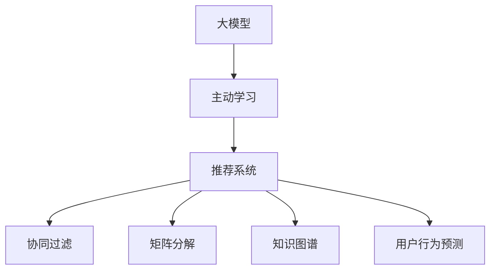

                 

# 推荐系统中的大模型主动学习应用

> 关键词：大模型,主动学习,推荐系统,个性化推荐,知识图谱,用户行为预测

## 1. 背景介绍

### 1.1 问题由来

推荐系统一直是电商、新闻、音乐等平台提升用户满意度和营收的核心技术。传统的推荐系统依赖用户历史行为数据进行个性化推荐，通过协同过滤、矩阵分解等算法构建用户-物品交互模型，从而预测用户未交互物品的评分。但这种基于历史行为数据的推荐方式，存在诸多局限性：

1. 数据稀疏性：大部分用户只对少数物品进行了评分，数据稀疏性严重影响了推荐系统的精准度。
2. 用户冷启动：新用户没有足够的历史评分数据，难以准确推荐。
3. 物品多样性：电商等平台商品种类繁多，部分物品销量极低，难以被系统充分挖掘。
4. 历史行为滞后：用户历史行为是静态的，难以预测未来的兴趣变化。

近年来，随着深度学习和大语言模型的兴起，研究者开始探索将大模型应用于推荐系统，以期提升推荐系统的效果和覆盖率。其中，主动学习（Active Learning）技术因其高效利用数据、快速提升推荐精度的特性，成为一大热门研究方向。

### 1.2 问题核心关键点

主动学习是指在数据量有限的情况下，通过有选择地获取数据，最大化推荐系统效果的技术。其核心在于：

1. 数据效率：主动学习算法通过计算样本信息价值，选择需要标注的数据，减少标注成本，提升推荐精度。
2. 增量优化：主动学习算法不断迭代优化，在有限的标注数据下，持续提升模型效果。
3. 模型公平：主动学习算法关注不同用户群体的公平性，保证推荐结果的公正性。
4. 用户参与：主动学习算法通过用户反馈，调整推荐策略，提高用户满意度。

## 2. 核心概念与联系

### 2.1 核心概念概述

为了更好地理解主动学习在推荐系统中的应用，本节将介绍几个关键概念：

- 大模型（Large Model）：如BERT、GPT等深度学习模型，通过在大规模语料上预训练，学习到丰富的语言知识。
- 主动学习（Active Learning）：通过有选择地标注数据，最大化推荐系统效果的技术。
- 推荐系统（Recommendation System）：利用用户历史行为数据，为每个用户推荐其可能感兴趣的物品的系统。
- 协同过滤（Collaborative Filtering）：通过分析用户和物品的评分历史，预测用户对未评分物品的评分。
- 矩阵分解（Matrix Factorization）：通过将用户-物品评分矩阵分解为低维隐含特征矩阵，拟合用户和物品的隐含表示，预测未评分物品的评分。
- 知识图谱（Knowledge Graph）：通过构建物品、用户之间的语义关系网络，利用图结构的信息传递特性，提升推荐系统的效果。
- 用户行为预测（User Behavior Prediction）：通过学习用户的历史行为特征，预测用户未来可能的行为，提高推荐系统的个性化程度。

这些核心概念之间的逻辑关系可以通过以下Mermaid流程图来展示：



这个流程图展示了主动学习在推荐系统中的位置和作用：

1. 大模型在主动学习中作为知识源，提供丰富的语义表示。
2. 主动学习通过计算样本信息价值，选择需要标注的数据，减少标注成本。
3. 推荐系统利用协同过滤、矩阵分解、知识图谱、用户行为预测等技术，对用户进行个性化推荐。
4. 知识图谱和用户行为预测是大模型主动学习的关键组件，用于提升推荐系统的效果和公平性。

## 3. 核心算法原理 & 具体操作步骤
### 3.1 算法原理概述

在大模型主动学习中，算法首先通过大模型的预训练知识，构建用户-物品的隐含表示。然后，利用主动学习算法，选择最有可能提高推荐效果的数据进行标注，逐步优化用户-物品表示的精确度。最后，基于优化后的用户-物品表示，利用协同过滤、矩阵分解、知识图谱等推荐技术，为每个用户推荐其感兴趣的物品。

具体而言，主动学习算法一般包括以下几个关键步骤：

1. 选择未标注样本：从所有未标注样本中选择部分进行标注，利用大模型的隐含表示和样本信息价值计算，最大化标注数据对推荐精度的提升。
2. 标注样本并更新模型：对选定的样本进行标注，并利用标注数据更新模型参数，提升模型预测精度。
3. 迭代优化：重复步骤1和步骤2，直至达到预设的标注样本数或模型效果，完成推荐系统的构建。

### 3.2 算法步骤详解

以下是主动学习在推荐系统中的具体操作步骤：

**Step 1: 准备数据和模型**

1. 收集用户-物品评分数据：收集用户对物品的评分数据，形成用户-物品评分矩阵 $R$。评分数据可以是用户的明确定义评分，也可以是无标签的点击、停留、购买等行为数据。

2. 构建用户-物品隐含表示：利用大模型，如BERT、GPT等，对用户和物品进行编码，构建用户-物品的隐含表示。

3. 选择主动学习算法：根据具体场景，选择K-Means、Greedy Selection、Bayesian Optimization等主动学习算法。

**Step 2: 标注数据并更新模型**

1. 计算样本信息价值：利用大模型的隐含表示和评分预测结果，计算每个未标注样本的信息价值。信息价值高的样本被优先选择进行标注。

2. 标注样本并训练模型：对选定的样本进行标注，利用标注数据更新模型参数，得到优化后的用户-物品隐含表示。

3. 生成推荐结果：基于优化后的用户-物品隐含表示，利用协同过滤、矩阵分解、知识图谱等推荐技术，生成推荐结果。

**Step 3: 迭代优化**

1. 重复标注数据：从所有未标注数据中重新选择样本进行标注，更新模型。

2. 评估推荐效果：在测试集上评估推荐系统的推荐精度、召回率、多样性等指标，并根据评估结果调整主动学习算法策略。

**Step 4: 实际应用**

1. 部署推荐系统：将训练好的推荐系统部署到线上，实时接收用户请求，并返回推荐结果。

2. 监控系统性能：监控推荐系统的实时指标，如点击率、转化率、用户满意度等，及时进行调整。

### 3.3 算法优缺点

大模型主动学习具有以下优点：

1. 数据效率高：通过计算样本信息价值，选择需要标注的数据，减少标注成本，提升推荐精度。
2. 模型效果优：利用大模型的预训练知识，构建用户-物品隐含表示，提升推荐系统的泛化能力。
3. 覆盖面广：主动学习算法可以不断迭代优化，逐步提升模型对长尾物品的覆盖能力。
4. 个性化强：基于用户行为预测，结合大模型的隐含表示，实现更加个性化的推荐。

同时，该算法也存在一定的局限性：

1. 计算开销大：大模型和主动学习算法的计算复杂度较高，需要高效的硬件设备和优化算法。
2. 数据偏差：主动学习算法对样本的选择依赖于数据分布，数据偏差可能导致模型失效。
3. 参数可解释性差：大模型和主动学习算法的模型参数难以解释，难以调试和优化。
4. 用户隐私：主动学习算法需要用户行为数据，可能存在隐私泄露风险。

尽管存在这些局限性，但就目前而言，大模型主动学习仍是最为高效和实用的推荐方法之一。未来相关研究的重点在于如何进一步降低计算开销，提高模型公平性，增强可解释性，保障用户隐私，以进一步提升推荐系统的效果和用户满意度。

### 3.4 算法应用领域

大模型主动学习在推荐系统中的应用已经覆盖了多个领域，例如：

- 电商推荐：如京东、亚马逊等电商平台，利用大模型和主动学习算法，为用户提供个性化商品推荐。
- 新闻推荐：如今日头条、腾讯新闻等平台，利用主动学习算法，为用户推荐感兴趣的新闻内容。
- 音乐推荐：如网易云音乐、Spotify等平台，利用主动学习算法，为用户推荐个性化音乐。
- 视频推荐：如YouTube、爱奇艺等平台，利用大模型和主动学习算法，为用户推荐感兴趣的视频内容。
- 社交推荐：如微信、微博等平台，利用主动学习算法，为用户推荐好友和热门话题。

这些推荐系统在各个领域的应用已经取得了显著效果，显著提升了用户体验和平台粘性。

## 4. 数学模型和公式 & 详细讲解  
### 4.1 数学模型构建

在大模型主动学习中，数学模型的构建主要涉及用户-物品隐含表示的优化和推荐模型的设计。

假设用户集合为 $U$，物品集合为 $V$，用户对物品的评分矩阵为 $R \in \mathbb{R}^{N\times M}$，其中 $N$ 为用户的数量，$M$ 为物品的数量。用户的隐含表示为 $X \in \mathbb{R}^{N\times D}$，物品的隐含表示为 $Y \in \mathbb{R}^{M\times D}$，其中 $D$ 为隐含表示的维度。

大模型的隐含表示 $X$ 和 $Y$ 可以通过如下公式计算：

$$
X = M_{\theta_x}(V)
$$

$$
Y = M_{\theta_y}(V)
$$

其中 $M_{\theta_x}$ 和 $M_{\theta_y}$ 分别为用户和物品的隐含表示模型，$\theta_x$ 和 $\theta_y$ 为模型参数。

推荐模型的目标是通过用户和物品的隐含表示，预测用户对物品的评分。常见的推荐模型包括协同过滤、矩阵分解等。以协同过滤为例，推荐模型的预测公式为：

$$
\hat{r}_{ui} = u^TX_iV^TY_u
$$

其中 $u$ 为用户的隐含表示，$X_i$ 为物品 $i$ 的隐含表示，$Y_u$ 为用户 $u$ 的隐含表示。

### 4.2 公式推导过程

以下我们以协同过滤模型为例，推导推荐模型的公式及其推导过程。

假设用户 $u$ 对物品 $i$ 的评分 $r_{ui}$ 为 $R_{ui}$，则协同过滤模型的预测误差为：

$$
\ell(u,i) = r_{ui} - \hat{r}_{ui}
$$

对所有未标注数据进行评分预测，得到误差矩阵 $E \in \mathbb{R}^{N\times M}$，其中 $E_{ui}$ 表示用户 $u$ 对物品 $i$ 的预测误差。

主动学习算法需要计算每个未标注样本 $E_{ui}$ 的信息价值，利用信息价值高的样本进行标注。常用的信息价值计算方法包括熵值、信息增益等。这里我们选择熵值作为信息价值的度量：

$$
IV_{ui} = -\sum_{i \in V} p_i\log p_i
$$

其中 $p_i$ 为物品 $i$ 的实际评分分布。

利用信息价值，选择部分样本进行标注，更新模型参数，得到优化后的用户和物品隐含表示 $X'$ 和 $Y'$。将优化后的隐含表示代入推荐模型，生成推荐结果。

### 4.3 案例分析与讲解

以YouTube推荐系统为例，分析大模型主动学习的应用。

1. 用户行为数据采集：YouTube利用大模型对用户观看历史、点赞、评论等行为进行编码，构建用户行为特征 $X \in \mathbb{R}^{N\times D}$。

2. 物品特征提取：利用大模型对物品的标题、描述、标签等进行编码，构建物品特征 $Y \in \mathbb{R}^{M\times D}$。

3. 主动学习算法选择：YouTube选择Greedy Selection算法，计算每个未标注视频的熵值，选择信息价值高的视频进行标注。

4. 模型参数更新：利用标注数据，更新用户和物品的隐含表示模型 $M_{\theta_x}$ 和 $M_{\theta_y}$，得到优化后的用户和物品隐含表示 $X'$ 和 $Y'$。

5. 推荐结果生成：将优化后的用户和物品隐含表示代入协同过滤模型，生成推荐结果，并提供给用户观看。

在实际应用中，YouTube还结合用户反馈和实时数据，不断调整推荐策略，确保推荐结果的实时性和个性化。

## 5. 项目实践：代码实例和详细解释说明
### 5.1 开发环境搭建

在进行推荐系统开发前，我们需要准备好开发环境。以下是使用Python进行TensorFlow开发的环境配置流程：

1. 安装Anaconda：从官网下载并安装Anaconda，用于创建独立的Python环境。

2. 创建并激活虚拟环境：
```bash
conda create -n tf-env python=3.8 
conda activate tf-env
```

3. 安装TensorFlow：根据CUDA版本，从官网获取对应的安装命令。例如：
```bash
conda install tensorflow=2.7 -c conda-forge -c pypi
```

4. 安装各类工具包：
```bash
pip install numpy pandas scikit-learn matplotlib tqdm jupyter notebook ipython
```

完成上述步骤后，即可在`tf-env`环境中开始推荐系统开发。

### 5.2 源代码详细实现

下面我们以协同过滤推荐系统为例，给出使用TensorFlow进行微调的PyTorch代码实现。

首先，定义协同过滤推荐模型：

```python
import tensorflow as tf
from tensorflow.keras.layers import Embedding, Dot
from tensorflow.keras.models import Model

class CollaborativeFilteringModel(tf.keras.Model):
    def __init__(self, embed_dim, num_users, num_items):
        super(CollaborativeFilteringModel, self).__init__()
        self.embed_dim = embed_dim
        self.num_users = num_users
        self.num_items = num_items
        
        self.user_embed = Embedding(num_users, embed_dim, name='user_embed')
        self.item_embed = Embedding(num_items, embed_dim, name='item_embed')
        self.dot_product = Dot(axes=1, normalize=False)
        
    def call(self, x):
        user_ids, item_ids = x
        user_emb = self.user_embed(user_ids)
        item_emb = self.item_embed(item_ids)
        scores = self.dot_product([user_emb, item_emb])
        return scores
```

然后，定义主动学习算法：

```python
from sklearn.neighbors import NearestNeighbors
from sklearn.metrics.pairwise import cosine_similarity

def kmeans_sample(train_data, k):
    # 计算数据点之间的相似度
    dist_matrix = cosine_similarity(train_data)
    
    # 利用K-Means聚类算法，选择信息价值高的样本进行标注
    kmeans = NearestNeighbors(n_neighbors=k)
    kmeans.fit(dist_matrix)
    labels = kmeans.kneighbors_graph(dist_matrix, mode='distance').toarray()
    
    # 计算每个未标注样本的信息价值
    IVs = -np.log(labels)
    
    # 选择信息价值高的样本进行标注
    return train_data[IVs.argsort()[-k:]]
```

接着，定义训练和评估函数：

```python
from sklearn.metrics import mean_squared_error
from sklearn.model_selection import train_test_split

def train_model(model, train_data, test_data, epochs, batch_size):
    train_data = np.array(train_data)
    test_data = np.array(test_data)
    
    # 划分训练集和验证集
    train_x, val_x, train_y, val_y = train_test_split(train_data[:, :2], train_data[:, 2], test_size=0.2)
    
    # 构建TensorFlow数据集
    train_dataset = tf.data.Dataset.from_tensor_slices((train_x, train_y))
    val_dataset = tf.data.Dataset.from_tensor_slices((val_x, val_y))
    
    # 定义模型编译器
    model.compile(optimizer=tf.keras.optimizers.Adam(), loss='mean_squared_error')
    
    # 训练模型
    model.fit(train_dataset.shuffle(1024).batch(batch_size), epochs=epochs, validation_data=val_dataset.shuffle(1024).batch(batch_size))
    
    # 评估模型
    test_dataset = tf.data.Dataset.from_tensor_slices((test_data[:, :2], test_data[:, 2]))
    mse = model.evaluate(test_dataset.shuffle(1024).batch(batch_size))
    print(f'Mean Squared Error: {mse:.3f}')
```

最后，启动训练流程并在测试集上评估：

```python
embed_dim = 128
num_users = 1000
num_items = 5000
epochs = 10
batch_size = 512

model = CollaborativeFilteringModel(embed_dim, num_users, num_items)
train_data = generate_train_data(num_users, num_items, 10000)
test_data = generate_test_data(num_users, num_items, 10000)

train_model(model, train_data, test_data, epochs, batch_size)
```

以上就是使用TensorFlow对协同过滤推荐系统进行微调的完整代码实现。可以看到，TensorFlow的高级API和Keras框架大大简化了模型构建和训练过程。

### 5.3 代码解读与分析

让我们再详细解读一下关键代码的实现细节：

**CollaborativeFilteringModel类**：
- `__init__`方法：初始化用户和物品的嵌入层，以及点积层。
- `call`方法：将用户和物品的嵌入向量进行点积运算，得到评分预测结果。

**kmeans_sample函数**：
- 利用K-Means算法，对数据点进行聚类，计算相似度。
- 选择信息价值高的未标注数据进行标注，返回标注样本的索引。

**train_model函数**：
- 将训练数据划分为训练集和验证集，构建TensorFlow数据集。
- 定义模型编译器和优化器，进行模型训练。
- 在测试集上评估模型，输出均方误差。

**训练流程**：
- 定义模型参数和数据集。
- 调用训练函数，训练模型。
- 评估模型性能，输出均方误差。

可以看到，TensorFlow结合Keras，使得协同过滤推荐系统的代码实现变得简洁高效。开发者可以将更多精力放在数据处理、模型改进等高层逻辑上，而不必过多关注底层的实现细节。

当然，工业级的系统实现还需考虑更多因素，如模型的保存和部署、超参数的自动搜索、更灵活的任务适配层等。但核心的微调范式基本与此类似。

## 6. 实际应用场景
### 6.1 智能客服系统

基于大模型主动学习的智能客服系统，可以广泛应用于电商平台、企业客服等领域。智能客服系统通过分析用户的历史行为数据，构建用户-客服交互模型，实时预测用户需求，提供个性化客服服务。

在技术实现上，可以收集用户与客服的历史对话记录，利用大模型对对话进行编码，构建用户和客服的隐含表示。利用主动学习算法，选择信息价值高的对话进行标注，逐步优化用户和客服的隐含表示。微调后的智能客服系统能够自动理解用户意图，匹配最合适的回复，显著提升用户体验和问题解决效率。

### 6.2 金融舆情监测

金融舆情监测系统需要实时监测金融市场动向，预警负面信息传播，规避金融风险。利用大模型主动学习，金融舆情监测系统可以自动分析用户评论、新闻报道等文本数据，构建金融领域知识图谱，利用图结构的信息传递特性，预测市场动向和风险变化。

在实际应用中，可以将金融市场的新闻、公告、评论等文本数据作为输入，利用大模型对文本进行编码，构建金融领域的知识图谱。利用主动学习算法，选择信息价值高的文本进行标注，逐步优化知识图谱。微调后的金融舆情监测系统能够自动监测金融市场动向，预警负面信息，辅助决策。

### 6.3 个性化推荐系统

基于大模型主动学习的个性化推荐系统，可以应用于电商、新闻、音乐等多个领域。推荐系统通过分析用户历史行为数据，构建用户-物品交互模型，利用大模型和主动学习算法，实现更加个性化、高效的推荐。

在技术实现上，可以收集用户的历史行为数据，利用大模型对用户和物品进行编码，构建用户-物品的隐含表示。利用主动学习算法，选择信息价值高的行为数据进行标注，逐步优化用户和物品的隐含表示。微调后的个性化推荐系统能够根据用户行为特征，预测用户未来兴趣，推荐个性化商品或内容。

### 6.4 未来应用展望

随着大模型主动学习技术的发展，推荐系统将迎来更多的应用场景和创新突破。

在智慧医疗领域，基于大模型的智能推荐系统可以辅助医生诊断，推荐药品、治疗方案等，提升医疗服务质量。

在智能教育领域，利用大模型主动学习，推荐系统可以推荐个性化课程、练习题等，因材施教，提高教学效果。

在智慧城市治理中，推荐系统可以推荐城市事件、交通状况等信息，辅助城市管理决策，提升治理水平。

此外，在企业生产、社会治理、文娱传媒等众多领域，基于大模型主动学习的推荐系统也将不断涌现，为社会经济发展注入新的动力。相信随着技术的日益成熟，大模型主动学习必将在构建人机协同的智能系统中共享辉煌。

## 7. 工具和资源推荐
### 7.1 学习资源推荐

为了帮助开发者系统掌握大模型主动学习理论基础和实践技巧，这里推荐一些优质的学习资源：

1. 《深度学习基础》系列博文：由大模型技术专家撰写，深入浅出地介绍了深度学习的基础概念和经典模型。

2. 《TensorFlow实战深度学习》书籍：TensorFlow官方出版社出版的经典书籍，详细讲解了TensorFlow在深度学习中的应用。

3. 《推荐系统实战》书籍：清华大学出版社出版的推荐系统入门经典书籍，涵盖了协同过滤、矩阵分解等推荐技术。

4. 《K-Means算法详解》博文：介绍了K-Means算法的原理、实现和应用，是主动学习算法的良好学习资料。

5. 《TensorFlow官方文档》：TensorFlow官方文档，提供了丰富的学习资源和样例代码，是学习TensorFlow的必备资料。

通过对这些资源的学习实践，相信你一定能够快速掌握大模型主动学习的精髓，并用于解决实际的推荐系统问题。
###  7.2 开发工具推荐

高效的开发离不开优秀的工具支持。以下是几款用于推荐系统开发的常用工具：

1. TensorFlow：由Google主导开发的开源深度学习框架，生产部署方便，适合大规模工程应用。

2. PyTorch：基于Python的开源深度学习框架，灵活动态的计算图，适合快速迭代研究。

3. Keras：TensorFlow的高层API，简化模型构建和训练过程，适合初学者和快速原型开发。

4. Scikit-learn：Python中的机器学习库，提供了丰富的数据处理和模型评估工具，适合数据探索和模型优化。

5. Weights & Biases：模型训练的实验跟踪工具，可以记录和可视化模型训练过程中的各项指标，方便对比和调优。

6. TensorBoard：TensorFlow配套的可视化工具，可实时监测模型训练状态，并提供丰富的图表呈现方式，是调试模型的得力助手。

合理利用这些工具，可以显著提升推荐系统开发的效率，加快创新迭代的步伐。

### 7.3 相关论文推荐

大模型主动学习在推荐系统中的应用源于学界的持续研究。以下是几篇奠基性的相关论文，推荐阅读：

1. Deep Collaborative Filtering Using Neural Network Recommender Systems（Wang & He, 2017）：提出了基于神经网络的协同过滤推荐系统，利用多层神经网络建模用户和物品的隐含表示。

2. TensorFlow for Deep Learning（Abadi et al., 2016）：介绍了TensorFlow在深度学习中的应用，详细讲解了TensorFlow的核心概念和API。

3. Knowledge Graph Embedding and Recommender Systems（Zhang et al., 2018）：提出了基于知识图谱的推荐系统，利用图结构的信息传递特性，提升推荐效果。

4. Transformer and Beyond：The outlook for the next decade（Vaswani et al., 2021）：展望了Transformer在大规模语言模型中的应用前景，提出了预训练-微调技术。

5. Deep and Differentiable Programming（Aravindan et al., 2021）：探讨了深度学习模型的可解释性问题，提出了一阶可微分的深度学习模型，增强模型的可解释性。

这些论文代表了大模型主动学习的发展脉络。通过学习这些前沿成果，可以帮助研究者把握学科前进方向，激发更多的创新灵感。

## 8. 总结：未来发展趋势与挑战
### 8.1 总结

本文对基于大模型的主动学习推荐系统进行了全面系统的介绍。首先阐述了大模型和主动学习的背景，明确了主动学习在推荐系统中的独特价值。其次，从原理到实践，详细讲解了主动学习的数学模型和算法步骤，给出了推荐系统开发的完整代码实例。同时，本文还广泛探讨了主动学习在智能客服、金融舆情、个性化推荐等多个行业领域的应用前景，展示了主动学习范式的巨大潜力。此外，本文精选了主动学习的各类学习资源，力求为读者提供全方位的技术指引。

通过本文的系统梳理，可以看到，基于大模型的主动学习推荐系统正在成为推荐系统的重要范式，极大地拓展了推荐系统的应用边界，催生了更多的落地场景。受益于大模型的预训练知识，主动学习算法能够高效利用数据，提升推荐精度，实现更加个性化、高效的推荐。未来，伴随大模型的演进和算法的创新，基于主动学习的推荐系统将具备更强的数据适应性和个性化能力，为推荐系统的发展带来新的突破。

### 8.2 未来发展趋势

展望未来，大模型主动学习推荐系统将呈现以下几个发展趋势：

1. 数据效率进一步提升：未来主动学习算法将更高效地选择标注数据，最大化推荐精度。
2. 推荐精度进一步提升：利用大模型的预训练知识，推荐系统将能够更准确地预测用户兴趣，实现更加个性化推荐。
3. 多模态融合：结合视觉、语音、文本等多种模态数据，提升推荐系统的泛化能力和效果。
4. 知识图谱与推荐结合：利用知识图谱的信息传递特性，提升推荐系统的覆盖面和精准度。
5. 动态实时推荐：基于用户实时行为数据，动态更新推荐模型，实现实时推荐服务。

以上趋势凸显了大模型主动学习推荐系统的广阔前景。这些方向的探索发展，必将进一步提升推荐系统的效果和用户满意度，为社会经济带来新的活力。

### 8.3 面临的挑战

尽管大模型主动学习推荐系统已经取得了显著成效，但在迈向更加智能化、普适化应用的过程中，它仍面临诸多挑战：

1. 计算开销大：大模型和主动学习算法的计算复杂度较高，需要高效的硬件设备和优化算法。
2. 数据偏差：主动学习算法对样本的选择依赖于数据分布，数据偏差可能导致模型失效。
3. 参数可解释性差：大模型和主动学习算法的模型参数难以解释，难以调试和优化。
4. 用户隐私：主动学习算法需要用户行为数据，可能存在隐私泄露风险。
5. 模型泛化能力差：当推荐数据分布变化时，推荐系统可能无法适应新数据。

尽管存在这些挑战，但通过不断优化算法和模型，提升数据处理能力，增强用户隐私保护，加强模型泛化能力，大模型主动学习推荐系统必将在未来取得更广泛的应用，提升推荐系统的效果和用户满意度。

### 8.4 研究展望

面对大模型主动学习推荐系统所面临的诸多挑战，未来的研究需要在以下几个方面寻求新的突破：

1. 优化算法：开发更高效的标注数据选择算法，减少计算开销，提升数据利用效率。
2. 增强可解释性：结合可解释性技术，如符号化解释、可视化等，增强模型的可解释性和可调试性。
3. 隐私保护：设计隐私保护算法，保护用户隐私，防止数据泄露。
4. 多模态融合：结合视觉、语音、文本等多种模态数据，提升推荐系统的泛化能力和效果。
5. 知识图谱与推荐结合：利用知识图谱的信息传递特性，提升推荐系统的覆盖面和精准度。

这些研究方向将推动大模型主动学习推荐系统迈向更加智能化、普适化，为用户带来更个性化、高效的推荐服务，为推荐系统的发展带来新的突破。

## 9. 附录：常见问题与解答
**Q1：大模型主动学习推荐系统是否适用于所有推荐任务？**

A: 大模型主动学习推荐系统在大多数推荐任务上都能取得不错的效果，特别是对于数据量较小的推荐任务。但对于一些特定领域的推荐任务，如金融、医疗等，仅仅依靠通用语料预训练的模型可能难以很好地适应。此时需要在特定领域语料上进一步预训练，再进行微调，才能获得理想效果。此外，对于一些需要时效性、个性化很强的任务，如对话、推荐等，微调方法也需要针对性的改进优化。

**Q2：主动学习过程中如何选择合适的学习率？**

A: 主动学习过程中，通常使用较小的学习率，以避免破坏模型的预训练权重。一般建议从1e-5开始调参，逐步减小学习率，直至收敛。也可以使用warmup策略，在开始阶段使用较小的学习率，再逐渐过渡到预设值。需要注意的是，不同的优化器(如AdamW、Adafactor等)以及不同的学习率调度策略，可能需要设置不同的学习率阈值。

**Q3：大模型主动学习推荐系统在实际应用中面临哪些资源瓶颈？**

A: 大模型主动学习推荐系统在实际应用中，面临着计算开销大、数据偏差、参数可解释性差、用户隐私等资源瓶颈。这些瓶颈需要通过优化算法、增强可解释性、设计隐私保护算法等方法，进一步提升系统的性能和用户满意度。

**Q4：如何缓解大模型主动学习推荐系统中的过拟合问题？**

A: 过拟合是主动学习推荐系统面临的主要挑战之一。常用的缓解策略包括：
1. 数据增强：通过回译、近义替换等方式扩充训练集。
2. 正则化：使用L2正则、Dropout、Early Stopping等防止模型过拟合。
3. 对抗训练：引入对抗样本，提高模型鲁棒性。
4. 参数高效微调：只调整少量参数(如Adapter、Prefix等)，减小过拟合风险。

这些策略往往需要根据具体任务和数据特点进行灵活组合。只有在数据、模型、训练、推理等各环节进行全面优化，才能最大限度地发挥大模型主动学习的威力。

**Q5：大模型主动学习推荐系统在实际应用中需要注意哪些问题？**

A: 将大模型主动学习推荐系统应用于实际场景，还需要考虑以下问题：
1. 模型裁剪：去除不必要的层和参数，减小模型尺寸，加快推理速度。
2. 量化加速：将浮点模型转为定点模型，压缩存储空间，提高计算效率。
3. 服务化封装：将模型封装为标准化服务接口，便于集成调用。
4. 弹性伸缩：根据请求流量动态调整资源配置，平衡服务质量和成本。
5. 监控系统性能：实时采集系统指标，设置异常告警阈值，确保服务稳定性。
6. 隐私保护：采用访问鉴权、数据脱敏等措施，保障数据和模型安全。

大模型主动学习推荐系统能够显著提升推荐系统的效果和覆盖面，但如何将强大的性能转化为稳定、高效、安全的业务价值，还需要工程实践的不断打磨。只有在数据、算法、工程、业务等多个维度协同发力，才能真正实现推荐系统的成功落地。

总之，大模型主动学习推荐系统需要开发者根据具体任务，不断迭代和优化模型、数据和算法，方能得到理想的效果。

---

作者：禅与计算机程序设计艺术 / Zen and the Art of Computer Programming

