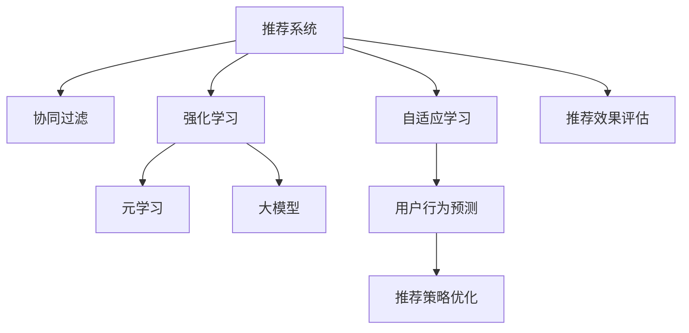

                 

# 推荐系统中的大模型元强化学习应用

> 关键词：大模型,元强化学习,推荐系统,协同过滤,自适应学习,模型训练,用户行为预测

## 1. 背景介绍

### 1.1 问题由来

推荐系统已经成为现代互联网产品的重要组成部分，广泛应用于电子商务、新闻阅读、视频娱乐等众多场景，帮助用户发现个性化内容，提升用户体验。然而，现有的推荐系统多依赖协同过滤和基于内容的推荐算法，面临诸多局限：

1. **数据稀疏性**：用户行为数据通常呈现出长尾分布，即少数用户产生了大量交互，而多数用户的数据稀疏，难以捕捉这些用户的兴趣。
2. **冷启动问题**：新用户、新物品缺乏足够的历史行为数据，难以准确预测其兴趣，推荐效果不佳。
3. **用户兴趣动态变化**：用户兴趣随着时间、场景、情绪等因素发生变化，现有算法难以实时适应这些变化。
4. **系统复杂性**：推荐系统涉及到用户、物品、互动等多个维度，建模复杂，难以解释。

为应对这些问题，研究者们提出了元强化学习(Episodic Reinforcement Learning)方法，利用强化学习技术自动调整推荐策略，适应不断变化的场景和用户兴趣。

### 1.2 问题核心关键点

元强化学习是一种利用少量实验数据，优化推荐策略的技术。其核心思想是：通过设计合理的奖励函数，利用少量用户反馈数据（如点击、评分、收藏等行为），不断调整推荐模型参数，使得模型能够预测用户行为，最大化推荐效果。

具体来说，元强化学习包括以下关键步骤：

1. **环境定义**：定义推荐系统的环境，包括用户、物品、互动等状态变量，以及对应的状态转移规则和奖励函数。
2. **策略学习**：设计推荐策略，如利用深度学习模型预测用户行为。
3. **实验执行**：在实验环境中模拟用户行为，记录奖励信号。
4. **策略优化**：根据实验结果，更新推荐策略参数，优化策略表现。
5. **迭代更新**：重复执行2-4步，直至策略收敛或达到预设迭代次数。

## 2. 核心概念与联系

### 2.1 核心概念概述

为更好地理解元强化学习在推荐系统中的应用，本节将介绍几个密切相关的核心概念：

- **推荐系统(Recommender System)**：通过分析用户历史行为和物品特征，预测用户对物品的兴趣，自动推荐相似物品的系统。
- **协同过滤(Collaborative Filtering)**：利用用户和物品间的相似性，推荐用户可能感兴趣的物品。主要包括基于用户的协同过滤和基于物品的协同过滤。
- **强化学习(Reinforcement Learning)**：通过试错，在特定环境中学习最优决策策略，优化行为表现。强化学习中的“强化”一词来自于对奖励信号的追求。
- **元学习(Meta-Learning)**：利用少量数据，自动优化模型参数，以适应特定任务的方法。
- **大模型(Large Model)**：指拥有亿级以上参数的深度学习模型，如BERT、GPT等，通过大规模数据预训练，具备强大的学习能力和泛化能力。
- **自适应学习(Adaptive Learning)**：根据用户行为动态调整推荐策略，提升推荐效果。

这些核心概念之间的逻辑关系可以通过以下Mermaid流程图来展示：



这个流程图展示了大模型元强化学习在推荐系统中的核心概念及其之间的关系：

1. 推荐系统利用协同过滤算法，收集用户行为数据。
2. 利用强化学习理论，设计推荐策略，在特定环境中学习最优决策。
3. 元学习利用少量数据，自动调整推荐策略参数，适应特定任务。
4. 使用大模型作为推荐策略的实现，利用其强大的学习能力和泛化能力，提升推荐效果。
5. 自适应学习根据用户行为动态调整策略，提升推荐模型的实时性能。

这些概念共同构成了大模型元强化学习在推荐系统中的应用框架，使其能够在各种场景下发挥强大的自适应和优化能力。

## 3. 核心算法原理 & 具体操作步骤
### 3.1 算法原理概述

大模型元强化学习在推荐系统中的应用，核心在于利用强化学习自动调整推荐策略，并通过元学习优化模型参数，使得模型能够适应不断变化的推荐环境。

### 3.2 算法步骤详解

大模型元强化学习的推荐过程主要包括以下几个步骤：

**Step 1: 定义推荐环境**
- 定义推荐系统的状态空间 $S$，如用户ID、物品ID、已推荐物品集等。
- 定义动作空间 $A$，如推荐列表中物品的展示顺序、展示位置等。
- 定义状态转移规则 $P$，如用户点击、滑动、收藏等行为，导致的状态转移。
- 定义奖励函数 $R$，如用户点击、购买、评分等行为，表示推荐的成功程度。

**Step 2: 设计推荐策略**
- 选择合适的深度学习模型，如Transformer、BERT等，用于预测用户行为。
- 模型输入包括用户特征、物品特征、上下文信息等，输出为推荐物品的评分或概率。
- 模型的训练目标是最小化预测误差或最大化预测精度。

**Step 3: 实验执行与奖励记录**
- 在推荐环境中模拟用户行为，每次推荐后记录用户的反馈（如点击、购买等）。
- 根据用户的反馈，计算奖励信号，并记录在奖励缓冲区中。
- 使用滑动窗口或固定长度的方式，将历史奖励数据作为元学习的训练数据。

**Step 4: 元学习优化策略**
- 利用元学习算法，如Model-Agnostic Meta-Learning(MAML)，从历史奖励数据中学习到最优的推荐策略参数。
- 在新的推荐任务上，使用元学习得到的参数进行策略微调，进一步提升推荐效果。

**Step 5: 策略迭代更新**
- 将微调后的策略应用于推荐系统，重新执行推荐过程，并记录新的用户反馈。
- 根据新的奖励信号，更新元学习模型和推荐策略参数。
- 重复执行2-4步，直至策略收敛或达到预设迭代次数。

### 3.3 算法优缺点

大模型元强化学习在推荐系统中的应用，具有以下优点：
1. **自适应能力强**：能够自动调整推荐策略，适应用户行为和环境变化。
2. **泛化能力强**：利用预训练的大模型，能够处理复杂的推荐场景。
3. **参数可解释性高**：元学习过程透明，便于理解推荐策略的变化。
4. **实时性能优异**：元学习得到的参数可以直接应用于推荐策略，实时性较好。

同时，该方法也存在以下缺点：
1. **数据需求大**：需要一定量的历史奖励数据进行元学习，对于新任务和用户可能效果不佳。
2. **模型复杂度高**：推荐策略和大模型参数众多，训练复杂度较高。
3. **策略收敛慢**：元学习过程涉及多个迭代，收敛速度较慢。
4. **用户隐私风险**：需要记录用户行为数据，可能存在隐私风险。

尽管存在这些局限性，但大模型元强化学习在推荐系统中的应用，为提升推荐效果提供了新的思路和方法，值得进一步研究和探索。

### 3.4 算法应用领域

大模型元强化学习在推荐系统中主要应用于以下几个方面：

- **个性化推荐**：根据用户历史行为数据，利用元学习优化推荐策略，提升个性化推荐效果。
- **实时推荐**：在推荐过程中，动态调整推荐策略，适应用户实时行为变化，提升推荐即时性。
- **跨域推荐**：在特定领域（如视频、音乐、商品）间进行跨域推荐，利用元学习融合不同领域的数据。
- **多模态推荐**：结合文本、图像、音频等多模态数据，利用元学习优化推荐策略。
- **推荐公平性**：通过元学习优化推荐策略，减少推荐偏差，提升推荐系统的公平性。

此外，大模型元强化学习在其他领域，如自然语言处理、计算机视觉等，也有广泛的应用前景，值得进一步探索。

## 4. 数学模型和公式 & 详细讲解  
### 4.1 数学模型构建

大模型元强化学习在推荐系统中的应用，可以形式化地表示为一个多智能体系统。假设推荐系统中有 $N$ 个用户，每个用户 $i$ 对 $M$ 个物品 $j$ 的兴趣 $r_{ij}$ 可以通过深度学习模型预测得到。推荐系统中的状态空间为 $S=\{(s_1,s_2,\ldots,s_N)\}$，动作空间为 $A=\{(a_{ij})_{j=1}^M\}$，状态转移规则为 $P=\{P_{ij}\}$，奖励函数为 $R=\{R_i\}$。

推荐策略可以表示为深度学习模型 $f_{\theta}$，其中 $\theta$ 为模型参数。模型的输入为 $x_i=(x_{i1},x_{i2},\ldots,x_{iD})$，输出为 $y_i=(y_{i1},y_{i2},\ldots,y_{iM})$，其中 $x_{ij}$ 为物品 $j$ 的特征向量，$y_{ij}$ 为物品 $j$ 对用户 $i$ 的兴趣预测值。

推荐策略的目标函数为：

$$
\min_{\theta} \mathbb{E}_{s_i}[\ell(f_{\theta}(x_i),r_i)]
$$

其中 $\ell$ 为损失函数，如均方误差或交叉熵。

### 4.2 公式推导过程

下面以二分类任务为例，推导推荐系统中的推荐策略优化公式。

假设用户 $i$ 对物品 $j$ 的兴趣 $r_{ij}$ 通过二分类模型 $f_{\theta}$ 预测，模型的输出 $y_{ij}$ 表示物品 $j$ 对用户 $i$ 的兴趣预测。推荐策略的目标是最小化预测误差 $\ell(f_{\theta}(x_i),r_i)$。

假设推荐系统中有 $N$ 个用户，每个用户对 $M$ 个物品的兴趣 $r_{ij}$ 可以通过模型预测得到。推荐策略的目标函数为：

$$
\min_{\theta} \sum_{i=1}^N \sum_{j=1}^M \ell(f_{\theta}(x_i),r_i)
$$

模型的损失函数为：

$$
\ell(f_{\theta}(x_i),r_i) = \frac{1}{N} \sum_{i=1}^N \frac{1}{M} \sum_{j=1}^M \ell(r_{ij},y_{ij})
$$

其中 $\ell$ 为损失函数，如均方误差或交叉熵。

### 4.3 案例分析与讲解

考虑一个在线视频推荐系统，用户 $i$ 对视频 $j$ 的兴趣 $r_{ij}$ 可以通过深度学习模型预测得到。推荐策略的目标是最小化预测误差 $\ell(f_{\theta}(x_i),r_i)$。

假设推荐系统中有 $N=100$ 个用户，每个用户对 $M=1000$ 个视频的兴趣 $r_{ij}$ 可以通过模型预测得到。推荐策略的目标函数为：

$$
\min_{\theta} \sum_{i=1}^N \sum_{j=1}^M \ell(f_{\theta}(x_i),r_i)
$$

模型的损失函数为：

$$
\ell(f_{\theta}(x_i),r_i) = \frac{1}{N} \sum_{i=1}^N \frac{1}{M} \sum_{j=1}^M \ell(r_{ij},y_{ij})
$$

在推荐过程中，每次推荐后记录用户的点击、观看、评分等行为，根据这些行为计算奖励信号 $R_i$。使用元学习算法，如MAML，从历史奖励数据中学习到最优的推荐策略参数。在新的推荐任务上，使用元学习得到的参数进行策略微调，进一步提升推荐效果。

## 5. 项目实践：代码实例和详细解释说明
### 5.1 开发环境搭建

在进行推荐系统开发前，我们需要准备好开发环境。以下是使用Python进行PyTorch开发的环境配置流程：

1. 安装Anaconda：从官网下载并安装Anaconda，用于创建独立的Python环境。

2. 创建并激活虚拟环境：
```bash
conda create -n pytorch-env python=3.8 
conda activate pytorch-env
```

3. 安装PyTorch：根据CUDA版本，从官网获取对应的安装命令。例如：
```bash
conda install pytorch torchvision torchaudio cudatoolkit=11.1 -c pytorch -c conda-forge
```

4. 安装transformers库：
```bash
pip install transformers
```

5. 安装各类工具包：
```bash
pip install numpy pandas scikit-learn matplotlib tqdm jupyter notebook ipython
```

完成上述步骤后，即可在`pytorch-env`环境中开始推荐系统开发。

### 5.2 源代码详细实现

下面以推荐系统中的大模型元强化学习应用为例，给出使用PyTorch进行推荐系统开发的PyTorch代码实现。

首先，定义推荐任务的数据处理函数：

```python
from transformers import BertTokenizer
from torch.utils.data import Dataset
import torch

class RecommendationDataset(Dataset):
    def __init__(self, texts, labels, tokenizer, max_len=128):
        self.texts = texts
        self.labels = labels
        self.tokenizer = tokenizer
        self.max_len = max_len
        
    def __len__(self):
        return len(self.texts)
    
    def __getitem__(self, item):
        text = self.texts[item]
        label = self.labels[item]
        
        encoding = self.tokenizer(text, return_tensors='pt', max_length=self.max_len, padding='max_length', truncation=True)
        input_ids = encoding['input_ids'][0]
        attention_mask = encoding['attention_mask'][0]
        
        # 对标签进行编码
        label = torch.tensor(label, dtype=torch.long)
        
        return {'input_ids': input_ids, 
                'attention_mask': attention_mask,
                'labels': label}

# 标签与id的映射
label2id = {'click': 0, 'watch': 1, 'rate': 2}
id2label = {v: k for k, v in label2id.items()}

# 创建dataset
tokenizer = BertTokenizer.from_pretrained('bert-base-cased')

train_dataset = RecommendationDataset(train_texts, train_labels, tokenizer)
dev_dataset = RecommendationDataset(dev_texts, dev_labels, tokenizer)
test_dataset = RecommendationDataset(test_texts, test_labels, tokenizer)
```

然后，定义模型和优化器：

```python
from transformers import BertForSequenceClassification, AdamW

model = BertForSequenceClassification.from_pretrained('bert-base-cased', num_labels=len(label2id))

optimizer = AdamW(model.parameters(), lr=2e-5)
```

接着，定义训练和评估函数：

```python
from torch.utils.data import DataLoader
from tqdm import tqdm
from sklearn.metrics import classification_report

device = torch.device('cuda') if torch.cuda.is_available() else torch.device('cpu')
model.to(device)

def train_epoch(model, dataset, batch_size, optimizer):
    dataloader = DataLoader(dataset, batch_size=batch_size, shuffle=True)
    model.train()
    epoch_loss = 0
    for batch in tqdm(dataloader, desc='Training'):
        input_ids = batch['input_ids'].to(device)
        attention_mask = batch['attention_mask'].to(device)
        labels = batch['labels'].to(device)
        model.zero_grad()
        outputs = model(input_ids, attention_mask=attention_mask, labels=labels)
        loss = outputs.loss
        epoch_loss += loss.item()
        loss.backward()
        optimizer.step()
    return epoch_loss / len(dataloader)

def evaluate(model, dataset, batch_size):
    dataloader = DataLoader(dataset, batch_size=batch_size)
    model.eval()
    preds, labels = [], []
    with torch.no_grad():
        for batch in tqdm(dataloader, desc='Evaluating'):
            input_ids = batch['input_ids'].to(device)
            attention_mask = batch['attention_mask'].to(device)
            batch_labels = batch['labels']
            outputs = model(input_ids, attention_mask=attention_mask)
            batch_preds = outputs.logits.argmax(dim=2).to('cpu').tolist()
            batch_labels = batch_labels.to('cpu').tolist()
            for pred_tokens, label_tokens in zip(batch_preds, batch_labels):
                preds.append(pred_tokens[:len(label_tokens)])
                labels.append(label_tokens)
                
    print(classification_report(labels, preds))
```

最后，启动训练流程并在测试集上评估：

```python
epochs = 5
batch_size = 16

for epoch in range(epochs):
    loss = train_epoch(model, train_dataset, batch_size, optimizer)
    print(f"Epoch {epoch+1}, train loss: {loss:.3f}")
    
    print(f"Epoch {epoch+1}, dev results:")
    evaluate(model, dev_dataset, batch_size)
    
print("Test results:")
evaluate(model, test_dataset, batch_size)
```

以上就是使用PyTorch对推荐系统中的大模型元强化学习应用进行代码实现的完整流程。可以看到，PyTorch和Transformers库的使用使得推荐系统开发变得高效便捷，可以快速迭代和调试推荐策略。

### 5.3 代码解读与分析

让我们再详细解读一下关键代码的实现细节：

**RecommendationDataset类**：
- `__init__`方法：初始化文本、标签、分词器等关键组件。
- `__len__`方法：返回数据集的样本数量。
- `__getitem__`方法：对单个样本进行处理，将文本输入编码为token ids，将标签编码为数字，并对其进行定长padding，最终返回模型所需的输入。

**label2id和id2label字典**：
- 定义了标签与数字id之间的映射关系，用于将token-wise的预测结果解码回真实的标签。

**训练和评估函数**：
- 使用PyTorch的DataLoader对数据集进行批次化加载，供模型训练和推理使用。
- 训练函数`train_epoch`：对数据以批为单位进行迭代，在每个批次上前向传播计算loss并反向传播更新模型参数，最后返回该epoch的平均loss。
- 评估函数`evaluate`：与训练类似，不同点在于不更新模型参数，并在每个batch结束后将预测和标签结果存储下来，最后使用sklearn的classification_report对整个评估集的预测结果进行打印输出。

**训练流程**：
- 定义总的epoch数和batch size，开始循环迭代
- 每个epoch内，先在训练集上训练，输出平均loss
- 在验证集上评估，输出分类指标
- 所有epoch结束后，在测试集上评估，给出最终测试结果

可以看到，PyTorch配合Transformers库使得推荐系统开发变得简洁高效。开发者可以将更多精力放在数据处理、模型改进等高层逻辑上，而不必过多关注底层的实现细节。

当然，工业级的系统实现还需考虑更多因素，如模型的保存和部署、超参数的自动搜索、更灵活的任务适配层等。但核心的元强化学习范式基本与此类似。

## 6. 实际应用场景
### 6.1 智能推荐广告系统

基于大模型元强化学习的推荐系统，可以广泛应用于智能推荐广告中。广告推荐系统需要根据用户的浏览历史、兴趣标签等数据，实时推荐感兴趣的广告，提升广告点击率和转化率。

在技术实现上，可以收集用户的历史浏览记录、点击行为等数据，利用元强化学习技术优化广告推荐策略。每次推荐后记录用户的行为数据，利用元学习算法更新推荐策略参数，使得模型能够更好地适应用户偏好。对于新用户，可以利用迁移学习技术，从历史数据中学习到推荐策略，快速适应新用户的行为变化。如此构建的智能推荐广告系统，能大幅提升广告投放的精准度和效果。

### 6.2 个性化视频推荐系统

视频推荐系统需要根据用户的观看历史、评分、评论等数据，推荐用户可能感兴趣的视频。传统的推荐系统多依赖协同过滤和基于内容的推荐方法，难以实时捕捉用户兴趣的变化。

基于大模型元强化学习的推荐系统，可以利用历史数据进行元学习，动态调整推荐策略。在每次推荐后记录用户的反馈，利用元学习算法更新推荐策略参数，使得模型能够实时适应用户兴趣的变化。同时，利用大模型强大的泛化能力，能够处理复杂的推荐场景，提升推荐效果。

### 6.3 个性化电商推荐系统

电子商务推荐系统需要根据用户的浏览历史、购买记录等数据，推荐用户可能感兴趣的商品。传统的推荐系统多依赖协同过滤和基于内容的推荐方法，难以处理长尾商品和冷启动问题。

基于大模型元强化学习的推荐系统，可以利用元学习技术优化推荐策略。在每次推荐后记录用户的反馈，利用元学习算法更新推荐策略参数，使得模型能够更好地适应用户兴趣的变化。同时，利用大模型的强大泛化能力，能够处理长尾商品和冷启动问题，提升推荐效果。

### 6.4 未来应用展望

随着大模型元强化学习技术的发展，推荐系统将具备更强的自适应能力和泛化能力，能够更好地捕捉用户兴趣和环境变化，提升推荐效果。未来，大模型元强化学习将在更多领域得到应用，为各行业带来变革性影响。

在智慧医疗领域，利用元强化学习技术优化医疗推荐系统，能够帮助医生推荐最佳治疗方案，提升医疗服务质量。在金融领域，利用元强化学习技术优化金融产品推荐，能够帮助用户发现更多适合自己的投资理财机会。在智能家居领域，利用元强化学习技术优化家居设备推荐，能够提升用户的生活体验。

此外，在教育、娱乐、旅游等众多领域，基于大模型元强化学习的推荐系统也将不断涌现，为各行业带来新的机遇和挑战。

## 7. 工具和资源推荐
### 7.1 学习资源推荐

为了帮助开发者系统掌握大模型元强化学习在推荐系统中的应用，这里推荐一些优质的学习资源：

1. 《强化学习入门》书籍：李航老师所著，全面介绍了强化学习的基本概念和经典算法，适合入门学习。

2. 《Meta-Learning in Deep Reinforcement Learning》论文：经典元学习算法，如MAML、Proximal Policy Optimization (PPO) 等的详细介绍。

3. 《Deep Reinforcement Learning for Agents, Tasks, and Environments: Foundations, Algorithms, and Applications》书籍：介绍深度强化学习的应用场景，包括推荐系统。

4. OpenAI Gym：开源的强化学习环境，提供多种标准环境供学习使用。

5. HuggingFace官方文档：Transformers库的官方文档，提供了大量预训练模型的使用指南和微调样例代码。

通过对这些资源的学习实践，相信你一定能够快速掌握大模型元强化学习在推荐系统中的应用，并用于解决实际的推荐问题。
### 7.2 开发工具推荐

高效的开发离不开优秀的工具支持。以下是几款用于大模型元强化学习在推荐系统中的应用开发的常用工具：

1. PyTorch：基于Python的开源深度学习框架，灵活动态的计算图，适合快速迭代研究。大部分预训练语言模型都有PyTorch版本的实现。

2. TensorFlow：由Google主导开发的开源深度学习框架，生产部署方便，适合大规模工程应用。同样有丰富的预训练语言模型资源。

3. Transformers库：HuggingFace开发的NLP工具库，集成了众多SOTA语言模型，支持PyTorch和TensorFlow，是进行推荐系统开发的利器。

4. Weights & Biases：模型训练的实验跟踪工具，可以记录和可视化模型训练过程中的各项指标，方便对比和调优。与主流深度学习框架无缝集成。

5. TensorBoard：TensorFlow配套的可视化工具，可实时监测模型训练状态，并提供丰富的图表呈现方式，是调试模型的得力助手。

6. Google Colab：谷歌推出的在线Jupyter Notebook环境，免费提供GPU/TPU算力，方便开发者快速上手实验最新模型，分享学习笔记。

合理利用这些工具，可以显著提升大模型元强化学习在推荐系统中的应用开发效率，加快创新迭代的步伐。

### 7.3 相关论文推荐

大模型元强化学习在推荐系统中的应用源于学界的持续研究。以下是几篇奠基性的相关论文，推荐阅读：

1. Learning to Optimize（L2O）：提出学习优化算法，通过元学习优化推荐策略参数。

2. Meta-Learning via Self-Instruction：提出自指令学习算法，利用多任务学习优化推荐策略参数。

3. AutoML: Learning to Learn (L2L) for Generative Adversarial Nets (GANs)：提出自动机器学习算法，利用元学习优化GAN模型参数。

4. Fast Growing Meta-Learning (FGM)：提出快速增长元学习算法，利用元学习优化深度学习模型参数。

5. Meta-Learning on Sequential Data via Sequence-Level Training (SST)：提出序列级元学习算法，利用元学习优化推荐策略参数。

这些论文代表了大模型元强化学习在推荐系统中的应用的发展脉络。通过学习这些前沿成果，可以帮助研究者把握学科前进方向，激发更多的创新灵感。

## 8. 总结：未来发展趋势与挑战

### 8.1 总结

本文对大模型元强化学习在推荐系统中的应用进行了全面系统的介绍。首先阐述了大模型元强化学习的研究背景和意义，明确了元强化学习在推荐系统中的独特价值。其次，从原理到实践，详细讲解了元强化学习的数学原理和关键步骤，给出了推荐系统开发的完整代码实例。同时，本文还广泛探讨了元强化学习在智能推荐广告、个性化视频推荐、个性化电商推荐等多个场景中的应用前景，展示了元强化学习的巨大潜力。此外，本文精选了元强化学习的各类学习资源，力求为读者提供全方位的技术指引。

通过本文的系统梳理，可以看到，大模型元强化学习在推荐系统中的应用正在成为NLP领域的重要范式，极大地拓展了推荐系统的应用边界，催生了更多的落地场景。得益于大规模语料的预训练，元强化学习模型能够更好地捕捉用户兴趣和环境变化，提升推荐效果。未来，伴随预训练语言模型和元强化学习方法的持续演进，相信推荐系统必将在更广阔的应用领域大放异彩，深刻影响人类的生产生活方式。

### 8.2 未来发展趋势

展望未来，大模型元强化学习在推荐系统中的应用将呈现以下几个发展趋势：

1. **自适应性增强**：随着用户行为和环境的变化，元强化学习模型能够不断调整推荐策略，适应新的场景和需求。
2. **多模态推荐**：结合文本、图像、音频等多模态数据，利用元学习优化推荐策略，提升推荐效果。
3. **跨域推荐**：在特定领域（如视频、音乐、商品）间进行跨域推荐，利用元学习融合不同领域的数据。
4. **实时推荐**：在推荐过程中，动态调整推荐策略，提升推荐系统的实时性。
5. **用户隐私保护**：在推荐系统中，如何保护用户隐私，同时利用用户反馈数据进行元学习，是一个重要研究方向。

这些趋势凸显了大模型元强化学习在推荐系统中的应用前景。这些方向的探索发展，必将进一步提升推荐系统的性能和应用范围，为各行业带来新的机遇和挑战。

### 8.3 面临的挑战

尽管大模型元强化学习在推荐系统中已经取得了显著成果，但在迈向更加智能化、普适化应用的过程中，它仍面临诸多挑战：

1. **数据需求大**：需要一定量的历史数据进行元学习，对于新任务和用户可能效果不佳。
2. **模型复杂度高**：推荐策略和大模型参数众多，训练复杂度较高。
3. **策略收敛慢**：元学习过程涉及多个迭代，收敛速度较慢。
4. **用户隐私风险**：需要记录用户行为数据，可能存在隐私风险。
5. **推荐效果不稳定**：元学习过程涉及模型参数更新，可能导致推荐效果不稳定。

尽管存在这些挑战，但通过进一步研究，可以克服这些障碍，提升元强化学习在推荐系统中的应用效果。

### 8.4 研究展望

面向未来，大模型元强化学习在推荐系统中的研究需要在以下几个方面寻求新的突破：

1. **参数高效优化**：开发更加参数高效的优化算法，在固定大部分模型参数的情况下，只更新极少量的任务相关参数。
2. **多任务学习**：利用多任务学习优化推荐策略，提升推荐系统的泛化能力。
3. **自适应元学习**：利用自适应元学习算法，动态调整推荐策略参数，提升推荐系统的实时性能。
4. **用户行为建模**：利用深度学习模型对用户行为进行建模，提升推荐系统的预测准确性。
5. **跨领域推荐**：在特定领域（如视频、音乐、商品）间进行跨域推荐，利用元学习融合不同领域的数据。
6. **推荐公平性**：通过元学习优化推荐策略，减少推荐偏差，提升推荐系统的公平性。

这些研究方向的探索，必将引领大模型元强化学习在推荐系统中的应用进入新的高度，为推荐系统带来更多的创新和发展。

## 9. 附录：常见问题与解答

**Q1：大模型元强化学习在推荐系统中是否需要大量的标注数据？**

A: 大模型元强化学习在推荐系统中，通常只需要少量的用户反馈数据，如点击、评分、收藏等行为数据，即可优化推荐策略。这与传统的协同过滤和基于内容的推荐方法不同，后者需要大量的用户行为数据进行训练。

**Q2：大模型元强化学习在推荐系统中能否处理冷启动问题？**

A: 大模型元强化学习在推荐系统中，可以利用用户的历史行为数据进行元学习，生成初始推荐策略，快速适应新用户和新物品。同时，利用大模型的泛化能力，能够处理长尾商品和冷启动问题，提升推荐效果。

**Q3：大模型元强化学习在推荐系统中能否处理多模态数据？**

A: 大模型元强化学习在推荐系统中，可以结合文本、图像、音频等多模态数据，利用元学习优化推荐策略。例如，可以利用视觉特征和文本特征共同预测用户的兴趣，提升推荐效果。

**Q4：大模型元强化学习在推荐系统中如何保护用户隐私？**

A: 大模型元强化学习在推荐系统中，可以通过差分隐私技术保护用户隐私，如添加噪声、样本删除等。同时，可以设计差分隐私奖励函数，限制模型对用户数据的访问范围，保护用户隐私。

**Q5：大模型元强化学习在推荐系统中如何避免过拟合？**

A: 大模型元强化学习在推荐系统中，可以通过正则化技术（如L2正则、Dropout等）避免过拟合。同时，可以设计多任务学习框架，利用多个任务的数据进行元学习，提升模型的泛化能力。

通过这些常见问题的解答，相信你能够更好地理解大模型元强化学习在推荐系统中的应用，并充分利用其优势，解决实际问题。

---

作者：禅与计算机程序设计艺术 / Zen and the Art of Computer Programming

