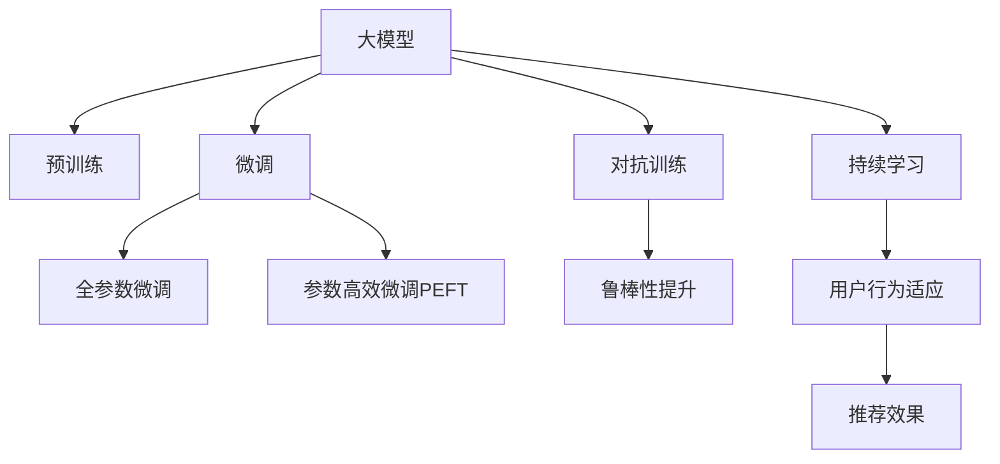

                 

# 推荐系统中的大模型持续学习与适应

## 1. 背景介绍

### 1.1 问题由来
推荐系统作为互联网应用的核心引擎，始终承担着为每个用户推荐最相关和最有价值的内容的使命。随着数据量、用户规模和用户行为复杂性的不断提升，传统的基于协同过滤、浅层学习等推荐算法已无法满足用户需求。近年来，大模型技术，尤其是深度学习模型，通过捕获数据的全局关联性，成为了推荐系统性能提升的重要方向。

### 1.2 问题核心关键点
在推荐系统中，大模型通常是通过在大规模用户行为数据上进行预训练，学习用户兴趣和行为模式的表示。随后，通过对小样本用户的实时行为数据进行微调，大模型能够在用户个性化推荐上取得出色表现。微调过程的核心在于如何确保模型的泛化能力和适应性，同时提升推荐结果的精准性和多样性。

### 1.3 问题研究意义
研究推荐系统中的大模型持续学习与适应方法，对于提升推荐系统的性能，实现更加个性化、精准化的推荐，具有重要意义：

1. 提升推荐效果。大模型微调能够显著提高推荐系统的精准度，通过捕捉更多的用户行为模式和偏好，为用户推荐更相关、更吸引人的内容。
2. 加速模型训练。微调过程可以在小样本条件下进行，减少了从头训练模型的复杂度和时间成本。
3. 适应用户变化。大模型能够实时地学习新用户的兴趣变化，保持推荐结果的时效性。
4. 优化推荐多样性。通过微调，大模型可以在保持推荐相关性的同时，提高推荐的广泛性和多样性。
5. 优化资源利用。微调方法可以避免从头训练大模型时的大量计算资源消耗，优化系统资源利用率。

## 2. 核心概念与联系

### 2.1 核心概念概述

在推荐系统中，大模型的持续学习与适应通常涉及以下几个关键概念：

- **大模型(Large Model)**：以深度神经网络为代表的，通过在大规模数据上预训练得到的大规模模型。常见的深度学习模型包括BERT、GPT-3等。
- **预训练(Pre-training)**：在大规模无标签数据上，通过自监督任务训练模型，学习到通用的语言或行为表示。
- **微调(Fine-tuning)**：在预训练模型的基础上，使用小规模标注数据对模型进行有监督学习，优化模型参数以适应特定推荐任务。
- **持续学习(Continual Learning)**：模型能够在不断变化的数据分布中学习并适应用户的新行为模式，保持推荐效果的稳定性和适应性。
- **对抗训练(Adversarial Training)**：在训练过程中加入对抗样本，提高模型的鲁棒性和泛化能力。
- **参数高效微调(Parameter-Efficient Fine-Tuning, PEFT)**：只更新少量模型参数，最大化利用预训练模型的知识。
- **多任务学习(Multi-task Learning)**：同时学习多个相关任务，提升模型的泛化能力和推荐的多样性。
- **自适应推荐系统(Adaptive Recommendation System)**：能够根据用户的行为和环境变化动态调整推荐策略的推荐系统。

这些核心概念之间的逻辑关系可以通过以下Mermaid流程图来展示：



这个流程图展示了大模型在推荐系统中的核心概念及其之间的关系：

1. 大模型通过预训练学习通用知识。
2. 微调通过小规模数据适配特定任务，优化模型参数。
3. 对抗训练提高模型的鲁棒性，防止过拟合。
4. 持续学习使得模型能够适应用户变化，保持性能稳定。

这些概念共同构成了推荐系统中大模型的学习和应用框架，使其能够在不断变化的用户需求中提供精准的个性化推荐。

## 3. 核心算法原理 & 具体操作步骤
### 3.1 算法原理概述

在推荐系统中，大模型的持续学习与适应方法主要基于监督学习范式。其核心思想是：通过在大规模用户行为数据上进行预训练，学习用户兴趣和行为的通用表示。随后，在推荐任务上使用小样本标注数据进行微调，优化模型参数以适应特定推荐任务。

形式化地，假设预训练模型为 $M_{\theta}$，其中 $\theta$ 为预训练得到的模型参数。给定推荐任务 $T$ 的标注数据集 $D=\{(x_i,y_i)\}_{i=1}^N$，微调的目标是找到新的模型参数 $\hat{\theta}$，使得：

$$
\hat{\theta}=\mathop{\arg\min}_{\theta} \mathcal{L}(M_{\theta},D)
$$

其中 $\mathcal{L}$ 为针对任务 $T$ 设计的损失函数，用于衡量模型预测输出与真实标签之间的差异。常见的损失函数包括均方误差、交叉熵等。

通过梯度下降等优化算法，微调过程不断更新模型参数 $\theta$，最小化损失函数 $\mathcal{L}$，使得模型输出逼近真实标签。由于 $\theta$ 已经通过预训练获得了较好的初始化，因此即便在小样本数据集 $D$ 上进行微调，也能较快收敛到理想的模型参数 $\hat{\theta}$。

### 3.2 算法步骤详解

推荐系统中大模型的持续学习与适应一般包括以下几个关键步骤：

**Step 1: 准备预训练模型和数据集**
- 选择合适的预训练模型 $M_{\theta}$ 作为初始化参数，如 BERT、GPT-3等。
- 准备推荐任务 $T$ 的标注数据集 $D$，划分为训练集、验证集和测试集。一般要求标注数据与预训练数据的分布不要差异过大。

**Step 2: 设计推荐目标函数**
- 根据推荐任务类型，设计合适的推荐目标函数，如点击率预测、用户满意度等。
- 将预测结果与实际标签进行对比，计算损失函数。

**Step 3: 设置微调超参数**
- 选择合适的优化算法及其参数，如 Adam、SGD 等，设置学习率、批大小、迭代轮数等。
- 设置正则化技术及强度，包括权重衰减、Dropout、Early Stopping 等。
- 确定冻结预训练参数的策略，如仅微调顶层，或全部参数都参与微调。

**Step 4: 执行梯度训练**
- 将训练集数据分批次输入模型，前向传播计算损失函数。
- 反向传播计算参数梯度，根据设定的优化算法和学习率更新模型参数。
- 周期性在验证集上评估模型性能，根据性能指标决定是否触发 Early Stopping。
- 重复上述步骤直到满足预设的迭代轮数或 Early Stopping 条件。

**Step 5: 测试和部署**
- 在测试集上评估微调后模型 $M_{\hat{\theta}}$ 的性能，对比微调前后的精度提升。
- 使用微调后的模型对新样本进行推荐预测，集成到实际的应用系统中。
- 持续收集新的数据，定期重新微调模型，以适应数据分布的变化。

以上是推荐系统中大模型微调的一般流程。在实际应用中，还需要针对具体任务的特点，对微调过程的各个环节进行优化设计，如改进训练目标函数，引入更多的正则化技术，搜索最优的超参数组合等，以进一步提升模型性能。

### 3.3 算法优缺点

推荐系统中大模型的持续学习与适应方法具有以下优点：
1. 提升推荐效果。微调使得模型能够更好地适应推荐任务的复杂性，提升推荐精准度。
2. 加速模型训练。微调可以在小样本条件下进行，减少从头训练的时间成本。
3. 用户行为适应。微调模型能够实时地学习用户行为变化，保持推荐结果的时效性。
4. 优化资源利用。微调方法可以避免从头训练大模型时的计算资源消耗，优化系统资源利用率。

同时，该方法也存在一定的局限性：
1. 对标注数据依赖。微调的效果很大程度上取决于标注数据的质量和数量，获取高质量标注数据的成本较高。
2. 对抗样本风险。微调模型可能对对抗样本存在敏感性，导致推荐结果不稳健。
3. 可解释性不足。微调模型往往缺乏可解释性，难以对其推荐逻辑进行分析和调试。
4. 用户隐私保护。推荐系统中涉及大量用户行为数据，如何保护用户隐私是一个重要挑战。

尽管存在这些局限性，但就目前而言，基于监督学习的微调方法仍是推荐系统中最主流范式。未来相关研究的重点在于如何进一步降低微调对标注数据的依赖，提高模型的少样本学习和跨领域迁移能力，同时兼顾可解释性和隐私保护等因素。

### 3.4 算法应用领域

基于大模型微调的推荐方法，在电商推荐、新闻推荐、视频推荐等多个领域得到广泛应用，取得了优异的推荐效果：

- 电商推荐：通过微调模型，可以根据用户浏览、购买历史，推荐相关商品。
- 新闻推荐：在用户阅读文章后进行微调，推荐相似或感兴趣的新闻。
- 视频推荐：在用户观看视频后进行微调，推荐更多相关视频内容。
- 音乐推荐：在用户听歌后进行微调，推荐相似或喜欢的音乐。

除了这些经典场景外，大模型微调还在社交推荐、广告推荐等诸多领域得到了创新性应用，为推荐系统的多样性发展提供了新的思路。随着预训练语言模型和微调方法的不断进步，相信推荐系统必将在更多领域展现出其强大的应用潜力。

## 4. 数学模型和公式 & 详细讲解
### 4.1 数学模型构建

在推荐系统中，大模型的持续学习与适应过程可以用数学语言进行严格刻画。

记预训练模型为 $M_{\theta}$，其中 $\theta$ 为模型参数。假设推荐任务 $T$ 的标注数据集为 $D=\{(x_i,y_i)\}_{i=1}^N$，其中 $x_i$ 为推荐对象特征，$y_i$ 为推荐标签。

定义模型 $M_{\theta}$ 在数据样本 $(x,y)$ 上的损失函数为 $\ell(M_{\theta}(x),y)$，则在数据集 $D$ 上的经验风险为：

$$
\mathcal{L}(\theta) = \frac{1}{N} \sum_{i=1}^N \ell(M_{\theta}(x_i),y_i)
$$

微调的优化目标是最小化经验风险，即找到最优参数：

$$
\theta^* = \mathop{\arg\min}_{\theta} \mathcal{L}(\theta)
$$

在实践中，我们通常使用基于梯度的优化算法（如SGD、Adam等）来近似求解上述最优化问题。设 $\eta$ 为学习率，$\lambda$ 为正则化系数，则参数的更新公式为：

$$
\theta \leftarrow \theta - \eta \nabla_{\theta}\mathcal{L}(\theta) - \eta\lambda\theta
$$

其中 $\nabla_{\theta}\mathcal{L}(\theta)$ 为损失函数对参数 $\theta$ 的梯度，可通过反向传播算法高效计算。

### 4.2 公式推导过程

以下我们以点击率预测任务为例，推导交叉熵损失函数及其梯度的计算公式。

假设模型 $M_{\theta}$ 在输入 $x$ 上的输出为 $\hat{y}=M_{\theta}(x)$，表示样本被点击的概率。真实标签 $y \in \{0,1\}$。则二分类交叉熵损失函数定义为：

$$
\ell(M_{\theta}(x),y) = -[y\log \hat{y} + (1-y)\log (1-\hat{y})]
$$

将其代入经验风险公式，得：

$$
\mathcal{L}(\theta) = -\frac{1}{N}\sum_{i=1}^N [y_i\log M_{\theta}(x_i)+(1-y_i)\log(1-M_{\theta}(x_i))]
$$

根据链式法则，损失函数对参数 $\theta_k$ 的梯度为：

$$
\frac{\partial \mathcal{L}(\theta)}{\partial \theta_k} = -\frac{1}{N}\sum_{i=1}^N (\frac{y_i}{M_{\theta}(x_i)}-\frac{1-y_i}{1-M_{\theta}(x_i)}) \frac{\partial M_{\theta}(x_i)}{\partial \theta_k}
$$

其中 $\frac{\partial M_{\theta}(x_i)}{\partial \theta_k}$ 可进一步递归展开，利用自动微分技术完成计算。

在得到损失函数的梯度后，即可带入参数更新公式，完成模型的迭代优化。重复上述过程直至收敛，最终得到适应推荐任务的最优模型参数 $\theta^*$。

## 5. 项目实践：代码实例和详细解释说明
### 5.1 开发环境搭建

在进行微调实践前，我们需要准备好开发环境。以下是使用Python进行PyTorch开发的环境配置流程：

1. 安装Anaconda：从官网下载并安装Anaconda，用于创建独立的Python环境。

2. 创建并激活虚拟环境：
```bash
conda create -n pytorch-env python=3.8 
conda activate pytorch-env
```

3. 安装PyTorch：根据CUDA版本，从官网获取对应的安装命令。例如：
```bash
conda install pytorch torchvision torchaudio cudatoolkit=11.1 -c pytorch -c conda-forge
```

4. 安装Transformers库：
```bash
pip install transformers
```

5. 安装各类工具包：
```bash
pip install numpy pandas scikit-learn matplotlib tqdm jupyter notebook ipython
```

完成上述步骤后，即可在`pytorch-env`环境中开始微调实践。

### 5.2 源代码详细实现

下面我们以点击率预测任务为例，给出使用Transformers库对BERT模型进行微调的PyTorch代码实现。

首先，定义点击率预测任务的数据处理函数：

```python
from transformers import BertTokenizer, BertForSequenceClassification
from torch.utils.data import Dataset
import torch

class ClickRateDataset(Dataset):
    def __init__(self, texts, labels, tokenizer, max_len=128):
        self.texts = texts
        self.labels = labels
        self.tokenizer = tokenizer
        self.max_len = max_len
        
    def __len__(self):
        return len(self.texts)
    
    def __getitem__(self, item):
        text = self.texts[item]
        label = self.labels[item]
        
        encoding = self.tokenizer(text, return_tensors='pt', max_length=self.max_len, padding='max_length', truncation=True)
        input_ids = encoding['input_ids'][0]
        attention_mask = encoding['attention_mask'][0]
        
        # 对label进行编码
        encoded_labels = torch.tensor([label], dtype=torch.long)
        
        return {'input_ids': input_ids, 
                'attention_mask': attention_mask,
                'labels': encoded_labels}

# 标签与id的映射
label2id = {1: 1, 0: 0}
id2label = {v: k for k, v in label2id.items()}

# 创建dataset
tokenizer = BertTokenizer.from_pretrained('bert-base-cased')

train_dataset = ClickRateDataset(train_texts, train_labels, tokenizer)
dev_dataset = ClickRateDataset(dev_texts, dev_labels, tokenizer)
test_dataset = ClickRateDataset(test_texts, test_labels, tokenizer)
```

然后，定义模型和优化器：

```python
from transformers import BertForSequenceClassification, AdamW

model = BertForSequenceClassification.from_pretrained('bert-base-cased', num_labels=2)

optimizer = AdamW(model.parameters(), lr=2e-5)
```

接着，定义训练和评估函数：

```python
from torch.utils.data import DataLoader
from tqdm import tqdm
from sklearn.metrics import roc_auc_score

device = torch.device('cuda') if torch.cuda.is_available() else torch.device('cpu')
model.to(device)

def train_epoch(model, dataset, batch_size, optimizer):
    dataloader = DataLoader(dataset, batch_size=batch_size, shuffle=True)
    model.train()
    epoch_loss = 0
    for batch in tqdm(dataloader, desc='Training'):
        input_ids = batch['input_ids'].to(device)
        attention_mask = batch['attention_mask'].to(device)
        labels = batch['labels'].to(device)
        model.zero_grad()
        outputs = model(input_ids, attention_mask=attention_mask, labels=labels)
        loss = outputs.loss
        epoch_loss += loss.item()
        loss.backward()
        optimizer.step()
    return epoch_loss / len(dataloader)

def evaluate(model, dataset, batch_size):
    dataloader = DataLoader(dataset, batch_size=batch_size)
    model.eval()
    preds, labels = [], []
    with torch.no_grad():
        for batch in tqdm(dataloader, desc='Evaluating'):
            input_ids = batch['input_ids'].to(device)
            attention_mask = batch['attention_mask'].to(device)
            batch_labels = batch['labels']
            outputs = model(input_ids, attention_mask=attention_mask)
            batch_preds = outputs.logits.argmax(dim=1).to('cpu').tolist()
            batch_labels = batch_labels.to('cpu').tolist()
            for pred, label in zip(batch_preds, batch_labels):
                preds.append(pred)
                labels.append(label)
                
    print(f"AUC: {roc_auc_score(labels, preds)}")
```

最后，启动训练流程并在测试集上评估：

```python
epochs = 5
batch_size = 16

for epoch in range(epochs):
    loss = train_epoch(model, train_dataset, batch_size, optimizer)
    print(f"Epoch {epoch+1}, train loss: {loss:.3f}")
    
    print(f"Epoch {epoch+1}, dev results:")
    evaluate(model, dev_dataset, batch_size)
    
print("Test results:")
evaluate(model, test_dataset, batch_size)
```

以上就是使用PyTorch对BERT进行点击率预测任务微调的完整代码实现。可以看到，得益于Transformers库的强大封装，我们可以用相对简洁的代码完成BERT模型的加载和微调。

### 5.3 代码解读与分析

让我们再详细解读一下关键代码的实现细节：

**ClickRateDataset类**：
- `__init__`方法：初始化文本、标签、分词器等关键组件。
- `__len__`方法：返回数据集的样本数量。
- `__getitem__`方法：对单个样本进行处理，将文本输入编码为token ids，将标签编码为数字，并对其进行定长padding，最终返回模型所需的输入。

**label2id和id2label字典**：
- 定义了标签与数字id之间的映射关系，用于将模型预测结果解码回真实标签。

**训练和评估函数**：
- 使用PyTorch的DataLoader对数据集进行批次化加载，供模型训练和推理使用。
- 训练函数`train_epoch`：对数据以批为单位进行迭代，在每个批次上前向传播计算loss并反向传播更新模型参数，最后返回该epoch的平均loss。
- 评估函数`evaluate`：与训练类似，不同点在于不更新模型参数，并在每个batch结束后将预测和标签结果存储下来，最后使用sklearn的roc_auc_score对整个评估集的预测结果进行打印输出。

**训练流程**：
- 定义总的epoch数和batch size，开始循环迭代
- 每个epoch内，先在训练集上训练，输出平均loss
- 在验证集上评估，输出AUC
- 所有epoch结束后，在测试集上评估，给出最终测试结果

可以看到，PyTorch配合Transformers库使得BERT微调的代码实现变得简洁高效。开发者可以将更多精力放在数据处理、模型改进等高层逻辑上，而不必过多关注底层的实现细节。

当然，工业级的系统实现还需考虑更多因素，如模型的保存和部署、超参数的自动搜索、更灵活的任务适配层等。但核心的微调范式基本与此类似。

## 6. 实际应用场景
### 6.1 智能广告推荐

基于大模型微调的推荐系统，可以广泛应用于智能广告推荐场景。广告主希望能够精准投放广告，提升广告的点击率和转化率。通过微调后的推荐系统，可以实时地学习用户的广告点击行为，推荐最相关、最吸引人的广告。

在技术实现上，可以收集用户的历史广告点击、浏览、转化数据，将这些数据作为标注数据对预训练模型进行微调。微调后的模型能够自动理解用户的广告偏好，推荐更精准的广告内容。对于新广告样本，模型还能动态生成推荐结果，实时更新广告投放策略。如此构建的智能广告推荐系统，能够显著提升广告主的投放效果，实现广告收入的最大化。

### 6.2 个性化娱乐推荐

推荐系统在娱乐领域也有广泛的应用，如音乐、电影、游戏等。用户对不同内容的喜好和偏好差异较大，基于通用模型难以获得理想的效果。通过微调技术，模型能够学习特定领域的知识，提升推荐的精准度。

在音乐推荐中，可以收集用户的听歌历史、评论、评分等数据，用于微调预训练模型。微调后的模型能够理解用户的音乐偏好，推荐更多相似和喜爱的歌曲。在游戏推荐中，微调模型可以学习用户的游戏行为数据，推荐适合用户的游戏内容和体验。

### 6.3 电子商务推荐

电子商务推荐是推荐系统中应用最广泛的部分。通过微调，推荐系统能够学习用户的历史购买、浏览、评价等数据，推荐更相关和有吸引力的商品。

在电商推荐中，微调模型可以根据用户的点击、购买记录，推荐相似的商品，提升用户的购物体验。对于新用户，模型还能根据其浏览历史生成个性化推荐，快速吸引其进行购买。电商推荐系统的应用效果直接影响用户体验和平台的收益，因此微调技术的应用尤为关键。

### 6.4 未来应用展望

随着大模型和微调方法的不断发展，推荐系统在更多领域的应用前景广阔：

- **医疗推荐**：通过微调，推荐系统能够学习医生的诊断和治疗记录，推荐更有效的医疗方案和药物。
- **教育推荐**：推荐系统可以学习学生的学习行为和成绩，推荐适合的课程和学习资源，提升教育效果。
- **金融推荐**：推荐系统可以学习用户的投资行为和偏好，推荐更符合其需求和风险承受能力的金融产品。
- **能源推荐**：推荐系统可以学习用户的能源使用习惯，推荐节能环保的方案，助力可持续发展。

此外，推荐系统在社交网络、旅游、交通等领域也有着广泛的应用，为各行各业提供智能化解决方案。随着预训练语言模型和微调方法的不断演进，相信推荐系统必将在更多领域展现出其强大的应用潜力。

## 7. 工具和资源推荐
### 7.1 学习资源推荐

为了帮助开发者系统掌握大模型微调的理论基础和实践技巧，这里推荐一些优质的学习资源：

1. **《深度学习入门》**：经典入门书籍，介绍了深度学习的基本概念和算法。
2. **CS229《机器学习》**：斯坦福大学机器学习课程，涵盖机器学习的基本概念和算法。
3. **《Reinforcement Learning: An Introduction》**：强化学习入门书籍，介绍了强化学习的基本概念和算法。
4. **《Natural Language Processing with Python》**：基于Python的NLP入门书籍，介绍了NLP的基本概念和算法。
5. **Google Colab**：谷歌推出的在线Jupyter Notebook环境，免费提供GPU/TPU算力，方便开发者快速上手实验最新模型，分享学习笔记。

通过对这些资源的学习实践，相信你一定能够快速掌握大模型微调的精髓，并用于解决实际的推荐系统问题。

### 7.2 开发工具推荐

高效的开发离不开优秀的工具支持。以下是几款用于大模型微调开发的常用工具：

1. **PyTorch**：基于Python的开源深度学习框架，灵活动态的计算图，适合快速迭代研究。大部分预训练语言模型都有PyTorch版本的实现。
2. **TensorFlow**：由Google主导开发的开源深度学习框架，生产部署方便，适合大规模工程应用。同样有丰富的预训练语言模型资源。
3. **Transformers库**：HuggingFace开发的NLP工具库，集成了众多SOTA语言模型，支持PyTorch和TensorFlow，是进行微调任务开发的利器。
4. **Weights & Biases**：模型训练的实验跟踪工具，可以记录和可视化模型训练过程中的各项指标，方便对比和调优。与主流深度学习框架无缝集成。
5. **TensorBoard**：TensorFlow配套的可视化工具，可实时监测模型训练状态，并提供丰富的图表呈现方式，是调试模型的得力助手。
6. **Jupyter Notebook**：基于Web的交互式开发环境，支持多种编程语言，方便快速迭代开发和实验。

合理利用这些工具，可以显著提升大模型微调任务的开发效率，加快创新迭代的步伐。

### 7.3 相关论文推荐

大模型和微调技术的发展源于学界的持续研究。以下是几篇奠基性的相关论文，推荐阅读：

1. **Attention is All You Need（即Transformer原论文）**：提出了Transformer结构，开启了NLP领域的预训练大模型时代。
2. **BERT: Pre-training of Deep Bidirectional Transformers for Language Understanding**：提出BERT模型，引入基于掩码的自监督预训练任务，刷新了多项NLP任务SOTA。
3. **Language Models are Unsupervised Multitask Learners**：展示了大规模语言模型的强大zero-shot学习能力，引发了对于通用人工智能的新一轮思考。
4. **Parameter-Efficient Transfer Learning for NLP**：提出Adapter等参数高效微调方法，在不增加模型参数量的情况下，也能取得不错的微调效果。
5. **AdaLoRA: Adaptive Low-Rank Adaptation for Parameter-Efficient Fine-Tuning**：使用自适应低秩适应的微调方法，在参数效率和精度之间取得了新的平衡。
6. **AdaSeq: Adaptive Sequence Generation for Language Models**：提出AdaSeq算法，通过自适应序列生成，提高语言模型的生成质量和多样性。

这些论文代表了大模型微调技术的发展脉络。通过学习这些前沿成果，可以帮助研究者把握学科前进方向，激发更多的创新灵感。

## 8. 总结：未来发展趋势与挑战

### 8.1 总结

本文对推荐系统中的大模型持续学习与适应方法进行了全面系统的介绍。首先阐述了推荐系统中大模型的微调背景和意义，明确了微调在提升推荐系统性能、实现个性化推荐中的重要价值。其次，从原理到实践，详细讲解了微调的数学原理和关键步骤，给出了微调任务开发的完整代码实例。同时，本文还广泛探讨了微调方法在智能广告、个性化娱乐、电子商务等多个领域的应用前景，展示了微调范式的巨大潜力。此外，本文精选了微调技术的各类学习资源，力求为读者提供全方位的技术指引。

通过本文的系统梳理，可以看到，基于大模型的微调方法在推荐系统中正成为重要的推荐范式，极大地提升了推荐系统的性能和推荐质量。未来，伴随预训练语言模型和微调方法的不断进步，推荐系统必将在更多领域展现出其强大的应用潜力，深刻影响用户的个性化体验和平台收益。

### 8.2 未来发展趋势

展望未来，大模型在推荐系统中的应用趋势如下：

1. **模型规模持续增大**：随着算力成本的下降和数据规模的扩张，预训练语言模型的参数量还将持续增长。超大规模语言模型蕴含的丰富语言知识，有望支撑更加复杂多变的推荐任务微调。
2. **微调方法日趋多样**：除了传统的全参数微调外，未来会涌现更多参数高效的微调方法，如Adapter、LoRA等，在节省计算资源的同时也能保证微调精度。
3. **持续学习成为常态**：随着数据分布的不断变化，微调模型也需要持续学习新知识以保持性能。如何在不遗忘原有知识的同时，高效吸收新样本信息，将成为重要的研究课题。
4. **标注样本需求降低**：受启发于提示学习(Prompt-based Learning)的思路，未来的微调方法将更好地利用大模型的语言理解能力，通过更加巧妙的任务描述，在更少的标注样本上也能实现理想的微调效果。
5. **对抗样本风险降低**：通过加入对抗训练等方法，提升微调模型的鲁棒性，防止对抗样本攻击。
6. **推荐多样性提升**：通过多任务学习和交叉验证等方法，提升推荐的多样性和广泛性，减少推荐结果的同质性。

以上趋势凸显了大模型微调技术在推荐系统中的应用前景。这些方向的探索发展，必将进一步提升推荐系统的性能和推荐质量，为用户带来更加精准、个性化的推荐体验。

### 8.3 面临的挑战

尽管大模型微调在推荐系统中取得了显著效果，但在实际应用中也面临诸多挑战：

1. **标注成本瓶颈**：虽然微调能够降低标注数据的依赖，但对于长尾应用场景，获取高质量标注数据依然成本较高。如何进一步降低微调对标注样本的依赖，将是一大难题。
2. **对抗样本风险**：微调模型可能对对抗样本存在敏感性，导致推荐结果不稳定。如何提高模型的鲁棒性，避免对抗样本攻击，还需进一步研究。
3. **可解释性不足**：微调模型往往缺乏可解释性，难以对其推荐逻辑进行分析和调试。如何在推荐系统中部署可解释性强的模型，是当前亟待解决的问题。
4. **用户隐私保护**：推荐系统中涉及大量用户行为数据，如何保护用户隐私是一个重要挑战。如何在保护隐私的同时，提供个性化推荐，将是未来的重要研究方向。
5. **资源消耗较大**：大规模语言模型在推理时资源消耗较大，如何在保持性能的同时，优化模型结构，提升推理速度，是未来的重要优化方向。
6. **公平性问题**：微调模型可能存在偏见，导致推荐结果的不公平。如何在推荐系统中引入公平性约束，减少偏见，是未来的重要研究方向。

尽管存在这些挑战，但随着预训练语言模型和微调方法的不断进步，相信推荐系统必将在更多领域展现出其强大的应用潜力。未来，预训练语言模型和微调方法仍需与其他AI技术进行更深入的融合，如知识图谱、因果推理、强化学习等，多路径协同发力，共同推动推荐系统的发展。只有勇于创新、敢于突破，才能不断拓展大模型微调在推荐系统中的边界，让推荐系统更好地服务于用户。

### 8.4 未来突破

面对大模型微调在推荐系统中面临的挑战，未来的研究需要在以下几个方面寻求新的突破：

1. **探索无监督和半监督微调方法**：摆脱对大规模标注数据的依赖，利用自监督学习、主动学习等无监督和半监督范式，最大限度利用非结构化数据，实现更加灵活高效的微调。
2. **研究参数高效和计算高效的微调范式**：开发更加参数高效的微调方法，在固定大部分预训练参数的同时，只更新极少量的任务相关参数。同时优化微调模型的计算图，减少前向传播和反向传播的资源消耗，实现更加轻量级、实时性的部署。
3. **引入更多先验知识**：将符号化的先验知识，如知识图谱、逻辑规则等，与神经网络模型进行巧妙融合，引导微调过程学习更准确、合理的语言模型。同时加强不同模态数据的整合，实现视觉、语音等多模态信息与文本信息的协同建模。
4. **结合因果分析和博弈论工具**：将因果分析方法引入微调模型，识别出模型决策的关键特征，增强推荐结果的因果性和逻辑性。借助博弈论工具刻画人机交互过程，主动探索并规避模型的脆弱点，提高系统稳定性。
5. **纳入伦理道德约束**：在模型训练目标中引入伦理导向的评估指标，过滤和惩罚有偏见、有害的输出倾向。同时加强人工干预和审核，建立模型行为的监管机制，确保输出符合人类价值观和伦理道德。

这些研究方向的探索，必将引领大模型微调技术在推荐系统中的应用迈向更高的台阶，为构建安全、可靠、可解释、可控的推荐系统提供新的技术路径。面向未来，大模型微调技术还需要与其他AI技术进行更深入的融合，如知识表示、因果推理、强化学习等，多路径协同发力，共同推动推荐系统的发展。只有勇于创新、敢于突破，才能不断拓展大模型微调在推荐系统中的边界，让推荐系统更好地服务于用户。

## 9. 附录：常见问题与解答

**Q1：大模型微调是否适用于所有推荐任务？**

A: 大模型微调在大多数推荐任务上都能取得不错的效果，特别是对于数据量较小的任务。但对于一些特定领域的任务，如医学、法律等，仅仅依靠通用语料预训练的模型可能难以很好地适应。此时需要在特定领域语料上进一步预训练，再进行微调，才能获得理想效果。

**Q2：微调过程中如何选择合适的学习率？**

A: 微调的学习率一般要比预训练时小1-2个数量级，如果使用过大的学习率，容易破坏预训练权重，导致过拟合。一般建议从1e-5开始调参，逐步减小学习率，直至收敛。也可以使用warmup策略，在开始阶段使用较小的学习率，再逐渐过渡到预设值。需要注意的是，不同的优化器(如AdamW、Adafactor等)以及不同的学习率调度策略，可能需要设置不同的学习率阈值。

**Q3：采用大模型微调时会面临哪些资源瓶颈？**

A: 目前主流的预训练大模型动辄以亿计的参数规模，对算力、内存、存储都提出了很高的要求。GPU/TPU等高性能设备是必不可少的，但即便如此，超大批次的训练和推理也可能遇到显存不足的问题。因此需要采用一些资源优化技术，如梯度积累、混合精度训练、模型并行等，来突破硬件瓶颈。同时，模型的存储和读取也可能占用大量时间和空间，需要采用模型压缩、稀疏化存储等方法进行优化。

**Q4：如何缓解微调过程中的过拟合问题？**

A: 过拟合是微调面临的主要挑战，尤其是在标注数据不足的情况下。常见的缓解策略包括：
1. 数据增强：通过回译、近义替换等方式扩充训练集
2. 正则化：使用L2正则、Dropout、Early Stopping等避免过拟合
3. 对抗训练：引入对抗样本，提高模型的鲁棒性和泛化能力
4. 参数高效微调：只调整少量参数(如Adapter、Prefix等)，减小过拟合风险
5. 多模型集成：训练多个微调模型，取平均输出，抑制过拟合

这些策略往往需要根据具体任务和数据特点进行灵活组合。只有在数据、模型、训练、推理等各环节进行全面优化，才能最大限度地发挥大模型微调的威力。

**Q5：微调模型在落地部署时需要注意哪些问题？**

A: 将微调模型转化为实际应用，还需要考虑以下因素：
1. 模型裁剪：去除不必要的层和参数，减小模型尺寸，加快推理速度
2. 量化加速：将浮点模型转为定点模型，压缩存储空间，提高计算效率
3. 服务化封装：将模型封装为标准化服务接口，便于集成调用
4. 弹性伸缩：根据请求流量动态调整资源配置，平衡服务质量和成本
5. 监控告警：实时采集系统指标，设置异常告警阈值，确保服务稳定性
6. 安全防护：采用访问鉴权、数据脱敏等措施，保障数据和模型安全

大模型微调为推荐系统提供了强大的技术支持，但如何将强大的性能转化为稳定、高效、安全的业务价值，还需要工程实践的不断打磨。唯有从数据、算法、工程、业务等多个维度协同发力，才能真正实现人工智能技术在垂直行业的规模化落地。总之，微调需要开发者根据具体任务，不断迭代和优化模型、数据和算法，方能得到理想的效果。

---

作者：禅与计算机程序设计艺术 / Zen and the Art of Computer Programming

