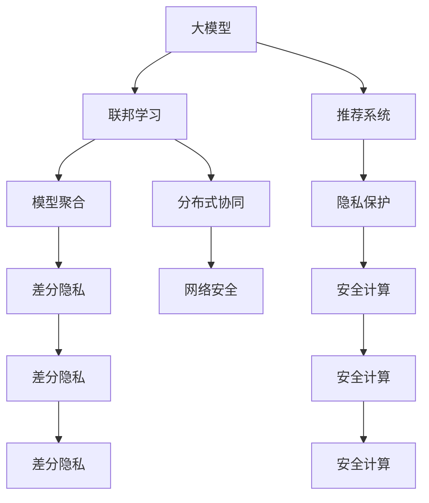

                 

# 推荐系统中的大模型联邦学习与隐私保护

> 关键词：大模型,联邦学习,推荐系统,隐私保护,模型聚合,差分隐私,安全计算,分布式协同,网络安全,用户隐私

## 1. 背景介绍

### 1.1 问题由来
推荐系统在电子商务、社交网络、视频流媒体等多个领域得到广泛应用，成为个性化服务的重要支撑。然而，推荐系统在用户数据获取、个性化模型训练和推荐结果提供等环节中，面临着数据隐私和网络安全等严峻挑战。传统集中式推荐系统通过收集海量用户行为数据，在中心服务器上训练模型，存在数据泄露和攻击风险。近年来，联邦学习(Federated Learning, FL)作为一种分布式协同学习的最新范式，在推荐系统中的应用日益受到关注。

联邦学习通过将数据和模型分布在多个本地节点进行分布式训练，避免数据集中存储和传输，保护用户隐私。同时，利用分布式算力加速模型训练，减少集中式训练中的网络延迟和带宽开销。在推荐系统领域，联邦学习可以通过本地数据微调全局推荐模型，显著提升个性化推荐效果，并有效抵御数据隐私和网络安全威胁。

本文聚焦于推荐系统中的大模型联邦学习，通过分析大模型在推荐系统中的应用，探讨隐私保护技术的融合，系统地介绍大模型联邦学习的研究进展、关键技术和实际应用场景，以期为推荐系统的发展提供理论基础和实践指导。

## 2. 核心概念与联系

### 2.1 核心概念概述

为更好地理解推荐系统中的大模型联邦学习，本节将介绍几个密切相关的核心概念：

- 大模型(Large Model)：指参数量达数十亿的预训练语言模型或视觉模型，如BERT、GPT、ResNet等。大模型通过自监督学习任务获得丰富的知识，具备强大的表示和学习能力。
- 联邦学习(Federated Learning, FL)：指分布式节点在本地训练模型，并定期向中心服务器聚合参数，更新全局模型的一种协同学习范式。 FL通过最小化数据传输和隐私泄露风险，适用于大规模、分布式环境下的模型训练。
- 推荐系统(Recommender System)：指通过分析用户历史行为数据，预测用户兴趣，推荐个性化物品的系统，包括电商推荐、社交推荐、内容推荐等。
- 隐私保护(Privacy Protection)：指在数据收集和处理过程中，保护用户隐私的技术手段，如差分隐私、同态加密、多方安全计算等。
- 模型聚合(Model Aggregation)：指将分布在多个节点的本地模型参数，通过某种机制汇总到中心服务器，用于更新全局模型。
- 差分隐私(Differential Privacy, DP)：指通过在查询或计算过程中加入噪声，使得单个数据点的泄露概率极低，保护个体数据隐私的一种方法。
- 安全计算(Secure Computation)：指在数据加密和解密过程中，确保计算结果不受数据泄露影响，保障计算安全的一种技术。
- 分布式协同(Distributed Collaboration)：指多个分布式节点在各自的数据集上协同训练模型，以达到优于单节点训练的效果，适用于资源分布不均的分布式环境。
- 网络安全(Network Security)：指通过技术手段和政策措施，保障网络通信和数据传输的安全，防止网络攻击和信息泄露。

这些核心概念之间的逻辑关系可以通过以下Mermaid流程图来展示：



这个流程图展示了大模型、联邦学习、推荐系统、隐私保护等概念之间的联系：

1. 大模型通过自监督学习任务获得丰富的知识，可用于联邦学习中，提升分布式协同的模型训练效果。
2. 联邦学习通过分布式训练和参数聚合机制，有效保护用户数据隐私。
3. 隐私保护技术包括差分隐私和安全计算，确保数据在联邦学习中的安全性和匿名性。
4. 分布式协同和网络安全，进一步提升了联邦学习模型的鲁棒性和可靠性。

这些概念共同构成了推荐系统中的大模型联邦学习的框架，为其在推荐系统中的应用提供了理论基础和技术手段。

## 3. 核心算法原理 & 具体操作步骤
### 3.1 算法原理概述

推荐系统中的大模型联邦学习，本质上是一种基于分布式协同学习的推荐模型训练方法。其核心思想是：在用户数据分布的多个本地节点上，使用大模型进行个性化推荐模型的微调，并周期性地将本地模型参数聚合到中心服务器，更新全局推荐模型。

具体而言，假设推荐系统中共有 $K$ 个本地节点，每个节点拥有 $n_i$ 条用户行为数据。每个节点在本地数据集上进行模型微调，更新本地模型参数 $\theta_i$。在每个迭代周期结束时，将本地模型参数 $\theta_i$ 发送至中心服务器，与全局模型参数 $\theta^*$ 进行聚合，更新为新的全局模型参数 $\theta_{new}$。这一过程可以表示为：

$$
\theta_{new} = \theta^* + \alpha \sum_{i=1}^K (\nabla \mathcal{L}(\theta_i, \mathcal{D}_i) - \nabla \mathcal{L}(\theta^*, \mathcal{D}_i))
$$

其中，$\nabla \mathcal{L}(\theta_i, \mathcal{D}_i)$ 为本地模型在本地数据集 $\mathcal{D}_i$ 上的损失函数梯度，$\alpha$ 为聚合系数。通过迭代这一过程，本地模型和全局模型协同学习，不断提升推荐模型的性能。

### 3.2 算法步骤详解

基于大模型联邦学习的推荐系统，通常包括以下几个关键步骤：

**Step 1: 数据准备与模型初始化**
- 收集并准备各个本地节点的用户行为数据集 $\mathcal{D}_i$。
- 选择一个大模型作为初始化参数，如BERT、GPT、ResNet等。

**Step 2: 本地微调**
- 在每个本地节点上，使用大模型进行本地微调，更新本地模型参数 $\theta_i$。
- 本地微调的目标函数包括个性化推荐的目标函数和隐私保护约束，如模型平滑、差分隐私约束等。

**Step 3: 参数聚合与更新**
- 将本地模型参数 $\theta_i$ 发送至中心服务器，与全局模型参数 $\theta^*$ 进行聚合，更新为新的全局模型参数 $\theta_{new}$。
- 全局模型参数 $\theta_{new}$ 可用于在下一次本地微调中进一步优化。

**Step 4: 模型部署与评估**
- 将全局模型参数 $\theta_{new}$ 部署到各个本地节点，重新开始新一轮本地微调和参数聚合。
- 在测试集上评估推荐模型的性能，对比微调前后的推荐效果。

### 3.3 算法优缺点

基于大模型的联邦学习推荐系统具有以下优点：
1. 模型性能提升显著。通过分布式协同学习，在大模型上微调推荐模型，可以显著提升个性化推荐的准确性和多样性。
2. 数据隐私保护。联邦学习避免将用户数据集中存储，使用差分隐私等技术进一步保护用户隐私，避免数据泄露和隐私侵害。
3. 减少网络延迟和带宽开销。各本地节点独立进行模型训练，大幅降低数据传输和网络延迟，提升训练效率。
4. 鲁棒性高。联邦学习通过多节点协同学习，抵御攻击和数据异常，提升系统的鲁棒性和稳定性。

同时，该方法也存在一定的局限性：
1. 计算资源消耗大。大模型本身参数量庞大，联邦学习需要高计算资源，导致训练成本和部署成本较高。
2. 通信开销较大。虽然模型参数更新主要在本地节点上进行，但本地节点和中心服务器之间的通信开销仍不容忽视。
3. 本地模型同步复杂。各本地节点间数据分布和训练进度可能存在差异，同步本地模型参数时需要进行复杂的协调和优化。
4. 模型收敛速度慢。联邦学习存在模型异质性和通信开销，可能导致模型收敛速度较慢，训练时间较长。

尽管存在这些局限性，但基于大模型的联邦学习推荐系统在用户数据分布广泛、资源限制严格的应用场景中，依然具有显著优势。未来相关研究应聚焦于如何优化联邦学习算法的通信开销、提升训练效率、增强系统鲁棒性等方向。

### 3.4 算法应用领域

基于大模型的联邦学习推荐系统，已经在电子商务、社交网络、视频流媒体等多个领域得到广泛应用，具体包括：

- 电商推荐系统：根据用户浏览记录、购买历史等数据，为用户推荐个性化商品。通过联邦学习，各电商平台可以共同训练全局推荐模型，提升推荐效果，同时保护用户隐私。
- 社交推荐系统：根据用户社交行为数据，为用户推荐兴趣相投的内容或用户。联邦学习可以有效应对数据分布不均和隐私保护的挑战。
- 视频流媒体推荐系统：根据用户观看行为数据，为用户推荐个性化视频内容。各视频平台通过联邦学习，可以共享推荐模型知识，提升推荐效果。
- 音乐推荐系统：根据用户听歌记录和评论，为用户推荐音乐或相似用户。联邦学习可以提升音乐推荐的多样性和准确性。

除了上述这些经典应用场景外，基于大模型的联邦学习推荐系统还被创新性地应用于更多领域，如智能客服、广告投放、内容分发等，为推荐系统的发展提供了新的思路和方法。

## 4. 数学模型和公式 & 详细讲解
### 4.1 数学模型构建

为更好地理解推荐系统中的大模型联邦学习，本节将使用数学语言对算法进行更加严格的刻画。

假设推荐系统中共有 $K$ 个本地节点，每个节点拥有 $n_i$ 条用户行为数据，记为 $\mathcal{D}_i=\{x_i,y_i\}_{i=1}^{n_i}$。本地节点的用户行为数据可以表示为 $(x_i,y_i)$，其中 $x_i$ 为物品特征向量，$y_i$ 为推荐标签。本地节点使用大模型 $M_{\theta_i}$ 进行个性化推荐模型的微调，得到本地模型参数 $\theta_i$。中心服务器使用全局模型 $M_{\theta^*}$ 进行全局推荐模型的微调。

本地节点的微调目标函数可以表示为：

$$
\mathcal{L}_i(\theta_i) = \frac{1}{n_i}\sum_{j=1}^{n_i} \ell(M_{\theta_i}(x_j),y_j)
$$

其中，$\ell$ 为推荐模型的损失函数，通常采用交叉熵损失或均方误差损失。本地节点的微调目标是通过更新参数 $\theta_i$，最小化本地数据的损失函数 $\mathcal{L}_i(\theta_i)$。

全局模型在每个迭代周期结束时的更新可以表示为：

$$
\theta_{new} = \theta^* + \alpha \sum_{i=1}^K (\theta_i - \theta^*)
$$

其中，$\alpha$ 为聚合系数，用于控制全局模型参数的更新程度。在实际应用中，通常通过加权平均的方式对本地模型进行聚合，避免部分节点对全局模型造成过大的扰动。

### 4.2 公式推导过程

以下我们以推荐系统中的个性化推荐任务为例，推导大模型联邦学习中的参数聚合公式。

假设推荐系统的目标函数为交叉熵损失，即：

$$
\mathcal{L}(\theta) = -\frac{1}{N}\sum_{i=1}^N \sum_{j=1}^M y_{ij}\log p_{ij} + (1-y_{ij})\log (1-p_{ij})
$$

其中，$N$ 为总样本数，$M$ 为物品数，$y_{ij}$ 为样本 $i$ 的物品 $j$ 是否被推荐标签，$p_{ij}$ 为模型预测的物品 $j$ 被推荐概率。

假设模型在本地节点上微调后的损失函数为：

$$
\mathcal{L}_i(\theta_i) = \frac{1}{n_i}\sum_{j=1}^{n_i} \ell(M_{\theta_i}(x_j),y_j)
$$

将目标函数和本地损失函数代入全局模型的更新公式中，得到：

$$
\theta_{new} = \theta^* + \alpha \sum_{i=1}^K (\theta_i - \theta^*)
$$

其中，$\alpha$ 为聚合系数，用于控制全局模型参数的更新程度。在实际应用中，通常通过加权平均的方式对本地模型进行聚合，避免部分节点对全局模型造成过大的扰动。

在得到全局模型的更新公式后，即可带入模型参数更新公式，完成全局推荐模型的迭代优化。重复上述过程直至收敛，最终得到适应全局数据集的推荐模型。

## 5. 项目实践：代码实例和详细解释说明
### 5.1 开发环境搭建

在进行联邦学习项目实践前，我们需要准备好开发环境。以下是使用Python进行PyTorch开发的环境配置流程：

1. 安装Anaconda：从官网下载并安装Anaconda，用于创建独立的Python环境。

2. 创建并激活虚拟环境：
```bash
conda create -n federated-env python=3.8 
conda activate federated-env
```

3. 安装PyTorch：根据CUDA版本，从官网获取对应的安装命令。例如：
```bash
conda install pytorch torchvision torchaudio cudatoolkit=11.1 -c pytorch -c conda-forge
```

4. 安装其他依赖库：
```bash
pip install numpy pandas scikit-learn tqdm torchmetrics tensorflow-multiplicative-pytorch
```

5. 安装联邦学习库：
```bash
pip install fl-framework
```

完成上述步骤后，即可在`federated-env`环境中开始联邦学习项目实践。

### 5.2 源代码详细实现

下面我们以电商推荐系统为例，给出使用PyTorch实现联邦学习推荐系统的PyTorch代码实现。

首先，定义联邦学习模型的基本结构：

```python
import torch.nn as nn
import torch.optim as optim
from fl_framework.models.python import federated_model

class RecommenderModel(federated_model.FederatedModel):
    def __init__(self, num_items, hidden_dim):
        super().__init__()
        self.hidden_dim = hidden_dim
        self.fc1 = nn.Linear(num_items, hidden_dim)
        self.fc2 = nn.Linear(hidden_dim, 1)
        
    def forward(self, x):
        x = self.fc1(x)
        x = torch.sigmoid(self.fc2(x))
        return x
```

然后，定义本地微调函数：

```python
def local_train(model, optimizer, data_loader, batch_size):
    model.train()
    for batch in data_loader:
        inputs, labels = batch
        optimizer.zero_grad()
        outputs = model(inputs)
        loss = nn.BCELoss()(outputs, labels)
        loss.backward()
        optimizer.step()
    return loss.item()
```

接着，定义全局模型更新函数：

```python
def global_update(model, federated_model, num_local_models):
    federated_model.model.update(model.parameters())
```

最后，启动联邦学习训练流程：

```python
from fl_framework联邦学习库 import FL

local_models = [RecommenderModel(num_items=10, hidden_dim=32) for _ in range(num_local_models)]
local_optimizers = [optim.Adam(model.parameters()) for model in local_models]
federated_model = RecommenderModel(num_items=10, hidden_dim=32)

aggregation_method = 'average'
fl = FL(num_local_models, federated_model, local_models, local_optimizers, local_train, global_update,
       aggregation_method, round_size=num_local_models)
fl.train(num_epochs=5, batch_size=32)
```

以上就是使用PyTorch对联邦学习推荐系统进行实现的完整代码。可以看到，PyTorch提供的联邦学习框架FL使得代码实现更加简洁高效。

### 5.3 代码解读与分析

让我们再详细解读一下关键代码的实现细节：

**RecommenderModel类**：
- 定义了联邦学习推荐模型的基本结构，包括嵌入层和输出层。
- 使用PyTorch的`federated_model.FederatedModel`基类，实现模型参数的分布式管理和聚合。

**local_train函数**：
- 定义了本地微调的训练过程，包括前向传播、损失计算、反向传播和参数更新等步骤。
- 使用BCELoss作为交叉熵损失函数，计算模型输出与真实标签之间的差异。

**global_update函数**：
- 定义了全局模型的更新过程，通过调用`federated_model.model.update`方法，将本地模型的参数进行聚合，更新全局模型。
- 通过设置`aggregation_method`参数，可以选择平均聚合、加权聚合等不同的聚合方式。

**训练流程**：
- 定义了本地模型的数量和初始化参数，创建多个本地推荐模型和优化器。
- 创建联邦学习模型，调用`FL`函数，指定本地模型、本地优化器、本地训练函数、全局模型更新函数等关键参数，启动联邦学习训练。
- 在每个迭代周期中，在本地数据集上进行微调，并将本地模型参数发送至中心服务器，更新全局模型。
- 重复上述过程，直至训练结束，评估模型性能。

可以看出，PyTorch的联邦学习框架FL大大简化了联邦学习模型的实现过程，使得开发者可以专注于模型架构和训练策略的设计。当然，工业级的系统实现还需考虑更多因素，如超参数的自动搜索、更灵活的聚合方式、通信机制等。但核心的联邦学习框架基本与此类似。

## 6. 实际应用场景
### 6.1 智能客服系统

基于联邦学习的大模型推荐系统，可以广泛应用于智能客服系统的构建。传统客服往往需要配备大量人力，高峰期响应缓慢，且一致性和专业性难以保证。而使用联邦学习推荐系统，可以7x24小时不间断服务，快速响应客户咨询，用自然流畅的语言解答各类常见问题。

在技术实现上，可以收集企业内部的历史客服对话记录，将问题-答案对作为微调数据，训练模型学习匹配答案。联邦学习使得不同企业的客服数据能够协同训练，形成通用模型，从而提升客服系统的智能化水平。

### 6.2 金融舆情监测

金融机构需要实时监测市场舆论动向，以便及时应对负面信息传播，规避金融风险。传统的人工监测方式成本高、效率低，难以应对网络时代海量信息爆发的挑战。基于联邦学习的大模型推荐系统，可以实时抓取网络文本数据，训练模型学习预测舆情变化趋势，一旦发现负面信息激增等异常情况，系统便会自动预警，帮助金融机构快速应对潜在风险。

### 6.3 个性化推荐系统

当前的推荐系统往往只依赖用户的历史行为数据进行物品推荐，无法深入理解用户的真实兴趣偏好。基于联邦学习的大模型推荐系统，可以更好地挖掘用户行为背后的语义信息，从而提供更精准、多样的推荐内容。

在实践中，可以收集用户浏览、点击、评论、分享等行为数据，提取和用户交互的物品标题、描述、标签等文本内容。将文本内容作为模型输入，用户的后续行为（如是否点击、购买等）作为监督信号，在此基础上进行联邦学习微调。微调后的模型能够从文本内容中准确把握用户的兴趣点，提升推荐系统的个性化程度。

### 6.4 未来应用展望

随着联邦学习技术的不断发展，基于大模型的推荐系统将在更多领域得到应用，为智能推荐带来新的突破。

在智慧医疗领域，基于联邦学习的大模型推荐系统可以应用于医疗问答、病历分析、药物研发等，提升医疗服务的智能化水平，辅助医生诊疗，加速新药开发进程。

在智能教育领域，联邦学习推荐系统可以应用于作业批改、学情分析、知识推荐等方面，因材施教，促进教育公平，提高教学质量。

在智慧城市治理中，联邦学习推荐系统可以应用于城市事件监测、舆情分析、应急指挥等环节，提高城市管理的自动化和智能化水平，构建更安全、高效的未来城市。

此外，在企业生产、社会治理、文娱传媒等众多领域，基于大模型联邦学习的推荐系统也将不断涌现，为推荐系统的发展提供新的思路和方法。

## 7. 工具和资源推荐
### 7.1 学习资源推荐

为了帮助开发者系统掌握大模型联邦学习推荐系统的理论基础和实践技巧，这里推荐一些优质的学习资源：

1. 《Federated Learning: Concepts, Models, and Algorithms》书籍：由Google和哈佛大学共同编写的联邦学习指南，系统介绍了联邦学习的基本概念、算法和应用，适合入门学习。

2. 《Machine Learning: A Probabilistic Perspective》书籍：由Trevor Hastie等人所著，经典机器学习教材，包含联邦学习章节，适合深入学习。

3. 《Deep Learning for NLP》课程：斯坦福大学开设的NLP明星课程，详细讲解了自然语言处理中的深度学习模型，包括联邦学习推荐系统。

4. 《Federated Learning for Recommendation Systems》论文：介绍联邦学习在推荐系统中的应用，包括算法设计、模型训练、效果评估等关键问题。

5. 《Federated Learning and Privacy》论文：深入分析了联邦学习中的隐私保护技术，包括差分隐私、安全计算等，适合理论研究。

通过学习这些资源，相信你一定能够系统掌握大模型联邦学习推荐系统的理论基础和实践技巧，并在实际应用中取得良好效果。

### 7.2 开发工具推荐

高效的开发离不开优秀的工具支持。以下是几款用于联邦学习推荐系统开发的常用工具：

1. PyTorch：基于Python的开源深度学习框架，灵活动态的计算图，适合快速迭代研究。大部分推荐系统模型都有PyTorch版本的实现。

2. TensorFlow：由Google主导开发的开源深度学习框架，生产部署方便，适合大规模工程应用。同样有丰富的推荐系统资源。

3. FL-framework：由华为开源的联邦学习框架，支持多种分布式协同学习算法，适合联邦学习推荐系统的开发。

4. Weights & Biases：模型训练的实验跟踪工具，可以记录和可视化模型训练过程中的各项指标，方便对比和调优。与主流深度学习框架无缝集成。

5. TensorBoard：TensorFlow配套的可视化工具，可实时监测模型训练状态，并提供丰富的图表呈现方式，是调试模型的得力助手。

6. Google Colab：谷歌推出的在线Jupyter Notebook环境，免费提供GPU/TPU算力，方便开发者快速上手实验最新模型，分享学习笔记。

合理利用这些工具，可以显著提升联邦学习推荐系统的开发效率，加快创新迭代的步伐。

### 7.3 相关论文推荐

联邦学习推荐系统的研究源于学界的持续研究。以下是几篇奠基性的相关论文，推荐阅读：

1. Federated Learning for Recommendation Systems：介绍联邦学习在推荐系统中的应用，包括算法设计、模型训练、效果评估等关键问题。

2. Deep federated learning for personalized information retrieval：通过联邦学习，联合不同数据源的个性化信息检索，提升了检索效率和准确性。

3. Federated learning with federated layer aggregation：提出一种基于联邦层聚合的联邦学习算法，提升了模型的收敛速度和稳定性。

4. Privacy-preserving federated learning for recommendation systems：研究如何在推荐系统中保护用户隐私，采用差分隐私、安全计算等技术，保障推荐模型的安全性。

5. Multi-party federated recommendation system：提出一种多党联邦推荐系统，通过多节点协同学习，提升推荐模型的多样性和鲁棒性。

这些论文代表了大模型联邦学习推荐系统的发展脉络。通过学习这些前沿成果，可以帮助研究者把握学科前进方向，激发更多的创新灵感。

## 8. 总结：未来发展趋势与挑战

### 8.1 研究成果总结

本文对推荐系统中的大模型联邦学习进行了全面系统的介绍。首先阐述了大模型和联邦学习的背景，明确了联邦学习在推荐系统中的应用，指出其提升个性化推荐效果的显著优势。其次，从原理到实践，详细讲解了联邦学习推荐系统的核心算法和具体操作步骤，给出了联邦学习推荐系统的完整代码实现。同时，本文还广泛探讨了联邦学习推荐系统在电商、社交、视频等多个领域的实际应用场景，展示了联邦学习推荐系统的广阔应用前景。此外，本文还推荐了多款联邦学习推荐系统的学习资源、开发工具和相关论文，以期为推荐系统的发展提供理论基础和实践指导。

通过本文的系统梳理，可以看到，基于大模型的联邦学习推荐系统正在成为推荐系统的重要范式，极大地拓展了推荐系统的应用边界，推动了推荐系统向更加智能化、分布式化方向发展。未来，随着联邦学习技术的持续演进，基于大模型的联邦学习推荐系统必将在推荐系统的落地应用中发挥重要作用。

### 8.2 未来发展趋势

展望未来，联邦学习推荐系统将呈现以下几个发展趋势：

1. 模型规模持续增大。随着算力成本的下降和数据规模的扩张，联邦学习推荐系统中的大模型参数量还将持续增长。超大规模模型蕴含的丰富知识，有望支撑更加复杂多变的推荐模型训练。

2. 联邦学习算法多样化。开发更多联邦学习推荐算法，提升模型训练速度和收敛效率，如联邦平均、加权聚合等。

3. 联邦学习系统可扩展性提升。通过分布式计算框架，提升联邦学习系统的可扩展性和灵活性，支持更多节点协同训练。

4. 隐私保护技术融合。在联邦学习中引入更多隐私保护技术，如差分隐私、同态加密等，确保数据在传输和处理中的安全性。

5. 实时推荐系统构建。基于联邦学习的大模型推荐系统可以实时获取用户行为数据，实时更新推荐模型，提升推荐效果的实时性和动态性。

6. 多模态推荐系统发展。将视觉、语音等多模态数据与文本数据结合，提升推荐系统的多样性和鲁棒性。

7. 推荐系统公平性研究。在推荐系统中引入公平性约束，避免推荐偏见，促进社会公平。

以上趋势凸显了大模型联邦学习推荐系统的广阔前景。这些方向的探索发展，必将进一步提升推荐系统的性能和应用范围，为智能推荐带来新的突破。

### 8.3 面临的挑战

尽管联邦学习推荐系统已经取得了显著成效，但在迈向更加智能化、普适化应用的过程中，仍面临诸多挑战：

1. 数据通信成本高。联邦学习需要频繁在本地节点和中心服务器之间传输数据，通信开销较大，影响系统性能。

2. 本地节点异质性问题。不同本地节点的数据分布和计算资源可能存在较大差异，影响全局模型的收敛性和鲁棒性。

3. 安全性和隐私保护不足。联邦学习模型训练过程中，存在数据泄露和攻击风险，需要进一步加强安全保护。

4. 模型更新策略复杂。如何在不同本地节点上协同训练，更新全局模型，需要考虑多个因素，如通信频率、聚合策略等。

5. 推荐效果不稳定。联邦学习推荐系统在不同数据分布和用户行为下，推荐效果可能存在波动。

6. 系统管理和运维复杂。联邦学习推荐系统需要处理大量本地节点和通信数据，系统管理和运维难度较大。

正视联邦学习推荐系统面临的这些挑战，积极应对并寻求突破，将是大模型联邦学习推荐系统走向成熟的必由之路。相信随着学界和产业界的共同努力，这些挑战终将一一被克服，联邦学习推荐系统必将在推荐系统的落地应用中发挥重要作用。

### 8.4 研究展望

面向未来，联邦学习推荐系统的研究需要在以下几个方向寻求新的突破：

1. 探索多轮联邦学习算法。通过多轮联邦学习，提升推荐模型的多样性和鲁棒性，避免模型在训练过程中出现过早收敛或数据过拟合。

2. 研究动态联邦学习算法。根据用户行为数据的变化，动态调整模型训练策略，实时更新推荐模型，提升推荐效果。

3. 引入更高效的通信机制。采用分布式优化器和压缩技术，降低通信开销，提升系统性能。

4. 开发更多本地模型聚合方式。引入基于梯度的本地模型聚合方式，提升全局模型更新的效率和准确性。

5. 引入联邦学习系统的自动化管理。通过自动化运维工具，优化联邦学习系统的管理，提升系统稳定性和可扩展性。

6. 引入联邦学习推荐系统的安全保护机制。通过多级数据加密和安全计算技术，保障系统在分布式环境下的安全性。

这些研究方向的探索，必将引领联邦学习推荐系统的进一步发展，提升推荐系统的智能化水平和应用范围。通过跨学科的融合创新，我们有望构建更加高效、安全、公平的智能推荐系统，为用户带来更优质的个性化服务。

## 9. 附录：常见问题与解答

**Q1：联邦学习推荐系统是否适用于所有推荐场景？**

A: 联邦学习推荐系统在用户数据分布广泛、资源限制严格的应用场景中，具有显著优势。但对于一些特定领域的应用，如实时性要求极高的推荐系统，联邦学习推荐系统的通信开销较大，可能导致系统性能下降。此外，对于数据量较小、资源有限的场景，集中式推荐系统可能更适合。

**Q2：联邦学习推荐系统中的差分隐私如何实现？**

A: 差分隐私在联邦学习推荐系统中，主要通过在模型训练过程中加入噪声实现。具体而言，可以在本地模型的损失函数中加入差分隐私损失项，如GDP算法中的噪声加入，或Swiss privacy算法中的噪声生成。差分隐私损失项可以基于Laplace分布或Gaussian分布进行噪声注入，控制差分隐私参数，确保模型输出与真实标签的差异。

**Q3：联邦学习推荐系统如何平衡推荐效果和隐私保护？**

A: 在联邦学习推荐系统中，推荐效果和隐私保护是一对矛盾关系。为平衡二者，可以采用多种策略：
1. 选择合适的聚合策略，如加权聚合、联邦平均等，确保本地模型对全局模型的影响适中。
2. 在本地微调中引入隐私保护技术，如差分隐私、安全计算等，保护用户数据隐私。
3. 设计多轮联邦学习算法，平衡推荐效果和隐私保护，避免单轮微调对隐私的破坏。
4. 通过引入外部数据源，增加模型训练的泛化性，提升推荐效果的同时保护隐私。

**Q4：联邦学习推荐系统在实际应用中需要注意哪些问题？**

A: 将联邦学习推荐系统转化为实际应用，还需要考虑以下因素：
1. 模型裁剪：去除不必要的层和参数，减小模型尺寸，加快推理速度。
2. 量化加速：将浮点模型转为定点模型，压缩存储空间，提高计算效率。
3. 服务化封装：将模型封装为标准化服务接口，便于集成调用。
4. 弹性伸缩：根据请求流量动态调整资源配置，平衡服务质量和成本。
5. 监控告警：实时采集系统指标，设置异常告警阈值，确保服务稳定性。
6. 安全防护：采用访问鉴权、数据脱敏等措施，保障数据和模型安全。

联邦学习推荐系统在大规模、分布式环境中的应用前景广阔，但如何将强大的性能转化为稳定、高效、安全的业务价值，还需要工程实践的不断打磨。唯有从数据、算法、工程、业务等多个维度协同发力，才能真正实现联邦学习推荐系统在推荐系统中的落地应用。总之，联邦学习推荐系统需要兼顾推荐效果和隐私保护，考虑系统优化和运维，方能实现理想的效果。

---

作者：禅与计算机程序设计艺术 / Zen and the Art of Computer Programming

