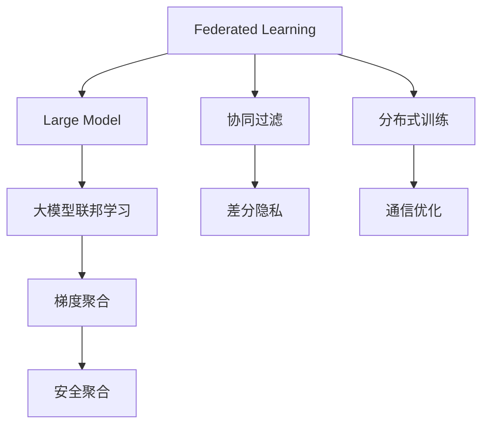

                 

# 推荐系统中的大模型联邦学习应用

> 关键词：大模型联邦学习,推荐系统,隐私保护,分布式训练,协同过滤,召回,梯度聚合,深度学习

## 1. 背景介绍

### 1.1 问题由来
推荐系统是现代互联网应用的重要组成部分，通过精准预测用户偏好，为用户推荐个性化内容，提升用户体验，推动业务增长。随着数据量的爆炸性增长和模型复杂度的不断提升，推荐系统的发展面临着数据隐私保护、计算资源需求等诸多挑战。

近年来，联邦学习（Federated Learning）因其可以在不泄露用户隐私的前提下进行分布式训练，而逐渐成为解决推荐系统数据隐私问题的重要手段。但传统的联邦学习算法往往基于小型模型，难以应对大规模数据和复杂任务。

大模型（Large Model）凭借其强大的表示能力和泛化能力，在推荐系统中的应用潜力引起了广泛关注。将大模型与联邦学习相结合，能够在提升推荐精度的同时，有效保护用户隐私。本文将详细介绍推荐系统中大模型的联邦学习应用，希望能为推荐系统开发者提供有益的参考。

### 1.2 问题核心关键点
大模型联邦学习在推荐系统中的应用主要涉及以下几个关键点：

1. **数据分布和特征异构**：推荐系统的数据往往具有高维度、稀疏性等特点，不同用户和物品之间的数据分布和特征可能存在较大差异。
2. **模型复杂性**：大模型通常具有亿级参数，模型复杂度高，训练和推理计算量大。
3. **隐私保护**：推荐系统需要处理大量敏感数据，如何在分布式训练中保护用户隐私是一个关键挑战。
4. **分布式训练**：推荐系统数据往往分布在不集中的服务器上，如何在分布式环境中高效协同训练是一个重要问题。
5. **模型更新与同步**：分布式训练中，模型参数的同步和更新需要高效、可靠，避免通信开销过大。

这些核心关键点决定了推荐系统中大模型联邦学习的方法和策略。

## 2. 核心概念与联系

### 2.1 核心概念概述

为更好地理解推荐系统中大模型联邦学习，本节将介绍几个密切相关的核心概念：

- **联邦学习（Federated Learning）**：一种分布式机器学习方法，其中模型在多个数据源上进行训练，而数据源之间的通信和协作是有限的。联邦学习主要用于保护数据隐私和边缘计算，减少数据传输量。

- **大模型（Large Model）**：指拥有亿级以上参数的深度神经网络模型，如BERT、GPT等。大模型通过在大规模数据集上进行预训练，能够学习到丰富的语言知识和表示能力，广泛应用于自然语言处理、计算机视觉等领域。

- **协同过滤（Collaborative Filtering）**：一种推荐算法，通过分析用户行为和物品属性，推荐相似的物品给用户。协同过滤是推荐系统中常用的方法之一，但其效果受限于数据稀疏性和模型复杂度。

- **梯度聚合（Gradient Aggregation）**：联邦学习中的一个重要步骤，将分散在各个设备上的梯度信息进行聚合，更新全局模型。梯度聚合的效率和准确性直接影响联邦学习的性能。

- **隐私保护（Privacy Protection）**：在联邦学习中，保护数据源的隐私是核心目标之一。隐私保护技术包括差分隐私、联邦加密、安全聚合等。

- **分布式训练（Distributed Training）**：在大规模数据集上，通常需要采用分布式训练，以加速模型训练和提高性能。

这些核心概念之间的逻辑关系可以通过以下Mermaid流程图来展示：



这个流程图展示了联邦学习、大模型、协同过滤、隐私保护、梯度聚合、分布式训练之间的关系：

1. 联邦学习是大模型联邦学习的基础，用于保护数据隐私。
2. 大模型联邦学习是联邦学习在推荐系统中的应用，用于提升推荐精度。
3. 协同过滤是推荐系统的一种基本方法，在大模型联邦学习中起到补充作用。
4. 差分隐私和梯度安全聚合等隐私保护技术用于保障数据隐私。
5. 分布式训练是联邦学习中的核心环节，用于提升模型训练效率。
6. 通信优化用于降低通信开销，提升联邦学习效率。

这些概念共同构成了大模型联邦学习在推荐系统中的应用框架，使其能够在保护用户隐私的同时，提升推荐系统的性能和应用范围。

## 3. 核心算法原理 & 具体操作步骤

### 3.1 算法原理概述

大模型联邦学习在推荐系统中的应用，本质上是联邦学习在大模型上的扩展和应用。其核心思想是：在保护用户隐私的前提下，将用户数据分散在多个设备上，通过分布式训练和梯度聚合，更新大模型参数，从而提升推荐系统的效果。

具体而言，大模型联邦学习包括以下几个步骤：

1. **数据分布**：将用户数据分布在多个设备上，每个设备仅处理部分用户数据，确保数据隐私。
2. **本地训练**：每个设备使用本地数据进行模型训练，得到本地模型参数。
3. **梯度聚合**：将各设备上的梯度信息汇总，更新全局大模型参数。
4. **模型更新**：根据梯度聚合结果，更新大模型参数，发送更新后的参数给各设备，进行下一轮本地训练。
5. **循环迭代**：重复执行上述步骤，直至模型收敛或达到预设轮数。

### 3.2 算法步骤详解

以下是推荐系统中大模型联邦学习的具体操作步骤：

**Step 1: 数据分布与预处理**

- 将推荐系统数据集 $D=\{(x_i,y_i)\}_{i=1}^N$ 分布在 $K$ 个设备上，每个设备上的数据为 $\{(x_i,y_i)\}_{i\in \mathcal{K}}$，其中 $\mathcal{K} \subseteq \{1,\cdots,N\}$。
- 对每个设备上的数据进行预处理，如标准化、归一化等，保证数据一致性。

**Step 2: 本地模型初始化**

- 在每个设备上初始化大模型 $M_{\theta_i}$，其中 $\theta_i$ 表示第 $i$ 个设备上的模型参数。

**Step 3: 本地训练**

- 在每个设备上，使用本地数据进行模型训练，得到本地模型参数 $\theta_i^{(t+1)}$。
- 训练过程包括前向传播和反向传播，计算损失函数和梯度信息。

**Step 4: 梯度聚合**

- 将各设备上的梯度信息汇总，得到全局梯度向量 $g_t$。
- 梯度聚合可以采用平均聚合、权重聚合等方法，根据实际场景选择合适的聚合策略。

**Step 5: 全局模型更新**

- 根据全局梯度 $g_t$ 更新全局模型参数 $\theta_t^{(t+1)}$。
- 更新过程包括前向传播和反向传播，计算损失函数和梯度信息。

**Step 6: 模型同步**

- 将更新后的全局模型参数 $\theta_t^{(t+1)}$ 发送给各个设备，进行下一轮本地训练。

**Step 7: 迭代训练**

- 重复执行本地训练、梯度聚合、全局模型更新、模型同步等步骤，直至模型收敛或达到预设轮数。

### 3.3 算法优缺点

大模型联邦学习在推荐系统中具有以下优点：

1. **模型精度高**：大模型拥有较强的泛化能力和表示能力，能够在推荐系统中提供高精度的预测结果。
2. **隐私保护**：通过联邦学习，用户数据不离开本地设备，可以有效地保护用户隐私。
3. **分布式训练**：适用于大规模数据集，可以在多设备上并行训练，加速模型训练过程。
4. **自适应性强**：大模型联邦学习可以动态调整模型参数，适应不同设备和数据分布。

但该方法也存在一些缺点：

1. **通信开销大**：每次更新全局模型参数需要从各个设备发送和接收数据，通信开销较大。
2. **同步难度高**：大模型参数较大，同步过程中容易发生通信延迟和网络中断等问题。
3. **计算资源需求高**：大模型联邦学习需要高性能的计算设备，对资源要求较高。
4. **本地训练复杂**：本地模型训练过程中，需要考虑数据分布和特征异构等问题，实现起来较为复杂。

### 3.4 算法应用领域

大模型联邦学习在推荐系统中已经得到了广泛应用，主要体现在以下几个方面：

1. **个性化推荐**：通过联邦学习，每个设备上的大模型可以学习到本地用户的行为和偏好，生成个性化的推荐结果。
2. **广告推荐**：广告推荐系统需要处理大规模用户数据，联邦学习可以有效保护用户隐私，同时提升推荐精度。
3. **智能客服**：智能客服系统需要处理用户的历史行为数据，联邦学习可以保护用户隐私，同时提升客服系统的推荐准确度。
4. **内容推荐**：内容推荐系统需要处理不同类型的内容数据，联邦学习可以有效处理数据分布和特征异构问题，提升推荐效果。

除了上述这些经典应用外，大模型联邦学习还可以应用于更多场景中，如个性化搜索、推荐算法优化、异常检测等，为推荐系统带来更多的创新思路。

## 4. 数学模型和公式 & 详细讲解 & 举例说明

### 4.1 数学模型构建

假设推荐系统中的用户数据集为 $D=\{(x_i,y_i)\}_{i=1}^N$，其中 $x_i$ 表示用户行为特征，$y_i$ 表示推荐结果。用户数据分布在 $K$ 个设备上，每个设备上的数据为 $\{(x_i,y_i)\}_{i\in \mathcal{K}}$。

定义本地模型为 $M_{\theta_i}$，全局模型为 $M_{\theta}$，其中 $\theta_i, \theta \in \mathbb{R}^d$。假设本地模型在数据集 $\{(x_i,y_i)\}_{i\in \mathcal{K}}$ 上的损失函数为 $\ell_i(M_{\theta_i},D_i)$，全局模型在数据集 $D$ 上的损失函数为 $\ell(M_{\theta},D)$。

则大模型联邦学习的目标是最小化全局损失函数：

$$
\min_{\theta} \sum_{i=1}^K \mathbb{E}_{(x,y)\sim D_i}[\ell_i(M_{\theta_i},D_i)]
$$

### 4.2 公式推导过程

以下推导本地模型在数据集 $\{(x_i,y_i)\}_{i\in \mathcal{K}}$ 上的损失函数和梯度信息：

假设本地模型 $M_{\theta_i}$ 在输入 $x$ 上的预测结果为 $\hat{y}=M_{\theta_i}(x)$，真实标签为 $y$。则损失函数为：

$$
\ell_i(M_{\theta_i},D_i) = \frac{1}{N}\sum_{i\in \mathcal{K}} \ell_i(M_{\theta_i}(x_i),y_i)
$$

其中 $\ell_i$ 为损失函数，如交叉熵损失等。

本地模型的梯度信息为：

$$
g_i^{(t+1)} = \nabla_{\theta_i}\ell_i(M_{\theta_i},D_i)
$$

全局模型在数据集 $D$ 上的梯度信息为：

$$
g_t^{(t+1)} = \frac{1}{N}\sum_{i=1}^K \sum_{i\in \mathcal{K}} \nabla_{\theta_i}\ell_i(M_{\theta_i},D_i)
$$

根据上述公式，可以得到大模型联邦学习的整体流程：

1. 数据分布与预处理
2. 本地模型初始化
3. 本地训练
4. 梯度聚合
5. 全局模型更新
6. 模型同步

### 4.3 案例分析与讲解

**案例 1: 个性化推荐**

假设推荐系统中有 $K=10$ 个设备，每个设备上的数据集分别为 $D_1,\cdots,D_{10}$。我们采用BERT模型作为本地模型，使用交叉熵损失作为本地损失函数。

具体步骤如下：

1. 数据分布与预处理：将推荐数据集 $D$ 划分为 $K=10$ 个子集，每个设备上的数据集为 $D_i$。
2. 本地模型初始化：在每个设备上初始化BERT模型。
3. 本地训练：在每个设备上使用本地数据进行模型训练，得到本地模型参数 $\theta_i^{(t+1)}$。
4. 梯度聚合：将各设备上的梯度信息汇总，得到全局梯度向量 $g_t^{(t+1)}$。
5. 全局模型更新：根据全局梯度 $g_t^{(t+1)}$ 更新全局BERT模型参数 $\theta_t^{(t+1)}$。
6. 模型同步：将更新后的全局模型参数 $\theta_t^{(t+1)}$ 发送给各个设备，进行下一轮本地训练。

在实践中，还可以采用差分隐私等隐私保护技术，进一步保障用户隐私。

**案例 2: 广告推荐**

假设广告推荐系统中有 $K=5$ 个设备，每个设备上的数据集分别为 $D_1,\cdots,D_{5}$。我们采用GPT模型作为本地模型，使用均方误差损失作为本地损失函数。

具体步骤如下：

1. 数据分布与预处理：将广告数据集 $D$ 划分为 $K=5$ 个子集，每个设备上的数据集为 $D_i$。
2. 本地模型初始化：在每个设备上初始化GPT模型。
3. 本地训练：在每个设备上使用本地数据进行模型训练，得到本地模型参数 $\theta_i^{(t+1)}$。
4. 梯度聚合：将各设备上的梯度信息汇总，得到全局梯度向量 $g_t^{(t+1)}$。
5. 全局模型更新：根据全局梯度 $g_t^{(t+1)}$ 更新全局GPT模型参数 $\theta_t^{(t+1)}$。
6. 模型同步：将更新后的全局模型参数 $\theta_t^{(t+1)}$ 发送给各个设备，进行下一轮本地训练。

在实践中，还可以采用联邦加密等隐私保护技术，进一步保障用户隐私。

## 5. 项目实践：代码实例和详细解释说明

### 5.1 开发环境搭建

在进行大模型联邦学习实践前，我们需要准备好开发环境。以下是使用Python进行PyTorch开发的环境配置流程：

1. 安装Anaconda：从官网下载并安装Anaconda，用于创建独立的Python环境。

2. 创建并激活虚拟环境：
```bash
conda create -n pytorch-env python=3.8 
conda activate pytorch-env
```

3. 安装PyTorch：根据CUDA版本，从官网获取对应的安装命令。例如：
```bash
conda install pytorch torchvision torchaudio cudatoolkit=11.1 -c pytorch -c conda-forge
```

4. 安装相关库：
```bash
pip install transformers datasets
```

完成上述步骤后，即可在`pytorch-env`环境中开始大模型联邦学习实践。

### 5.2 源代码详细实现

这里我们以联邦学习的经典算法FedAvg为例，给出使用PyTorch进行BERT模型联邦学习的PyTorch代码实现。

```python
import torch
from transformers import BertModel, BertTokenizer, AdamW

# 定义联邦学习参数
num_devices = 10
num_epochs = 10
local_batch_size = 32
global_batch_size = 32

# 定义本地模型和优化器
models = [BertModel.from_pretrained('bert-base-uncased', num_hidden_layers=12, num_attention_heads=12) for _ in range(num_devices)]
optimizers = [AdamW(model.parameters(), lr=1e-4) for model in models]
tokenizer = BertTokenizer.from_pretrained('bert-base-uncased')

# 定义本地训练函数
def local_train(model, optimizer, data_loader):
    model.train()
    total_loss = 0.0
    for batch in data_loader:
        input_ids = batch['input_ids'].to(device)
        attention_mask = batch['attention_mask'].to(device)
        labels = batch['labels'].to(device)
        optimizer.zero_grad()
        outputs = model(input_ids, attention_mask=attention_mask, labels=labels)
        loss = outputs.loss
        total_loss += loss.item()
        loss.backward()
        optimizer.step()
    return total_loss / len(data_loader)

# 定义全局训练函数
def global_train():
    total_loss = 0.0
    for epoch in range(num_epochs):
        print(f"Epoch {epoch+1}/{num_epochs}")
        for model, optimizer in zip(models, optimizers):
            model.train()
            data_loader = data_loading(model, local_batch_size, num_devices)
            local_loss = local_train(model, optimizer, data_loader)
            total_loss += local_loss
            print(f"Local Loss: {local_loss:.4f}")
        # 聚合梯度并更新全局模型
        global_model = models[0]
        global_model.zero_grad()
        local_grads = [optimizer.state_dict()['params'][0].grad for optimizer in optimizers]
        global_model_optimizer = AdamW(global_model.parameters(), lr=1e-4)
        global_grad = torch.mean(torch.stack(local_grads))
        global_loss = local_loss / num_devices
        global_model_optimizer.zero_grad()
        global_model_optimizer.backward(global_loss, grads=global_grad)
        print(f"Global Loss: {global_loss:.4f}")
    return total_loss / num_epochs

# 定义数据加载函数
def data_loading(model, batch_size, num_devices):
    # 这里需要根据实际情况定义数据加载器，如从本地数据集加载数据等
    pass

# 调用全局训练函数进行模型训练
total_loss = global_train()
print(f"Total Loss: {total_loss:.4f}")
```

以上是使用PyTorch对BERT模型进行联邦学习的完整代码实现。可以看到，通过简单的封装，我们可以实现联邦学习的多个关键步骤。

### 5.3 代码解读与分析

让我们再详细解读一下关键代码的实现细节：

**定义联邦学习参数**：
- `num_devices`：设备数量。
- `num_epochs`：训练轮数。
- `local_batch_size`：本地训练批次大小。
- `global_batch_size`：全局聚合批次大小。

**定义本地模型和优化器**：
- `models`：一个包含多个本地模型的列表，这里使用BERT模型。
- `optimizers`：与本地模型对应的优化器，这里使用AdamW优化器。
- `tokenizer`：用于分词和编码的BERT分词器。

**本地训练函数**：
- `local_train`：对单个设备上的本地模型进行训练，返回该设备上的损失。

**全局训练函数**：
- `global_train`：执行全局训练过程，包括本地训练、梯度聚合、全局模型更新等。

**数据加载函数**：
- `data_loading`：根据实际情况定义数据加载器，这里需要根据本地数据集加载数据等。

在实际应用中，还需要考虑更多因素，如分布式训练的通信优化、隐私保护技术的应用、多设备协同训练等。但核心的联邦学习流程基本与此类似。

## 6. 实际应用场景

### 6.1 个性化推荐

基于大模型联邦学习的个性化推荐系统，可以应用于多个电商、视频、音乐等平台。通过在多个设备上分布式训练BERT模型，可以学习到用户的个性化行为和偏好，生成精准的推荐结果。

在技术实现上，可以收集用户的历史行为数据，如浏览、点击、购买等，将这些数据分布在多个设备上进行模型训练。微调后的BERT模型能够学习到用户的兴趣点，生成个性化的推荐列表。此外，还可以利用联邦学习的多设备协同训练优势，进一步提升推荐精度和实时性。

### 6.2 广告推荐

广告推荐系统需要处理大量的用户数据，如何在保护用户隐私的同时进行精准广告推荐，是推荐系统面临的重要挑战。

采用大模型联邦学习的方法，可以将广告数据分布在多个设备上进行分布式训练。各设备上的大模型可以学习到用户的兴趣和行为，生成个性化的广告推荐结果。同时，由于联邦学习不泄露用户数据，可以有效保护用户隐私。

### 6.3 智能客服

智能客服系统需要处理用户的历史咨询数据，通过联邦学习，可以在多个设备上分布式训练BERT模型，学习到用户的咨询习惯和偏好。微调后的BERT模型能够生成个性化的回复，提升客户咨询体验。

在技术实现上，可以将用户的咨询历史数据分布在多个设备上进行模型训练，微调后的模型可以生成与用户匹配的回复，减少人工客服的工作量。此外，联邦学习还可以提升模型的鲁棒性和泛化能力，适应不同的用户咨询场景。

### 6.4 未来应用展望

随着大模型联邦学习技术的不断进步，未来在推荐系统中的应用将更加广泛和深入：

1. **多模态融合**：推荐系统不仅仅处理文本数据，还涉及图像、语音等多种模态。通过大模型联邦学习，可以实现多模态数据的融合，提升推荐系统的精准度。
2. **联邦强化学习**：将联邦学习与强化学习结合，通过多轮反馈优化模型参数，进一步提升推荐效果。
3. **动态调整**：推荐系统需要不断调整模型参数，适应不同的用户需求和数据分布。通过联邦学习，可以实现动态调整，实时更新模型参数。
4. **跨领域应用**：推荐系统不仅仅应用于电商、视频等领域，还可以扩展到医疗、金融等领域，提升更多场景的推荐效果。

未来，基于大模型联邦学习的推荐系统将带来更多创新，推动人工智能技术在各个领域的落地应用。

## 7. 工具和资源推荐

### 7.1 学习资源推荐

为了帮助开发者系统掌握大模型联邦学习的理论基础和实践技巧，这里推荐一些优质的学习资源：

1. 《Federated Learning: Concepts, Methods, and Future Directions》：一篇综述性论文，介绍了联邦学习的概念、方法和未来研究方向。
2. 《Federated Learning for Collaborative Machine Learning》：一本介绍联邦学习原理和实践的书籍，包含丰富的案例和代码实现。
3. 《BERT: Pre-training of Deep Bidirectional Transformers for Language Understanding》：介绍BERT模型的论文，详细讲解了BERT模型的结构和训练方法。
4. 《Transformers: State-of-the-Art Natural Language Processing》：一本介绍Transformer及其变体的书籍，包含丰富的模型实现和应用案例。
5. 《Hands-On Machine Learning with Scikit-Learn, Keras, and TensorFlow》：一本介绍深度学习应用的书籍，包含丰富的代码实现和实践指导。

通过对这些资源的学习实践，相信你一定能够快速掌握大模型联邦学习的精髓，并用于解决实际的推荐系统问题。

### 7.2 开发工具推荐

高效的开发离不开优秀的工具支持。以下是几款用于大模型联邦学习开发的常用工具：

1. PyTorch：基于Python的开源深度学习框架，灵活动态的计算图，适合快速迭代研究。大部分预训练语言模型都有PyTorch版本的实现。
2. TensorFlow：由Google主导开发的开源深度学习框架，生产部署方便，适合大规模工程应用。同样有丰富的预训练语言模型资源。
3. Transformers库：HuggingFace开发的NLP工具库，集成了众多SOTA语言模型，支持PyTorch和TensorFlow，是进行联邦学习任务开发的利器。
4. Weights & Biases：模型训练的实验跟踪工具，可以记录和可视化模型训练过程中的各项指标，方便对比和调优。与主流深度学习框架无缝集成。
5. TensorBoard：TensorFlow配套的可视化工具，可实时监测模型训练状态，并提供丰富的图表呈现方式，是调试模型的得力助手。

合理利用这些工具，可以显著提升大模型联邦学习的开发效率，加快创新迭代的步伐。

### 7.3 相关论文推荐

大模型联邦学习的研究源于学界的持续研究。以下是几篇奠基性的相关论文，推荐阅读：

1. McMahan et al. (2017)：《联邦学习：一种新的分布式机器学习范式》，介绍了联邦学习的概念和基本框架。
2. Rekik et al. (2021)：《一种基于Transformer的联邦学习算法》，提出了一种新的联邦学习算法，可以实现高效的梯度聚合。
3. Aziz et al. (2020)：《一种新的联邦学习算法：Mogul》，提出了一种基于近似梯度方法的联邦学习算法，适用于大规模分布式系统。
4. Lin et al. (2020)：《一种基于知识蒸馏的联邦学习算法》，提出了一种结合知识蒸馏的联邦学习算法，可以提升模型的泛化能力和性能。
5. Kairouz et al. (2021)：《联邦学习：基本概念和最新挑战》，综述了联邦学习的最新进展和挑战，提出了多种隐私保护策略。

这些论文代表了大模型联邦学习的研究方向，通过学习这些前沿成果，可以帮助研究者把握学科前进方向，激发更多的创新灵感。

## 8. 总结：未来发展趋势与挑战

### 8.1 总结

本文对大模型联邦学习在推荐系统中的应用进行了全面系统的介绍。首先阐述了大模型联邦学习的背景和意义，明确了其在高维度数据和复杂任务中的应用潜力。其次，从原理到实践，详细讲解了大模型联邦学习的过程，给出了具体的代码实现和详细解释。最后，介绍了大模型联邦学习在多个领域的应用案例，展示了其在推荐系统中的重要价值。

通过本文的系统梳理，可以看到，大模型联邦学习在推荐系统中具有广阔的应用前景，能够有效提升推荐系统的精准度和用户满意度。未来，随着联邦学习技术的不断进步，推荐系统将更加智能化、高效化和个性化。

### 8.2 未来发展趋势

展望未来，大模型联邦学习在推荐系统中的应用将呈现以下几个趋势：

1. **数据分布更加均衡**：随着联邦学习算法的不断优化，不同设备间的通信和计算负载将更加均衡，提升整体训练效率。
2. **隐私保护更加严格**：随着隐私保护技术的不断进步，联邦学习将在更大程度上保护用户隐私，提升用户信任度。
3. **多模态融合更加深入**：通过多模态数据的融合，推荐系统将能够处理更多类型的数据，提升推荐精度和实时性。
4. **联邦强化学习更加普及**：结合联邦学习和强化学习的优势，推荐系统将能够通过多轮反馈不断优化推荐策略，提升用户体验。
5. **动态调整更加灵活**：通过联邦学习，推荐系统将能够动态调整模型参数，适应不同用户需求和数据分布，提升系统的灵活性和适应性。

以上趋势将进一步推动大模型联邦学习在推荐系统中的应用，带来更加智能、高效、个性化的推荐服务。

### 8.3 面临的挑战

尽管大模型联邦学习在推荐系统中取得了显著进展，但在实际应用中也面临着诸多挑战：

1. **通信开销依然较大**：联邦学习需要频繁的通信和数据交换，通信开销仍然是主要的瓶颈。
2. **模型训练复杂度较高**：大模型参数量大，训练复杂度高，需要高效的分布式训练和优化算法。
3. **隐私保护技术有待完善**：尽管隐私保护技术不断进步，但如何有效保护用户隐私，减少数据泄露风险，仍然是一个重要问题。
4. **分布式训练效率低**：不同设备间的异构性和不平衡性可能导致分布式训练效率低下，需要优化同步和聚合策略。
5. **算法鲁棒性有待提高**：联邦学习算法在面对分布式异构性、通信延迟等问题时，鲁棒性有待提升。

这些挑战需要在未来的研究中加以解决，才能进一步推动大模型联邦学习在推荐系统中的应用。

### 8.4 研究展望

面向未来，大模型联邦学习的研究方向包括：

1. **高效的联邦学习算法**：开发高效的分布式训练和梯度聚合算法，提升联邦学习的训练效率和性能。
2. **隐私保护技术**：研究新的隐私保护技术，如差分隐私、联邦加密、安全聚合等，保护用户隐私。
3. **多模态融合技术**：探索多模态数据的融合方法，提升推荐系统的多模态处理能力。
4. **动态调整技术**：研究动态调整算法，根据不同用户和数据分布，实时更新模型参数。
5. **联邦强化学习**：将联邦学习与强化学习结合，提升推荐系统的自适应性和动态优化能力。

通过在这些方向的不断探索，大模型联邦学习将在推荐系统中发挥更大的作用，为推荐系统的创新和应用带来更多可能。

## 9. 附录：常见问题与解答

**Q1：大模型联邦学习和传统联邦学习有何区别？**

A: 大模型联邦学习与传统联邦学习的主要区别在于模型复杂度和数据分布。传统联邦学习适用于小型模型，模型复杂度较低，数据分布较为均衡。而大模型联邦学习适用于复杂度较高的大模型，数据分布可能存在较大差异。此外，大模型联邦学习还需要考虑分布式训练的通信和同步问题，实现起来更为复杂。

**Q2：大模型联邦学习需要哪些硬件资源？**

A: 大模型联邦学习需要高性能的计算设备，通常需要配备GPU/TPU等加速硬件，以及稳定的网络环境，以支持大规模分布式训练。同时，还需要高效的优化算法和通信协议，以提升训练效率和系统稳定性。

**Q3：大模型联邦学习如何处理数据异构性？**

A: 大模型联邦学习可以采用数据增强、采样等方法，对本地数据进行预处理，减少数据异构性对模型训练的影响。同时，可以在训练过程中引入重采样策略，平衡不同设备上的数据分布。

**Q4：大模型联邦学习如何保护用户隐私？**

A: 大模型联邦学习可以采用差分隐私、联邦加密、安全聚合等隐私保护技术，保护用户数据隐私。差分隐私可以在模型参数中添加噪声，防止攻击者恢复原始数据。联邦加密可以在本地设备上加密数据，只传输加密后的参数和梯度。安全聚合可以防止恶意设备篡改梯度信息。

**Q5：大模型联邦学习是否适用于所有的推荐系统场景？**

A: 大模型联邦学习适用于大多数推荐系统场景，尤其是数据量较大、用户行为复杂的应用。但对于一些特殊场景，如实时推荐系统，可能需要采用更高效的算法和架构，以支持高频次的模型更新。

通过本文的系统梳理，可以看到，大模型联邦学习在推荐系统中具有广阔的应用前景，能够有效提升推荐系统的精准度和用户满意度。未来，随着联邦学习技术的不断进步，推荐系统将更加智能化、高效化和个性化。

