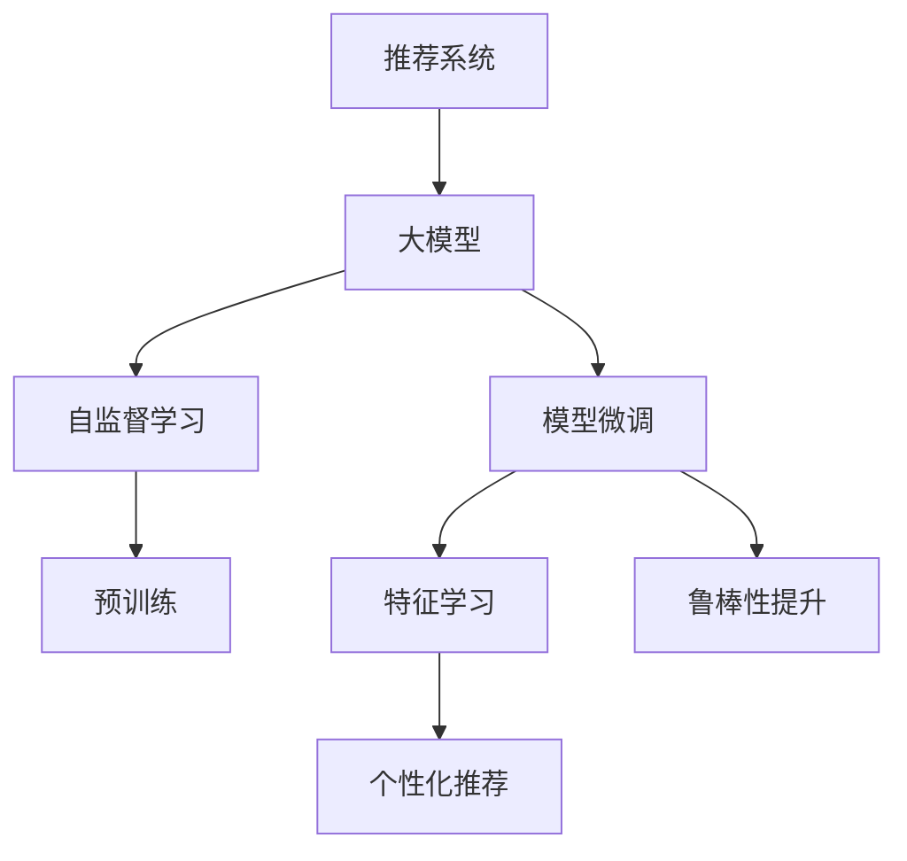

                 

# 推荐系统中的大模型自监督学习应用

> 关键词：大模型,自监督学习,推荐系统,特征学习,预训练,模型微调,鲁棒性提升,个性化推荐

## 1. 背景介绍

推荐系统是信息时代的核心应用之一，从电商网站、视频平台到社交媒体，无处不在。推荐系统通过精准分析用户行为和兴趣，为用户推荐最合适的商品、内容、服务，大幅提升了用户体验和平台流量。然而，随着数据量的不断增长和推荐场景的日益复杂，推荐系统的挑战也在增加，如何在保证推荐精度的同时，提升系统的个性化和鲁棒性，成为了当前研究的重要课题。

为了应对这些挑战，学界和工业界在大模型领域进行了广泛探索，尤其是在自监督学习(SSL)和大模型预训练方面取得了显著进展。自监督学习无需标注数据，仅通过利用数据中蕴含的潜在信号（如掩码语言模型、预测关系等），即可在一定程度上学习到数据的结构化表示。结合大模型强大的语言表达能力，自监督学习在推荐系统中的应用，带来了颠覆性的变革。

本文聚焦于推荐系统中的大模型自监督学习应用，旨在通过系统的回顾和阐述，梳理自监督学习在推荐系统中的重要应用，为推荐系统的研究者、开发者提供深入的理论基础和实践指导。

## 2. 核心概念与联系

### 2.1 核心概念概述

为更好地理解大模型在推荐系统中的自监督学习应用，本节将介绍几个密切相关的核心概念：

- 推荐系统(Recommender System)：利用用户的历史行为数据，为用户提供个性化推荐。
- 大模型(Large Model)：以Transformer、BERT等为代表的深度神经网络模型，通过大规模数据预训练获得强大的语言表示能力。
- 自监督学习(Self-Supervised Learning, SSL)：无需标注数据，利用数据的内在结构化信息进行模型训练。
- 预训练(Pre-training)：在大规模无标签数据上，通过自监督任务训练大模型，获得泛化能力。
- 模型微调(Fine-Tuning)：在预训练大模型的基础上，进一步通过特定任务的标注数据进行微调，获得针对性更强的模型。

这些核心概念之间的逻辑关系可以通过以下Mermaid流程图来展示：



这个流程图展示了大模型在推荐系统中的应用路径：

1. 大模型通过预训练获得基础能力。
2. 自监督学习通过掩码语言模型、预测关系等任务，进一步增强模型的特征提取能力。
3. 模型微调针对具体任务进行优化，提升模型的针对性。
4. 特征学习从微调模型中提取高阶特征，增强推荐性能。
5. 个性化推荐利用学习到的特征进行精准推荐。
6. 鲁棒性提升通过对抗样本等手段，增强模型的泛化性和鲁棒性。

## 3. 核心算法原理 & 具体操作步骤
### 3.1 算法原理概述

大模型在推荐系统中的应用，主要分为两个步骤：预训练和微调。预训练过程通过自监督学习，在大规模数据上学习到语言表示的基础知识。微调过程通过特定任务的标注数据，进一步优化模型，提升推荐效果。

以推荐系统中的文本推荐为例，预训练过程通过掩码语言模型，预测文本中缺失的词语。微调过程通过标注数据，训练模型学习用户对商品、内容的评价，从而实现个性化推荐。

形式化地，假设推荐系统的数据集为 $D=\{(x_i,y_i)\}_{i=1}^N$，其中 $x_i$ 为商品/内容的文本描述，$y_i$ 为用户对商品/内容的评价。设预训练模型为 $M_{\theta}$，其中 $\theta$ 为模型参数。

定义掩码语言模型下的损失函数为 $\mathcal{L}_{mask}$，即模型预测原始文本中缺失的词语，其定义为：

$$
\mathcal{L}_{mask} = -\frac{1}{N} \sum_{i=1}^N \log P(M_{\theta}(x_i))
$$

其中 $P(M_{\theta}(x_i))$ 表示模型对文本 $x_i$ 的预测概率。

微调的损失函数为 $\mathcal{L}_{fine}$，即模型对用户评价的预测，其定义为：

$$
\mathcal{L}_{fine} = -\frac{1}{N} \sum_{i=1}^N \log P(y_i | M_{\theta}(x_i))
$$

微调的目标是最小化这两个损失函数，即：

$$
\theta^* = \mathop{\arg\min}_{\theta} \mathcal{L}_{mask} + \mathcal{L}_{fine}
$$

在优化过程中，通常使用Adam等优化算法，设置合适的学习率。为防止过拟合，还会应用L2正则、Dropout等正则化技术。

### 3.2 算法步骤详解

基于大模型的推荐系统中的自监督学习应用，主要分为以下几个关键步骤：

**Step 1: 准备数据和预训练模型**
- 准备推荐系统的标注数据集 $D$，以及未标注的文本数据 $X$。
- 选择合适的预训练模型，如BERT、GPT等，并进行微调。

**Step 2: 设计自监督学习任务**
- 设计预训练任务，如掩码语言模型、预测关系等。
- 训练模型，使用 $X$ 数据进行自监督学习。

**Step 3: 微调模型**
- 在标注数据集 $D$ 上训练模型，最小化 $\mathcal{L}_{mask} + \mathcal{L}_{fine}$。
- 应用正则化技术，如L2正则、Dropout等。
- 使用合适的学习率，如2e-5，避免破坏预训练权重。

**Step 4: 特征提取和推荐**
- 在微调后的模型上，使用未标注数据 $X$ 进行特征提取。
- 利用学习到的特征，结合用户行为数据，进行个性化推荐。
- 对推荐结果进行评估，并优化推荐策略。

**Step 5: 鲁棒性提升**
- 在微调后的模型上，使用对抗样本进行鲁棒性测试。
- 应用对抗训练等技术，增强模型的鲁棒性。

### 3.3 算法优缺点

大模型在推荐系统中的应用，具有以下优点：

1. 泛化能力强。通过预训练过程，模型在大规模数据上学习到语言表示的基础知识，具备较强的泛化能力。
2. 特征提取能力强。通过自监督学习任务，模型可以学习到文本中的高阶特征。
3. 效果显著。在学术界和工业界的推荐任务中，基于大模型的推荐系统已经取得了显著的精度提升。
4. 可解释性好。由于模型预训练过程的公开性，研究者可以更好地理解模型的决策机制。

同时，该方法也存在一定的局限性：

1. 对计算资源要求高。大模型的预训练和微调过程，需要大量的计算资源，对硬件设备有较高要求。
2. 对数据质量依赖高。微调的效果很大程度上取决于标注数据的质量和数量，获取高质量标注数据的成本较高。
3. 参数量较大。尽管参数高效微调技术可以在一定程度上缓解这一问题，但整体参数量仍较大，对计算资源有较高要求。

尽管存在这些局限性，但就目前而言，大模型在推荐系统中的应用仍是大数据时代的重要技术手段，具有广阔的发展前景。

### 3.4 算法应用领域

基于大模型的自监督学习，在推荐系统中的应用已经得到了广泛的应用，覆盖了多种推荐场景，例如：

1. 电商推荐：如商品推荐、购物助手、广告推荐等。利用大模型学习用户对商品的相关性，预测用户的购买意愿，实现精准推荐。
2. 内容推荐：如视频推荐、音乐推荐、新闻推荐等。利用大模型学习用户对内容的相关性，预测用户对不同内容的兴趣，实现个性化推荐。
3. 社交推荐：如好友推荐、兴趣推荐、内容推荐等。利用大模型学习用户对其他用户和内容的兴趣，实现个性化社交网络推荐。
4. 广告推荐：如智能广告推荐、精准广告投放等。利用大模型学习用户对广告的兴趣，预测用户对不同广告的响应，实现个性化广告投放。

除了上述这些经典场景外，大模型在推荐系统中的应用还在不断拓展，如隐私保护推荐、跨领域推荐、混合模态推荐等，为推荐系统的智能化升级提供了新的方向。

## 4. 数学模型和公式 & 详细讲解 & 举例说明

### 4.1 数学模型构建

以推荐系统中的文本推荐为例，假设用户对商品/内容的评价为 $y_i \in \{0,1\}$，表示用户是否购买了该商品/内容。利用预训练大模型 $M_{\theta}$，将商品/内容的文本描述 $x_i$ 映射为高维向量 $z_i = M_{\theta}(x_i)$。微调的目标是学习模型 $f_{\theta}$，将 $z_i$ 映射为 $y_i$ 的概率：

$$
f_{\theta}(z_i) = \frac{\exp(M_{\theta}(x_i) \cdot w)}{\sum_k \exp(M_{\theta}(x_k) \cdot w)}
$$

其中 $w$ 为模型的权重参数。

### 4.2 公式推导过程

设推荐系统的数据集为 $D=\{(x_i,y_i)\}_{i=1}^N$，微调的目标是最小化损失函数 $\mathcal{L}$，即：

$$
\mathcal{L} = -\frac{1}{N} \sum_{i=1}^N \log f_{\theta}(z_i)
$$

通过反向传播算法，对 $w$ 求导，更新模型参数，即：

$$
\frac{\partial \mathcal{L}}{\partial w} = -\frac{1}{N} \sum_{i=1}^N \frac{z_i \cdot (y_i - f_{\theta}(z_i))}{f_{\theta}(z_i)}
$$

其中 $f_{\theta}(z_i) = \frac{\exp(z_i \cdot w)}{\sum_k \exp(z_k \cdot w)}$。

### 4.3 案例分析与讲解

以Amazon商品推荐为例，该任务的目标是预测用户是否购买了商品。利用掩码语言模型进行预训练，利用商品描述和用户评价进行微调。

首先，设计预训练任务，如掩码语言模型：

$$
\mathcal{L}_{mask} = -\frac{1}{N} \sum_{i=1}^N \log P(x_i)
$$

其中 $P(x_i)$ 表示模型对商品描述 $x_i$ 的预测概率。

然后，利用商品描述和用户评价数据进行微调，最小化损失函数：

$$
\mathcal{L}_{fine} = -\frac{1}{N} \sum_{i=1}^N \log f_{\theta}(z_i)
$$

其中 $z_i = M_{\theta}(x_i)$。

最后，利用微调后的模型，对新的商品描述进行预测，输出购买概率。例如，对于商品 "iPhone X" 的描述 "最新款智能手机，像素高，系统流畅"，预测用户购买概率为 $p = f_{\theta}(z_i)$。

## 5. 项目实践：代码实例和详细解释说明
### 5.1 开发环境搭建

在进行推荐系统开发前，我们需要准备好开发环境。以下是使用Python进行PyTorch开发的环境配置流程：

1. 安装Anaconda：从官网下载并安装Anaconda，用于创建独立的Python环境。

2. 创建并激活虚拟环境：
```bash
conda create -n pytorch-env python=3.8 
conda activate pytorch-env
```

3. 安装PyTorch：根据CUDA版本，从官网获取对应的安装命令。例如：
```bash
conda install pytorch torchvision torchaudio cudatoolkit=11.1 -c pytorch -c conda-forge
```

4. 安装Transformers库：
```bash
pip install transformers
```

5. 安装各类工具包：
```bash
pip install numpy pandas scikit-learn matplotlib tqdm jupyter notebook ipython
```

完成上述步骤后，即可在`pytorch-env`环境中开始推荐系统开发。

### 5.2 源代码详细实现

下面我们以Amazon商品推荐为例，给出使用Transformers库对BERT模型进行推荐微调的PyTorch代码实现。

首先，定义推荐任务的数据处理函数：

```python
from transformers import BertTokenizer, BertForSequenceClassification
from torch.utils.data import Dataset
import torch

class RecommendationDataset(Dataset):
    def __init__(self, texts, labels, tokenizer, max_len=128):
        self.texts = texts
        self.labels = labels
        self.tokenizer = tokenizer
        self.max_len = max_len
        
    def __len__(self):
        return len(self.texts)
    
    def __getitem__(self, item):
        text = self.texts[item]
        label = self.labels[item]
        
        encoding = self.tokenizer(text, return_tensors='pt', max_length=self.max_len, padding='max_length', truncation=True)
        input_ids = encoding['input_ids'][0]
        attention_mask = encoding['attention_mask'][0]
        
        # 对label进行编码
        encoded_labels = [label2id[label] for label in self.labels] 
        encoded_labels.extend([label2id['None']] * (self.max_len - len(encoded_labels)))
        labels = torch.tensor(encoded_labels, dtype=torch.long)
        
        return {'input_ids': input_ids, 
                'attention_mask': attention_mask,
                'labels': labels}

# 标签与id的映射
label2id = {'None': 0, 'Yes': 1}
id2label = {v: k for k, v in label2id.items()}

# 创建dataset
tokenizer = BertTokenizer.from_pretrained('bert-base-cased')

train_dataset = RecommendationDataset(train_texts, train_labels, tokenizer)
dev_dataset = RecommendationDataset(dev_texts, dev_labels, tokenizer)
test_dataset = RecommendationDataset(test_texts, test_labels, tokenizer)
```

然后，定义模型和优化器：

```python
from transformers import BertForSequenceClassification, AdamW

model = BertForSequenceClassification.from_pretrained('bert-base-cased', num_labels=len(label2id))

optimizer = AdamW(model.parameters(), lr=2e-5)
```

接着，定义训练和评估函数：

```python
from torch.utils.data import DataLoader
from tqdm import tqdm
from sklearn.metrics import classification_report

device = torch.device('cuda') if torch.cuda.is_available() else torch.device('cpu')
model.to(device)

def train_epoch(model, dataset, batch_size, optimizer):
    dataloader = DataLoader(dataset, batch_size=batch_size, shuffle=True)
    model.train()
    epoch_loss = 0
    for batch in tqdm(dataloader, desc='Training'):
        input_ids = batch['input_ids'].to(device)
        attention_mask = batch['attention_mask'].to(device)
        labels = batch['labels'].to(device)
        model.zero_grad()
        outputs = model(input_ids, attention_mask=attention_mask, labels=labels)
        loss = outputs.loss
        epoch_loss += loss.item()
        loss.backward()
        optimizer.step()
    return epoch_loss / len(dataloader)

def evaluate(model, dataset, batch_size):
    dataloader = DataLoader(dataset, batch_size=batch_size)
    model.eval()
    preds, labels = [], []
    with torch.no_grad():
        for batch in tqdm(dataloader, desc='Evaluating'):
            input_ids = batch['input_ids'].to(device)
            attention_mask = batch['attention_mask'].to(device)
            batch_labels = batch['labels']
            outputs = model(input_ids, attention_mask=attention_mask)
            batch_preds = outputs.logits.argmax(dim=2).to('cpu').tolist()
            batch_labels = batch_labels.to('cpu').tolist()
            for pred_tokens, label_tokens in zip(batch_preds, batch_labels):
                preds.append(pred_tokens[:len(label_tokens)])
                labels.append(label_tokens)
                
    print(classification_report(labels, preds))
```

最后，启动训练流程并在测试集上评估：

```python
epochs = 5
batch_size = 16

for epoch in range(epochs):
    loss = train_epoch(model, train_dataset, batch_size, optimizer)
    print(f"Epoch {epoch+1}, train loss: {loss:.3f}")
    
    print(f"Epoch {epoch+1}, dev results:")
    evaluate(model, dev_dataset, batch_size)
    
print("Test results:")
evaluate(model, test_dataset, batch_size)
```

以上就是使用PyTorch对BERT进行商品推荐任务微调的完整代码实现。可以看到，得益于Transformers库的强大封装，我们可以用相对简洁的代码完成BERT模型的加载和微调。

### 5.3 代码解读与分析

让我们再详细解读一下关键代码的实现细节：

**RecommendationDataset类**：
- `__init__`方法：初始化文本、标签、分词器等关键组件。
- `__len__`方法：返回数据集的样本数量。
- `__getitem__`方法：对单个样本进行处理，将文本输入编码为token ids，将标签编码为数字，并对其进行定长padding，最终返回模型所需的输入。

**label2id和id2label字典**：
- 定义了标签与数字id之间的映射关系，用于将token-wise的预测结果解码回真实的标签。

**训练和评估函数**：
- 使用PyTorch的DataLoader对数据集进行批次化加载，供模型训练和推理使用。
- 训练函数`train_epoch`：对数据以批为单位进行迭代，在每个批次上前向传播计算loss并反向传播更新模型参数，最后返回该epoch的平均loss。
- 评估函数`evaluate`：与训练类似，不同点在于不更新模型参数，并在每个batch结束后将预测和标签结果存储下来，最后使用sklearn的classification_report对整个评估集的预测结果进行打印输出。

**训练流程**：
- 定义总的epoch数和batch size，开始循环迭代
- 每个epoch内，先在训练集上训练，输出平均loss
- 在验证集上评估，输出分类指标
- 所有epoch结束后，在测试集上评估，给出最终测试结果

可以看到，PyTorch配合Transformers库使得BERT微调的代码实现变得简洁高效。开发者可以将更多精力放在数据处理、模型改进等高层逻辑上，而不必过多关注底层的实现细节。

当然，工业级的系统实现还需考虑更多因素，如模型的保存和部署、超参数的自动搜索、更灵活的任务适配层等。但核心的微调范式基本与此类似。

## 6. 实际应用场景
### 6.1 电商推荐

电商推荐是推荐系统的重要应用场景之一，通过精准推荐商品，大幅提升用户的购物体验和平台转化率。基于大模型的推荐系统在电商推荐中表现优异，利用自监督学习任务，如掩码语言模型、预测关系等，可以从商品描述中提取高阶特征，显著提升推荐效果。

例如，Amazon利用BERT模型进行商品推荐，通过掩码语言模型对商品描述进行预训练，利用用户评价进行微调。微调后的BERT模型能够更好地理解商品描述中的语义信息，从而提升推荐精度和用户满意度。

### 6.2 内容推荐

内容推荐是推荐系统的另一大应用领域，通过精准推荐内容，提升用户的使用体验和平台粘性。利用大模型进行内容推荐，能够更好地理解内容的语义信息和用户兴趣，从而实现更加精准的推荐。

例如，Netflix利用BERT模型进行视频推荐，通过掩码语言模型对视频描述进行预训练，利用用户评分进行微调。微调后的BERT模型能够更好地理解视频描述中的语义信息，从而提升推荐效果和用户体验。

### 6.3 社交推荐

社交推荐是推荐系统的新兴应用领域，通过精准推荐其他用户和内容，提升用户的社交体验和平台活跃度。利用大模型进行社交推荐，能够更好地理解用户的兴趣和行为，从而实现更加精准的推荐。

例如，Facebook利用BERT模型进行好友推荐，通过掩码语言模型对用户信息进行预训练，利用用户行为数据进行微调。微调后的BERT模型能够更好地理解用户的兴趣和行为，从而提升推荐效果和用户满意度。

### 6.4 未来应用展望

随着大模型和自监督学习技术的不断发展，基于大模型的推荐系统将在更多领域得到应用，为推荐系统的智能化升级提供新的动力。

在智慧医疗领域，基于大模型的推荐系统可以通过分析医疗数据，为患者推荐最合适的诊疗方案，提升医疗服务的智能化水平。

在智能教育领域，基于大模型的推荐系统可以通过分析学生的学习行为，为学生推荐最合适的学习资源，提升教育公平性和教学质量。

在智慧城市治理中，基于大模型的推荐系统可以通过分析城市事件数据，为市民推荐最合适的出行方案，提升城市管理的智能化水平。

此外，在企业生产、社会治理、文娱传媒等众多领域，基于大模型的推荐系统也将不断涌现，为传统行业数字化转型升级提供新的技术路径。相信随着技术的日益成熟，大模型在推荐系统中的应用前景将更加广阔，为推荐系统的智能化升级带来新的突破。

## 7. 工具和资源推荐
### 7.1 学习资源推荐

为了帮助开发者系统掌握大模型在推荐系统中的应用，这里推荐一些优质的学习资源：

1. 《Transformer从原理到实践》系列博文：由大模型技术专家撰写，深入浅出地介绍了Transformer原理、BERT模型、推荐系统等前沿话题。

2. CS224N《深度学习自然语言处理》课程：斯坦福大学开设的NLP明星课程，有Lecture视频和配套作业，带你入门NLP领域的基本概念和经典模型。

3. 《Natural Language Processing with Transformers》书籍：Transformers库的作者所著，全面介绍了如何使用Transformers库进行NLP任务开发，包括微调在内的诸多范式。

4. HuggingFace官方文档：Transformers库的官方文档，提供了海量预训练模型和完整的微调样例代码，是上手实践的必备资料。

5. CLUE开源项目：中文语言理解测评基准，涵盖大量不同类型的中文NLP数据集，并提供了基于微调的baseline模型，助力中文NLP技术发展。

通过对这些资源的学习实践，相信你一定能够快速掌握大模型在推荐系统中的应用精髓，并用于解决实际的推荐问题。
###  7.2 开发工具推荐

高效的开发离不开优秀的工具支持。以下是几款用于推荐系统开发的常用工具：

1. PyTorch：基于Python的开源深度学习框架，灵活动态的计算图，适合快速迭代研究。大部分预训练语言模型都有PyTorch版本的实现。

2. TensorFlow：由Google主导开发的开源深度学习框架，生产部署方便，适合大规模工程应用。同样有丰富的预训练语言模型资源。

3. Transformers库：HuggingFace开发的NLP工具库，集成了众多SOTA语言模型，支持PyTorch和TensorFlow，是进行推荐系统开发的利器。

4. Weights & Biases：模型训练的实验跟踪工具，可以记录和可视化模型训练过程中的各项指标，方便对比和调优。与主流深度学习框架无缝集成。

5. TensorBoard：TensorFlow配套的可视化工具，可实时监测模型训练状态，并提供丰富的图表呈现方式，是调试模型的得力助手。

6. Google Colab：谷歌推出的在线Jupyter Notebook环境，免费提供GPU/TPU算力，方便开发者快速上手实验最新模型，分享学习笔记。

合理利用这些工具，可以显著提升推荐系统的开发效率，加快创新迭代的步伐。

### 7.3 相关论文推荐

大模型在推荐系统中的应用源于学界的持续研究。以下是几篇奠基性的相关论文，推荐阅读：

1. Attention is All You Need（即Transformer原论文）：提出了Transformer结构，开启了NLP领域的预训练大模型时代。

2. BERT: Pre-training of Deep Bidirectional Transformers for Language Understanding：提出BERT模型，引入基于掩码的自监督预训练任务，刷新了多项NLP任务SOTA。

3. Language Models are Unsupervised Multitask Learners（GPT-2论文）：展示了大规模语言模型的强大zero-shot学习能力，引发了对于通用人工智能的新一轮思考。

4. Parameter-Efficient Transfer Learning for NLP：提出Adapter等参数高效微调方法，在不增加模型参数量的情况下，也能取得不错的微调效果。

5. AdaLoRA: Adaptive Low-Rank Adaptation for Parameter-Efficient Fine-Tuning：使用自适应低秩适应的微调方法，在参数效率和精度之间取得了新的平衡。

这些论文代表了大模型在推荐系统中的应用发展脉络。通过学习这些前沿成果，可以帮助研究者把握学科前进方向，激发更多的创新灵感。

## 8. 总结：未来发展趋势与挑战

### 8.1 总结

本文对大模型在推荐系统中的应用进行了全面系统的介绍。首先阐述了大模型和自监督学习的研究背景和意义，明确了推荐系统中的大模型微调方法的独特价值。其次，从原理到实践，详细讲解了推荐系统中的大模型微调过程，给出了微调任务开发的完整代码实例。同时，本文还广泛探讨了大模型在推荐系统中的应用场景，为推荐系统的研究者、开发者提供深入的理论基础和实践指导。

通过本文的系统梳理，可以看到，基于大模型的推荐系统正在成为推荐系统的研究热点，通过微调过程，利用大模型强大的语言表示能力，推荐系统的智能化程度得到了显著提升。尽管面临计算资源高、标注数据依赖等问题，但通过合理的优化和改进，这些挑战终将一一被克服，大模型在推荐系统中的应用前景将更加广阔。

### 8.2 未来发展趋势

展望未来，大模型在推荐系统中的应用将呈现以下几个发展趋势：

1. 模型规模持续增大。随着算力成本的下降和数据规模的扩张，预训练大模型的参数量还将持续增长。超大规模语言模型蕴含的丰富语言知识，有望支撑更加复杂多变的推荐任务。

2. 自监督学习技术日趋多样。除了掩码语言模型、预测关系等任务外，未来的自监督学习将进一步拓展到更复杂、更高级的任务，如关系推理、因果关系等，增强模型的泛化能力。

3. 推荐系统更加个性化。未来的推荐系统将更加注重个性化推荐，利用大模型强大的语言表示能力，深度挖掘用户兴趣和行为，实现更加精准的推荐。

4. 推荐系统更加智能化。通过引入多模态数据、因果推理等技术，推荐系统将更加智能，具备更强的适应性和鲁棒性。

5. 推荐系统更加可解释。未来的推荐系统将更注重推荐结果的可解释性，利用因果分析、对抗训练等方法，增强推荐过程的透明性和可信度。

6. 推荐系统更加透明。未来的推荐系统将更注重数据隐私和伦理问题，利用差分隐私、对抗样本等技术，保护用户数据安全，增强系统的透明度和公平性。

以上趋势凸显了大模型在推荐系统中的应用前景。这些方向的探索发展，必将进一步提升推荐系统的智能化水平，为推荐系统的智能化升级带来新的突破。

### 8.3 面临的挑战

尽管大模型在推荐系统中的应用已经取得了显著成果，但在迈向更加智能化、普适化应用的过程中，它仍面临着诸多挑战：

1. 标注成本瓶颈。推荐系统中的标注数据往往来源多样、标注难度较大，难以获取充足的高质量标注数据，成为制约微调性能的瓶颈。如何进一步降低微调对标注样本的依赖，将是一大难题。

2. 模型鲁棒性不足。当前推荐模型面对域外数据时，泛化性能往往大打折扣。对于测试样本的微小扰动，推荐模型的预测也容易发生波动。如何提高推荐模型的鲁棒性，避免灾难性遗忘，还需要更多理论和实践的积累。

3. 推荐效率有待提高。大规模推荐系统往往面临高并发请求、大规模数据处理等挑战，传统的深度学习模型往往难以在性能上满足需求。如何优化推荐算法和模型结构，提高系统的推荐效率，是未来研究的重要方向。

4. 推荐结果可解释性不足。当前推荐模型更像是"黑盒"系统，难以解释其推荐过程和结果，对用户和平台信任度有较大影响。如何赋予推荐模型更强的可解释性，增强用户对推荐结果的信任，将是重要的研究课题。

5. 推荐系统公平性有待加强。在推荐过程中，模型的偏见和歧视可能引入新的公平性问题，如性别歧视、种族歧视等。如何设计公平性友好的推荐算法，确保推荐结果的公正性，也需要进一步探索。

这些挑战需要研究者不断努力，从数据、算法、工程等多个维度进行优化和改进，才能真正实现推荐系统的智能化升级，为用户带来更好的使用体验。

### 8.4 研究展望

面向未来，大模型在推荐系统中的应用还需要从以下几个方向进行深入探索：

1. 探索无监督和半监督推荐方法。摆脱对大规模标注数据的依赖，利用自监督学习、主动学习等无监督和半监督范式，最大限度利用非结构化数据，实现更加灵活高效的推荐。

2. 研究参数高效和计算高效的推荐方法。开发更加参数高效的推荐方法，在固定大部分预训练参数的同时，只更新极少量的推荐参数。同时优化推荐算法的计算图，减少前向传播和反向传播的资源消耗，实现更加轻量级、实时性的部署。

3. 融合因果和对比学习范式。通过引入因果推断和对比学习思想，增强推荐模型的建立稳定因果关系的能力，学习更加普适、鲁棒的语言表示，从而提升模型的泛化性和抗干扰能力。

4. 引入更多先验知识。将符号化的先验知识，如知识图谱、逻辑规则等，与神经网络模型进行巧妙融合，引导推荐过程学习更准确、合理的语言表示。同时加强不同模态数据的整合，实现视觉、语音等多模态信息与文本信息的协同建模。

5. 结合因果分析和博弈论工具。将因果分析方法引入推荐模型，识别出模型决策的关键特征，增强推荐结果的因果性和逻辑性。借助博弈论工具刻画人机交互过程，主动探索并规避推荐模型的脆弱点，提高系统稳定性。

6. 纳入伦理道德约束。在推荐目标中引入伦理导向的评估指标，过滤和惩罚有偏见、有害的推荐结果，确保推荐过程符合社会伦理和道德规范。同时加强人工干预和审核，建立推荐结果的监管机制，确保推荐结果的公正性。

这些研究方向的探索，必将引领大模型在推荐系统中的应用走向更高的台阶，为推荐系统的智能化升级带来新的突破。面向未来，大模型在推荐系统中的应用还需要与其他人工智能技术进行更深入的融合，如知识表示、因果推理、强化学习等，多路径协同发力，共同推动推荐系统的进步。只有勇于创新、敢于突破，才能不断拓展推荐系统的边界，让智能技术更好地服务于社会和经济的发展。

## 9. 附录：常见问题与解答

**Q1：大模型在推荐系统中是否适用于所有数据类型？**

A: 大模型在推荐系统中的应用主要集中在文本推荐领域，对文本数据具有较强的处理能力。然而，对于非文本数据（如图片、音频、视频等），传统的深度学习模型仍然是最优选择。未来，随着大模型在多模态数据处理方面的进展，对非文本数据的推荐应用也将得到拓展。

**Q2：大模型在推荐系统中如何应对推荐效果波动？**

A: 推荐系统中，推荐效果波动是常见的现象，可以通过对抗样本、对抗训练等技术，增强推荐模型的鲁棒性，从而应对推荐效果波动。此外，引入因果推理、对比学习等方法，提升模型的泛化能力，也能有效缓解推荐效果波动的问题。

**Q3：推荐系统中的大模型是否可以替代传统的推荐算法？**

A: 大模型在推荐系统中的应用可以与传统的推荐算法进行结合，提升推荐的精度和效果。然而，由于大模型的计算资源需求较高，并不适用于所有推荐场景。在实际应用中，需要根据具体任务需求，选择合适的算法和技术，进行综合优化。

**Q4：大模型在推荐系统中如何提升个性化推荐效果？**

A: 通过大模型预训练和微调过程，可以学习到用户行为和兴趣的深层次特征。在微调模型上进行特征提取，结合用户行为数据，进行更加精准的个性化推荐。同时，引入多模态数据、因果推理等技术，进一步提升推荐系统的个性化和智能化水平。

**Q5：推荐系统中如何应对数据隐私问题？**

A: 推荐系统中的数据隐私问题可以通过差分隐私、联邦学习等技术进行应对。差分隐私可以保护用户数据不被泄露，联邦学习可以在不共享数据的情况下，进行模型训练和优化，保障用户数据安全。

通过对这些问题的解答，相信读者能够更好地理解大模型在推荐系统中的应用，并探索更多优化和改进的方向。

---

作者：禅与计算机程序设计艺术 / Zen and the Art of Computer Programming

