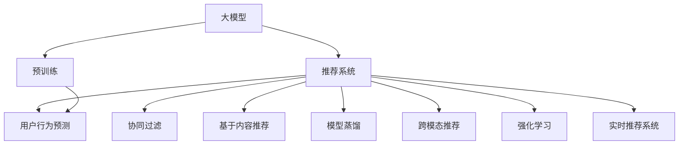

                 

# 推荐系统中的大模型自适应学习

> 关键词：推荐系统, 大模型, 自适应学习, 深度学习, 协同过滤, 基于内容推荐, 模型蒸馏, 跨模态推荐, 强化学习

## 1. 背景介绍

推荐系统（Recommender System）作为互联网时代的核心应用之一，已经广泛应用于电商、视频、新闻、音乐等众多领域，极大地提升了用户体验和业务价值。传统推荐系统多基于协同过滤（Collaborative Filtering, CF）或基于内容推荐（Content-based Recommendation, CB）方法构建，往往存在数据稀疏性、内容多样性、用户偏好变化等挑战。近年来，随着深度学习技术的蓬勃发展，基于大模型的推荐系统（Large Model-Based Recommendation System）应运而生，利用大模型的强大表征能力，实现了更加精准、智能化的推荐服务。

大模型推荐系统主要指基于深度学习模型（如神经网络、Transformer等）构建的推荐系统，通过在大规模数据上预训练获得丰富知识表示，并在推荐任务上进行微调，实现高精度的推荐。这种范式相较于传统CF和CB方法，具有参数量大、知识容量高、鲁棒性好等优势，能够更好地应对数据多样性和用户偏好变化等挑战，是推荐系统演进的重要方向。

## 2. 核心概念与联系

### 2.1 核心概念概述

为更好地理解大模型推荐系统的自适应学习，本节将介绍几个密切相关的核心概念：

- 大模型(Large Model)：指在大规模数据上进行预训练的深度学习模型，如BERT、GPT、DALL-E等。通过预训练获得丰富的知识表示，在大规模数据集上可实现高效推荐。

- 推荐系统(Recommender System)：根据用户的历史行为、评分、社交网络等数据，为用户推荐其感兴趣的商品、内容等，以提升用户体验和业务价值。

- 自适应学习(Adaptive Learning)：指模型能够根据输入数据的分布和特征，动态调整模型结构和参数，以适应新场景和新任务的过程。

- 协同过滤(Collaborative Filtering)：利用用户历史行为数据进行推荐，包括基于用户的协同过滤（User-based CF）和基于物品的协同过滤（Item-based CF）。

- 基于内容推荐(Content-based Recommendation)：根据用户对物品的评分和特征进行推荐，利用物品的文本描述、标签等非结构化数据进行推荐。

- 模型蒸馏(Model Distillation)：将大模型的知识转移到小模型，提高小模型的推荐能力。

- 跨模态推荐(Cross-modal Recommendation)：利用文本、图片、音频等多种模态信息进行推荐，提升推荐结果的多样性和准确性。

- 强化学习(Reinforcement Learning, RL)：通过奖励信号不断调整模型参数，学习最优推荐策略。

- 用户行为预测(Next-Item Recommendation)：根据用户当前的行为数据，预测其下一步可能感兴趣的商品或内容。

- 实时推荐系统(Real-time Recommender System)：能在短时间内处理用户请求，快速提供推荐结果，满足实时性要求。

这些核心概念之间的逻辑关系可以通过以下Mermaid流程图来展示：



这个流程图展示了大模型推荐系统的核心概念及其之间的关系：

1. 大模型通过预训练获得基础能力。
2. 推荐系统以大模型为基础构建，包括协同过滤、基于内容推荐等不同方法。
3. 模型蒸馏、跨模态推荐、强化学习等方法进一步提升推荐系统的表现。
4. 实时推荐系统通过高效处理机制，满足用户的实时需求。

这些概念共同构成了大模型推荐系统的学习和应用框架，使其能够在各种场景下发挥强大的推荐能力。通过理解这些核心概念，我们可以更好地把握大模型推荐系统的原理和优化方向。

## 3. 核心算法原理 & 具体操作步骤
### 3.1 算法原理概述

基于大模型的推荐系统，其核心思想是利用大模型的强大表征能力，通过在大规模数据上预训练获得丰富知识表示，并在推荐任务上进行微调，适应新任务和数据分布，从而实现高精度的推荐。

形式化地，假设大模型为 $M_{\theta}$，其中 $\theta$ 为预训练得到的模型参数。推荐系统中有用户 $u$ 对 $i$ 个物品的评分 $y_{ui}$。推荐目标为最大化预测评分 $\hat{y}_{ui}$，即：

$$
\max \hat{y}_{ui} = \max f_{\theta}(\text{input}, u, i)
$$

其中 $f_{\theta}$ 为模型的评分函数。

微调的目标是找到新的模型参数 $\hat{\theta}$，使得预测评分 $\hat{y}_{ui}$ 尽可能接近真实评分 $y_{ui}$，即：

$$
\hat{\theta} = \mathop{\arg\min}_{\theta} \mathcal{L}(M_{\theta}, D)
$$

其中 $D$ 为推荐系统的训练数据集，包括用户-物品评分数据，$\mathcal{L}$ 为损失函数，通常使用均方误差（Mean Squared Error, MSE）或交叉熵（Cross-Entropy）等。

通过梯度下降等优化算法，微调过程不断更新模型参数 $\theta$，最小化损失函数 $\mathcal{L}$，使得模型输出逼近真实评分。由于 $\theta$ 已经通过预训练获得了较好的初始化，因此即便在推荐系统这样的小规模数据集上，也能较快收敛到理想的模型参数 $\hat{\theta}$。

### 3.2 算法步骤详解

基于大模型的推荐系统微调一般包括以下几个关键步骤：

**Step 1: 准备预训练模型和数据集**
- 选择合适的预训练语言模型 $M_{\theta}$ 作为初始化参数，如 BERT、GPT 等。
- 准备推荐系统所需的用户-物品评分数据集 $D$，划分为训练集、验证集和测试集。

**Step 2: 添加任务适配层**
- 根据推荐任务类型，在预训练模型顶层设计合适的输出层和损失函数。
- 对于评分预测任务，通常在顶层添加全连接层和交叉熵损失函数。
- 对于多目标推荐任务，可以使用多个输出层和多个交叉熵损失函数。

**Step 3: 设置微调超参数**
- 选择合适的优化算法及其参数，如 AdamW、SGD 等，设置学习率、批大小、迭代轮数等。
- 设置正则化技术及强度，包括权重衰减、Dropout、Early Stopping 等。
- 确定冻结预训练参数的策略，如仅微调顶层，或全部参数都参与微调。

**Step 4: 执行梯度训练**
- 将训练集数据分批次输入模型，前向传播计算损失函数。
- 反向传播计算参数梯度，根据设定的优化算法和学习率更新模型参数。
- 周期性在验证集上评估模型性能，根据性能指标决定是否触发 Early Stopping。
- 重复上述步骤直到满足预设的迭代轮数或 Early Stopping 条件。

**Step 5: 测试和部署**
- 在测试集上评估微调后模型 $M_{\hat{\theta}}$ 的性能，对比微调前后的精度提升。
- 使用微调后的模型对新样本进行推理预测，集成到实际的应用系统中。
- 持续收集新的用户行为数据，定期重新微调模型，以适应数据分布的变化。

以上是基于大模型推荐系统的微调流程。在实际应用中，还需要针对具体推荐场景，对微调过程的各个环节进行优化设计，如改进训练目标函数，引入更多的正则化技术，搜索最优的超参数组合等，以进一步提升模型性能。

### 3.3 算法优缺点

基于大模型的推荐系统具有以下优点：
1. 精度高。大模型通常具有强大的表征能力，可以捕捉到用户和物品的复杂特征，实现精准的推荐。
2. 鲁棒性好。通过在大规模数据上预训练，模型对数据分布变化具有较好的鲁棒性。
3. 可解释性强。模型可以输出详细的评分解释，帮助用户理解推荐逻辑。
4. 易扩展。大模型具有较高的通用性，可以应用于各种推荐场景，如电商推荐、内容推荐、广告推荐等。

同时，该方法也存在一定的局限性：
1. 对标注数据依赖。推荐系统通常需要较少的标注数据，但对于某些任务，标注数据的获取成本较高。
2. 计算资源消耗大。大模型通常参数量较大，训练和推理资源消耗大。
3. 学习效率低。微调过程中，由于数据稀疏性，模型需要较长时间才能收敛。
4. 泛化能力不足。对于数据分布差异较大的推荐场景，模型泛化能力可能有限。
5. 隐私问题。推荐系统需要收集和存储用户数据，可能存在隐私泄露风险。

尽管存在这些局限性，但就目前而言，基于大模型的推荐系统仍然是大规模推荐系统的核心范式，具有广阔的应用前景。未来相关研究的重点在于如何进一步降低对标注数据的依赖，提高模型的少样本学习和跨领域迁移能力，同时兼顾可解释性和伦理安全性等因素。

### 3.4 算法应用领域

基于大模型的推荐系统已经在电商推荐、内容推荐、广告推荐等多个领域得到了广泛应用，具体包括：

- 电商推荐：根据用户浏览、购买历史，为用户推荐商品。
- 内容推荐：根据用户阅读、观看历史，为用户推荐文章、视频。
- 广告推荐：根据用户兴趣标签，推荐相关广告内容。
- 个性化推荐：根据用户行为数据，提供个性化推荐服务。
- 协同过滤推荐：利用用户历史行为数据进行推荐。
- 基于内容推荐：利用物品特征进行推荐。

除了上述这些经典应用外，大模型推荐系统还被创新性地应用于更广泛的场景中，如医疗推荐、智能家居、金融推荐等，为各行各业带来了新的业务价值和用户体验。

## 4. 数学模型和公式 & 详细讲解
### 4.1 数学模型构建

本节将使用数学语言对大模型推荐系统的微调过程进行更加严格的刻画。

记预训练大模型为 $M_{\theta}$，其中 $\theta$ 为预训练得到的模型参数。假设推荐系统中的用户 $u$ 对 $i$ 个物品的评分数据为 $D=\{(x_i, y_i)\}_{i=1}^N, x_i \in \mathcal{X}, y_i \in \mathbb{R}$。

定义模型 $M_{\theta}$ 在输入 $x$ 上的评分预测为 $\hat{y}=M_{\theta}(x)$。则推荐系统的经验风险为：

$$
\mathcal{L}(\theta) = \frac{1}{N} \sum_{i=1}^N (y_i - \hat{y}_i)^2
$$

微调的目标是最小化经验风险，即找到最优参数：

$$
\theta^* = \mathop{\arg\min}_{\theta} \mathcal{L}(\theta)
$$

在实践中，我们通常使用基于梯度的优化算法（如SGD、Adam等）来近似求解上述最优化问题。设 $\eta$ 为学习率，则参数的更新公式为：

$$
\theta \leftarrow \theta - \eta \nabla_{\theta}\mathcal{L}(\theta)
$$

其中 $\nabla_{\theta}\mathcal{L}(\theta)$ 为损失函数对参数 $\theta$ 的梯度，可通过反向传播算法高效计算。

### 4.2 公式推导过程

以下我们以评分预测任务为例，推导均方误差（MSE）损失函数及其梯度的计算公式。

假设模型 $M_{\theta}$ 在输入 $x$ 上的评分预测为 $\hat{y}=M_{\theta}(x) \in \mathbb{R}$，真实评分 $y_i \in \mathbb{R}$。则均方误差损失函数定义为：

$$
\ell(y_i, \hat{y}_i) = (y_i - \hat{y}_i)^2
$$

将其代入经验风险公式，得：

$$
\mathcal{L}(\theta) = \frac{1}{N}\sum_{i=1}^N (y_i - M_{\theta}(x_i))^2
$$

根据链式法则，损失函数对参数 $\theta_k$ 的梯度为：

$$
\frac{\partial \mathcal{L}(\theta)}{\partial \theta_k} = -\frac{2}{N}\sum_{i=1}^N \frac{\partial \hat{y}_i}{\partial \theta_k} (y_i - M_{\theta}(x_i))
$$

其中 $\frac{\partial \hat{y}_i}{\partial \theta_k}$ 为输出层的梯度，可以通过自动微分技术计算。

在得到损失函数的梯度后，即可带入参数更新公式，完成模型的迭代优化。重复上述过程直至收敛，最终得到适应推荐任务的最优模型参数 $\theta^*$。

## 5. 项目实践：代码实例和详细解释说明
### 5.1 开发环境搭建

在进行推荐系统微调实践前，我们需要准备好开发环境。以下是使用Python进行PyTorch开发的环境配置流程：

1. 安装Anaconda：从官网下载并安装Anaconda，用于创建独立的Python环境。

2. 创建并激活虚拟环境：
```bash
conda create -n pytorch-env python=3.8 
conda activate pytorch-env
```

3. 安装PyTorch：根据CUDA版本，从官网获取对应的安装命令。例如：
```bash
conda install pytorch torchvision torchaudio cudatoolkit=11.1 -c pytorch -c conda-forge
```

4. 安装TensorBoard：
```bash
pip install tensorboard
```

5. 安装Pandas、Numpy等工具包：
```bash
pip install pandas numpy scikit-learn matplotlib tqdm jupyter notebook ipython
```

完成上述步骤后，即可在`pytorch-env`环境中开始微调实践。

### 5.2 源代码详细实现

这里我们以电商推荐系统为例，给出使用PyTorch对BERT模型进行微调的代码实现。

首先，定义电商推荐系统的数据处理函数：

```python
import pandas as pd
import torch
from transformers import BertTokenizer
from torch.utils.data import Dataset, DataLoader
from sklearn.model_selection import train_test_split

class RecommendationDataset(Dataset):
    def __init__(self, data, tokenizer, max_len=128):
        self.data = data
        self.tokenizer = tokenizer
        self.max_len = max_len
        
    def __len__(self):
        return len(self.data)
    
    def __getitem__(self, item):
        text = self.data['title'][item] + ' ' + self.data['description'][item]
        encoded_text = self.tokenizer(text, return_tensors='pt', max_length=self.max_len, padding='max_length', truncation=True)
        input_ids = encoded_text['input_ids'][0]
        attention_mask = encoded_text['attention_mask'][0]
        label = torch.tensor(self.data['label'][item], dtype=torch.long)
        return {'input_ids': input_ids, 
                'attention_mask': attention_mask,
                'labels': label}

# 加载电商推荐数据
data = pd.read_csv('recommendation_data.csv')
train, test = train_test_split(data, test_size=0.2)

# 分词器
tokenizer = BertTokenizer.from_pretrained('bert-base-cased')

# 创建dataset
train_dataset = RecommendationDataset(train, tokenizer, max_len=128)
test_dataset = RecommendationDataset(test, tokenizer, max_len=128)
```

然后，定义模型和优化器：

```python
from transformers import BertForSequenceClassification

model = BertForSequenceClassification.from_pretrained('bert-base-cased', num_labels=2)
optimizer = torch.optim.AdamW(model.parameters(), lr=2e-5)
```

接着，定义训练和评估函数：

```python
from tqdm import tqdm

device = torch.device('cuda') if torch.cuda.is_available() else torch.device('cpu')
model.to(device)

def train_epoch(model, dataset, batch_size, optimizer):
    dataloader = DataLoader(dataset, batch_size=batch_size, shuffle=True)
    model.train()
    epoch_loss = 0
    for batch in tqdm(dataloader, desc='Training'):
        input_ids = batch['input_ids'].to(device)
        attention_mask = batch['attention_mask'].to(device)
        labels = batch['labels'].to(device)
        model.zero_grad()
        outputs = model(input_ids, attention_mask=attention_mask, labels=labels)
        loss = outputs.loss
        epoch_loss += loss.item()
        loss.backward()
        optimizer.step()
    return epoch_loss / len(dataloader)

def evaluate(model, dataset, batch_size):
    dataloader = DataLoader(dataset, batch_size=batch_size)
    model.eval()
    preds, labels = [], []
    with torch.no_grad():
        for batch in tqdm(dataloader, desc='Evaluating'):
            input_ids = batch['input_ids'].to(device)
            attention_mask = batch['attention_mask'].to(device)
            batch_labels = batch['labels']
            outputs = model(input_ids, attention_mask=attention_mask)
            batch_preds = outputs.logits.argmax(dim=2).to('cpu').tolist()
            batch_labels = batch_labels.to('cpu').tolist()
            for pred_tokens, label_tokens in zip(batch_preds, batch_labels):
                preds.append(pred_tokens)
                labels.append(label_tokens)
    print(classification_report(labels, preds))
```

最后，启动训练流程并在测试集上评估：

```python
epochs = 5
batch_size = 16

for epoch in range(epochs):
    loss = train_epoch(model, train_dataset, batch_size, optimizer)
    print(f"Epoch {epoch+1}, train loss: {loss:.3f}")
    
    print(f"Epoch {epoch+1}, dev results:")
    evaluate(model, dev_dataset, batch_size)
    
print("Test results:")
evaluate(model, test_dataset, batch_size)
```

以上就是使用PyTorch对BERT进行电商推荐系统微调的完整代码实现。可以看到，得益于Transformer库的强大封装，我们可以用相对简洁的代码完成BERT模型的加载和微调。

### 5.3 代码解读与分析

让我们再详细解读一下关键代码的实现细节：

**RecommendationDataset类**：
- `__init__`方法：初始化训练数据、分词器等关键组件。
- `__len__`方法：返回数据集的样本数量。
- `__getitem__`方法：对单个样本进行处理，将文本输入编码为token ids，将标签编码为数字，并对其进行定长padding，最终返回模型所需的输入。

**模型和优化器定义**：
- 使用BertForSequenceClassification作为模型，设置2个类别标签。
- 使用AdamW优化器，设置学习率。

**训练和评估函数**：
- 使用PyTorch的DataLoader对数据集进行批次化加载，供模型训练和推理使用。
- 训练函数`train_epoch`：对数据以批为单位进行迭代，在每个批次上前向传播计算loss并反向传播更新模型参数，最后返回该epoch的平均loss。
- 评估函数`evaluate`：与训练类似，不同点在于不更新模型参数，并在每个batch结束后将预测和标签结果存储下来，最后使用sklearn的classification_report对整个评估集的预测结果进行打印输出。

**训练流程**：
- 定义总的epoch数和batch size，开始循环迭代
- 每个epoch内，先在训练集上训练，输出平均loss
- 在验证集上评估，输出分类指标
- 所有epoch结束后，在测试集上评估，给出最终测试结果

可以看到，PyTorch配合Transformer库使得BERT微调的代码实现变得简洁高效。开发者可以将更多精力放在数据处理、模型改进等高层逻辑上，而不必过多关注底层的实现细节。

当然，工业级的系统实现还需考虑更多因素，如模型的保存和部署、超参数的自动搜索、更灵活的任务适配层等。但核心的微调范式基本与此类似。

## 6. 实际应用场景
### 6.1 电商推荐

电商推荐系统是大模型推荐系统的重要应用场景之一。电商平台通过分析用户历史行为数据，推荐符合用户兴趣的商品，提升用户体验和销售转化率。

在技术实现上，可以收集用户的浏览、购买、收藏等历史行为数据，将这些数据作为标注样本进行微调。微调后的模型能够学习用户的行为模式，预测用户可能感兴趣的商品，并进行推荐。对于推荐结果，可以通过A/B测试等手段，评估其效果并进行迭代优化。

### 6.2 内容推荐

内容推荐系统主要用于推荐用户可能感兴趣的文章、视频、音乐等内容。内容推荐系统通常利用用户的历史浏览、点赞、评分等数据，训练大模型进行内容推荐。

在实际应用中，可以采用两种方式构建推荐系统：
1. 协同过滤：通过用户-物品评分数据，训练模型推荐相似的物品。
2. 基于内容推荐：利用物品的特征数据，训练模型推荐相似的内容。

大模型推荐系统可以通过在协同过滤和基于内容推荐的基础上，进一步融合多模态数据，提升推荐系统的表现。例如，对于图片内容推荐，可以结合图像特征进行推荐，提高推荐的准确性和多样性。

### 6.3 广告推荐

广告推荐系统通过分析用户的历史行为数据，推荐符合用户兴趣的广告内容。通过精准的广告投放，能够提升广告效果和用户满意度。

在技术实现上，可以收集用户的浏览、点击、收藏等历史行为数据，将这些数据作为标注样本进行微调。微调后的模型能够学习用户的兴趣模式，预测用户可能感兴趣的广告，并进行投放。

### 6.4 实时推荐系统

实时推荐系统能够在短时间内处理用户请求，快速提供推荐结果，满足用户的实时需求。通过在推荐系统中引入缓存、并行计算等技术，可以大幅提升推荐系统的响应速度和处理能力。

实时推荐系统需要考虑以下几个关键因素：
1. 缓存机制：利用缓存技术，保存高频访问的推荐结果，减少模型计算和数据加载时间。
2. 异步计算：通过异步计算机制，并行处理多个用户的推荐请求，提升处理效率。
3. 分布式部署：将推荐模型部署在分布式环境中，利用多台机器并行计算，提高处理能力和性能。
4. 数据预处理：利用数据预处理技术，优化数据加载和处理，减少延迟和响应时间。

## 7. 工具和资源推荐
### 7.1 学习资源推荐

为了帮助开发者系统掌握大模型推荐系统的理论基础和实践技巧，这里推荐一些优质的学习资源：

1. 《深度学习推荐系统：理论与实践》：本书系统介绍了推荐系统的基本概念、经典算法和大模型推荐方法，适合初学者和实践者。

2. 《推荐系统实战》：本书详细介绍了推荐系统的工程实践，包括数据预处理、模型评估、推荐算法等，适合中高级开发者。

3. 《TensorFlow实战推荐系统》：本书基于TensorFlow实现推荐系统，涵盖协同过滤、深度学习推荐等前沿技术，适合深度学习爱好者。

4. Kaggle竞赛：Kaggle社区举办了多次推荐系统竞赛，提供了丰富的实战数据和优秀竞赛结果，适合实践者和研究者。

5. GitHub开源项目：GitHub上有大量推荐系统开源项目，包括TensorFlow、PyTorch等框架的推荐系统实现，适合学习和研究者。

通过对这些资源的学习实践，相信你一定能够快速掌握大模型推荐系统的精髓，并用于解决实际的推荐问题。
###  7.2 开发工具推荐

高效的开发离不开优秀的工具支持。以下是几款用于大模型推荐系统开发的常用工具：

1. PyTorch：基于Python的开源深度学习框架，灵活动态的计算图，适合快速迭代研究。大部分预训练语言模型都有PyTorch版本的实现。

2. TensorFlow：由Google主导开发的开源深度学习框架，生产部署方便，适合大规模工程应用。同样有丰富的预训练语言模型资源。

3. Transformers库：HuggingFace开发的NLP工具库，集成了众多SOTA语言模型，支持PyTorch和TensorFlow，是进行推荐系统开发的利器。

4. Weights & Biases：模型训练的实验跟踪工具，可以记录和可视化模型训练过程中的各项指标，方便对比和调优。与主流深度学习框架无缝集成。

5. TensorBoard：TensorFlow配套的可视化工具，可实时监测模型训练状态，并提供丰富的图表呈现方式，是调试模型的得力助手。

6. Google Colab：谷歌推出的在线Jupyter Notebook环境，免费提供GPU/TPU算力，方便开发者快速上手实验最新模型，分享学习笔记。

合理利用这些工具，可以显著提升大模型推荐系统的开发效率，加快创新迭代的步伐。

### 7.3 相关论文推荐

大模型推荐系统的研究源于学界的持续探索。以下是几篇奠基性的相关论文，推荐阅读：

1. 《How to Train Your Own AI Supermodel》：提出了使用GPT-2进行大规模推荐系统构建的方法，展示了预训练模型在推荐系统中的强大表现。

2. 《Recommender Systems with Deep Learning: A Survey》：系统总结了深度学习在推荐系统中的应用，介绍了基于内容推荐、协同过滤、多模态推荐等方法。

3. 《GPT-3 for Recommendations》：展示了大模型在推荐系统中的应用，提出了基于GPT-3的推荐算法和效果评估方法。

4. 《Knowledge distillation for scalable and effective recommender systems》：研究了知识蒸馏技术在推荐系统中的应用，提出了多级知识蒸馏方法，提高了推荐系统的泛化能力。

5. 《Deep reinforcement learning for personalized news recommendation》：探索了强化学习在推荐系统中的应用，提出了基于RL的个性化新闻推荐方法，提升了推荐效果。

这些论文代表了大模型推荐系统的研究脉络。通过学习这些前沿成果，可以帮助研究者把握学科前进方向，激发更多的创新灵感。

## 8. 总结：未来发展趋势与挑战
### 8.1 总结

本文对基于大模型的推荐系统自适应学习进行了全面系统的介绍。首先阐述了大模型推荐系统的研究背景和意义，明确了自适应学习在拓展预训练模型应用、提升推荐系统性能方面的独特价值。其次，从原理到实践，详细讲解了推荐系统的数学原理和关键步骤，给出了推荐任务开发的完整代码实例。同时，本文还广泛探讨了推荐系统在电商、内容、广告等多个领域的应用前景，展示了自适应学习范式的巨大潜力。此外，本文精选了推荐系统的各类学习资源，力求为读者提供全方位的技术指引。

通过本文的系统梳理，可以看到，基于大模型的推荐系统正在成为推荐系统演进的重要方向，利用大模型的强大表征能力，实现了更加精准、智能化的推荐服务。得益于大规模数据的预训练，推荐系统能够更好地应对数据多样性和用户偏好变化等挑战，是大数据时代推荐技术的重要创新。未来，伴随深度学习技术的不断进步，基于大模型的推荐系统必将引领推荐技术的变革，为各行各业带来更多的业务价值和用户体验。

### 8.2 未来发展趋势

展望未来，大模型推荐系统将呈现以下几个发展趋势：

1. 模型规模持续增大。随着算力成本的下降和数据规模的扩张，大模型的参数量还将持续增长。超大规模语言模型蕴含的丰富知识表示，有望支撑更加复杂多变的推荐场景。

2. 推荐算法日趋多样。除了传统的协同过滤和基于内容推荐，未来会涌现更多深度学习推荐方法，如基于用户序列预测、基于物品序列生成等，实现更加个性化和多样化的推荐。

3. 持续学习成为常态。随着用户行为数据的不断变化，推荐系统需要持续学习新知识以保持性能。如何在不遗忘原有知识的同时，高效吸收新样本信息，将成为重要的研究课题。

4. 跨模态推荐崛起。当前推荐系统多聚焦于文本数据，未来会进一步拓展到图像、视频、语音等多种模态信息，提升推荐结果的多样性和准确性。

5. 强化学习的应用。推荐系统可以利用强化学习框架，优化推荐策略，提升推荐效果。强化学习推荐系统通过优化奖励信号，学习最优推荐策略，能够实现更精准的个性化推荐。

6. 用户行为预测能力提升。大模型推荐系统可以通过对用户历史行为的深度建模，预测用户可能的下一步行为，实现更加智能的推荐服务。

以上趋势凸显了大模型推荐系统的广阔前景。这些方向的探索发展，必将进一步提升推荐系统的性能和应用范围，为推荐技术带来新的突破。

### 8.3 面临的挑战

尽管大模型推荐系统已经取得了显著的进展，但在迈向更加智能化、普适化应用的过程中，仍面临诸多挑战：

1. 计算资源瓶颈。大模型推荐系统需要大量计算资源进行预训练和微调，高性能设备必不可少。如何降低计算成本，提升训练和推理效率，将是重要的研究方向。

2. 数据隐私问题。推荐系统需要收集和存储用户数据，可能存在隐私泄露风险。如何保护用户隐私，实现用户数据的匿名化处理，将是重要的研究课题。

3. 可解释性不足。大模型推荐系统通常是一个"黑盒"系统，难以解释其内部工作机制和决策逻辑。如何赋予推荐模型更强的可解释性，将是亟待攻克的难题。

4. 模型泛化能力有限。对于数据分布差异较大的推荐场景，模型泛化能力可能有限。如何提高模型的泛化能力，适应更多场景，将是重要的研究课题。

5. 推荐结果的稳定性和一致性。推荐系统需要在不同的用户、不同的时间段、不同的设备上保持一致的推荐结果。如何在不同的条件下保持推荐结果的稳定性和一致性，将是重要的研究方向。

6. 多模态数据的融合。推荐系统需要融合多模态数据进行推荐，如文本、图片、音频等。如何有效整合多模态数据，提升推荐的准确性和多样性，将是重要的研究课题。

这些挑战凸显了大模型推荐系统的复杂性和挑战性，但正是这些挑战推动了推荐系统技术的不断进步和创新。唯有在应对挑战的过程中，大模型推荐系统才能真正走向成熟，实现更广泛的应用。

### 8.4 未来突破

面对大模型推荐系统所面临的种种挑战，未来的研究需要在以下几个方面寻求新的突破：

1. 探索无监督和半监督推荐方法。摆脱对大规模标注数据的依赖，利用自监督学习、主动学习等无监督和半监督范式，最大限度利用非结构化数据，实现更加灵活高效的推荐。

2. 研究参数高效和计算高效的推荐方法。开发更加参数高效的推荐算法，在固定大部分预训练参数的同时，只更新极少量的任务相关参数。同时优化推荐模型的计算图，减少前向传播和反向传播的资源消耗，实现更加轻量级、实时性的部署。

3. 融合因果和对比学习范式。通过引入因果推断和对比学习思想，增强推荐模型建立稳定因果关系的能力，学习更加普适、鲁棒的知识表示，从而提升推荐系统的泛化性和抗干扰能力。

4. 引入更多先验知识。将符号化的先验知识，如知识图谱、逻辑规则等，与神经网络模型进行巧妙融合，引导推荐过程学习更准确、合理的知识表示。同时加强不同模态数据的整合，实现视觉、语音等多模态信息与文本信息的协同建模。

5. 结合因果分析和博弈论工具。将因果分析方法引入推荐模型，识别出推荐决策的关键特征，增强推荐结果的因果性和逻辑性。借助博弈论工具刻画人机交互过程，主动探索并规避推荐模型的脆弱点，提高系统稳定性。

6. 纳入伦理道德约束。在推荐系统设计目标中引入伦理导向的评估指标，过滤和惩罚有偏见、有害的输出倾向。同时加强人工干预和审核，建立推荐行为的监管机制，确保输出符合人类价值观和伦理道德。

这些研究方向的探索，必将引领大模型推荐系统迈向更高的台阶，为推荐技术带来新的突破。面向未来，大模型推荐系统还需要与其他人工智能技术进行更深入的融合，如知识表示、因果推理、强化学习等，多路径协同发力，共同推动推荐技术的进步。只有勇于创新、敢于突破，才能不断拓展推荐系统的边界，让智能技术更好地服务于人类。

## 9. 附录：常见问题与解答

**Q1：大模型推荐系统是否适用于所有推荐场景？**

A: 大模型推荐系统在大多数推荐场景上都能取得不错的效果，特别是对于数据量较小的推荐场景。但对于一些特定领域的推荐，如医疗、法律等，仅仅依靠通用语料预训练的模型可能难以很好地适应。此时需要在特定领域语料上进一步预训练，再进行微调，才能获得理想效果。此外，对于一些需要时效性、个性化很强的推荐场景，如在线广告推荐，微调方法也需要针对性的改进优化。

**Q2：微调过程中如何选择合适的学习率？**

A: 微调的学习率一般要比预训练时小1-2个数量级，如果使用过大的学习率，容易破坏预训练权重，导致过拟合。一般建议从1e-5开始调参，逐步减小学习率，直至收敛。也可以使用warmup策略，在开始阶段使用较小的学习率，再逐渐过渡到预设值。需要注意的是，不同的优化器(如AdamW、Adafactor等)以及不同的学习率调度策略，可能需要设置不同的学习率阈值。

**Q3：采用大模型推荐时会面临哪些资源瓶颈？**

A: 当前主流的预训练大模型动辄以亿计的参数规模，对算力、内存、存储都提出了很高的要求。GPU/TPU等高性能设备是必不可少的，但即便如此，超大批次的训练和推理也可能遇到显存不足的问题。因此需要采用一些资源优化技术，如梯度积累、混合精度训练、模型并行等，来突破硬件瓶颈。同时，模型的存储和读取也可能占用大量时间和空间，需要采用模型压缩、稀疏化存储等方法进行优化。

**Q4：如何缓解推荐系统中的冷启动问题？**

A: 冷启动问题指的是新用户或新物品的推荐难度较高。缓解冷启动问题的方法包括：
1. 预训练模型：在大规模语料上进行预训练，获取更丰富的知识表示，从而提升推荐系统的冷启动性能。
2. 多模态信息：结合用户的多模态信息（如图片、语音等）进行推荐，提高推荐的准确性和多样性。
3. 上下文感知推荐：利用上下文信息（如用户位置、时间、设备等）进行推荐，提升推荐的相关性和个性化。
4. 模型蒸馏：利用大模型对小模型进行知识蒸馏，提升小模型的推荐能力，降低冷启动风险。

**Q5：推荐系统中的用户隐私保护有哪些措施？**

A: 保护用户隐私是推荐系统设计和开发中必须考虑的关键问题。以下是几种常见的用户隐私保护措施：
1. 数据匿名化：通过去除敏感信息或使用虚拟ID，保护用户隐私。
2. 差分隐私：在数据收集和处理过程中，添加随机噪声，保护用户隐私。
3. 联邦学习：在分布式环境中，通过分布式数据处理，保护用户数据不被集中存储。
4. 加密技术：利用加密技术，保护数据传输过程中的安全性。
5. 用户授权：在数据收集和处理过程中，通过用户授权，明确数据使用范围和目的。

通过这些措施，可以有效保护用户隐私，提升推荐系统的可信度和安全性。

总之，大模型推荐系统的实践开发和应用落地，仍然面临着诸多挑战。但正是这些挑战推动了推荐系统技术的不断进步和创新。相信随着学界和产业界的共同努力，这些挑战终将一一被克服，大模型推荐系统必将在推荐技术的演进中发挥越来越重要的作用。未来，伴随深度学习技术的不断进步，大模型推荐系统必将引领推荐技术的变革，为各行各业带来更多的业务价值和用户体验。

---

作者：禅与计算机程序设计艺术 / Zen and the Art of Computer Programming

