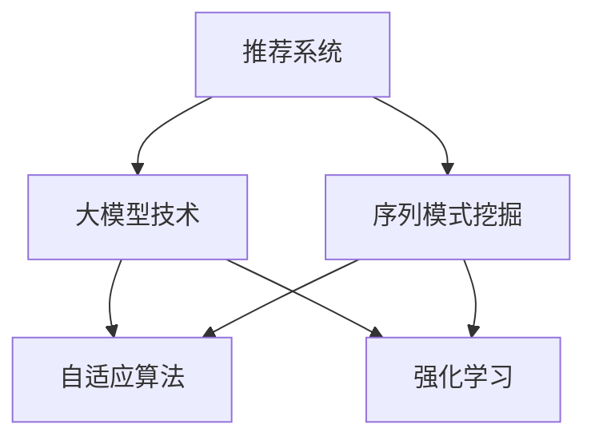

                 

# 推荐系统中的序列模式挖掘：大模型技术

> 关键词：推荐系统,序列模式挖掘,大模型技术,自适应算法,强化学习,深度学习

## 1. 背景介绍

### 1.1 问题由来

随着互联网和移动互联网的发展，在线娱乐、电子商务、金融服务等数字化行业迅速崛起，用户数据的规模和价值日益增长。这些数据中蕴含着丰富的用户行为和兴趣特征，如何通过有效的分析和挖掘技术，从用户历史行为数据中挖掘出有价值的信息，构建精准的个性化推荐系统，是各大互联网公司长期以来孜孜不倦的研究目标。

近年来，随着深度学习技术的发展，推荐系统开始大量采用基于大模型的推荐方法，通过端到端的序列推荐算法，直接从原始用户行为数据中学习推荐模型，取得了显著的进步。这些基于大模型的推荐系统，通过学习用户的长期行为序列，能够更好地捕捉用户兴趣的变化和演化规律，从而提供更加个性化、精准的推荐内容。

### 1.2 问题核心关键点

推荐系统中的序列模式挖掘，是指从用户的行为序列中提取有意义的模式，如用户的兴趣偏好、行为模式等，从而预测用户未来的行为。序列模式挖掘的过程可以分为两个主要阶段：

- **序列数据预处理**：将原始的行为数据转化为连续的序列数据，并对数据进行归一化、缺失值处理、特征编码等预处理操作。
- **序列模式挖掘**：采用各种深度学习算法和模型，从预处理后的序列数据中挖掘出用户行为模式，并构建推荐模型。

序列模式挖掘的核心在于选择合适的模型和算法，既能捕捉用户行为序列中的长期依赖关系，又能避免过拟合和计算资源浪费，实现高效的推荐预测。

## 2. 核心概念与联系

### 2.1 核心概念概述

为了更好地理解基于大模型的推荐系统，本节将介绍几个密切相关的核心概念：

- **推荐系统(Recommendation System)**：旨在为用户推荐其可能感兴趣的物品，如商品、文章、视频等，以提升用户满意度、提高转化率。
- **序列模式挖掘(Sequence Mining)**：从用户行为序列中提取有意义的序列模式，如用户兴趣、行为模式等，用于构建推荐模型。
- **大模型(Deep Learning Models)**：以深度神经网络为代表的模型，通过大量的数据训练，具备强大的数据建模能力，能够捕捉复杂的数据关系。
- **自适应算法(Adaptive Algorithms)**：能够根据数据动态调整模型参数，以适应不同任务和场景的推荐系统。
- **强化学习(Reinforcement Learning)**：通过与环境交互，不断学习最优的决策策略，提升推荐效果。
- **深度学习(Deep Learning)**：利用多层神经网络，从数据中自动学习特征表示，实现对复杂数据的建模。

这些核心概念之间的逻辑关系可以通过以下Mermaid流程图来展示：



这个流程图展示了大模型在推荐系统中的应用框架：

1. 推荐系统通过序列模式挖掘获取用户行为序列模式，用于推荐预测。
2. 大模型技术通过自适应算法和强化学习等方法，学习用户行为序列的表示，提升推荐精度。

## 3. 核心算法原理 & 具体操作步骤
### 3.1 算法原理概述

基于大模型的推荐系统，其核心思想是利用深度神经网络，从用户行为序列中自动学习出有意义的特征表示，从而实现对用户兴趣的预测。

推荐系统中的序列模式挖掘，通常可以采用以下几种深度学习模型：

- **循环神经网络(RNN)**：通过记忆细胞捕捉序列数据中的时间依赖关系，适用于序列长度较短的任务。
- **长短时记忆网络(LSTM)**：通过门控机制控制记忆细胞的遗忘和更新，适用于处理长序列数据。
- **门控循环单元(GRU)**：与LSTM类似，通过门控机制控制信息流动，但计算量相对较小。
- **卷积神经网络(CNN)**：利用卷积操作提取局部特征，适用于序列数据中存在局部依赖关系的情况。
- **注意力机制(Attention)**：通过自注意力机制或多头注意力机制，捕捉序列数据中不同位置的相关性。

这些深度学习模型能够从用户行为序列中自动学习出有意义的特征表示，用于推荐预测。推荐系统的目标是通过优化模型参数，最小化预测误差，从而提升推荐效果。

### 3.2 算法步骤详解

基于大模型的推荐系统，通常包括以下关键步骤：

**Step 1: 数据预处理**
- 收集用户的历史行为数据，如浏览、点击、购买等记录。
- 将原始行为数据转化为连续的序列数据，如将点击行为转化为时间戳序列。
- 对序列数据进行归一化、缺失值处理、特征编码等预处理操作。

**Step 2: 模型训练**
- 选择合适的深度学习模型，如LSTM、GRU、CNN等，进行训练。
- 在训练过程中，通常需要设置学习率、批大小、迭代轮数等超参数。
- 使用优化算法，如SGD、Adam等，更新模型参数，最小化预测误差。

**Step 3: 模型评估**
- 在测试集上评估推荐模型的预测性能，如准确率、召回率、F1值等指标。
- 通过A/B测试等方法，评估模型对用户体验的影响，如点击率、转化率等。

**Step 4: 推荐部署**
- 将训练好的模型部署到生产环境中，进行实时推荐预测。
- 监控推荐系统性能，根据反馈数据不断优化模型。

### 3.3 算法优缺点

基于大模型的推荐系统，具有以下优点：

- **模型性能优越**：大模型能够自动学习用户行为序列中的复杂模式，实现更高的推荐精度。
- **适应性强**：大模型能够适应不同类型的数据和任务，具有较好的泛化能力。
- **计算效率高**：通过自动学习特征表示，大模型可以大幅减少特征工程的工作量，提高计算效率。

但同时，也存在一些缺点：

- **数据依赖性强**：大模型的训练需要大量的标注数据，数据获取成本较高。
- **模型复杂度高**：大模型通常包含数百万个参数，计算资源消耗较大。
- **难以解释**：大模型往往作为"黑盒"存在，其决策过程难以解释和调试。

## 4. 数学模型和公式 & 详细讲解 & 举例说明

### 4.1 数学模型构建

基于大模型的推荐系统通常采用循环神经网络(LSTM)进行序列模式挖掘。下面我们将详细讲解LSTM模型的数学模型和构建过程。

假设用户的行为序列为 $x=(x_1,x_2,...,x_T)$，其中 $T$ 为序列长度。令 $y$ 为推荐的物品，$y$ 的值可以是0或1，0表示用户不推荐该物品，1表示用户推荐该物品。我们的目标是通过训练模型，最小化预测误差 $L(y,\hat{y})$，其中 $\hat{y}$ 为模型预测的物品推荐。

定义LSTM模型的状态表示为 $h_t$，在每个时间步 $t$ 更新状态，状态更新公式为：

$$
h_t = \text{LSTM}(h_{t-1},x_t;\theta)
$$

其中 $\theta$ 为LSTM模型的参数。

定义LSTM模型的输出为 $y_t$，其计算公式为：

$$
y_t = \text{softmax}(h_t;\theta)
$$

模型预测的目标为最大化预测值和真实值的交叉熵损失函数 $L$：

$$
L(y,\hat{y}) = -\sum_{t=1}^T y_t\log\hat{y}_t
$$

### 4.2 公式推导过程

我们通过以上定义，推导LSTM模型的参数更新公式。

假设模型参数为 $\theta = \{W_{xi},W_{hi},W_{fo},W_{co},b_i,b_h,b_f,b_c\}$，其中 $W_{xi},W_{hi},W_{fo},W_{co},b_i,b_h,b_f,b_c$ 分别为输入门、遗忘门、输出门和候选门的权重和偏置。

模型的输入为 $x_t$，模型的隐藏状态为 $h_{t-1}$，模型的输出为 $\hat{y}_t$。根据LSTM的状态更新公式和输出计算公式，可以得到模型参数的更新公式：

$$
\begin{aligned}
& i_t = \sigma(W_{xi}x_t + b_i) \\
& f_t = \sigma(W_{hi}h_{t-1} + b_h) \\
& o_t = \sigma(W_{fo}h_{t-1} + b_f) \\
& g_t = \tanh(W_{co}h_{t-1} + b_c) \\
& c_t = f_t \odot c_{t-1} + i_t \odot g_t \\
& h_t = o_t \odot \tanh(c_t)
\end{aligned}
$$

其中 $\sigma$ 为sigmoid函数，$\odot$ 为向量点乘，$\otimes$ 为矩阵乘法。

将模型预测 $\hat{y}_t$ 的softmax函数代入交叉熵损失函数，可以得到模型训练的目标函数：

$$
L = -\sum_{t=1}^T y_t\log\hat{y}_t
$$

使用梯度下降等优化算法，对模型参数进行更新，最小化训练目标函数 $L$。

### 4.3 案例分析与讲解

下面以电商平台的推荐系统为例，详细讲解基于LSTM的推荐模型。

假设电商平台的推荐系统需要预测用户是否购买某件商品。我们收集用户历史购买行为数据，将每个用户购买行为转化为时间戳序列。然后，我们使用LSTM模型，训练模型预测用户购买行为的概率。

具体步骤如下：

1. **数据预处理**：收集用户的历史购买记录，将其转化为时间戳序列。对序列进行归一化、缺失值处理、特征编码等预处理操作。

2. **模型训练**：使用LSTM模型，训练模型预测用户购买行为的概率。在训练过程中，设置合适的学习率、批大小、迭代轮数等超参数。

3. **模型评估**：在测试集上评估模型性能，如准确率、召回率、F1值等指标。通过A/B测试等方法，评估模型对用户体验的影响，如点击率、转化率等。

4. **推荐部署**：将训练好的模型部署到生产环境中，进行实时推荐预测。监控推荐系统性能，根据反馈数据不断优化模型。

## 5. 项目实践：代码实例和详细解释说明
### 5.1 开发环境搭建

在进行推荐系统开发前，我们需要准备好开发环境。以下是使用Python进行TensorFlow开发的环境配置流程：

1. 安装Anaconda：从官网下载并安装Anaconda，用于创建独立的Python环境。

2. 创建并激活虚拟环境：
```bash
conda create -n tf-env python=3.8 
conda activate tf-env
```

3. 安装TensorFlow：从官网获取对应的安装命令。例如：
```bash
conda install tensorflow==2.7 -c conda-forge
```

4. 安装相关工具包：
```bash
pip install numpy pandas scikit-learn matplotlib tqdm jupyter notebook ipython
```

完成上述步骤后，即可在`tf-env`环境中开始推荐系统开发。

### 5.2 源代码详细实现

下面我们以电商平台的推荐系统为例，给出使用TensorFlow进行基于LSTM的推荐系统开发的PyTorch代码实现。

首先，定义推荐系统的数据处理函数：

```python
import tensorflow as tf
from tensorflow.keras.layers import Input, Embedding, LSTM, Dense, Masking, Bidirectional

class RecommendationModel(tf.keras.Model):
    def __init__(self, vocab_size, embedding_dim, hidden_size, output_dim):
        super(RecommendationModel, self).__init__()
        self.embedding = Embedding(vocab_size, embedding_dim)
        self.masking = Masking(mask_value=0.)
        self.lstm = LSTM(hidden_size, return_sequences=True)
        self.dense = Dense(output_dim, activation='sigmoid')
    
    def call(self, inputs):
        x = self.embedding(inputs)
        x = self.masking(x)
        x = self.lstm(x)
        x = self.dense(x)
        return x

# 定义模型参数
vocab_size = 10000
embedding_dim = 32
hidden_size = 64
output_dim = 1

# 创建模型
model = RecommendationModel(vocab_size, embedding_dim, hidden_size, output_dim)
```

然后，定义模型训练和评估函数：

```python
from tensorflow.keras import optimizers, metrics

def train_model(model, train_dataset, val_dataset, batch_size=32, epochs=10, learning_rate=0.001):
    model.compile(optimizer=optimizers.Adam(learning_rate), loss='binary_crossentropy', metrics=['accuracy'])
    history = model.fit(train_dataset, epochs=epochs, validation_data=val_dataset, batch_size=batch_size)
    return history

def evaluate_model(model, test_dataset, batch_size=32):
    model.evaluate(test_dataset, batch_size=batch_size)
```

最后，启动训练流程并在测试集上评估：

```python
# 定义数据集
train_dataset = tf.data.Dataset.from_tensor_slices((train_data, train_labels))
val_dataset = tf.data.Dataset.from_tensor_slices((val_data, val_labels))
test_dataset = tf.data.Dataset.from_tensor_slices((test_data, test_labels))

# 训练模型
history = train_model(model, train_dataset, val_dataset, epochs=10)

# 评估模型
evaluate_model(model, test_dataset)
```

以上就是使用TensorFlow进行电商推荐系统开发的完整代码实现。可以看到，通过TensorFlow和Keras库，推荐系统的搭建和训练变得简单高效。

### 5.3 代码解读与分析

让我们再详细解读一下关键代码的实现细节：

**RecommendationModel类**：
- `__init__`方法：初始化嵌入层、掩码层、LSTM层和输出层等关键组件。
- `call`方法：在每个时间步上，将用户行为序列转化为嵌入表示，并输入LSTM层进行状态更新。最后，将LSTM的输出输入到全连接层进行二分类预测。

**train_model函数**：
- 使用TensorFlow的`compile`方法定义模型损失函数、优化器和评估指标。
- 使用`fit`方法进行模型训练，记录训练过程中的损失和准确率等指标。

**evaluate_model函数**：
- 使用TensorFlow的`evaluate`方法评估模型在测试集上的性能。

**训练流程**：
- 定义训练集、验证集和测试集的特征和标签。
- 调用`train_model`函数训练模型，记录训练过程中的性能指标。
- 调用`evaluate_model`函数评估模型在测试集上的性能。

可以看到，TensorFlow和Keras库使得推荐系统的开发变得简单高效。开发者可以将更多精力放在数据处理、模型优化等高层逻辑上，而不必过多关注底层的实现细节。

当然，工业级的系统实现还需考虑更多因素，如模型的保存和部署、超参数的自动搜索、更灵活的模型结构等。但核心的推荐范式基本与此类似。

## 6. 实际应用场景
### 6.1 电子商务推荐

电商平台的推荐系统，能够通过用户的历史购买行为、浏览记录等数据，实时预测用户可能感兴趣的商品，提升用户体验和转化率。通过基于大模型的推荐系统，电商平台可以提供更加个性化、精准的商品推荐，提高用户满意度和忠诚度。

具体而言，电商平台可以采用基于LSTM的推荐系统，通过对用户购买和浏览行为序列进行建模，预测用户购买某件商品的概率。模型训练完成后，部署到推荐系统实时服务中，实现个性化推荐。

### 6.2 内容推荐

内容推荐系统广泛应用于新闻、视频、音乐等领域，帮助用户发现感兴趣的个性化内容。传统的内容推荐系统通常采用基于协同过滤、基于内容的推荐方法，但这些方法难以捕捉用户行为序列中的长期依赖关系。基于大模型的推荐系统，能够通过学习用户行为序列中的复杂模式，提升推荐效果。

具体而言，内容推荐系统可以采用基于LSTM的推荐模型，对用户的历史观看、点赞、评论等行为进行建模，预测用户可能感兴趣的内容。模型训练完成后，部署到推荐系统实时服务中，实现个性化推荐。

### 6.3 金融交易推荐

金融交易平台需要实时推荐用户可能感兴趣的交易产品，如股票、基金、理财产品等。传统的交易推荐系统通常采用基于规则的方法，但这些方法难以适应不断变化的市场环境。基于大模型的推荐系统，能够通过学习用户行为序列中的复杂模式，实现更加灵活、智能的交易推荐。

具体而言，金融交易平台可以采用基于LSTM的推荐模型，对用户的历史交易记录进行建模，预测用户可能感兴趣的交易产品。模型训练完成后，部署到交易推荐系统实时服务中，实现个性化推荐。

### 6.4 未来应用展望

随着大模型和深度学习技术的不断发展，基于大模型的推荐系统将在更多领域得到应用，为各行各业带来变革性影响。

在智慧医疗领域，基于大模型的推荐系统可以用于推荐医生、医院、药品等医疗资源，帮助患者找到合适的医疗服务。

在智能教育领域，基于大模型的推荐系统可以用于推荐学习资源、课程、教师等，提升学习效果和用户体验。

在智慧城市治理中，基于大模型的推荐系统可以用于推荐公共服务、旅游信息、文化活动等，提升城市管理的智能化水平。

此外，在企业生产、社会治理、文娱传媒等众多领域，基于大模型的推荐系统也将不断涌现，为经济社会发展注入新的动力。相信随着技术的日益成熟，推荐系统必将在更广阔的应用领域大放异彩。

## 7. 工具和资源推荐
### 7.1 学习资源推荐

为了帮助开发者系统掌握推荐系统的理论和实践技巧，这里推荐一些优质的学习资源：

1. 《深度学习推荐系统: 原理与算法》书籍：全面介绍推荐系统的基本原理和经典算法，并深入讲解大模型在推荐系统中的应用。

2. CS231n《深度学习卷积神经网络》课程：斯坦福大学开设的深度学习课程，涵盖卷积神经网络、循环神经网络等内容，对推荐系统中的序列模式挖掘具有重要的参考价值。

3. Coursera《推荐系统》课程：由斯坦福大学教授开设，系统讲解推荐系统的构建和优化，包括序列模式挖掘和深度学习等内容。

4. Udacity《深度学习入门》课程：针对初学者，涵盖深度学习的基本概念和实际应用，如推荐系统等。

5. GitHub上的开源推荐系统项目：如TensorFlow推荐系统库，提供了丰富的推荐系统实现和数据集，适合实践学习。

通过对这些资源的学习实践，相信你一定能够快速掌握推荐系统的精髓，并用于解决实际的推荐问题。

### 7.2 开发工具推荐

高效的开发离不开优秀的工具支持。以下是几款用于推荐系统开发的常用工具：

1. TensorFlow：基于Python的开源深度学习框架，灵活的计算图，适合构建复杂的深度学习模型。推荐系统中的序列模式挖掘通常采用LSTM、GRU等深度学习模型，TensorFlow能够提供丰富的深度学习组件。

2. PyTorch：基于Python的开源深度学习框架，动态计算图，适合快速迭代研究。推荐系统中的序列模式挖掘也可以采用PyTorch进行实现。

3. HuggingFace Transformers库：HuggingFace开发的自然语言处理工具库，集成了多种预训练语言模型和推荐系统库，方便开发者进行模型微调和应用。

4. Elasticsearch：Apache基金会支持的分布式搜索和分析引擎，能够高效存储和查询用户行为数据，为推荐系统提供数据支持。

5. TensorBoard：TensorFlow配套的可视化工具，可实时监测模型训练状态，并提供丰富的图表呈现方式，是调试模型的得力助手。

6. Apache Spark：Apache基金会支持的分布式计算框架，能够高效处理大规模数据，适合推荐系统中的数据预处理和模型训练。

合理利用这些工具，可以显著提升推荐系统的开发效率，加快创新迭代的步伐。

### 7.3 相关论文推荐

推荐系统中的序列模式挖掘，是深度学习领域的经典问题，近年来得到了广泛的关注和研究。以下是几篇奠基性的相关论文，推荐阅读：

1. Attention is All You Need（即Transformer原论文）：提出了Transformer结构，开启了深度学习中的自注意力机制，为推荐系统中的序列模式挖掘提供了新的思路。

2. Sequence-to-Sequence Learning with Neural Networks（Sequ2seq论文）：提出了基于序列到序列的神经网络模型，用于机器翻译、文本摘要等任务，具有较好的序列建模能力。

3. Learning to Recommend with Extracted Sequential Features（CSVDNN论文）：提出了基于卷积神经网络进行序列特征提取的推荐系统方法，适用于序列数据中存在局部依赖关系的情况。

4. Deep Recurrent Neural Network for Recommender Systems（RNNReco论文）：提出了基于循环神经网络的推荐系统方法，适用于处理长序列数据，具有较好的时间依赖关系建模能力。

5. Recommendation via Matrix Factorization with Temporal Regularization（RecSys论文）：提出了基于矩阵分解的推荐系统方法，结合时间规则化，用于捕捉用户行为序列中的时间依赖关系。

这些论文代表了大模型在推荐系统中的应用方向，通过学习这些前沿成果，可以帮助研究者把握学科前进方向，激发更多的创新灵感。

## 8. 总结：未来发展趋势与挑战

### 8.1 总结

本文对基于大模型的推荐系统进行了全面系统的介绍。首先阐述了推荐系统的背景和推荐系统中的序列模式挖掘的概念，明确了序列模式挖掘在推荐系统中的重要作用。其次，从原理到实践，详细讲解了序列模式挖掘的数学模型和关键步骤，给出了推荐系统开发的完整代码实例。同时，本文还广泛探讨了推荐系统在电子商务、内容推荐、金融交易等多个行业领域的应用前景，展示了推荐系统的大规模应用潜力。此外，本文精选了推荐系统的各类学习资源，力求为读者提供全方位的技术指引。

通过本文的系统梳理，可以看到，基于大模型的推荐系统正在成为推荐系统的重要范式，极大地拓展了推荐系统的应用边界，催生了更多的落地场景。得益于大规模数据和深度学习技术的发展，推荐系统中的序列模式挖掘取得了显著的进步，为个性化推荐提供了强有力的技术支撑。未来，伴随大模型和深度学习技术的不断演进，推荐系统必将在更广泛的领域实现规模化落地，为人类生产生活带来深刻的变革。

### 8.2 未来发展趋势

展望未来，推荐系统中的序列模式挖掘将呈现以下几个发展趋势：

1. **深度学习模型的优化**：随着深度学习模型的不断发展，推荐系统将采用更加先进和高效的模型，如Transformer、GPT等，以提升推荐精度和计算效率。

2. **多模态数据融合**：推荐系统将融合视觉、音频、文本等多种模态数据，提升推荐模型的泛化能力和鲁棒性，为用户提供更加全面的个性化推荐。

3. **个性化推荐算法的多样化**：推荐系统将采用更多样化的推荐算法，如基于内容、协同过滤、强化学习等，以适应不同类型的数据和场景。

4. **实时推荐系统的构建**：推荐系统将采用流式学习、增量学习等技术，实现实时推荐预测，以提升用户体验和系统响应速度。

5. **推荐系统的安全性和隐私保护**：推荐系统将采用差分隐私、联邦学习等技术，保护用户隐私，提升推荐系统的安全性。

6. **推荐系统的可解释性和透明性**：推荐系统将采用可解释性算法，提升推荐模型的透明度，帮助用户理解和信任推荐结果。

以上趋势凸显了推荐系统的广阔前景，这些方向的探索发展，必将进一步提升推荐系统的性能和应用范围，为人类生产生活带来更加便捷和高效的服务。

### 8.3 面临的挑战

尽管基于大模型的推荐系统已经取得了显著的进展，但在迈向更加智能化、普适化应用的过程中，仍然面临诸多挑战：

1. **数据隐私和安全**：推荐系统需要处理大量的用户数据，数据隐私和安全问题不容忽视。如何保护用户隐私，防止数据泄露，是推荐系统必须解决的重要问题。

2. **推荐系统的公平性和偏见**：推荐系统需要保证推荐结果的公平性和无偏见，避免对某些用户群体产生歧视。如何设计公平的推荐算法，确保推荐结果的公正性，是推荐系统必须关注的关键问题。

3. **推荐系统的鲁棒性和稳定性**：推荐系统需要在各种环境下保持稳定性和鲁棒性，避免因数据分布变化或模型过拟合导致推荐结果的波动。如何提高推荐系统的鲁棒性和稳定性，是推荐系统必须解决的重要问题。

4. **推荐系统的计算资源消耗**：推荐系统需要处理大规模数据，计算资源消耗较大。如何优化推荐系统的计算效率，降低资源消耗，是推荐系统必须解决的重要问题。

5. **推荐系统的可解释性和透明性**：推荐系统通常作为"黑盒"存在，其决策过程难以解释和调试。如何设计可解释性算法，提升推荐系统的透明度，是推荐系统必须解决的重要问题。

6. **推荐系统的动态性**：推荐系统需要应对动态变化的用户需求和市场环境，如何设计动态推荐算法，提升推荐系统的灵活性，是推荐系统必须解决的重要问题。

这些挑战需要学界和工业界的共同努力，只有不断克服这些难题，推荐系统才能真正实现规模化落地，为人类生产生活带来深刻的变革。

### 8.4 研究展望

面对推荐系统中的序列模式挖掘所面临的挑战，未来的研究需要在以下几个方面寻求新的突破：

1. **深度学习模型的优化**：探索更加高效和先进的深度学习模型，如Transformer、GPT等，以提升推荐精度和计算效率。

2. **多模态数据融合**：融合视觉、音频、文本等多种模态数据，提升推荐模型的泛化能力和鲁棒性。

3. **个性化推荐算法的多样化**：采用更多样化的推荐算法，如基于内容、协同过滤、强化学习等，以适应不同类型的数据和场景。

4. **实时推荐系统的构建**：采用流式学习、增量学习等技术，实现实时推荐预测。

5. **推荐系统的安全性和隐私保护**：采用差分隐私、联邦学习等技术，保护用户隐私，提升推荐系统的安全性。

6. **推荐系统的可解释性和透明性**：设计可解释性算法，提升推荐系统的透明度，帮助用户理解和信任推荐结果。

7. **推荐系统的公平性和偏见**：设计公平的推荐算法，确保推荐结果的公正性，避免对某些用户群体产生歧视。

8. **推荐系统的动态性**：设计动态推荐算法，提升推荐系统的灵活性，应对动态变化的用户需求和市场环境。

这些研究方向的探索，必将引领推荐系统中的序列模式挖掘技术迈向更高的台阶，为构建更加个性化、智能化的推荐系统铺平道路。面向未来，推荐系统需要与其他人工智能技术进行更深入的融合，如知识表示、因果推理、强化学习等，协同发力，共同推动推荐系统的发展。只有勇于创新、敢于突破，才能不断拓展推荐系统的边界，让推荐技术更好地造福人类社会。

## 9. 附录：常见问题与解答

**Q1：推荐系统中的序列模式挖掘如何处理缺失值和异常值？**

A: 推荐系统中的序列模式挖掘通常需要处理缺失值和异常值，以保证数据的质量和完整性。常见的处理方法包括：

1. 删除缺失值：对于缺失值较多的数据，可以删除含有缺失值的样本，以保证数据质量。

2. 填补缺失值：对于缺失值较少的数据，可以采用均值填补、中值填补、插值填补等方法，填补缺失值。

3. 异常值检测：对于异常值较多的数据，可以采用基于统计的方法或基于机器学习的方法，检测并处理异常值。

4. 数据转换：将异常值转换为合理值，如将负数转换为0。

通过这些方法，可以有效处理推荐系统中的缺失值和异常值，保证数据的质量和完整性。

**Q2：推荐系统中的序列模式挖掘如何避免过拟合？**

A: 推荐系统中的序列模式挖掘需要处理大量用户行为数据，容易过拟合。常见的避免过拟合的方法包括：

1. 数据增强：通过回译、近义替换等方式扩充训练集，增加数据的多样性。

2. 正则化：使用L2正则、Dropout等方法，防止模型过度拟合训练数据。

3. 模型集成：训练多个推荐模型，取平均输出，抑制过拟合。

4. 梯度裁剪：限制梯度的大小，防止模型更新过快。

5. 早停法：当模型在验证集上的性能不再提升时，停止训练，避免过拟合。

6. 交叉验证：通过交叉验证方法，评估模型在多个数据集上的性能，防止过拟合。

通过这些方法，可以有效避免推荐系统中的序列模式挖掘过拟合，提升模型的泛化能力。

**Q3：推荐系统中的序列模式挖掘如何设计特征提取器？**

A: 推荐系统中的序列模式挖掘需要设计高效的特征提取器，将原始行为数据转化为有意义的特征表示。常见的特征提取器包括：

1. 嵌入层(Embedding Layer)：将离散的特征编码为密集的向量表示，方便后续处理。

2. 卷积神经网络(Convolutional Neural Network, CNN)：利用卷积操作提取局部特征，适用于序列数据中存在局部依赖关系的情况。

3. 循环神经网络(Recurrent Neural Network, RNN)：通过记忆细胞捕捉序列数据中的时间依赖关系，适用于序列长度较短的任务。

4. 长短时记忆网络(Long Short-Term Memory, LSTM)：通过门控机制控制记忆细胞的遗忘和更新，适用于处理长序列数据。

5. 自注意力机制(Self-Attention)：通过自注意力机制，捕捉序列数据中不同位置的相关性。

6. 门控循环单元(Gated Recurrent Unit, GRU)：与LSTM类似，通过门控机制控制信息流动，但计算量相对较小。

通过设计合适的特征提取器，可以有效捕捉推荐系统中的序列模式，提升推荐效果。

**Q4：推荐系统中的序列模式挖掘如何优化模型参数？**

A: 推荐系统中的序列模式挖掘需要优化模型参数，以提升推荐效果。常见的优化方法包括：

1. 梯度下降法(Gradient Descent)：通过不断调整模型参数，最小化损失函数，提升推荐精度。

2. 随机梯度下降法(Stochastic Gradient Descent, SGD)：通过随机抽取部分样本进行梯度更新，提升训练效率。

3. Adam优化器：结合动量优化和自适应学习率，提升训练效果和收敛速度。

4. 学习率调度器(Learning Rate Scheduler)：通过调整学习率，防止模型在训练过程中过拟合或欠拟合。

5. 正则化(Regularization)：通过引入正则化项，防止模型过拟合，提升泛化能力。

6. 批量归一化(Batch Normalization)：通过批量归一化，加速模型收敛，提升泛化能力。

通过这些优化方法，可以有效提升推荐系统中的序列模式挖掘的模型参数，提升推荐效果。

**Q5：推荐系统中的序列模式挖掘如何提高模型泛化能力？**

A: 推荐系统中的序列模式挖掘需要提高模型的泛化能力，以保证在新的数据集上表现良好。常见的提高模型泛化能力的方法包括：

1. 数据增强：通过数据扩充，增加数据的多样性，提升模型的泛化能力。

2. 模型集成：通过集成多个模型，取平均输出，提升模型的泛化能力。

3. 正则化：通过引入正则化项，防止模型过拟合，提升泛化能力。

4. 早停法：通过早停法，避免模型在验证集上过度拟合训练集。

5. 随机失活(Random Dropout)：通过随机失活，防止模型在训练过程中过拟合，提升泛化能力。

6. 批量归一化(Batch Normalization)：通过批量归一化，加速模型收敛，提升泛化能力。

通过这些方法，可以有效提高推荐系统中的序列模式挖掘的模型泛化能力，提升推荐效果。

---

作者：禅与计算机程序设计艺术 / Zen and the Art of Computer Programming

