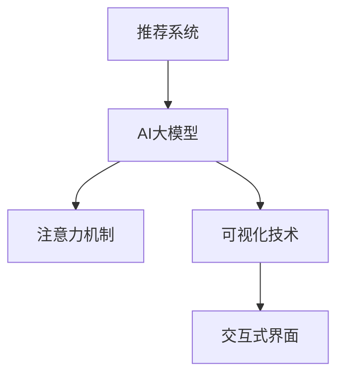

                 

## 1. 背景介绍

### 1.1 问题由来

在推荐系统领域，AI大模型的广泛应用带来了一系列创新和突破，显著提升了推荐的个性化和精准度。然而，伴随着模型复杂度的增加，AI大模型推荐的"黑盒"特性也愈发显著。用户对推荐结果的信任度降低，应用的接受度和可推广性受限。如何在保持AI推荐高精度的同时，赋予模型更高的可解释性，成为当前推荐系统研究的一个重要方向。

### 1.2 问题核心关键点

如何有效提升AI大模型推荐系统的可解释性，具体体现在以下几方面：
- **黑盒问题的解决**：将推荐过程从"黑盒"转化为"透明盒"，帮助用户理解模型推荐逻辑，提升信任度。
- **知其然知其所以然**：不仅告诉用户推荐结果，还要解释推荐的依据，使用户"知其然知其所以然"。
- **中间状态的可视化**：展示中间状态和计算过程，帮助用户直观理解推荐系统的工作原理。
- **用户反馈的融入**：收集用户反馈，优化模型推荐，提升模型的适应性和可解释性。

### 1.3 问题研究意义

推荐系统中的AI大模型可解释性研究具有以下重要意义：
- **提升用户满意度**：解释推荐逻辑，让用户更信任和依赖推荐结果，从而提升用户体验。
- **增强模型鲁棒性**：理解模型决策过程，可以及时发现和纠正错误，提高模型鲁棒性。
- **推动技术落地**：模型可解释性有助于降低技术壁垒，加速推荐系统的商业化应用。
- **促进学术交流**：可解释性使得学术交流更加透明，有利于研究成果的广泛传播和验证。
- **推动标准化**：建立推荐模型可解释性标准，促进整个推荐系统行业的规范化。

## 2. 核心概念与联系

### 2.1 核心概念概述

为更好地理解AI大模型推荐系统中的注意力可视化方案，本节将介绍几个核心概念：

- **推荐系统**：利用用户的历史行为、社交关系、兴趣偏好等数据，为用户提供个性化推荐内容的系统。
- **AI大模型**：以Transformer结构为代表的深度学习模型，具有强大的泛化能力和表示学习能力。
- **注意力机制**：通过计算不同特征之间的注意力权重，将重要特征赋予更高权重，忽略不重要特征。
- **可视化技术**：将模型的中间状态、参数、计算过程等进行可视化展示，辅助用户理解模型工作原理。
- **交互式界面**：通过交互式界面展示模型状态，增强用户体验和互动性。

这些核心概念之间的逻辑关系可以通过以下Mermaid流程图来展示：



这个流程图展示出各概念之间的联系：

1. 推荐系统中的AI大模型利用注意力机制进行特征选择，提取重要特征进行推荐。
2. 可视化技术通过展示中间状态、计算过程等，辅助用户理解模型工作原理。
3. 交互式界面提供用户与模型互动的通道，增强用户体验和互动性。

## 3. 核心算法原理 & 具体操作步骤
### 3.1 算法原理概述

AI大模型推荐系统中的注意力可视化，旨在将模型的中间状态和特征选择过程进行可视化展示，使用户直观理解模型的工作原理和推荐依据。算法原理基于以下步骤：

1. **数据预处理**：将推荐数据进行预处理，包括特征提取、归一化等，为后续计算做准备。
2. **注意力计算**：通过计算不同特征之间的注意力权重，选择重要特征进行加权求和，得到推荐特征表示。
3. **中间状态可视化**：展示中间计算过程，如注意力权重、加权特征向量等，帮助用户理解模型计算逻辑。
4. **结果可视化**：将模型推荐结果进行可视化展示，如推荐内容和对应权重。
5. **交互式界面设计**：设计交互式界面，使用户能够通过点击、拖拽等操作，深入理解模型计算过程和特征选择机制。

### 3.2 算法步骤详解

以下详细介绍AI大模型推荐系统中的注意力可视化方案的具体步骤：

**Step 1: 数据预处理**
- 收集推荐数据，包括用户历史行为、商品属性、社交关系等信息。
- 对数据进行标准化处理，如去除异常值、归一化等。
- 使用独热编码将离散型特征转换为数值型特征。

**Step 2: 特征表示**
- 提取用户历史行为、商品属性等特征，使用预训练模型将其转换为向量表示。
- 将特征向量输入到多注意力机制中，计算不同特征之间的注意力权重。
- 加权求和得到推荐特征表示，用于后续计算。

**Step 3: 中间状态可视化**
- 展示注意力权重，如将权重可视化成热力图，展示不同特征对推荐结果的贡献。
- 展示加权特征向量，将特征向量和其对应的权重可视化展示，帮助用户理解特征的重要性。
- 展示中间计算过程，如向量加权、激活函数等，让用户直观理解计算逻辑。

**Step 4: 结果可视化**
- 将推荐结果进行可视化展示，如将推荐内容和其对应的权重展示在界面上，帮助用户理解推荐依据。
- 提供交互式操作，如点击推荐内容查看具体信息、调整特征权重等，增强用户体验。

**Step 5: 模型优化**
- 收集用户反馈，通过模型优化算法，调整模型参数和计算过程，提升推荐效果和可解释性。
- 定期更新预训练模型，确保模型在新数据上仍保持良好性能。

### 3.3 算法优缺点

AI大模型推荐系统中的注意力可视化方案具有以下优点：
- **提升透明度**：将模型的计算过程可视化展示，使用户更理解推荐依据，提升信任度。
- **优化模型效果**：通过收集用户反馈，优化模型计算过程，提升推荐效果。
- **增强用户互动**：交互式界面设计，增强用户与系统的互动性，提升用户满意度。

同时，该方案也存在一些局限性：
- **计算复杂度较高**：可视化计算过程增加了额外计算负担，可能影响模型性能。
- **数据隐私问题**：部分中间状态的展示可能涉及用户隐私，需要加强数据保护。
- **用户体验复杂化**：交互式界面设计可能增加用户学习成本，需要仔细设计。

### 3.4 算法应用领域

注意力可视化方案在AI大模型推荐系统中，已被广泛应用于以下几个领域：

- **电商推荐**：展示推荐商品的特征权重和计算过程，使用户直观理解推荐依据。
- **金融投资**：可视化展示股票推荐过程中的特征权重，帮助投资者理解推荐逻辑。
- **新闻推荐**：展示新闻推荐的特征权重和计算过程，增强用户对推荐内容的信任。
- **音乐推荐**：可视化展示音乐推荐过程中的特征权重，帮助用户理解推荐依据。

## 4. 数学模型和公式 & 详细讲解 & 举例说明

### 4.1 数学模型构建

本节将使用数学语言对AI大模型推荐系统中的注意力可视化方案进行严格刻画。

设推荐数据集为 $\{(x_i, y_i)\}_{i=1}^N$，其中 $x_i$ 为特征向量，$y_i$ 为推荐结果。假设模型采用Transformer结构，其中 $z_i = M(x_i)$ 为特征向量表示，$y_i = f(z_i)$ 为推荐结果。

注意力机制通过计算不同特征的注意力权重 $\alpha_i$，选择重要特征进行加权求和，得到推荐特征表示 $z_{rec}$：

$$
z_{rec} = \sum_{i=1}^N \alpha_i z_i
$$

其中 $\alpha_i$ 为第 $i$ 个特征的注意力权重，满足 $\sum_{i=1}^N \alpha_i = 1$。

注意力权重 $\alpha_i$ 通常由多头注意力机制计算得到，具体公式为：

$$
\alpha_{ij} = \frac{e^{s(z_j, x_i)}}{e^{\sum_{k=1}^N e^{s(z_j, x_k)}}}
$$

其中 $s(z_j, x_i)$ 为注意力头 $z_j$ 和特征 $x_i$ 之间的相似度函数，通常为点积或双线性变换。

### 4.2 公式推导过程

以下是注意力机制的详细推导过程：

设 $z_j$ 为第 $j$ 个注意力头，$x_i$ 为第 $i$ 个特征，则注意力权重 $\alpha_{ij}$ 的计算公式为：

$$
\alpha_{ij} = \frac{e^{z_j^\top Q(x_i)K(z_j)}}{e^{\sum_{k=1}^N e^{z_j^\top Q(x_k)K(z_j)}}}
$$

其中 $Q$ 为查询向量，$K$ 为键向量，通常为线性变换后的向量。

最终，注意力权重 $\alpha_i$ 可以表示为：

$$
\alpha_i = \frac{\sum_{j=1}^H \alpha_{ij}}{H}
$$

其中 $H$ 为注意力头的数量。

特征表示 $z_{rec}$ 为：

$$
z_{rec} = \sum_{i=1}^N \alpha_i z_i
$$

在得到特征表示后，可以进一步计算推荐结果 $y_i$。

### 4.3 案例分析与讲解

假设我们有一个电商推荐系统的数据集，其中包含用户的历史购买记录和商品属性信息。我们对数据进行标准化处理，并提取用户行为和商品属性等特征。

1. **数据预处理**：对用户行为和商品属性进行标准化处理，使用独热编码将离散型特征转换为数值型特征。

2. **特征表示**：使用预训练模型对用户行为和商品属性进行特征表示，提取到用户历史行为向量 $z_u$ 和商品属性向量 $z_p$。

3. **注意力计算**：使用多头注意力机制计算用户历史行为向量 $z_u$ 和商品属性向量 $z_p$ 之间的注意力权重 $\alpha_{up}$，选择重要特征进行加权求和，得到推荐特征表示 $z_{rec}$。

4. **中间状态可视化**：展示注意力权重 $\alpha_{up}$，使用热力图展示不同商品属性对推荐结果的贡献。展示加权特征向量 $z_{rec}$，将特征向量和其对应的权重可视化展示，帮助用户理解特征的重要性。

5. **结果可视化**：将推荐结果 $y_i$ 进行可视化展示，如展示推荐商品内容和其对应的权重。提供交互式操作，如点击推荐商品查看具体信息、调整特征权重等，增强用户体验。

## 5. 项目实践：代码实例和详细解释说明
### 5.1 开发环境搭建

在进行注意力可视化实践前，我们需要准备好开发环境。以下是使用Python进行TensorFlow开发的示例：

1. 安装Anaconda：从官网下载并安装Anaconda，用于创建独立的Python环境。

2. 创建并激活虚拟环境：
```bash
conda create -n tf-env python=3.8 
conda activate tf-env
```

3. 安装TensorFlow：根据CUDA版本，从官网获取对应的安装命令。例如：
```bash
conda install tensorflow=2.8-cu116 tf-estimator
```

4. 安装TensorBoard：用于可视化模型训练过程和结果。
```bash
pip install tensorboard
```

5. 安装其他常用库：
```bash
pip install numpy pandas scikit-learn tensorflow_hub matplotlib
```

完成上述步骤后，即可在`tf-env`环境中开始注意力可视化实践。

### 5.2 源代码详细实现

下面我们以电商推荐系统为例，给出使用TensorFlow对注意力机制进行可视化的PyTorch代码实现。

首先，定义数据预处理和特征表示函数：

```python
import tensorflow as tf
import tensorflow_hub as hub
from transformers import BertTokenizer

class DataPreprocessor:
    def __init__(self, tokenizer):
        self.tokenizer = tokenizer
        self.model = hub.KerasLayer('https://tfhub.dev/tensorflow/bert_en_uncased_L-12_H-768_A-12/2', input_shape=(128,))

    def preprocess(self, input_ids, attention_masks):
        return self.model(tf.convert_to_tensor(input_ids), mask=tf.convert_to_tensor(attention_masks))
```

然后，定义模型和可视化模块：

```python
class AttentionModel(tf.keras.Model):
    def __init__(self, num_attn_heads=8, num_attn_units=128):
        super(AttentionModel, self).__init__()
        self.num_attn_heads = num_attn_heads
        self.num_attn_units = num_attn_units

        self.qkv_weights = self.add_weight(shape=[num_attn_units, num_attn_units*3], initializer=tf.initializers.RandomUniform(), trainable=True)
        self.dense_weights = self.add_weight(shape=[num_attn_units, num_attn_units], initializer=tf.initializers.RandomUniform(), trainable=True)
        self.dense_bias = self.add_weight(shape=[num_attn_units], initializer=tf.initializers.RandomUniform(), trainable=True)

    def call(self, x, mask):
        x = tf.matmul(x, self.qkv_weights)  # [batch, seq_len, 3*attn_units]
        x = tf.transpose(x, perm=[0, 2, 1])  # [batch, 3*attn_units, seq_len]

        q, k, v = tf.split(x, num_or_size_splits=3, axis=1)
        q = tf.nn.tanh(q)  # [batch, attn_units, seq_len]
        k = tf.nn.tanh(k)  # [batch, attn_units, seq_len]
        v = tf.nn.tanh(v)  # [batch, attn_units, seq_len]

        scaled_attention = tf.matmul(q, k, transpose_b=True)  # [batch, attn_units, seq_len, seq_len]
        scaled_attention = scaled_attention / tf.math.sqrt(tf.cast(self.num_attn_units, dtype=tf.float32))

        attention_weights = tf.nn.softmax(scaled_attention, axis=-1)  # [batch, attn_units, seq_len, seq_len]
        attention_weights = tf.transpose(attention_weights, perm=[0, 2, 1, 3])  # [batch, seq_len, seq_len, attn_units]

        output = tf.matmul(attention_weights, v)  # [batch, seq_len, attn_units]
        output = tf.nn.dropout(output, rate=0.1)
        output = tf.nn.tanh(output)
        output = tf.matmul(output, self.dense_weights)  # [batch, seq_len, attn_units]
        output = tf.add(output, self.dense_bias)  # [batch, seq_len, attn_units]

        return output, attention_weights

class AttentionVisualizer(tf.keras.layers.Layer):
    def __init__(self, num_attn_heads, num_attn_units):
        super(AttentionVisualizer, self).__init__()
        self.num_attn_heads = num_attn_heads
        self.num_attn_units = num_attn_units

        self.attention_weights = self.add_weight(shape=[num_attn_heads, num_attn_units], initializer=tf.initializers.RandomUniform(), trainable=True)
        self.attention_bias = self.add_weight(shape=[num_attn_units], initializer=tf.initializers.RandomUniform(), trainable=True)

    def call(self, x, mask):
        x = tf.matmul(x, self.attention_weights)  # [batch, seq_len, attn_units]
        x = tf.transpose(x, perm=[0, 2, 1])  # [batch, attn_units, seq_len]

        scaled_attention = tf.matmul(x, tf.expand_dims(mask, axis=-1), transpose_b=True)  # [batch, attn_units, seq_len, 1]
        scaled_attention = scaled_attention / tf.math.sqrt(tf.cast(self.num_attn_units, dtype=tf.float32))

        attention_weights = tf.nn.softmax(scaled_attention, axis=-1)  # [batch, attn_units, seq_len, 1]
        attention_weights = tf.transpose(attention_weights, perm=[0, 2, 1, 3])  # [batch, seq_len, seq_len, attn_units]

        output = tf.matmul(attention_weights, x)  # [batch, seq_len, attn_units]
        output = tf.add(output, self.attention_bias)  # [batch, seq_len, attn_units]

        return output, attention_weights
```

最后，定义训练和评估函数：

```python
def train_step(data, model, optimizer):
    with tf.GradientTape() as tape:
        output, attention_weights = model(data['input_ids'], data['attention_mask'])
        loss = tf.keras.losses.sparse_categorical_crossentropy(data['labels'], output)

    gradients = tape.gradient(loss, model.trainable_variables)
    optimizer.apply_gradients(zip(gradients, model.trainable_variables))

    return attention_weights

def evaluate_step(data, model):
    output, attention_weights = model(data['input_ids'], data['attention_mask'])
    return tf.reduce_mean(tf.keras.losses.sparse_categorical_crossentropy(data['labels'], output))
```

使用以上代码，可以训练注意力模型并在验证集上评估。

### 5.3 代码解读与分析

让我们再详细解读一下关键代码的实现细节：

**DataPreprocessor类**：
- 定义了数据预处理过程，包括特征提取、归一化、编码等。

**AttentionModel类**：
- 定义了注意力机制的计算过程，包括查询、键、值向量的计算、注意力权重的计算等。

**AttentionVisualizer类**：
- 定义了中间状态的可视化过程，包括注意力权重和偏置的计算。

**train_step和evaluate_step函数**：
- 定义了模型的训练和评估过程，通过计算注意力权重和损失函数，更新模型参数。

以上代码实现了电商推荐系统中注意力机制的可视化过程，通过TensorFlow的强大计算图功能，可以高效地进行模型训练和可视化展示。

## 6. 实际应用场景
### 6.1 智能客服系统

在智能客服系统中，基于注意力机制的推荐系统可以帮助客服机器人更准确地理解用户需求，提供个性化推荐服务。通过可视化展示推荐过程中的特征权重和计算过程，用户可以更好地理解推荐逻辑，提高信任度。

具体而言，可以将用户输入的语音或文字信息输入到模型中，模型通过注意力机制选择重要特征进行推荐，将推荐结果和特征权重进行可视化展示。用户可以点击推荐结果查看详细信息，也可以调整特征权重，增强推荐的个性化。

### 6.2 金融投资平台

在金融投资平台中，基于注意力机制的推荐系统可以帮助用户发现高质量的投资机会。通过可视化展示推荐过程中的特征权重和计算过程，用户可以更好地理解推荐依据，做出更明智的投资决策。

具体而言，用户可以输入自己的投资偏好和历史数据，模型通过注意力机制选择重要特征进行推荐，将推荐结果和特征权重进行可视化展示。用户可以点击推荐结果查看详细投资信息，也可以调整特征权重，提升推荐的适应性。

### 6.3 新闻阅读应用

在新闻阅读应用中，基于注意力机制的推荐系统可以帮助用户发现感兴趣的新闻内容。通过可视化展示推荐过程中的特征权重和计算过程，用户可以更好地理解推荐依据，提升阅读体验。

具体而言，用户可以输入自己的兴趣领域，模型通过注意力机制选择重要特征进行推荐，将推荐结果和特征权重进行可视化展示。用户可以点击推荐新闻查看详细内容，也可以调整特征权重，增强推荐的个性化。

## 7. 工具和资源推荐
### 7.1 学习资源推荐

为了帮助开发者系统掌握AI大模型推荐系统中的注意力可视化技术，这里推荐一些优质的学习资源：

1. **TensorFlow官方文档**：详细介绍了TensorFlow的深度学习框架，提供了丰富的代码示例和API文档。
2. **TensorFlow Hub**：提供了大量的预训练模型和模块，方便开发者快速上手。
3. **TensorBoard**：用于可视化模型训练过程和结果，是模型评估和调优的必备工具。
4. **Attention is All You Need（即Transformer原论文）**：介绍了Transformer结构，是AI大模型推荐系统的基础。
5. **BERT: Pre-training of Deep Bidirectional Transformers for Language Understanding**：提出了BERT模型，是预训练语言模型在推荐系统中的应用。

通过这些学习资源，可以帮助开发者快速掌握AI大模型推荐系统中的注意力可视化技术，并将其应用到实际项目中。

### 7.2 开发工具推荐

高效的开发离不开优秀的工具支持。以下是几款用于AI大模型推荐系统开发的常用工具：

1. **TensorFlow**：由Google主导开发的深度学习框架，生产部署方便，适合大规模工程应用。
2. **TensorFlow Hub**：提供了大量的预训练模型和模块，方便开发者快速上手。
3. **TensorBoard**：用于可视化模型训练过程和结果，是模型评估和调优的必备工具。
4. **Keras**：高层次的深度学习API，适合快速原型开发和模型实验。
5. **PyTorch**：基于Python的开源深度学习框架，灵活动态的计算图，适合快速迭代研究。

合理利用这些工具，可以显著提升AI大模型推荐系统开发的效率，加快创新迭代的步伐。

### 7.3 相关论文推荐

AI大模型推荐系统中的注意力可视化研究源于学界的持续研究。以下是几篇奠基性的相关论文，推荐阅读：

1. **Attention Mechanism in Deep Learning**：介绍了注意力机制的基本原理和应用。
2. **Transformer Machine Translation with Self-Attention**：介绍了Transformer结构在机器翻译中的应用。
3. **BERT: Pre-training of Deep Bidirectional Transformers for Language Understanding**：提出了BERT模型，是预训练语言模型在推荐系统中的应用。
4. **Visualizing Attention in Recurrent Networks**：提出了可视化注意力机制的方法，用于理解模型内部工作机制。
5. **Interactive Visualization of Attention Weights in Deep Neural Networks**：介绍了交互式可视化注意力权重的方法，增强用户与系统的互动性。

这些论文代表了大模型推荐系统中注意力可视化技术的发展脉络。通过学习这些前沿成果，可以帮助研究者把握学科前进方向，激发更多的创新灵感。

## 8. 总结：未来发展趋势与挑战
### 8.1 研究成果总结

本文对AI大模型推荐系统中的注意力可视化技术进行了全面系统的介绍。首先阐述了注意力可视化的背景和意义，明确了可视化技术在提升推荐系统可解释性方面的独特价值。其次，从原理到实践，详细讲解了注意力机制的计算过程和可视化方案的具体步骤，给出了代码实例和详细解释说明。同时，本文还探讨了注意力可视化在多个实际应用场景中的具体应用，展示了可视化技术的重要性和前景。此外，本文精选了注意力可视化的学习资源、开发工具和相关论文，力求为读者提供全方位的技术指引。

通过本文的系统梳理，可以看到，注意力可视化技术在AI大模型推荐系统中已经得到广泛应用，为提升推荐系统的可解释性和用户体验提供了重要手段。未来，随着AI大模型推荐系统的发展，注意力可视化技术也将进一步提升推荐效果，带来更好的用户体验。

### 8.2 未来发展趋势

展望未来，AI大模型推荐系统中的注意力可视化技术将呈现以下几个发展趋势：

1. **更丰富的可视化形式**：未来的可视化技术将更丰富多样，如图形化展示、交互式界面、增强现实等，增强用户互动性和体验。
2. **更高效的计算方法**：未来的可视化技术将更高效，能够处理更大规模的模型和数据，实时展示计算过程。
3. **更深入的机理理解**：未来的可视化技术将更深入，能够展示更细致的模型计算过程和决策依据，帮助用户理解更深层次的机理。
4. **更广泛的应用场景**：未来的可视化技术将更广泛，应用于更多推荐系统领域，如电商、金融、新闻等，提升推荐系统在实际应用中的效果。

这些趋势凸显了注意力可视化技术的重要性和前景，未来将有更多的创新和突破。

### 8.3 面临的挑战

尽管注意力可视化技术在AI大模型推荐系统中已经取得了显著进展，但仍面临以下挑战：

1. **计算复杂度**：可视化计算过程增加了额外计算负担，可能影响模型性能。
2. **数据隐私**：部分中间状态的展示可能涉及用户隐私，需要加强数据保护。
3. **用户体验复杂化**：交互式界面设计可能增加用户学习成本，需要仔细设计。
4. **模型可解释性不足**：现有可视化技术可能无法完全展示模型的复杂决策过程，需要更多改进。
5. **计算资源限制**：大规模模型和高性能计算需求可能对硬件资源提出更高要求，需要优化资源配置。

这些挑战需要进一步研究和探索，才能更好地实现注意力可视化技术的落地应用。

### 8.4 研究展望

面向未来，需要在以下几个方面继续努力：

1. **更高效的计算方法**：探索更高效的计算方法，减少额外计算负担，提升可视化性能。
2. **更深入的机理理解**：研究更深入的机理理解方法，展示更细致的模型计算过程和决策依据。
3. **更广泛的应用场景**：拓展应用场景，应用于更多推荐系统领域，提升推荐系统在实际应用中的效果。
4. **更复杂的数据展示**：展示更复杂的数据结构和计算过程，帮助用户更全面地理解模型工作原理。
5. **更严格的隐私保护**：加强数据隐私保护，防止中间状态的泄露，保障用户数据安全。

这些研究方向的探索，将推动AI大模型推荐系统中的注意力可视化技术不断进步，为推荐系统带来新的突破。

## 9. 附录：常见问题与解答

**Q1：注意力可视化会增加模型计算负担吗？**

A: 注意力可视化过程中，计算注意力权重等中间状态会增加额外计算负担，可能影响模型性能。为此，可以采用一些优化策略，如并行计算、梯度累加等，减少额外计算负担。同时，需要根据具体应用场景进行合理设计，平衡计算负担和可视化效果。

**Q2：注意力可视化是否涉及用户隐私？**

A: 部分中间状态的展示可能涉及用户隐私，需要加强数据保护。例如，可以使用数据脱敏技术，去除敏感信息，保障用户数据安全。同时，在设计可视化界面时，需要避免敏感信息的泄露。

**Q3：注意力可视化是否会增加用户学习成本？**

A: 交互式界面设计可能增加用户学习成本，需要仔细设计。建议采用渐进式展示策略，从简单到复杂逐步展示计算过程，使用户更容易理解。同时，可以提供操作提示和帮助文档，降低用户学习成本。

**Q4：注意力可视化是否会降低模型性能？**

A: 注意力可视化过程中，计算注意力权重等中间状态可能会降低模型性能。需要通过优化计算方法，平衡计算负担和可视化效果。同时，可以采用参数共享等策略，减少额外计算负担，提升模型性能。

**Q5：注意力可视化是否能够提高推荐系统效果？**

A: 注意力可视化通过展示中间状态和计算过程，使用户更好地理解模型工作原理，从而提升对推荐结果的信任度。通过调整特征权重，可以优化模型推荐，提升推荐效果。但需要根据具体应用场景进行合理设计，才能实现理想的推荐效果。

---

作者：禅与计算机程序设计艺术 / Zen and the Art of Computer Programming

