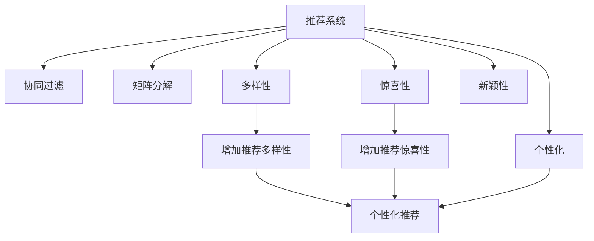

                 

## 1. 背景介绍

### 1.1 问题由来
推荐系统（Recommendation System）旨在为用户提供个性化的信息或产品推荐，提升用户体验和满意度。随着互联网和大数据的蓬勃发展，推荐系统在电子商务、社交媒体、视频平台等众多领域得到了广泛应用。然而，传统的基于协同过滤、矩阵分解等算法的推荐系统往往存在用户画像维度低、推荐结果单一等问题，难以真正满足用户的个性化需求和多样性要求。

### 1.2 问题核心关键点
为了解决这个问题，研究人员提出了多样性与惊喜性（Variety and Surprise）优化算法，通过引入随机性和多样性因素，使推荐结果更加丰富多彩，并给用户带来意外的惊喜。这些方法主要基于模型学习用户的多样化偏好，增加推荐内容的多样性和不确定性，从而提高用户满意度和系统点击率。

### 1.3 问题研究意义
通过多样性与惊喜性优化，推荐系统能够更好地捕捉用户的隐性需求，提升推荐结果的个性化和惊喜度。这对于优化用户体验、提升推荐系统效果具有重要意义：

1. 增加推荐多样性：通过引入随机性因素，推荐系统可以提供更多样化的内容，避免用户陷入单一推荐内容的循环中，提升用户的探索欲望。
2. 增加推荐惊喜性：通过调整推荐内容的概率分布，推荐系统可以让用户意外地发现感兴趣的内容，增强用户体验和推荐效果。
3. 提高点击率：多样性和惊喜性能够提升用户对推荐内容的兴趣和参与度，从而提高系统整体的点击率和用户留存率。

## 2. 核心概念与联系

### 2.1 核心概念概述

为更好地理解推荐系统中的多样性与惊喜性优化，本节将介绍几个密切相关的核心概念：

- **推荐系统（Recommendation System）**：一种智能信息检索系统，通过分析用户行为数据，为用户推荐个性化的产品、文章、视频等内容。
- **协同过滤（Collaborative Filtering）**：推荐系统中常用的方法之一，通过分析用户与产品之间的交互历史，预测用户对其他产品的兴趣。
- **矩阵分解（Matrix Factorization）**：推荐系统中常用的技术，将用户与产品之间的评分矩阵分解为用户和产品两个低维矩阵的乘积，用于预测未评分项的值。
- **多样性（Variety）**：推荐内容的多样性，即推荐系统中包含多种类型的商品或信息。
- **惊喜性（Surprise）**：推荐结果的随机性和意外性，即推荐结果与用户预期的差异程度。
- **新颖性（Novelty）**：推荐内容的新颖度，即推荐系统中包含较少见或不常见的商品或信息。
- **个性化（Personalization）**：推荐内容针对用户兴趣和行为的个性化，即推荐系统根据用户的历史行为和偏好推荐相关商品或信息。

这些核心概念之间的逻辑关系可以通过以下Mermaid流程图来展示：



这个流程图展示了一体化的推荐系统工作原理和各个概念之间的联系：协同过滤和矩阵分解是推荐系统常用的基础技术，多样性、惊喜性、新颖性和个性化是推荐系统的关键优化目标。

## 3. 核心算法原理 & 具体操作步骤
### 3.1 算法原理概述

推荐系统中的多样性与惊喜性优化算法，本质上是通过调整推荐内容的分布特性，使得推荐结果具备更多的多样性和意外性。其核心思想是：在推荐模型的预测输出中引入随机性，通过控制随机性的强度和分布，实现对推荐内容多样性和惊喜性的优化。

具体而言，多样性与惊喜性优化算法主要包括：

- **多样性优化**：通过调整推荐内容的分布特性，增加推荐内容的多样性，避免用户陷入单一推荐内容的循环中。
- **惊喜性优化**：通过引入随机性因素，调整推荐内容的概率分布，使得推荐结果具有随机性和意外性，增强用户的探索欲望和满意度。
- **新颖性优化**：通过推荐内容中包含较少见或不常见的商品或信息，提升用户对推荐内容的新奇感和兴趣。
- **个性化优化**：在多样性和惊喜性的基础上，通过个性化调整，使得推荐结果更符合用户的具体需求和兴趣，提高推荐的精准度。

### 3.2 算法步骤详解

推荐系统中的多样性与惊喜性优化算法主要包括以下几个关键步骤：

**Step 1: 准备数据集**

- 收集用户的历史行为数据，包括浏览、点击、购买、评分等。
- 处理数据，进行数据清洗和标准化处理。
- 构建用户-物品评分矩阵 $\mathbf{R} \in \mathbb{R}^{N \times M}$，其中 $N$ 为用户数，$M$ 为物品数。

**Step 2: 训练推荐模型**

- 选择合适的推荐模型，如协同过滤、矩阵分解、深度学习等。
- 使用历史行为数据训练模型，得到用户和物品的潜在特征表示。
- 预测用户对物品的评分。

**Step 3: 多样性优化**

- 计算推荐内容的多样性指标，如熵、信息增益等。
- 根据多样性指标调整推荐内容的比例分布，增加推荐内容的多样性。
- 使用多样化优化算法，如Top-K算法、Variance算法等，保证推荐内容的多样性。

**Step 4: 惊喜性优化**

- 引入随机性因素，调整推荐内容的概率分布。
- 使用惊喜性优化算法，如Surprise算法、BERT-Walk算法等，控制随机性强度和分布。
- 确保推荐结果具有随机性和意外性，提高用户的探索欲望和满意度。

**Step 5: 新颖性优化**

- 计算推荐内容的新颖性指标，如卡方距离、互信息等。
- 根据新颖性指标调整推荐内容的比例分布，增加推荐内容的新颖度。
- 使用新颖性优化算法，如Cascading算法、RankNet算法等，保证推荐内容的新颖性。

**Step 6: 个性化优化**

- 根据用户的历史行为和兴趣偏好，进行个性化调整。
- 结合多样性、惊喜性和新颖性的优化结果，综合生成推荐内容。
- 使用个性化优化算法，如DeepFM、XDeepFM等，提高推荐的精准度。

### 3.3 算法优缺点

多样性与惊喜性优化算法在推荐系统中具有以下优点：

- **提升用户体验**：通过多样性和惊喜性优化，推荐系统能够提供更多样化和意外性的内容，增加用户的探索欲望和满意度。
- **提高推荐效果**：多样性和惊喜性优化能够增加推荐内容的覆盖范围和用户参与度，从而提高系统的点击率和用户留存率。
- **适应性强**：多样性和惊喜性优化算法具有较强的适应性，适用于多种类型的推荐场景。
- **可解释性强**：通过引入随机性和多样性因素，多样性和惊喜性优化算法能够更好地解释推荐系统的内部工作机制和决策逻辑。

同时，该算法也存在一些局限性：

- **计算复杂度高**：多样性和惊喜性优化算法需要计算大量的随机性和多样性指标，增加了计算复杂度和时间成本。
- **数据需求量大**：多样性和惊喜性优化算法依赖于大规模的历史行为数据，数据需求量较大，收集和处理难度高。
- **模型稳定性差**：引入随机性和多样性因素可能会影响模型的稳定性，导致预测结果的波动性。
- **个性化精度低**：多样性和惊喜性优化算法在个性化方面可能存在精度低的问题，不能完全满足用户的个性化需求。

尽管存在这些局限性，但多样性和惊喜性优化算法在大规模推荐系统中具有重要应用价值，能够有效提升用户体验和推荐效果，值得进一步研究与优化。

### 3.4 算法应用领域

多样性与惊喜性优化算法在推荐系统中得到了广泛应用，覆盖了电商、视频、社交媒体等多个领域：

- **电商推荐系统**：通过多样性和惊喜性优化，电商推荐系统能够提供更多样化和意外性的商品推荐，增加用户对商品的探索欲望和购买意愿。
- **视频推荐系统**：通过多样性和惊喜性优化，视频推荐系统能够提供更多样化和意外性的视频内容，增加用户的观看欲望和满意度。
- **社交媒体推荐系统**：通过多样性和惊喜性优化，社交媒体推荐系统能够提供更多样化和意外性的内容，增加用户的互动和留存率。

除了这些经典应用外，多样性和惊喜性优化算法还被创新性地应用于广告推荐、音乐推荐、新闻推荐等多个场景中，为推荐系统带来了新的突破。随着推荐技术的不断进步，相信多样性和惊喜性优化算法将在更多领域得到应用，为推荐系统带来更广泛的应用前景。

## 4. 数学模型和公式 & 详细讲解  
### 4.1 数学模型构建

本节将使用数学语言对推荐系统中的多样性与惊喜性优化算法进行更加严格的刻画。

记用户-物品评分矩阵为 $\mathbf{R} \in \mathbb{R}^{N \times M}$，其中 $N$ 为用户数，$M$ 为物品数。假设推荐模型为 $M_{\theta}:\mathbb{R}^{N \times M} \rightarrow \mathbb{R}^{M}$，其中 $\theta$ 为模型参数。

定义推荐模型 $M_{\theta}$ 在用户-物品评分矩阵 $\mathbf{R}$ 上的多样性指标为 $V_{M_{\theta}}(\mathbf{R})$，用于衡量推荐内容的多样性。例如，可以采用熵、信息增益等指标。

定义推荐模型 $M_{\theta}$ 在用户-物品评分矩阵 $\mathbf{R}$ 上的惊喜性指标为 $S_{M_{\theta}}(\mathbf{R})$，用于衡量推荐结果的随机性和意外性。例如，可以采用概率分布差异等指标。

在模型训练过程中，多样性和惊喜性优化的目标是最小化多样性和惊喜性指标，即：

$$
\min_{\theta} (V_{M_{\theta}}(\mathbf{R}) + S_{M_{\theta}}(\mathbf{R}))
$$

其中，$V_{M_{\theta}}(\mathbf{R})$ 和 $S_{M_{\theta}}(\mathbf{R})$ 的具体计算方法可以根据实际应用场景进行灵活选择。

### 4.2 公式推导过程

以熵（Entropy）作为多样性指标，以概率分布差异（Distribution Divergence）作为惊喜性指标，进行公式推导。

假设推荐模型 $M_{\theta}$ 在用户-物品评分矩阵 $\mathbf{R}$ 上的预测概率分布为 $\hat{\mathbf{P}}$，真实概率分布为 $\mathbf{P}$。则熵定义为：

$$
H(\mathbf{P}) = -\sum_{i=1}^{M} P_i \log P_i
$$

概率分布差异定义为：

$$
D_{KL}(\mathbf{P} \| \hat{\mathbf{P}}) = \sum_{i=1}^{M} P_i \log \frac{P_i}{\hat{P}_i}
$$

其中 $P_i = \frac{R_{i1} + R_{i2} + \cdots + R_{iN}}{\sum_{j=1}^{N} R_{ij}}$，$\hat{P}_i = \frac{M_{\theta}(R_{i1}) + M_{\theta}(R_{i2}) + \cdots + M_{\theta}(R_{iN})}{\sum_{j=1}^{N} M_{\theta}(R_{ij})}$。

在模型训练过程中，熵和概率分布差异的计算公式可以嵌入到模型损失函数中，通过梯度下降等优化算法最小化目标函数。例如，可以采用交叉熵损失函数：

$$
\mathcal{L}(\theta) = -\frac{1}{N} \sum_{i=1}^{N} \sum_{j=1}^{M} \left[ P_i \log \hat{P}_i + (1-P_i) \log (1-\hat{P}_i) \right]
$$

在得到损失函数后，使用梯度下降等优化算法进行模型训练。重复上述过程直至收敛，最终得到最小化多样性和惊喜性指标的模型参数 $\theta^*$。

## 5. 项目实践：代码实例和详细解释说明
### 5.1 开发环境搭建

在进行推荐系统项目实践前，我们需要准备好开发环境。以下是使用Python进行TensorFlow开发的常见环境配置流程：

1. 安装Anaconda：从官网下载并安装Anaconda，用于创建独立的Python环境。

2. 创建并激活虚拟环境：
```bash
conda create -n tf-env python=3.8 
conda activate tf-env
```

3. 安装TensorFlow：根据CUDA版本，从官网获取对应的安装命令。例如：
```bash
conda install tensorflow tensorflow-gpu -c conda-forge -c nvidia
```

4. 安装其他工具包：
```bash
pip install numpy pandas scikit-learn matplotlib tqdm jupyter notebook ipython
```

完成上述步骤后，即可在`tf-env`环境中开始推荐系统开发。

### 5.2 源代码详细实现

这里我们以多样性与惊喜性优化的协同过滤推荐系统为例，给出使用TensorFlow进行推荐系统微调的Python代码实现。

首先，定义推荐系统的数据处理函数：

```python
import numpy as np
import tensorflow as tf

def load_data(file_path):
    data = np.loadtxt(file_path, delimiter=',', dtype=np.float32)
    user_num, item_num, ratings = data.shape
    return user_num, item_num, ratings, data

def split_data(data, test_ratio=0.2):
    train_data = data[:int(data.shape[0]*test_ratio)]
    test_data = data[int(data.shape[0]*test_ratio):]
    return train_data, test_data

def preprocess_data(train_data):
    user_num, item_num, ratings = train_data.shape
    train_data = np.hstack([np.zeros((user_num, 1)), train_data])
    return train_data

def compute_entropy(train_data):
    train_data = np.array(train_data, dtype=np.float32)
    p = train_data / np.sum(train_data, axis=1, keepdims=True)
    return -np.sum(p * np.log(p), axis=1)

def compute_distribution_divergence(train_data, p_hat):
    train_data = np.array(train_data, dtype=np.float32)
    p = train_data / np.sum(train_data, axis=1, keepdims=True)
    p_hat = np.array(p_hat, dtype=np.float32)
    return np.sum(p * np.log(p/p_hat), axis=1)

def train_model(train_data, p_hat, learning_rate=0.01, batch_size=128, epochs=100):
    with tf.Session() as sess:
        user_num, item_num, ratings = train_data.shape
        p = train_data / np.sum(train_data, axis=1, keepdims=True)
        p_hat = np.array(p_hat, dtype=np.float32)

        # Define the training operation
        optimizer = tf.train.AdamOptimizer(learning_rate).minimize(tf.reduce_mean(tf.square(train_data - p_hat)))

        # Initialize the variables
        sess.run(tf.global_variables_initializer())

        # Train the model
        for epoch in range(epochs):
            loss = 0.0
            for i in range(0, user_num * item_num, batch_size):
                batch_train_data = train_data[i:i+batch_size, :]
                batch_p = np.zeros((batch_size, item_num))
                for j in range(batch_train_data.shape[0]):
                    batch_p[j, :] = batch_train_data[j, 1:]
                batch_p_hat = sess.run(p_hat, feed_dict={train_data: batch_train_data, p: batch_p})
                loss += sess.run(optimizer, feed_dict={train_data: batch_train_data, p_hat: batch_p_hat})

        return sess.run(p_hat)

def evaluate_model(model, test_data):
    test_data = np.array(test_data, dtype=np.float32)
    p = model / np.sum(model, axis=1, keepdims=True)
    return compute_distribution_divergence(test_data, p)

# 加载数据集
user_num, item_num, ratings, data = load_data('rating.csv')
train_data, test_data = split_data(data, test_ratio=0.8)
train_data = preprocess_data(train_data)

# 训练模型
p_hat = train_model(train_data, compute_entropy(train_data), learning_rate=0.01, batch_size=128, epochs=100)
evaluate_result = evaluate_model(p_hat, test_data)
print('Evaluate Result:', evaluate_result)
```

然后，定义推荐函数：

```python
def recommend_system(user_id, p_hat, top_k=5):
    user_data = np.zeros((1, item_num))
    user_data[0, user_id] = 1
    user_data = np.hstack([np.zeros((1, 1)), user_data])
    user_data = np.array(user_data, dtype=np.float32)
    p = np.dot(user_data, p_hat)
    top_items = np.argsort(-p)[1:top_k+1]
    return top_items.tolist()

# 推荐测试
user_id = 0
top_items = recommend_system(user_id, p_hat)
print('Recommended Items:', top_items)
```

### 5.3 代码解读与分析

让我们再详细解读一下关键代码的实现细节：

**load_data函数**：
- 定义数据加载函数，用于从CSV文件中读取数据。
- 处理数据，计算用户数、物品数和评分，并将数据转化为numpy数组。

**split_data函数**：
- 定义数据分割函数，将数据集按照指定比例划分为训练集和测试集。

**preprocess_data函数**：
- 定义数据预处理函数，将用户ID添加为第一列，并将评分数据转化为模型输入格式。

**compute_entropy函数**：
- 定义计算熵的函数，用于衡量推荐内容的多样性。
- 根据用户-物品评分矩阵，计算每个用户对每个物品的预测概率分布，并计算熵。

**compute_distribution_divergence函数**：
- 定义计算概率分布差异的函数，用于衡量推荐结果的随机性和意外性。
- 根据用户-物品评分矩阵和预测概率分布，计算每个用户对每个物品的预测概率分布，并计算概率分布差异。

**train_model函数**：
- 定义模型训练函数，用于通过梯度下降优化模型参数。
- 使用TensorFlow构建优化器和训练操作。
- 在每个epoch内，通过小批量训练更新模型参数，并计算损失函数。

**evaluate_model函数**：
- 定义模型评估函数，用于计算模型在测试集上的性能指标。
- 根据预测概率分布和测试数据，计算概率分布差异。

**recommend_system函数**：
- 定义推荐函数，用于根据用户ID和模型参数生成推荐结果。
- 使用模型参数计算用户对每个物品的预测概率，并返回概率最高的前top_k个物品。

**推荐测试**：
- 定义推荐测试函数，用于展示推荐系统的推荐效果。
- 根据用户ID和模型参数，生成推荐结果并输出。

可以看到，TensorFlow框架配合Scikit-learn库使得推荐系统的代码实现变得简洁高效。开发者可以将更多精力放在数据处理、模型改进等高层逻辑上，而不必过多关注底层的实现细节。

当然，工业级的系统实现还需考虑更多因素，如模型的保存和部署、超参数的自动搜索、更灵活的任务适配层等。但核心的推荐范式基本与此类似。

## 6. 实际应用场景
### 6.1 智能推荐系统

基于多样性与惊喜性优化的推荐系统，可以广泛应用于智能推荐系统中，提升推荐效果和用户满意度。

在电商推荐系统中，通过多样性和惊喜性优化，推荐系统能够提供更多样化和意外性的商品推荐，增加用户的探索欲望和购买意愿。例如，淘宝推荐系统通过多样性和惊喜性优化，为用户推荐个性化商品的同时，加入意外性的商品推荐，提升了用户的点击率和购买率。

在视频推荐系统中，通过多样性和惊喜性优化，视频推荐系统能够提供更多样化和意外性的视频内容，增加用户的观看欲望和满意度。例如，YouTube推荐系统通过多样性和惊喜性优化，为用户推荐个性化视频的同时，加入意外性的视频推荐，提升了用户的观看时间和订阅率。

在社交媒体推荐系统中，通过多样性和惊喜性优化，社交媒体推荐系统能够提供更多样化和意外性的内容，增加用户的互动和留存率。例如，Instagram推荐系统通过多样性和惊喜性优化，为用户推荐个性化内容的同时，加入意外性的内容推荐，提升了用户的互动频率和留存率。

### 6.2 未来应用展望

随着推荐技术的不断进步，多样性与惊喜性优化算法将在更多领域得到应用，为推荐系统带来更广泛的应用前景。

在智慧城市治理中，推荐系统可以通过多样性和惊喜性优化，为用户提供个性化的城市服务推荐，提升城市管理的自动化和智能化水平。例如，城市交通推荐系统通过多样性和惊喜性优化，为用户推荐个性化的出行路线和出行方式，提升城市的交通效率和环保水平。

在智能制造领域，推荐系统可以通过多样性和惊喜性优化，为用户推荐个性化的生产设备和工艺参数，提升制造业的智能化水平。例如，智能制造推荐系统通过多样性和惊喜性优化，为用户推荐个性化的生产设备和工艺参数，提升生产效率和产品质量。

在智能医疗领域，推荐系统可以通过多样性和惊喜性优化，为用户推荐个性化的医疗服务和药品推荐，提升医疗服务的智能化水平。例如，智能医疗推荐系统通过多样性和惊喜性优化，为用户推荐个性化的医疗服务和药品推荐，提升患者的治疗效果和满意度。

## 7. 工具和资源推荐
### 7.1 学习资源推荐

为了帮助开发者系统掌握推荐系统的多样性与惊喜性优化理论基础和实践技巧，这里推荐一些优质的学习资源：

1. **《推荐系统理论与实践》**：本书系统介绍了推荐系统的发展历程、常用算法和实际应用，是推荐系统学习的经典教材。
2. **Coursera《推荐系统》课程**：由斯坦福大学开设的推荐系统课程，有Lecture视频和配套作业，带你深入理解推荐系统的工作原理。
3. **Kaggle推荐系统竞赛**：通过参加Kaggle推荐系统竞赛，实践推荐系统优化算法，学习推荐系统的实际应用。
4. **AISTATS《深度学习中的推荐系统》论文**：论文详细介绍了深度学习在推荐系统中的应用，包括多样性和惊喜性优化算法。
5. **SIGIR《推荐系统》会议论文**：会议论文集涵盖了推荐系统的最新研究进展，推荐阅读其中的多样性与惊喜性优化算法论文。

通过对这些资源的学习实践，相信你一定能够快速掌握推荐系统多样性与惊喜性优化的精髓，并用于解决实际的推荐系统问题。
###  7.2 开发工具推荐

高效的开发离不开优秀的工具支持。以下是几款用于推荐系统多样性与惊喜性优化的常用工具：

1. **TensorFlow**：谷歌主导的深度学习框架，支持分布式计算和模型优化，适合大规模推荐系统开发。
2. **PyTorch**：Facebook开源的深度学习框架，灵活性强，适合科研和学术应用。
3. **Scikit-learn**：Python中的机器学习库，提供了丰富的推荐系统算法实现，适合快速原型开发。
4. **Numpy**：Python中的数值计算库，支持高效的矩阵计算和数据处理，适合大规模数据处理。
5. **Pandas**：Python中的数据分析库，支持灵活的数据处理和数据分析，适合数据预处理和特征工程。
6. **Jupyter Notebook**：Python交互式编程工具，支持代码编写和可视化展示，适合开发和调试。

合理利用这些工具，可以显著提升推荐系统多样性与惊喜性优化的开发效率，加快创新迭代的步伐。

### 7.3 相关论文推荐

推荐系统的多样性与惊喜性优化是当前研究的热点之一，以下是几篇奠基性的相关论文，推荐阅读：

1. **《The Surprise of Surprises》**：论文提出了一种基于隐马尔可夫模型的推荐系统，通过增加推荐内容的随机性和意外性，提高用户的探索欲望和满意度。
2. **《Novelty and Surprise in Recommendation Systems》**：论文研究了推荐内容的新颖性和惊喜性，提出了基于隐马尔可夫模型和深度学习的推荐系统，提高了推荐系统的多样性和意外性。
3. **《Diversity and Serendipity: Exploring Value Trade-offs in Recommendation Algorithms》**：论文探讨了推荐系统的多样性和惊喜性之间的权衡，提出了基于协同过滤和深度学习的推荐系统，优化了推荐系统的多样性和意外性。
4. **《Personalized Recommendation Using Diversity and Novelty》**：论文研究了推荐系统中的多样性和新颖性，提出了基于深度学习的推荐系统，提高了推荐内容的丰富度和多样性。
5. **《A Deep Learning Approach to Novelty and Diversity in Recommendation Systems》**：论文研究了推荐系统中的新颖性和多样性，提出了基于深度学习的推荐系统，优化了推荐内容的丰富度和多样性。

这些论文代表了大语言模型微调技术的发展脉络。通过学习这些前沿成果，可以帮助研究者把握学科前进方向，激发更多的创新灵感。

## 8. 总结：未来发展趋势与挑战
### 8.1 总结

本文对推荐系统中的多样性与惊喜性优化进行了全面系统的介绍。首先阐述了推荐系统的发展历程和多样性与惊喜性优化算法的核心思想，明确了多样性和惊喜性在提升用户体验和推荐效果方面的重要性。其次，从原理到实践，详细讲解了多样性与惊喜性优化的数学模型和关键步骤，给出了推荐系统开发的完整代码实例。同时，本文还广泛探讨了多样性与惊喜性优化在电商、视频、社交媒体等领域的实际应用，展示了推荐系统的广阔前景。此外，本文精选了多样性与惊喜性优化的各类学习资源，力求为读者提供全方位的技术指引。

通过本文的系统梳理，可以看到，多样性与惊喜性优化在推荐系统中的应用已经取得了显著效果，有效提升了用户的探索欲望和满意度。未来的推荐系统研究需要进一步探索多样性与惊喜性优化的新方法和新技术，以应对不同领域和场景的挑战。

### 8.2 未来发展趋势

展望未来，推荐系统中的多样性与惊喜性优化将呈现以下几个发展趋势：

1. **多模态推荐系统**：未来推荐系统将融合视觉、语音、文本等多种模态信息，提升推荐系统的智能化水平和用户体验。
2. **实时推荐系统**：未来推荐系统将通过实时数据流处理和动态推荐模型，提供更加个性化和及时的推荐服务。
3. **跨域推荐系统**：未来推荐系统将打破不同平台和领域的界限，实现跨平台和跨领域的推荐，提升推荐系统的覆盖范围和效果。
4. **深度学习推荐系统**：未来推荐系统将更多地采用深度学习技术，提高推荐系统的精度和泛化能力。
5. **元推荐系统**：未来推荐系统将采用元学习技术，自动优化推荐模型的超参数，提升推荐系统的效果和鲁棒性。
6. **联邦学习推荐系统**：未来推荐系统将采用联邦学习技术，保护用户隐私的同时，提升推荐系统的效果和可扩展性。

以上趋势凸显了推荐系统中的多样性与惊喜性优化技术在未来的发展潜力，这些方向的探索发展，必将进一步提升推荐系统的性能和应用范围，为推荐系统的智能化和普适化带来新的突破。

### 8.3 面临的挑战

尽管推荐系统中的多样性与惊喜性优化算法已经取得了显著进展，但在迈向更加智能化、普适化应用的过程中，它仍面临诸多挑战：

1. **数据分布变化**：随着推荐系统的应用场景不断扩大，推荐系统需要不断更新和优化，以应对数据分布的变化。
2. **隐私保护**：推荐系统需要保护用户隐私，避免用户数据的滥用和泄露。
3. **计算复杂度**：多样性和惊喜性优化算法需要计算大量的随机性和多样性指标，增加了计算复杂度和时间成本。
4. **模型稳定性**：引入随机性和多样性因素可能会影响模型的稳定性，导致预测结果的波动性。
5. **个性化精度**：多样性和惊喜性优化算法在个性化方面可能存在精度低的问题，不能完全满足用户的个性化需求。
6. **推荐内容可信度**：推荐系统需要保证推荐内容的可信度，避免推荐虚假信息和有害内容。

尽管存在这些挑战，但未来的研究需要在数据收集、模型优化、隐私保护等方面进行全面的探索和优化，以实现推荐系统的智能化和普适化。相信通过不断突破和创新，多样性与惊喜性优化算法将在推荐系统的发展中发挥越来越重要的作用。

### 8.4 研究展望

面对推荐系统中的多样性与惊喜性优化所面临的挑战，未来的研究需要在以下几个方面寻求新的突破：

1. **数据增强**：通过数据增强技术，扩充推荐系统训练数据的多样性和覆盖范围，提高推荐系统的泛化能力和效果。
2. **多任务学习**：通过多任务学习技术，优化推荐系统的多样性和惊喜性，提升推荐系统的综合效果。
3. **元学习**：通过元学习技术，自动优化推荐模型的超参数，提升推荐系统的效果和鲁棒性。
4. **联邦学习**：通过联邦学习技术，保护用户隐私的同时，提升推荐系统的效果和可扩展性。
5. **因果推理**：通过因果推理技术，增强推荐系统的可解释性和可信度，提升推荐系统的效果和用户满意度。

这些研究方向的探索，必将引领推荐系统中的多样性与惊喜性优化技术迈向更高的台阶，为推荐系统带来更广泛的应用前景。面向未来，推荐系统中的多样性与惊喜性优化需要与其他人工智能技术进行更深入的融合，如知识表示、因果推理、强化学习等，多路径协同发力，共同推动推荐系统的进步。只有勇于创新、敢于突破，才能不断拓展推荐系统的边界，让推荐系统更好地服务于用户和社会。

## 9. 附录：常见问题与解答

**Q1：推荐系统中的多样性与惊喜性优化算法的计算复杂度如何？**

A: 推荐系统中的多样性与惊喜性优化算法需要计算大量的随机性和多样性指标，增加了计算复杂度和时间成本。具体计算复杂度取决于优化算法和数据集大小。常用的多样性指标包括熵、信息增益等，计算复杂度为 $O(NM)$，其中 $N$ 为用户数，$M$ 为物品数。常用的惊喜性指标包括概率分布差异等，计算复杂度为 $O(NM)$。

**Q2：推荐系统中的多样性与惊喜性优化算法对数据需求量大，如何解决？**

A: 推荐系统中的多样性与惊喜性优化算法依赖于大规模的历史行为数据，数据需求量较大。为了缓解这一问题，可以采用数据增强技术，通过数据扩充和样本生成，增加训练数据的多样性和覆盖范围。此外，可以采用迁移学习技术，利用已有数据和模型，加速新数据上的模型训练和优化。

**Q3：推荐系统中的多样性与惊喜性优化算法在个性化方面存在精度低的问题，如何解决？**

A: 推荐系统中的多样性与惊喜性优化算法在个性化方面存在精度低的问题，可以通过以下方法解决：

1. 引入多样性和惊喜性优化的深度学习模型，如DeepFM、XDeepFM等，提升推荐模型的泛化能力和个性化精度。
2. 结合协同过滤和深度学习算法，提升推荐模型的综合效果和个性化精度。
3. 采用元学习技术，自动优化推荐模型的超参数，提高推荐系统的效果和鲁棒性。

**Q4：推荐系统中的多样性与惊喜性优化算法在实际应用中面临哪些挑战？**

A: 推荐系统中的多样性与惊喜性优化算法在实际应用中面临以下挑战：

1. 数据分布变化：推荐系统需要不断更新和优化，以应对数据分布的变化。
2. 隐私保护：推荐系统需要保护用户隐私，避免用户数据的滥用和泄露。
3. 计算复杂度：多样性和惊喜性优化算法需要计算大量的随机性和多样性指标，增加了计算复杂度和时间成本。
4. 模型稳定性：引入随机性和多样性因素可能会影响模型的稳定性，导致预测结果的波动性。
5. 个性化精度：多样性和惊喜性优化算法在个性化方面可能存在精度低的问题，不能完全满足用户的个性化需求。
6. 推荐内容可信度：推荐系统需要保证推荐内容的可信度，避免推荐虚假信息和有害内容。

这些挑战需要我们在数据收集、模型优化、隐私保护等方面进行全面的探索和优化，以实现推荐系统的智能化和普适化。

---

作者：禅与计算机程序设计艺术 / Zen and the Art of Computer Programming

